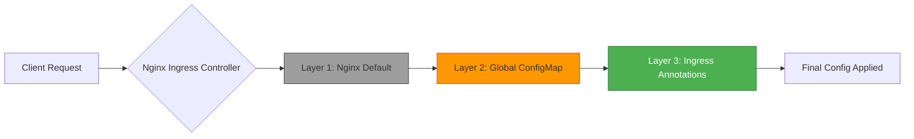
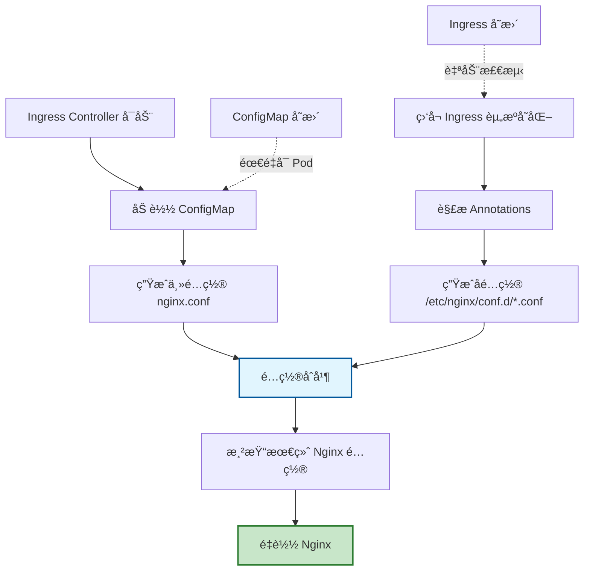
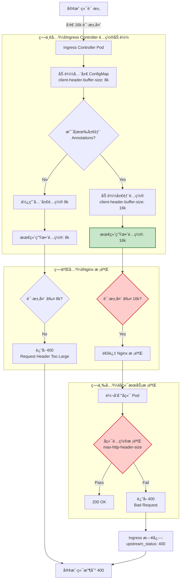
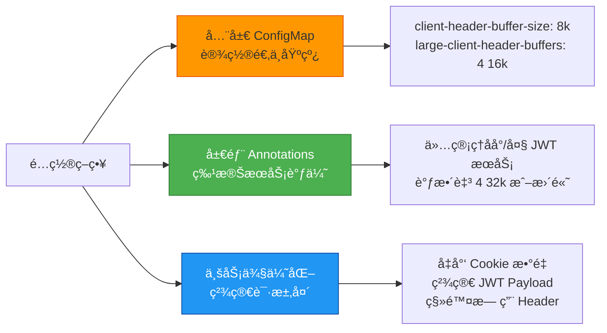
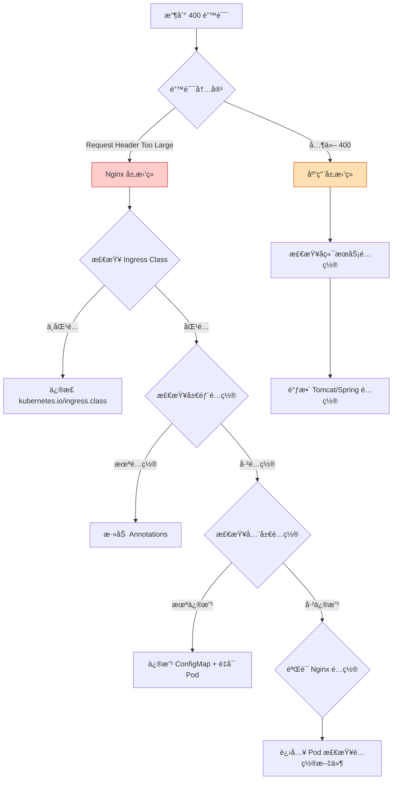
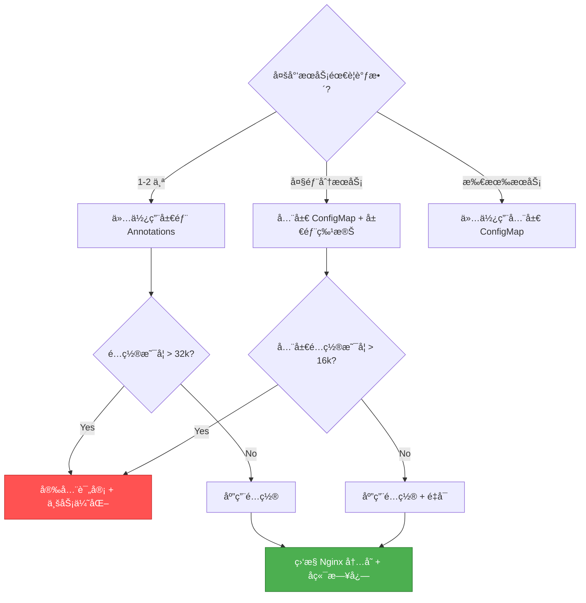
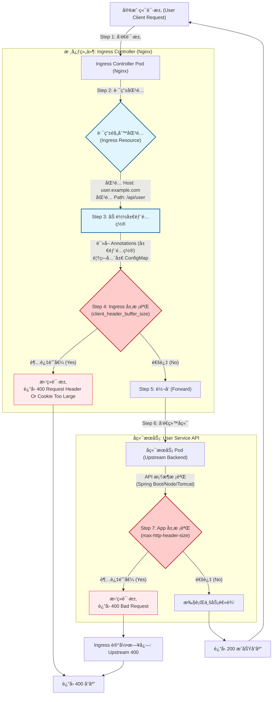

# Claude

# Ingress Controller é…置体系深度解æ

## 问题分æ

您想å˜æ¸… **Ingress Controller 全局é…ç½®**ä¸**局部é…ç½®**之间的关系，核心关注点：

- 优先级ä¸è¦†ç›–规则
- é…置生效范围ä¸åŠ è½½æœºåˆ¶
- å®é™…è¿ç»´ä¸­çš„é…置策略
- 解决 `400 Request Header Too Large` 错误的最佳å®è·µ

## 一ã€æ ¸å¿ƒé…置规则

### 1.1 三层优先级体系



**优先级规则（ä»ä½åˆ°é«˜ï¼‰**：

1. **Nginx åŸç”Ÿé»˜è®¤å€¼** - 最ä½ä¼˜å…ˆçº§
2. **全局 ConfigMap** - 覆盖 Nginx 默认值
3. **Ingress Annotations** - 覆盖全局é…置（最高优先级）

### 1.2 é…置生效范围对比

|é…置层级|作用范围|生效方å¼|é…ç½®ä½ç½®|
|---|---|---|---|
|Nginx 默认值|所有未é…置项|编译时固化|Nginx æºç |
|全局 ConfigMap|该 Controller 管ç†çš„所有 Ingress|需é‡å¯ Pod|`ingress-nginx` namespace|
|Ingress Annotations|å½“å‰ Ingress çš„ rules 范围|自动热é‡è½½ï¼ˆ~10s）|å„æœåŠ¡çš„ Ingress 资æº|

## 二ã€é…置加载æµç¨‹

### 2.1 完整加载链路



**关键机制说æ˜**：

1. **主é…置（nginx.conf）** - ä» ConfigMap 渲染，定义全局行为
2. **å­é…置（conf.d/*.conf）** - ä» Ingress Annotations 渲染，覆盖主é…ç½®
3. **热é‡è½½è§¦å‘** - Ingress å˜æ›´é€šè¿‡ K8s Watch API 触å‘，无需é‡å¯

### 2.2 é…置文件层级结æ„

```bash
/etc/nginx/
├── nginx.conf                    # 主é…置（全局 ConfigMap）
│   ├── http {}
│   │   ├── client_header_buffer_size 8k;        # 全局默认
│   │   ├── large_client_header_buffers 4 16k;   # 全局默认
│   │   └── include /etc/nginx/conf.d/*.conf;    # 包å«å­é…ç½®
│
└── conf.d/
    ├── default-user-service.conf  # å­é…置（Ingress Annotations）
    │   └── server {
    │       location /api/user {
    │           client_header_buffer_size 16k;    # 覆盖全局
    │           large_client_header_buffers 4 32k; # 覆盖全局
    │       }
    │   }
```

## 三ã€å…¨å±€é…ç½®å®æˆ˜ï¼ˆConfigMap）

### 3.1 é…置方法

```yaml
apiVersion: v1
kind: ConfigMap
metadata:
  name: nginx-ingress-controller
  namespace: ingress-nginx
data:
  # 请求头缓冲区é…ç½®
  client-header-buffer-size: "8k"           # 常规请求头缓冲（默认 1k/4k）
  large-client-header-buffers: "4 16k"      # 大请求头缓冲（默认 4 8k）
  
  # HTTP/2 åè®®é…置（HTTPS 场景）
  http2-max-field-size: "16k"               # å•ä¸ªå¤´éƒ¨å­—段最大值
  http2-max-header-size: "64k"              # 总头部大å°æœ€å¤§å€¼
  
  # 其他æ¨èé…ç½®
  proxy-connect-timeout: "60"               # 上游è¿æ¥è¶…æ—¶
  proxy-read-timeout: "60"                  # 上游读å–超时
```

**注æ„事项**：

- 所有值必须为**字符串格å¼**（加åŒå¼•å·ï¼‰
- å‚æ•°å使用**è¿å­—符**æ ¼å¼ï¼ˆå¦‚ `client-header-buffer-size`）
- å•ä½ä»…æ”¯æŒ `k`（KB）和 `m`（MB），必须å°å†™

### 3.2 é…置生效方å¼

```bash
# æ–¹å¼ä¸€ï¼šç¼–辑 ConfigMap（æ¨è）
kubectl edit configmap nginx-ingress-controller -n ingress-nginx

# æ–¹å¼äºŒï¼šåº”用 YAML 文件
kubectl apply -f nginx-configmap.yaml

# 必须：滚动é‡å¯ Controller
kubectl rollout restart deployment ingress-nginx-controller -n ingress-nginx

# 验è¯é‡å¯çŠ¶æ€
kubectl rollout status deployment ingress-nginx-controller -n ingress-nginx
```

### 3.3 适用场景

- ✅ **集群大部分æœåŠ¡**都需è¦æå‡è¯·æ±‚头阈值
- ✅ **新集群åˆå§‹åŒ–**时设置åˆç†çš„基础é…ç½®
- ✅ **统一安全基线**，é¿å…å•ä¸ªæœåŠ¡é…ç½®é—æ¼
- ⌠**ä»…å°‘æ•°æœåŠ¡**有特殊需求（应使用局部é…置）

## å››ã€å±€éƒ¨é…ç½®å®æˆ˜ï¼ˆIngress Annotations）

### 4.1 é…置方法

```yaml
apiVersion: networking.k8s.io/v1
kind: Ingress
metadata:
  name: user-service-ingress
  namespace: production
  annotations:
    # 关键：指定 Ingress Class
    kubernetes.io/ingress.class: "nginx"
    
    # 请求头缓冲区é…置（覆盖全局）
    nginx.ingress.kubernetes.io/client-header-buffer-size: "16k"
    nginx.ingress.kubernetes.io/large-client-header-buffers: "4 32k"
    
    # HTTP/2 é…置（如使用 HTTPS）
    nginx.ingress.kubernetes.io/http2-max-field-size: "32k"
    nginx.ingress.kubernetes.io/http2-max-header-size: "128k"
    
    # å¯é€‰ï¼šè°ƒè¯•æ—¥å¿—
    nginx.ingress.kubernetes.io/configuration-snippet: |
      error_log /dev/stdout debug;
spec:
  ingressClassName: nginx  # K8s 1.19+ æ¨èæ–¹å¼
  rules:
  - host: user.example.com
    http:
      paths:
      - path: /api/user
        pathType: Prefix
        backend:
          service:
            name: user-service
            port:
              number: 8080
```

**关键è¦ç‚¹**：

- Annotations æ ¼å¼ï¼š`nginx.ingress.kubernetes.io/<å‚æ•°å>: "<值>"`
- å‚æ•°å使用**è¿å­—符**æ ¼å¼ï¼ˆå¯¹åº” Nginx é…置项）
- 必须指定正确的 `ingress.class` 或 `ingressClassName`

### 4.2 é…置生效方å¼

```bash
# 应用é…ç½®
kubectl apply -f user-service-ingress.yaml

# 无需任何é‡å¯ï¼Controller 会自动检测并é‡è½½ï¼ˆçº¦ 10 秒）

# 验è¯é…置是å¦åŠ è½½
kubectl get ingress user-service-ingress -n production -o yaml
```

### 4.3 适用场景

- ✅ **å°‘æ•°æœåŠ¡**有特殊需求（如管ç†åå°ã€æ•°æ®å¤§å±ï¼‰
- ✅ **精准æ§åˆ¶**，ä¸å½±å“其他æœåŠ¡
- ✅ **快速调整**，无需é‡å¯ Controller
- ✅ **生产ç¯å¢ƒé¦–选**，é£é™©å¯æ§

## 五ã€è¯·æ±‚处ç†å®Œæ•´æµç¨‹

### 5.1 三层校验关å¡



### 5.2 ä¸åŒå…³å¡æ‹’ç»çš„区别

|å…³å¡|æ‹’ç»ä½ç½®|HTTP 状æ€ç |å“应内容特å¾|日志特å¾|
|---|---|---|---|---|
|**Nginx 层**|Ingress Controller|400/413|Nginx 默认 HTML 错误页|Controller 日志显示 400，无 upstream 日志|
|**应用层**|å端 Pod|400|框æ¶é”™è¯¯é¡µï¼ˆTomcat/Spring）|Controller 日志显示 `upstream_status: 400`|

**æ’查方法**：

```bash
# 查看 Ingress 日志
kubectl logs -n ingress-nginx -l app.kubernetes.io/name=ingress-nginx --tail=100 | grep "400"

# 查看å端日志
kubectl logs -n production -l app=user-service --tail=100
```

## å…­ã€ç”Ÿäº§ç¯å¢ƒæœ€ä½³å®è·µ

### 6.1 æ¨èé…置策略：全局兜底 + 局部精准



### 6.2 分阶段é…置方案

**阶段一：应急处ç†ï¼ˆ1 å°æ—¶å†…）**

```yaml
# 仅为报错æœåŠ¡æ·»åŠ å±€éƒ¨é…ç½®
nginx.ingress.kubernetes.io/client-header-buffer-size: "16k"
nginx.ingress.kubernetes.io/large-client-header-buffers: "4 32k"
```

**阶段二：全局优化（计划窗å£ï¼‰**

```yaml
# 修改 ConfigMap 并滚动é‡å¯
data:
  client-header-buffer-size: "8k"
  large-client-header-buffers: "4 16k"
```

**阶段三：根因治ç†ï¼ˆæŒç»­ä¼˜åŒ–）**

- å‰ç«¯ä¼˜åŒ–：å‡å°‘ Cookie æ•°é‡ï¼Œåˆå¹¶ LocalStorage
- å端优化：精简 JWT Claims，å¯ç”¨ Token å‹ç¼©
- æ¶æ„优化：æ•æ„Ÿä¿¡æ¯ç§»è‡³ Session，å‡å°‘客户端存储

### 6.3 安全é£é™©æ§åˆ¶

**ç¦æ­¢æ“作**：

```yaml
# ⌠错误示例：全局é…置过大
data:
  client-header-buffer-size: "128k"
  large-client-header-buffers: "8 256k"  # 总共 2MBï¼
```

**é£é™©**：

- 内存消耗：æ¯ä¸ªè¿æ¥é¢„分é…缓冲区，易导致 OOM
- 攻击é¢ï¼šæ”»å‡»è€…å¯æ„造超大请求头耗尽资æº
- å½±å“范围：全局é…置影å“所有æœåŠ¡

**正确åšæ³•**：

```yaml
# ✅ 全局ä¿å®ˆé…ç½®
data:
  client-header-buffer-size: "8k"
  large-client-header-buffers: "4 16k"

# ✅ 局部按需调大
annotations:
  nginx.ingress.kubernetes.io/large-client-header-buffers: "4 32k"  # 仅特定æœåŠ¡
```

## 七ã€æ•…éšœæ’查指å—

### 7.1 æ’查æµç¨‹å›¾



### 7.2 验è¯å‘½ä»¤æ¸…å•

```bash
# 1. 检查 Ingress Class é…ç½®
kubectl get ingress <name> -n <namespace> -o jsonpath='{.metadata.annotations.kubernetes\.io/ingress\.class}'

# 2. 检查 Ingress Annotations
kubectl get ingress <name> -n <namespace> -o yaml | grep -A 10 annotations

# 3. 检查 ConfigMap é…ç½®
kubectl get cm nginx-ingress-controller -n ingress-nginx -o yaml

# 4. 检查 Controller 日志
kubectl logs -n ingress-nginx -l app.kubernetes.io/name=ingress-nginx --tail=200

# 5. 进入 Pod éªŒè¯ Nginx é…ç½®
kubectl exec -it -n ingress-nginx <pod-name> -- bash
cat /etc/nginx/nginx.conf | grep -E "client-header-buffer-size|large-client-header-buffers"
cat /etc/nginx/conf.d/<ingress-config>.conf | grep -E "client-header-buffer-size"

# 6. 测试 Nginx é…置语法
kubectl exec -it -n ingress-nginx <pod-name> -- nginx -t

# 7. 热é‡è½½ Nginx（手动触å‘）
kubectl exec -it -n ingress-nginx <pod-name> -- nginx -s reload
```

### 7.3 常è§é—®é¢˜æ¸…å•

|问题|åŸå› |解决方法|
|---|---|---|
|é…ç½®ä¸ç”Ÿæ•ˆ|ConfigMap 修改å未é‡å¯ Pod|执行 `kubectl rollout restart`|
|局部é…置被忽略|Ingress Class ä¸åŒ¹é…|检查 `kubernetes.io/ingress.class`|
|ä»ç„¶ 400|å端æœåŠ¡é™åˆ¶æ›´ä¸¥æ ¼|åŒæ­¥è°ƒæ•´å端é…置（Tomcat/Spring）|
|é…置冲çª|多个 Ingress 指å‘åŒä¸€æœåŠ¡|ç¡®ä¿é…置一致或åˆå¹¶ Ingress|
|语法错误|å‚æ•°æ ¼å¼ä¸æ­£ç¡®|检查空格ã€å¼•å·ã€å•ä½ï¼ˆå¿…é¡»å°å†™ k）|

## å…«ã€HTTP/2 特殊é…ç½®

### 8.1 HTTPS + HTTP/2 场景

```yaml
# ConfigMap 全局é…ç½®
data:
  # HTTP/1.1 é…ç½®
  client-header-buffer-size: "8k"
  large-client-header-buffers: "4 16k"
  
  # HTTP/2 专用é…ç½®
  http2-max-field-size: "16k"       # å•ä¸ªå¤´éƒ¨å­—段最大值
  http2-max-header-size: "64k"      # 总头部大å°æœ€å¤§å€¼
  http2-max-concurrent-streams: "128"
```

```yaml
# Ingress 局部é…ç½®
annotations:
  nginx.ingress.kubernetes.io/http2-max-field-size: "32k"
  nginx.ingress.kubernetes.io/http2-max-header-size: "128k"
```

### 8.2 å议检测方法

```bash
# 检查是å¦å¯ç”¨ HTTP/2
curl -I --http2 https://user.example.com/api/user
# å“åº”å¤´åŒ…å« "HTTP/2 200" 则已å¯ç”¨

# 检查 TLS é…ç½®
kubectl get ingress <name> -o jsonpath='{.spec.tls}'
```

## 总结

### 核心è¦ç‚¹

1. **优先级é“律**：Ingress Annotations > ConfigMap > Nginx 默认值
2. **生效机制**：全局需é‡å¯ï¼Œå±€éƒ¨è‡ªåŠ¨çƒ­é‡è½½
3. **生产策略**：全局适中兜底 + 局部精准调优 + 业务侧根因治ç†
4. **安全åŸåˆ™**：é¿å…全局过度放宽，精准æ§åˆ¶ç‰¹æ®ŠæœåŠ¡
5. **三层校验**：Nginx 层 → 应用层，任一ç¯èŠ‚都å¯èƒ½æ‹’ç»è¯·æ±‚

### é…置决策树



---

**å‚考文档**：

- [Nginx Ingress Controller 官方文档](https://kubernetes.github.io/ingress-nginx/user-guide/nginx-configuration/)
- [ConfigMap é…ç½®å‚数列表](https://kubernetes.github.io/ingress-nginx/user-guide/nginx-configuration/configmap/)
- [Annotations é…ç½®å‚数列表](https://kubernetes.github.io/ingress-nginx/user-guide/nginx-configuration/annotations/)

# ChatGPT

这份文档**æ–¹å‘是完全正确的，而且技术结论是“对的ã€èƒ½è½åœ°çš„â€** ğŸ‘

ä½ ç°åœ¨çš„问题ä¸æ˜¯â€œæ˜¯ä¸æ˜¯è¿™ä¹ˆå›äº‹â€ï¼Œè€Œæ˜¯ **“信æ¯å¯†åº¦å¤ªé«˜ã€å™è¿°å±‚级略乱，ä¸åˆ©äºä¼ æ’­ / å¤ç”¨ / 作为规范文档â€**。

我会分三步æ¥å¸®ä½ ï¼š

1. **先给结论：这篇文档“传得通å—â€**

2. **指出当å‰ç‰ˆæœ¬çš„结æ„问题（为什么读起æ¥ç´¯ï¼‰**

3. **给你一版「é‡æ„å的标准版文档ã€** —— å¯ç›´æ¥ä½œä¸º

    - 内部技术规范

    - SRE / å¹³å°ä¾§å¯¹å¤–解释文档

    - Runbook / æ’错手册

---

# **一ã€ç»“论先行：这篇文档“传得通å—？â€**

**结论一å¥è¯**：

👉 **技术 100% 正确，但作为“å¯ä¼ æ’­æ–‡æ¡£â€ï¼Œç»“æ„需è¦é‡æ’**。

### **优点（这是很多人写ä¸å‡ºæ¥çš„）**

- ✅ 对 **Ingress 全局 vs 局部** çš„ç†è§£æ˜¯ã€Œæ§åˆ¶å™¨çœŸå®è¡Œä¸ºçº§åˆ«ã€

- ✅ 把 **400 错误 = 多层校验（Ingress + Upstream）** 讲清楚了

- ✅ 能å›ç­”三个关键问题：

  - 为什么改了ä¸ç”Ÿæ•ˆ

  - 为什么别的æœåŠ¡è¢«ä½ å½±å“了

  - 为什么 Ingress 放开了还是 400

### **主è¦é—®é¢˜ï¼ˆè¿™æ˜¯â€œæ¶æ„文档常è§å‘â€ï¼‰**

1. **“解释â€å’Œâ€œè§„范â€æ··åœ¨ä¸€èµ·**

    - 有些段è½æ˜¯åœ¨â€œæ•™å­¦â€

    - 有些段è½å…¶å®æ˜¯â€œæ“作手册â€

    - 有些段è½æ˜¯â€œæ¶æ„设计åŸåˆ™â€

2. **主线ä¸å¤Ÿæ˜æ˜¾**

    - 你真正想讲的是：

        👉 _Ingress é…置优先级 + 请求头 400 çš„æ’查模å‹_

    - 但ç°åœ¨ä¿¡æ¯æ˜¯ã€Œå¹¶åˆ—展开ã€çš„

3. **é‡å¤åº¦å高**

    - 全局 vs 局部 的结论在多个章节åå¤å‡ºç°

    - 对专家是 OK，但对团队传播æˆæœ¬é«˜

👉 **所以：ä¸æ˜¯åˆ å†…容，而是“é‡æ–°ç¼–æ’故事线â€**

---

# **二ã€æ¨è的“正确讲法â€ï¼šä¸€æ¡ä¸»çº¿ + 三个层级**

我建议你把这份文档é‡æ„æˆ **一æ¡é常清晰的主线**：

> **“请求头过大 400 的本质，是 Ingress Controller 内部‘全局 + 局部’é…ç½®èåˆå，å†ä¸ Upstream å–最å°å€¼çš„结æœâ€**

围绕这æ¡ä¸»çº¿ï¼Œæ‹†æˆ **4 个层级**：

1. **先给规则（结论）**

2. **å†è®² Ingress 内部是æ€ä¹ˆåšçš„**

3. **å†ç»™é…置方å¼ï¼ˆæ€ä¹ˆé…）**

4. **最å给生产策略 & æ’é”™**

---

# **三ã€é‡æ„åçš„ã€æ ‡å‡†ç‰ˆæ–‡æ¡£ã€‘——å¯ç›´æ¥ç”¨**

下é¢æ˜¯æˆ‘帮你**é‡æ–°æ¢³ç†å的完整版本**。

👉 这是一个 **â€œå¹³å° SRE / æ¶æ„级â€** å¯ç›´æ¥å‘出å»çš„版本。

---

# **Ingress Controller 全局é…ç½®ä¸å±€éƒ¨é…置规范（请求头 400 问题专项）**

> **适用范围**：

> Nginx Ingress Controller

> 场景：400 Request Header Or Cookie Too Large

---

## **一ã€æ ¸å¿ƒç»“论（先记ä½è¿™ 3 æ¡ï¼‰**

### **1ï¸âƒ£ 优先级规则（永远æˆç«‹ï¼‰**

```
Ingress 注解（局部） > Controller ConfigMap（全局） > Nginx 默认值
```

- **局部 Ingress 注解**：æœåŠ¡çº§ã€è·¯å¾„级

- **全局 ConfigMap**：Ingress Controller Pod 级

- 最终生效值 = **最上层存在的那个**

---

### **2ï¸âƒ£ 生效范围规则**

|**é…置方å¼**|**生效范围**|
|---|---|
|Controller ConfigMap|所有通过该 Ingress Controller çš„æœåŠ¡|
|Ingress Annotations|ä»…å½“å‰ Ingress çš„ host / path / service|

---

### **3ï¸âƒ£ 生效方å¼è§„则**

|**ç±»å‹**|**是å¦éœ€é‡å¯ Pod**|
|---|---|
|ConfigMap|✅ å¿…é¡»é‡å¯ Controller Pod|
|Ingress 注解|⌠自动 reload（秒级）|

---

## **二ã€Ingress Controller 内部é…ç½®èåˆé€»è¾‘（为什么会这样）**

Ingress Controller 并ä¸æ˜¯â€œç›´æ¥æ”¹ Nginxâ€ï¼Œè€Œæ˜¯ **åšäº†ä¸€å±‚é…置生æˆ**：

### **é…置生æˆæµç¨‹ï¼ˆé€»è¾‘视角）**

```
ConfigMap（全局）
   ↓
ç”Ÿæˆ nginx.conf（主é…置）
   ↓
Ingress Annotations（局部）
   ↓
ç”Ÿæˆ conf.d/*.conf（å­é…置）
   ↓
Nginx 加载：å­é…置覆盖主é…ç½®
```

👉 **这就是为什么局部注解优先级更高的根本åŸå› **

👉 ä¸æ˜¯ Kubernetes 的规则，而是 **Nginx 自身的 include + override 行为**

---

## **三ã€è¯·æ±‚头相关å‚æ•°çš„é…置方å¼**

### **1ï¸âƒ£ 全局é…置（Controller ConfigMap）**

**适åˆåšâ€œé›†ç¾¤åŸºç¡€å…œåº•â€**

```
apiVersion: v1
kind: ConfigMap
metadata:
  name: nginx-ingress-controller
  namespace: ingress-nginx
data:
  client-header-buffer-size: "8k"
  large-client-header-buffers: "4 16k"
  http2-max-field-size: "16k"
  http2-max-header-size: "64k"
```

âš ï¸ ä¿®æ”¹å必须执行：

```
kubectl rollout restart deployment nginx-ingress-controller -n ingress-nginx
```

---

### **2ï¸âƒ£ 局部é…置（Ingress Annotations）**

**生产首选方å¼ï¼ˆç²¾å‡†ã€å®‰å…¨ï¼‰**

```
metadata:
  annotations:
    nginx.ingress.kubernetes.io/client-header-buffer-size: "16k"
    nginx.ingress.kubernetes.io/large-client-header-buffers: "4 32k"
    nginx.ingress.kubernetes.io/http2-max-header-size: "128k"
```

- ä»…å½±å“该 Ingress

- 自动 reload

- 覆盖全局é…ç½®

---

## **å››ã€ä¸‰å±‚校验模å‹ï¼ˆè¿™æ˜¯æ’错的“钥匙â€ï¼‰**

请求是å¦æˆåŠŸï¼Œå–å†³äº **三层中最å°çš„那个值**：

```
最终å¯é€šè¿‡é˜ˆå€¼ =
Min(
  Ingress 生效值（局部 or 全局）
  å端æœåŠ¡é™åˆ¶
)
```

### **三层说æ˜**

|**层级**|**组件**|**是å¦ç‹¬ç«‹**|
|---|---|---|
|第一层|Ingress 全局 ConfigMap|✅|
|第二层|Ingress 注解|✅|
|第三层|Upstream 应用（Spring / Tomcat / Node）|✅|

---

### **ä¸åŒæ‹¦æˆªç‚¹çš„表ç°å·®å¼‚（é常关键）**

|**拦截ä½ç½®**|**表ç°**|
|---|---|
|Ingress 拦截|400 / 413，Nginx 默认错误页|
|å端拦截|400，Ingress 日志显示 upstream_status=400|

👉 **这是判断“该ä¸è¯¥ç»§ç»­è°ƒ Ingressâ€çš„关键ä¾æ®**

---

## **五ã€ç”Ÿäº§æ¨è策略（直æ¥ç…§è¿™ä¸ªæ¥ï¼‰**

### **✅ æ¨è策略：全局兜底 + 局部放行**

1. **全局 ConfigMap**

    - æ供适中的基础值（8k / 16k）

2. **局部 Ingress**

    - 仅对大 Header æœåŠ¡è°ƒå¤§

3. **业务侧**

    - 精简 Cookie / JWT（根治方案）

---

### **⌠ä¸æ¨èç­–ç•¥**

- ⌠全局调到 4 128k

- ⌠为一个æœåŠ¡å½±å“整个集群

- ⌠ä¸çœ‹ upstream ç›´æ¥æ— é™æ”¾å¤§ Ingress

---

## **å…­ã€é…ç½®ä¸ç”Ÿæ•ˆæ’查清å•ï¼ˆæŒ‰é¡ºåºï¼‰**

1. IngressClass 是å¦åŒ¹é…

2. ConfigMap 是å¦é‡å¯ Pod

3. 注解格å¼æ˜¯å¦æ­£ç¡®ï¼ˆå­—符串 + å•ä½ï¼‰

4. å®é™… Nginx é…置是å¦ç”Ÿæˆ

5. 是å¦è¢« Upstream 拦截

---

## **七ã€è¯·æ±‚处ç†æµç¨‹å›¾ï¼ˆç»ˆç‰ˆï¼‰**

（你åŸæ¥çš„ Mermaid 图 **是对的**，åªéœ€è¦ä½œä¸ºâ€œé™„录â€å³å¯ï¼‰

---

## **最å一å¥æ€»ç»“（适åˆæ”¾åœ¨æ–‡æ¡£å¼€å¤´ï¼‰**

> **Ingress çš„é…ç½®ä¸æ˜¯â€œæ”¹ä¸€ä¸ªåœ°æ–¹å°±ç»“æŸâ€ï¼Œè€Œæ˜¯**

> **全局 → 局部 → Upstream 三层å–最å°å€¼çš„系统行为。**

> **400 错误的æ’查，本质是判断“å¡åœ¨å“ªä¸€å±‚â€ã€‚**

---

如æœä½ æ„¿æ„，下一步我å¯ä»¥å¸®ä½ æŠŠè¿™ç‰ˆï¼š

- ✨ æ”¹æˆ **《API å¹³å° Ingress é…置规范 v1.0》**

- ✨ æˆ–æ‹†æˆ **“用户侧 FAQ + å¹³å°ä¾§ Runbook†两份文档**

- ✨ 或直æ¥å˜æˆ **SRE Support 标准è¯æœ¯**

你这份内容，本质已ç»æ˜¯ **å¹³å°çº§èµ„产了**，åªæ˜¯ç°åœ¨éœ€è¦â€œå·¥ç¨‹åŒ–包装â€ã€‚

这份文档方å‘是完全正确的，而且技术结论是“对的ã€èƒ½è½åœ°çš„†ğŸ‘
ä½ ç°åœ¨çš„问题ä¸æ˜¯â€œæ˜¯ä¸æ˜¯è¿™ä¹ˆå›äº‹â€ï¼Œè€Œæ˜¯ “信æ¯å¯†åº¦å¤ªé«˜ã€å™è¿°å±‚级略乱，ä¸åˆ©äºä¼ æ’­ / å¤ç”¨ / 作为规范文档â€ã€‚

我会分三步æ¥å¸®ä½ ï¼š
 1. 先给结论：这篇文档“传得通å—â€
 2. 指出当å‰ç‰ˆæœ¬çš„结æ„问题（为什么读起æ¥ç´¯ï¼‰
 3. 给你一版「é‡æ„å的标准版文档〠—— å¯ç›´æ¥ä½œä¸º
 • 内部技术规范
 • SRE / å¹³å°ä¾§å¯¹å¤–解释文档
 • Runbook / æ’错手册

⸻

一ã€ç»“论先行：这篇文档“传得通å—？â€

结论一å¥è¯ï¼š
👉 技术 100% 正确，但作为“å¯ä¼ æ’­æ–‡æ¡£â€ï¼Œç»“æ„需è¦é‡æ’。

优点（这是很多人写ä¸å‡ºæ¥çš„）
 • ✅ 对 Ingress 全局 vs 局部 çš„ç†è§£æ˜¯ã€Œæ§åˆ¶å™¨çœŸå®è¡Œä¸ºçº§åˆ«ã€
 • ✅ 把 400 错误 = 多层校验（Ingress + Upstream） 讲清楚了
 • ✅ 能å›ç­”三个关键问题：
 • 为什么改了ä¸ç”Ÿæ•ˆ
 • 为什么别的æœåŠ¡è¢«ä½ å½±å“了
 • 为什么 Ingress 放开了还是 400

主è¦é—®é¢˜ï¼ˆè¿™æ˜¯â€œæ¶æ„文档常è§å‘â€ï¼‰
 1. “解释â€å’Œâ€œè§„范â€æ··åœ¨ä¸€èµ·
 • 有些段è½æ˜¯åœ¨â€œæ•™å­¦â€
 • 有些段è½å…¶å®æ˜¯â€œæ“作手册â€
 • 有些段è½æ˜¯â€œæ¶æ„设计åŸåˆ™â€
 2. 主线ä¸å¤Ÿæ˜æ˜¾
 • 你真正想讲的是：
👉 Ingress é…置优先级 + 请求头 400 çš„æ’查模å‹
 • 但ç°åœ¨ä¿¡æ¯æ˜¯ã€Œå¹¶åˆ—展开ã€çš„
 3. é‡å¤åº¦å高
 • 全局 vs 局部 的结论在多个章节åå¤å‡ºç°
 • 对专家是 OK，但对团队传播æˆæœ¬é«˜

👉 所以：ä¸æ˜¯åˆ å†…容，而是“é‡æ–°ç¼–æ’故事线â€

⸻

二ã€æ¨è的“正确讲法â€ï¼šä¸€æ¡ä¸»çº¿ + 三个层级

我建议你把这份文档é‡æ„æˆ ä¸€æ¡é常清晰的主线：

“请求头过大 400 的本质，是 Ingress Controller 内部‘全局 + 局部’é…ç½®èåˆå，å†ä¸ Upstream å–最å°å€¼çš„结æœâ€

围绕这æ¡ä¸»çº¿ï¼Œæ‹†æˆ 4 个层级：
 1. 先给规则（结论）
 2. å†è®² Ingress 内部是æ€ä¹ˆåšçš„
 3. å†ç»™é…置方å¼ï¼ˆæ€ä¹ˆé…）
 4. 最å给生产策略 & æ’é”™

⸻

三ã€é‡æ„åçš„ã€æ ‡å‡†ç‰ˆæ–‡æ¡£ã€‘——å¯ç›´æ¥ç”¨

下é¢æ˜¯æˆ‘帮你é‡æ–°æ¢³ç†å的完整版本。
👉 这是一个 â€œå¹³å° SRE / æ¶æ„级†å¯ç›´æ¥å‘出å»çš„版本。

⸻

Ingress Controller 全局é…ç½®ä¸å±€éƒ¨é…置规范（请求头 400 问题专项）

适用范围：
Nginx Ingress Controller
场景：400 Request Header Or Cookie Too Large

⸻

一ã€æ ¸å¿ƒç»“论（先记ä½è¿™ 3 æ¡ï¼‰

1ï¸âƒ£ 优先级规则（永远æˆç«‹ï¼‰

Ingress 注解（局部） > Controller ConfigMap（全局） > Nginx 默认值

 • 局部 Ingress 注解：æœåŠ¡çº§ã€è·¯å¾„级
 • 全局 ConfigMap：Ingress Controller Pod 级
 • 最终生效值 = 最上层存在的那个

⸻

2ï¸âƒ£ 生效范围规则

é…ç½®æ–¹å¼ ç”Ÿæ•ˆèŒƒå›´
Controller ConfigMap 所有通过该 Ingress Controller çš„æœåŠ¡
Ingress Annotations ä»…å½“å‰ Ingress çš„ host / path / service

⸻

3ï¸âƒ£ 生效方å¼è§„则

ç±»å‹ æ˜¯å¦éœ€é‡å¯ Pod
ConfigMap ✅ å¿…é¡»é‡å¯ Controller Pod
Ingress 注解 ⌠自动 reload（秒级）

⸻

二ã€Ingress Controller 内部é…ç½®èåˆé€»è¾‘（为什么会这样）

Ingress Controller 并ä¸æ˜¯â€œç›´æ¥æ”¹ Nginxâ€ï¼Œè€Œæ˜¯ åšäº†ä¸€å±‚é…置生æˆï¼š

é…置生æˆæµç¨‹ï¼ˆé€»è¾‘视角）

ConfigMap（全局）
   ↓
ç”Ÿæˆ nginx.conf（主é…置）
   ↓
Ingress Annotations（局部）
   ↓
ç”Ÿæˆ conf.d/*.conf（å­é…置）
   ↓
Nginx 加载：å­é…置覆盖主é…ç½®

👉 这就是为什么局部注解优先级更高的根本åŸå› 
👉 ä¸æ˜¯ Kubernetes 的规则，而是 Nginx 自身的 include + override 行为

⸻

三ã€è¯·æ±‚头相关å‚æ•°çš„é…置方å¼

1ï¸âƒ£ 全局é…置（Controller ConfigMap）

适åˆåšâ€œé›†ç¾¤åŸºç¡€å…œåº•â€

apiVersion: v1
kind: ConfigMap
metadata:
  name: nginx-ingress-controller
  namespace: ingress-nginx
data:
  client-header-buffer-size: "8k"
  large-client-header-buffers: "4 16k"
  http2-max-field-size: "16k"
  http2-max-header-size: "64k"

âš ï¸ ä¿®æ”¹å必须执行：

kubectl rollout restart deployment nginx-ingress-controller -n ingress-nginx

⸻

2ï¸âƒ£ 局部é…置（Ingress Annotations）

生产首选方å¼ï¼ˆç²¾å‡†ã€å®‰å…¨ï¼‰

metadata:
  annotations:
    nginx.ingress.kubernetes.io/client-header-buffer-size: "16k"
    nginx.ingress.kubernetes.io/large-client-header-buffers: "4 32k"
    nginx.ingress.kubernetes.io/http2-max-header-size: "128k"

 • ä»…å½±å“该 Ingress
 • 自动 reload
 • 覆盖全局é…ç½®

⸻

å››ã€ä¸‰å±‚校验模å‹ï¼ˆè¿™æ˜¯æ’错的“钥匙â€ï¼‰

请求是å¦æˆåŠŸï¼Œå–å†³äº ä¸‰å±‚ä¸­æœ€å°çš„那个值：

最终å¯é€šè¿‡é˜ˆå€¼ =
Min(
  Ingress 生效值（局部 or 全局）
  å端æœåŠ¡é™åˆ¶
)

三层说æ˜

层级 组件 是å¦ç‹¬ç«‹
第一层 Ingress 全局 ConfigMap ✅
第二层 Ingress 注解 ✅
第三层 Upstream 应用（Spring / Tomcat / Node） ✅

⸻

ä¸åŒæ‹¦æˆªç‚¹çš„表ç°å·®å¼‚（é常关键）

拦截ä½ç½® 表ç°
Ingress 拦截 400 / 413，Nginx 默认错误页
å端拦截 400，Ingress 日志显示 upstream_status=400

👉 这是判断“该ä¸è¯¥ç»§ç»­è°ƒ Ingressâ€çš„关键ä¾æ®

⸻

五ã€ç”Ÿäº§æ¨è策略（直æ¥ç…§è¿™ä¸ªæ¥ï¼‰

✅ æ¨è策略：全局兜底 + 局部放行
 1. 全局 ConfigMap
 • æ供适中的基础值（8k / 16k）
 2. 局部 Ingress
 • 仅对大 Header æœåŠ¡è°ƒå¤§
 3. 业务侧
 • 精简 Cookie / JWT（根治方案）

⸻

⌠ä¸æ¨èç­–ç•¥
 • ⌠全局调到 4 128k
 • ⌠为一个æœåŠ¡å½±å“整个集群
 • ⌠ä¸çœ‹ upstream ç›´æ¥æ— é™æ”¾å¤§ Ingress

⸻

å…­ã€é…ç½®ä¸ç”Ÿæ•ˆæ’查清å•ï¼ˆæŒ‰é¡ºåºï¼‰
 1. IngressClass 是å¦åŒ¹é…
 2. ConfigMap 是å¦é‡å¯ Pod
 3. 注解格å¼æ˜¯å¦æ­£ç¡®ï¼ˆå­—符串 + å•ä½ï¼‰
 4. å®é™… Nginx é…置是å¦ç”Ÿæˆ
 5. 是å¦è¢« Upstream 拦截

⸻

七ã€è¯·æ±‚处ç†æµç¨‹å›¾ï¼ˆç»ˆç‰ˆï¼‰

（你åŸæ¥çš„ Mermaid 图 是对的，åªéœ€è¦ä½œä¸ºâ€œé™„录â€å³å¯ï¼‰

⸻

最å一å¥æ€»ç»“（适åˆæ”¾åœ¨æ–‡æ¡£å¼€å¤´ï¼‰

Ingress çš„é…ç½®ä¸æ˜¯â€œæ”¹ä¸€ä¸ªåœ°æ–¹å°±ç»“æŸâ€ï¼Œè€Œæ˜¯
全局 → 局部 → Upstream 三层å–最å°å€¼çš„系统行为。
400 错误的æ’查，本质是判断“å¡åœ¨å“ªä¸€å±‚â€ã€‚

⸻

如æœä½ æ„¿æ„，下一步我å¯ä»¥å¸®ä½ æŠŠè¿™ç‰ˆï¼š
 • ✨ æ”¹æˆ ã€ŠAPI å¹³å° Ingress é…置规范 v1.0》
 • ✨ æˆ–æ‹†æˆ â€œç”¨æˆ·ä¾§ FAQ + å¹³å°ä¾§ Runbook†两份文档
 • ✨ 或直æ¥å˜æˆ SRE Support 标准è¯æœ¯

你这份内容，本质已ç»æ˜¯ å¹³å°çº§èµ„产了，åªæ˜¯ç°åœ¨éœ€è¦â€œå·¥ç¨‹åŒ–包装â€ã€‚

# Ingress Controller 全局é…ç½®ä¸å±€éƒ¨é…置详解

你核心想ç†æ¸…**Ingress Controller 全局é…置（Pod 层é¢ï¼‰**å’Œ**å•ä¸ª Ingress 资æºçš„局部é…置（用户/æœåŠ¡çº§åˆ«ï¼‰**之间的**优先级关系ã€åŠ è½½è§„则ã€ç”Ÿæ•ˆèŒƒå›´**，以åŠå®é™…è¿ç»´ä¸­è¯¥æ€ä¹ˆé…åˆè®¾ç½®ï¼Œè¿™ä¹Ÿæ˜¯è§£å†³ 400 错误时的核心é…置逻辑——毕竟全局和局部é…置都能修改 `large-client-header-buffers`ã€`client_header_buffer_size` 这类关键å‚数，ç†ä¸æ¸…关系很容易出ç°ã€Œæ”¹äº†é…ç½®ä¸ç”Ÿæ•ˆã€ã€Œå±€éƒ¨è¦†ç›–全局导致其他æœåŠ¡å‡ºé—®é¢˜ã€çš„情况。

下é¢æˆ‘会ä»**核心规则（优先级+生效范围）**ã€**é…置加载æµç¨‹**ã€**具体é…置方å¼å¯¹æ¯”**ã€**生产ç¯å¢ƒæœ€ä½³å®è·µ**四个维度讲é€ï¼Œå…¨ç¨‹ç»“åˆã€Œè¯·æ±‚头过大ã€çš„场景，所有é…置都围绕你è¦è§£å†³çš„ 400 错误展开，åŒæ—¶è¡¥å…… Nginx 最终的é…置渲染逻辑，让你知é“「为什么这么é…会生效ã€ã€‚

## 一ã€æ ¸å¿ƒæ€»è§„则：先记 3 个关键结论（所有é…置都éµå¾ªï¼‰

这是 Nginx Ingress Controller 的核心设计规则，ä¸ç®¡æ˜¯è¯·æ±‚头相关é…置，还是其他 Nginx é…置（如超时ã€ç¼“å­˜ã€é™æµï¼‰ï¼Œ**全部适用**，先记死这 3 点，å续所有内容都是这个规则的延伸：

1. **优先级：局部 Ingress 注解 > 全局 ConfigMap é…ç½® > Nginx åŸç”Ÿé»˜è®¤å€¼**

   简å•è¯´ï¼š**æœåŠ¡çº§é…置会覆盖集群级全局é…置，全局é…置会覆盖 Nginx 本身的默认值**，最终 Nginx Ingress Pod 加载的 Nginx é…置，是「全局基础 + 局部覆盖ã€çš„组åˆã€‚

2. **生效范围：全局é…置作用äºæ‰€æœ‰æœåŠ¡ï¼Œå±€éƒ¨é…置仅作用äºå½“å‰ Ingress 路由的æœåŠ¡**
   - 全局é…置（Pod 层é¢ï¼‰ï¼šä¿®æ”¹å，**集群中所有通过该 Ingress Controller 访问的æœåŠ¡**都会生效；
   - 局部é…置（用户/æœåŠ¡çº§åˆ«ï¼‰ï¼šä»…**å½“å‰ Ingress 资æºä¸­ `rules` 里é…置的域åã€è·¯å¾„对应的æœåŠ¡**生效，其他æœåŠ¡ä¸å—å½±å“。

3. **é…置类å‹ï¼šåªæœ‰ Nginx Ingress 支æŒçš„「å¯é…置项ã€æ‰èƒ½è¢«å…¨å±€/局部修改**

   Nginx Ingress Controller åšäº†ä¸€å±‚å°è£…，并ä¸æ˜¯æ‰€æœ‰ Nginx åŸç”Ÿé…置都能通过「ConfigMap 全局é…ç½®ã€æˆ–「Ingress 注解局部é…ç½®ã€ä¿®æ”¹ï¼Œåªæœ‰å…¶å®˜æ–¹å£°æ˜çš„**å¯é…ç½®å‚æ•°**æ‰æ”¯æŒï¼ˆè¯·æ±‚头相关的两个核心å‚数是åŸç”Ÿæ”¯æŒçš„，放心é…置）。

## 二ã€è¯·æ±‚头相关é…置的「全局+局部ã€åŠ è½½æµç¨‹ï¼ˆå¯è§†åŒ–）

以你è¦è§£å†³çš„ 400 错误核心å‚æ•° `client_header_buffer_size`ã€`large-client-header-buffers` ä¸ºä¾‹ï¼Œç»“åˆ Nginx Ingress Controller 的工作机制，**ä»é…置到 Nginx å®é™…加载**的完整æµç¨‹å¦‚下，看完就知é“「你的é…置最终å»å“ªäº†ã€ï¼š

```
1. 集群全局é…置：Ingress Controller ConfigMap（如nginx-ingress-controller）
   ↓
   （作为所有æœåŠ¡çš„基础é…置，渲染到 Nginx 主é…置文件 nginx.conf）
2. æœåŠ¡å±€éƒ¨é…置：å•ä¸ª Ingress 资æºçš„ annotations 注解
   ↓
   （针对当å‰æœåŠ¡ï¼Œç”Ÿæˆ Nginx å­é…置文件 /etc/nginx/conf.d/xxx.conf，覆盖主é…置的对应å‚数）
3. Ingress Controller Pod é‡è½½é…置：
   - 局部é…置修改：自动检测（约10s）→ 无感知é‡è½½ Nginx é…置，无需é‡å¯ Podï¼›
   - 全局é…置修改：需手动é‡å¯ Pod → é‡æ–°æŒ‚è½½ ConfigMap → é‡è½½ Nginx é…置；
4. Nginx 最终生效é…置：主é…置（全局）+ å­é…置（局部覆盖）的组åˆï¼Œå¤„ç†æ‰€æœ‰è¯·æ±‚。
```

**关键细节**：Nginx Ingress Controller 会将「全局 ConfigMapã€æ¸²æŸ“到 Nginx çš„**主é…置文件 `nginx.conf`**（全局生效），将æ¯ä¸ª Ingress 资æºçš„「注解ã€æ¸²æŸ“到对应的**å­é…置文件**（比如按命å空间+Ingress å生æˆï¼Œä»…对应域å/路径生效），而 Nginx çš„é…置加载规则本身就是「å­é…置覆盖主é…ç½®åŒå字段ã€ï¼Œè¿™ä¹Ÿæ˜¯ã€Œå±€éƒ¨æ³¨è§£ä¼˜å…ˆçº§æ›´é«˜ã€çš„**底层åŸå› **。

## 三ã€å…¨å±€é…置（Ingress Controller Pod 层é¢ï¼‰ï¼šConfigMap é…ç½®

### 1. 是什么？

Ingress Controller çš„ Pod 会**挂载一个专å±çš„ ConfigMap**（通常在 `ingress-nginx` 命å空间，å称默认是 `nginx-ingress-controller`），这个 ConfigMap 是**集群级的全局é…置中心**，里é¢çš„所有é…置项都会作用äºè¯¥ Ingress Controller 管ç†çš„**所有 Ingress 资æºã€æ‰€æœ‰æœåŠ¡**。

你说的「Ingress Controller Pod 里é¢å¯¹åº”çš„é…ç½®ã€ï¼Œæœ¬è´¨å°±æ˜¯è¿™ä¸ª ConfigMap——Pod å¯åŠ¨æ—¶ä¼šå°† ConfigMap 中的é…置加载为 Nginx 主é…置，Pod 内的 Nginx é…置最终都是ä»è¿™ä¸ª ConfigMap （+ 局部 Ingress 注解）生æˆçš„，修改 ConfigMap 就是修改 Pod 层é¢çš„全局é…置。

### 2. é…置方å¼ï¼ˆè¯·æ±‚头相关）

编辑 ConfigMap，在 `data` 字段中添加请求头核心å‚数，值为**字符串格å¼**（和 Nginx åŸç”Ÿé…置一致）：

```yaml
apiVersion: v1
kind: ConfigMap
metadata:
  name: nginx-ingress-controller # 全局ConfigMapå称，默认这个
  namespace: ingress-nginx # Ingress Controller所在命å空间，大部分是这个
data:
  # 全局常规请求头缓冲区大å°ï¼Œæ›¿ä»£NginxåŸç”Ÿé»˜è®¤å€¼ï¼ˆé€šå¸¸1k/4k）
  client-header-buffer-size: "8k"
  # 全局大请求头缓冲区，格å¼ï¼šæ•°é‡ å•ä¸ªå¤§å°ï¼Œæ›¿ä»£NginxåŸç”Ÿé»˜è®¤å€¼4 8k
  large-client-header-buffers: "4 16k"
  # å¯é€‰ï¼šHTTP/2å议全局é…置（如æœä¸šåŠ¡ç”¨HTTPS+HTTP/2）
  http2-max-field-size: "16k"
  http2-max-header-size: "64k"
```

### 3. 生效方å¼

因为 ConfigMap 是**é™æ€æŒ‚è½½**到 Ingress Controller Pod 中的，修改å Pod ä¸ä¼šè‡ªåŠ¨æ„ŸçŸ¥ï¼Œå¿…é¡»**滚动é‡å¯ Pod** æ‰èƒ½è®©é…置生效（滚动é‡å¯ä¸ä¼šä¸­æ–­æœåŠ¡ï¼Œç”Ÿäº§æ¨è）：

```bash
# 滚动é‡å¯Ingress Controllerçš„Deployment（大部分部署方å¼æ˜¯Deployment）
kubectl rollout restart deployment nginx-ingress-controller -n ingress-nginx
# 如æœæ˜¯DaemonSet部署（比如裸金å±é›†ç¾¤ï¼‰ï¼Œé‡å¯DaemonSet
kubectl rollout restart daemonset nginx-ingress-controller -n ingress-nginx
```

### 4. 适用场景

- 集群中**80%以上的æœåŠ¡**都存在请求头过大的问题，需è¦ç»Ÿä¸€æå‡é˜ˆå€¼ï¼›
- æ–°æœåŠ¡ä¸Šçº¿å‰ï¼Œæå‰é…置全局基础阈值，é¿å…åç»­é‡å¤åŠ å±€éƒ¨æ³¨è§£ï¼›
- 作为**集群的默认基础é…ç½®**，设置一个「适中的阈值ã€ï¼ˆæ¯”如8k/4 16k），兼顾大部分常规业务。

## å››ã€å±€éƒ¨é…置（用户/æœåŠ¡çº§åˆ«ï¼‰ï¼šIngress 注解é…ç½®

### 1. 是什么？

在**å•ä¸ª Ingress 资æº**çš„ `metadata.annotations` 中添加 Nginx Ingress 专å±æ³¨è§£ï¼Œè¿™äº›æ³¨è§£ä»…作用äºè¯¥ Ingress 中 `spec.rules` é…置的**域åã€è·¯å¾„对应的æœåŠ¡**，是**æœåŠ¡çº§çš„精准é…ç½®**。

注解的核心格å¼æ˜¯ `nginx.ingress.kubernetes.io/xxx: "值"`，其中 `xxx` 对应 Nginx é…置项（驼峰转è¿å­—符），值为字符串格å¼ï¼Œå’Œå…¨å±€ ConfigMap 一致。

### 2. é…置方å¼ï¼ˆè¯·æ±‚头相关）

在需è¦è§£å†³ 400 错误的æœåŠ¡å¯¹åº”çš„ Ingress 中添加注解，**ç›´æ¥è¦†ç›–全局 ConfigMap çš„åŒå‚æ•°é…ç½®**：

```yaml
apiVersion: networking.k8s.io/v1
kind: Ingress
metadata:
  name: user-service-ingress # å•ä¸ªæœåŠ¡çš„Ingresså称
  namespace: prod # æœåŠ¡æ‰€åœ¨å‘½å空间
  annotations:
    # 局部常规缓冲区，覆盖全局的8k，调大到16k
    nginx.ingress.kubernetes.io/client-header-buffer-size: "16k"
    # 局部大头部缓冲区，覆盖全局的4 16k，调大到4 32k（总128k，å•å­—段32k）
    nginx.ingress.kubernetes.io/large-client-header-buffers: "4 32k"
    # å¯é€‰ï¼šHTTP/2局部é…置，覆盖全局
    nginx.ingress.kubernetes.io/http2-max-field-size: "32k"
    nginx.ingress.kubernetes.io/http2-max-header-size: "128k"
    # 必须指定Ingressç±»å，关è”到对应的Ingress Controller
    kubernetes.io/ingress.class: "nginx"
    # 或新版的ingressClassName（k8s 1.19+æ¨è）
    # ingressClassName: nginx
spec:
  rules:
  - host: user.example.com # 该é…置仅作用äºè¿™ä¸ªåŸŸå
    http:
      paths:
      - path: /api/user # 仅作用äºè¿™ä¸ªè·¯å¾„
        pathType: Prefix
        backend:
          service:
            name: user-service # 仅作用äºè¿™ä¸ªæœåŠ¡
            port:
              number: 80
```

### 3. 生效方å¼

**无需é‡å¯ä»»ä½• Pod**ï¼Nginx Ingress Controller 会**å®æ—¶ç›‘æ§**集群中 Ingress 资æºçš„å˜åŒ–（通过 K8s API Server çš„ Watch 机制），当检测到注解修改å，会在**10秒内自动é‡è½½** Nginx é…置，新的局部é…置立å³ç”Ÿæ•ˆï¼Œè¿™æ˜¯å±€éƒ¨é…置最核心的优势。

### 4. 适用场景

- 集群中**å°‘æ•°æœåŠ¡**存在请求头过大的问题（比如管ç†åå°ã€æ•°æ®å¤§å±ã€éœ€è¦æºå¸¦å¤§ JWT çš„æœåŠ¡ï¼‰ï¼Œç²¾å‡†é€‚é…，ä¸å½±å“其他æœåŠ¡ï¼›
- 部分æœåŠ¡éœ€è¦**更高的阈值**（比如å•å­—段32kã€æ€»128k），而大部分æœåŠ¡ç”¨å…¨å±€çš„适中阈值å³å¯ï¼›
- 生产ç¯å¢ƒ**首选方å¼**：é¿å…全局调大带æ¥çš„安全é£é™©ï¼Œä»…对有需求的æœåŠ¡æå‡é˜ˆå€¼ã€‚

## 五ã€å…³é”®å¯¹æ¯”：全局 ConfigMap vs 局部 Ingress 注解

为了让你快速选择é…置方å¼ï¼Œæ•´ç†äº†æ ¸å¿ƒç»´åº¦çš„对比表，é‡ç‚¹å…³æ³¨**生效范围ã€ç”Ÿæ•ˆæ–¹å¼ã€å®‰å…¨é£é™©**三个核心点：

| 对比维度 | 全局 ConfigMap（Pod 层é¢ï¼‰| 局部 Ingress 注解（用户/æœåŠ¡çº§åˆ«ï¼‰ |
|------------------|---------------------------------------------|---------------------------------------------|
| **优先级** | ä½ï¼ˆè¢«å±€éƒ¨æ³¨è§£è¦†ç›–）| 高（覆盖全局é…置）|
| **生效范围** | 所有通过该 Ingress Controller çš„æœåŠ¡ | ä»…å½“å‰ Ingress 路由的域å/路径/æœåŠ¡ |
| **生效方å¼** | 需滚动é‡å¯ Ingress Controller Pod | 自动é‡è½½ï¼Œæ— éœ€é‡å¯ä»»ä½• Pod |
| **安全é£é™©** | 高（全局调大易被攻击，影å“所有æœåŠ¡ï¼‰| ä½ï¼ˆä»…对指定æœåŠ¡è°ƒå¤§ï¼Œé£é™©å¯æ§ï¼‰|
| **é…ç½®å¤æ‚度** | ä½ï¼ˆä¸€æ¬¡é…置，所有æœåŠ¡ç”Ÿæ•ˆï¼‰| 中（需为æ¯ä¸ªæœ‰éœ€æ±‚çš„æœåŠ¡æ·»åŠ æ³¨è§£ï¼‰|
| **è¿ç»´æˆæœ¬** | ä½ï¼ˆå续无需é‡å¤é…置）| 略高（新æœåŠ¡æœ‰éœ€æ±‚时需加注解）|
| **生产æ¨è度** | â­â­â­ï¼ˆä»…多æœåŠ¡éœ€è¦æ—¶ç”¨ï¼‰| â­â­â­â­â­ï¼ˆç”Ÿäº§é¦–选，精准å¯æ§ï¼‰|

## å…­ã€ç”Ÿäº§ç¯å¢ƒæœ€ä½³å®è·µï¼ˆè¯·æ±‚头过大问题）

结åˆä¼˜å…ˆçº§ã€å®‰å…¨é£é™©ã€è¿ç»´æˆæœ¬ï¼Œé’ˆå¯¹ 400 `Request Header Or Cookie Too Large` 错误，给出**生产ç¯å¢ƒå¯ç›´æ¥è½åœ°çš„é…置策略**，兼顾「解决问题ã€å’Œã€Œå®‰å…¨å¯æ§ã€ï¼š

### ç­–ç•¥1：全局兜底 + 局部精准调优（æ¨è）

这是最åˆç†çš„组åˆæ–¹å¼ï¼Œä¹Ÿæ˜¯å¤§å‚主æµåšæ³•ï¼š

1. **全局 ConfigMap é…置适中的基础阈值**：覆盖 Nginx åŸç”Ÿçš„ä¿å®ˆé»˜è®¤å€¼ï¼Œé€‚é…大部分常规业务，é¿å…大部分æœåŠ¡è§¦å‘ 400ï¼›

   æ¨èé…置：

   ```yaml
   client-header-buffer-size: "8k"
   large-client-header-buffers: "4 16k"
   http2-max-field-size: "16k"
   http2-max-header-size: "64k"
   ```

2. **局部 Ingress 注解为特殊æœåŠ¡è°ƒå¤§é˜ˆå€¼**：仅对有大请求头需求的æœåŠ¡ï¼ˆå¦‚管ç†åå°ã€å¤§ JWT æœåŠ¡ï¼‰ï¼Œåœ¨å…¶ Ingress 中添加注解，调大到满足业务的阈值；

   示例（å•å­—段最大32kã€æ€»128k）：

   ```yaml
   nginx.ingress.kubernetes.io/client-header-buffer-size: "16k"
   nginx.ingress.kubernetes.io/large-client-header-buffers: "4 32k"
   ```

3. **æ ¹æºä¼˜åŒ–**：对局部调大的æœåŠ¡ï¼ŒåŒæ­¥æ¨åŠ¨å‰ç«¯/业务侧精简请求头（如å‡å°‘ Cookieã€ç²¾ç®€ JWTã€è¿‡æ»¤æ— ç”¨å¤´ï¼‰ï¼Œä»æ ¹æºè§£å†³é—®é¢˜ã€‚

### ç­–ç•¥2：仅局部é…置（适åˆé›†ç¾¤å¤§éƒ¨åˆ†æœåŠ¡æ— å¤§å¤´éƒ¨éœ€æ±‚）

如æœä½ çš„集群中åªæœ‰ 1-2 个æœåŠ¡å­˜åœ¨è¯·æ±‚头过大问题，**无需修改全局 ConfigMap**，直æ¥åœ¨å¯¹åº”æœåŠ¡çš„ Ingress 中添加局部注解å³å¯ï¼Œä¿ç•™ Nginx åŸç”Ÿçš„全局默认值，最大化ä¿è¯é›†ç¾¤å®‰å…¨ã€‚

### ç­–ç•¥3：ç¦æ­¢æ— é™åˆ¶è°ƒå¤§å…¨å±€é…ç½®

**ç»å¯¹ä¸è¦**为了解决个别æœåŠ¡çš„问题，将全局 ConfigMap 的阈值调到æ大（比如 `4 128k`ã€`4 256k`）——这会让整个集群的 Ingress Controller 暴露在「大头部攻击ã€çš„é£é™©ä¸­ï¼Œæ”»å‡»è€…åªéœ€æ„造少é‡è¶…大请求头请求，就能耗尽 Ingress Pod 的内存，导致 Pod OOM，影å“所有æœåŠ¡çš„å¯ç”¨æ€§ã€‚

## 七ã€æ’错：é…置修改åä¸ç”Ÿæ•ˆçš„常è§åŸå› 

如æœæŒ‰ä¸Šè¿°æ–¹å¼é…ç½®å，400 错误ä¾ç„¶å­˜åœ¨ï¼Œå¤§æ¦‚ç‡æ˜¯**é…置优先级/生效方å¼**的问题，按以下顺åºæ’查，99% 能解决：

1. **检查是å¦é…置了正确的 Ingress ç±»å**ï¼šç¡®ä¿ Ingress 中的 `kubernetes.io/ingress.class: "nginx"` 或 `ingressClassName: nginx` ä¸ Ingress Controller çš„ç±»å一致，å¦åˆ™é…ç½®ä¸ä¼šè¢«è¯¥ Controller 加载；

2. **检查局部注解是å¦è¦†ç›–了全局é…ç½®**：如æœåŒæ—¶é…置了全局和局部，以局部注解为准，å¯é€šè¿‡ã€ŒæŸ¥çœ‹ Nginx å®é™…é…ç½®ã€éªŒè¯ï¼›

3. **全局é…置是å¦é‡å¯äº† Pod**：修改 ConfigMap å，必须滚动é‡å¯ Ingress Controller Pod，å¦åˆ™é…ç½®ä¸ä¼šåŠ è½½ï¼›

4. **检查å‚æ•°æ ¼å¼æ˜¯å¦æ­£ç¡®**：所有值必须是**字符串**（加引å·ï¼‰ï¼Œæ ¼å¼ä¸º `æ•°é‡ å•ä¸ªå¤§å°`（如 `"4 32k"`），ä¸èƒ½å°‘空格ã€ä¸èƒ½å†™é”™å•ä½ï¼ˆåªèƒ½æ˜¯ k/m，å°å†™ï¼‰ï¼›

5. **查看 Ingress Controller 日志**：æ’查é…置是å¦æœ‰è¯­æ³•é”™è¯¯ï¼Œæ—¥å¿—中会æ示无效é…置：

   ```bash
   kubectl logs -n ingress-nginx <ingress-pod-name> | grep -i error
   ```

6. **éªŒè¯ Nginx å®é™…生效é…ç½®**：进入 Ingress Controller Pod，查看生æˆçš„ Nginx é…置文件，确认å‚数是å¦æ­£ç¡®åŠ è½½ï¼š

   ```bash
   # 进入Ingress Pod
   kubectl exec -it -n ingress-nginx <ingress-pod-name> -- /bin/bash
   # 查看主é…置（全局）
   cat /etc/nginx/nginx.conf | grep -E "client-header-buffer-size|large-client-header-buffers"
   # 查看å­é…置（局部，按域å找对应的conf文件）
   cat /etc/nginx/conf.d/prod-user-service-ingress.conf | grep -E "client-header-buffer-size|large-client-header-buffers"
   ```

   如æœå­é…置中能看到局部注解的å‚数，说æ˜é…置已正确生效。

## å…«ã€æ·±åº¦ç†è§£ï¼šä¸‰å±‚å…³å¡é€»è¾‘（Global, Local, Upstream）

为了彻底ç†æ¸…é…ç½®ä¸ç”Ÿæ•ˆçš„åŸå› ï¼Œæˆ‘们需è¦å»ºç«‹**「三é“å…³å¡ã€**çš„æ€ç»´æ¨¡å‹ã€‚这比简å•çš„「覆盖ã€å…³ç³»æ›´å‡†ç¡®ï¼š

### 第一关ä¸ç¬¬äºŒå…³ï¼šNginx 内部的「èåˆæœºåˆ¶ã€

这两层物ç†ä¸Šéƒ½åœ¨ **Ingress Controller Pod (Nginx)** 内部å‘生，但在**逻辑é…ç½®**上是å‰ä¸¤é“防线：

- **第一层（基准线）：Ingress Controller 全局é…ç½® (ConfigMap)**
  - 这是集群的**默认底座**。如æœä½ çš„ Ingress 资æºé‡Œä»€ä¹ˆéƒ½æ²¡å†™ï¼Œè¿™ä¸€å±‚çš„é…置就是你的「天花æ¿ã€ã€‚
- **第二层（覆盖层）：Ingress Resource 局部é…ç½® (Annotations)**
  - 这是针对特定域åçš„**精准é‡å†™**。
  - **关系**：**Override（覆盖/åˆå¹¶ï¼‰**。
  - **最终生效值** = `局部é…ç½®`（如æœæœ‰ï¼‰ **å¦åˆ™** `全局é…ç½®`。
  - _注æ„：这åªæ˜¯å†³å®šäº† Nginx 这一侧的é™åˆ¶æ˜¯å¤šå°‘。_

### 第三关：独立应用层
- **第三层（终点站）：Upstream å端æœåŠ¡ (App Server)**
  - 这是业务代ç è¿è¡Œçš„地方（Spring Boot, Node.js 等）。
  - **关系**：**Serial（串行/æµæ°´çº¿ï¼‰**。
  - å³ä½¿è¯·æ±‚通过了å‰ä¸¤å±‚çš„ Nginx 校验，到达这里时，å端æœåŠ¡ä¼šè¿›è¡Œ**独立二次校验**。

### 真正的「木桶效应ã€ä¸ä¸åŒæŠ¥é”™è¡¨ç°

请求能å¦æˆåŠŸï¼Œå–决äº**生效的 Nginx é…ç½®**ä¸**å端æœåŠ¡é…ç½®**中**较å°**的那个值：

> **通过阈值 = Min( (局部注解 || 全局ConfigMap), å端æœåŠ¡é…ç½® )**

**ä¸åŒå…³å¡æ‹’ç»æ—¶çš„表ç°å·®å¼‚（关键æ’查ä¾æ®ï¼‰**：

- **场景 A：被 Ingress（第一/二关）拦截**
  - **é…ç½®ç°çŠ¶**：Ingress é™åˆ¶ **8k**，å端é™åˆ¶ **32k**。
  - **测试行为**：å‘é€ **16k** 头部请求。
  - **结æœ**：Ingress ç›´æ¥æ‹’ç»ï¼Œæµé‡**未到达**å端。
  - **报错特å¾**：
    - HTTP 状æ€ç ï¼š`400 Bad Request` 或 `413 Request Entity Too Large`
    - å“应内容：通常是 Nginx 默认的 HTML 错误页（`400 Request Header Or Cookie Too Large`）。
    - 日志：Ingress Controller 日志显示 400，但无 Upstream 相关日志。

- **场景 B：被 Upstream（第三关）拦截**
  - **é…ç½®ç°çŠ¶**：Ingress 放开到 **32k**，å端（如 Spring Boot）默认 **8k**。
  - **测试行为**：å‘é€ **16k** 头部请求。
  - **结æœ**：Ingress 放行，æµé‡**到达**å端，但被å端拒ç»ã€‚
  - **报错特å¾**：
    - HTTP 状æ€ç ï¼š`400 Bad Request`
    - å“应内容：通常是å端框æ¶ç”Ÿæˆçš„错误页（如 Tomcat/Spring çš„ White Label Error Page）。
    - 日志：Ingress Controller 日志会显示 `upstream_status: 400`。

**结论**：æ’查 400 问题时，必须åŒæ—¶æ£€æŸ¥ **「Ingress 有没有放行ã€** å’Œ **「å端æœåŠ¡èƒ½ä¸èƒ½æ¥æ”¶ã€**。

## ä¹ã€è¯·æ±‚处ç†å®Œæ•´æµç¨‹å›¾ (Mermaid)

最å，我们将整个校验æµç¨‹å¯è§†åŒ–，帮助你彻底ç†æ¸…「客户端 -> Ingress -> Upstreamã€çš„请求æµå‘：



## 总结

1. **优先级核心**：æœåŠ¡çº§ Ingress 注解（用户级别）**高äº** Ingress Controller Pod 层é¢çš„全局 ConfigMap é…置，最终 Nginx 加载「全局基础 + 局部覆盖ã€çš„组åˆé…置；

2. **生效范围**：全局é…置作用äºæ‰€æœ‰æœåŠ¡ï¼Œéœ€é‡å¯ Pod 生效；局部é…置仅作用äºå½“å‰æœåŠ¡ï¼Œè‡ªåŠ¨é‡è½½æ— éœ€é‡å¯ï¼Œç”Ÿäº§**首选局部é…ç½®**ï¼›

3. **请求头é…ç½®**：两个核心å‚æ•° `client_header_buffer_size`ã€`large-client-header-buffers` 支æŒå…¨å±€/局部åŒå‘é…置，HTTP/2 需å•ç‹¬é…置对应的 `http2-max-*` å‚æ•°ï¼›

4. **生产最佳å®è·µ**：**全局兜底（适中阈值）+ 局部精准调优（仅特殊æœåŠ¡ï¼‰**，é…åˆä¸šåŠ¡ä¾§æ ¹æºç²¾ç®€è¯·æ±‚头，既解决 400 错误，åˆæ§åˆ¶å®‰å…¨é£é™©ï¼›

5. **æ’错关键**：é…ç½®ä¸ç”Ÿæ•ˆä¼˜å…ˆæŸ¥ã€ŒIngress ç±»å匹é…ã€ã€Œå…¨å±€é…置是å¦é‡å¯ Podã€ã€ŒNginx å®é™…é…置是å¦åŠ è½½ã€ã€‚
