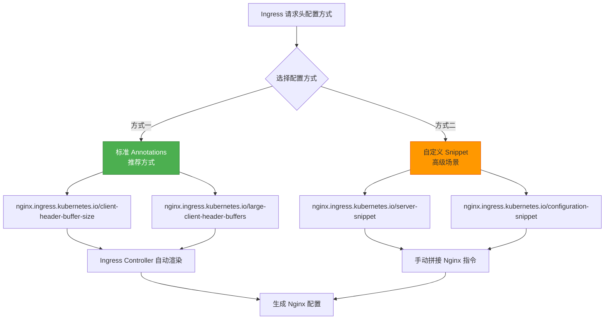
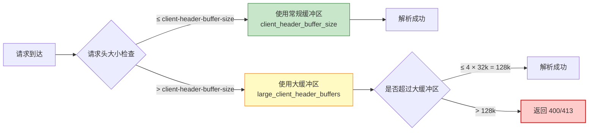
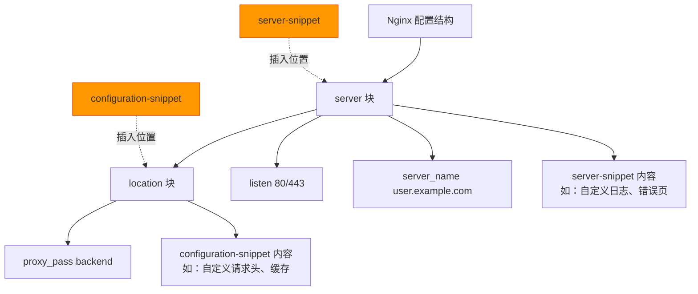
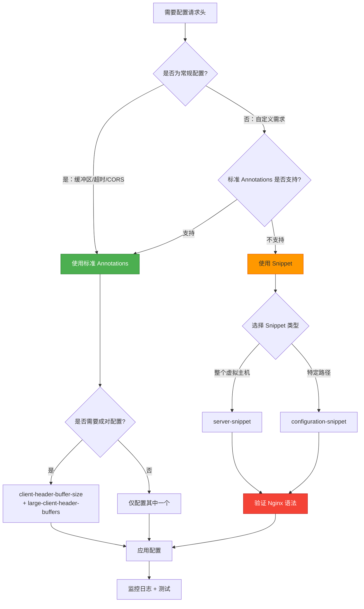
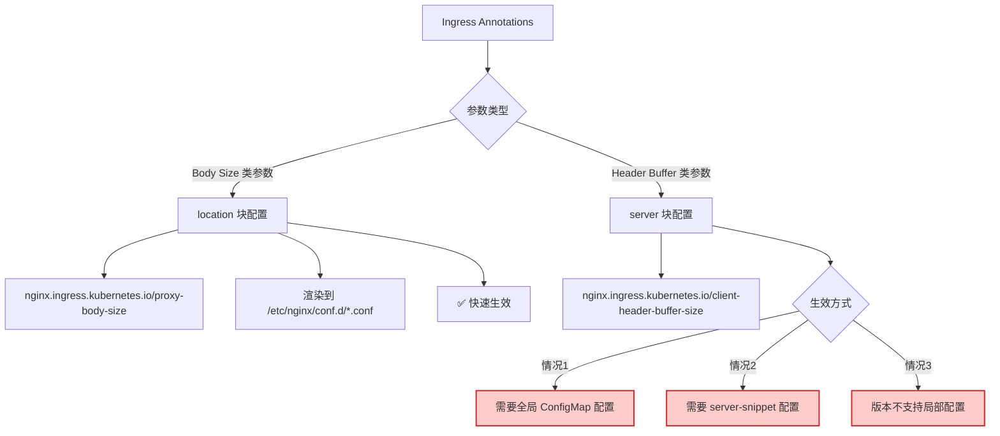
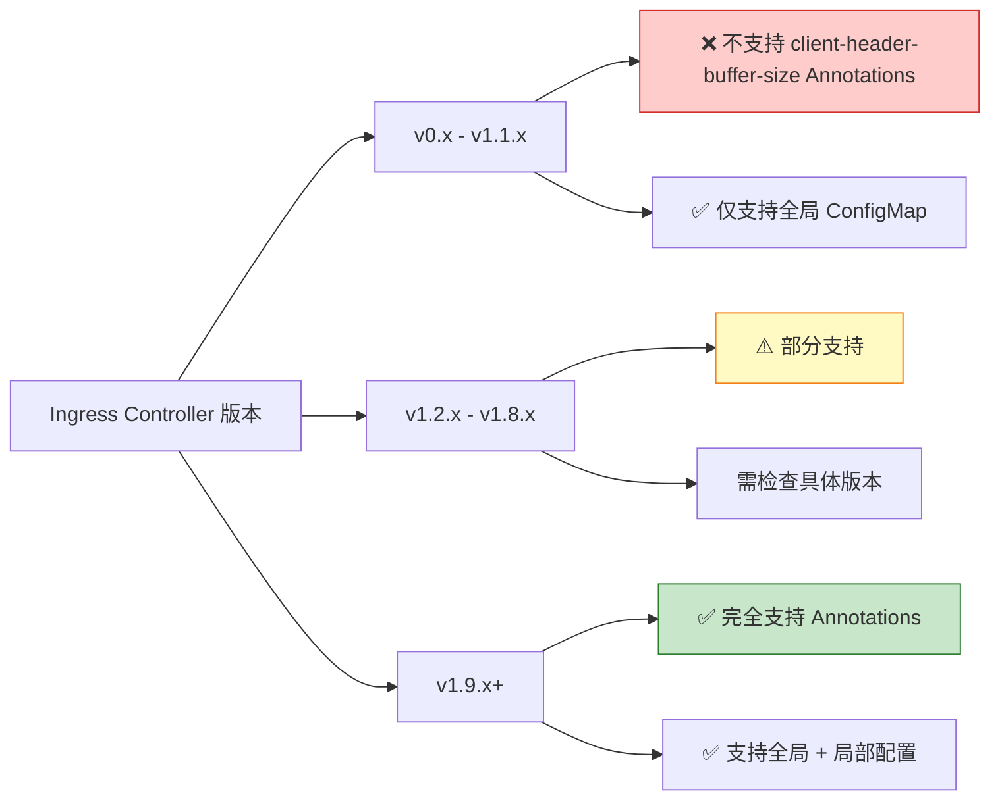
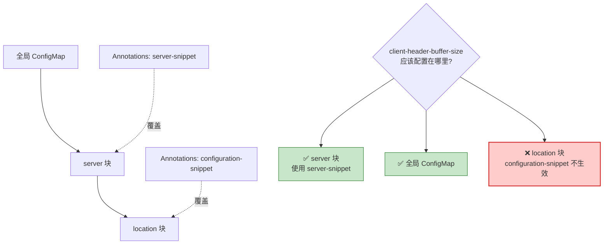

# Ingress Annotations 完整配置解析

## 问题分析

您发现了一个**关键细节**：Ingress 的请求头配置有**两种方式**：

1. **标准 Annotations**（如 `client-header-buffer-size`）
2. **自定义 Snippet**（如 `server-snippet`）

同时您关心：
- 这两种方式是否需要同时配置？
- `client-header-buffer-size` 和 `large-client-header-buffers` 是否必须成对出现？

## 一、配置方式对比

### 1.1 标准 Annotations vs Snippet



| 对比维度 | 标准 Annotations | 自定义 Snippet |
|---------|-----------------|---------------|
| **配置复杂度** | 简单（键值对） | 复杂（需懂 Nginx 语法） |
| **安全性** | 高（参数校验） | 低（可能语法错误） |
| **可维护性** | 高（语义清晰） | 低（需懂 Nginx） |
| **适用场景** | 常规配置（推荐） | 标准 Annotations 不支持的功能 |
| **配置位置** | `server {}` 或 `location {}` 块 | 可精准控制插入位置 |

### 1.2 核心结论

**您的理解需要修正**：

❌ **错误认知**：必须同时配置标准 Annotations + Snippet 才完整  
✅ **正确理解**：**两者选其一即可**，大部分场景**仅用标准 Annotations**

**配置搭配规则**：

```yaml
# 场景一：常规配置（推荐）- 仅用标准 Annotations
annotations:
  nginx.ingress.kubernetes.io/client-header-buffer-size: "16k"
  nginx.ingress.kubernetes.io/large-client-header-buffers: "4 32k"

# 场景二：高级配置 - 标准 Annotations 不支持时才用 Snippet
annotations:
  nginx.ingress.kubernetes.io/server-snippet: |
    client_header_buffer_size 16k;
    large_client_header_buffers 4 32k;

# 场景三：混合配置 - Snippet 补充标准 Annotations 不支持的功能
annotations:
  nginx.ingress.kubernetes.io/client-header-buffer-size: "16k"
  nginx.ingress.kubernetes.io/server-snippet: |
    # 自定义日志格式（标准 Annotations 不支持）
    access_log /var/log/nginx/custom.log custom_format;
```

## 二、client-header-buffer-size 与 large-client-header-buffers 搭配规则

### 2.1 两者关系图解



### 2.2 配置搭配策略

**核心原则**：

1. **可以单独配置其中一个**（另一个使用全局或默认值）
2. **推荐成对配置**（保证配置语义完整）
3. **必须满足逻辑关系**：`large-client-header-buffers` 单个大小 ≥ `client-header-buffer-size`

**配置组合对比**：

```yaml
# ✅ 推荐：成对配置（逻辑完整）
nginx.ingress.kubernetes.io/client-header-buffer-size: "16k"
nginx.ingress.kubernetes.io/large-client-header-buffers: "4 32k"
# 逻辑：常规缓冲 16k，超过则用大缓冲（4 个 32k = 128k 总容量）

# ✅ 可行：仅配置 large-client-header-buffers
nginx.ingress.kubernetes.io/large-client-header-buffers: "4 32k"
# client-header-buffer-size 使用全局配置或默认值（1k/4k）

# ✅ 可行：仅配置 client-header-buffer-size
nginx.ingress.kubernetes.io/client-header-buffer-size: "16k"
# large-client-header-buffers 使用全局配置或默认值（4 8k）

# ❌ 错误：逻辑矛盾（大缓冲区单个大小 < 常规缓冲区）
nginx.ingress.kubernetes.io/client-header-buffer-size: "32k"
nginx.ingress.kubernetes.io/large-client-header-buffers: "4 16k"
# Nginx 不会报错，但实际上常规缓冲已够用，大缓冲区配置无意义
```

**建议**：

- **普通服务**：成对配置 `8k` + `4 16k`（适中）
- **大请求头服务**：成对配置 `16k` + `4 32k`（宽松）
- **极端场景**：成对配置 `32k` + `4 64k`（需安全评审）

## 三、完整 Ingress 配置示例

### 3.1 标准方式（生产推荐）

```yaml
apiVersion: networking.k8s.io/v1
kind: Ingress
metadata:
  name: user-service-ingress
  namespace: production
  annotations:
    # ==================== 核心配置 ====================
    # Ingress Class（必须）
    kubernetes.io/ingress.class: "nginx"
    
    # ==================== 请求头缓冲配置 ====================
    # 常规缓冲区（单次分配，处理小于 16k 的请求头）
    nginx.ingress.kubernetes.io/client-header-buffer-size: "16k"
    
    # 大缓冲区（按需分配，处理 16k - 128k 的请求头）
    # 格式：数量 单个大小（总容量 = 4 × 32k = 128k）
    nginx.ingress.kubernetes.io/large-client-header-buffers: "4 32k"
    
    # ==================== HTTP/2 配置（HTTPS 场景）====================
    # 单个头部字段最大值（如超大 Cookie、Authorization）
    nginx.ingress.kubernetes.io/http2-max-field-size: "32k"
    
    # 整个请求头总大小最大值
    nginx.ingress.kubernetes.io/http2-max-header-size: "128k"
    
    # HTTP/2 最大并发流数量
    nginx.ingress.kubernetes.io/http2-max-concurrent-streams: "128"
    
    # ==================== 请求体配置 ====================
    # 客户端请求体最大值（如文件上传）
    nginx.ingress.kubernetes.io/proxy-body-size: "50m"
    
    # ==================== 超时配置 ====================
    # 与后端建立连接超时
    nginx.ingress.kubernetes.io/proxy-connect-timeout: "60"
    
    # 从后端读取响应超时
    nginx.ingress.kubernetes.io/proxy-read-timeout: "60"
    
    # 向后端发送请求超时
    nginx.ingress.kubernetes.io/proxy-send-timeout: "60"
    
    # ==================== CORS 配置（跨域场景）====================
    nginx.ingress.kubernetes.io/enable-cors: "true"
    nginx.ingress.kubernetes.io/cors-allow-origin: "https://example.com,https://www.example.com"
    nginx.ingress.kubernetes.io/cors-allow-methods: "GET, POST, PUT, DELETE, OPTIONS"
    nginx.ingress.kubernetes.io/cors-allow-headers: "DNT,X-CustomHeader,Keep-Alive,User-Agent,X-Requested-With,If-Modified-Since,Cache-Control,Content-Type,Authorization"
    nginx.ingress.kubernetes.io/cors-max-age: "86400"
    
    # ==================== 限流配置 ====================
    # 限制单个 IP 的请求速率（每秒 10 个请求）
    nginx.ingress.kubernetes.io/limit-rps: "10"
    
    # 限制单个 IP 的并发连接数
    nginx.ingress.kubernetes.io/limit-connections: "5"
    
    # ==================== SSL 配置 ====================
    # 强制 HTTPS 重定向
    nginx.ingress.kubernetes.io/force-ssl-redirect: "true"
    
    # SSL 协议版本
    nginx.ingress.kubernetes.io/ssl-protocols: "TLSv1.2 TLSv1.3"
    
    # ==================== 后端协议配置 ====================
    # 后端服务使用 HTTPS（默认 HTTP）
    # nginx.ingress.kubernetes.io/backend-protocol: "HTTPS"
    
    # ==================== 会话亲和性 ====================
    # 启用基于 Cookie 的会话保持
    nginx.ingress.kubernetes.io/affinity: "cookie"
    nginx.ingress.kubernetes.io/session-cookie-name: "route"
    nginx.ingress.kubernetes.io/session-cookie-max-age: "3600"
    
    # ==================== 健康检查（可选）====================
    # 后端健康检查路径
    # nginx.ingress.kubernetes.io/health-check-path: "/health"
    
    # ==================== 自定义响应头 ====================
    # 添加自定义响应头
    nginx.ingress.kubernetes.io/configuration-snippet: |
      more_set_headers "X-Frame-Options: SAMEORIGIN";
      more_set_headers "X-Content-Type-Options: nosniff";
      more_set_headers "X-XSS-Protection: 1; mode=block";

spec:
  # K8s 1.19+ 推荐使用 ingressClassName 替代 annotations 中的 ingress.class
  ingressClassName: nginx
  
  # TLS 配置（HTTPS）
  tls:
  - hosts:
    - user.example.com
    secretName: user-example-tls  # 证书 Secret 名称
  
  rules:
  - host: user.example.com
    http:
      paths:
      # 路径一：API 服务
      - path: /api/user
        pathType: Prefix
        backend:
          service:
            name: user-service
            port:
              number: 8080
      
      # 路径二：管理后台（可选）
      - path: /admin
        pathType: Prefix
        backend:
          service:
            name: admin-service
            port:
              number: 8081
```

### 3.2 高级方式（使用 Snippet）

```yaml
apiVersion: networking.k8s.io/v1
kind: Ingress
metadata:
  name: user-service-advanced-ingress
  namespace: production
  annotations:
    kubernetes.io/ingress.class: "nginx"
    
    # ==================== 标准配置仍然保留 ====================
    nginx.ingress.kubernetes.io/client-header-buffer-size: "16k"
    nginx.ingress.kubernetes.io/large-client-header-buffers: "4 32k"
    
    # ==================== server-snippet：server {} 块级配置 ====================
    # 作用范围：整个虚拟主机（所有 location）
    nginx.ingress.kubernetes.io/server-snippet: |
      # 自定义访问日志格式
      log_format custom_format '$remote_addr - $remote_user [$time_local] '
                               '"$request" $status $body_bytes_sent '
                               '"$http_referer" "$http_user_agent" '
                               '"$http_x_forwarded_for" $request_time';
      
      access_log /var/log/nginx/user-service-access.log custom_format;
      
      # 自定义错误页面
      error_page 404 /404.html;
      error_page 500 502 503 504 /50x.html;
      
      # 禁止特定 User-Agent
      if ($http_user_agent ~* (bot|crawler|spider)) {
        return 403;
      }
    
    # ==================== configuration-snippet：location {} 块级配置 ====================
    # 作用范围：当前 Ingress 的所有 path
    nginx.ingress.kubernetes.io/configuration-snippet: |
      # 添加自定义请求头转发到后端
      proxy_set_header X-Original-URI $request_uri;
      proxy_set_header X-Real-Scheme $scheme;
      
      # 自定义缓存策略
      proxy_cache_bypass $http_upgrade;
      proxy_no_cache $http_upgrade;
      
      # 限制请求方法
      if ($request_method !~ ^(GET|POST|PUT|DELETE|OPTIONS)$ ) {
        return 405;
      }
      
      # 自定义响应头
      add_header X-Cache-Status $upstream_cache_status;
      add_header X-Response-Time $request_time;

spec:
  ingressClassName: nginx
  tls:
  - hosts:
    - user.example.com
    secretName: user-example-tls
  rules:
  - host: user.example.com
    http:
      paths:
      - path: /api/user
        pathType: Prefix
        backend:
          service:
            name: user-service
            port:
              number: 8080
```

### 3.3 Snippet 位置对比



**最终生成的 Nginx 配置**：

```nginx
# server-snippet 插入此处
server {
    listen 80;
    server_name user.example.com;
    
    # server-snippet 内容
    log_format custom_format '...';
    access_log /var/log/nginx/user-service-access.log custom_format;
    
    # configuration-snippet 插入此处
    location /api/user {
        # configuration-snippet 内容
        proxy_set_header X-Original-URI $request_uri;
        add_header X-Cache-Status $upstream_cache_status;
        
        # 标准 Annotations 生成的配置
        client_header_buffer_size 16k;
        large_client_header_buffers 4 32k;
        
        proxy_pass http://user-service:8080;
    }
}
```

## 四、Snippet 适用场景

### 4.1 何时必须使用 Snippet

| 需求 | 标准 Annotations | 必须用 Snippet |
|-----|----------------|---------------|
| 请求头缓冲配置 | ✅ 支持 | ❌ 无需 |
| 超时配置 | ✅ 支持 | ❌ 无需 |
| CORS 配置 | ✅ 支持 | ❌ 无需 |
| **自定义日志格式** | ❌ 不支持 | ✅ 必须 |
| **自定义错误页** | ❌ 不支持 | ✅ 必须 |
| **复杂条件判断（if）** | ❌ 不支持 | ✅ 必须 |
| **Nginx 变量操作** | ❌ 不支持 | ✅ 必须 |
| **Lua 脚本** | ❌ 不支持 | ✅ 必须 |

### 4.2 Snippet 风险警告

```yaml
# ❌ 危险示例：语法错误导致 Nginx 无法启动
nginx.ingress.kubernetes.io/server-snippet: |
  client_header_buffer_size 16k  # 缺少分号，Nginx 启动失败！

# ❌ 危险示例：配置冲突
annotations:
  # 标准方式配置
  nginx.ingress.kubernetes.io/client-header-buffer-size: "16k"
  
  # Snippet 重复配置（可能导致冲突）
  nginx.ingress.kubernetes.io/server-snippet: |
    client_header_buffer_size 32k;  # 优先级不明确！
```

**安全检查清单**：

```bash
# 1. 应用前先验证 Ingress 语法
kubectl apply --dry-run=client -f ingress.yaml

# 2. 应用后检查 Controller 日志
kubectl logs -n ingress-nginx -l app.kubernetes.io/name=ingress-nginx --tail=50

# 3. 进入 Pod 验证 Nginx 配置
kubectl exec -it -n ingress-nginx <pod-name> -- nginx -t

# 4. 查看实际生成的配置
kubectl exec -it -n ingress-nginx <pod-name> -- cat /etc/nginx/nginx.conf
```

## 五、配置决策流程图



## 总结

### 核心要点

1. **配置方式选择**：
   - ✅ **优先使用标准 Annotations**（安全、简单、可维护）
   - ⚠️ **仅在必要时使用 Snippet**（需懂 Nginx 语法）
   - ❌ **避免混用导致冲突**

2. **成对配置规则**：
   - ✅ **推荐成对配置**（语义完整）
   - ✅ **可单独配置**（另一个用全局/默认值）
   - ⚠️ **确保逻辑合理**（大缓冲单个大小 ≥ 常规缓冲）

3. **Snippet 使用场景**：
   - `server-snippet`：整个虚拟主机级别（日志、错误页）
   - `configuration-snippet`：特定路径级别（请求头、缓存）

### 生产建议

```yaml
# 推荐配置模板（适用 90% 场景）
annotations:
  kubernetes.io/ingress.class: "nginx"
  
  # 请求头配置（成对配置）
  nginx.ingress.kubernetes.io/client-header-buffer-size: "16k"
  nginx.ingress.kubernetes.io/large-client-header-buffers: "4 32k"
  
  # HTTP/2 配置（HTTPS 场景）
  nginx.ingress.kubernetes.io/http2-max-field-size: "32k"
  nginx.ingress.kubernetes.io/http2-max-header-size: "128k"
  
  # 仅在需要自定义功能时添加 Snippet
  # nginx.ingress.kubernetes.io/configuration-snippet: |
  #   add_header X-Custom-Header "value";
```


# Ingress Annotations 配置不生效问题排查

## 问题分析

您遇到了一个**典型的配置不生效问题**：

- ✅ `proxy-body-size` 配置能快速生效
- ❌ `client-header-buffer-size` 配置始终不生效

这说明**不是热重载机制的问题**，而是**特定参数的配置方式或位置问题**。

## 一、核心原因分析

### 1.1 配置生效位置差异



### 1.2 可能的原因矩阵

| 原因 | 可能性 | 验证方法 | 解决方案 |
|-----|-------|---------|---------|
| **Ingress Controller 版本过低** | ⭐⭐⭐⭐⭐ | 检查版本 | 升级或使用 server-snippet |
| **参数仅支持全局 ConfigMap** | ⭐⭐⭐⭐ | 查看官方文档 | 配置全局 ConfigMap |
| **配置位置错误（server vs location）** | ⭐⭐⭐ | 检查 nginx.conf | 使用 server-snippet |
| **参数名拼写错误** | ⭐⭐ | 检查 Annotations | 修正参数名 |
| **Ingress Class 不匹配** | ⭐⭐ | 检查 ingress.class | 修正 Class 名称 |

## 二、关键差异：为什么 proxy-body-size 生效但 client-header-buffer-size 不生效？

### 2.1 配置层级差异

**proxy-body-size（location 块级别）**：

```nginx
# 生成在 /etc/nginx/conf.d/default-user-service.conf
server {
    server_name user.example.com;
    
    location /api/user {
        # ✅ Annotations 可以直接配置（location 块）
        client_max_body_size 46m;  # proxy-body-size 对应的 Nginx 指令
        
        proxy_pass http://backend;
    }
}
```

**client-header-buffer-size（server 块级别）**：

```nginx
# 需要配置在 server 块（全局），部分版本不支持 Annotations 局部配置
server {
    server_name user.example.com;
    
    # ❌ 部分 Ingress Controller 版本的 Annotations 无法在此位置生效
    client_header_buffer_size 16k;
    large_client_header_buffers 4 32k;
    
    location /api/user {
        proxy_pass http://backend;
    }
}
```

### 2.2 Nginx Ingress Controller 版本支持情况



## 三、排查步骤

### 3.1 Step 1：检查 Ingress Controller 版本

```bash
# 方法一：检查 Deployment 镜像版本
kubectl get deployment -n ingress-nginx ingress-nginx-controller -o jsonpath='{.spec.template.spec.containers[0].image}'

# 方法二：检查 Pod 标签
kubectl get pods -n ingress-nginx -o jsonpath='{.items[0].metadata.labels}' | jq

# 方法三：查看 Ingress Controller 版本信息
kubectl exec -it -n ingress-nginx <pod-name> -- /nginx-ingress-controller --version

# 输出示例：
# NGINX Ingress controller
#   Release:       v1.10.0
#   Build:         1234567890
#   nginx version: nginx/1.25.3
```

**关键判断**：

- **v1.9.0+** → ✅ 支持 `client-header-buffer-size` Annotations
- **v1.2.0 - v1.8.x** → ⚠️ 部分支持，需查看官方文档
- **v0.x - v1.1.x** → ❌ 不支持，仅能用全局 ConfigMap 或 server-snippet

### 3.2 Step 2：验证 Ingress 配置是否正确

```bash
# 1. 查看 Ingress 完整配置
kubectl get ingress <ingress-name> -n <namespace> -o yaml

# 2. 检查 Annotations 是否正确
kubectl get ingress <ingress-name> -n <namespace> -o jsonpath='{.metadata.annotations}' | jq

# 期望输出：
# {
#   "nginx.ingress.kubernetes.io/client-header-buffer-size": "16k",
#   "nginx.ingress.kubernetes.io/proxy-body-size": "46m"
# }

# 3. 检查 Ingress Class 是否匹配
kubectl get ingress <ingress-name> -n <namespace> -o jsonpath='{.spec.ingressClassName}'

# 或检查 annotations 中的 ingress.class
kubectl get ingress <ingress-name> -n <namespace> -o jsonpath='{.metadata.annotations.kubernetes\.io/ingress\.class}'
```

### 3.3 Step 3：检查生成的 Nginx 配置

```bash
# 1. 进入 Ingress Controller Pod
kubectl exec -it -n ingress-nginx <pod-name> -- bash

# 2. 查看主配置文件（全局配置）
cat /etc/nginx/nginx.conf | grep -E "client_header_buffer_size|large_client_header_buffers"

# 3. 查找对应的 server 配置文件
ls -la /etc/nginx/conf.d/

# 4. 查看具体的 Ingress 配置（按命名空间-Ingress名称查找）
cat /etc/nginx/conf.d/<namespace>-<ingress-name>.conf

# 或全局搜索
grep -r "client_header_buffer_size" /etc/nginx/

# 5. 检查是否有语法错误
nginx -t

# 6. 查看 Nginx 错误日志
tail -f /var/log/nginx/error.log
```

### 3.4 Step 4：检查 Ingress Controller 日志

```bash
# 1. 实时查看日志
kubectl logs -n ingress-nginx -l app.kubernetes.io/name=ingress-nginx --tail=100 -f

# 2. 搜索相关错误
kubectl logs -n ingress-nginx -l app.kubernetes.io/name=ingress-nginx --tail=500 | grep -i "client-header-buffer\|error\|warn"

# 3. 检查配置重载日志
kubectl logs -n ingress-nginx -l app.kubernetes.io/name=ingress-nginx --tail=200 | grep -i "reload\|backend reload"

# 期望看到：
# I1129 10:23:45.123456       1 controller.go:168] "Configuration changes detected, backend reload required"
# I1129 10:23:45.234567       1 controller.go:185] "Backend successfully reloaded"
```

## 四、解决方案（按优先级）

### 4.1 方案一：使用 server-snippet（立即生效，推荐）

**适用场景**：Ingress Controller 版本不支持 `client-header-buffer-size` Annotations

```yaml
apiVersion: networking.k8s.io/v1
kind: Ingress
metadata:
  name: user-service-ingress
  namespace: production
  annotations:
    kubernetes.io/ingress.class: "nginx"
    
    # ✅ 保留正常工作的配置
    nginx.ingress.kubernetes.io/proxy-body-size: "46m"
    
    # ❌ 移除不生效的 Annotations
    # nginx.ingress.kubernetes.io/client-header-buffer-size: "16k"
    
    # ✅ 使用 server-snippet 替代（插入 server 块）
    nginx.ingress.kubernetes.io/server-snippet: |
      client_header_buffer_size 16k;
      large_client_header_buffers 4 32k;
      
      # HTTP/2 配置（如使用 HTTPS）
      http2_max_field_size 32k;
      http2_max_header_size 128k;

spec:
  ingressClassName: nginx
  rules:
  - host: user.example.com
    http:
      paths:
      - path: /api/user
        pathType: Prefix
        backend:
          service:
            name: user-service
            port:
              number: 8080
```

**验证方法**：

```bash
# 1. 应用配置
kubectl apply -f ingress.yaml

# 2. 等待 10 秒（自动重载）
sleep 10

# 3. 进入 Pod 验证
kubectl exec -it -n ingress-nginx <pod-name> -- bash

# 4. 查看 server 块配置
cat /etc/nginx/nginx.conf | grep -A 50 "server_name user.example.com" | grep client_header_buffer_size

# 期望输出：
# client_header_buffer_size 16k;
# large_client_header_buffers 4 32k;
```

### 4.2 方案二：配置全局 ConfigMap（适用所有服务）

**适用场景**：集群中大部分服务需要提升请求头阈值

```yaml
apiVersion: v1
kind: ConfigMap
metadata:
  name: nginx-ingress-controller
  namespace: ingress-nginx
data:
  # 全局请求头缓冲配置
  client-header-buffer-size: "16k"
  large-client-header-buffers: "4 32k"
  
  # HTTP/2 配置
  http2-max-field-size: "32k"
  http2-max-header-size: "128k"
  
  # 其他全局配置
  proxy-body-size: "50m"
  proxy-connect-timeout: "60"
  proxy-read-timeout: "60"
```

**应用步骤**：

```bash
# 1. 编辑 ConfigMap
kubectl edit configmap nginx-ingress-controller -n ingress-nginx

# 或应用 YAML 文件
kubectl apply -f nginx-configmap.yaml

# 2. 滚动重启 Ingress Controller（必须）
kubectl rollout restart deployment ingress-nginx-controller -n ingress-nginx

# 3. 等待 Pod 完全重启
kubectl rollout status deployment ingress-nginx-controller -n ingress-nginx

# 4. 验证配置
kubectl exec -it -n ingress-nginx <new-pod-name> -- cat /etc/nginx/nginx.conf | grep client_header_buffer_size

# 期望输出（在 http 块或 server 块）：
# client_header_buffer_size 16k;
```

### 4.3 方案三：升级 Ingress Controller（长期方案）

**适用场景**：版本过低，需要使用最新特性

```bash
# 1. 检查当前版本
kubectl get deployment -n ingress-nginx ingress-nginx-controller -o jsonpath='{.spec.template.spec.containers[0].image}'

# 2. 备份当前配置
kubectl get all -n ingress-nginx -o yaml > ingress-backup-$(date +%Y%m%d).yaml
kubectl get configmap -n ingress-nginx -o yaml >> ingress-backup-$(date +%Y%m%d).yaml

# 3. 升级到最新版本（使用 Helm）
helm repo add ingress-nginx https://kubernetes.github.io/ingress-nginx
helm repo update

# 查看最新版本
helm search repo ingress-nginx --versions | head -5

# 升级（保留现有配置）
helm upgrade ingress-nginx ingress-nginx/ingress-nginx \
  --namespace ingress-nginx \
  --reuse-values \
  --version <new-version>

# 4. 验证升级
kubectl get pods -n ingress-nginx
kubectl get deployment -n ingress-nginx ingress-nginx-controller -o jsonpath='{.spec.template.spec.containers[0].image}'
```

### 4.4 方案四：使用 configuration-snippet（不推荐）

**注意**：`configuration-snippet` 插入 `location` 块，对 `client-header-buffer-size` 可能不生效（因为这是 server 块级别配置）

```yaml
# ⚠️ 不推荐：可能不生效
annotations:
  nginx.ingress.kubernetes.io/configuration-snippet: |
    client_header_buffer_size 16k;
    large_client_header_buffers 4 32k;
```

## 五、特殊情况排查

### 5.1 参数名称差异

某些版本的 Ingress Controller 可能使用不同的参数名：

```yaml
# 标准名称（推荐）
nginx.ingress.kubernetes.io/client-header-buffer-size: "16k"

# 可能的别名（部分版本）
nginx.ingress.kubernetes.io/client-body-buffer-size: "16k"

# Nginx 原生指令名称
# client_header_buffer_size（Nginx 配置文件中）
# client-header-buffer-size（Annotations 中，连字符格式）
```

**验证方法**：

```bash
# 查看官方支持的 Annotations 列表
kubectl exec -it -n ingress-nginx <pod-name> -- /nginx-ingress-controller --help | grep -i "client-header"

# 或查看官方文档
# https://kubernetes.github.io/ingress-nginx/user-guide/nginx-configuration/annotations/
```

### 5.2 配置继承问题



### 5.3 HTTP/2 vs HTTP/1.1 配置差异

```yaml
# 如果使用 HTTPS + HTTP/2，需要额外配置
annotations:
  # HTTP/1.1 配置（可能不生效）
  nginx.ingress.kubernetes.io/client-header-buffer-size: "16k"
  
  # HTTP/2 配置（需单独配置）
  nginx.ingress.kubernetes.io/http2-max-field-size: "32k"
  nginx.ingress.kubernetes.io/http2-max-header-size: "128k"
```

**检查协议版本**：

```bash
# 检查是否启用 HTTP/2
kubectl get ingress <name> -o jsonpath='{.spec.tls}' | jq

# 测试服务协议
curl -I --http2 https://user.example.com/api/user

# 查看响应头
# HTTP/2 200  ← 使用 HTTP/2
# HTTP/1.1 200  ← 使用 HTTP/1.1
```

## 六、完整验证脚本

```bash
#!/bin/bash

# Ingress Annotations 配置验证脚本

NAMESPACE="production"
INGRESS_NAME="user-service-ingress"
INGRESS_NS="ingress-nginx"

echo "========== Step 1: 检查 Ingress 配置 =========="
kubectl get ingress $INGRESS_NAME -n $NAMESPACE -o yaml | grep -A 10 annotations

echo "========== Step 2: 检查 Ingress Controller 版本 =========="
kubectl get deployment -n $INGRESS_NS ingress-nginx-controller -o jsonpath='{.spec.template.spec.containers[0].image}'
echo ""

echo "========== Step 3: 检查 Ingress Controller Pod =========="
POD_NAME=$(kubectl get pods -n $INGRESS_NS -l app.kubernetes.io/name=ingress-nginx -o jsonpath='{.items[0].metadata.name}')
echo "Pod Name: $POD_NAME"

echo "========== Step 4: 检查 Nginx 配置 =========="
echo "--- 主配置文件 ---"
kubectl exec -it -n $INGRESS_NS $POD_NAME -- cat /etc/nginx/nginx.conf | grep -E "client_header_buffer_size|large_client_header_buffers"

echo "--- server 配置文件 ---"
kubectl exec -it -n $INGRESS_NS $POD_NAME -- sh -c "grep -r 'client_header_buffer_size' /etc/nginx/conf.d/ 2>/dev/null || echo '未找到配置'"

echo "========== Step 5: 检查 Nginx 语法 =========="
kubectl exec -it -n $INGRESS_NS $POD_NAME -- nginx -t

echo "========== Step 6: 检查日志 =========="
kubectl logs -n $INGRESS_NS $POD_NAME --tail=50 | grep -i "error\|warn\|client-header"

echo "========== 验证完成 =========="
```

**使用方法**：

```bash
# 保存为 verify-ingress.sh
chmod +x verify-ingress.sh

# 运行验证
./verify-ingress.sh
```

## 七、最终推荐方案

```yaml
apiVersion: networking.k8s.io/v1
kind: Ingress
metadata:
  name: user-service-ingress
  namespace: production
  annotations:
    kubernetes.io/ingress.class: "nginx"
    
    # ==================== 标准 Annotations（优先使用）====================
    # 请求体大小（✅ 已验证生效）
    nginx.ingress.kubernetes.io/proxy-body-size: "46m"
    
    # 超时配置
    nginx.ingress.kubernetes.io/proxy-connect-timeout: "60"
    nginx.ingress.kubernetes.io/proxy-read-timeout: "60"
    
    # ==================== server-snippet（请求头配置）====================
    # 使用 server-snippet 确保配置生效
    nginx.ingress.kubernetes.io/server-snippet: |
      # 请求头缓冲配置
      client_header_buffer_size 16k;
      large_client_header_buffers 4 32k;
      
      # HTTP/2 配置（如使用 HTTPS）
      http2_max_field_size 32k;
      http2_max_header_size 128k;

spec:
  ingressClassName: nginx
  tls:
  - hosts:
    - user.example.com
    secretName: user-example-tls
  rules:
  - host: user.example.com
    http:
      paths:
      - path: /api/user
        pathType: Prefix
        backend:
          service:
            name: user-service
            port:
              number: 8080
```

## 总结

### 核心原因

1. **配置层级差异**：
   - `proxy-body-size` → location 块，Annotations 直接支持 ✅
   - `client-header-buffer-size` → server 块，部分版本 Annotations 不支持 ❌

2. **版本支持问题**：
   - 旧版本 Ingress Controller 不支持 `client-header-buffer-size` Annotations
   - 需要使用 `server-snippet` 或全局 ConfigMap

### 推荐方案（按优先级）

1. ✅ **立即生效**：使用 `server-snippet` 配置（无需重启）
2. ✅ **全局配置**：修改 ConfigMap（需重启 Pod）
3. ⭐ **长期方案**：升级 Ingress Controller 到 v1.9.0+

### 验证清单

```bash
□ 检查 Ingress Controller 版本是否支持
□ 验证 Ingress Annotations 配置是否正确
□ 检查生成的 Nginx 配置文件
□ 查看 Ingress Controller 日志
□ 测试服务是否正常响应
```