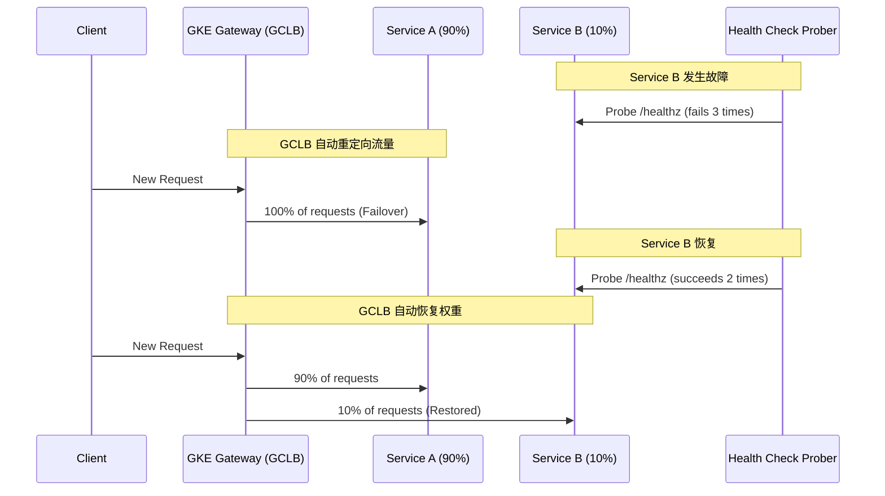

# GKE Gateway 演示文稿

---

### **Slide 1: 标题页**

# GKE Gateway: HTTPRoute 流量分配与健康检查核心解析

**主讲人: Lex**
**日期: 2025年7月15日**

---

### **Slide 2: 议程**

## 今天我们将探讨...

- **核心机制**: GKE Gateway 是如何工作的？
- **流量分配**: 如何实现按比例的流量切分？
- **健康检查**: 如何实现自动化的故障转移？
- **关键资源**: `HealthCheckPolicy` 为何如此重要？
- **完整示例**: 一个端到端的部署清单。

---

### **Slide 3: 核心机制：从 K8s API 到 Google Cloud**

## GKE Gateway 的工作原理

GKE Gateway 控制器将 K8s 资源“翻译”为 Google Cloud 负载均衡器 (GCLB) 的组件。

- **`HTTPRoute`**  ->  **URL 映射 (URL Map)**
  - *定义流量匹配规则*

- **`Service`**  ->  **后端服务 (Backend Service)**
  - *成为流量的目标*

- **`Pod`**  ->  **网络端点组 (NEG)**
  - *实现从 GCLB 到 Pod 的直接路由*

**结论：故障转移由 GCLB 的原生能力驱动，高效且可靠。**

---

### **Slide 4: 按比例流量分配**

## 如何实现金丝雀发布���

通过 `HTTPRoute` 的 `weight` 字段，可以轻松实现流量的加权分配。

```yaml
# 示例：90% 流量到 v1，10% 到 v2
apiVersion: gateway.networking.k8s.io/v1
kind: HTTPRoute
metadata:
  name: store-canary-route
spec:
  rules:
  - backendRefs:
    # 稳定版 v1
    - name: store-v1
      port: 8080
      weight: 90
    # 金丝雀版 v2
    - name: store-v2
      port: 8080
      weight: 10
```

---

### **Slide 5: 健康检查与自动故障转移**

## 当后端服务异常时会发生什么？

GKE Gateway 会自动将不健康后端的流量，按比例重新分配给健康的后端。



---

### **Slide 6: 关键资源: `HealthCheckPolicy`**

## 为何必须使用 `HealthCheckPolicy`？

**这是一个关键的范式转变！**

- 与旧的 GKE Ingress 不同，GKE Gateway **不会**从 Pod 的 `readinessProbe` 推断健康检查。
- 您**必须**为每个需要健康检查的后端服务显式创建一个 `HealthCheckPolicy`。
- **如果忽略，将导致服务中断！**

```yaml
apiVersion: networking.gke.io/v1
kind: HealthCheckPolicy
metadata:
  name: store-v2-health-check
spec:
  targetRef:
    kind: Service
    name: store-v2
  default:
    config:
      type: HTTP
      httpHealthCheck:
        port: 8081
        requestPath: /healthz
        unhealthyThreshold: 3 # 3次失败则标记为不健康
```

---

### **Slide 7: 完整部署示例**

## 端到端部署清单

一个完整的生产级配置包含以下资源：

1.  **`Gateway`**: 定义流量入口。
2.  **`Service` (x2)**: 分别指向 v1 和 v2 的 Pod。
3.  **`HealthCheckPolicy` (x2)**: 为每个 Service 定义独立的健康检查。
4.  **`HTTPRoute`**: 定义 90/10 的加权路由规则。

*(详细 YAML 清单请参考附录)*

---

### **Slide 8: 总结**

## 核心要点

- **自动化与可靠性**: GKE Gateway 提供全自动、可靠的故障转移。

- **`HTTPRoute`**: 使用 `weight` 字段进行声明式的流量加权分配。

- **`HealthCheckPolicy`**: **必须使用**此资源来定义健康检查，这是确保可靠性的前提。

- **云原生集成**: 所有功能深度集成 Google Cloud 负载均衡器，保证生产级的性能和可靠性。

---

### **Slide 9: Q&A**

## 问答环节
