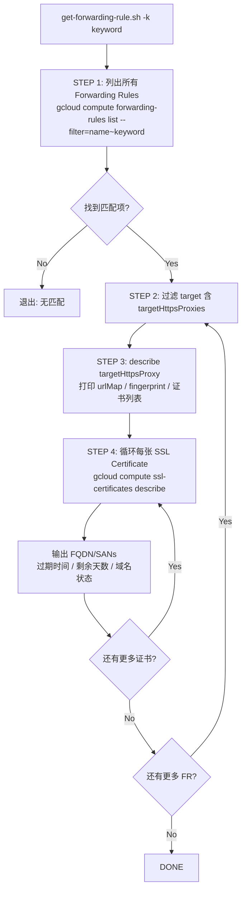

先读一下GCP技能文件，然后写这个脚本。
```bash
#!/usr/bin/env bash
# get-forwarding-rule.sh
# Usage: get-forwarding-rule.sh -k <keyword> [-r <region>] [-p <project>]

set -euo pipefail

# ─── 颜色定义 ────────────────────────────────────────────────────────────────
RED='\033[0;31m'; YELLOW='\033[1;33m'; GREEN='\033[0;32m'
CYAN='\033[0;36m'; BLUE='\033[0;34m'; BOLD='\033[1m'; RESET='\033[0m'

# ─── 帮助信息 ─────────────────────────────────────────────────────────────────
usage() {
  cat <<EOF
Usage: $(basename "$0") -k <keyword> [-r <region>] [-p <project>]

Options:
  -k  keyword    Forwarding Rule 过滤关键字 (必填)
  -r  region     GCP region (默认: 读取 gcloud 配置)
  -p  project    GCP project (默认: 读取 gcloud 配置)
  -h             显示帮助

Example:
  $(basename "$0") -k my-api -r asia-east1
EOF
  exit 0
}

# ─── 参数解析 ─────────────────────────────────────────────────────────────────
KEYWORD=""
REGION=""
PROJECT=""

while getopts "k:r:p:h" opt; do
  case $opt in
    k) KEYWORD="$OPTARG" ;;
    r) REGION="$OPTARG" ;;
    p) PROJECT="$OPTARG" ;;
    h) usage ;;
    *) usage ;;
  esac
done

[[ -z "$KEYWORD" ]] && { echo -e "${RED}[ERROR] -k keyword 为必填参数${RESET}"; usage; }

# ─── 默认值填充 ───────────────────────────────────────────────────────────────
PROJECT="${PROJECT:-$(gcloud config get-value project 2>/dev/null)}"
REGION="${REGION:-$(gcloud config get-value compute/region 2>/dev/null)}"

[[ -z "$PROJECT" ]] && { echo -e "${RED}[ERROR] 无法确定 project，请用 -p 指定${RESET}"; exit 1; }
[[ -z "$REGION"  ]] && { echo -e "${RED}[ERROR] 无法确定 region，请用 -r 指定${RESET}"; exit 1; }

echo -e "${BOLD}${BLUE}═══════════════════════════════════════════════════════${RESET}"
echo -e "${BOLD}  GCP Forwarding Rule → SSL Certificate Inspector${RESET}"
echo -e "${BOLD}${BLUE}═══════════════════════════════════════════════════════${RESET}"
echo -e "  Project : ${CYAN}${PROJECT}${RESET}"
echo -e "  Region  : ${CYAN}${REGION}${RESET}"
echo -e "  Keyword : ${CYAN}${KEYWORD}${RESET}"
echo ""

# ─── STEP 1: 查找匹配 keyword 的 Forwarding Rules ────────────────────────────
echo -e "${BOLD}[STEP 1] 搜索 Forwarding Rules (keyword: ${KEYWORD})${RESET}"

FR_JSON=$(gcloud compute forwarding-rules list \
  --project="${PROJECT}" \
  --regions="${REGION}" \
  --format="json" \
  --filter="name~${KEYWORD}" 2>/dev/null)

FR_COUNT=$(echo "$FR_JSON" | python3 -c "import json,sys; print(len(json.load(sys.stdin)))" 2>/dev/null || echo 0)

if [[ "$FR_COUNT" -eq 0 ]]; then
  echo -e "${YELLOW}[WARN] 未找到匹配 '${KEYWORD}' 的 Forwarding Rule${RESET}"
  exit 0
fi

echo -e "${GREEN}  ✓ 找到 ${FR_COUNT} 条 Forwarding Rule${RESET}\n"

# ─── STEP 2: 遍历每条 FR，提取 targetHttpsProxies ────────────────────────────
echo -e "${BOLD}[STEP 2] 提取 targetHttpsProxies 信息${RESET}"
echo ""

# 用 python3 解析 JSON，避免 jq 依赖
FR_LIST=$(echo "$FR_JSON" | python3 -c "
import json, sys
data = json.load(sys.stdin)
for fr in data:
    target = fr.get('target', '')
    name   = fr.get('name', '')
    if 'targetHttpsProxies' in target:
        proxy_name = target.split('/')[-1]
        print(f'{name}|{proxy_name}')
")

if [[ -z "$FR_LIST" ]]; then
  echo -e "${YELLOW}[WARN] 没有找到关联 targetHttpsProxies 的 Forwarding Rule${RESET}"
  exit 0
fi

# ─── 主循环：FR → targetHttpsProxy → SSL Certificates ────────────────────────
while IFS='|' read -r FR_NAME PROXY_NAME; do
  echo -e "${BOLD}${BLUE}┌─────────────────────────────────────────────────────┐${RESET}"
  echo -e "${BOLD}${BLUE}│ Forwarding Rule : ${CYAN}${FR_NAME}${RESET}"
  echo -e "${BOLD}${BLUE}│ targetHttpsProxy: ${CYAN}${PROXY_NAME}${RESET}"
  echo -e "${BOLD}${BLUE}└─────────────────────────────────────────────────────┘${RESET}"

  # ── STEP 3: 描述 targetHttpsProxy ──────────────────────────────────────────
  echo -e "\n${BOLD}  [STEP 3] gcloud compute target-https-proxies describe${RESET}"

  PROXY_JSON=$(gcloud compute target-https-proxies describe "${PROXY_NAME}" \
    --project="${PROJECT}" \
    --region="${REGION}" \
    --format="json" 2>/dev/null) || {
      echo -e "${RED}  [ERROR] 无法获取 proxy: ${PROXY_NAME}${RESET}\n"
      continue
    }

  # 打印 proxy 基本信息
  echo "$PROXY_JSON" | python3 -c "
import json, sys
p = json.load(sys.stdin)
print(f\"  名称        : {p.get('name','N/A')}\")
print(f\"  selfLink    : {p.get('selfLink','N/A')}\")
print(f\"  fingerprint : {p.get('fingerprint','N/A')}\")
url_map = p.get('urlMap','N/A').split('/')[-1]
print(f\"  urlMap      : {url_map}\")
certs = p.get('sslCertificates', [])
print(f\"  证书数量    : {len(certs)}\")
for i, c in enumerate(certs, 1):
    print(f\"    [{i}] {c.split('/')[-1]}\")
"

  # ── STEP 4: 获取每张 SSL 证书详情 ──────────────────────────────────────────
  echo -e "\n${BOLD}  [STEP 4] SSL Certificate 详情${RESET}"

  CERT_NAMES=$(echo "$PROXY_JSON" | python3 -c "
import json, sys
p = json.load(sys.stdin)
for c in p.get('sslCertificates', []):
    print(c.split('/')[-1])
")

  if [[ -z "$CERT_NAMES" ]]; then
    echo -e "${YELLOW}  [WARN] 该 proxy 没有关联任何 SSL 证书${RESET}"
    echo ""
    continue
  fi

  CERT_INDEX=0
  while IFS= read -r CERT_NAME; do
    CERT_INDEX=$((CERT_INDEX + 1))
    echo -e "\n${BOLD}  ── 证书 [${CERT_INDEX}]: ${CYAN}${CERT_NAME}${RESET}"

    CERT_JSON=$(gcloud compute ssl-certificates describe "${CERT_NAME}" \
      --project="${PROJECT}" \
      --region="${REGION}" \
      --format="json" 2>/dev/null) || {
        echo -e "${RED}  [ERROR] 无法获取证书: ${CERT_NAME}${RESET}"
        continue
      }

    # 解析证书详情 + 过期预警
    echo "$CERT_JSON" | python3 -c "
import json, sys
from datetime import datetime, timezone

c = json.load(sys.stdin)

# 基本信息
print(f\"    名称          : {c.get('name','N/A')}\")
print(f\"    类型          : {c.get('type','N/A')}\")
print(f\"    状态          : {c.get('managed',{}).get('status', c.get('selfManaged',{}).get('status','N/A'))}\")
print(f\"    selfLink      : {c.get('selfLink','N/A')}\")
print(f\"    creationTime  : {c.get('creationTimestamp','N/A')}\")

# FQDN / SAN 域名
domains = c.get('managed', {}).get('domains', [])
if not domains:
    # self-managed 证书无 managed.domains，尝试 subjectAlternativeNames
    domains = c.get('subjectAlternativeNames', [])
if domains:
    print(f\"    FQDN / SANs   :\")
    for d in domains:
        print(f\"      - {d}\")
else:
    print(f\"    FQDN / SANs   : N/A\")

# 过期时间 + 剩余天数
expire_str = c.get('expireTime', '')
if expire_str:
    # GCP 格式: 2025-12-31T00:00:00.000-07:00
    try:
        from datetime import timezone
        expire_dt = datetime.fromisoformat(expire_str)
        now = datetime.now(timezone.utc)
        delta = (expire_dt.astimezone(timezone.utc) - now).days
        warn = ''
        if delta < 0:
            warn = '  ⛔ 已过期!'
        elif delta < 30:
            warn = '  ⚠️  即将过期!'
        elif delta < 90:
            warn = '  🔔 90天内到期'
        print(f\"    过期时间      : {expire_str}{warn}\")
        print(f\"    剩余天数      : {delta} 天\")
    except Exception as e:
        print(f\"    过期时间      : {expire_str} (解析失败: {e})\")
else:
    print(f\"    过期时间      : N/A\")

# managed 证书各域名状态
domain_status = c.get('managed', {}).get('domainStatus', {})
if domain_status:
    print(f\"    域名配置状态  :\")
    for dom, st in domain_status.items():
        icon = '✓' if st == 'ACTIVE' else '✗'
        print(f\"      {icon} {dom}: {st}\")
"

  done <<< "$CERT_NAMES"

  echo -e "\n${BLUE}───────────────────────────────────────────────────────${RESET}\n"

done <<< "$FR_LIST"

echo -e "${GREEN}${BOLD}[DONE] 检查完成${RESET}"
```

## 脚本说明

### 执行流程



### 输出字段说明

| 字段           | 来源                                           | 说明                                      |
| -------------- | ---------------------------------------------- | ----------------------------------------- |
| `FQDN / SANs`  | `managed.domains` 或 `subjectAlternativeNames` | 证书绑定的所有域名                        |
| `过期时间`     | `expireTime`                                   | RFC3339 格式，含时区                      |
| `剩余天数`     | 计算值                                         | 负数=已过期，< 30 天=红色预警             |
| `域名配置状态` | `managed.domainStatus`                         | Google 托管证书各域名 DNS 验证状态        |
| `类型`         | `type`                                         | `MANAGED`（Google 托管）或 `SELF_MANAGED` |

### 使用方式

```bash
# 赋予执行权限
chmod +x get-forwarding-rule.sh

# 基本用法
./get-forwarding-rule.sh -k my-api

# 指定 region 和 project
./get-forwarding-rule.sh -k my-api -r asia-east1 -p my-gcp-project
```

### ⚠️ 注意事项

1. **依赖**：脚本仅需 `gcloud` 和 `python3`（系统标准，无需 `jq`）
2. **权限**：执行账号需要 `compute.forwardingRules.list`、`compute.targetHttpsProxies.get`、`compute.sslCertificates.get` 权限
3. **Regional vs Global**：当前脚本针对 **Regional** 资源；若需支持 Global LB，去掉 `--region` 参数并修改 `forwarding-rules list` 为加 `--global` 的版本
4. **SELF_MANAGED 证书**：`expireTime` 字段由 GCP 从证书内容中解析，若为空则说明证书元数据未同步完成

---

## 重写版本 — 纯 Shell + jq（无 Python）

```bash
#!/usr/bin/env bash
# get-forwarding-rule.sh  (v2 — bash + jq only)
# Usage: get-forwarding-rule.sh -k <keyword> [-r <region>] [-g] [-p <project>]

set -euo pipefail

# ─── 颜色定义 ─────────────────────────────────────────────────────────────────
RED='\033[0;31m'; YELLOW='\033[1;33m'; GREEN='\033[0;32m'
CYAN='\033[0;36m'; BLUE='\033[0;34m'; BOLD='\033[1m'; RESET='\033[0m'

# ─── 帮助信息 ─────────────────────────────────────────────────────────────────
usage() {
  cat <<EOF
Usage: $(basename "$0") -k <keyword> [-r <region>] [-g] [-p <project>]

Options:
  -k  keyword    Forwarding Rule 过滤关键字 (必填)
  -r  region     GCP region (默认: gcloud 配置)
  -g             使用 Global Forwarding Rule（与 -r 互斥）
  -p  project    GCP project (默认: gcloud 配置)
  -h             显示帮助

Example:
  $(basename "$0") -k my-api -r asia-east1
  $(basename "$0") -k my-api -g
EOF
  exit 0
}

# ─── 参数解析 ─────────────────────────────────────────────────────────────────
KEYWORD=""; REGION=""; PROJECT=""; GLOBAL=false

while getopts "k:r:gp:h" opt; do
  case $opt in
    k) KEYWORD="$OPTARG" ;;
    r) REGION="$OPTARG" ;;
    g) GLOBAL=true ;;
    p) PROJECT="$OPTARG" ;;
    h) usage ;;
    *) usage ;;
  esac
done

[[ -z "$KEYWORD" ]] && { echo -e "${RED}[ERROR] -k keyword 为必填参数${RESET}"; usage; }

PROJECT="${PROJECT:-$(gcloud config get-value project 2>/dev/null)}"
[[ -z "$PROJECT" ]] && { echo -e "${RED}[ERROR] 无法确定 project，请用 -p 指定${RESET}"; exit 1; }

if [[ "$GLOBAL" == false ]]; then
  REGION="${REGION:-$(gcloud config get-value compute/region 2>/dev/null)}"
  [[ -z "$REGION" ]] && { echo -e "${RED}[ERROR] 无法确定 region，请用 -r 指定，或加 -g 使用 Global${RESET}"; exit 1; }
fi

# ─── 依赖检查 ─────────────────────────────────────────────────────────────────
command -v jq &>/dev/null || { echo -e "${RED}[ERROR] 缺少依赖: jq${RESET}"; exit 1; }
command -v gcloud &>/dev/null || { echo -e "${RED}[ERROR] 缺少依赖: gcloud${RESET}"; exit 1; }

# ─── 过期天数计算（date 命令兼容 macOS/Linux）─────────────────────────────────
days_until_expiry() {
  local expire_str="$1"
  # 统一去掉毫秒部分，兼容 macOS date
  local clean="${expire_str%%.*}"        # 去掉 .000
  clean="${clean%Z}Z"                   # 确保 UTC 标记
  # macOS: date -j -f, Linux: date -d
  local expire_epoch
  if date --version &>/dev/null 2>&1; then
    # GNU date (Linux)
    expire_epoch=$(date -d "${clean}" +%s 2>/dev/null || date -d "${expire_str}" +%s 2>/dev/null || echo 0)
  else
    # BSD date (macOS)
    expire_epoch=$(date -j -f "%Y-%m-%dT%H:%M:%SZ" "${clean}" +%s 2>/dev/null || echo 0)
  fi
  local now_epoch; now_epoch=$(date +%s)
  echo $(( (expire_epoch - now_epoch) / 86400 ))
}

# ─── 到期预警标签 ─────────────────────────────────────────────────────────────
expiry_label() {
  local days="$1"
  if   [[ "$days" -lt 0  ]]; then echo "  ⛔ 已过期!"
  elif [[ "$days" -lt 30 ]]; then echo "  ⚠️  即将过期!"
  elif [[ "$days" -lt 90 ]]; then echo "  🔔 90天内到期"
  else echo ""
  fi
}

# ─── 打印分隔行 ───────────────────────────────────────────────────────────────
row() { printf "  ${CYAN}%-22s${RESET} %s\n" "$1" "$2"; }

echo -e "${BOLD}${BLUE}═══════════════════════════════════════════════════════${RESET}"
echo -e "${BOLD}  GCP Forwarding Rule → SSL Certificate Inspector (v2)${RESET}"
echo -e "${BOLD}${BLUE}═══════════════════════════════════════════════════════${RESET}"
row "Project"  "$PROJECT"
[[ "$GLOBAL" == true ]] && row "Scope" "Global" || row "Region" "$REGION"
row "Keyword"  "$KEYWORD"
echo ""

# ─── STEP 1: 获取 Forwarding Rules ───────────────────────────────────────────
echo -e "${BOLD}[STEP 1] 搜索 Forwarding Rules (keyword: ${KEYWORD})${RESET}"

if [[ "$GLOBAL" == true ]]; then
  FR_JSON=$(gcloud compute forwarding-rules list \
    --project="${PROJECT}" \
    --global \
    --format="json" \
    --filter="name~${KEYWORD}" 2>/dev/null || echo '[]')
else
  FR_JSON=$(gcloud compute forwarding-rules list \
    --project="${PROJECT}" \
    --regions="${REGION}" \
    --format="json" \
    --filter="name~${KEYWORD}" 2>/dev/null || echo '[]')
fi

FR_COUNT=$(echo "$FR_JSON" | jq 'length')

if [[ "$FR_COUNT" -eq 0 ]]; then
  echo -e "${YELLOW}[WARN] 未找到匹配 '${KEYWORD}' 的 Forwarding Rule${RESET}"
  exit 0
fi
echo -e "${GREEN}  ✓ 找到 ${FR_COUNT} 条 Forwarding Rule${RESET}\n"

# ─── STEP 2: 过滤出 targetHttpsProxies，构建 name|proxy 列表 ─────────────────
echo -e "${BOLD}[STEP 2] 过滤 targetHttpsProxies${RESET}\n"

FR_LIST=$(echo "$FR_JSON" | jq -r '
  .[] |
  select(.target // "" | contains("targetHttpsProxies")) |
  .name + "|" + (.target | split("/") | last)
')

if [[ -z "$FR_LIST" ]]; then
  echo -e "${YELLOW}[WARN] 没有找到关联 targetHttpsProxies 的 Forwarding Rule${RESET}"
  exit 0
fi

# ─── 主循环 ───────────────────────────────────────────────────────────────────
while IFS='|' read -r FR_NAME PROXY_NAME; do
  echo -e "${BOLD}${BLUE}┌─────────────────────────────────────────────────────┐${RESET}"
  echo -e "${BOLD}${BLUE}│ Forwarding Rule : ${CYAN}${FR_NAME}${RESET}"
  echo -e "${BOLD}${BLUE}│ targetHttpsProxy: ${CYAN}${PROXY_NAME}${RESET}"
  echo -e "${BOLD}${BLUE}└─────────────────────────────────────────────────────┘${RESET}"

  # ── STEP 3: Describe targetHttpsProxy ──────────────────────────────────────
  echo -e "\n${BOLD}  [STEP 3] gcloud compute target-https-proxies describe${RESET}"

  if [[ "$GLOBAL" == true ]]; then
    PROXY_JSON=$(gcloud compute target-https-proxies describe "${PROXY_NAME}" \
      --project="${PROJECT}" --global --format="json" 2>/dev/null) || {
        echo -e "${RED}  [ERROR] 无法获取 proxy: ${PROXY_NAME}${RESET}\n"; continue; }
  else
    PROXY_JSON=$(gcloud compute target-https-proxies describe "${PROXY_NAME}" \
      --project="${PROJECT}" --region="${REGION}" --format="json" 2>/dev/null) || {
        echo -e "${RED}  [ERROR] 无法获取 proxy: ${PROXY_NAME}${RESET}\n"; continue; }
  fi

  PROXY_URL_MAP=$(echo "$PROXY_JSON" | jq -r '.urlMap // "" | split("/") | last')
  PROXY_FP=$(echo "$PROXY_JSON"    | jq -r '.fingerprint // "N/A"')
  CERT_URLS=$(echo "$PROXY_JSON"   | jq -r '.sslCertificates // [] | .[]')
  CERT_COUNT=$(echo "$PROXY_JSON"  | jq '.sslCertificates // [] | length')

  row "  urlMap"      "$PROXY_URL_MAP"
  row "  fingerprint" "$PROXY_FP"
  row "  证书数量"    "$CERT_COUNT"
  echo "$PROXY_JSON" | jq -r '.sslCertificates // [] | to_entries[] | "    [\(.key+1)] \(.value | split("/") | last)"'

  # ── STEP 4: 各张 SSL 证书详情 ──────────────────────────────────────────────
  echo -e "\n${BOLD}  [STEP 4] SSL Certificate 详情${RESET}"

  if [[ -z "$CERT_URLS" ]]; then
    echo -e "${YELLOW}  [WARN] 该 proxy 没有关联任何 SSL 证书${RESET}\n"
    continue
  fi

  CERT_INDEX=0
  while IFS= read -r CERT_URL; do
    CERT_NAME="${CERT_URL##*/}"
    CERT_INDEX=$((CERT_INDEX + 1))
    echo -e "\n${BOLD}  ── 证书 [${CERT_INDEX}]: ${CYAN}${CERT_NAME}${RESET}"

    if [[ "$GLOBAL" == true ]]; then
      CERT_JSON=$(gcloud compute ssl-certificates describe "${CERT_NAME}" \
        --project="${PROJECT}" --global --format="json" 2>/dev/null) || {
          echo -e "${RED}  [ERROR] 无法获取证书: ${CERT_NAME}${RESET}"; continue; }
    else
      CERT_JSON=$(gcloud compute ssl-certificates describe "${CERT_NAME}" \
        --project="${PROJECT}" --region="${REGION}" --format="json" 2>/dev/null) || {
          echo -e "${RED}  [ERROR] 无法获取证书: ${CERT_NAME}${RESET}"; continue; }
    fi

    # 基本字段
    CERT_TYPE=$(echo "$CERT_JSON" | jq -r '.type // "N/A"')
    CERT_STATUS=$(echo "$CERT_JSON" | jq -r '
      if .managed.status then .managed.status
      elif .selfManaged.status then .selfManaged.status
      else "N/A" end')
    CERT_CREATED=$(echo "$CERT_JSON" | jq -r '.creationTimestamp // "N/A"')
    CERT_EXPIRE=$(echo "$CERT_JSON"  | jq -r '.expireTime // ""')

    row "    类型"         "$CERT_TYPE"
    row "    状态"         "$CERT_STATUS"
    row "    创建时间"     "$CERT_CREATED"

    # FQDN / SAN 域名
    DOMAINS=$(echo "$CERT_JSON" | jq -r '
      (.managed.domains // []) + (.subjectAlternativeNames // []) |
      unique | .[]')
    if [[ -n "$DOMAINS" ]]; then
      echo -e "    ${CYAN}FQDN / SANs   :${RESET}"
      while IFS= read -r d; do echo "      - $d"; done <<< "$DOMAINS"
    else
      row "    FQDN / SANs" "N/A"
    fi

    # 过期时间 + 剩余天数
    if [[ -n "$CERT_EXPIRE" ]]; then
      DAYS=$(days_until_expiry "$CERT_EXPIRE")
      LABEL=$(expiry_label "$DAYS")
      row "    过期时间" "${CERT_EXPIRE}${LABEL}"
      row "    剩余天数" "${DAYS} 天"
    else
      row "    过期时间" "N/A"
    fi

    # managed 证书域名状态
    DOMAIN_STATUS=$(echo "$CERT_JSON" | jq -r '
      .managed.domainStatus // {} |
      to_entries[] |
      (if .value == "ACTIVE" then "✓" else "✗" end) + " " + .key + ": " + .value')
    if [[ -n "$DOMAIN_STATUS" ]]; then
      echo -e "    ${CYAN}域名配置状态  :${RESET}"
      while IFS= read -r line; do echo "      $line"; done <<< "$DOMAIN_STATUS"
    fi

  done <<< "$CERT_URLS"

  echo -e "\n${BLUE}───────────────────────────────────────────────────────${RESET}\n"

done <<< "$FR_LIST"

echo -e "${GREEN}${BOLD}[DONE] 检查完成${RESET}"
```

### 改动说明（v2 vs v1）

| 改动项           | v1 (Python)                 | v2 (jq)                              |
| ---------------- | --------------------------- | ------------------------------------ |
| JSON 解析        | `python3 -c "import json…"` | `jq` 内置操作符                      |
| 计数             | `python3 -c "len(…)"`       | `jq 'length'`                        |
| 字段提取         | `dict.get()`                | `jq -r '.field // "N/A"'`           |
| 数组遍历         | `for … in …:`               | `jq -r '.[] \| …'`                  |
| 过期天数计算     | `datetime.fromisoformat`    | Shell `date` 函数（兼容 macOS/Linux）|
| Global 支持      | 无                          | 新增 `-g` flag                       |
| 依赖             | `gcloud` + `python3`        | `gcloud` + `jq`                      |