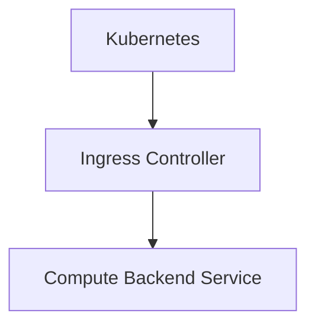
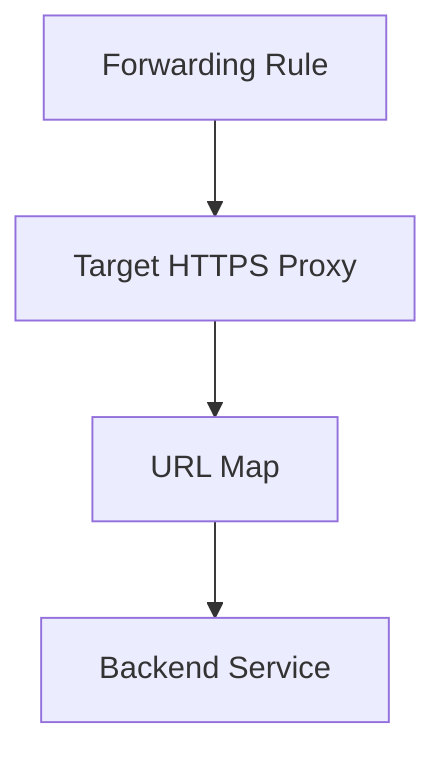
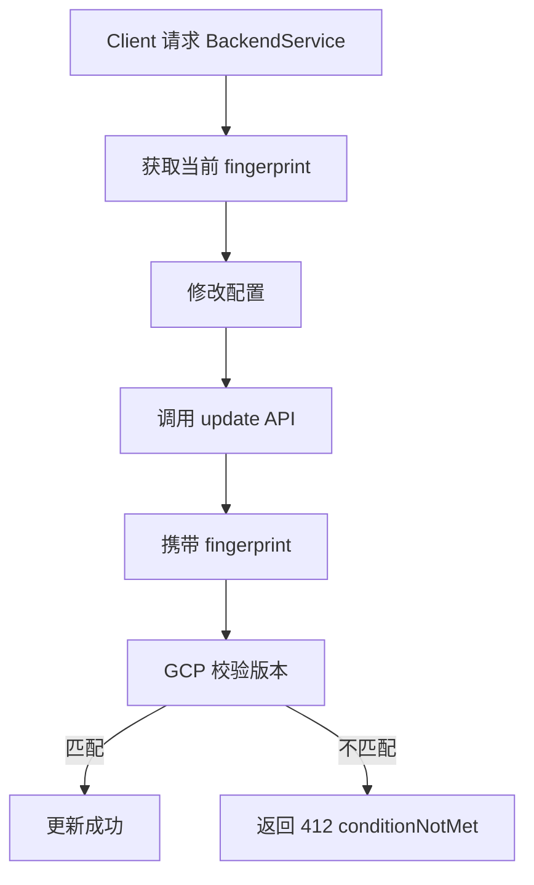

你看到的 `oauth2ClientId` 字段其实**不是 Backend Service 本身的核心属性**，而是 **Cloud IAP (Identity-Aware Proxy)** 配置的一部分。当 Backend Service 被 IAP 保护时，Compute Engine 的 BackendService 资源会附带一个 `iap` 配置块，其中就包含 `oauth2ClientId`。

下面从架构和 CLI 两个角度做一次完整拆解。

---

# 1. 为什么 Backend Service 会出现 oauth2ClientId

## 1.1 本质原因

`oauth2ClientId` 属于 **IAP OAuth 配置**。

在 Google Cloud 中，如果你在 **HTTPS Load Balancer → Backend Service** 上启用了 **IAP**，Compute API 会在 BackendService 资源中保存：

```json
{
  "iap": {
    "enabled": true,
    "oauth2ClientId": "...",
    "oauth2ClientSecretSha256": "..."
  }
}
```

**字段关系：**

| 字段 | 作用 |
|------|------|
| `iap.enabled` | 是否启用 IAP |
| `iap.oauth2ClientId` | OAuth Client ID |
| `iap.oauth2ClientSecret` | OAuth Client Secret |
| `iap.oauth2ClientSecretSha256` | secret hash（只读） |

当 `iap.enabled=true` 时，**必须存在**：

- `oauth2ClientId`
- `oauth2ClientSecret`

---

## 1.2 IAP 为什么需要 OAuth Client

IAP 本质是：

```mermaid
graph TD
    User[User] --> LB[HTTPS Load Balancer]
    LB --> IAP[IAP Authentication<br/>(OAuth login)]
    IAP --> Backend[Backend Service]
    Backend --> App[Your App]
```

OAuth client 用于：

1. 用户访问 LB
2. IAP 重定向到 Google OAuth
3. 登录成功
4. IAP 将 JWT 注入请求头

例如：

```
x-goog-iap-jwt-assertion
x-goog-authenticated-user-email
```

---

# 2. 什么时候会自动出现这个字段

出现这个字段通常有 **4 种来源**。

## 2.1 场景 1：你在 Console 打开了 IAP

**路径：**

```
Security → Identity-Aware Proxy → Enable
```

**系统会：**

1. 创建 / 绑定 OAuth Client
2. 更新 Backend Service

**最终 BackendService 会出现：**

```yaml
iap:
  enabled: true
  oauth2ClientId: xxx.apps.googleusercontent.com
```

---

## 2.2 场景 2：使用 gcloud CLI 开启 IAP

**CLI 命令：**

```bash
gcloud compute backend-services update BACKEND_NAME \
  --global \
  --iap=enabled,oauth2-client-id=CLIENT_ID,oauth2-client-secret=CLIENT_SECRET
```

**参数说明：**

| 参数 | 作用 |
|------|------|
| `--iap` | IAP 配置 |
| `enabled` | 是否启用 |
| `oauth2-client-id` | OAuth Client ID |
| `oauth2-client-secret` | OAuth Secret |

**例如：**

```bash
gcloud compute backend-services update my-backend \
  --global \
  --iap=enabled,oauth2-client-id=123.apps.googleusercontent.com,oauth2-client-secret=xxx
```

---

## 2.3 场景 3：GKE Ingress / Gateway 自动创建

如果你使用：

- GKE Ingress
- Gateway API
- BackendConfig
- GCPBackendPolicy

这些资源开启 IAP 时：



controller 会自动写入 `iap.oauth2ClientId`。

**例如：**

```yaml
spec:
  default:
    iap:
      enabled: true
      clientID: xxx.apps.googleusercontent.com
```

最终会同步到 BackendService。

---

## 2.4 场景 4：Terraform / API 创建

**Terraform 例子：**

```hcl
resource "google_compute_backend_service" "service" {
  name = "my-backend"

  iap {
    oauth2_client_id     = var.client_id
    oauth2_client_secret = var.secret
  }
}
```

**最终生成：**

```yaml
iap:
  oauth2ClientId: ...
```

---

# 3. 即使 IAP 关闭也可能存在这个字段

一个容易混淆的点：

即使 `iap.enabled=false`，`oauth2ClientId` 仍然可能存在。

因为：

> IAP 可以被临时关闭，而 OAuth 参数仍保留。

**所以 BackendService 可能看到：**

```yaml
iap:
  enabled: false
  oauth2ClientId: xxx.apps.googleusercontent.com
```

这通常说明：**IAP 曾经启用过。**

---

# 4. 如何验证这个字段是谁设置的

可以用以下命令追踪。

## 4.1 查看 backend service

```bash
gcloud compute backend-services describe BACKEND_NAME --global
```

关注：

```yaml
iap:
  enabled: ...
  oauth2ClientId: ...
```

---

## 4.2 查看 IAP 页面

```
Console → Security → Identity-Aware Proxy
```

如果这里出现 backend service，说明 **IAP 已配置过**。

---

## 4.3 查看 LB 资源链



**命令：**

```bash
gcloud compute url-maps describe
```

---

# 5. 一个很关键的隐藏点（很多人不知道）

最近 GCP 对 IAP 做过一次改变：

| 以前 | 现在 |
|------|------|
| 用户自己创建 OAuth client | GCP 自动生成 OAuth client |

开发者可能：

- **看不到 OAuth client**
- 但 BackendService 仍然有 `oauth2ClientId`

也就是说：

> OAuth client 是 Google 内部管理

这种情况在新版 IAP 里是正常的。

---

# 6. 总结（重点）

**为什么会出现 oauth2ClientId？**

因为 Backend Service 启用了或曾经启用过 **Cloud IAP**。

---

**常见触发方式：**

| 来源 | 方式 |
|------|------|
| Console | 开启 IAP |
| gcloud | `backend-services update --iap` |
| GKE | BackendConfig / Gateway |
| Terraform | `iap {}` block |

---

**CLI 参数：**

最关键命令：

```bash
gcloud compute backend-services update BACKEND \
  --iap=enabled,oauth2-client-id=ID,oauth2-client-secret=SECRET
```

---

💡 **如果你愿意，我可以帮你做一个更深入的分析：**

比如：

- 如何从一个 BackendService 反推出 IAP 是谁创建的
- 如何找到对应 OAuth client
- GKE Ingress / Gateway Controller 在什么情况下会自动写入这个字段

这在 **GKE + Kong / API Gateway 架构** 里其实非常常见。

---

---

# GCE Backend Service `fingerprint` 字段解析

## 1. 问题分析

在 `Google Compute Engine BackendService` 资源中，经常会看到如下字段：

```json
{
  "name": "my-backend",
  "fingerprint": "abc123xyz=",
  ...
}
```

很多工程师会产生两个疑问：

1. `fingerprint` 是否是一个 **唯一 ID**？
2. 每次 **update Backend Service** 时它是否会改变？

**结论提前说：**

| 特性 | 是否成立 |
|------|----------|
| 是否唯一标识 Backend Service | ❌ 不是 |
| 是否每次更新都会变化 | ✅ 会变化 |
| 是否用于并发控制 | ✅ 是 |

`fingerprint` 本质是 **乐观锁（Optimistic Lock）版本号**。

---

## 2. fingerprint 的真实作用

在 GCP Compute API 中：

> `fingerprint` 是一个 **资源版本校验值**，用于防止并发更新冲突。

**当客户端更新资源时：**

1. 需要携带当前 `fingerprint`
2. GCP 会检查版本是否一致
3. 如果不一致，更新会失败

类似 **ETag / ResourceVersion**。

---

### 类比 Kubernetes

| 系统 | 版本字段 |
|------|----------|
| Kubernetes | `metadata.resourceVersion` |
| HTTP | `ETag` |
| GCP Compute | `fingerprint` |

逻辑完全一样。

---

## 3. 更新 Backend Service 时的流程

**更新流程如下：**



---

## 4. CLI 实际行为

如果你使用：

```bash
gcloud compute backend-services update my-backend --global
```

**gcloud 实际流程：**

1. 先 GET BackendService
2. 读取 `fingerprint`
3. 修改字段
4. PATCH 或 UPDATE
5. 带上 `fingerprint`

所以 CLI 会 **自动处理 fingerprint**。

---

## 5. API 示例

### GET BackendService

```http
GET https://compute.googleapis.com/compute/v1/projects/PROJECT/global/backendServices/my-backend
```

**返回：**

```json
{
  "name": "my-backend",
  "fingerprint": "abc123xyz="
}
```

---

### UPDATE BackendService

**必须带 fingerprint：**

```json
{
  "fingerprint": "abc123xyz=",
  "timeoutSec": 30
}
```

**如果此时资源已经被别人修改：**

```
HTTP 412 conditionNotMet
```

---

## 6. fingerprint 什么时候会变化

只要 **资源发生修改**，`fingerprint` 就会变化。

**例如：**

| 操作 | fingerprint 是否变化 |
|------|----------------------|
| 修改 `timeoutSec` | ✅ |
| 修改 `healthCheck` | ✅ |
| 修改 backend instance group | ✅ |
| 修改 IAP | ✅ |
| 修改 Cloud Armor policy | ✅ |
| 修改 logging | ✅ |

**变化流程：**

```
旧 fingerprint
     ↓
Update BackendService
     ↓
新 fingerprint
```

---

## 7. 一个常见误解

很多人误认为：

```
fingerprint = 资源唯一 ID
```

其实 BackendService 真正的唯一标识是：

```
selfLink
```

**例如：**

```
https://www.googleapis.com/compute/v1/projects/PROJECT/global/backendServices/my-backend
```

或

```
id
```

`fingerprint` 只是 **当前版本号**。

---

## 8. 在实际运维中的意义

在自动化平台中（例如 Terraform / 自研 API 平台），需要注意：

### 场景

多个系统同时修改 BackendService：

```
系统 A 修改 timeout
系统 B 修改 Cloud Armor
```

**如果不使用 fingerprint：**

```
后提交的请求可能覆盖前一个修改
```

GCP 通过 `fingerprint` 防止这种情况。

---

## 9. Debug 示例

**查看 fingerprint：**

```bash
gcloud compute backend-services describe my-backend --global
```

**输出：**

```
fingerprint: AbCdEf123=
```

**更新后再次查看：**

```
fingerprint: XyZ987abc=
```

可以看到 `fingerprint` 已改变。

---

## 10. 结论

| 问题 | 结论 |
|------|------|
| `fingerprint` 是否唯一 | ❌ 不是 |
| `fingerprint` 是否每次更新变化 | ✅ 是 |
| 主要作用 | 并发更新控制 |
| CLI 是否自动处理 | ✅ 会 |

---

💡 **一句话理解：**

```
fingerprint = BackendService 当前配置版本号
```

每次配置变化 → 版本号变化。

---

如果你愿意，我可以再给你深入讲一个 **很多 GCP 工程师都不知道的点**：

**为什么 BackendService / Firewall / TargetProxy / URLMap 全都有 fingerprint，但 Instance 却没有。**

这个其实涉及 **Compute API 的设计模型（非常有意思）**。
