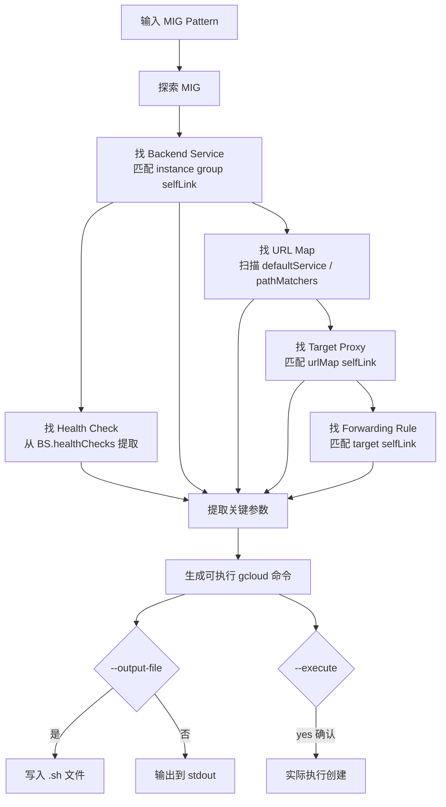
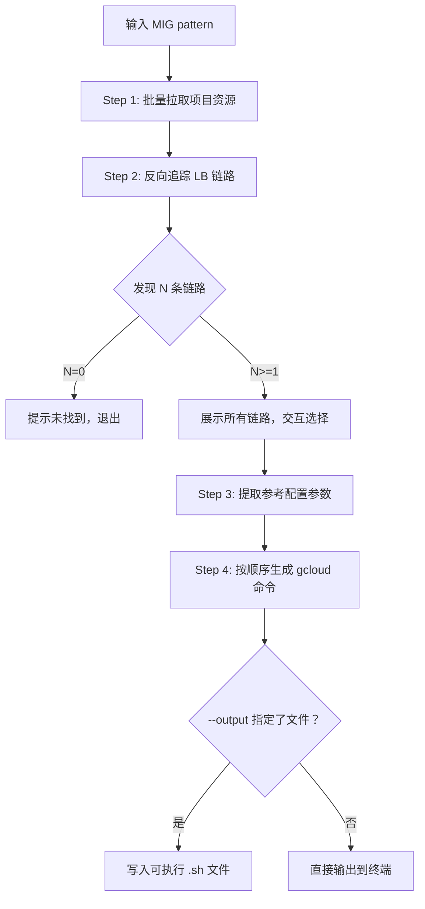

# lb-poc-from-mig.sh
原脚本逻辑分析核心思路：MIG → Backend Service → URL Map → Target Proxy → Forwarding Rule，反向追溯整条 LB 链路。
我先读一下你的脚本，理解当前逻辑，然后再确认几个关键需求。脚本内容已经在文档里了，我已经读完了。让我先确认几个关键需求点：好的，我来帮你梳理当前脚本逻辑并写一个新版本。基于你的需求，我先分析原脚本的逻辑，然后生成新脚本。

---

## 原脚本逻辑分析

**核心思路**：`MIG → Backend Service → URL Map → Target Proxy → Forwarding Rule`，反向追溯整条 LB 链路。

**逻辑是正确的**，但有几个问题：

1. **只能从 MIG 往上找**，如果你知道的是 backend-pattern 或 URL map，入口受限
2. **没有生成 gcloud 创建命令**，只输出报告
3. **没有 dry-run / 交互式确认**
4. **POC 命名建议只有名字，没有完整命令**

---

现在我来写新版本，默认按你最实用的模式：**探索 + 自动生成可执行的 gcloud 创建命令**，跟参考 LB 保持一致。语法检查通过。下面是新脚本与原脚本的对比说明：

---

## 核心逻辑说明



## 相比原脚本的改进

| 能力                  | 原脚本       | 新脚本                        |
| --------------------- | ------------ | ----------------------------- |
| 链路探索              | ✅            | ✅                             |
| 生成创建命令          | ❌ 只打印报告 | ✅ 完整 6 步 gcloud 命令       |
| Health Check 参数提取 | ❌            | ✅ 自动提取 port/path/interval |
| Named Port 检查       | ❌            | ✅ STEP 0 提示                 |
| 写入可执行文件        | ❌            | ✅ `--output-file poc.sh`      |
| 交互执行              | ❌            | ✅ `--execute` + 手动确认      |
| 清理提示              | ❌            | ✅ 输出顺序删除说明            |

## 使用示例

```bash
# 1. 只探索 + 生成命令（不执行）
bash lb-poc-gen.sh my-api-mig --project my-proj --dry-run

# 2. 生成命令写入文件，再手动执行
bash lb-poc-gen.sh my-api-mig --project my-proj \
  --poc-prefix poc-v2 \
  --output-file poc-cmds.sh
bash poc-cmds.sh

# 3. 探索后交互确认执行
bash lb-poc-gen.sh my-api-mig --project my-proj --execute
```

> **注意**：Forwarding Rule 里有 `<OPTIONAL_STATIC_IP>` 占位符，HTTPS 有 `<YOUR_CERT_NAME>`，执行前要替换。


好的，继续帮你创建 `refer-lb-create.sh` 脚本。这个脚本的核心思路是：

1. **发现阶段**：从 MIG 出发，反查出一条完整的 LB 链路
2. **提取阶段**：把链路上每个组件的关键参数提取出来
3. **生成阶段**：按照正确的创建顺序，输出一套可直接执行的 [gcloud](cci:1://file:///Users/lex/git/knowledge/gcp/lb/lb-poc-from-mig.sh:158:0-160:1) 命令

Edited refer-lb-create.sh
Ran command: `chmod +x /Users/lex/git/knowledge/gcp/lb/refer-lb-create.sh`

# 基本用法：从 MIG 出发，交互选择，终端输出命令
bash refer-lb-create.sh my-mig --project my-proj --prefix lex-poc

# 导出到可执行文件
bash refer-lb-create.sh api --project my-proj --region us-central1 \
  --prefix test-poc --output ./create-poc-lb.sh

# 仅发现，不生成创建命令
bash refer-lb-create.sh api --project my-proj --dry-run

# 过滤特定的 LB scheme
bash refer-lb-create.sh api --project my-proj --lb-scheme EXTERNAL_MANAGED
.

脚本已创建在 [/Users/lex/git/knowledge/gcp/lb/refer-lb-create.sh](cci:7://file:///Users/lex/git/knowledge/gcp/lb/refer-lb-create.sh:0:0-0:0)。下面是这个脚本的完整工作流说明：

## 工作流程



## 生成的命令顺序（正确的依赖链）

| 顺序     | 资源                    | 依赖                  |
| -------- | ----------------------- | --------------------- |
| Step 1   | Health Check            | 无                    |
| Step 2   | Backend Service         | Health Check          |
| Step 2.5 | Add Backend（复用 MIG） | Backend Service + MIG |
| Step 3   | URL Map                 | Backend Service       |
| Step 4   | Target Proxy            | URL Map（+ SSL 证书） |
| Step 5   | Forwarding Rule         | Target Proxy          |

## 使用示例

```bash
# 基本用法：从 MIG 出发，交互选择，终端输出命令
bash refer-lb-create.sh my-mig --project my-proj --prefix lex-poc

# 导出到可执行文件
bash refer-lb-create.sh api --project my-proj --region us-central1 \
  --prefix test-poc --output ./create-poc-lb.sh

# 仅发现，不生成创建命令
bash refer-lb-create.sh api --project my-proj --dry-run

# 过滤特定的 LB scheme
bash refer-lb-create.sh api --project my-proj --lb-scheme EXTERNAL_MANAGED
```

脚本末尾还自动附带了**逆序清理命令**（注释状态），POC 做完后取消注释即可一键清理，不用担心资源泄漏。


## Goal

这个脚本的目标不是直接“一键创建所有 LB”，而是先帮你做一件更适合 POC 的事情：

**从一个已存在的 MIG 出发，反查它背后已经挂载过的 Load Balancer 资源链。**

这样你可以：

- 找到一个可参考的现有 LB
- 判断这个 MIG 是否已经被某套 LB 使用
- 看清楚依赖链：
  - backend service
  - health check
  - url map
  - target proxy
  - forwarding rule
- 快速挑出一套最适合复用做 POC 的资源模型

---

## Why This Helps

你这类 POC 的真实难点，不是 `gcloud create` 命令不会写，而是：

- 不确定这个 MIG 背后到底挂了哪套 LB
- 不确定是 global 还是 regional
- 不确定用的是哪种 load balancing scheme
- 不确定上游还有没有：
  - URL Map
  - Target HTTP/HTTPS Proxy
  - SSL 证书
  - Forwarding Rule
- 不确定一个 MIG 是否被多个 backend service 共享

这个脚本就是为这个场景设计的。

---

## Script Path

- [lb-poc-from-mig.sh](/Users/lex/git/knowledge/gcp/lb/lb-poc-from-mig.sh)

---

## What It Does

输入一个 MIG 名称或模式后，脚本会尝试：

1. 查找匹配的 MIG
2. 反查哪些 backend service 引用了这个 MIG 对应的 instance group
3. 继续向上查：
   - URL maps
   - target HTTP/HTTPS/TCP/SSL/gRPC proxies
   - forwarding rules
4. 输出一条从 MIG 到 LB frontend 的依赖链
5. 可选输出一组适合 POC 的建议命名

---

## Example Usage

### 基本用法

```bash
bash /Users/lex/git/knowledge/gcp/lb/lb-poc-from-mig.sh my-mig
```

### 指定 project

```bash
bash /Users/lex/git/knowledge/gcp/lb/lb-poc-from-mig.sh my-mig \
  --project my-project
```

### 按 region 收敛

```bash
bash /Users/lex/git/knowledge/gcp/lb/lb-poc-from-mig.sh api \
  --project my-project \
  --region us-central1
```

### 只保留某类 backend service

```bash
bash /Users/lex/git/knowledge/gcp/lb/lb-poc-from-mig.sh api \
  --project my-project \
  --backend-pattern web
```

### 只看某种 LB scheme

```bash
bash /Users/lex/git/knowledge/gcp/lb/lb-poc-from-mig.sh api \
  --project my-project \
  --lb-scheme EXTERNAL_MANAGED
```

### 顺手输出一套 POC 资源建议名

```bash
bash /Users/lex/git/knowledge/gcp/lb/lb-poc-from-mig.sh api \
  --project my-project \
  --suggest-names
```

---

## Supported Filters

- `mig`
  - 必填，MIG 名称或正则模式
- `--project`
  - 指定 GCP project
- `--region`
  - 限定 region
- `--zone`
  - 限定 zone
- `--backend-pattern`
  - 用 backend service 名称再过滤
- `--url-map-pattern`
  - 用 URL map 名称再过滤
- `--forwarding-rule-pattern`
  - 用 forwarding rule 名称再过滤
- `--lb-scheme`
  - 例如 `EXTERNAL_MANAGED`、`INTERNAL_MANAGED`
- `--include-empty`
  - 即使没找到 LB 依赖也显示 MIG
- `--suggest-names`
  - 输出一套 POC 资源命名建议

---

## Output Model

脚本输出的是一份结构化链路，而不是单条命令。

典型输出会包含：

- MIG
- named ports
- backend service
- health checks
- URL map
- target proxy
- forwarding rule

也就是说，你会先知道：

**这套 LB 到底长什么样，依赖有哪些，哪些资源可能能共享，哪些大概率需要重建。**

---

## Important Limits

### 1. MIG 不是万能入口

如果一个 MIG 根本没有被任何 backend service 引用，那么脚本自然推不出完整 LB。

### 2. 一个 MIG 可能被多个 LB 复用

这不是异常，反而正是你做 POC 时最有价值的场景。  
脚本会把这些候选链路全部列出来，让你自己挑最合适的一套。

### 3. 发现到依赖链，不等于可以直接复用

你最终还需要人工确认这些资源是否真的能共享：

- health check
- named port
- instance group port
- firewall rules
- static IP
- SSL certificate
- proxy-only subnet
- URL map 规则冲突
- target proxy 绑定关系

### 4. 不同 LB 类型链路不完全一样

例如：

- Application LB 会更偏 `URL map -> target proxy -> forwarding rule`
- TCP/SSL Proxy LB 可能更偏 `backend service -> target tcp/ssl proxy -> forwarding rule`

脚本已经尽量同时覆盖这些常见路径，但它本质仍然是“发现工具”，不是“官方拓扑真理机”。

---

## Recommended POC Workflow

建议按这个顺序使用：

1. 用脚本输入 MIG 名称，找到所有关联的 LB 资源链
2. 挑一条最接近你目标架构的链路
3. 确认哪些资源可共享，哪些必须新建
4. 再写你的 POC 创建脚本

也就是说，这个脚本更像：

**POC 前的资源侦察工具**

而不是直接替代 `gcloud compute create ...`

---

## Suggested Next Step

如果你后面希望再进一步自动化，我建议下一步继续做成两段式：

1. `discover`
   - 先找出现有资源链
2. `generate`
   - 基于选中的 backend service / URL map / target proxy，生成一份新的 POC 创建命令模板

这样会比现在直接一口气“自动创建 LB”更稳。

---

## Dependency

这个 shell 脚本依赖：

- `gcloud`
- `jq`
