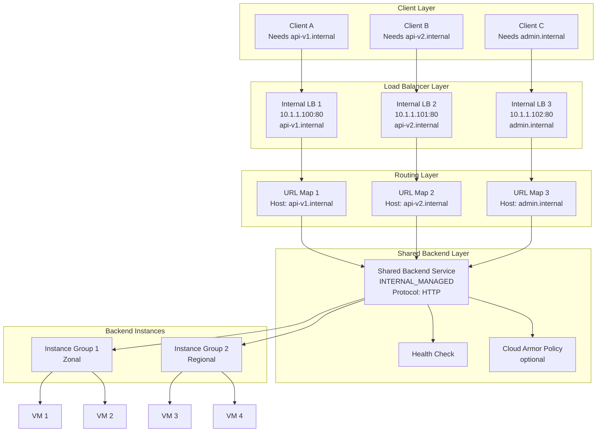
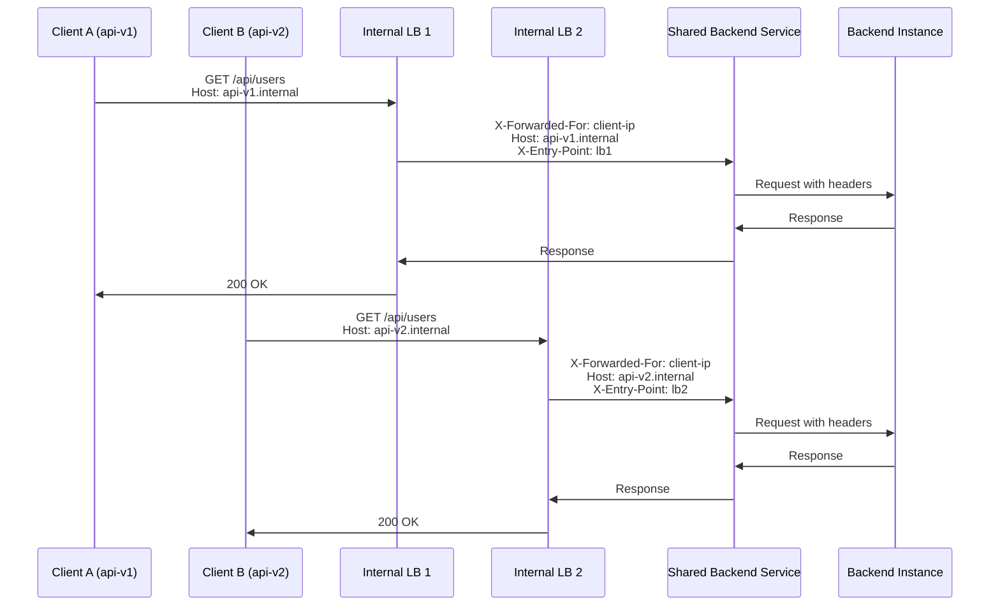

# Multiple Internal Load Balancers Binding to Single Backend Service

## Overview

In GCP, multiple Internal Load Balancers (ILBs) can share a single Backend Service. This is a valid architecture pattern that allows different entry points (VIPs/IPs) to route traffic to the same backend infrastructure while maintaining separation at the load balancer layer.

## Architecture Diagram



## Components and Flow

| Component         | Role                 | Description                                       |
| ----------------- | -------------------- | ------------------------------------------------- |
| Forwarding Rule   | Entry Point          | Defines ILB VIP and port                          |
| Target Proxy      | Protocol Handler     | HTTP/HTTPS proxy termination                      |
| URL Map           | Routing Rules        | Host-based and path-based routing                 |
| Backend Service   | Traffic Distribution | Defines backends, health checks, session affinity |
| Health Check      | Monitoring           | Determines instance health                        |
| Backend Instances | Actual Service       | NEGs or Instance Groups                           |

## Implementation

### Prerequisites

- Same region for all components
- VPC network with appropriate subnets
- Health check configuration
- Instance groups or NEGs as backends

### Step 1: Create Backend Service

```bash
# Create shared backend service
gcloud compute backend-services create shared-backend-service \
    --load-balancing-scheme=INTERNAL_MANAGED \
    --protocol=HTTP \
    --health-checks=my-health-check \
    --region=us-central1

# Add instance groups as backends
gcloud compute backend-services add-backend shared-backend-service \
    --instance-group=instance-group-1 \
    --instance-group-region=us-central1 \
    --region=us-central1

gcloud compute backend-services add-backend shared-backend-service \
    --instance-group=instance-group-2 \
    --instance-group-region=us-central1 \
    --region=us-central1
```

### Step 2: Create Health Check

```bash
gcloud compute health-checks create http my-health-check \
    --port=80 \
    --request-path=/healthz \
    --region=us-central1
```

### Step 3: Create URL Maps (One per ILB)

```bash
# URL Map for api-v1
gcloud compute url-maps create lb1-url-map \
    --default-backend-service=shared-backend-service \
    --region=us-central1

# URL Map for api-v2
gcloud compute url-maps create lb2-url-map \
    --default-backend-service=shared-backend-service \
    --region=us-central1

# URL Map for admin
gcloud compute url-maps create lb3-url-map \
    --default-backend-service=shared-backend-service \
    --region=us-central1

# Add host rules for routing
gcloud compute url-maps import lb1-url-map \
    --source=lb1-config.yaml \
    --region=us-central1
```

### Step 4: Create Target HTTP Proxies

```bash
# Proxy for LB1
gcloud compute target-http-proxies create lb1-proxy \
    --url-map=lb1-url-map \
    --region=us-central1

# Proxy for LB2
gcloud compute target-http-proxies create lb2-proxy \
    --url-map=lb2-url-map \
    --region=us-central1

# Proxy for LB3
gcloud compute target-http-proxies create lb3-proxy \
    --url-map=lb3-url-map \
    --region=us-central1
```

### Step 5: Create Forwarding Rules (ILBs)

```bash
# ILB 1 - api-v1.internal
gcloud compute forwarding-rules create lb1-forwarding-rule \
    --load-balancing-scheme=INTERNAL_MANAGED \
    --network=default \
    --subnet=default \
    --address=10.1.1.100 \
    --ports=80 \
    --target-http-proxy=lb1-proxy \
    --region=us-central1

# ILB 2 - api-v2.internal
gcloud compute forwarding-rules create lb2-forwarding-rule \
    --load-balancing-scheme=INTERNAL_MANAGED \
    --network=default \
    --subnet=default \
    --address=10.1.1.101 \
    --ports=80 \
    --target-http-proxy=lb2-proxy \
    --region=us-central1

# ILB 3 - admin.internal
gcloud compute forwarding-rules create lb3-forwarding-rule \
    --load-balancing-scheme=INTERNAL_MANAGED \
    --network=default \
    --subnet=default \
    --address=10.1.1.102 \
    --ports=80 \
    --target-http-proxy=lb3-proxy \
    --region=us-central1
```

## URL Map Configuration Example

```yaml
# lb1-url-map.yaml for api-v1.internal
name: lb1-url-map
defaultService: projects/PROJECT/regions/us-central1/backendServices/shared-backend-service
hostRules:
  - hosts:
      - api-v1.internal.company.com
    pathMatcher: api-v1-matcher
pathMatchers:
  - name: api-v1-matcher
    defaultService: projects/PROJECT/regions/us-central1/backendServices/shared-backend-service
    routeRules:
      - priority: 1
        matchRules:
          - prefixMatch: /
        routeAction:
          requestHeadersToAdd:
            - headerName: X-Entry-Point
              headerValue: lb1-api-v1
              replace: true
```

## Use Cases

| Use Case               | Description                           | Example                                         |
| ---------------------- | ------------------------------------- | ----------------------------------------------- |
| Multi-tenancy          | Different tenants access same backend | Tenant A -> 10.1.1.100, Tenant B -> 10.1.1.101  |
| Blue-Green Deployment  | Different LB for different versions   | Blue: 10.1.1.100 -> v1, Green: 10.1.1.101 -> v2 |
| A/B Testing            | Different routing rules per entry     | Feature flags via different hosts               |
| Environment Separation | Dev/Staging/Prod access               | dev -> 10.1.1.100, staging -> 10.1.1.101        |
| Service Segmentation   | Different services, same backend      | api -> 10.1.1.100, web -> 10.1.1.101            |

## Limitations

### 1. Protocol Restriction
- Only HTTP/HTTPS supported for Internal Application LB
- TCP/UDP requires Internal TCP/UDP Load Balancer

### 2. SSL Certificate Management
Each ILB with HTTPS requires separate SSL certificate for its domain:
```bash
# LB1 certificate
gcloud compute ssl-certificates create lb1-cert \
    --domains=api-v1.internal.company.com \
    --region=us-central1

# LB2 certificate
gcloud compute ssl-certificates create lb2-cert \
    --domains=api-v2.internal.company.com \
    --region=us-central1
```

### 3. Shared Security Policy
Cloud Armor policies bind to Backend Service, affecting ALL ILBs:
```bash
# Single policy applies to all ILBs using shared-backend-service
gcloud compute backend-services update shared-backend-service \
    --security-policy=shared-security-policy \
    --region=us-central1
```

### 4. Monitoring Complexity
Traffic from multiple ILBs is aggregated at Backend Service level.

## Traffic Flow with Request Context



## Differentiated Routing Example

To differentiate traffic from different ILBs at the application level:

```yaml
# URL Map with path-based routing to different backends
name: unified-url-map
defaultService: projects/PROJECT/regions/us-central1/backendServices/shared-backend-service
hostRules:
  - hosts:
      - api-v1.internal.company.com
    pathMatcher: v1-matcher
  - hosts:
      - api-v2.internal.company.com
    pathMatcher: v2-matcher
pathMatchers:
  - name: v1-matcher
    defaultService: projects/PROJECT/regions/us-central1/backendServices/backend-v1
  - name: v2-matcher
    defaultService: projects/PROJECT/regions/us-central1/backendServices/backend-v2
```

## Validation Commands

```bash
# Verify Backend Service configuration
gcloud compute backend-services describe shared-backend-service \
    --region=us-central1 \
    --format="yaml(name,loadBalancingScheme,protocol,securityPolicy)"

# List all URL Maps using the same Backend Service
for urlmap in $(gcloud compute url-maps list --region=us-central1 --format="value(name)"); do
    target=$(gcloud compute url-maps describe $urlmap --region=us-central1 --format="value(defaultService)" 2>/dev/null)
    if [[ "$target" == *"shared-backend-service"* ]]; then
        echo "$urlmap -> $target"
    fi
done

# List forwarding rules using the same target proxy
gcloud compute forwarding-rules list \
    --region=us-central1 \
    --filter="target:*lb*-proxy"
```

## Summary

| Aspect                     | Detail                 |
| -------------------------- | ---------------------- |
| Multiple ILBs to Single BS | ✅ Supported            |
| Same Region Required       | ✅ Required             |
| Protocol                   | HTTP/HTTPS only        |
| SSL Certificates           | Separate per domain    |
| Cloud Armor                | Shared across all ILBs |
| Health Checks              | Shared configuration   |
| Monitoring                 | Aggregated at BS level |

## When to Use This Pattern

✅ **Use when:**
- Multiple entry points to same backend service
- Need host-based routing differentiation
- Blue-green or A/B deployment strategies
- Multi-tenant isolation at network level

❌ **Consider alternatives when:**
- Need differentiated security policies per entry
- Require TCP/UDP protocol support
- Different health check requirements per entry