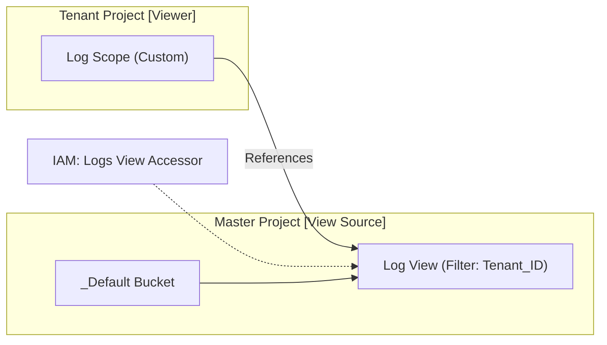
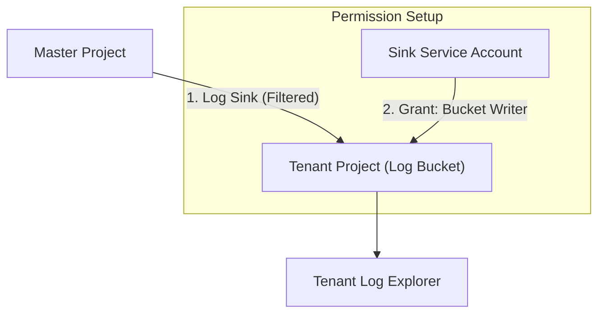
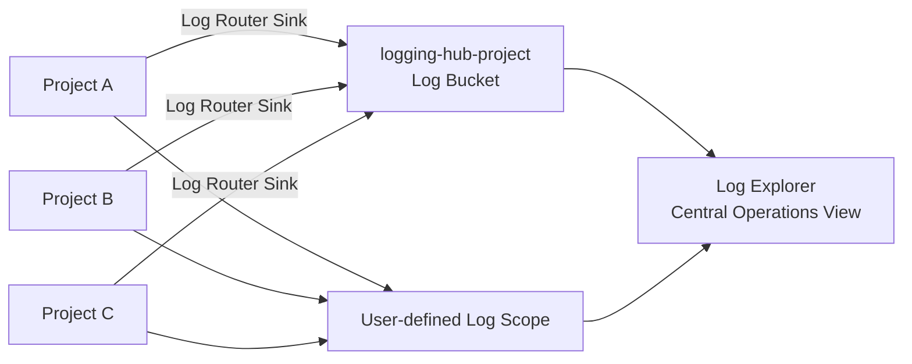

# GCP Cross-Project Log Sharing 最佳实践

## 1. 场景概述

在多项目架构（Master/Tenant Project）中，日志共享是实现统一观测和权限隔离的核心需求。根据 AIBANG 的管理模式，我们需要解决以下核心痛点：
- **Master 项目视图**：在 Master 项目中统一查看所有 Tenant 项目的网关日志或基础设施审计日志。
- **Tenant 项目视图**：在租户项目内查看 Master 项目中关联的组件日志（如负载均衡、Pod 运行日志）。

---

## 2. 技术选型：Log Scopes vs. Log Sinks

| 维度 | Log Scopes (Log Views) | Log Routing (Sinks) |
| :--- | :--- | :--- |
| **实现原理** | 逻辑聚合，基于 IAM 权限跨项目检索 | 物理导出，日志从源项目流向目标项目 |
| **存储成本** | **低**（仅在源项目计费，不产生副本） | **高**（源项目和目标项目均可能计费） |
| **配置复杂度** | 简单（主要通过 IAM 和视图定义） | 中等（需要配置 Sink 和目标项目权限） |
| **延迟** | 近实时 | 近实时 |
| **适用场景** | 跨项目日志排障、开发/运维统一视图 | 合规审计、长期归档、数据分析 (BigQuery) |

---

## 3. 方案一：使用 Log Scopes 实现聚合查询（推荐）

Log Scopes 允许您在 Log Explorer 中同时搜索多个项目的日志。

### 3.1 核心流程



### 3.2 实施步骤

1.  **在 Master 项目创建 Log View**：
    为了安全，不建议共享整个 Bucket。在 Master 项目的 Log Bucket 中创建一个特定视图，通过过滤器（如 `resource.labels.project_id="TENANT_A"`）隔离日志。
    ```bash
    gcloud logging views create [VIEW_ID] 
        --bucket=[BUCKET_ID] 
        --location=global 
        --log-filter='jsonPayload.tenant="tenant_a"'
    ```

2.  **在 Tenant 项目创建 Log Scope**：
    在 Tenant 项目中创建一个 Log Scope，将上述 Master 项目的 Log View 添加到其中。
    *注意：每个 Scope 最多支持 5 个项目。*

3.  **授予权限**：
    确保 Tenant 项目的用户在 Master 项目中拥有 `roles/logging.viewAccessor` 角色，并能访问特定的 Log View。

---

## 4. 方案二：使用 Log Sink 实现物理导出

适用于需要将日志物理存储在 Tenant 项目（满足合规性或利用 Tenant 的存储额度）的情况。

### 4.1 核心流程



### 4.2 实施步骤

1.  **在 Tenant 项目准备 Log Bucket**：
    在 Tenant 项目中创建一个目标 Log Bucket。

2.  **在 Master 项目创建 Sink**：
    ```bash
    gcloud logging sinks create [SINK_NAME] 
        logging.googleapis.com/projects/[TENANT_PROJECT_ID]/locations/global/buckets/[TENANT_BUCKET_ID] 
        --log-filter="resource.type=gke_cluster AND resource.labels.cluster_name=[CLUSTER_NAME]"
    ```

3.  **配置服务账号权限**：
    记录下 Sink 创建时生成的 `writerIdentity`（通常是一个 Service Account），并在 Tenant 项目中授予该账号 `roles/logging.bucketWriter` 权限。

---

## 5. 注意事项与最佳实践

### 5.1 限制提醒
- **Log Scopes 限制**：一个 Log Scope 最多包含 100 个资源（Log Views 或 Projects），但其中 **Project 数量不能超过 5 个**。
- **命名规范**：`_Default` 作用域不可修改，建议针对不同租户创建 `scope-[TENANT-ID]`。

### 5.2 权限控制
- 遵循最小权限原则（PoLP）。使用 **Log Views** 而非直接共享项目访问权，可以有效防止租户 A 看到租户 B 的日志。

### 5.3 成本优化
- 如果只是为了排障查看，**禁止使用 Sink 导出**，以免产生双重计费（Ingestion + Storage）。优先使用 Log Scopes。

---

## 6. 故障排除建议

- **无法搜索到日志？** 
    - 检查源项目是否有日志生成。
    - 检查 `writerIdentity` 是否已在目标项目生效（Sink 模式）。
    - 确认 IAM 权限是否有 1-5 分钟的同步延迟。
- **Log Scope 报错？** 
    - 确认引用的 Log View 路径是否正确：`projects/[PROJECT_ID]/locations/[LOC]/buckets/[BUCKET]/views/[VIEW]`。


# codex 

# Cross Project Sharing Logs on GCP

## 1. 背景与目标

基于当前平台模型：

- `Master Project`：Cluster、Redis、R/F/B Proxy、Images、AI Models
- `Tenant Project`：Log、Secrets、Cloud Armor、GLB、ILB、Pub/Sub、reCAPTCHA、BigQuery 等

核心需求：

- 支持 Project A/B/C 之间的日志共享与统一查询。
- 支持在 B/C 侧查看 A 的日志（以及多项目统一排障）。
- 方案必须生产可落地，优先 GCP 原生能力。

---

## 2. 结论（V1 推荐架构）

推荐采用两层组合：

1. **日志汇聚层（必须）**：使用 **Cloud Logging Router + Sink**，将 A/B/C 日志路由到一个集中日志项目（建议命名 `logging-hub-project`）中的 Log Bucket。
2. **查询呈现层（可选）**：在运维项目创建 **Log Scope**，把 A/B/C（或 logging-hub）纳入 scope，统一在 Log Explorer 查询。

该组合同时满足：

- 数据集中存储（可做长留存、权限隔离、审计）
- 多项目可观测查询入口
- 清晰的 IAM 边界

复杂度评估：`Moderate`

---

## 3. 方案对比与取舍

| 方案 | 能力 | 优点 | 限制/风险 | 适用 |
|---|---|---|---|---|
| 仅 Log Scope | 跨项目聚合查询 | 上手快、配置轻 | 不是数据复制；受 scope 限额约束（每个 scope 最多 5 个 project） | 小规模临时排障 |
| 仅 Sink 到中心桶 | 集中存储与查询 | 权限、留存、合规可控；扩展性好 | 需要 IAM 和路由治理 | 生产长期方案 |
| Sink + Log Scope（推荐） | 集中存储 + 聚合视图 | 运维体验最好；兼容历史组织结构 | 设计略复杂 | 多租户平台生产环境 |

> 关键点：你提出的“通过 sink”是生产主路径；Log Scope 更适合做查询体验增强，而不是替代日志路由。

---

## 4. 目标拓扑



---

## 5. 实施步骤（Production V1）

## Step 0. 资源与命名约定

- 新建或指定集中日志项目：`logging-hub-project`
- Log Bucket：`central-platform-logs`
- 建议按区域/合规配置（例如 `global` 或指定 region），并设置 retention（如 30/90/365 天分层）

## Step 1. 在集中项目创建 Log Bucket

```bash
gcloud logging buckets create central-platform-logs \
  --project=logging-hub-project \
  --location=global \
  --description="Centralized logs for master/tenant projects" \
  --retention-days=90
```

为什么：统一日志落点，便于权限、保留策略、审计与成本治理。

## Step 2. 在源项目（A/B/C）创建 Sink 到中心 Bucket

以 Project A 为例：

```bash
gcloud logging sinks create sink-to-central-logs \
  logging.googleapis.com/projects/logging-hub-project/locations/global/buckets/central-platform-logs \
  --project=project-a
```

执行后会返回 sink writer identity（服务账号）。

## Step 3. 给 sink writer identity 授权写入中心 Bucket

```bash
gcloud logging buckets add-iam-policy-binding central-platform-logs \
  --location=global \
  --project=logging-hub-project \
  --member="serviceAccount:LOG_SINK_WRITER_IDENTITY" \
  --role="roles/logging.bucketWriter"
```

对 B/C 重复 Step 2~3。

为什么：跨项目写入的核心是 `bucketWriter` 授权给每个源项目 sink identity。

## Step 4. 配置过滤规则（降低成本与噪音）

建议在 sink 上增加过滤器，仅导出关键日志：

- GKE control plane / workload error
- Cloud Load Balancing / Cloud Armor security 事件
- Kong/Nginx 入口访问与 4xx/5xx
- 审计日志（Admin Activity 必留；Data Access 按需）

示例（只导出 error 及关键资源）：

```text
severity>=ERROR
OR resource.type=("k8s_container" OR "http_load_balancer")
OR logName:"cloudaudit.googleapis.com"
```

## Step 5. 创建 Log Scope（可选）

- 在运维项目创建 user-defined log scope。
- 把 project-a/project-b/project-c（或 logging-hub-project）加到 scope。
- 让 SRE/平台团队在一个 Log Explorer 视图排障。

你给出的限制需要纳入设计：

- `_Default` scope 不可删除或修改
- user-defined scope 只能含 project（不能直接含 folder/org）
- scope 是 global
- 每项目最多 100 scopes
- 每个 scope 总计 100 个成员（views+projects），且最多 5 个 project

---

## 6. IAM 最小权限建议

| 角色 | 建议授予对象 | 用途 |
|---|---|---|
| `roles/logging.bucketWriter` | 每个源项目 sink writer identity | 写入中心日志桶 |
| `roles/logging.viewer` / `roles/logging.privateLogViewer` | SRE/平台运维组 | 查询日志 |
| `roles/logging.configWriter`（谨慎） | 平台管理员组 | 管理 sink、bucket、exclusion |

安全边界建议：

- 只允许平台组修改 sink 与 retention。
- 业务租户默认仅可看自己 project 日志视图（若需要跨租户必须显式审批）。
- 开启审计日志，记录谁改了日志路由与权限。

---

## 7. 验证清单

1. 在 A 产生一条测试日志（应用日志或 `gcloud logging write`）。
2. 在 `logging-hub-project` 的 `central-platform-logs` 查询是否到达。
3. 在 B/C 的 Log Explorer（通过 scope）确认是否可见 A 日志。
4. 验证权限边界：非授权账户无法访问跨租户日志。
5. 验证延迟（通常秒级到分钟级）与日志丢失率。

示例测试命令：

```bash
gcloud logging write test_cross_project_log \
  "cross-project logging test $(date -u +%Y-%m-%dT%H:%M:%SZ)" \
  --project=project-a \
  --severity=ERROR
```

---

## 8. 回滚与故障处理

- 快速止损：先禁用/更新 sink filter，停止不必要日志导出。
- 权限问题：检查 sink writer identity 是否仍具备 `roles/logging.bucketWriter`。
- 查询不到日志：检查
  - 源日志是否生成
  - sink filter 是否过严
  - bucket location/名称是否正确
  - 日志到达延迟窗口是否已超过

---

## 9. 成本与可靠性建议

- 优先导出高价值日志，避免“全量永留存”。
- 对访问日志按采样或按状态码过滤（例如保留 4xx/5xx 全量，2xx 采样）。
- 分层 retention：热日志短留存，审计日志长留存。
- 定期评审 sink filter 与 exclusion，按月做成本回顾。

---

## 10. 分阶段路线图

- **Immediate Fix（1~2 天）**
  - 建立 `logging-hub-project` + central bucket
  - 为 A/B/C 建 sink 并打通 IAM
- **Structural Improvement（1~2 周）**
  - 标准化 sink 模板（Terraform/脚本）
  - 统一日志标签规范（tenant_id、env、service）
  - 建立 Log-based Metrics + Alerting
- **Long-term Redesign（季度）**
  - 引入组织级日志治理策略（folder 级模板化）
  - 与 SIEM/数据仓库联动（BigQuery/SOC）
  - 成熟化多租户日志可见性模型（按租户隔离视图）

---

## 11. 给当前平台模型的直接建议

针对你当前的 Master/Tenant 拆分，建议：

- **Master 项目日志**和**Tenant 项目日志**都路由到 `logging-hub-project`。
- 保留 tenant 侧最小本地留存（短期排障），核心保留策略放在中心桶。
- 通过 IAM + log views 控制租户可见性，避免跨租户日志泄露。
- 把 Cloud Armor / GLB / ILB / Kong/Nginx 入口日志纳入统一安全观测面。

这套做法比“仅靠 log scope”更稳健，且可随项目数量增长而扩展。