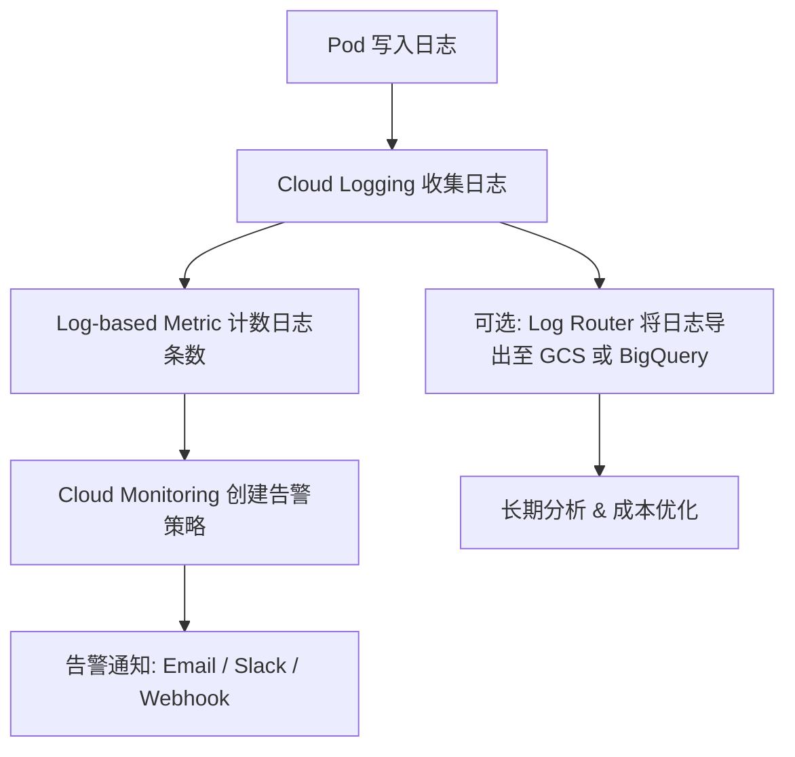
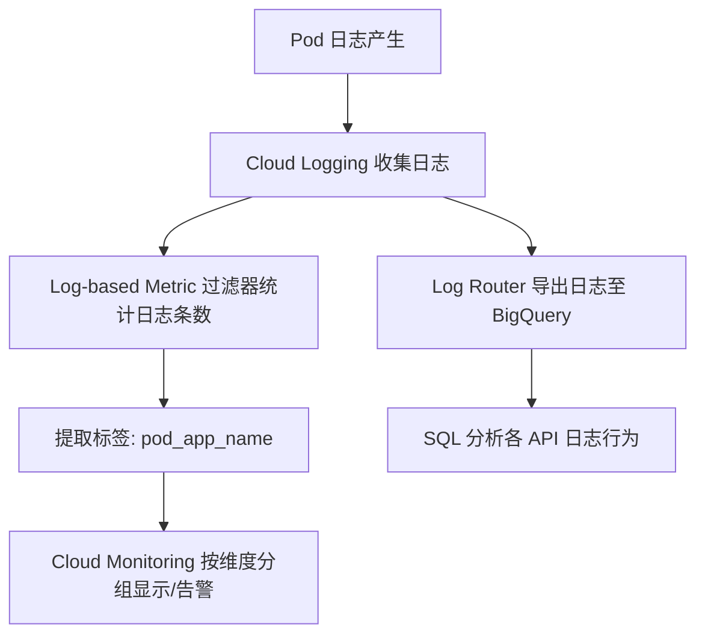

```log 
对于GCP平台上,比如我们的GKE 里面运行了很多的API 但是API的名字都不一样.我们现在遇到这样问题.就是某个用户的API的Pod读写日志比较频繁,比如其会频繁的写入日志到GCP的log explorer 也就是stack driver . 那么有什么最佳的实践方案.我能监控都用户API的写入次数或者如何去监控这个? 或者起码能告警出来?
```

可以通过 **Cloud Logging Metrics + Cloud Monitoring Alerts** 来监控并告警高频日志写入情况，避免某个用户的 API 过度占用 GCP Logging 资源。

---

## **最佳实践方案**

  

### **1. 使用 Cloud Logging 自定义指标 (Log-based Metrics)**

  

Cloud Logging 支持基于日志创建自定义指标，然后可以用 Monitoring 设置告警。

  

#### **步骤**

1. 打开 **Cloud Logging → Log-based Metrics**。
    
2. 创建一个 **计数器指标（Counter Metric）**：
    
    - **过滤条件**：过滤特定命名空间、API 名称或 Pod 标签的日志，例如：
        
    

```bash
resource.type="k8s_container"
resource.labels.cluster_name="your-gke-cluster"
resource.labels.namespace_name="api-namespace"
labels.k8s-pod/app="user-api-name"
```

2. -   
        
    - 指标类型选择 **计数器**，统计匹配日志的条数。
        
    
3. 保存指标，例如命名为 log_write_count_user_api_xx。
    

---

### **2. 配置 Cloud Monitoring 告警**

1. 打开 **Cloud Monitoring → Alerting**。
    
2. 创建告警策略：
    
    - **目标指标**：选择刚刚创建的 log_write_count_user_api_xx。
        
    - 设置条件：
        
        - 例如 **5 分钟内日志写入超过 1000 条**：
            
        
    

```
条件：metric.log_write_count_user_api_xx > 1000
窗口：5 分钟
```

2.   
    
3. 设置通知渠道（Email、Slack、Webhook）。
    

---

### **3. 监控所有 API 的日志写入**

  

如果要监控所有 API 的日志写入量，可在日志过滤器中使用 labels.k8s-pod/app 通配，并在 **Metrics Explorer** 中查看所有 Pod 的写入情况。

---

### **4. 成本优化 & 防止过量写入**

- 可在应用层控制日志级别，避免 DEBUG 日志在生产环境频繁写入。
    
- 使用 **Cloud Logging 排除过滤器 (Exclusion Filters)** 排除不必要的日志。
    
- 开启 **Log Router + Sink + GCS 或 BigQuery**，长期保存但不影响 Logging 配额。
    

---

### **Mermaid 流程图**



---

是否需要我帮你写一份 **完整的 log-based metric 过滤器示例**，支持 **动态识别所有 API 并分别统计**（例如通过 labels.k8s-pod/app 自动分组）？还是你只想对**单个用户的 API** 做监控？


以下是一个完整的 **Cloud Logging log-based metric 过滤器示例**，可以动态识别所有 GKE Pod 的 API，并统计每个 Pod 的日志写入次数。

---

## **1. 过滤器示例**

```bash
resource.type="k8s_container"
resource.labels.cluster_name="your-gke-cluster"
severity>=DEFAULT
labels.k8s-pod/app!=""
```

### **说明**

- resource.type="k8s_container"：仅统计 GKE 容器日志。
    
- resource.labels.cluster_name="your-gke-cluster"：限定集群。
    
- severity>=DEFAULT：统计所有级别的日志，若只统计 ERROR 及以上，可改为 severity>=ERROR。
    
- labels.k8s-pod/app!=""：确保日志带有 Pod 的应用标签。
    

---

## **2. 创建计数器指标**

- 类型：**Counter Metric**
    
- 指标名称：api_log_write_count
    
- 资源类型：k8s_container
    
- 标签提取（重要）：在创建指标时添加 **user_label**，例如：
    
    - pod_app_name = labels.k8s-pod/app
        
    - 这样可以在 Monitoring 中按 pod_app_name 维度分组，查看每个 API 的日志写入次数。
        
    

---

## **3. 设置告警策略**

- 指标：api_log_write_count
    
- 条件示例：
    

```
每个 pod_app_name 的日志写入速率 > 5000 条/5分钟
```

-   
    
- 告警通知：Email、Slack、PagerDuty 或 Webhook。
    

---

## **4. 可选：导出日志到 BigQuery 分析**

  

如果需要更细的统计（例如按用户 ID、API 路径统计），可以将日志路由至 BigQuery，然后用 SQL 做分组分析。

---

## **Mermaid 流程图**



---

要不要我帮你写一份 **gcloud 命令行** 创建此 log-based metric 的示例（包含 pod_app_name 标签提取），还是要 **Terraform 版本** 方便直接在 IaC 中管理？还是 **两者都要**？