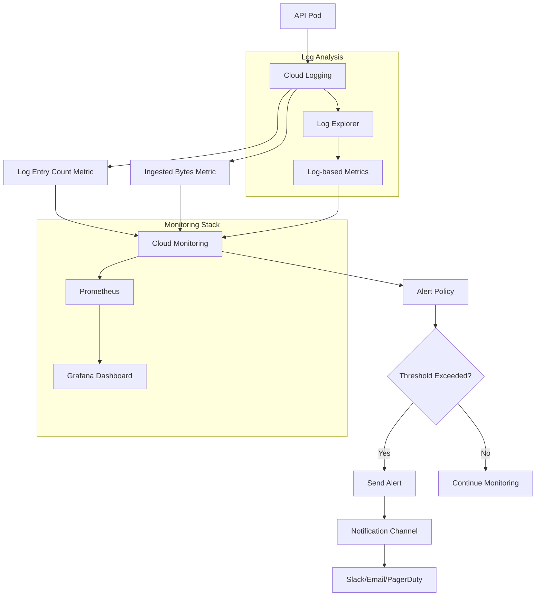
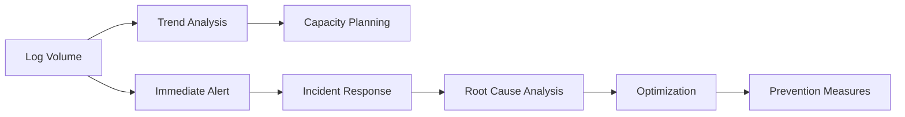
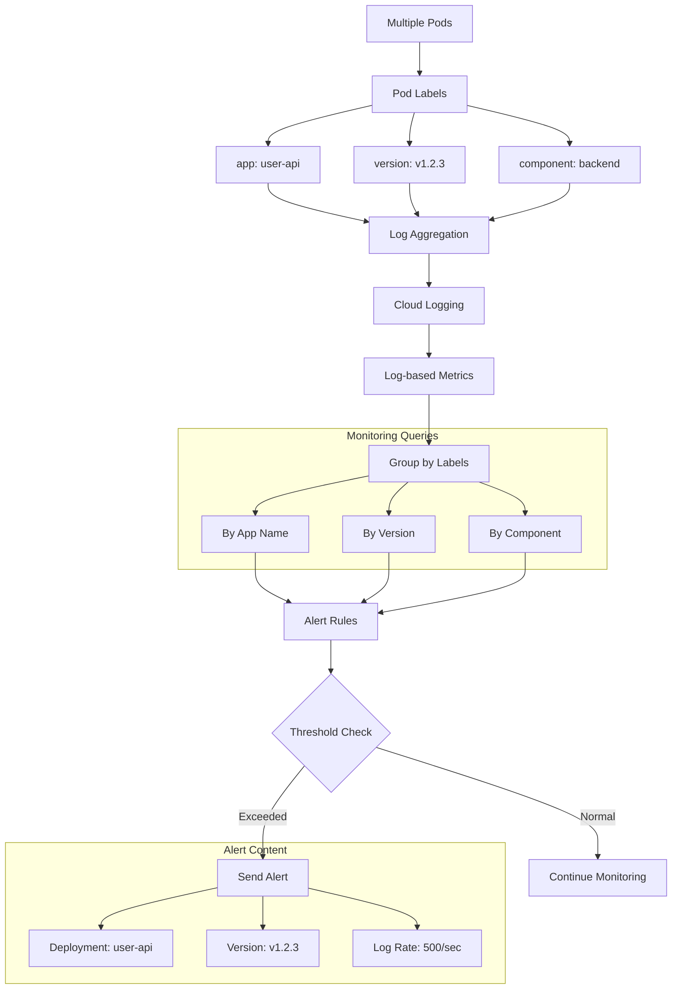
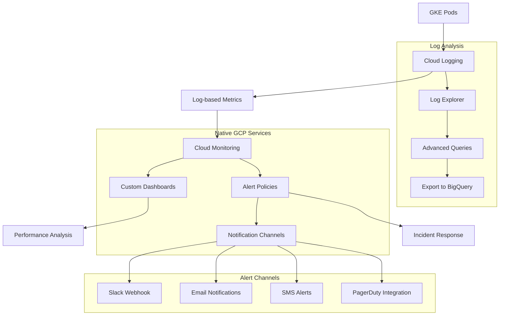

# GCP 日志监控和限制最佳实践

## 概述

在GKE环境中，API Pod频繁写入日志到Cloud Logging (Stack Driver) 可能导致成本增加和性能问题。本文档提供监控和控制日志写入的最佳实践方案。

## 监控策略

### 1. 日志量监控

#### 使用Cloud Monitoring创建自定义指标
```yaml
# 监控每个Pod的日志写入量
resource.type="k8s_container"
resource.labels.cluster_name="your-cluster-name"
resource.labels.namespace_name="your-namespace"
```

#### 关键监控指标
- **日志条目数量**: `logging.googleapis.com/log_entry_count`
- **日志字节数**: `logging.googleapis.com/byte_count`
- **每分钟日志写入速率**: 自定义计算指标

### 2. 基于标签的监控

为API Pod添加标签以便分类监控：
```yaml
apiVersion: v1
kind: Pod
metadata:
  labels:
    app: api-service
    team: backend
    log-level: high-volume
spec:
  # Pod配置
```

## 告警配置

### 1. Cloud Monitoring告警策略

#### 日志量阈值告警
```json
{
  "displayName": "高频日志写入告警",
  "conditions": [
    {
      "displayName": "日志写入超过阈值",
      "conditionThreshold": {
        "filter": "resource.type=\"k8s_container\" AND resource.labels.cluster_name=\"your-cluster\"",
        "comparison": "COMPARISON_GREATER_THAN",
        "thresholdValue": 1000,
        "duration": "300s",
        "aggregations": [
          {
            "alignmentPeriod": "60s",
            "perSeriesAligner": "ALIGN_RATE"
          }
        ]
      }
    }
  ],
  "notificationChannels": ["your-notification-channel"],
  "alertStrategy": {
    "autoClose": "1800s"
  }
}
```

#### 成本控制告警
```yaml
# 监控日志相关费用
displayName: "日志成本告警"
filter: 'resource.type="billing_account"'
threshold: 100  # USD per day
```

### 2. 实时监控脚本

创建监控脚本定期检查：
```bash
#!/bin/bash
# 检查高频日志Pod
kubectl top pods --sort-by=cpu -A | head -20
gcloud logging read "resource.type=k8s_container" --limit=100 --format="table(timestamp,resource.labels.pod_name,severity)"
```

## 日志限制策略

### 1. 应用层面限制

#### 日志级别控制
```yaml
apiVersion: v1
kind: ConfigMap
metadata:
  name: log-config
data:
  log-level: "WARN"  # 只记录WARNING及以上级别
  max-log-size: "10MB"
  max-log-files: "3"
```

#### 结构化日志配置
```json
{
  "level": "info",
  "sampling": {
    "initial": 100,
    "thereafter": 100
  },
  "outputPaths": ["stdout"],
  "errorOutputPaths": ["stderr"]
}
```

### 2. Kubernetes层面限制

#### Pod日志轮转配置
```yaml
apiVersion: v1
kind: Pod
spec:
  containers:
  - name: api-container
    resources:
      limits:
        ephemeral-storage: "2Gi"
    env:
    - name: LOG_LEVEL
      value: "INFO"
```

#### 使用Fluentd进行日志过滤
```xml
<filter kubernetes.**>
  @type grep
  <regexp>
    key log
    pattern /ERROR|WARN|FATAL/
  </regexp>
</filter>

<filter kubernetes.**>
  @type sampling
  @id sampling_filter
  sampling_rate 10
  remove_tag_prefix kubernetes
</filter>
```

### 3. GCP层面限制

#### 日志排除过滤器
```yaml
# 排除健康检查日志
resource.type="k8s_container"
-jsonPayload.message:"health check"
-jsonPayload.path:"/health"
```

#### 日志保留策略
```bash
# 设置日志保留期
gcloud logging sinks create my-sink \
  bigquery.googleapis.com/projects/PROJECT_ID/datasets/DATASET_ID \
  --log-filter='resource.type="k8s_container"'
```

## 成本优化建议

### 1. 日志分层存储
- **实时日志**: 保留7天，用于实时监控
- **归档日志**: 保留30天，存储到Cloud Storage
- **长期存储**: 超过30天的日志存储到Coldline Storage

### 2. 采样策略
```yaml
# 高频API采用采样
sampling_rate: 0.1  # 只记录10%的日志
critical_sampling_rate: 1.0  # 错误日志100%记录
```

### 3. 批量写入优化
```go
// 应用代码示例 - 批量日志写入
type LogBuffer struct {
    entries []LogEntry
    maxSize int
    ticker  *time.Ticker
}

func (lb *LogBuffer) Flush() {
    // 批量写入日志
    if len(lb.entries) > 0 {
        writeLogsInBatch(lb.entries)
        lb.entries = lb.entries[:0]
    }
}
```

## 监控仪表板

### 关键指标面板
1. **日志写入速率** (logs/minute)
2. **Top 10 高频日志Pod**
3. **日志级别分布**
4. **每个API的日志成本**
5. **异常日志模式检测**

### Grafana仪表板配置
```json
{
  "dashboard": {
    "title": "GKE日志监控",
    "panels": [
      {
        "title": "日志写入速率",
        "type": "graph",
        "targets": [
          {
            "expr": "rate(logging_entries_total[5m])",
            "legendFormat": "{{pod_name}}"
          }
        ]
      }
    ]
  }
}
```

## 实施步骤

### 第一阶段：监控建立
1. 部署日志监控指标
2. 创建告警策略
3. 设置通知渠道

### 第二阶段：限制实施
1. 应用日志级别控制
2. 实施采样策略
3. 配置日志过滤

### 第三阶段：优化调整
1. 分析监控数据
2. 调整阈值参数
3. 优化成本效益

## 常用命令

### 查询高频日志Pod
```bash
# 查看最近1小时日志量最大的Pod
gcloud logging read "resource.type=k8s_container AND timestamp>=2024-01-01T00:00:00Z" \
  --format="value(resource.labels.pod_name)" | sort | uniq -c | sort -nr | head -10
```

### 设置日志过滤器
```bash
# 创建排除过滤器
gcloud logging sinks create exclude-health-checks \
  storage.googleapis.com/my-log-bucket \
  --log-filter='NOT (jsonPayload.path="/health" OR jsonPayload.path="/ready")'
```

### 监控API调用
```bash
# 监控特定API的日志
kubectl logs -f deployment/api-service --tail=100 | grep -E "(ERROR|WARN)"
```

## 最佳实践总结

1. **预防为主**: 在应用设计阶段就考虑日志策略
2. **分级管理**: 不同重要性的日志采用不同策略
3. **定期审查**: 每月审查日志成本和使用模式
4. **自动化**: 使用自动化工具进行日志管理
5. **团队协作**: 建立团队日志规范和培训

## 故障排查

### 常见问题
- 日志突然增加：检查是否有新部署或配置变更
- 成本异常：分析日志来源和级别分布
- 性能影响：评估日志写入对应用性能的影响

### 应急处理
```bash
# 临时降低日志级别
kubectl patch deployment api-service -p '{"spec":{"template":{"spec":{"containers":[{"name":"api","env":[{"name":"LOG_LEVEL","value":"ERROR"}]}]}}}}'
```


包含了GCP平台上监控和限制API Pod日志写入的完整最佳实践方案。

这个文档涵盖了：

监控方面：

Cloud Monitoring自定义指标设置
基于标签的分类监控
实时监控脚本
告警配置：

日志量阈值告警
成本控制告警
通知策略
限制策略：

应用层面的日志级别控制
Kubernetes层面的资源限制
GCP层面的过滤和保留策略
成本优化：

分层存储策略
采样机制
批量写入优化
实用工具：

监控仪表板配置
常用命令集合
故障排查指南
这样你就可以有效监控哪些API Pod在频繁写入日志，并通过告警及时发现异常情况，同时通过各种限制策略控制日志成本。

# Claude

针对GKE中API Pod频繁写入日志到Cloud Logging的监控和告警，以下是最佳实践方案：

## 监控方案

### 1. 使用Cloud Monitoring指标监控

GCP提供了多个内置指标来监控日志写入情况：

```yaml
# 主要监控指标
logging.googleapis.com/log_entry_count       # 日志条目数量
logging.googleapis.com/billing/ingested_bytes # 摄取的字节数
logging.googleapis.com/billing/monthly_ingested_bytes # 月度摄取字节数
```

### 2. 创建自定义监控查询

在Cloud Monitoring中创建基于日志的指标：

```sql
-- 监控特定API的日志频率
resource.type="k8s_container"
resource.labels.cluster_name="your-cluster-name"
resource.labels.namespace_name="your-namespace"
labels.k8s-pod/app="your-api-name"
```

### 3. 监控Dashboard配置

|指标类型|监控对象|聚合方式|时间窗口|
|---|---|---|---|
|Log Entry Count|Per Pod|Rate|1分钟|
|Ingested Bytes|Per API|Sum|5分钟|
|Error Rate|Per Namespace|Ratio|1分钟|
|Log Volume|Per Cluster|Total|15分钟|

## 告警配置

### 1. 基于日志条目数量的告警

```yaml
apiVersion: monitoring.coreos.com/v1
kind: PrometheusRule
metadata:
  name: high-log-volume-alert
  namespace: monitoring
spec:
  groups:
  - name: logging.rules
    rules:
    - alert: HighLogVolumePerPod
      expr: |
        rate(logging_log_entries_total[5m]) > 100
      for: 2m
      labels:
        severity: warning
      annotations:
        summary: "Pod {{ $labels.pod }} generating high log volume"
        description: "Pod {{ $labels.pod }} in namespace {{ $labels.namespace }} is generating {{ $value }} log entries per second"
```

### 2. Cloud Monitoring告警策略

```json
{
  "displayName": "API High Log Volume Alert",
  "conditions": [
    {
      "displayName": "Log entry rate condition",
      "conditionThreshold": {
        "filter": "resource.type=\"k8s_container\" AND resource.labels.cluster_name=\"your-cluster\"",
        "comparison": "COMPARISON_GREATER_THAN",
        "thresholdValue": 1000,
        "duration": "300s",
        "aggregations": [
          {
            "alignmentPeriod": "60s",
            "perSeriesAligner": "ALIGN_RATE",
            "crossSeriesReducer": "REDUCE_SUM",
            "groupByFields": ["resource.labels.pod_name"]
          }
        ]
      }
    }
  ]
}
```

## 监控流程图



## 实施步骤

### Step 1: 启用监控指标

```bash
# 创建log-based metric
gcloud logging metrics create high_log_volume_metric \
    --description="Monitor high log volume per pod" \
    --log-filter='resource.type="k8s_container" severity>=WARNING' \
    --value-extractor='EXTRACT(jsonPayload.size)'
```

### Step 2: 设置告警阈值

|API类型|告警阈值|时间窗口|严重程度|
|---|---|---|---|
|关键API|>500 entries/min|2分钟|Critical|
|普通API|>1000 entries/min|5分钟|Warning|
|测试API|>2000 entries/min|10分钟|Info|

### Step 3: 创建Grafana Dashboard

```yaml
# grafana-dashboard.yaml
apiVersion: v1
kind: ConfigMap
metadata:
  name: logging-dashboard
data:
  dashboard.json: |
    {
      "dashboard": {
        "title": "GKE API Logging Monitoring",
        "panels": [
          {
            "title": "Log Entries per Pod",
            "type": "graph",
            "targets": [
              {
                "expr": "rate(logging_log_entries_total[5m])",
                "legendFormat": "{{pod}}"
              }
            ]
          }
        ]
      }
    }
```

## 最佳实践建议

### 1. 日志分级策略

```yaml
# logging-config.yaml
apiVersion: v1
kind: ConfigMap
metadata:
  name: logging-config
data:
  log-level-config: |
    production:
      level: WARN
      rate-limit: 100/minute
    staging:
      level: INFO
      rate-limit: 500/minute
    development:
      level: DEBUG
      rate-limit: 1000/minute
```

### 2. 成本控制措施

|策略|实施方法|预期效果|
|---|---|---|
|日志采样|配置采样率50%|减少50%成本|
|结构化日志|使用JSON格式|提高查询效率|
|日志轮转|设置保留期7天|控制存储成本|
|过滤规则|排除DEBUG日志|减少噪音|

### 3. 监控告警矩阵



通过以上方案，可以有效监控和控制GKE中API的日志写入行为，及时发现异常并采取相应措施。


您说得非常对！Pod名字是随机的，应该基于Deployment标签来监控。以下是修正后的方案：

## 基于Deployment标签的监控方案

### 1. 使用Kubernetes标签进行过滤

```sql
-- 基于app标签监控特定API
resource.type="k8s_container"
resource.labels.cluster_name="your-cluster-name"
resource.labels.namespace_name="your-namespace"
labels."k8s-pod/app"="your-api-name"

-- 或者基于deployment标签
resource.type="k8s_container"
labels."k8s-pod/app.kubernetes.io/name"="your-api-name"
```

### 2. 常用的Kubernetes标签匹配

|标签类型|标签键|示例值|用途|
|---|---|---|---|
|App标签|`k8s-pod/app`|`user-api`|应用标识|
|Deployment|`k8s-pod/app.kubernetes.io/name`|`user-service`|部署名称|
|Version|`k8s-pod/version`|`v1.2.3`|版本标识|
|Component|`k8s-pod/app.kubernetes.io/component`|`backend`|组件类型|

### 3. 创建基于标签的Log-based Metrics

```bash
# 基于app标签创建指标
gcloud logging metrics create api_log_volume_by_app \
    --description="Monitor log volume by API app label" \
    --log-filter='resource.type="k8s_container" 
                  resource.labels.cluster_name="your-cluster"
                  labels."k8s-pod/app"=~".*api.*"' \
    --label-extractors='app=EXTRACT(labels."k8s-pod/app")'

# 基于deployment标签创建指标
gcloud logging metrics create deployment_log_rate \
    --description="Monitor log rate by deployment" \
    --log-filter='resource.type="k8s_container"
                  labels."k8s-pod/app.kubernetes.io/name"!=""' \
    --label-extractors='deployment=EXTRACT(labels."k8s-pod/app.kubernetes.io/name")'
```

### 4. 修正后的告警配置

```yaml
apiVersion: monitoring.coreos.com/v1
kind: PrometheusRule
metadata:
  name: deployment-high-log-volume-alert
  namespace: monitoring
spec:
  groups:
  - name: deployment.logging.rules
    rules:
    - alert: DeploymentHighLogVolume
      expr: |
        sum(rate(stackdriver_gce_instance_logging_log_entries_total[5m])) 
        by (app, deployment) > 100
      for: 2m
      labels:
        severity: warning
      annotations:
        summary: "Deployment {{ $labels.deployment }} generating high log volume"
        description: "Deployment {{ $labels.deployment }} (app: {{ $labels.app }}) is generating {{ $value }} log entries per second"
```

### 5. Cloud Monitoring查询示例

```sql
-- 按API应用分组的日志量查询
fetch k8s_container
| filter resource.cluster_name == "your-cluster"
| filter metadata.user_labels.app != ""
| group_by [metadata.user_labels.app], [value: rate(log_entries_count)]
| every 1m

-- 按Deployment分组的日志字节数查询
fetch k8s_container
| filter resource.cluster_name == "your-cluster" 
| filter metadata.user_labels."app.kubernetes.io/name" != ""
| group_by [metadata.user_labels."app.kubernetes.io/name"], 
          [value: rate(logging_ingested_bytes)]
| every 5m
```

## 监控Dashboard配置

### 1. 基于标签的聚合视图

```json
{
  "title": "API Log Volume by Deployment",
  "type": "xy_chart",
  "xy_chart": {
    "data_sets": [{
      "time_series_query": {
        "time_series_filter": {
          "filter": "resource.type=\"k8s_container\"",
          "aggregation": {
            "alignment_period": "60s",
            "per_series_aligner": "ALIGN_RATE",
            "cross_series_reducer": "REDUCE_SUM",
            "group_by_fields": [
              "metadata.user_labels.app",
              "metadata.user_labels.version"
            ]
          }
        }
      }
    }]
  }
}
```

### 2. Grafana查询配置

```yaml
# prometheus查询示例
- expr: |
    sum(rate(container_log_entries_total[5m])) 
    by (pod_labels_app, pod_labels_version)
  legendFormat: "{{pod_labels_app}}-{{pod_labels_version}}"

- expr: |
    topk(10, 
      sum(rate(stackdriver_logging_log_entries_total[5m])) 
      by (app_kubernetes_io_name)
    )
  legendFormat: "{{app_kubernetes_io_name}}"
```

## 标签监控流程图



## 实际部署示例

### 1. 确保Pod有正确标签

```yaml
apiVersion: apps/v1
kind: Deployment
metadata:
  name: user-api
  namespace: production
spec:
  selector:
    matchLabels:
      app: user-api
      version: v1.2.3
  template:
    metadata:
      labels:
        app: user-api
        version: v1.2.3
        component: backend
        app.kubernetes.io/name: user-api
        app.kubernetes.io/version: v1.2.3
        app.kubernetes.io/component: backend
    spec:
      containers:
      - name: api
        image: your-registry/user-api:v1.2.3
```

### 2. 监控查询优化

```bash
# 列出集群中所有API相关的标签
gcloud logging read '
  resource.type="k8s_container"
  resource.labels.cluster_name="your-cluster"
  labels."k8s-pod/app"=~".*api.*"
' --limit=10 --format="value(labels)" | jq '."k8s-pod"'

# 获取特定时间段内的日志量统计
gcloud logging read '
  resource.type="k8s_container"
  labels."k8s-pod/app"="user-api"
  timestamp>="2024-01-01T00:00:00Z"
  timestamp<="2024-01-01T01:00:00Z"
' --format="value(timestamp,labels)"
```

### 3. 告警策略表格

|API名称|标签匹配|正常阈值|告警阈值|处理动作|
|---|---|---|---|---|
|user-api|`app=user-api`|<200/min|>500/min|扩容+优化|
|order-api|`app=order-api`|<150/min|>400/min|日志级别调整|
|payment-api|`app=payment-api`|<100/min|>300/min|立即检查|

这样通过标签聚合，即使Pod名称随机变化，也能准确监控特定API的日志行为。


了解！既然使用原生GKE环境，我们完全基于GCP原生服务来实现监控。

## 基于GCP原生服务的监控方案

### 1. Cloud Logging + Cloud Monitoring 完整方案

#### 创建Log-based Metrics

```bash
# 基于deployment标签创建指标
gcloud logging metrics create deployment_log_rate \
    --description="Log entries per minute by deployment" \
    --log-filter='resource.type="k8s_container" 
                  resource.labels.cluster_name="your-cluster-name"
                  labels."k8s-pod/app"!=""' \
    --label-extractors='
        app_name=EXTRACT(labels."k8s-pod/app"),
        namespace=EXTRACT(resource.labels.namespace_name),
        cluster=EXTRACT(resource.labels.cluster_name)'

# 创建日志字节数指标
gcloud logging metrics create deployment_log_bytes \
    --description="Log bytes per minute by deployment" \
    --log-filter='resource.type="k8s_container"
                  labels."k8s-pod/app"!=""' \
    --label-extractors='app_name=EXTRACT(labels."k8s-pod/app")' \
    --value-extractor='EXTRACT(protoPayload.resourceName)'
```

### 2. Cloud Monitoring Dashboard配置

#### 创建Custom Dashboard

```bash
# 创建dashboard配置文件
cat > api-logging-dashboard.json <<EOF
{
  "displayName": "GKE API Logging Dashboard",
  "mosaicLayout": {
    "tiles": [
      {
        "width": 6,
        "height": 4,
        "widget": {
          "title": "Log Entries Rate by API",
          "xyChart": {
            "dataSets": [
              {
                "timeSeriesQuery": {
                  "timeSeriesFilter": {
                    "filter": "metric.type=\"logging.googleapis.com/user/deployment_log_rate\" resource.type=\"k8s_container\"",
                    "aggregation": {
                      "alignmentPeriod": "60s",
                      "perSeriesAligner": "ALIGN_RATE",
                      "crossSeriesReducer": "REDUCE_SUM",
                      "groupByFields": ["metric.labels.app_name"]
                    }
                  }
                }
              }
            ],
            "timeshiftDuration": "0s"
          }
        }
      }
    ]
  }
}
EOF

# 创建dashboard
gcloud monitoring dashboards create --config-from-file=api-logging-dashboard.json
```

### 3. 原生Alert Policy配置

```bash
# 创建告警策略
cat > high-log-volume-alert.json <<EOF
{
  "displayName": "High Log Volume Alert - API Deployments",
  "conditions": [
    {
      "displayName": "Log entries rate > threshold",
      "conditionThreshold": {
        "filter": "metric.type=\"logging.googleapis.com/user/deployment_log_rate\" resource.type=\"k8s_container\"",
        "comparison": "COMPARISON_GREATER_THAN",
        "thresholdValue": 500,
        "duration": "300s",
        "aggregations": [
          {
            "alignmentPeriod": "60s",
            "perSeriesAligner": "ALIGN_RATE", 
            "crossSeriesReducer": "REDUCE_SUM",
            "groupByFields": ["metric.labels.app_name", "metric.labels.namespace"]
          }
        ]
      }
    }
  ],
  "combiner": "OR",
  "enabled": true,
  "notificationChannels": [
    "projects/YOUR_PROJECT/notificationChannels/YOUR_CHANNEL_ID"
  ]
}
EOF

gcloud alpha monitoring policies create --policy-from-file=high-log-volume-alert.json
```

### 4. 通知渠道配置

```bash
# 创建Slack通知渠道
gcloud alpha monitoring channels create \
    --display-name="API Alerts Slack" \
    --type=slack \
    --channel-labels=channel_name=#alerts,url=YOUR_SLACK_WEBHOOK

# 创建Email通知渠道  
gcloud alpha monitoring channels create \
    --display-name="API Alerts Email" \
    --type=email \
    --channel-labels=email_address=admin@company.com
```

## 监控查询和分析

### 1. Cloud Logging高级查询

```sql
-- 统计每个API的日志频率(最近1小时)
resource.type="k8s_container"
resource.labels.cluster_name="your-cluster"
labels."k8s-pod/app"!=""
timestamp>="2024-01-01T10:00:00Z"
| group by labels."k8s-pod/app"
| count by 1m

-- 查找异常高频日志的Pod
resource.type="k8s_container"
labels."k8s-pod/app"!=""
| rate 1m
| having rate > 100

-- 按namespace和app聚合分析
resource.type="k8s_container"
resource.labels.namespace_name!=""
labels."k8s-pod/app"!=""
| group by resource.labels.namespace_name, labels."k8s-pod/app"
| count by 5m
```

### 2. Cloud Monitoring MQL查询

```sql
-- API日志速率趋势
fetch k8s_container
| filter resource.cluster_name == "your-cluster"
| filter metadata.user_labels.app != ""
| group_by [metadata.user_labels.app], [value: rate(log_entries_count)]
| every 1m
| within 1h

-- Top 10 高日志量API
fetch k8s_container  
| filter metadata.user_labels.app != ""
| group_by [metadata.user_labels.app], [value: rate(log_entries_count)]
| every 5m
| within 24h
| top 10
```

## 原生GCP监控流程



## 实用脚本和命令

### 1. 快速检查脚本

```bash
#!/bin/bash
# check-api-logs.sh

CLUSTER_NAME="your-cluster"
PROJECT_ID="your-project"

echo "=== Top 10 APIs by Log Volume (Last Hour) ==="
gcloud logging read "
resource.type=\"k8s_container\"
resource.labels.cluster_name=\"$CLUSTER_NAME\"
labels.\"k8s-pod/app\"!=\"\"
timestamp>=\"$(date -u -d '1 hour ago' '+%Y-%m-%dT%H:%M:%SZ')\"
" --limit=1000 --format="csv(labels.k8s-pod/app)" | \
sort | uniq -c | sort -nr | head -10

echo -e "\n=== Current High-Volume APIs ==="
gcloud logging read "
resource.type=\"k8s_container\"
resource.labels.cluster_name=\"$CLUSTER_NAME\"
timestamp>=\"$(date -u -d '10 minutes ago' '+%Y-%m-%dT%H:%M:%SZ')\"
" --limit=1000 --format="csv(labels.k8s-pod/app)" | \
sort | uniq -c | awk '$1 > 50 {print $2 ": " $1 " entries"}'
```

### 2. 监控指标导出

```bash
# 导出到BigQuery进行深度分析
gcloud logging sinks create api-log-analysis \
    bigquery.googleapis.com/projects/YOUR_PROJECT/datasets/api_logs \
    --log-filter='resource.type="k8s_container" 
                  labels."k8s-pod/app"!=""'

# BigQuery分析查询
bq query --use_legacy_sql=false '
SELECT 
  labels.k8s_pod.app as api_name,
  resource.labels.namespace_name as namespace,
  COUNT(*) as log_count,
  APPROX_QUANTILES(EXTRACT(EPOCH FROM timestamp), 100)[OFFSET(50)] as median_time
FROM `your-project.api_logs.stdout`
WHERE timestamp > TIMESTAMP_SUB(CURRENT_TIMESTAMP(), INTERVAL 1 HOUR)
GROUP BY api_name, namespace
ORDER BY log_count DESC
LIMIT 20'
```

### 3. 告警阈值配置表

|API类型|环境|告警阈值(entries/min)|持续时间|通知渠道|
|---|---|---|---|---|
|核心API|Production|>300|2分钟|Slack+PagerDuty|
|业务API|Production|>500|5分钟|Slack+Email|
|测试API|Staging|>1000|10分钟|Email|
|内部API|Development|>2000|15分钟|Slack|

### 4. 成本控制建议

```bash
# 设置日志保留期限制成本
gcloud logging buckets update _Default \
    --location=global \
    --retention-days=7

# 创建排除过滤器减少不必要日志
gcloud logging sinks create exclude-debug-logs \
    --log-filter='NOT (severity="DEBUG" OR textPayload=~"DEBUG")'
```

这样完全基于GCP原生服务，无需额外部署Prometheus或Grafana，就能实现完整的API日志监控和告警。
