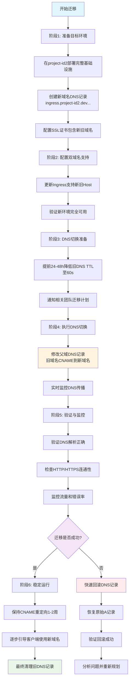
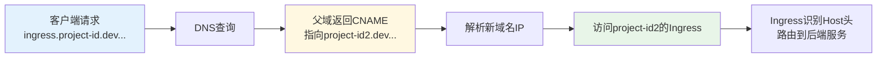
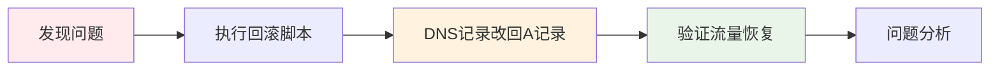

# GCP 跨项目 DNS 迁移解决方案

核心解决方案
推荐方案：CNAME 重定向

在父域 dev.aliyun.cloud.uk.aibang 中将旧域名设置为 CNAME 指向新域名
例如：ingress.project-id.dev.aliyun.cloud.uk.aibang CNAME 到 ingress.project-id2.dev.aliyun.cloud.uk.aibang
这样可以实现对客户端完全透明的迁移
补充方案：私有 DNS 区域

在目标项目中创建私有 DNS 区域处理内部服务调用
确保 VPC 内部的服务可以无缝访问旧域名
关键优势
零停机迁移 - 通过 DNS 层面的重定向实现平滑切换
快速回滚 - 只需修改 DNS 记录即可在 5 分钟内回滚
渐进式迁移 - 可以先测试部分服务，再全量切换
兼容性保证 - 支持新旧域名同时工作
重要注意事项
SSL 证书必须包含新旧两个域名
提前降低 DNS TTL 以加速传播
确保目标项目的防火墙和 IAM 权限配置正确
建立完善的监控和验证机制

## 问题分析

### 当前架构

```
Nginx proxy L4 dual network ==> GKE [ingress control] ==> GKE Runtime

Source project DNS:
events.project-id.dev.aliyun.cloud.uk.aibang
  ==> CNAME cinternal-vpc1-ingress-proxy-europe-west2-l4-ilb.projectid.dev.aliyun.cloud.uk.aibang

events-proxy.project-id.dev.aliyun.cloud.uk.aibang
  ==> CNAME ingress-nginx.gke-01.project.dev.aliyun.cloud.uk.aibang
```

### 核心挑战

1. **VPC 内部解析优先级**: 在目标项目创建私有 DNS 区域可解决内部服务调用，但外部流量仍会解析到旧项目
2. **DNS 传播延迟**: 全球 DNS 缓存更新需要时间
3. **服务连续性**: 需要确保迁移过程中零停机
4. **证书兼容性**: SSL/TLS 证书需要支持新旧域名

## 推荐解决方案

### 方案一：CNAME 重定向（推荐）

#### 优势

- 对客户端透明，无需修改配置
- 可快速回滚
- 支持渐进式迁移
- 单一管理点

#### 实施步骤

##### 阶段 1：准备目标环境

```bash
# 1. 在 project-id2 中部署完整基础设施
gcloud config set project project-id2

# 2. 创建新的DNS记录
gcloud dns record-sets transaction start --zone=project-id2-zone
gcloud dns record-sets transaction add \
  --name=ingress.project-id2.dev.aliyun.cloud.uk.aibang. \
  --ttl=300 \
  --type=A \
  --zone=project-id2-zone \
  [NEW_INGRESS_IP]

gcloud dns record-sets transaction add \
  --name=events.project-id2.dev.aliyun.cloud.uk.aibang. \
  --ttl=300 \
  --type=CNAME \
  --zone=project-id2-zone \
  cinternal-vpc1-ingress-proxy-europe-west2-l4-ilb.project-id2.dev.aliyun.cloud.uk.aibang.

gcloud dns record-sets transaction execute --zone=project-id2-zone
```

##### 阶段 2：配置 SSL 证书

```yaml
# managed-certificate.yaml
apiVersion: networking.gke.io/v1
kind: ManagedCertificate
metadata:
  name: migration-cert
spec:
  domains:
    - ingress.project-id.dev.aliyun.cloud.uk.aibang # 旧域名
    - ingress.project-id2.dev.aliyun.cloud.uk.aibang # 新域名
    - events.project-id.dev.aliyun.cloud.uk.aibang # 旧域名
    - events.project-id2.dev.aliyun.cloud.uk.aibang # 新域名
```

##### 阶段 3：更新 Ingress 配置

```yaml
# ingress.yaml
apiVersion: networking.k8s.io/v1
kind: Ingress
metadata:
  name: migration-ingress
  annotations:
    networking.gke.io/managed-certificates: migration-cert
spec:
  rules:
    - host: ingress.project-id.dev.aliyun.cloud.uk.aibang # 支持旧域名
      http:
        paths:
          - path: /
            pathType: Prefix
            backend:
              service:
                name: app-service
                port:
                  number: 80
    - host: ingress.project-id2.dev.aliyun.cloud.uk.aibang # 支持新域名
      http:
        paths:
          - path: /
            pathType: Prefix
            backend:
              service:
                name: app-service
                port:
                  number: 80
```

##### 阶段 4：DNS 切换

```bash
# 1. 降低旧记录TTL（提前24-48小时执行）
gcloud dns record-sets transaction start --zone=parent-zone
gcloud dns record-sets transaction remove \
  --name=ingress.project-id.dev.aliyun.cloud.uk.aibang. \
  --ttl=3600 \
  --type=A \
  --zone=parent-zone \
  [OLD_IP]

gcloud dns record-sets transaction add \
  --name=ingress.project-id.dev.aliyun.cloud.uk.aibang. \
  --ttl=60 \
  --type=A \
  --zone=parent-zone \
  [OLD_IP]
gcloud dns record-sets transaction execute --zone=parent-zone

# 2. 执行CNAME切换
gcloud dns record-sets transaction start --zone=parent-zone
gcloud dns record-sets transaction remove \
  --name=ingress.project-id.dev.aliyun.cloud.uk.aibang. \
  --ttl=60 \
  --type=A \
  --zone=parent-zone \
  [OLD_IP]

gcloud dns record-sets transaction add \
  --name=ingress.project-id.dev.aliyun.cloud.uk.aibang. \
  --ttl=300 \
  --type=CNAME \
  --zone=parent-zone \
  ingress.project-id2.dev.aliyun.cloud.uk.aibang.

gcloud dns record-sets transaction execute --zone=parent-zone
```

### 方案二：私有 DNS 区域（内部服务）

#### 适用场景

- 主要用于项目内部服务间调用
- 作为 CNAME 方案的补充

#### 实施步骤

```bash
# 在 project-id2 中创建私有DNS区域
gcloud dns managed-zones create project-id-private-zone \
  --description="Private zone for legacy domain resolution" \
  --dns-name=project-id.dev.aliyun.cloud.uk.aibang. \
  --visibility=private \
  --networks=https://www.googleapis.com/compute/v1/projects/project-id2/global/networks/vpc-network

# 添加记录指向新环境
gcloud dns record-sets transaction start --zone=project-id-private-zone
gcloud dns record-sets transaction add \
  --name=ingress.project-id.dev.aliyun.cloud.uk.aibang. \
  --ttl=300 \
  --type=CNAME \
  --zone=project-id-private-zone \
  ingress.project-id2.dev.aliyun.cloud.uk.aibang.
gcloud dns record-sets transaction execute --zone=project-id-private-zone
```

## 风险评估与缓解

### 1. SSL/TLS 证书风险

**风险**: 证书不匹配导致 HTTPS 错误
**缓解**:

- 使用 Google Managed Certificate 包含新旧域名
- 提前验证证书 provisioning 状态
- 准备备用证书方案

### 2. DNS 传播延迟

**风险**: 全球 DNS 缓存更新不一致
**缓解**:

- 提前降低 TTL 至 60 秒
- 监控多个地理位置的 DNS 解析
- 准备快速回滚方案

### 3. 网络配置不一致

**风险**: 防火墙、IAM 权限配置遗漏
**缓解**:

```bash
# 导出源项目防火墙规则
gcloud compute firewall-rules list --project=project-id --format="export" > firewall-rules.yaml

# 在目标项目应用（需要修改网络引用）
gcloud compute firewall-rules create --source=firewall-rules.yaml --project=project-id2
```

### 4. 硬编码依赖

**风险**: 应用代码中硬编码 IP 或特定端点
**缓解**:

```bash
# 搜索代码中的硬编码引用
grep -r "project-id\.dev\.gcp\.cloud\.uk\.aibang" ./src/
grep -r "10\.0\.0\." ./config/  # 搜索硬编码IP
```

## 监控与验证

### 验证脚本

```bash
#!/bin/bash
# dns-validation.sh

DOMAINS=(
  "ingress.project-id.dev.aliyun.cloud.uk.aibang"
  "events.project-id.dev.aliyun.cloud.uk.aibang"
)

for domain in "${DOMAINS[@]}"; do
  echo "Testing $domain..."

  # DNS解析测试
  dig +short $domain

  # HTTP连通性测试
  curl -I https://$domain/health || echo "HTTP test failed for $domain"

  # 证书验证
  echo | openssl s_client -servername $domain -connect $domain:443 2>/dev/null | \
    openssl x509 -noout -subject -dates
done
```

### 监控指标

```yaml
# monitoring-dashboard.yaml
apiVersion: v1
kind: ConfigMap
metadata:
  name: migration-monitoring
data:
  queries: |
    # 流量监控
    rate(nginx_ingress_controller_requests_total[5m])

    # 错误率监控
    rate(nginx_ingress_controller_requests_total{status=~"5.."}[5m]) / 
    rate(nginx_ingress_controller_requests_total[5m])

    # DNS解析延迟
    histogram_quantile(0.95, rate(coredns_dns_request_duration_seconds_bucket[5m]))
```

## 回滚计划

### 快速回滚（5 分钟内）

```bash
#!/bin/bash
# rollback.sh

echo "Starting DNS rollback..."

# 恢复原始DNS记录
gcloud dns record-sets transaction start --zone=parent-zone
gcloud dns record-sets transaction remove \
  --name=ingress.project-id.dev.aliyun.cloud.uk.aibang. \
  --ttl=300 \
  --type=CNAME \
  --zone=parent-zone \
  ingress.project-id2.dev.aliyun.cloud.uk.aibang.

gcloud dns record-sets transaction add \
  --name=ingress.project-id.dev.aliyun.cloud.uk.aibang. \
  --ttl=60 \
  --type=A \
  --zone=parent-zone \
  [ORIGINAL_IP]

gcloud dns record-sets transaction execute --zone=parent-zone

echo "Rollback completed. Monitoring for 10 minutes..."
sleep 600
```

## 最佳实践建议

### 1. 分阶段执行

- 先迁移非关键服务验证流程
- 在低流量时段执行关键服务迁移
- 保持新旧环境并行运行至少 1 周

### 2. 通信计划

- 提前通知所有相关团队
- 准备详细的迁移时间表
- 建立应急联系机制

### 3. 自动化工具

```bash
# migration-automation.sh
#!/bin/bash

# 环境变量
SOURCE_PROJECT="project-id"
TARGET_PROJECT="project-id2"
PARENT_ZONE="parent-zone"

# 执行迁移
./prepare-target-env.sh
./update-certificates.sh
./execute-dns-switch.sh
./validate-migration.sh
```

### 4. 长期清理计划

- 设置 3 个月后的清理提醒
- 逐步引导客户端使用新域名
- 最终删除 CNAME 重定向记录

## 迁移流程图



## 核心切换逻辑



## 快速回滚流程



## 总结

推荐使用**CNAME 重定向方案**作为主要迁移策略，配合**私有 DNS 区域**处理内部服务调用。这种方案提供了最佳的兼容性和回滚能力，同时确保服务的连续性。

关键成功因素：

1. 充分的准备和测试
2. 完整的 SSL 证书配置
3. 有效的监控和验证
4. 快速的回滚能力
5. 清晰的沟通计划
