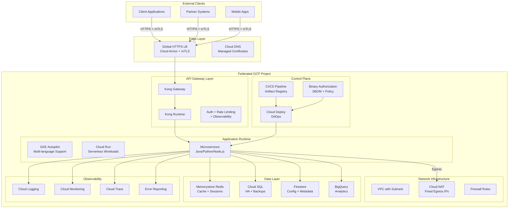
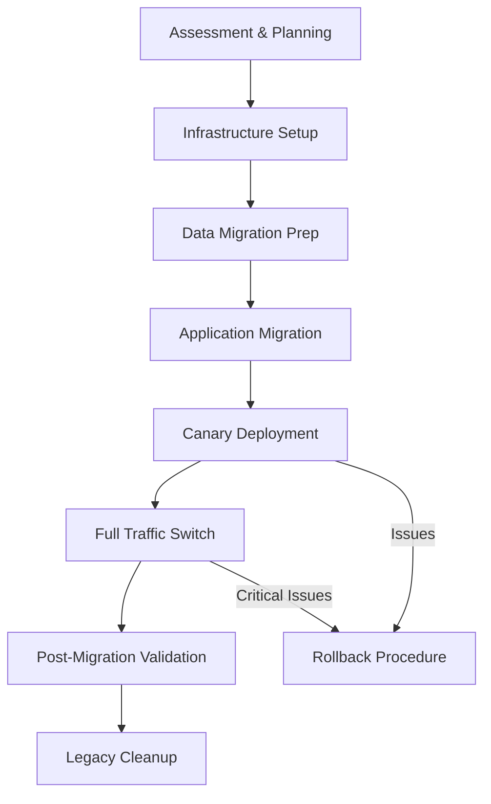
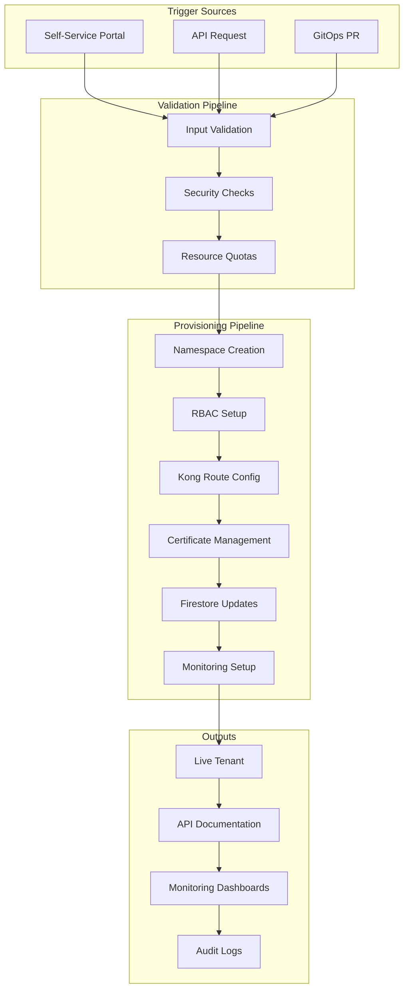
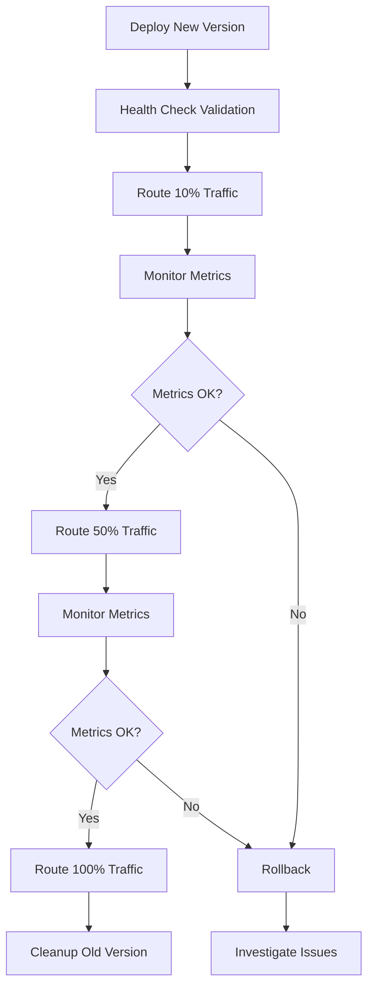

# **POP Platform Migration to Federated GCP - Comprehensive Plan**

> **Objective**: Migrate POP platform to new Federated GCP project, aligning with CAEP standards while ensuring security, scalability, and operational excellence.

---

## **Executive Summary**

This document consolidates migration strategies for transitioning the POP platform to a new Federated GCP environment. The plan emphasizes:
- Zero-downtime migration with canary deployment
- Enhanced security with mTLS and Cloud Armor
- Automated onboarding and tenant management
- Comprehensive observability and compliance
- Risk mitigation with rollback strategies

---

## **1. Current State Assessment**

### **1.1 Platform Architecture Analysis**
- **Compute Resources**: Java, Python, Node.js services (GKE/GCE/Cloud Run)
- **Data Storage**:
  - Redis: Cache, session, queue management
  - Cloud SQL: User data and transactional storage
  - Firestore/BigQuery: Configuration and analytics
- **Network Flows**:
  - External: Client apps and partner systems
  - Internal: Service-to-service communication
- **Security**: Current mTLS implementation and certificate management

### **1.2 Gap Analysis**
Compare current POP platform with target CAEP standards:
- Traffic control mechanisms (Ingress/Egress)
- API authentication and authorization
- Logging, monitoring, and alerting
- Compliance and security posture

---

## **2. Target Architecture Design**

### **2.1 High-Level Architecture**



### **2.2 Key Design Decisions**

#### **Environment & Naming Standards (EMID)**
- **Project Naming**: `pop-{env}-{emid}` (e.g., `pop-prod-emid123`)
- **Resource Labels**: `env`, `emid`, `system=pop`, `owner`, `pii={yes|no}`
- **Multi-Project Structure**: Blast radius isolation with optional Shared VPC

#### **Ingress Strategy**
- **Global HTTPS Load Balancer**: Unified entry point
- **mTLS Support**: Certificate Manager + TrustConfig
- **Cloud Armor**: WAF, IP/Geo filtering, bot protection, rate limiting
- **Custom Certificate Validation**: Edge or Kong layer implementation

#### **Egress Strategy**
- **Cloud NAT**: Fixed egress IPs for external whitelist requirements
- **Private Google Access**: Controlled access to Google APIs
- **Egress Proxy**: Centralized mTLS client authentication (Envoy/Nginx)

#### **Runtime Selection**
- **Primary**: GKE Autopilot/Standard for unified sidecar, HPA, PDB
- **Alternative**: Cloud Run for cold-start sensitive, auto-scaling workloads
- **API Gateway**: Kong Gateway + Runtime (CAEP alignment)

#### **Data Architecture**
- **Redis → Memorystore**: Key/TTL/sharding model assessment
- **Cloud SQL**: MySQL/PostgreSQL with DMS for zero-downtime migration
- **Configuration**: Firestore for quotas, tenant metadata, certificate fingerprints

#### **Observability & Compliance**
- **Full-stack**: Cloud Logging, Metrics, Trace (OpenTelemetry), Error Reporting
- **Artifacts**: Artifact Registry, SBOM, Binary Authorization
- **Security**: VPC-SC, CMEK (when required), minimal IAM

---

## **3. Migration Strategy & Timeline**

### **3.1 Migration Flow**



### **3.2 Phased Approach**

#### **Phase 1: Foundation (Weeks 1-2)**
- GCP project setup with EMID
- VPC, subnets, NAT, firewall rules
- GKE cluster provisioning
- Basic monitoring and logging setup

#### **Phase 2: Data Layer (Weeks 3-4)**
- Cloud SQL instance setup with HA
- Memorystore Redis provisioning
- Database migration using DMS
- Data validation and consistency checks

#### **Phase 3: Application Layer (Weeks 5-6)**
- Container image migration to Artifact Registry
- Application deployment to GKE
- Kong Gateway configuration
- Internal testing and validation

#### **Phase 4: Traffic Migration (Weeks 7-8)**
- DNS TTL reduction
- Canary deployment (10% → 50% → 100%)
- Certificate and mTLS validation
- Performance monitoring

#### **Phase 5: Optimization (Weeks 9-10)**
- Performance tuning
- Cost optimization
- Documentation and runbooks
- Team training

---

## **4. Automated Onboarding System**

### **4.1 Onboarding Flow**



### **4.2 Onboarding Deliverables**
- Kubernetes namespace with ResourceQuota and NetworkPolicy
- Kong routes, services, consumers with authentication
- Firestore documents for tenant metadata
- Cloud DNS records and certificate provisioning
- Monitoring SLOs, alerting policies, and dashboards

---

## **5. Security & Compliance**

### **5.1 mTLS Implementation**

```yaml
# Certificate Manager TrustConfig
apiVersion: certificatemanager.cnrm.cloud.google.com/v1beta1
kind: CertificateManagerTrustConfig
metadata:
  name: pop-trust-config
spec:
  location: global
  trustStores:
  - trustAnchors:
    - pemCertificate: |
        -----BEGIN CERTIFICATE-----
        [CA Certificate Content]
        -----END CERTIFICATE-----
```

### **5.2 Kong Security Configuration**

```yaml
_format_version: "3.0"
services:
  - name: pop-service
    url: http://app-service.default.svc.cluster.local:8080
    routes:
      - name: pop-route
        paths: ["/api/v1"]
        protocols: ["https"]
plugins:
  - name: mtls-auth
    config:
      ca_certificates:
        - |
          -----BEGIN CERTIFICATE-----
          [Trusted CA Certificate]
          -----END CERTIFICATE-----
      allow_without_client_cert: false
  - name: rate-limiting
    config:
      minute: 1000
      policy: local
  - name: acl
    config:
      allow: ["tenant-group"]
consumers:
  - username: tenant-abc
    acls:
      - group: tenant-group
```

---

## **6. Infrastructure as Code**

### **6.1 GCP Resource Setup**

```bash
#!/bin/bash
# Enable required APIs
gcloud services enable \
  compute.googleapis.com \
  container.googleapis.com \
  certificatemanager.googleapis.com \
  networkservices.googleapis.com \
  monitoring.googleapis.com \
  logging.googleapis.com \
  dns.googleapis.com \
  redis.googleapis.com \
  sqladmin.googleapis.com

# Create VPC and networking
gcloud compute networks create pop-vpc --subnet-mode=custom
gcloud compute networks subnets create pop-subnet \
  --network=pop-vpc \
  --range=10.10.0.0/20 \
  --region=us-central1

# Setup Cloud NAT
gcloud compute routers create pop-nat-router \
  --network=pop-vpc \
  --region=us-central1
gcloud compute routers nats create pop-nat \
  --router=pop-nat-router \
  --auto-allocate-nat-external-ips \
  --nat-all-subnet-ip-ranges \
  --region=us-central1

# Create GKE cluster
gcloud container clusters create-auto pop-cluster \
  --region=us-central1 \
  --release-channel=regular \
  --logging=SYSTEM,WORKLOAD \
  --monitoring=SYSTEM \
  --labels=system=pop,env=prod,emid=emid123
```

### **6.2 Application Deployment**

```yaml
apiVersion: apps/v1
kind: Deployment
metadata:
  name: pop-app
  labels:
    app: pop-app
    system: pop
spec:
  replicas: 3
  selector:
    matchLabels:
      app: pop-app
  template:
    metadata:
      labels:
        app: pop-app
    spec:
      containers:
      - name: app
        image: us-central1-docker.pkg.dev/pop-prod/app/pop-app:v1.0.0
        ports:
        - containerPort: 8080
        env:
        - name: REDIS_HOST
          valueFrom:
            configMapKeyRef:
              name: redis-config
              key: host
        - name: DB_HOST
          valueFrom:
            secretKeyRef:
              name: db-secret
              key: host
        resources:
          requests:
            cpu: "250m"
            memory: "512Mi"
          limits:
            cpu: "1"
            memory: "1Gi"
        readinessProbe:
          httpGet:
            path: /health
            port: 8080
          initialDelaySeconds: 10
          periodSeconds: 5
        livenessProbe:
          httpGet:
            path: /health
            port: 8080
          initialDelaySeconds: 30
          periodSeconds: 10
---
apiVersion: v1
kind: Service
metadata:
  name: pop-app-service
spec:
  selector:
    app: pop-app
  ports:
  - port: 80
    targetPort: 8080
  type: ClusterIP
```

---

## **7. Data Migration Strategy**

### **7.1 Redis Migration**
- **Assessment**: Key patterns, TTL policies, memory usage
- **Strategy**: Dual-write approach with consistency validation
- **Tools**: Redis replication, custom sync scripts
- **Validation**: Data integrity checks, performance benchmarks

### **7.2 Cloud SQL Migration**
- **Tool**: Database Migration Service (DMS)
- **Approach**: Initial full sync + continuous replication
- **Validation**: Row count verification, checksum validation
- **Cutover**: Minimal downtime window with read-only mode

### **7.3 Migration Checklist**

```bash
# Pre-migration validation
./scripts/validate-redis-data.sh
./scripts/validate-sql-schema.sh
./scripts/check-application-readiness.sh

# Execute migration
./scripts/start-redis-sync.sh
./scripts/start-sql-migration.sh
./scripts/validate-data-consistency.sh

# Post-migration verification
./scripts/run-integration-tests.sh
./scripts/validate-performance.sh
./scripts/check-monitoring-alerts.sh
```

---

## **8. Traffic Management & Canary Deployment**

### **8.1 Gateway API Configuration**

```yaml
apiVersion: gateway.networking.k8s.io/v1
kind: Gateway
metadata:
  name: pop-gateway
  namespace: gateway-system
spec:
  gatewayClassName: gke-l7-global-external-managed
  listeners:
  - name: https
    protocol: HTTPS
    port: 443
    tls:
      mode: Terminate
      certificateRefs:
      - kind: Secret
        name: pop-tls-cert
---
apiVersion: gateway.networking.k8s.io/v1
kind: HTTPRoute
metadata:
  name: pop-canary-route
spec:
  parentRefs:
  - name: pop-gateway
  hostnames:
  - api.pop.example.com
  rules:
  - matches:
    - path:
        type: PathPrefix
        value: /api/v1
    backendRefs:
    - name: pop-app-service-old
      port: 80
      weight: 90  # 90% to old version
    - name: pop-app-service-new
      port: 80
      weight: 10  # 10% to new version
```

### **8.2 Canary Deployment Process**



---

## **9. Monitoring & Observability**

### **9.1 SLI/SLO Definition**

```yaml
# Cloud Monitoring SLO
apiVersion: monitoring.coreos.com/v1
kind: ServiceLevelObjective
metadata:
  name: pop-api-availability
spec:
  service: pop-api
  sli:
    events:
      errorBudgetTarget: 0.999  # 99.9% availability
      totalService: pop-api-requests-total
      badService: pop-api-requests-errors
  objectives:
  - target: 0.999
    timeWindow: 30d
```

### **9.2 Alerting Configuration**

```yaml
# Alert Policy for High Error Rate
apiVersion: monitoring.coreos.com/v1
kind: AlertingPolicy
metadata:
  name: pop-high-error-rate
spec:
  displayName: "POP API High Error Rate"
  conditions:
  - displayName: "Error rate > 1%"
    conditionThreshold:
      filter: 'resource.type="k8s_container" resource.labels.container_name="pop-app"'
      comparison: COMPARISON_GREATER_THAN
      thresholdValue: 0.01
      duration: 300s
  notificationChannels:
  - projects/pop-prod/notificationChannels/email-alerts
  - projects/pop-prod/notificationChannels/slack-alerts
```

---

## **10. Risk Management & Rollback Strategy**

### **10.1 Risk Assessment Matrix**

| Risk | Impact | Probability | Mitigation |
|------|--------|-------------|------------|
| Certificate Trust Issues | High | Medium | Pre-validate with multiple clients, maintain cert compatibility |
| Database Connection Pool Exhaustion | High | Low | Connection pool tuning, circuit breakers |
| Traffic Routing Misconfiguration | High | Low | Automated validation, gradual rollout |
| Egress IP Whitelist Issues | Medium | Medium | Centralized egress proxy, IP validation |
| Cost Overrun | Medium | Medium | Resource quotas, cost monitoring alerts |

### **10.2 Rollback Procedures**

```bash
#!/bin/bash
# Emergency rollback script
set -e

echo "Initiating emergency rollback..."

# 1. Switch DNS back to old environment
gcloud dns record-sets transaction start --zone=pop-zone
gcloud dns record-sets transaction remove \
  --name=api.pop.example.com. \
  --ttl=60 \
  --type=A \
  --zone=pop-zone \
  "NEW_LB_IP"
gcloud dns record-sets transaction add \
  --name=api.pop.example.com. \
  --ttl=60 \
  --type=A \
  --zone=pop-zone \
  "OLD_LB_IP"
gcloud dns record-sets transaction execute --zone=pop-zone

# 2. Update Kong routing to old backend
kubectl patch httproute pop-canary-route --type='json' \
  -p='[{"op": "replace", "path": "/spec/rules/0/backendRefs/0/weight", "value": 100}]'
kubectl patch httproute pop-canary-route --type='json' \
  -p='[{"op": "replace", "path": "/spec/rules/0/backendRefs/1/weight", "value": 0}]'

# 3. Verify rollback
./scripts/validate-rollback.sh

echo "Rollback completed successfully"
```

---

## **11. Team Responsibilities (RACI Matrix)**

| Task | Architect | Platform | SRE | Dev | Security | DBA |
|------|-----------|----------|-----|-----|----------|-----|
| Architecture Design | R | C | C | I | C | I |
| Infrastructure Setup | C | R | C | I | C | I |
| Application Migration | C | C | C | R | I | I |
| Data Migration | I | C | I | I | I | R |
| Security Implementation | C | R | C | I | R | I |
| Monitoring Setup | C | R | R | I | I | I |
| Traffic Cutover | C | R | R | I | I | C |
| Rollback Execution | C | R | R | I | I | C |

**Legend**: R=Responsible, A=Accountable, C=Consulted, I=Informed

---

## **12. Success Criteria & KPIs**

### **12.1 Technical KPIs**
- **Availability**: 99.9% uptime during migration
- **Performance**: <100ms P95 latency increase
- **Error Rate**: <0.1% increase in 4xx/5xx errors
- **Data Consistency**: 100% data integrity validation

### **12.2 Business KPIs**
- **Zero Business Impact**: No customer-facing outages
- **Migration Timeline**: Complete within 10 weeks
- **Cost Optimization**: 15% reduction in infrastructure costs
- **Security Posture**: 100% mTLS coverage, zero security incidents

---

## **13. Post-Migration Activities**

### **13.1 Immediate (Week 1)**
- Monitor all SLIs/SLOs for stability
- Validate all integrations and dependencies
- Conduct post-migration review meeting
- Update documentation and runbooks

### **13.2 Short-term (Weeks 2-4)**
- Optimize resource allocation based on usage patterns
- Fine-tune monitoring and alerting thresholds
- Conduct disaster recovery testing
- Team training on new platform

### **13.3 Long-term (Months 2-3)**
- Cost optimization review and implementation
- Performance optimization based on production data
- Security audit and compliance validation
- Legacy system decommissioning

---

## **14. Appendix**

### **14.1 Useful Commands**

```bash
# Check cluster status
kubectl get nodes
kubectl get pods --all-namespaces

# Validate Kong configuration
curl -s http://kong-admin:8001/status

# Check certificate status
gcloud certificate-manager certificates list

# Monitor migration progress
gcloud sql operations list --instance=pop-sql-instance
```

### **14.2 Emergency Contacts**

| Role | Primary | Secondary | Escalation |
|------|---------|-----------|------------|
| Platform Lead | [Name] | [Name] | [Manager] |
| SRE On-call | [Name] | [Name] | [SRE Manager] |
| Security Lead | [Name] | [Name] | [CISO] |
| DBA Lead | [Name] | [Name] | [Data Manager] |

---

**Document Version**: 1.0  
**Last Updated**: 2025-08-26  
**Next Review**: 2025-09-26  
**Approved By**: [Architecture Review Board]