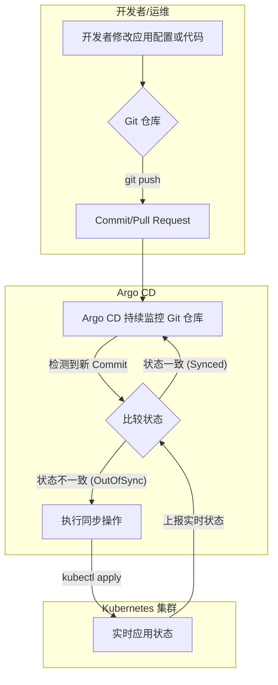

# 什么是 Argo CD？

Argo CD 是一个为 Kubernetes 设计的、遵循声明式 GitOps 理念的持续部署 (CD) 工具。它的核心思想是使用 Git 仓库作为定义应用所需状态的唯一真实来源 (Single Source of Truth)。

Argo CD 以 Kubernetes Controller 的形式运行，它会持续监控集群中正在运行的应用，并将其实时状态 (Live State) 与 Git 仓库中声明的目标状态 (Target State) 进行比较，以确保两者保持一致。

## 核心理念：GitOps

GitOps 是一种现代化的持续交付模式，其核心原则是将 Git 作为声明基础设施和应用程序的唯一真实来源。所有变更都通过 Git 操作（如 Pull Request）发起，并自动同步到线上环境。

- **声明式**: 你在 Git 中声明系统的期望状态，而不是编写一系列指令。
- **版本化与审计**: 所有变更都记录在 Git 历史中，可以轻松追踪、审计和回滚。
- **自动化**: 一旦 Git 中的声明被更新，自动化流程会确保线上环境与之匹配。
- **安全性**: 通常采用拉取（Pull）模式，集群内的代理从 Git 拉取更新，而不是由外部系统向集群推送，减少了暴露集群凭证的风险。

## Argo CD 是如何工作的？

Argo CD 的工作流程完美体现了 GitOps 的拉取模式。开发者或运维人员不直接操作 Kubernetes 集群，而是通过向 Git 仓库提交代码来驱动应用部署和更新。



**流程说明:**
1.  **提交变更**: 开发者将新的应用配置（如 Kubernetes Manifests, Helm Chart, Kustomize 文件）推送到 Git 仓库。
2.  **状态检测**: Argo CD 自动检测到 Git 仓库的变化。
3.  **状态对比**: Argo CD 将 Git 中的目标状态与 Kubernetes 集群中的实时状态进行比较。如果发现差异，它会将应用标记为 `OutOfSync`。
4.  **同步应用**: 根据配置，Argo CD 可以自动或手动触发同步操作，将集群中的应用状态更新为 Git 中定义的目标状态。
5.  **保持同步**: Argo CD 会持续监控，确保任何手动的、非预期的集群变更（配置漂移）都能被检测到并修正。

## 核心组件

Argo CD 由几个关键组件构成，它们协同工作以实现完整的 GitOps 工作流。

| 组件 | 主要功能 |
| :--- | :--- |
| **API Server** | 一个 gRPC/REST 服务器，为 Web UI、CLI 和 CI/CD 系统提供 API 接口，负责应用管理、状态报告、调用操作（如同步、回滚）等。 |
| **Repository Server** | 负责维护 Git 仓库的本地缓存，并根据仓库 URL、版本和配置生成并返回 Kubernetes 清单。 |
| **Application Controller** | 核心控制器，用于监控运行中的应用。它将应用的实时状态与 Git 仓库中的目标状态进行比较，并在需要时调用同步操作来修正差异。 |

## Argo CD Application 示例

要让 Argo CD 管理一个应用，你需要创建一个 `Application` 类型的 CRD (Custom Resource Definition) 对象。这个对象告诉 Argo CD 从哪里获取应用的配置以及要部署到哪个集群。

```yaml
apiVersion: argoproj.io/v1alpha1
kind: Application
metadata:
  name: my-sample-app
  namespace: argocd
spec:
  # 目标部署位置
  destination:
    server: https://kubernetes.default.svc # 目标 K8s API Server 地址
    namespace: my-app-namespace # 目标命名空间

  # 来源配置
  source:
    repoURL: 'https://github.com/my-org/my-app-config.git' # Git 仓库地址
    path: 'k8s' # 仓库中配置清单所在的路径
    targetRevision: HEAD # 要跟踪的分支、标签或 Commit SHA

  # 同步策略
  syncPolicy:
    automated:
      prune: true # 删除 Git 中不再存在的资源
      selfHeal: true # 自动修复配置漂移
```

这个示例定义了一个名为 `my-sample-app` 的应用，它会从指定的 Git 仓库的 `HEAD` 版本中拉取 `k8s/` 目录下的配置，并将其同步到当前集群的 `my-app-namespace` 命名空间中。
