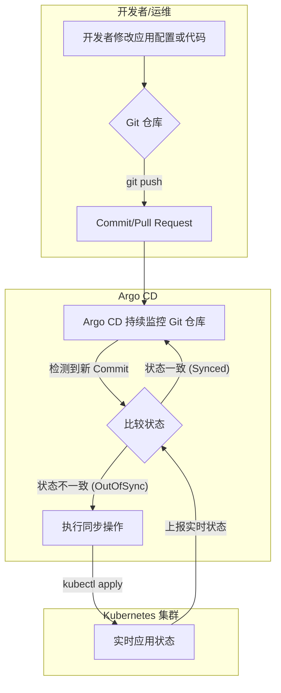

œ# 什么是 Argo CD？

Argo CD 是一个为 Kubernetes 设计的、遵循声明式 GitOps 理念的持续部署 (CD) 工具。它的核心思想是使用 Git 仓库作为定义应用所需状态的唯一真实来源 (Single Source of Truth)。

Argo CD 以 Kubernetes Controller 的形式运行，它会持续监控集群中正在运行的应用，并将其实时状态 (Live State) 与 Git 仓库中声明的目标状态 (Target State) 进行比较，以确保两者保持一致。

## 核心理念：GitOps

GitOps 是一种现代化的持续交付模式，其核心原则是将 Git 作为声明基础设施和应用程序的唯一真实来源。所有变更都通过 Git 操作（如 Pull Request）发起，并自动同步到线上环境。

- **声明式**: 你在 Git 中声明系统的期望状态，而不是编写一系列指令。
- **版本化与审计**: 所有变更都记录在 Git 历史中，可以轻松追踪、审计和回滚。
- **自动化**: 一旦 Git 中的声明被更新，自动化流程会确保线上环境与之匹配。
- **安全性**: 通常采用拉取（Pull）模式，集群内的代理从 Git 拉取更新，而不是由外部系统向集群推送，减少了暴露集群凭证的风险。

## Argo CD 是如何工作的？

Argo CD 的工作流程完美体现了 GitOps 的拉取模式。开发者或运维人员不直接操作 Kubernetes 集群，而是通过向 Git 仓库提交代码来驱动应用部署和更新。


```mermaid
flowchart TD
    subgraph "开发者/运维"
        A[开发者修改应用配置或代码] --> B{Git 仓库};
        B -- "git push" --> C[Commit/Pull Request];
    end

    subgraph "Argo CD"
        D[Argo CD 持续监控 Git 仓库] -- "检测到新 Commit" --> E{比较状态};
        E -- "状态不一致 (OutOfSync)" --> F[执行同步操作];
        E -- "状态一致 (Synced)" --> D;
    end

    subgraph "Kubernetes 集群"
        G[实时应用状态]
    end

    C --> D;
    F -- "kubectl apply" --> G;
    G -- "上报实时状态" --> E;

```

**流程说明:**
1.  **提交变更**: 开发者将新的应用配置（如 Kubernetes Manifests, Helm Chart, Kustomize 文件）推送到 Git 仓库。
2.  **状态检测**: Argo CD 自动检测到 Git 仓库的变化。
3.  **状态对比**: Argo CD 将 Git 中的目标状态与 Kubernetes 集群中的实时状态进行比较。如果发现差异，它会将应用标记为 `OutOfSync`。
4.  **同步应用**: 根据配置，Argo CD 可以自动或手动触发同步操作，将集群中的应用状态更新为 Git 中定义的目标状态。
5.  **保持同步**: Argo CD 会持续监控，确保任何手动的、非预期的集群变更（配置漂移）都能被检测到并修正。

## 核心组件

Argo CD 由几个关键组件构成，它们协同工作以实现完整的 GitOps 工作流。

| 组件 | 主要功能 |
| :--- | :--- |
| **API Server** | 一个 gRPC/REST 服务器，为 Web UI、CLI 和 CI/CD 系统提供 API 接口，负责应用管理、状态报告、调用操作（如同步、回滚）等。 |
| **Repository Server** | 负责维护 Git 仓库的本地缓存，并根据仓库 URL、版本和配置生成并返回 Kubernetes 清单。 |
| **Application Controller** | 核心控制器，用于监控运行中的应用。它将应用的实时状态与 Git 仓库中的目标状态进行比较，并在需要时调用同步操作来修正差异。 |

## Argo CD Application 示例

要让 Argo CD 管理一个应用，你需要创建一个 `Application` 类型的 CRD (Custom Resource Definition) 对象。这个对象告诉 Argo CD 从哪里获取应用的配置以及要部署到哪个集群。

```yaml
apiVersion: argoproj.io/v1alpha1
kind: Application
metadata:
  name: my-sample-app
  namespace: argocd
spec:
  # 目标部署位置
  destination:
    server: https://kubernetes.default.svc # 目标 K8s API Server 地址
    namespace: my-app-namespace # 目标命名空间

  # 来源配置
  source:
    repoURL: 'https://github.com/my-org/my-app-config.git' # Git 仓库地址
    path: 'k8s' # 仓库中配置清单所在的路径
    targetRevision: HEAD # 要跟踪的分支、标签或 Commit SHA

  # 同步策略
  syncPolicy:
    automated:
      prune: true # 删除 Git 中不再存在的资源
      selfHeal: true # 自动修复配置漂移
```

这个示例定义了一个名为 `my-sample-app` 的应用，它会从指定的 Git 仓库的 `HEAD` 版本中从 `k8s/` 目录下的配置，并将其同步到当前集群的 `my-app-namespace` 命名空间中。

  ---

## 4. homelab 实战模式与典型陷阱

> **来源**:https://chaneyzorn.github.io/codes/argo-cd-gitops-homelab/(CC BY-NC-ND 4.0)
>
> 本节整合自 chaneyzorn 在 3 节点 PVE 集群上长期跑 GitOps 的实战经验。**§4.1-§4.2 是可直接复用的模式**,**§4.3 是 6 个具体陷阱**(每条都附解决方案)。所有方案都在原文中标注了 Argo CD / K8s 版本,本地采纳时请核对当前版本是否仍适用。

### 4.1 为什么选 Argo CD(对比其他 GitOps 控制器)

CNCF 2025 End User Survey:近六成 Kubernetes GitOps 用户用 Argo CD,用户推荐意愿 NPS 79。[来源]

| 控制器 | 主要特点 | 适用场景 |
|--------|---------|---------|
| **Argo CD** | CNCF 毕业,有 Web UI,周边生态丰富(Rollouts / Workflows) | 多数场景,尤其是需要 UI + 自管理的环境 |
| **Flux CD** | CNCF 毕业,无默认 Web UI,可组合 / 可脚本化 | 工作流高度依赖 CLI 和 CI 流水线时 |
| **Rancher Fleet** | 深度集成 Rancher 生态 | 已有 Rancher 管理面 |
| **GitLab Agent** | 主要服务 GitLab CI/CD | GitLab 全家桶场景 |

### 4.2 仓库结构模板(App of Apps 模式)

```
homelab-gitops/
├── clusters/
│   └── prod/
│       ├── bootstrap/         # 一次性启动资源 (不在 Argo CD 自拉取范围)
│       │   ├── argocd.yaml    # Argo CD 自管理 multi-source Application
│       │   └── apps-root.yaml # App of Apps 根 Application
│       └── apps/              # Argo CD 自动发现并同步的 Application 清单
│           ├── cert-manager/
│           ├── cilium/
│           ├── higress/
│           ├── ingresses/
│           └── kube-prometheus-stack/
├── infrastructure/            # 各组件的 Helm values.yaml
│   ├── argocd/values.yaml
│   ├── cert-manager/
│   ├── cilium/
│   └── ...
└── scripts/bootstrap.sh       # 首次安装脚本
```

**三层关系**:

```
argocd Application (自管理)
    │ 通过 multi-source 引用 OCI chart + 本地 values
    ▼
apps-root Application (App of Apps, directory: recurse=true)
    │ 发现 clusters/prod/apps/ 下任意新提交的 Application
    ▼
子 Application × N (cert-manager / cilium / kube-prometheus-stack ...)
```

**关键设计**:

- `clusters/prod/bootstrap/` 是**一次性**资源,不在 Argo CD 自拉取范围 —— 改这里必须手动重新 apply
- `apps/` 目录 `recurse=true`,新增组件只需提交一个 Application YAML,Argo CD 自动发现
- 每个组件的 Helm values 放在 `infrastructure/<组件>/values.yaml`,**与 Application 解耦**

### 4.3 Self-management(自管理)

Argo CD 部署完成后,**让 Argo CD 自己管理 Argo CD** —— 这是 GitOps 自举的标准做法。`clusters/prod/bootstrap/argocd.yaml`:

```yaml
apiVersion: argoproj.io/v1alpha1
kind: Application
metadata:
  name: argocd
  namespace: argocd
  finalizers:
  - resources-finalizer.argocd.argoproj.io/foreground  # 级联删除
spec:
  project: default
  sources:
    - repoURL: oci://ghcr.io/argoproj/argo-helm/argo-cd  # upstream chart
      chart: argo-cd
      targetRevision: 10.4.0
      helm:
        valueFiles:
          - $values/infrastructure/argocd/values.yaml    # ← multi-source
    - repoURL: git@github.com:<org>/homelab.git          # values 来源
      targetRevision: main
      ref: values
  destination:
    server: https://kubernetes.default.svc
    namespace: argocd
  syncPolicy:
    automated:
      prune: true
      selfHeal: true
    syncOptions:
      - CreateNamespace=true
      - ServerSideApply=true  # ← 见 §4.3.3
```

**核心 trick**:用 `sources` 数组 + `$values` 别名,**让 upstream chart 和 values.yaml 在同一次 Helm 渲染中组合**,不再依赖 wrapper chart。这避免了 chaneyzorn 踩过的坑:

- **wrapper chart 方式**(`Chart.yaml` 声明依赖 upstream chart):`values.yaml` 必须把配置嵌套在 `argo-cd:` key 下
- **multi-source 方式**:`values.yaml` **扁平化**,直接对应 upstream chart 的顶层 key

两者对 `values.yaml` 结构的要求不同。如果 bootstrap 脚本和自管理 Application 用**不同方式**,**同一份 values.yaml 就无法复用**。统一用 multi-source 后,bootstrap 脚本的 `helm upgrade -f values.yaml` 和 Argo CD 自管理用的是**同一份配置**。

### 4.4 6 个典型陷阱(都来自 homelab 实战)

#### 4.4.1 repo-server 需要 HTTP 代理(国内网络)

```yaml
repoServer:
  env:
    - name: HTTP_PROXY
      value: "http://10.8.8.94:7890"
    - name: HTTPS_PROXY
      value: "http://10.8.8.94:7890"
    - name: NO_PROXY
      value: "kubernetes.default.svc,127.0.0.1,localhost,10.0.0.0/8,172.16.0.0/12,192.168.0.0/16,.svc,.cluster.local"
    - name: ARGOCD_EXEC_TIMEOUT
      value: "10m"
```

**同一份配置同时给 bootstrap 脚本的 Helm 命令用** —— 保证 bootstrap 阶段和 GitOps 阶段网络行为一致。

#### 4.4.2 大体积 CRD 必须 `ServerSideApply=true`

`kube-prometheus-stack` 的 CRD 体积大,默认 client-side apply 会把整个 manifest 写入 `kubectl.kubernetes.io/last-applied-configuration` 注解,超过 K8s **262144 字节限制**,报错:

```
metadata.annotations: Too long: may not be more than 262144 bytes
```

**解法**:在该 Application 的 `syncOptions` 里加:

```yaml
syncOptions:
  - ServerSideApply=true
```

#### 4.4.3 Finalizer 三选一(级联删除策略)

Argo CD 实际识别的级联删除 finalizer 只有一个 family,三个取值:

| Finalizer | 行为 | 适用场景 |
|-----------|------|---------|
| `resources-finalizer.argocd.argoproj.io`(默认) | 普通应用级联删除 | 多数场景 |
| `.../foreground` | 同步**先**清理子资源,再删 Application CR | 严格要求资源全部清理完毕才能进下一步 |
| `.../background` | 异步清理,Application CR 立即删除,资源稍后清理 | **重型组件**(如 kube-prometheus-stack) — 避免 foreground 等待加剧卡住的风险 |
| `--cascade=false`(CLI) | `orphan` 模式 —— 只删 Application CR,保留子资源 | 迁移或重构时先保留资源 |

**踩坑提醒**:

- **不要** `git revert` 同时撤销 Application YAML + 渲染输入(values / chart)。Application 会卡在 `Deleting` 状态,因为 Argo CD 已经无法渲染目标状态,也就不执行级联清理。
- **正确做法**:删除分两步 —— 先只删 Application YAML,等 Argo CD 完成级联清理、确认 Application CR 和受管资源都消失后,再删除渲染输入。

#### 4.4.4 Helm hook 死锁(kube-prometheus-stack 经典案例)

`kube-prometheus-stack` 默认用两个 Helm hook Job 管理 admission webhook TLS 证书,**与 Argo CD 同步模型死锁**:

```
Prometheus CR → 需要 Healthy → 等 prometheus-operator
prometheus-operator → 工作需要有效的 webhook caBundle (当前为空)
webhook caBundle → 由 admission-patch Job 注入
admission-patch Job (PostSync hook) → 需要 Prometheus CR Healthy
```

**解法**:用 **cert-manager + cainjector** 替代 hook Job:

```yaml
prometheusOperator:
  admissionWebhooks:
    certManager:
      enabled: true  # ← 关键:启用 cert-manager 接管证书
```

cert-manager 持续签发证书,cainjector 自动把 CA 注入 webhook `caBundle`,PostSync hook 不再存在,死锁前提消失。

#### 4.4.5 各部署工具的删除能力对比(决策参考)

| 工具 | 维护历史状态? | 删除能力 | 代价 |
|------|---------------|---------|------|
| Terraform | 是 (state file) | 强,精确 destroy | 需管理 state,可能漂移 |
| Helm | 是 (release Secret) | 中等,按 release 删 | 依赖 release Secret,跨 release 共享资源难处理 |
| Flux Kustomization | 是 (`.status.inventory`) | 中等,启用 prune 可清理旧资源 | 需启用并维护 prune,共享资源仍需谨慎 |
| **Argo CD** | **轻量**(tracking 注解 + Application status) | **弱**,依赖 finalizer / prune | 简单、无额外状态 |
| Kubernetes ownerReferences | 是(对象元数据) | 强,但**只限同 namespace 父子关系** | 无法表达跨对象、跨 Application 依赖 |

**结论**:Argo CD 的"无状态"是**优势**(启动不需要 state file),但**代价**就是删除能力弱,所以 §4.4.3 的 finalizer 选择 + 删两步走 规则必须严格遵守。

#### 4.4.6 Application 改名后的所有权冲突

给 Application 改名 → 同一组资源被新旧两个 Application 同时声明管理 → 旧 Application 的 finalizer 要求清理资源,但这些资源已被新 Application 接管 → 删除与同步互相阻塞。

**避免方法**:尽量用稳定的 Application name,改名时走两步 —— 先把旧 Application 的 finalizers 清空、让它先释放资源,再删旧 Application YAML,最后建新 name 的 Application。

### 4.5 AI 辅助 GitOps 运维(双层纪律)

chaneyzorn 在这次 homelab 改造里大量用 AI 处理重复 YAML 和事故排查。**双层纪律**是经验总结:

| 层级 | 实现 | 兜底强度 |
|------|------|---------|
| **软约束**(AGENTS.md) | 明确规定:未经明确授权 AI 不得 `git commit` / `git push` | 依赖模型自觉,可能被绕过 |
| **硬约束**(工具侧) | 给 `git add` / `commit` / `push` 配置**强制询问**规则,模式写成 `*git*push*` 这种**复合命令**形式 | 命令层强制拦截,即使模型忘了纪律也拦得下 |

**关键细节**:规则模式必须能匹配 `git add . && git push` 这种**复合命令**。`*git push*` 这种简单 glob 匹配不到复合命令,要写成 `*git*push*` (git 在前 push 在后,中间允许任意字符)才能可靠拦截。

### 4.6 Reference 摘要(本地场景的注意点)

| chaneyzorn 的做法 | 本地采纳时的注意点 |
|------------------|---------------------|
| upstream chart 来自 `oci://ghcr.io/argoproj/argo-helm` | **GKE / 阿里云环境下需要确认可访问**;否则用 `https://argoproj.github.io/argo-helm` 传统 repo 源 |
| Multi-source 通过 `$values` 别名 | 本地 Argo CD 版本需 ≥ 2.4 才支持 `ref: values` 的 `$values` 别名 |
| ServerSideApply=true 用于 kube-prometheus-stack | GKE 用 `roles/iam.workloadIdentityUser` 绑 ServiceAccount,ServerSideApply 对 RBAC 要求无变化 |
| Finalizer `foreground` 默认 | 重型组件必须改 `background`,否则 sync 卡 30 分钟以上 |
| `clusters/prod/apps/` App of Apps recurse=true | 建议每个 environment 一个 `clusters/<env>/`,避免跨环境误同步 |

### Related source

- **原始文章**:https://chaneyzorn.github.io/codes/argo-cd-gitops-homelab/
- **Argo CD 官方文档**:https://argo-cd.readthedocs.io/
- **CNCF 2025 Argo CD 调查**:https://www.cncf.io/announcements/2025/07/24/cncf-end-user-survey-finds-argo-cd-as-majority-adopted-gitops-solution-for-kubernetes/
- **App of Apps**:https://argo-cd.readthedocs.io/en/stable/operator-manual/cluster-bootstrapping/
- **Sync Options(ServerSideApply)**:https://argo-cd.readthedocs.io/en/stable/user-guide/sync-options/
- **Multiple Sources**:https://argo-cd.readthedocs.io/en/stable/user-guide/multiple_sources/
- **Sync Waves**:https://argo-cd.readthedocs.io/en/stable/user-guide/sync-waves/
