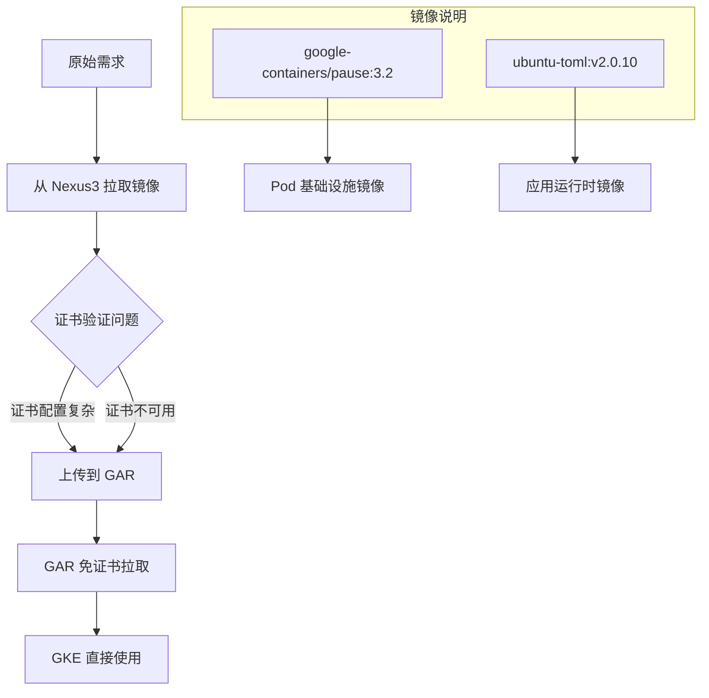

根据您提供的背景信息，这两个镜像是为了解决在 GKE/K8S 环境中绕过 Nexus3 证书验证问题的方案。

## 问题分析

### 核心问题
Nexus3 作为私有镜像仓库需要 TLS 证书验证，但在某些环境下配置证书可能比较复杂或存在限制。

### 解决方案流程



## 镜像作用分析

### 1. google-containers/pause:3.2

**作用：**
- Kubernetes Pod 的基础设施容器（Infrastructure Container）
- 负责维护 Pod 的网络命名空间和存储卷
- 在 Pod 生命周期中持续运行

**为什么需要：**
```bash
# 每个 Pod 都需要 pause 容器
# 原本从 k8s.gcr.io 或 Nexus3 拉取可能有证书问题
# 通过 GAR 提供无证书访问
```

### 2. ubuntu-toml:v2.0.10

**作用：**
- 基于 Ubuntu 的应用运行时镜像
- 集成了 TOML 配置处理能力
- 可能是自定义的应用基础镜像

## GAR 优势对比

| 方面 | Nexus3 | Google GAR |
|------|--------|------------|
| 证书要求 | 需要配置 TLS 证书 | 使用 Google 管理的证书 |
| 访问复杂度 | 需要配置 insecure-registries 或证书 | GKE 原生支持，无需额外配置 |
| 网络访问 | 可能需要内网配置 | 公网直接访问 |
| 认证方式 | Nexus 用户认证 | Google Cloud IAM |

## 实现方案

### 1. 镜像迁移流程

```bash
# 从 Nexus3 拉取原始镜像
docker pull nus.company.com/google-containers/pause:3.2
docker pull nus.company.com/ubuntu-toml:v2.0.10

# 重新标签
docker tag nus.company.com/google-containers/pause:3.2 \
  asia-northeast1-docker.pkg.dev/project-id/repo-name/pause:3.2

docker tag nus.company.com/ubuntu-toml:v2.0.10 \
  asia-northeast1-docker.pkg.dev/project-id/repo-name/ubuntu-toml:v2.0.10

# 推送到 GAR
docker push asia-northeast1-docker.pkg.dev/project-id/repo-name/pause:3.2
docker push asia-northeast1-docker.pkg.dev/project-id/repo-name/ubuntu-toml:v2.0.10
```

### 2. GKE 配置调整

```yaml
# 修改 kubelet 配置使用 GAR 中的 pause 镜像
apiVersion: v1
kind: ConfigMap
metadata:
  name: kubelet-config
data:
  kubelet: |
    podInfraContainerImage: asia-northeast1-docker.pkg.dev/project-id/repo-name/pause:3.2
```

### 3. 应用部署示例

```yaml
apiVersion: apps/v1
kind: Deployment
metadata:
  name: app-deployment
spec:
  replicas: 3
  selector:
    matchLabels:
      app: myapp
  template:
    metadata:
      labels:
        app: myapp
    spec:
      containers:
      - name: app
        image: asia-northeast1-docker.pkg.dev/project-id/repo-name/ubuntu-toml:v2.0.10
        ports:
        - containerPort: 8080
```

## 总结

这个方案通过将镜像上传到 Google GAR 来绕过 Nexus3 的证书验证问题，利用 GKE 与 GAR 的原生集成优势，简化了镜像拉取流程，特别适用于：

- 证书管理复杂的环境
- 需要快速部署的场景  
- 多集群镜像共享需求