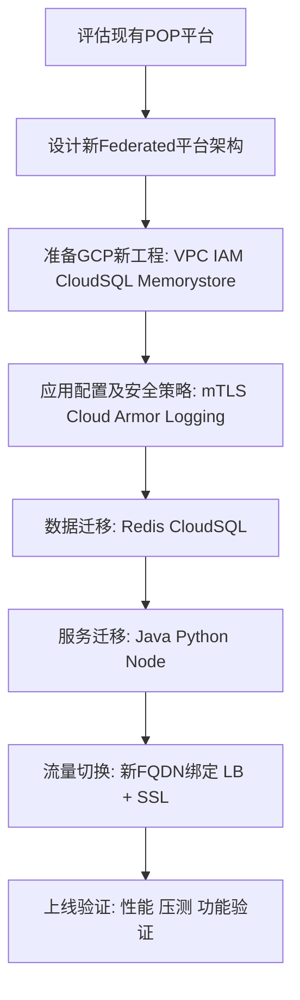
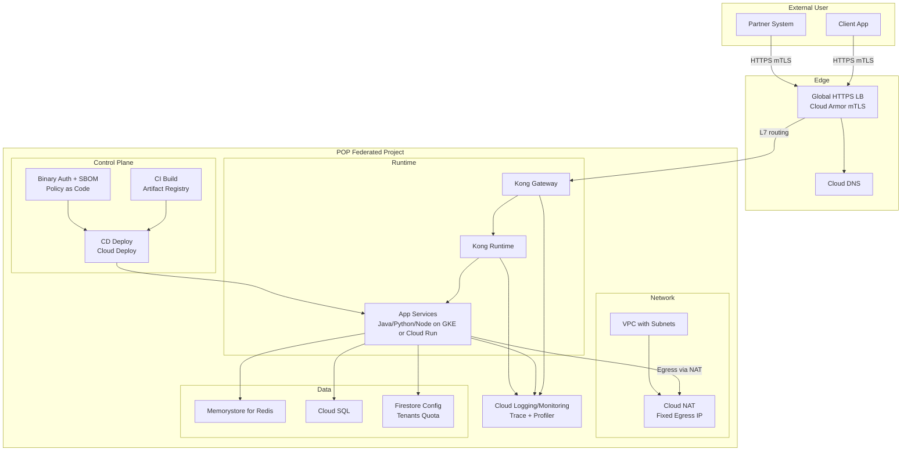
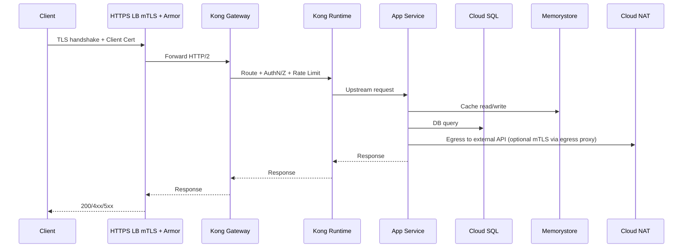
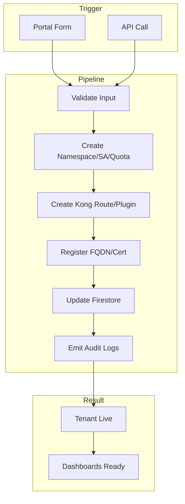
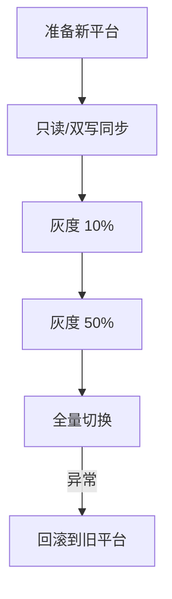

以下是一个针对 POP 平台迁移到新的 Federated GCP 工程 的完整方案，结合现有的 API Platform (aibang) 标准及安全要求，包含流程、关键步骤及必要细节。

⸻

1. 评估阶段（Assessment）

1.1 现有 POP 平台架构分析
	•	计算资源：Java、Python、Node.js 服务运行在何处？（GKE、GCE 或 Cloud Run）
	•	数据存储：
	•	Redis：是否用于缓存、Session 或队列？
	•	Cloud SQL：是否需要迁移用户数据？
	•	是否涉及 Firestore 或 BigQuery？
	•	网络流量 Flow：
	•	External Flow（外部用户/系统访问）
	•	Internal Flow（平台内服务间调用）
	•	安全需求：
	•	是否已使用 mTLS？
	•	是否需要 Cloud Armor 或其他安全策略？

1.2 差距评估
	•	比较 aibang 平台与 POP 平台的差异点：
	•	流量控制方式（Ingress、Egress）
	•	API 认证授权方式
	•	日志、监控、告警机制
	•	是否需要调整 POP 的架构以符合 aibang 标准。

⸻

2. 新平台设计（Federated GCP Project Setup）

2.1 GCP 资源规划
	•	新工程使用新的 EMID（Environment ID）。
	•	分配 VPC、子网、路由、NAT、负载均衡等。
	•	定义 IAM 权限模型，确保 Federated 用户的访问安全。

2.2 流量接入设计
	•	Ingress：
	•	使用 HTTPS Load Balancer + mTLS + Cloud Armor。
	•	是否保留原有客户端证书校验机制？
	•	Egress：
	•	使用 Cloud NAT 控制出口 IP。
	•	需考虑 VPC Service Controls 及 Private Google Access。

2.3 服务组件部署
	•	选择合适的运行环境：
	•	Java/Python/Node → 建议 GKE 或 Cloud Run。
	•	数据存储设计：
	•	Redis：迁移至 Memorystore。
	•	Cloud SQL：使用 Database Migration Service 迁移用户数据。
	•	日志、监控、告警：统一接入 Cloud Logging & Monitoring。

⸻

3. 迁移流程（Migration Plan）


⸻

4. 自动化 Onboarding 与后续管理

4.1 自动化 Onboarding 流程
	•	新用户注册 → 触发 CI/CD Pipeline → 自动创建 API Gateway 配置 & 部署资源。
	•	API 信息写入 Firestore，支持后续配额管理及计费。

4.2 API 特性同步
	•	确保每个 API 都支持：
	•	认证与授权策略（JWT、mTLS、API Key）
	•	限流与熔断（Kong Gateway Plugin）
	•	日志追踪（Cloud Logging + Trace）

⸻

5. 迁移后步骤

阶段	任务	责任人	工具/产品
评估	平台架构 & 差距分析	架构师	Cloud Asset Inventory
设计	新工程网络 & 安全架构	GCP 平台工程师	VPC、LB、IAM
部署	服务 & 数据迁移	DevOps & DBA	DMS、Memorystore
切换	新 FQDN 上线	SRE	Cloud DNS、SSL
监控	日志监控告警接入	SRE & DevOps	Cloud Logging、Monitoring

⸻

6. 建议的 Pipeline 设计
	•	阶段化迁移：先部署非关键服务 → 验证 → 逐步迁移核心 API。
	•	蓝绿/金丝雀发布：在 LB 层支持流量分流，避免一次性切换。
	•	回滚策略：保留旧 POP 平台，确保切换失败可快速回退。

⸻

要不要我帮你 出一份更详细的迁移 Checklist（含命令行和 YAML 示例），还是要先出一份 高层架构设计文档（HLD） 给团队评估？
你希望下一步输出 详细步骤表 还是 架构文档草稿？


# Design
# **POP → Federated GCP 高层架构设计文档（HLD）与迁移 Checklist**

  

> 目标：将 **POP 平台**迁移至**新的 Federated GCP 工程**，在对齐 **CAEP 标准**的同时，支持外部与内部双流量路径、mTLS、自动化 Onboarding、多语言运行时（Java/Python/Node）、状态数据迁移（Redis→Memorystore、Cloud SQL）、可观测性与合规。

---

## **1. 范围与非目标**

- **范围**：新工程搭建、网络与安全架构、入口/出口设计、运行时与数据层、自动化 Onboarding、迁移与回滚方案、FQDN 切换。
    
- **非目标**：业务代码改造细节、第三方 SaaS 深度对接实现。
    

---

## **2. 目标架构（Logical View）**



---

## **3. 关键设计决策**

  

### **3.1 环境与命名规范（EMID）**

- **工程命名**：pop-{env}-{emid}（例：pop-prod-emid123）
    
- **Label 约定**：env, emid, system=pop, owner, pii={yes|no}，全栈资源继承。
    
- **分层结构**：多 Project（隔离 blast radius），Shared VPC 可选。
    

  

### **3.2 入口（Ingress）**

- **Global HTTPS LB** 统一入口，域名由 **Cloud DNS** 管理。
    
- 支持 **mTLS**（Certificate Manager + TrustConfig），保留自定义客户端主题检查（在 Edge 或 Kong 层实现）。
    
- **Cloud Armor**：WAF、IP/Geo/ASN、Bot、速率限制（平台统一策略 + Team 细化）。
    

  

### **3.3 出口（Egress）**

- **Cloud NAT** 固定出口 IP，满足对端白名单需求。
    
- **Private Google Access** 打开，控制对 Google APIs 的私有访问。
    
- 若需要对外 **mTLS 客户端认证**：在服务侧使用 **Egress Proxy（Envoy/Nginx）** 统一出站，集中证书管理与轮换。
    

  

### **3.4 运行时选型**

- **首选 GKE（Autopilot/Standard）**：统一 Sidecar、HPA、PDB、灰度流量等能力；或按服务特性选 **Cloud Run**（冷启动小、自动缩放）。
    
- **API 网关**：Kong Gateway + Kong Runtime（与现有 CAEP 模式对齐）。
    

  

### **3.5 数据层**

- **Redis → Memorystore**（Key/TTL/分片模型评估）。
    
- **Cloud SQL**（MySQL/Postgres），通过 **DMS** 做不停机迁移（最小化切换窗口）。
    
- **配置与租户信息**：Firestore（Quota、租户元数据、证书指纹等）。
    

  

### **3.6 可观测性与合规**

- **全链路**：Cloud Logging、Metrics、Trace（OpenTelemetry）、Error Reporting。
    
- **制品与部署**：Artifact Registry、SBOM、Binary Authorization（阻断未签名镜像）、Cloud Deploy。
    
- **安全合规**：VPC-SC（敏感项目）、CMEK（需要时）、最小化 IAM。
    

---

## **4. 外部/内部流量 Flow（Detail）**



---

## **5. 自动化 Onboarding（Tenant & API）**

  

### **5.1 目标**

- POP 新用户或新 API **自助/半自助**接入：一键创建命名空间、SA、配额、Kong 路由、证书指纹、监控告警、Quota/计费元数据。
    



### **5.2 Onboarding 输出物**

- 命名空间、RBAC、ResourceQuota、NetworkPolicy
    
- Kong Route/Service/Consumer/Key-Auth/JWT/mTLS
    
- Firestore 文档：tenants/{id}, apis/{id}
    
- Cloud DNS 记录 & 证书任务
    
- 监控：SLO、告警策略、看板（Looker Studio/Cloud Monitoring）
    

---

## **6. 迁移策略**

- **双写/回写**或只读迁移策略按业务评估。
    
- **灰度**：基于 **Gateway API HTTPRoute 权重**做流量按比例切换。
    
- **回滚**：保留旧 POP 入口与流量回退路径；数据库在切换窗口内冻结 DDL。
    



---

## **7. 样例与参考片段**

  

### **7.1 GKE 基础与网络（示例）**

```bash
# 启用常用API
gcloud services enable compute.googleapis.com container.googleapis.com \
  certificatemanager.googleapis.com networkservices.googleapis.com \
  cloudkms.googleapis.com monitoring.googleapis.com logging.googleapis.com \
  dns.googleapis.com redis.googleapis.com sqladmin.googleapis.com

# VPC + Subnet + NAT
gcloud compute networks create pop-net --subnet-mode=custom
gcloud compute networks subnets create pop-subnet \
  --network=pop-net --range=10.10.0.0/20 --region=us-central1
gcloud compute routers create pop-nat-router --network=pop-net --region=us-central1
gcloud compute routers nats create pop-nat --router=pop-nat-router \
  --auto-allocate-nat-external-ips --nat-all-subnet-ip-ranges --region=us-central1

# GKE Autopilot（或 Standard）
gcloud container clusters create-auto pop-cluster \
  --region=us-central1 --release-channel=regular \
  --logging=SYSTEM,WORKLOAD --monitoring=SYSTEM \
  --labels=system=pop,env=prod,emid=emid123
```

### **7.2 Gateway API 灰度与路由（示例）**

```yaml
apiversion: gateway.networking.k8s.io/v1
kind: Gateway
metadata:
  name: pop-external-gw
  namespace: gateway-system
  labels:
    system: pop
spec:
  gatewayClassName: gke-l7-global-external-managed
  listeners:
  - name: https
    protocol: HTTPS
    port: 443
    tls:
      mode: Terminate
      certificateRefs:
      - kind: Secret
        name: tls-pop-cert # 由 cert-manager 或外部导入
---
apiversion: gateway.networking.k8s.io/v1
kind: HTTPRoute
metadata:
  name: pop-route
  namespace: gateway-system
spec:
  parentRefs:
  - name: pop-external-gw
  hostnames:
  - api.pop.example.com
  rules:
  - matches:
    - path:
        type: PathPrefix
        value: /v1
    backendRefs:
    - name: svc-v1
      port: 8080
      weight: 90
    - name: svc-v2
      port: 8080
      weight: 10
```

> 注：mTLS 若在 Edge 执行，按平台配置 Certificate Manager + TrustConfig；若在网关层执行，在 Kong 启用 mtls-auth/client_certificate 验证。

  

### **7.3 Kong mTLS 与限流（示例）**

```yaml
_format_version: "3.0"
services:
  - name: pop-svc
    url: http://svc-v1.default.svc.cluster.local:8080
    routes:
      - name: pop-route
        paths: ["/v1"]
        protocols: ["https"]
plugins:
  - name: acl
    config:
      allow: ["tenant-abc"]
  - name: rate-limiting
    config:
      minute: 600
      policy: local
  - name: mtls-auth
    config:
      ca_certificates:
        - |-
          -----BEGIN CERTIFICATE-----
          MIID...
          -----END CERTIFICATE-----
      allow_without_client_cert: false
consumers:
  - username: tenant-abc
    acls:
      - group: tenant-abc
```

### **7.4 Memorystore 与 Cloud SQL（示例声明）**

```yaml
apiversion: apps/v1
kind: Deployment
metadata:
  name: app-v1
spec:
  replicas: 2
  selector:
    matchLabels: { app: app-v1 }
  template:
    metadata:
      labels: { app: app-v1 }
    spec:
      containers:
      - name: app
        image: us-central1-docker.pkg.dev/pop-prod-emid123/app/app:v1.0.0
        env:
        - name: REDIS_HOST
          value: 10.10.5.3  # 或使用 Private IP + ServiceEntry/ConfigMap
        - name: DB_HOST
          value: 10.10.6.5  # Cloud SQL Private IP
        - name: DB_USER
          valueFrom:
            secretKeyRef: { name: db-secret, key: user }
        - name: DB_PASS
          valueFrom:
            secretKeyRef: { name: db-secret, key: pass }
        readinessProbe:
          httpGet: { path: /healthz, port: 8080 }
          initialDelaySeconds: 5
          periodSeconds: 5
        resources:
          requests: {cpu: "250m", memory: "512Mi" }
          limits: {cpu: "1", memory: "1Gi" }
---
apiversion: policy/v1
kind: PodDisruptionBudget
metadata:
  name: app-v1-pdb
spec:
  minAvailable: 1
  selector:
    matchLabels: { app: app-v1 }
```

### **7.5 Certificate Manager TrustConfig（示例，指纹纳管）**

```
# 导入/更新信任CA（示例）
gcloud certificate-manager trust-configs create pop-trust \
  --location=global \
  --trust-store=file:///path/to/ca_bundle.pem

# 指纹JSON结构（用于自动化去重/增量）
cat > ca-fingerprints.json <<'JSON'
{
  "cas": [
    {
      "name": "partnerA-root",
      "sha256": "cafe...beef",
      "expires": "2030-12-31"
    }
  ]
}
JSON
```

---

## **8. FQDN 与切换策略**

- **准备**：新 FQDN 申请/证书签发、DNS TTL 降至 60s、LB 健康检查稳定。
    
- **灰度**：HTTPRoute 按权重 10%→50%→100%。
    
- **切换**：Cloud DNS 更新记录 → 监控 4xx/5xx 与延迟。
    
- **回滚**：保留旧记录与路由策略，单命令回切；数据库在切换窗口内冻结 DDL。
    

---

## **9. 迁移 Checklist（含前/中/后与回滚）**

  

### **9.1 准备阶段**

- 创建新 GCP 工程并绑定 Billing，应用 org-policy 与基础配额
    
- 启用所需 API（Compute/Container/SQL/Redis/DNS/Cert Manager/Logging/Monitoring 等）
    
- VPC、子网、Cloud NAT、Private Google Access
    
- GKE 集群与节点池（或 Cloud Run 服务）
    
- Artifact Registry、Cloud Build/Cloud Deploy、Binary Authorization 策略
    
- Cloud SQL（实例、网络、用户、备份与高可用）
    
- Memorystore（容量、区域、高可用）
    
- Certificate Manager：证书与 TrustConfig（按租户或场景分组）
    
- Cloud Armor 策略与基线 WAF 规则集
    
- Cloud DNS 记录与 TTL 策略
    
- 日志、指标、Trace、SLO、告警基线
    
- RBAC、命名空间、ResourceQuota、NetworkPolicy 基线
    
- Kong Gateway/Runtime 与基础插件（Auth、限流、观测）
    

  

### **9.2 数据迁移**

- 盘点 Redis 数据模型（热键、TTL、Eviction），确认可迁移性
    
- 建立 Redis 同步或分阶段切换计划（读写路径与一致性）
    
- 评估 Cloud SQL 架构（索引、连接池、最大连接数、慢查询）
    
- 使用 DMS 做初始全量 + 增量复制（验证延迟/冲突处理）
    
- 迁移前最后一次一致性校验与只读窗口评估
    

  

### **9.3 应用迁移与验收**

- CI/CD 打包签名，镜像入库 + SBOM
    
- 部署至新环境，完成健康检查、自检
    
- 压测：QPS、P99、内存曲线、GC 与 HPA 触发
    
- 安全扫描：镜像、依赖、端口、出站访问清单
    
- 演练：灰度 10%→50%→100%，验证可观测性与告警
    

  

### **9.4 FQDN 切换**

- 降低 TTL，确认新 LB 与证书状态 Active
    
- 切换 DNS 记录，监控 4xx/5xx 与延迟
    
- 客户端证书兼容性与失败样本回收
    

  

### **9.5 上线后**

- 错误预算与 SLO 看板运行一周
    
- 成本回顾（NAT egress、LB、SQL、Redis、日志指标）
    
- 清理遗留与文档封版
    

  

### **9.6 回滚预案**

- 旧 POP 保持热备，DNS 回切机制
    
- 应用双活或冷备回退说明
    
- 数据回滚点：Cloud SQL PITR、备份集；Redis 暂存策略
    

---

## **10. 环境/组件清单示例表**

|**api_name**|**env**|**region**|**runtime**|**ingress**|**mTLS**|**egress_ip**|**redis_tier**|**sql_ha**|**obs_pack**|
|---|---|---|---|---|---|---|---|---|---|
|user|prod|us-central1|GKE|HTTPS GLB|yes|static|standard|yes|logging+metrics+trace|
|order|prod|us-central1|GKE|HTTPS GLB|yes|static|standard|yes|logging+metrics+trace|
|report|stage|us-central1|Run|HTTPS GLB|opt|static|basic|no|logging+metrics|

---

## **11. 自动化脚本与接口（片段）**

  

### **11.1 Onboarding（命名空间、配额、Kong 路由）**

```bash
TENANT=tenant-abc
NS=pop-$TENANT

# 命名空间与配额
kubectl create ns $NS
kubectl -n $NS apply -f - <<'YAML'
apiversion: v1
kind: ResourceQuota
metadata: { name: rq-default }
spec:
  hard:
    requests.cpu: "4"
    requests.memory: "8Gi"
    limits.cpu: "8"
    limits.memory: "16Gi"
YAML

# Kong 路由（Kong Admin API 示例）
curl -sS -X POST http://kong-admin.kong:8001/services \
  --data name=$TENANT-svc \
  --data url=http://$NS.svc.cluster.local:8080
curl -sS -X POST http://kong-admin.kong:8001/services/$TENANT-svc/routes \
  --data name=$TENANT-route \
  --data paths[]="/$TENANT"
```

### **11.2 Firestore 写入（租户元数据）**

```json
{
  "tenant_id": "tenant-abc",
  "fqdn": "api.pop.example.com",
  "path_prefix": "/tenant-abc",
  "quota": { "rps": 100, "burst": 200 },
  "mtls": { "required": true, "trusted_fps": ["cafe...beef"] },
  "created_at": "2025-08-26T00:00:00Z",
  "owner": "team-x"
}
```

---

## **12. 风险与缓解**

- **证书信任链/客户端兼容**：提前收集多终端 UA，灰度阶段扩大采样与失败日志。
    
- **数据库热点与连接池**：引入连接池中间件，限制并发，慢查询剖析优化。
    
- **灰度策略误配**：所有 Route/Weight 变更走 PR + 审批 + 回滚模板。
    
- **出站白名单**：集中 Egress Proxy，证书与 IP 白名单统一治理。
    
- **成本**：日志指标采样/路由，SQL/Redis 容量与高可用按需。
    

---

## **13. 附录：团队分工（RACI）**

|**工作项**|**A 架构**|**P 平台**|**S SRE**|**D Dev**|**Sec 安全**|**DBA**|
|---|---|---|---|---|---|---|
|目标架构/HLD|R|C|C|I|C|I|
|VPC/LB/NAT|C|R|C|I|C|I|
|GKE/Run 基础|C|R|C|I|I|I|
|Kong 与流量策略|C|R|C|I|C|I|
|证书与 mTLS|C|R|C|I|R|I|
|Cloud Armor/WAF|I|R|C|I|R|I|
|数据迁移（SQL/Redis）|I|C|I|I|I|R|
|可观测性|C|R|R|I|I|I|
|Onboarding 自动化|C|R|C|C|I|I|
|灰度/切换与回滚|C|R|R|I|I|C|

---

# **交付物清单**

- 本 HLD 文档（架构与设计）
    
- 迁移 Checklist（含前/中/后与回滚）
    
- 示例 YAML / Bash 片段（可直接复用并扩展）
    
- Onboarding 数据结构与自动化步骤
    
  

> 需要我把以上内容拆成**可执行的仓库结构**（/environments、/gateways、/apps、/onboarding、/ops-runbook），并补齐 Makefile 与 GitHub Actions/Cloud Build Pipeline 示例吗？我可以直接按你们 CAEP 标准生成一套“开箱即用”的模板。