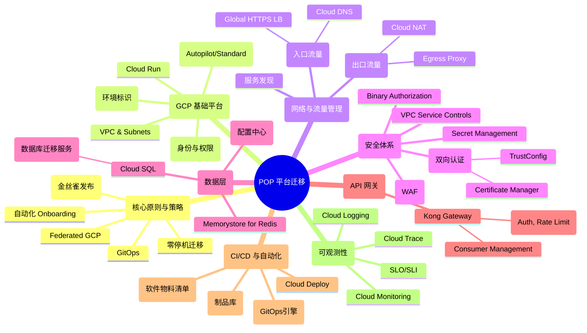
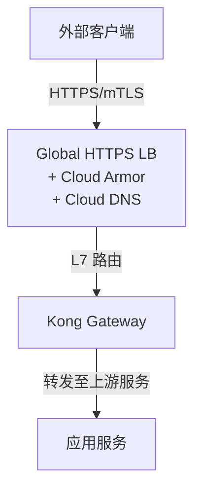
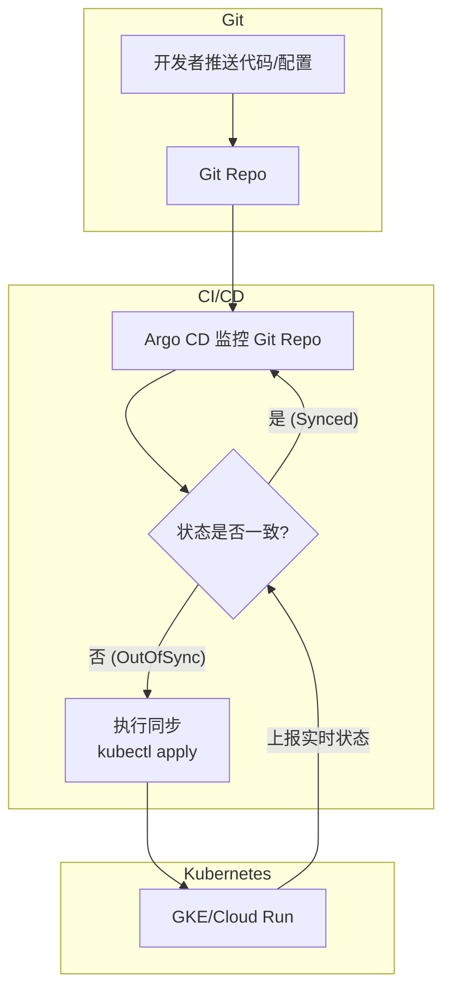

# POP平台迁移核心概念脑图

本文档旨在梳理和整合 POP 平台迁移至 Federated GCP 过程中的所有核心技术概念、组件和流程，并以脑图和分类说明的形式呈现，帮助您快速理解整个技术体系。

---

## 1. 核心概念关系图 (Brain Diagram)

---

## 2. 分类概念详解

### 2.1 核心原则与策略

| 概念 | 描述 | 关键点 |
| :--- | :--- | :--- |
| **GitOps** | 使用 Git 仓库作为定义应用和基础设施状态的“唯一真实来源”。所有变更通过 Git 提交发起，由自动化工具（如 Argo CD）同步到集群。 | 声明式、版本化、自动化、安全性（Pull模式）。 |
| **Federated GCP** | 一种 GCP 组织和项目管理模型，通过 IAM Federation 实现用户身份联合，允许用户以其现有身份访问 GCP 资源，简化了多项目、多环境的权限管理。 | 统一身份认证，简化跨项目访问。 |
| **零停机迁移** | 旨在不中断业务服务的前提下完成平台迁移。 | 关键技术：数据同步、流量灰度切换、回滚预案。 |
| **金丝雀发布 (Canary)** | 一种风险控制发布策略，先将少量流量（如10%）切换到新版本，验证其稳定性和性能，然后逐步增加流量比例，直至完全替代旧版本。 | 关键组件：`Gateway API (HTTPRoute)` 的权重配置。 |
| **自动化 Onboarding** | 为新租户或新服务提供自助式或半自助式的接入流程，自动完成资源创建、配置下发和权限设置。 | 目标：提升效率，降低人工错误。实现：CI/CD Pipeline、API、IaC。 |

### 2.2 GCP 基础平台

| 组件 | 描述 | 选型考量 |
| :--- | :--- | :--- |
| **GKE** | Google Kubernetes Engine，托管的 K8s 服务。 | **Autopilot**：Google管理节点，按Pod资源付费，简化运维。**Standard**：可完全控制节点配置。是多语言服务（Java/Python/Node）的主要运行环境。 |
| **Cloud Run** | 全托管的无服务器平台，用于运行无状态容器。 | 适合对冷启动不敏感、需要快速自动伸缩的场景。 |
| **VPC** | Virtual Private Cloud，GCP 内的逻辑隔离网络。 | 迁移的基础，用于规划子网、IP范围和网络策略。 |
| **IAM** | Identity and Access Management，管理对GCP资源的访问权限。 | 遵循“最小权限原则”，与 Federated 身份模型结合。 |
| **EMID** | Environment ID，用于标识和区分不同环境（如`pop-prod-emid123`）的唯一ID，通常作为项目命名和资源标签的一部分。 | 实现环境隔离和成本归属。 |

### 2.3 网络与流量管理

#### Ingress (入口流量)

- **Global HTTPS LB**: 全球负载均衡器，作为所有外部流量的统一入口。
- **Cloud DNS**: 托管的 DNS 服务，用于管理域名（FQDN）。
- **mTLS**: 在 LB 层通过 **Certificate Manager** 和 **TrustConfig** 实现双向 TLS 认证，验证客户端证书的有效性。

#### Egress (出口流量)
- **Cloud NAT**: 为GKE/Cloud Run等无外部IP的资源提供一个或多个固定的出口IP地址，以满足外部系统对IP白名单的要求。
- **Egress Proxy**: 当应用需要以客户端身份调用外部mTLS接口时，可通过一个集中的代理（如 Envoy/Nginx）发起请求，统一管理客户端证书。
- **VPC Service Controls**: 创建服务边界，防止数据从边界内意外或恶意泄露。

### 2.4 安全体系

| 组件 | 作用 |
| :--- | :--- |
| **mTLS** | 双向TLS认证，确保通信双方的身份都是可信的。在入口（LB）和内部（Service Mesh）均可实现。 |
| **Cloud Armor** | Web应用防火墙（WAF），提供DDoS防护、IP/地理位置过滤、SQL注入/XSS攻击防护等。 |
| **Binary Authorization** | 供应链安全策略，确保只有经过签名和验证的容器镜像才能部署到GKE中。 |
| **SBOM** | 软件物料清单，记录软件组件、库和依赖关系，用于漏洞跟踪和合规性检查。 |
| **Secret Management** | 使用统一的密钥管理服务（如GCP Secret Manager）来存储和管理数据库密码、API密钥等敏感信息。 |

### 2.5 数据层

| 组件 | 描述 | 迁移方案 |
| :--- | :--- | :--- |
| **Cloud SQL** | 全托管的关系型数据库服务（MySQL/PostgreSQL）。 | 使用 **DMS (Database Migration Service)** 进行从现有数据库到Cloud SQL的实时、低停机时间迁移。 |
| **Memorystore for Redis** | 全托管的 Redis 服务。 | 评估现有 Redis 的使用模式（缓存、会话、队列），通过双写或数据同步脚本进行迁移。 |
| **Firestore** | NoSQL 文档数据库。 | 常用于存储租户元数据、API配置、配额信息等。 |

### 2.6 API 网关

- **Kong Gateway**: 作为 API 网关，集中处理所有 API 请求。
- **核心功能**:
    - **路由 (Routing)**: 根据路径、主机名等将请求转发到正确的上游服务。
    - **插件 (Plugins)**: 通过插件实现认证(`mtls-auth`, `jwt`, `acl`)、限流(`rate-limiting`)、可观测性等功能。
    - **消费者 (Consumers)**: 管理 API 的调用方，并为其分配凭证和访问控制策略。

### 2.7 CI/CD 与自动化

- **Argo CD**: GitOps 引擎，持续将 K8s 集群的状态与 Git 仓库中定义的目标状态进行同步。
- **Artifact Registry**: 存储和管理容器镜像、语言包等构建产物。
- **Cloud Deploy**: Google Cloud 的持续交付服务，用于定义和执行多阶段的发布流水线（如开发→测试→生产）。

### 2.8 可观测性

- **Cloud Logging**: 集中收集、搜索和分析来自所有服务和基础设施的日志。
- **Cloud Monitoring**: 收集指标（Metrics），创建仪表盘（Dashboard），并设置告警策略（Alerting）。
- **Cloud Trace**: 捕获分布式系统中的请求延迟信息，用于性能分析和瓶颈定位。
- **SLO/SLI**:
    - **SLI (Service Level Indicator)**: 服务水平指标，是衡量服务性能的量化指标（如可用性、延迟）。
    - **SLO (Service Level Objective)**: 服务水平目标，是SLI在一段时间内的目标值（如99.9%的可用性）。
