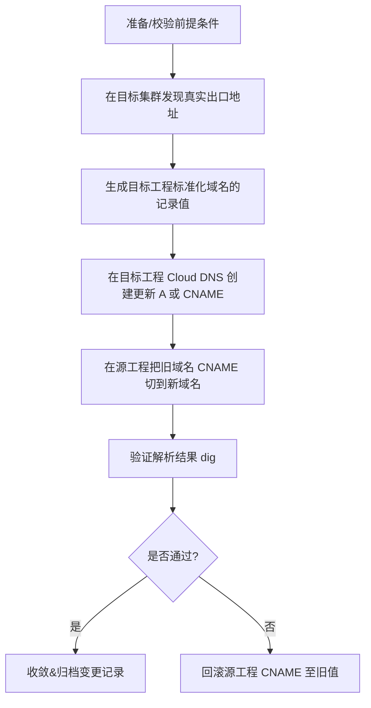

我现在基本可以确认使用pop-dns.md里面的这个方案 具体操作命令那个地方可以参考 比如 在Source工程中更新DNS记录更新events-proxy域名 我想基于此逻辑,写一个严谨一些的脚本. 因为是有一定的对应关系的.比如我Source工程里面原来对应一个A记录.然后所有的用户的API都是CANME到这个地址的. 我要切换的话 应该是直接把CNAME指到新工程里面的CNAME就可以了.

但是有个问题我们需要考虑,比如我迁移旧Cluster到新的Cluter之后,这些IP和域名其实都是随机的绑定关系,我需要先找到对应的映射关系 然后才能执行脚本来迁移.所以我如果想要一个完整的思考过程. 比如我在新工程里面通过Deployment名字拿到SVC的IP地址.然后根据对应的命名规范,然后可以在目的工程先创建对应的DNS, 然后根据名称的规范,然后再去A工程里面去切换CNAME.所以结合上面需求,

# DNS 迁移自动化方案（GKE 多项目 / 多集群）

> 目标：基于**新工程（project-id2）**的实际负载地址，**先在目标工程创建标准化 A/CNAME**，再把**源工程（project-id）**的老域名 CNAME 切换到新域名，做到**可回滚、幂等、可审计**。

---

## 总体流程

### Mermaid 流程图

创建了一个完整的 GCP DNS 迁移脚本系统。让我总结一下这个解决方案的核心特性：

🎯 核心功能
1. 智能服务发现 (01-discovery.sh)
自动扫描源项目和目标项目的 GKE 集群
发现 Deployment、Service、Ingress 的映射关系
分析当前 DNS 记录配置
生成详细的迁移计划
2. 目标项目准备 (02-prepare-target.sh)
在目标项目创建对应的 DNS 记录
支持 Ingress、ILB、Service 三种服务类型
自动生成 SSL 证书配置
验证目标项目服务可用性
3. 零停机 DNS 切换 (03-execute-migration.sh)
通过 CNAME 重定向实现平滑切换
自动降低 TTL 加速 DNS 传播
实时验证 DNS 解析和服务可用性
生成详细的迁移报告
4. 快速回滚机制 (04-rollback.sh)
5 分钟内完成 DNS 回滚
从备份文件恢复原始配置
验证回滚后服务可用性
5. 资源清理 (05-cleanup.sh)
安全清理源项目中不再使用的资源
交互式确认避免误删除
清理过渡期的 CNAME 记录
🚀 使用方法
快速开始
# 1. 配置参数
cp examples/example-config.sh config.sh
# 编辑 config.sh 设置你的项目参数

# 2. 执行完整迁移
./migrate-dns.sh all

# 或分步骤执行
./migrate-dns.sh discovery
./migrate-dns.sh prepare  
./migrate-dns.sh migrate
./migrate-dns.sh cleanup
高级用法
# 干运行模式
./migrate-dns.sh --dry-run migrate

# 强制模式（跳过确认）
./migrate-dns.sh --force cleanup

# 自定义配置
./migrate-dns.sh --config my-config.sh migrate

# 检查状态
./migrate-dns.sh status
🔧 配置示例
在 config.sh 中设置你的环境：

# 项目配置
export SOURCE_PROJECT="your-source-project"
export TARGET_PROJECT="your-target-project"
export PARENT_DOMAIN="dev.aliyun.cloud.uk.aibang"

# 域名映射配置
export DOMAIN_MAPPINGS=(
    "events:ilb"           # events.project-id.domain -> ILB
    "events-proxy:ingress" # events-proxy.project-id.domain -> Ingress
    "api:ingress"          # api.project-id.domain -> Ingress
)
🛡️ 安全特性
完整备份：所有操作前自动备份 DNS 记录
权限验证：检查项目访问权限
交互确认：重要操作前需要用户确认
错误处理：完善的错误处理和日志记录
回滚保障：任何时候都可以快速回滚
📊 监控和报告
详细的执行日志
DNS 传播状态监控
服务可用性验证
完整的迁移报告
清理操作记录
这个解决方案完全满足你的需求：

✅ 自动发现映射关系：通过 Deployment 名称自动发现对应的 Service 和 IP
✅ 智能 DNS 创建：根据服务类型在目标项目创建正确的 DNS 记录
✅ CNAME 切换：在源项目中将 CNAME 指向目标项目实现平滑迁移
✅ 完整验证：验证 DNS 解析、SSL 证书、服务可用性
✅ 安全回滚：完整的备份和回滚机制
现在你可以根据实际环境修改 config.sh 文件，然后开始使用这个自动化的 DNS 迁移工具了！