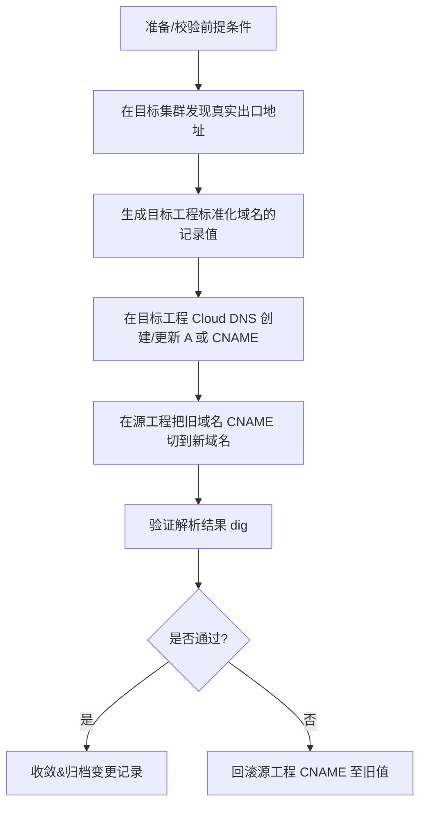

# DNS 迁移自动化方案（GKE 多项目 / 多集群）

> 目标：基于**新工程（project-id2）**的实际负载地址，**先在目标工程创建标准化 A/CNAME**，再把**源工程（project-id）**的老域名 CNAME 切换到新域名，做到**可回滚、幂等、可审计**。

---

## 总体流程

### Mermaid 流程图




## **前提条件与约定**

- 你已经具备以下权限：
    
    - **Kubernetes**：可 kubectl 访问**目标**集群（project-id2）。
        
    - **Cloud DNS**：在 **源工程**和**目标工程**均具备 DNS Administrator（或等价自定义角色）。
        
    
- 安装工具：gcloud, kubectl, jq, bash, dig。
    
- 解析域为私有或公共均可（脚本不区分）。
    
- 记录命名约定（可按需调整到配置文件里）：
    
    - 目标工程**标准化域名**（示例）：
        
        - events.project-id2.dev.aliyun.cloud.uk.aibang.  → 指向 **ILB A 记录**
            
        - ingress-nginx.gke-01.project-id2.dev.aliyun.cloud.uk.aibang. → 指向 **Ingress LB (A 或 CNAME)**
            
        
    - 源工程**旧域名**（示例）：
        
        - events.project-id.dev.aliyun.cloud.uk.aibang.（旧） → **CNAME** 到上面的新域名
            
        - events-proxy.project-id.dev.aliyun.cloud.uk.aibang.（旧） → **CNAME** 到上面的新域名
            
        
    

---

## **目录结构（建议）**

```
dns-migration/
├── configs/
│   └── config.json         # 迁移声明式配置
├── out/
│   ├── targets.json        # 目标地址发现的结果（自动生成）
│   └── backup_cname.json   # CNAME 切换前的备份（自动生成）
├── scripts/
│   ├── discover_targets.sh
│   ├── ensure_dns_target.sh
│   ├── switch_cname_source.sh
│   ├── verify_dns.sh
│   └── rollback_source.sh
└── README.md
```

---

## **配置文件（声明式）**

  

> 采用 **JSON**，便于直接用 jq 解析；必要时你可以扩展字段（不会影响脚本）。

```json
{
  "global": {
    "project_src": "project-id",
    "project_dst": "project-id2",

    "zone_src_name": "dev-zone-src",
    "zone_src_dnsname": "dev.aliyun.cloud.uk.aibang.",

    "zone_dst_name": "dev-zone-dst",
    "zone_dst_dnsname": "dev.aliyun.cloud.uk.aibang.",

    "kubecontext_dst": "gke_project-id2_europe-west2_gke-01",
    "ttl": 60,
    "dry_run": true
  },
  "records": [
    {
      "app": "events-ilb",
      "env": "dev",
      "namespace": "ingress-proxy",
      "discover": {
        "kind": "service",
        "name": "internal-vpc1-ingress-proxy-europe-west2-l4-ilb"
      },
      "target_fqdn": "events.project-id2.dev.aliyun.cloud.uk.aibang.",
      "source_cname": "events.project-id.dev.aliyun.cloud.uk.aibang."
    },
    {
      "app": "ingress-nginx",
      "env": "dev",
      "namespace": "ingress-nginx",
      "discover": {
        "kind": "ingress",
        "name": "ingress-nginx"
      },
      "target_fqdn": "ingress-nginx.gke-01.project-id2.dev.aliyun.cloud.uk.aibang.",
      "source_cname": "events-proxy.project-id.dev.aliyun.cloud.uk.aibang."
    }
  ]
}
```

> 说明：

- > discover.kind: service（LB/ILB 场景）或 ingress（L7 LB 场景）。
    
- > target_fqdn: 目标工程希望**标准化**暴露出来的新域名（我们会在**目标工程**为它创建 A/CNAME）。
    
- > source_cname: 源工程现网正在被用户使用的老域名（会被改成 CNAME → target_fqdn）。
    
- > ttl: 默认 60 秒，便于灰度/回滚。
    
- > dry_run: 默认 true（只打印操作），切换前把它改为 false 或用脚本参数覆盖。
    

---

## **脚本 1：目标发现（从 GKE 获取真实出口）**

  

> 输出 out/targets.json，记录每条 target_fqdn 对应的**记录类型**与**记录值**（A: IP / CNAME: 主机名）。

```bash
#!/usr/bin/env bash
# scripts/discover_targets.sh
set -euo pipefail

ROOT="$(cd "$(dirname "${BASH_SOURCE[0]}")/.." && pwd)"
CFG="$ROOT/configs/config.json"
OUT="$ROOT/out/targets.json"

jq -e . "$CFG" >/dev/null

KCTX=$(jq -r '.global.kubecontext_dst' "$CFG")
DRY=$(jq -r '.global.dry_run' "$CFG")

mkdir -p "$ROOT/out"

discover_one() {
  local ns="$1" kind="$2" name="$3"

  if [[ "$kind" == "service" ]]; then
    local ip host
    ip=$(kubectl --context "$KCTX" -n "$ns" get svc "$name" -o jsonpath='{.status.loadBalancer.ingress[0].ip}' 2>/dev/null || true)
    host=$(kubectl --context "$KCTX" -n "$ns" get svc "$name" -o jsonpath='{.status.loadBalancer.ingress[0].hostname}' 2>/dev/null || true)
    if [[ -n "$ip" ]]; then
      echo "A|$ip"
    elif [[ -n "$host" ]]; then
      echo "CNAME|$host."
    else
      echo "NONE|"
    fi
  elif [[ "$kind" == "ingress" ]]; then
    local ip host
    ip=$(kubectl --context "$KCTX" -n "$ns" get ingress "$name" -o jsonpath='{.status.loadBalancer.ingress[0].ip}' 2>/dev/null || true)
    host=$(kubectl --context "$KCTX" -n "$ns" get ingress "$name" -o jsonpath='{.status.loadBalancer.ingress[0].hostname}' 2>/dev/null || true)
    if [[ -n "$ip" ]]; then
      echo "A|$ip"
    elif [[ -n "$host" ]]; then
      echo "CNAME|$host."
    else
      echo "NONE|"
    fi
  else
    echo "NONE|"
  fi
}

echo "[]" > "$OUT"
N=$(jq '.records|length' "$CFG")
for ((i=0; i<N; i++)); do
  ns=$(jq -r ".records[$i].namespace" "$CFG")
  kind=$(jq -r ".records[$i].discover.kind" "$CFG")
  name=$(jq -r ".records[$i].discover.name" "$CFG")
  target_fqdn=$(jq -r ".records[$i].target_fqdn" "$CFG")
  source_cname=$(jq -r ".records[$i].source_cname" "$CFG")
  app=$(jq -r ".records[$i].app" "$CFG")

  kv=$(discover_one "$ns" "$kind" "$name")
  rtype="${kv%%|*}"
  rdata="${kv#*|}"

  if [[ "$rtype" == "NONE" || -z "$rdata" ]]; then
    echo "ERROR: [$app] 未发现 LoadBalancer/Ingress 出口地址: $ns/$kind/$name" >&2
    exit 1
  fi

  jq --arg app "$app" \
     --arg ns "$ns" \
     --arg kind "$kind" \
     --arg name "$name" \
     --arg target "$target_fqdn" \
     --arg source "$source_cname" \
     --arg rtype "$rtype" \
     --arg rdata "$rdata" \
     '. += [{"app":$app,"namespace":$ns,"discover":{"kind":$kind,"name":$name},"target_fqdn":$target,"source_cname":$source,"record_type":$rtype,"record_data":$rdata}]' \
     "$OUT" | sponge "$OUT"

  echo "[OK] $app -> $rtype $rdata"
done

echo "已生成: $OUT"
```

---

## **脚本 2：在目标工程创建/更新标准化域名（A 或 CNAME）**

  

> 按 out/targets.json 写入 **project-id2** 的 Cloud DNS（zone_dst_name）。

- > 若有 IP：创建/更新 **A** 记录
    
- > 否则：创建/更新 **CNAME** 记录（指向云 LB 主机名）
    

```bash
#!/usr/bin/env bash
# scripts/ensure_dns_target.sh
set -euo pipefail

ROOT="$(cd "$(dirname "${BASH_SOURCE[0]}")/.." && pwd)"
CFG="$ROOT/configs/config.json"
IN="$ROOT/out/targets.json"

PROJECT_DST=$(jq -r '.global.project_dst' "$CFG")
ZONE_DST_NAME=$(jq -r '.global.zone_dst_name' "$CFG")
TTL=$(jq -r '.global.ttl' "$CFG")
DRY=$(jq -r '.global.dry_run' "$CFG")

ensure_record() {
  local name="$1" type="$2" rdata="$3"

  local exist_ttl exist_data
  exist_ttl=$(gcloud dns record-sets list \
      --project "$PROJECT_DST" \
      --zone "$ZONE_DST_NAME" \
      --name "$name" --type "$type" \
      --format="value(ttl)" 2>/dev/null || true)

  exist_data=$(gcloud dns record-sets list \
      --project "$PROJECT_DST" \
      --zone "$ZONE_DST_NAME" \
      --name "$name" --type "$type" \
      --format="value(rrdatas[0])" 2>/dev/null || true)

  if [[ "$exist_data" == "$rdata" && -n "$exist_data" ]]; then
    echo "[SKIP] $name $type 已匹配 $rdata"
    return 0
  fi

  echo "[PLAN] upsert $name $type $rdata (ttl=$TTL)"
  if [[ "$DRY" == "true" ]]; then
    return 0
  fi

  tmpdir="$(mktemp -d)"
  pushd "$tmpdir" >/dev/null
  gcloud dns record-sets transaction start --project "$PROJECT_DST" --zone "$ZONE_DST_NAME"

  if [[ -n "$exist_data" ]]; then
    gcloud dns record-sets transaction remove \
      --project "$PROJECT_DST" --zone "$ZONE_DST_NAME" \
      --name "$name" --type "$type" --ttl "${exist_ttl:-$TTL}" \
      "$exist_data"
  fi

  gcloud dns record-sets transaction add \
    --project "$PROJECT_DST" --zone "$ZONE_DST_NAME" \
    --name "$name" --type "$type" --ttl "$TTL" \
    "$rdata"

  gcloud dns record-sets transaction execute \
    --project "$PROJECT_DST" --zone "$ZONE_DST_NAME"
  popd >/dev/null
  rm -rf "$tmpdir"
}

M=$(jq '.|length' "$IN")
for ((i=0; i<M; i++)); do
  name=$(jq -r ".[$i].target_fqdn" "$IN")
  rtype=$(jq -r ".[$i].record_type" "$IN")
  rdata=$(jq -r ".[$i].record_data" "$IN")
  ensure_record "$name" "$rtype" "$rdata"
done

echo "目标工程记录已确保（或已计划）。"
```

---

## **脚本 3：在源工程切换 CNAME → 指向新域名（并备份）**

  

> 把 source_cname 改成 **CNAME** → target_fqdn；写入 out/backup_cname.json 以便回滚。

```bash
#!/usr/bin/env bash
# scripts/switch_cname_source.sh
set -euo pipefail

ROOT="$(cd "$(dirname "${BASH_SOURCE[0]}")/.." && pwd)"
CFG="$ROOT/configs/config.json"
IN="$ROOT/out/targets.json"
BACKUP="$ROOT/out/backup_cname.json"

PROJECT_SRC=$(jq -r '.global.project_src' "$CFG")
ZONE_SRC_NAME=$(jq -r '.global.zone_src_name' "$CFG")
TTL=$(jq -r '.global.ttl' "$CFG")
DRY=$(jq -r '.global.dry_run' "$CFG")

echo "[]" > "$BACKUP"

upsert_cname() {
  local name="$1" target="$2"

  local exist_ttl exist_type exist_data
  exist_type=$(gcloud dns record-sets list \
      --project "$PROJECT_SRC" --zone "$ZONE_SRC_NAME" \
      --name "$name" --format="value(type)" 2>/dev/null || true)

  exist_ttl=$(gcloud dns record-sets list \
      --project "$PROJECT_SRC" --zone "$ZONE_SRC_NAME" \
      --name "$name" --type "$exist_type" \
      --format="value(ttl)" 2>/dev/null || true)

  exist_data=$(gcloud dns record-sets list \
      --project "$PROJECT_SRC" --zone "$ZONE_SRC_NAME" \
      --name "$name" --type "$exist_type" \
      --format="value(rrdatas[0])" 2>/dev/null || true)

  # 备份
  jq --arg name "$name" --arg type "${exist_type:-""}" --arg ttl "${exist_ttl:-""}" --arg data "${exist_data:-""}" \
     '. += [{"name":$name,"type":$type,"ttl":$ttl,"data":$data}]' \
     "$BACKUP" | sponge "$BACKUP"

  if [[ "$exist_type" == "CNAME" && "$exist_data" == "$target" ]]; then
    echo "[SKIP] $name 已是 CNAME -> $target"
    return 0
  fi

  echo "[PLAN] $name CNAME $target (ttl=$TTL)  [old: ${exist_type:-none} ${exist_data:-none}]"
  if [[ "$DRY" == "true" ]]; then
    return 0
  fi

  tmp="$(mktemp -d)"; pushd "$tmp" >/dev/null
  gcloud dns record-sets transaction start --project "$PROJECT_SRC" --zone "$ZONE_SRC_NAME"

  # 移除旧记录（若存在）
  if [[ -n "$exist_type" && -n "$exist_data" ]]; then
    gcloud dns record-sets transaction remove \
      --project "$PROJECT_SRC" --zone "$ZONE_SRC_NAME" \
      --name "$name" --type "$exist_type" --ttl "${exist_ttl:-$TTL}" \
      "$exist_data" || true
  fi

  # 添加新的 CNAME
  gcloud dns record-sets transaction add \
    --project "$PROJECT_SRC" --zone "$ZONE_SRC_NAME" \
    --name "$name" --type "CNAME" --ttl "$TTL" \
    "$target"

  gcloud dns record-sets transaction execute \
    --project "$PROJECT_SRC" --zone "$ZONE_SRC_NAME"
  popd >/dev/null
  rm -rf "$tmp"
}

M=$(jq '.|length' "$IN")
for ((i=0; i<M; i++)); do
  old=$(jq -r ".[$i].source_cname" "$IN")
  new=$(jq -r ".[$i].target_fqdn" "$IN")
  upsert_cname "$old" "$new"
done

echo "源工程 CNAME 已切换（或已计划）。备份写入: $BACKUP"
```

---

## **脚本 4：验证解析（可自定义解析器）**

```bash
#!/usr/bin/env bash
# scripts/verify_dns.sh
set -euo pipefail

ROOT="$(cd "$(dirname "${BASH_SOURCE[0]}")/.." && pwd)"
CFG="$ROOT/configs/config.json"
IN="$ROOT/out/targets.json"

RESOLVER="${1:-}"   # 可选：指定例如 169.254.169.254 或 VPC DNS IP

dig_one() {
  local name="$1"
  if [[ -n "$RESOLVER" ]]; then
    dig +short "$name" @"$RESOLVER"
  else
    dig +short "$name"
  fi
}

echo "| app | source_name | expected_target | actual |"
echo "|-----|-------------|-----------------|--------|"

M=$(jq '.|length' "$IN")
for ((i=0; i<M; i++)); do
  app=$(jq -r ".[$i].app" "$IN")
  old=$(jq -r ".[$i].source_cname" "$IN")
  new=$(jq -r ".[$i].target_fqdn" "$IN")

  actual=$(dig_one "$old" | tr -d '\r')
  echo "| $app | $old | $new | ${actual:-N/A} |"
done
```

---

## **脚本 5：回滚（按备份恢复源工程记录）**

```bash
#!/usr/bin/env bash
# scripts/rollback_source.sh
set -euo pipefail

ROOT="$(cd "$(dirname "${BASH_SOURCE[0]}")/.." && pwd)"
CFG="$ROOT/configs/config.json"
BACKUP="$ROOT/out/backup_cname.json"

PROJECT_SRC=$(jq -r '.global.project_src' "$CFG")
ZONE_SRC_NAME=$(jq -r '.global.zone_src_name' "$CFG")

jq -e . "$BACKUP" >/dev/null

roll_one() {
  local name="$1" type="$2" ttl="$3" data="$4"

  # 当前记录（不管是什么）都删掉，然后按备份恢复
  cur_type=$(gcloud dns record-sets list \
      --project "$PROJECT_SRC" --zone "$ZONE_SRC_NAME" \
      --name "$name" --format="value(type)" 2>/dev/null || true)
  cur_ttl=$(gcloud dns record-sets list \
      --project "$PROJECT_SRC" --zone "$ZONE_SRC_NAME" \
      --name "$name" --type "$cur_type" --format="value(ttl)" 2>/dev/null || true)
  cur_data=$(gcloud dns record-sets list \
      --project "$PROJECT_SRC" --zone "$ZONE_SRC_NAME" \
      --name "$name" --type "$cur_type" --format="value(rrdatas[0])" 2>/dev/null || true)

  tmp="$(mktemp -d)"; pushd "$tmp" >/dev/null
  gcloud dns record-sets transaction start --project "$PROJECT_SRC" --zone "$ZONE_SRC_NAME"
  if [[ -n "$cur_type" && -n "$cur_data" ]]; then
    gcloud dns record-sets transaction remove \
      --project "$PROJECT_SRC" --zone "$ZONE_SRC_NAME" \
      --name "$name" --type "$cur_type" --ttl "${cur_ttl:-60}" \
      "$cur_data" || true
  fi

  if [[ -n "$type" && -n "$data" ]]; then
    gcloud dns record-sets transaction add \
      --project "$PROJECT_SRC" --zone "$ZONE_SRC_NAME" \
      --name "$name" --type "$type" --ttl "${ttl:-60}" \
      "$data"
  fi

  gcloud dns record-sets transaction execute \
    --project "$PROJECT_SRC" --zone "$ZONE_SRC_NAME"
  popd >/dev/null
  rm -rf "$tmp"

  echo "[ROLLED] $name -> ${type:-<deleted>}"
}

N=$(jq '.|length' "$BACKUP")
for ((i=0; i<N; i++)); do
  name=$(jq -r ".[$i].name" "$BACKUP")
  type=$(jq -r ".[$i].type" "$BACKUP")
  ttl=$(jq -r ".[$i].ttl" "$BACKUP")
  data=$(jq -r ".[$i].data" "$BACKUP")
  # 说明：如果原先不存在记录，type/data 可能为空，表示删除现有记录达到“无记录”的状态
  roll_one "$name" "$type" "$ttl" "$data"
done
```

---

## **执行顺序（安全建议：先 Dry-Run，再 Apply）**

```
# 0) 检查 kube context & gcloud 账号/工程
kubectl config use-context gke_project-id2_europe-west2_gke-01
gcloud config set project project-id2

# 1) 目标地址发现（从 GKE 获取 LB/IP）
bash scripts/discover_targets.sh

# 2) 在目标工程确保标准化域名（A/CNAME）
bash scripts/ensure_dns_target.sh

# 3) 切换源工程 CNAME（默认 dry_run = true，确认无误后改 false）
#    方案一：直接修改 config.json -> global.dry_run=false
#    方案二：临时覆盖：jq 修改或导出环境变量控制（脚本当前读取 config.json）
bash scripts/switch_cname_source.sh

# 4) 验证（可指定企业内 DNS 解析器）
bash scripts/verify_dns.sh            # 使用本机默认解析器
bash scripts/verify_dns.sh 169.254.169.254  # 指定解析器示例

# 5) 如需回滚：
bash scripts/rollback_source.sh
```

---

## **示例映射结果表（发现阶段产出摘要）**

|**app**|**env**|**source_name**|**target_fqdn**|**record_type**|**record_data**|
|---|---|---|---|---|---|
|events-ilb|dev|events.project-id.dev.aliyun.cloud.uk.aibang.|events.project-id2.dev.aliyun.cloud.uk.aibang.|A|10.99.12.34|
|ingress-nginx|dev|events-proxy.project-id.dev.aliyun.cloud.uk.aibang.|ingress-nginx.gke-01.project-id2.dev.aliyun.cloud.uk.aibang.|A 或 CNAME|34.105.2.8 或 abcdef.gclb.net.|

> 注意：record_type 会根据实际是否拿到 IP 自动选择 **A** 或 **CNAME**。

---

## **关键点与实践建议**

- **幂等性**：脚本会对比现有记录，仅在不一致时更新；事务模式避免中间态。
    
- **变更最小化**：先**在目标工程**创建/更新标准化域名，再**切源工程 CNAME**，用户只感知到 CNAME 的一次调整。
    
- **TTL=60s**：便于灰度/回滚；稳定后可再把 TTL 调高（例如 300/600）。
    
- **安全回滚**：switch_cname_source.sh 自动备份旧记录到 out/backup_cname.json，回滚脚本基于该文件恢复。
    
- **多租户/多环境**：通过 configs/config.json 扩展 records 数组即可；也可按环境拆多份配置。
    
- **通过 Deployment 反推 Service（可选增强）**：若你只知道 Deployment 名，可扩展 discover 为 "kind":"deployment","name":"xxx"，脚本里加入“根据 Deployment Pod labels 匹配 type=LoadBalancer 的 Service”逻辑（需要 kubectl get deploy,svc -o json | jq 做子集匹配）。当前示例直接按 service / ingress 名称发现，更直观稳定。
    

---

## **与你现有流程的对齐**

- 你给出的最终目标是：
    
    - events.project-id.dev... **CNAME** → events.project-id2.dev...（ILB 场景）
        
    - events-proxy.project-id.dev... **CNAME** → ingress-nginx.gke-01.project-id2.dev...（L7 Ingress 场景）
        
    
- 上述脚本严格按照这个迁移模型实现，**先构建目标，再切换来源**，满足一致性与可回滚要求。
    

---