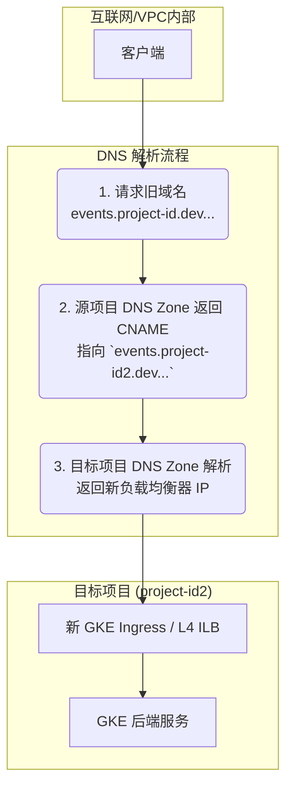
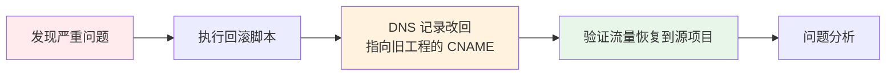

# GCP DNS 迁移策略与自动化脚本分析

## 1. 核心迁移策略分析

根据你的需求和现有文档，我们确认采用 **CNAME 链式重定向** 方案作为核心迁移策略。此方案具备对客户端透明、可快速回滚、支持平滑过渡的核心优势。

**最终状态架构图:**



## 2. 自动化迁移的挑战与解决方案

你提出的核心挑战非常关键：**新环境中的 IP 和域名是动态生成的，无法硬编码。**

**解决方案：** 我们的自动化脚本将围绕“**动态发现与配置**”的原则构建。脚本将在执行切换前，实时查询目标项目的基础设施，获取必要的 IP 和主机名，然后用这些信息来驱动后续的 DNS 配置。

## 3. 分阶段自动化迁移执行计划

我们将迁移过程分解为四个逻辑阶段：准备、执行、验证和回滚。

---

### **阶段一：准备与发现 (在 Target Project: `project-id2`)**

此阶段的目标是在不影响生产的前提下，完成所有准备工作。

#### **步骤 1: 动态发现新的负载均衡器 IP/主机名**

首先，我们需要找到新 GKE Ingress 或 L4 ILB 的入口地址。

```bash
# 变量定义
TARGET_PROJECT="project-id2"
GKE_CLUSTER="your-gke-cluster-in-project-id2"
GKE_REGION="europe-west2"
NAMESPACE="ingress-nginx" # Ingress Controller 所在的命名空间
SERVICE_NAME="ingress-nginx-controller" # Ingress Controller 的 Service 名称

# 切换到目标项目
gcloud config set project $TARGET_PROJECT

# 获取 GKE Ingress 的外部 IP 地址
# 注意: 请根据你的 Ingress Controller Service 类型 (LoadBalancer) 来获取
NEW_INGRESS_IP=$(kubectl get svc $SERVICE_NAME -n $NAMESPACE -o jsonpath='{.status.loadBalancer.ingress[0].ip}')

# 如果是 L4 ILB，通常其 IP 是静态预分配的，或者通过转发规则获取
# 假设我们获取到了 L4 ILB 的转发规则名称
L4_FORWARDING_RULE="your-l4-forwarding-rule"
NEW_L4_ILB_IP=$(gcloud compute forwarding-rules describe $L4_FORWARDING_RULE --region=$GKE_REGION --format="value(IPAddress)")

echo "发现新的 Ingress IP: $NEW_INGRESS_IP"
echo "发现新的 L4 ILB IP: $NEW_L4_ILB_IP"
```

#### **步骤 2: 在目标项目中创建规范 DNS 记录**

使用上一步发现的 IP，在 `project-id2` 的 DNS Zone 中创建新的、规范的 A 记录。

```bash
# 变量定义
TARGET_DNS_ZONE="project-id2-dev-aliyun-cloud-uk-aibang" # 目标项目的 DNS Zone Name

# 为新的 Ingress 创建 A 记录
gcloud dns record-sets transaction start --zone=$TARGET_DNS_ZONE
gcloud dns record-sets transaction add $NEW_INGRESS_IP \
    --name="events-proxy.project-id2.dev.aliyun.cloud.uk.aibang." \
    --ttl=300 \
    --type=A \
    --zone=$TARGET_DNS_ZONE

# 为新的 L4 ILB 创建 A 记录
gcloud dns record-sets transaction add $NEW_L4_ILB_IP \
    --name="events.project-id2.dev.aliyun.cloud.uk.aibang." \
    --ttl=300 \
    --type=A \
    --zone=$TARGET_DNS_ZONE

gcloud dns record-sets transaction execute --zone=$TARGET_DNS_ZONE
```

#### **步骤 3: 配置 Ingress 以接受旧主机名**

这是实现平滑切换的关键。目标 Ingress 必须能识别并处理发往旧域名的请求。

```yaml
# ingress-patch.yaml
# 应用此配置: kubectl patch ingress your-ingress-name -n your-namespace --patch-file ingress-patch.yaml
spec:
  rules:
  # 保留新域名的规则
  - host: events-proxy.project-id2.dev.aliyun.cloud.uk.aibang
    http:
      paths:
      - path: / 
        pathType: Prefix
        backend:
          service:
            name: your-service
            port:
              number: 80
  # 添加旧域名的规则，指向完全相同的后端服务
  - host: events-proxy.project-id.dev.aliyun.cloud.uk.aibang
    http:
      paths:
      - path: / 
        pathType: Prefix
        backend:
          service:
            name: your-service
            port:
              number: 80
```

#### **步骤 4: 配置 SSL 证书以支持双域名**

为避免证书错误，SSL 证书必须同时包含新旧两个域名。

```yaml
# managed-certificate.yaml
# 应用: kubectl apply -f managed-certificate.yaml
apiVersion: networking.gke.io/v1
kind: ManagedCertificate
metadata:
  name: migration-cert
spec:
  domains:
    # 新域名
    - events-proxy.project-id2.dev.aliyun.cloud.uk.aibang
    # 旧域名
    - events-proxy.project-id.dev.aliyun.cloud.uk.aibang
```
*确保 Ingress 配置中引用了这个 `ManagedCertificate`。*

#### **步骤 5: 降低源 DNS 记录的 TTL (提前24-48小时)**

在**源项目** (`project-id`) 中执行此操作，以加速切换时的 DNS 传播。

```bash
# 变量定义
SOURCE_PROJECT="project-id"
SOURCE_DNS_ZONE="project-id-dev-aliyun-cloud-uk-aibang"
OLD_EVENTS_PROXY_CNAME_DATA="ingress-nginx.gke-01.project.dev.aliyun.cloud.uk.aibang."
OLD_EVENTS_CNAME_DATA="cinternal-vpc1-ingress-proxy-europe-west2-l4-ilb.projectid.dev.aliyun.cloud.uk.aibang."

gcloud config set project $SOURCE_PROJECT

# 降低 TTL
gcloud dns record-sets transaction start --zone=$SOURCE_DNS_ZONE

# -- events-proxy --
gcloud dns record-sets transaction remove $OLD_EVENTS_PROXY_CNAME_DATA \
    --name="events-proxy.project-id.dev.aliyun.cloud.uk.aibang." \
    --ttl=3600 --type=CNAME --zone=$SOURCE_DNS_ZONE
gcloud dns record-sets transaction add $OLD_EVENTS_PROXY_CNAME_DATA \
    --name="events-proxy.project-id.dev.aliyun.cloud.uk.aibang." \
    --ttl=60 --type=CNAME --zone=$SOURCE_DNS_ZONE

# -- events --
gcloud dns record-sets transaction remove $OLD_EVENTS_CNAME_DATA \
    --name="events.project-id.dev.aliyun.cloud.uk.aibang." \
    --ttl=3600 --type=CNAME --zone=$SOURCE_DNS_ZONE
gcloud dns record-sets transaction add $OLD_EVENTS_CNAME_DATA \
    --name="events.project-id.dev.aliyun.cloud.uk.aibang." \
    --ttl=60 --type=CNAME --zone=$SOURCE_DNS_ZONE

gcloud dns record-sets transaction execute --zone=$SOURCE_DNS_ZONE
```

---

### **阶段二：执行切换 (在 Source Project: `project-id`)**

这是迁移的核心操作，将流量指向新环境。

#### **步骤 1: 执行 CNAME 切换**

在**源项目**的 DNS Zone 中，将旧记录指向**阶段一，步骤2**中创建的新域名。

```bash
# 变量定义
SOURCE_PROJECT="project-id"
SOURCE_DNS_ZONE="project-id-dev-aliyun-cloud-uk-aibang"
OLD_EVENTS_PROXY_CNAME_DATA="ingress-nginx.gke-01.project.dev.aliyun.cloud.uk.aibang."
OLD_EVENTS_CNAME_DATA="cinternal-vpc1-ingress-proxy-europe-west2-l4-ilb.projectid.dev.aliyun.cloud.uk.aibang."

# 新的目标 CNAME
NEW_EVENTS_PROXY_CNAME_TARGET="events-proxy.project-id2.dev.aliyun.cloud.uk.aibang."
NEW_EVENTS_CNAME_TARGET="events.project-id2.dev.aliyun.cloud.uk.aibang."

gcloud config set project $SOURCE_PROJECT

# 开始 DNS 事务
gcloud dns record-sets transaction start --zone=$SOURCE_DNS_ZONE

# --- 更新 events-proxy ---
# 1. 删除旧的 CNAME 记录
gcloud dns record-sets transaction remove $OLD_EVENTS_PROXY_CNAME_DATA \
    --name="events-proxy.project-id.dev.aliyun.cloud.uk.aibang." \
    --ttl=60 --type=CNAME --zone=$SOURCE_DNS_ZONE

# 2. 添加新的 CNAME 记录，指向 project-id2 的域名
gcloud dns record-sets transaction add $NEW_EVENTS_PROXY_CNAME_TARGET \
    --name="events-proxy.project-id.dev.aliyun.cloud.uk.aibang." \
    --ttl=300 --type=CNAME --zone=$SOURCE_DNS_ZONE

# --- 更新 events ---
# 1. 删除旧的 CNAME 记录
gcloud dns record-sets transaction remove $OLD_EVENTS_CNAME_DATA \
    --name="events.project-id.dev.aliyun.cloud.uk.aibang." \
    --ttl=60 --type=CNAME --zone=$SOURCE_DNS_ZONE

# 2. 添加新的 CNAME 记录，指向 project-id2 的域名
gcloud dns record-sets transaction add $NEW_EVENTS_CNAME_TARGET \
    --name="events.project-id.dev.aliyun.cloud.uk.aibang." \
    --ttl=300 --type=CNAME --zone=$SOURCE_DNS_ZONE

# 提交事务
echo "将要执行 DNS CNAME 切换，请确认..."
gcloud dns record-sets transaction execute --zone=$SOURCE_DNS_ZONE
```

---

### **阶段三：验证与监控**

切换后，立即验证。

1.  **DNS 传播验证**:
    ```bash
    # 使用 dig 工具，观察 CNAME 链
    dig events.project-id.dev.aliyun.cloud.uk.aibang
    
    # 期望看到类似下面的输出:
    # events.project-id.dev.aliyun.cloud.uk.aibang. 300 IN CNAME events.project-id2.dev.aliyun.cloud.uk.aibang.
    # events.project-id2.dev.aliyun.cloud.uk.aibang. 300 IN A <NEW_L4_ILB_IP>
    ```

2.  **服务连通性验证**:
    ```bash
    # 直接请求旧域名，流量应由新环境处理
    curl -v --resolve events-proxy.project-id.dev.aliyun.cloud.uk.aibang:443:$NEW_INGRESS_IP https://events-proxy.project-id.dev.aliyun.cloud.uk.aibang/health
    ```

3.  **监控**:
    *   在 GCP Monitoring 中，观察**目标项目** (`project-id2`) 的负载均衡器、Ingress 和 GKE 后端的流量、延迟和错误率。
    *   同时观察**源项目** (`project-id`) 的对应指标，流量应快速下降。

---

### **阶段四：回滚计划**

如果出现严重问题，必须能快速回滚。回滚操作就是执行一次反向的 DNS 切换。

```bash
# 回滚脚本 (在源项目 project-id 中执行)
# 变量 (与切换脚本中的变量对应)

gcloud config set project $SOURCE_PROJECT

gcloud dns record-sets transaction start --zone=$SOURCE_DNS_ZONE

# --- 回滚 events-proxy ---
gcloud dns record-sets transaction remove $NEW_EVENTS_PROXY_CNAME_TARGET \
    --name="events-proxy.project-id.dev.aliyun.cloud.uk.aibang." \
    --ttl=300 --type=CNAME --zone=$SOURCE_DNS_ZONE
gcloud dns record-sets transaction add $OLD_EVENTS_PROXY_CNAME_DATA \
    --name="events-proxy.project-id.dev.aliyun.cloud.uk.aibang." \
    --ttl=60 --type=CNAME --zone=$SOURCE_DNS_ZONE

# --- 回滚 events ---
gcloud dns record-sets transaction remove $NEW_EVENTS_CNAME_TARGET \
    --name="events.project-id.dev.aliyun.cloud.uk.aibang." \
    --ttl=300 --type=CNAME --zone=$SOURCE_DNS_ZONE
gcloud dns record-sets transaction add $OLD_EVENTS_CNAME_DATA \
    --name="events.project-id.dev.aliyun.cloud.uk.aibang." \
    --ttl=60 --type=CNAME --zone=$SOURCE_DNS_ZONE

echo "将要执行 DNS 回滚操作，请确认..."
gcloud dns record-sets transaction execute --zone=$SOURCE_DNS_ZONE
```

**回滚流程图:** 


## 4. 总结与风险

此方案通过 CNAME 链式解析和动态发现，提供了一个安全、灵活且对用户透明的迁移路径。

**关键风险与缓解措施:** 

| 风险点 | 描述 | 缓解措施 |
| :--- |
| :--- | :--- |
| **SSL/TLS 证书** | 切换后，由于证书不包含旧域名，导致 HTTPS 错误。 | 在切换前，使用 `ManagedCertificate` 为新 Ingress 配置包含**新旧两个域名**的证书，并确保证书已生效。 |
| **防火墙/网络策略** | 目标项目的防火墙规则未正确配置，阻止了合法流量。 | 迁移前，仔细审计并迁移所有相关的防火墙规则。使用 VPC 流日志进行验证。 |
| **硬编码依赖** | 应用代码或配置中硬编码了旧项目的 IP 或特定端点。 | 在迁移前进行代码库和配置文件的全局搜索。CNAME 方案可以在过渡期内兼容旧域名调用，但长远看应修复硬编码。 |
| **DNS 传播延迟** | 全球 DNS 缓存更新不一致，导致部分用户仍访问旧环境。 | 严格执行**提前降低 TTL** 的计划，将切换窗口期的不确定性降至最低。 |
```