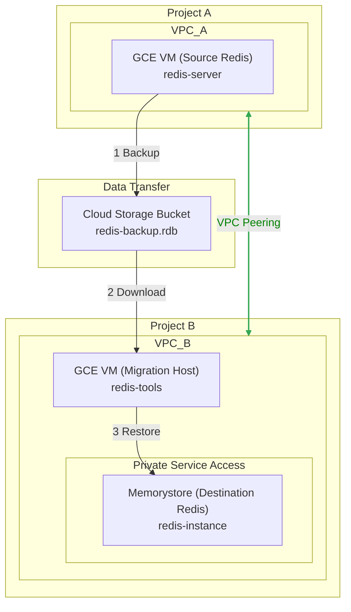

# GCP Redis 实例跨项目迁移方案

本文档旨在为 Google Cloud Platform (GCP) 环境下，将 Redis 实例从一个项目（项目 A）平滑迁移至另一个项目（项目 B）提供一套完整、安全且高效的解决方案。方案重点关注数据完整性、服务连续性，并利用 GCP 的私有网络能力完成迁移。

## 1. 核心挑战与解决方案

- **挑战**: Redis 实例（无论是自建于 GCE 还是使用 Memorystore）通常仅通过私有 IP 提供服务，无法直接通过公网访问。跨项目迁移必须建立私有网络通道。
- **核心方案**: 利用 **VPC 网络对等互连 (VPC Network Peering)** 来打通两个项目所属 VPC 之间的私有网络，然后通过一个临时的 GCE "迁移中转机" 来完成数据的备份与恢复。

## 2. 迁移架构

在执行迁移前，我们需要构建如下的临时网络架构。迁移完成后可以拆除。



## 3. 迁移步骤详解

整个迁移过程分为四个主要阶段：网络准备、目标环境准备、数据迁移和应用切换。

### 阶段一：网络准备

此阶段的目标是建立项目 A 和项目 B 之间的私有网络连接。

1.  **创建 VPC 对等互连**:
    *   在项目 A 中，向项目 B 发起对等互连请求。
    *   在项目 B 中，接受来自项目 A 的请求。

    **项目 A 操作 (gcloud):**
    ```bash
    # 设置当前项目为 A
    gcloud config set project PROJECT_A_ID

    # 创建对等连接请求
    gcloud compute networks peerings create peering-a-to-b \
        --network=VPC_A_NAME \
        --peer-project=PROJECT_B_ID \
        --peer-network=VPC_B_NAME
    ```

    **项目 B 操作 (gcloud):**
    ```bash
    # 设置当前项目为 B
    gcloud config set project PROJECT_B_ID

    # 创建对等连接（接受请求）
    gcloud compute networks peerings create peering-b-to-a \
        --network=VPC_B_NAME \
        --peer-project=PROJECT_A_ID \
        --peer-network=VPC_A_NAME
    ```

2.  **配置防火墙规则**:
    确保 VPC Peering 建立后，双方的防火墙允许 Redis 流量通过。您需要在两个项目中都创建相应的防火墙规则，允许来自对方 VPC CIDR 范围的 TCP 6379 端口流量。

    **示例 (在项目 B 中创建，允许项目 A 访问):**
    ```bash
    gcloud compute firewall-rules create allow-redis-from-project-a \
        --network=VPC_B_NAME \
        --allow=tcp:6379 \
        --source-ranges=VPC_A_SUBNET_CIDR \
        --description="Allow Redis traffic from Project A VPC"
    ```
    *请将 `VPC_A_SUBNET_CIDR` 替换为项目 A 中 Redis 实例所在子网的实际 IP 地址范围。*

### 阶段二：目标环境准备

在项目 B 中创建新的 Redis 实例和用于迁移的中转服务器。

1.  **创建 Memorystore for Redis 实例**:
    这是我们的迁移目标。它将通过“专用服务访问连接”模式连接到您的 VPC B。

    ```bash
    gcloud redis instances create redis-instance \
        --size=10 \
        --region=REGION \
        --tier=STANDARD \
        --redis-version=REDIS_6_X \
        --network=projects/PROJECT_B_ID/global/networks/VPC_B_NAME \
        --project=PROJECT_B_ID
    ```
    *创建后，记下此实例的 **私有 IP 地址**，后续将用到。*

2.  **创建迁移中转 GCE**:
    在项目 B 的 VPC 中创建一个小型的 GCE 实例，用于执行数据导入操作。这个实例需要安装 `redis-tools`。

    ```bash
    gcloud compute instances create migration-host \
        --project=PROJECT_B_ID \
        --zone=ZONE \
        --machine-type=e2-small \
        --image-family=debian-11 \
        --image-project=debian-cloud \
        --subnet=VPC_B_SUBNET_NAME

    # SSH 连接到实例并安装 redis-tools
    gcloud compute ssh migration-host --project=PROJECT_B_ID
    # In the SSH session:
    sudo apt-get update
    sudo apt-get install -y redis-tools
    ```

### 阶段三：数据迁移 (核心)

这是迁移的核心步骤，我们采用“备份-传输-恢复”的策略。

1.  **在源 Redis (项目 A) 上创建备份**:
    连接到项目 A 的 Redis GCE 实例，执行 `BGSAVE` 命令在后台创建一个 RDB 快照文件。

    ```bash
    # 在源 Redis GCE 上执行
    redis-cli BGSAVE
    # BGSAVE 是异步的，可以通过 `LASTSAVE` 命令检查是否完成
    # 默认 RDB 文件通常保存在 /var/lib/redis/dump.rdb 或类似路径
    ```

2.  **将备份文件传输到 Cloud Storage**:
    创建一个 Cloud Storage 存储桶，并将 RDB 文件上传。

    ```bash
    # 在源 Redis GCE 上执行
    gsutil mb gs://your-redis-backup-bucket-unique-name
    gsutil cp /path/to/your/dump.rdb gs://your-redis-backup-bucket-unique-name/
    ```

3.  **在中转机 (项目 B) 上恢复数据**:
    *   首先，为中转机的服务账号授予访问 GCS 存储桶的权限。
    *   然后，在中转机上下载备份文件并导入到新的 Memorystore 实例。

    ```bash
    # 在中转机 (migration-host) 上执行
    # 1. 下载备份文件
    gsutil cp gs://your-redis-backup-bucket-unique-name/dump.rdb .

    # 2. 将数据导入到新的 Memorystore 实例
    #    这会清空目标实例现有数据，然后导入 RDB 文件中的数据
    cat dump.rdb | redis-cli -h MEMORSTORE_PRIVATE_IP --pipe
    ```
    *请将 `MEMORSTORE_PRIVATE_IP` 替换为阶段二创建的 Memorystore 实例的 IP 地址。`--pipe` 模式是最高效的批量导入方式。*

### 阶段四：应用切换与验证

1.  **安排停机窗口**:
    数据迁移（从备份到恢复完成）期间，任何写入源 Redis 的新数据都将丢失。因此，需要在最终同步前安排一个短暂的应用停机或只读窗口。
2.  **最终同步**: 在停机窗口开始时，重复**阶段三**的步骤，以捕获最新的数据。
3.  **更新应用配置**: 将所有连接 Redis 的应用程序的配置，从旧的 Redis IP 地址更新为项目 B 中新 Memorystore 实例的 IP 地址。
4.  **启动应用并验证**: 重新启动应用，并进行全面的功能和数据验证，确保一切正常。
5.  **清理资源**: 验证成功后，可以安全地关闭并删除项目 A 中的旧 Redis GCE 实例、项目 B 的迁移中转机，并根据需要解除 VPC Peering。

## 4. 方案总结

| 阶段 | 核心任务 | 主要工具/命令 | 注意事项 |
| :--- | :--- | :--- | :--- |
| **1. 网络准备** | 建立跨项目私有网络连接 | `gcloud compute networks peerings` | 防火墙需放行 Redis 端口 (TCP 6379) |
| **2. 目标环境准备** | 创建新的 Redis 实例和迁移主机 | `gcloud redis instances`, `gcloud compute instances` | 记录 Memorystore 的私有 IP |
| **3. 数据迁移** | 备份、传输、恢复数据 | `redis-cli BGSAVE`, `gsutil`, `redis-cli --pipe` | 需在停机窗口内执行最终同步 |
| **4. 应用切换** | 更新配置并验证 | 应用部署脚本 | 确保所有服务都指向新实例 |
| **5. 清理** | 删除临时资源 | `gcloud compute instances delete` | 确认无误后再删除旧实例和网络配置 |

通过遵循以上步骤，您可以实现一次可控、平滑且数据完整的 Redis 跨项目迁移。
