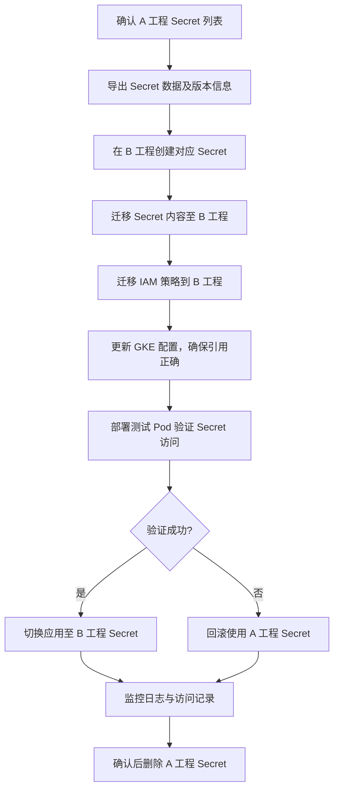

以下是一个 GCP Secret Manager 从项目 A 迁移到项目 B 的迁移计划，特别考虑了 GKE 中的依赖关系。

⸻

迁移计划

1. 前期准备
	•	确认 Secret 清单

`gcloud secrets list --project=A_PROJECT_ID`


	•	记录以下信息：
	•	Secret 名称及版本
	•	Secret IAM 权限绑定（哪些 Service Account 有访问权限）
	•	GKE 中使用的 Secret 绑定（如 Workload Identity 绑定的 Service Account）

⸻

2. 创建目标环境的 Secret
	•	在 B 工程中创建相同的 Secret 名称及版本：
```bash
gcloud secrets create SECRET_NAME \
  --replication-policy="automatic" \
  --project=B_PROJECT_ID
```


	•	迁移 Secret 数据：

```bash
gcloud secrets versions access latest --secret=SECRET_NAME \
  --project=A_PROJECT_ID \
  | gcloud secrets versions add SECRET_NAME --data-file=- \
  --project=B_PROJECT_ID
```


⸻

3. 迁移 IAM 权限
	•	获取 A 工程中的 IAM 策略：

`gcloud secrets get-iam-policy SECRET_NAME --project=A_PROJECT_ID`


	•	将策略应用到 B 工程：

`gcloud secrets set-iam-policy SECRET_NAME policy.json --project=B_PROJECT_ID`


⸻

4. GKE 相关配置修改
	•	Workload Identity：确认使用的 Service Account 是否已在 B 工程中存在，并绑定到 Secret Manager 的访问权限。
	•	Deployment YAML：
	•	检查 secretRef、envFrom、volumeMounts 是否使用了正确的 Secret 名称。
	•	如果使用 CSI Driver（secrets-store.csi.k8s.io），更新对应的 SecretProviderClass 指向 B 工程。

⸻

5. 测试与验证
	•	在 B 工程中部署一个测试 Pod 验证 Secret 是否可访问：
```bash
kubectl run test-pod \
  --image=google/cloud-sdk \
  --command -- sleep 3600
kubectl exec -it test-pod -- gcloud secrets versions access latest --secret=SECRET_NAME --project=B_PROJECT_ID

```


	•	确保应用服务无缝切换到新的 Secret。

⸻

6. 回滚与删除
	•	保留 A 工程的 Secret 一段时间作为回滚方案。
	•	确认迁移完全成功后，再清理 A 工程中的旧 Secret。

⸻

重点考虑事项
	1.	Secret 名称一致性
若名称不同，需要更新 GKE 的配置文件。
	2.	Service Account 权限迁移
确保 B 工程中的 Workload Identity 与 Secret Manager IAM 策略完全对应。
	3.	审计与合规
迁移后确认 Secret 的访问日志是否在 B 工程的 Cloud Audit Logs 中正常记录。
	4.	版本控制
确保所有版本（不是仅 latest）都迁移完成，必要时写脚本批量迁移。

⸻

是否需要我帮你写一个 自动迁移脚本（Bash 或 Python），可以批量把 A 工程的所有 Secret（含版本和 IAM 策略）迁移到 B 工程？

还是要一个 Mermaid 流程图 + 步骤执行脚本的完整方案？还是两者都要？

