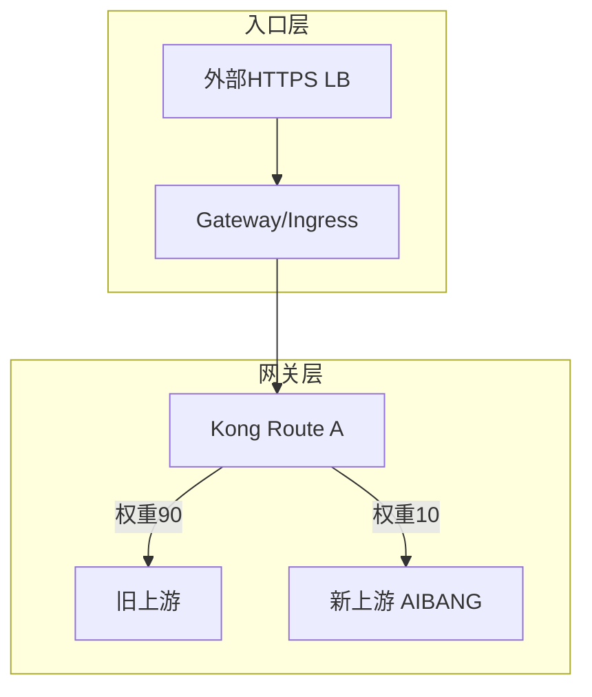
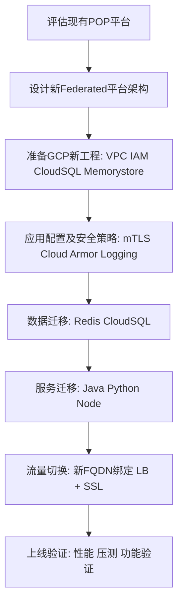
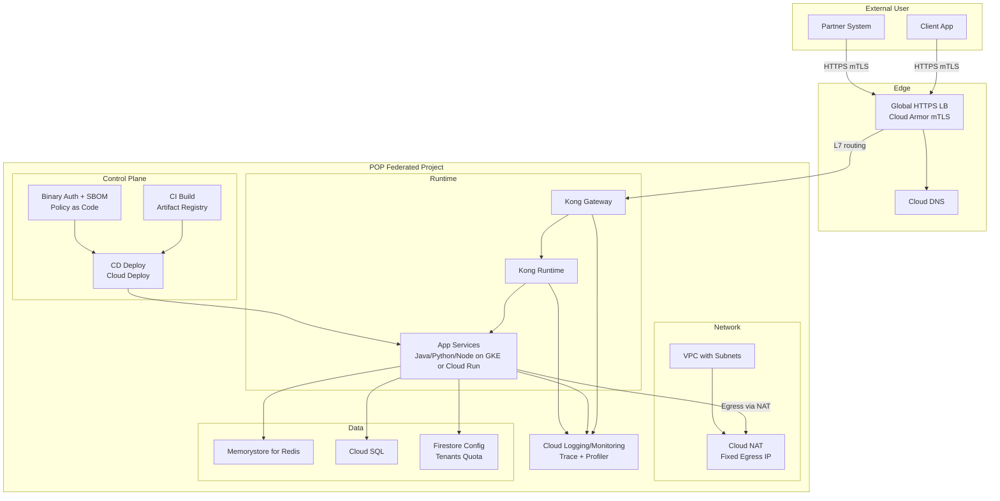
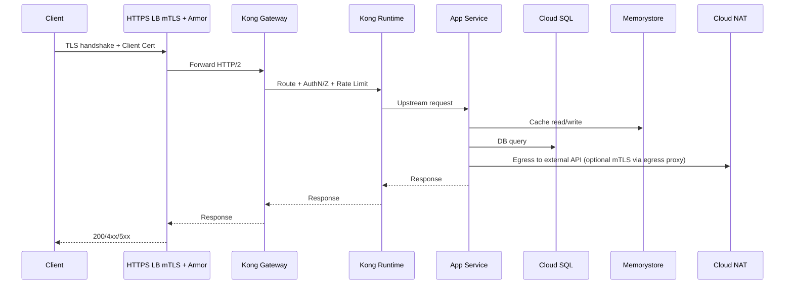
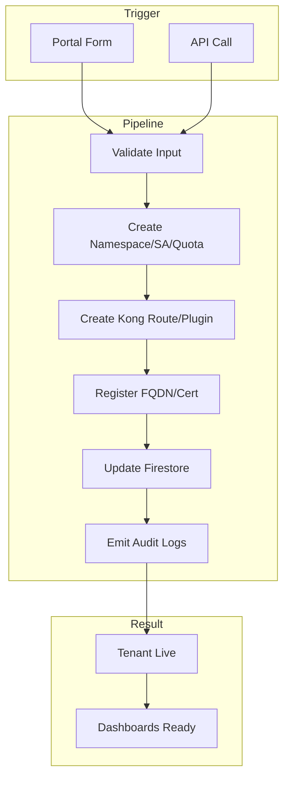
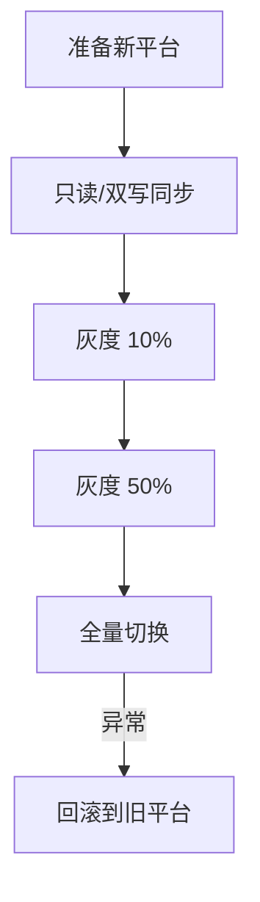

POP迁移方案

Overall Migration Principles
Everything must be based on the baseline standards of the AIBANG platform (network, IAM, certificates, gateway, monitoring, CI/CD, security policies).

POP
Project Level Prepare:
- [ ] PM apply new Project ==> 
- [ ] All concepts ==> mindmap 
- [ ] Build Which components ==> at new components ==> prepare the Terraform ==> 
    - [ ] POP components  ==> mapping ==> AIBANG components. 


- [ ] Public ingress FQDN ==> internal ingress FQDN ==> basing location path OR how to ingress 
- [ ] Need get all of the project list ==> apply view access ? 
    - [ ] Yes. UK first 
    - [ ] 
- [ ] Ingress / Egress proxy Using what ?
    - [ ] Nginx or squid or L3 NAT
- [ ] Using PSC ==> connect Application Project ==> PostgreSQL DB 
- [ ] When Onboarding to AIBANG need Define GBGF ?
- [ ] GCP Redis What is the purpose of this? 
- [ ] DNS ==> Cloud DNS ==> how to egress to Some of the third party's Domain
- [ ] Is it directly maintained when the new API name is signed?  

A平台比如我们称其为POP平台 也是运行在GCP平台的.
但是和我们平台的一些Flow并不一样.根据历史你应该知道我们是一个GCP的API Platform 一些架构应该也有了解 
比如我们有external,Internal的Flow都不一样
我们需要给安装一个新的GCP工程Federated的平台,参考我们的模式,当然不是完全照搬,但是我们是一个标准.
比如Component ==> Java Or Python ==> node ?
Redis ==> Cloud SQL ==> need save User data

AIBANG 平台 API 迁移大框架（GCP 上旧平台 → 新平台）

目标：在不影响业务的前提下，将旧平台 API 平滑迁移到新平台 AIBANG（以新平台标准为准），并在独立的新 GCP Project 中构建接管与清理流程。

⸻

一、总体迁移原则
	•	标准先行：一切以 AIBANG 平台规范为基线（网络、IAM、证书、网关、观测、CI/CD、安全策略）。
	•	双栈并行：新旧平台并行一段时间，灰度切流，验证 OK 再完成切换。
	•	可回滚：任一里程碑后都能快速回切，明确回滚路径与数据一致性策略。
	•	自动化与可追溯：基础设施 IaC、网关声明化、策略与证书自动化、日志与指标可追溯。
	•	最小变更面：优先“Lift & Shift + 最小重构”，必要时再做平台化适配改造。

⸻

二、阶段与里程碑

1）发现与基线核对（Inventory & Gap）
	•	盘点 API、域名、证书、QPS/TPS、配额、依赖外部 API、数据源、合规要求。
	•	新平台基线对齐：VPC、子网划分、NAT、DNS、私有访问、Cloud Armor、mTLS、证书 TrustConfig、Org Policy、VPC-SC。
	•	评估差异：Ingress/Gateway 模型、Kong 插件与路由策略、鉴权方式、观测方案、发布与回滚能力。

2）新项目落地与基础设施
	•	新建 GCP Project（遵循 AIBANG 命名和标签规范）。
	•	建 VPC、子网、Cloud NAT、FW 规则、Private DNS、PSC（如需对接托管服务）。
	•	证书与 Certificate Manager + TrustConfig、Cloud Armor 策略基线。
	•	观测基线：Cloud Logging/Monitoring、LogSink 到 BigQuery、告警策略、SLO。
	•	Artifact Registry、Binary Authorization、镜像扫描与发布准入。

3）平台与网关层
	•	GKE 基线：节点池、升级策略、PDB、HPA、PodDisruptionBudget、资源配额与配额上限。
	•	网络入口：外部 HTTPS LB（全站 HTTPS+mTLS 终止策略）、GKE Gateway/Ingress、NEG。
	•	Kong Gateway：声明化配置（decK/CRDs），上游服务、路由、插件（鉴权、速率限制、重试、熔断、超时）。
	•	流量灰度策略：DNS 权重、Kong traffic-split、Gateway API backend weight、Header/Path 条件路由。

4）应用适配与数据迁移
	•	容器规格与健康探针（liveness/readiness/startup）、资源 request/limit、JVM/连接池调优。
	•	配置与密钥：Secret Manager、Workload Identity、ConfigMap 分层环境配置。
	•	数据迁移：FireStore/CloudSQL/Spanner/BigQuery 的回填、双写/回放、校验与切换窗口。

5）灰度与切换
	•	影子流量或小流量灰度 → 金丝雀 → 分批扩大 → 全量切换。
	•	切换前检查清单：SLO、错误率、延迟、日志无异常、依赖可用性。
	•	回滚预案：路由回切、DNS 回权重、数据回退或补偿流程。

6）旧平台下线
	•	冻结发布、只读保护、长尾流量观测期。
	•	释放域名与证书绑定、回收 IP/LB、防火墙规则、服务账号、磁盘/快照、Key/Secrets。
	•	合规留存：日志、备份、成本/配额清理和锁定策略。

⸻

三、宏观流程图

graph TD;
    A[盘点与差异评估] --> B[新GCP项目与基础设施基线];
    B --> C[网关与入口配置 Kong GKE Gateway];
    C --> D[应用容器化与平台适配];
    D --> E[数据迁移与一致性策略];
    E --> F[灰度流量与金丝雀验证];
    F --> G[全量切换];
    G --> H[旧平台观测期与下线];


⸻

四、关键清单（精简版）

类别	要点	说明
网络	VPC/子网/NAT/PSC	与 AIBANG 标准一致，预留增长空间
安全	Cloud Armor、Org Policy、VPC-SC	入口防护、服务周界与策略约束
证书	HTTPS 证书与 mTLS TrustConfig	服务端证书轮换、客户端 CA 维护与指纹治理
身份	Workload Identity、SA 最小权限	人/机分离，最小权限，审计必开
网关	Kong 声明化、限流、重试、熔断	平滑迁移、灰度控制与快速回滚
观测	日志、指标、追踪、LogSink	SLO/告警，回溯与容量规划
发布	CI/CD、Binary Auth、镜像扫描	阶段门禁，防误发与风险控制
数据	回填、双写/回放、校验、窗口	RPO/RTO 约束与补偿策略
性能	HPA、PDB、资源界限、连接池	升级无感、抗抖动、避免 502/连接拒绝
成本	配额/预算告警、日志分流归档	降本与容量上限控制


⸻

五、流量迁移策略（推荐做法与可选项）

	•	推荐：在 Kong 层使用 traffic-split 或基于 Gateway API 的 backendRef weight 实现权重切分；支持按 Header/Path 做定向金丝雀（如 X-Canary: 1）。
	•	备选：DNS 权重（切换慢、缓存不可控）、客户端白名单定向路由、灰度用户组。

⸻

六、Kong 声明化与路由示例（精简）

# 权重切分示例（基于 Kong upstream target 或 Gateway API BackendRef weight）
# 这里给出 conceptual 片段，请按实际网关版本与CRD实现

注：生产中建议使用 decK 管理全量声明，配合 GitOps 审核与回滚。

⸻

七、GKE 部署与高可用要点


关键：maxUnavailable: 0 + PDB + 正确的 readinessProbe 防止滚更期间 502 与连接拒绝；结合连接池与超时、重试策略。

⸻

八、mTLS 与证书治理要点（AIBANG 标准）
	•	服务端证书：采用 Certificate Manager；到期前 30–60 天轮换；LB 侧热切换。
	•	客户端信任：TrustConfig 管理多个 CA；按租户/客户端分组；指纹文件化管理（GCS + JSON/YAML），脚本增量更新。
	•	迁移节奏：先将新客户端 CA 加入 TrustConfig → 验证通过 → 再更新服务端证书；避免客户端中断。

⸻

九、数据迁移套路（按类型）

存储	策略	校验
Firestore	双写或迁移窗口只读 + 回放变更	文档数、关键字段 checksum、抽样比对
Cloud SQL	DMS/原生复制 + 窗口切换	表级 count、主键范围、延迟 < RPO
Spanner	导出+回放或 CDC	版本时间戳比对、延迟
BigQuery	视图过渡、分区表回填	表行数、分区范围、查询结果一致性


⸻

十、发布与准入
	•	Artifact Registry + Binary Authorization：分环境策略与豁免流程。
	•	镜像扫描：结合 GCP 原生与现有 SAST/DAST；阻断高危。
	•	CI/CD：多环境流水线、自动化 Smoke/E2E、回滚按钮。

⸻

十一、切换与回滚验收清单（节选）

检查项	通过标准
延迟/错误率	P50/P95 不劣于旧平台，错误率 < 阈值
鉴权/配额	鉴权成功率、限流策略符合预期
观测/日志	指标齐全、日志落地 BigQuery、告警有效
依赖可用性	外部 API 成功率与时延在基线内
回滚演练	业务不感知，RTO 满足要求


⸻

十二、旧平台下线步骤（概览）

# 1) 冻结变更，开启长尾观测
# 2) 关闭入口流量（DNS/LB 回收）
# 3) 回收GCP资源（IP/LB/防火墙/SA/秘钥/磁盘/快照/Topics/Subs）
# 4) 导出合规留存（日志/备份/账单）
# 5) 项目封存或删除（遵循组织策略与审批）


⸻

十三、迁移工单模板（示例）

title: AIBANG 平台 API 迁移批次 N
owners:
  - platform: AIBANG-team
  - app: team-xyz
windows:
  freeze_start: 2025-09-10T02:00:00Z
  cutover_start: 2025-09-12T02:00:00Z
risk:
  rto: 10m
  rpo: 0m
checks:
  - slo_ok
  - error_rate_below_threshold
  - cert_trustconfig_updated
  - canary_10_percent_ok
rollback:
  steps:
    - kong_route_weight: old=100 new=0
    - dns_weight: old=100 new=0
    - data_compensation: replay_queue


⸻

十四、你可以按此顺序开工
	1.	清单与差异：完成盘点表与差异评审，冻结基线。
	2.	新项目落地：一键 IaC 部署网络、安全、观测与网关基线。
	3.	应用适配：容器规范、探针、资源、连接与超时、Kong 路由与插件。
	4.	数据方案：确定各存储迁移模型与校验方式，演练。
	5.	灰度计划：按租户/流量百分比逐步扩大，完成验收。
	6.	全量切换：切换窗口、监控与回滚保护。
	7.	下线与留存：清理旧平台、归档与合规收尾。

需要我把上述步骤细化为 分周计划 + 责任人 + 输出物模板，或生成 decK/K8S/Gateway 的一套起步仓库结构吗？我可以直接给出可拷贝的 Markdown 与 YAML 清单。

以下是基于 GAP 分析与已知架构要素整理的 迁移注意事项分类清单，可作为 HLD 和 Checklist 的输入参考。

⸻

1. 基础设施与计算资源
	•	运行环境确认
	•	Java、Python、Node.js 服务运行位置：GKE、GCE、Cloud Run 或混合部署？
	•	是否需要容器化改造，或引入 Service Mesh（Istio）增强流量管理？
	•	节点安全配置
	•	GKE 节点版本、补丁策略、加固方案。
	•	节点间 TLS（mTLS）通信是否启用，证书颁发及轮换策略是否明确？

⸻

2. 网络与流量管理
	•	Ingress 流量管理
	•	是否通过 HTTPS LB 统一入口？是否需要支持 mTLS 校验？
	•	是否需要 Cloud Armor、WAF、Rate Limiting 保护策略？
	•	Egress 流量管理
	•	当前是否存在 API/工作负载可直接访问公网的情况？
	•	是否计划通过 Private Google Access、VPC Service Controls 控制出口流量？
	•	租户隔离策略
	•	是否已定义 Network Policy 以限制不同租户间通信？

⸻

3. 数据管理
	•	Redis 使用情况
	•	Redis 用于缓存、Session，还是持久化用户数据？
	•	是否存在持久化 Key 及敏感信息存储？
	•	Cloud SQL 数据迁移
	•	是否存在用户数据？是否需 DMS（Database Migration Service）迁移？
	•	数据合规与加密
	•	是否需开启 CMEK（Customer-Managed Encryption Keys）？
	•	是否存在 Firestore、BigQuery 关联数据？

⸻

4. 安全与密钥管理
	•	证书管理
	•	是否存在 mTLS 证书签发与轮换机制？
	•	是否需要 AIBANG 平台统一管理 CA 证书？
	•	Secret 管理
	•	是否使用 POP Secret Manager？是否迁移到 AIBANG 统一 Secret 管理系统？

⸻

5. 命名规范（Naming Convention）
	•	是否有统一标准？
	•	命名是否包含：
	•	环境（dev/stage/prod）
	•	服务标识
	•	租户标识
	•	是否需与 AIBANG 平台命名标准对齐？

⸻

6. CICD 与部署管控
	•	是否已引入 ArgoCD 或 GitOps 流程？
	•	部署前是否存在自动化安全扫描及资源限制校验（CPU/Mem）？
	•	是否需要蓝绿或金丝雀发布策略以降低迁移风险？

⸻

7. API 治理与网关管理
	•	Kong Gateway 的部署位置是否需调整到 Federated 平台内部？
	•	API 是否需要强制 AuthN & AuthZ 机制？
	•	现有 Kong 插件与 AIBANG 插件是否存在功能缺口？

⸻

8. 监控与告警
	•	是否需要统一迁移至 AIBANG 监控体系（Cloud Logging + Cloud Monitoring + Trace）？
	•	API 级别的指标采集与告警规则是否一致？

⸻

9. 运营与计费
	•	是否需要定义租户 SLA？
	•	是否需要引入计费模型？如果是，需在 API 层面埋点以统计使用量。

⸻

10. DNS 与服务发现
	•	是否使用 GKE 内部 DNS 或 Cloud DNS 进行服务发现？
	•	新平台是否需要申请新的 FQDN 并配置 SSL？

⸻

要不要我 整理成一个高层架构设计（HLD）章节目录 + 迁移 Checklist 表格，每个 Checklist 条目带有“完成状态（√/×）”和“负责人”列？
还是先出 迁移风险清单（Risk Register） 帮助团队评估？

以下是一个针对 POP 平台迁移到新的 Federated GCP 工程 的完整方案，结合现有的 API Platform (aibang) 标准及安全要求，包含流程、关键步骤及必要细节。

⸻

1. 评估阶段（Assessment）

1.1 现有 POP 平台架构分析
	•	计算资源：Java、Python、Node.js 服务运行在何处？（GKE、GCE 或 Cloud Run）
	•	数据存储：
	•	Redis：是否用于缓存、Session 或队列？
	•	Cloud SQL：是否需要迁移用户数据？
	•	是否涉及 Firestore 或 BigQuery？
	•	网络流量 Flow：
	•	External Flow（外部用户/系统访问）
	•	Internal Flow（平台内服务间调用）
	•	安全需求：
	•	是否已使用 mTLS？
	•	是否需要 Cloud Armor 或其他安全策略？
    •	GKE dns ? cloud Run 
    •   naming coversion 	

1.2 差距评估
	•	比较 aibang 平台与 POP 平台的差异点：
	•	流量控制方式（Ingress、Egress）
	•	API 认证授权方式
	•	日志、监控、告警机制
	•	是否需要调整 POP 的架构以符合 aibang 标准。

⸻

2. 新平台设计（Federated GCP Project Setup）

2.1 GCP 资源规划
	•	新工程使用新的 EMID（Environment ID）。
	•	分配 VPC、子网、路由、NAT、负载均衡等。
	•	定义 IAM 权限模型，确保 Federated 用户的访问安全。

2.2 流量接入设计
	•	Ingress：
	•	使用 HTTPS Load Balancer + mTLS + Cloud Armor。
	•	是否保留原有客户端证书校验机制？
	•	Egress：
	•	使用 Cloud NAT 控制出口 IP。
	•	需考虑 VPC Service Controls 及 Private Google Access。

2.3 服务组件部署
	•	选择合适的运行环境：
	•	Java/Python/Node → 建议 GKE 或 Cloud Run。
	•	数据存储设计：
	•	Redis：迁移至 Memorystore。
	•	Cloud SQL：使用 Database Migration Service 迁移用户数据。
	•	日志、监控、告警：统一接入 Cloud Logging & Monitoring。

⸻

3. 迁移流程（Migration Plan）


⸻

4. 自动化 Onboarding 与后续管理

4.1 自动化 Onboarding 流程
	•	新用户注册 → 触发 CI/CD Pipeline → 自动创建 API Gateway 配置 & 部署资源。
	•	API 信息写入 Firestore，支持后续配额管理及计费。

4.2 API 特性同步
	•	确保每个 API 都支持：
	•	认证与授权策略（JWT、mTLS、API Key）
	•	限流与熔断（Kong Gateway Plugin）
	•	日志追踪（Cloud Logging + Trace）

⸻

5. 迁移后步骤

阶段	任务	责任人	工具/产品
评估	平台架构 & 差距分析	架构师	Cloud Asset Inventory
设计	新工程网络 & 安全架构	GCP 平台工程师	VPC、LB、IAM
部署	服务 & 数据迁移	DevOps & DBA	DMS、Memorystore
切换	新 FQDN 上线	SRE	Cloud DNS、SSL
监控	日志监控告警接入	SRE & DevOps	Cloud Logging、Monitoring


⸻

6. 建议的 Pipeline 设计
	•	阶段化迁移：先部署非关键服务 → 验证 → 逐步迁移核心 API。
	•	蓝绿/金丝雀发布：在 LB 层支持流量分流，避免一次性切换。
	•	回滚策略：保留旧 POP 平台，确保切换失败可快速回退。

⸻

要不要我帮你 出一份更详细的迁移 Checklist（含命令行和 YAML 示例），还是要先出一份 高层架构设计文档（HLD） 给团队评估？
你希望下一步输出 详细步骤表 还是 架构文档草稿？


# Design
# **POP → Federated GCP 高层架构设计文档（HLD）与迁移 Checklist**

  

> 目标：将 **POP 平台**迁移至**新的 Federated GCP 工程**，在对齐 **AIBANG 标准**的同时，支持外部与内部双流量路径、mTLS、自动化 Onboarding、多语言运行时（Java/Python/Node）、状态数据迁移（Redis→Memorystore、Cloud SQL）、可观测性与合规。

---

## **1. 范围与非目标**

- **范围**：新工程搭建、网络与安全架构、入口/出口设计、运行时与数据层、自动化 Onboarding、迁移与回滚方案、FQDN 切换。
    
- **非目标**：业务代码改造细节、第三方 SaaS 深度对接实现。
    

---

## **2. 目标架构（Logical View）**



---

## **3. 关键设计决策**

  

### **3.1 环境与命名规范（EMID）**

- **工程命名**：pop-{env}-{emid}（例：pop-prod-emid123）
    
- **Label 约定**：env, emid, system=pop, owner, pii={yes|no}，全栈资源继承。
    
- **分层结构**：多 Project（隔离 blast radius），Shared VPC 可选。
    

  

### **3.2 入口（Ingress）**

- **Global HTTPS LB** 统一入口，域名由 **Cloud DNS** 管理。
    
- 支持 **mTLS**（Certificate Manager + TrustConfig），保留自定义客户端主题检查（在 Edge 或 Kong 层实现）。
    
- **Cloud Armor**：WAF、IP/Geo/ASN、Bot、速率限制（平台统一策略 + Team 细化）。
    

  

### **3.3 出口（Egress）**

- **Cloud NAT** 固定出口 IP，满足对端白名单需求。
    
- **Private Google Access** 打开，控制对 Google APIs 的私有访问。
    
- 若需要对外 **mTLS 客户端认证**：在服务侧使用 **Egress Proxy（Envoy/Nginx）** 统一出站，集中证书管理与轮换。
    

  

### **3.4 运行时选型**

- **首选 GKE（Autopilot/Standard）**：统一 Sidecar、HPA、PDB、灰度流量等能力；或按服务特性选 **Cloud Run**（冷启动小、自动缩放）。
    
- **API 网关**：Kong Gateway + Kong Runtime（与现有 AIBANG 模式对齐）。
    

  

### **3.5 数据层**

- **Redis → Memorystore**（Key/TTL/分片模型评估）。
    
- **Cloud SQL**（MySQL/Postgres），通过 **DMS** 做不停机迁移（最小化切换窗口）。
    
- **配置与租户信息**：Firestore（Quota、租户元数据、证书指纹等）。
    

  

### **3.6 可观测性与合规**

- **全链路**：Cloud Logging、Metrics、Trace（OpenTelemetry）、Error Reporting。
    
- **制品与部署**：Artifact Registry、SBOM、Binary Authorization（阻断未签名镜像）、Cloud Deploy。
    
- **安全合规**：VPC-SC（敏感项目）、CMEK（需要时）、最小化 IAM。
    

---

## **4. 外部/内部流量 Flow（Detail）**



---

## **5. 自动化 Onboarding（Tenant & API）**

  

### **5.1 目标**

- POP 新用户或新 API **自助/半自助**接入：一键创建命名空间、SA、配额、Kong 路由、证书指纹、监控告警、Quota/计费元数据。
    



### **5.2 Onboarding 输出物**

- 命名空间、RBAC、ResourceQuota、NetworkPolicy
    
- Kong Route/Service/Consumer/Key-Auth/JWT/mTLS
    
- Firestore 文档：tenants/{id}, apis/{id}
    
- Cloud DNS 记录 & 证书任务
    
- 监控：SLO、告警策略、看板（Looker Studio/Cloud Monitoring）
    

---

## **6. 迁移策略**

- **双写/回写**或只读迁移策略按业务评估。
    
- **灰度**：基于 **Gateway API HTTPRoute 权重**做流量按比例切换。
    
- **回滚**：保留旧 POP 入口与流量回退路径；数据层保护点一致性。
    



---

## **7. 样例与参考片段**

  

### **7.1 GKE 基础与网络（示例）**

```
# 启用常用API
gcloud services enable compute.googleapis.com container.googleapis.com \
  certificatemanager.googleapis.com networkservices.googleapis.com \
  cloudkms.googleapis.com monitoring.googleapis.com logging.googleapis.com \
  dns.googleapis.com redis.googleapis.com sqladmin.googleapis.com

# VPC + Subnet + NAT
gcloud compute networks create pop-net --subnet-mode=custom
gcloud compute networks subnets create pop-subnet \
  --network=pop-net --range=10.10.0.0/20 --region=us-central1
gcloud compute routers create pop-nat-router --network=pop-net --region=us-central1
gcloud compute routers nats create pop-nat --router=pop-nat-router \
  --auto-allocate-nat-external-ips --nat-all-subnet-ip-ranges --region=us-central1

# GKE Autopilot（或 Standard）
gcloud container clusters create-auto pop-cluster \
  --region=us-central1 --release-channel=regular \
  --logging=SYSTEM,WORKLOAD --monitoring=SYSTEM \
  --labels=system=pop,env=prod,emid=emid123
```

### **7.2 Gateway API 灰度与路由（示例）**

```yaml
apiVersion: gateway.networking.k8s.io/v1
kind: Gateway
metadata:
  name: pop-external-gw
  namespace: gateway-system
  labels:
    system: pop
spec:
  gatewayClassName: gke-l7-global-external-managed
  listeners:
  - name: https
    protocol: HTTPS
    port: 443
    tls:
      mode: Terminate
      certificateRefs:
      - kind: Secret
        name: tls-pop-cert # 由 cert-manager 或外部导入
---
apiVersion: gateway.networking.k8s.io/v1
kind: HTTPRoute
metadata:
  name: pop-route
  namespace: gateway-system
spec:
  parentRefs:
  - name: pop-external-gw
  hostnames:
  - api.pop.example.com
  rules:
  - matches:
    - path:
        type: PathPrefix
        value: /v1
    backendRefs:
    - name: svc-v1
      port: 8080
      weight: 90
    - name: svc-v2
      port: 8080
      weight: 10
```

> 注：mTLS 若在 Edge 执行，按平台配置 Certificate Manager + TrustConfig；若在网关层执行，在 Kong 启用 mtls-auth/client_certificate 验证。

  

### **7.3 Kong mTLS 与限流（示例）**

```
_format_version: "3.0"
services:
  - name: pop-svc
    url: http://svc-v1.default.svc.cluster.local:8080
    routes:
      - name: pop-route
        paths: ["/v1"]
        protocols: ["https"]
plugins:
  - name: acl
    config:
      allow: ["tenant-abc"]
  - name: rate-limiting
    config:
      minute: 600
      policy: local
  - name: mtls-auth
    config:
      ca_certificates:
        - |-
          -----BEGIN CERTIFICATE-----
          MIID...
          -----END CERTIFICATE-----
      allow_without_client_cert: false
consumers:
  - username: tenant-abc
    acls:
      - group: tenant-abc
```

### **7.4 Memorystore 与 Cloud SQL（示例声明）**

```yaml
apiVersion: apps/v1
kind: Deployment
metadata:
  name: app-v1
spec:
  replicas: 2
  selector:
    matchLabels: { app: app-v1 }
  template:
    metadata:
      labels: { app: app-v1 }
    spec:
      containers:
      - name: app
        image: us-central1-docker.pkg.dev/pop-prod-emid123/app/app:v1.0.0
        env:
        - name: REDIS_HOST
          value: 10.10.5.3  # 或使用 Private IP + ServiceEntry/ConfigMap
        - name: DB_HOST
          value: 10.10.6.5  # Cloud SQL Private IP
        - name: DB_USER
          valueFrom:
            secretKeyRef: { name: db-secret, key: user }
        - name: DB_PASS
          valueFrom:
            secretKeyRef: { name: db-secret, key: pass }
        readinessProbe:
          httpGet: { path: /healthz, port: 8080 }
          initialDelaySeconds: 5
          periodSeconds: 5
        resources:
          requests: { cpu: "250m", memory: "512Mi" }
          limits: { cpu: "1", memory: "1Gi" }
---
apiVersion: policy/v1
kind: PodDisruptionBudget
metadata:
  name: app-v1-pdb
spec:
  minAvailable: 1
  selector:
    matchLabels: { app: app-v1 }
```

### **7.5 Certificate Manager TrustConfig（示例，指纹纳管）**

```
# 导入/更新信任CA（示例）
gcloud certificate-manager trust-configs create pop-trust \
  --location=global \
  --trust-store=file:///path/to/ca_bundle.pem

# 指纹JSON结构（用于自动化去重/增量）
cat > ca-fingerprints.json <<'JSON'
{
  "cas": [
    {
      "name": "partnerA-root",
      "sha256": "cafe...beef",
      "expires": "2030-12-31"
    }
  ]
}
JSON
```

---

## **8. FQDN 与切换策略**

- **准备**：新 FQDN 申请/证书签发、DNS TTL 降至 60s、LB 健康检查稳定。
    
- **灰度**：HTTPRoute 按权重 10%→50%→100%。
    
- **切换**：Cloud DNS 更新记录 → 监控错误率/SLO。
    
- **回滚**：保留旧记录与路由策略，单命令回切；数据库在切换窗口内冻结 DDL。
    

---

## **9. 迁移 Checklist（含前/中/后与回滚）**

  

### **9.1 准备阶段**

- 创建新 GCP 工程并绑定 Billing，应用 org-policy 与基础配额
    
- 启用所需 API（Compute/Container/SQL/Redis/DNS/Cert Manager/Logging/Monitoring 等）
    
- VPC、子网、Cloud NAT、Private Google Access
    
- GKE 集群与节点池（或 Cloud Run 服务）
    
- Artifact Registry、Cloud Build/Cloud Deploy、Binary Authorization 策略
    
- Cloud SQL（实例、网络、用户、备份与高可用）
    
- Memorystore（容量、区域、高可用）
    
- Certificate Manager：证书与 TrustConfig（按租户或场景分组）
    
- Cloud Armor 策略与基线 WAF 规则集
    
- Cloud DNS 记录与 TTL 策略
    
- 日志、指标、Trace、SLO、告警基线
    
- RBAC、命名空间、ResourceQuota、NetworkPolicy 基线
    
- Kong Gateway/Runtime 与基础插件（Auth、限流、观测）
    

  

### **9.2 数据迁移**

- 盘点 Redis 数据模型（热键、TTL、Eviction），确认可迁移性
    
- 建立 Redis 同步或分阶段切换计划（读写路径与一致性）
    
- 评估 Cloud SQL 架构（索引、连接池、最大连接数、慢查询）
    
- 使用 DMS 做初始全量 + 增量复制（验证延迟/冲突处理）
    
- 迁移前最后一次一致性校验与只读窗口评估
    

  

### **9.3 应用迁移与验收**

- CI/CD 打包签名，镜像入库 + SBOM
    
- 部署至新环境，完成健康检查、自检
    
- 压测：QPS、P99、内存曲线、GC 与 HPA 触发
    
- 安全扫描：镜像、依赖、端口、出站访问清单
    
- 演练：灰度 10%→50%→100%，验证可观测性与告警
    

  

### **9.4 FQDN 切换**

- 降低 TTL，确认新 LB 与证书状态 Active
    
- 切换 DNS 记录，监控 4xx/5xx 与延迟
    
- 客户端证书兼容性与失败样本回收
    

  

### **9.5 上线后**

- 错误预算与 SLO 看板运行一周
    
- 成本回顾（NAT egress、LB、SQL、Redis、日志指标）
    
- 清理遗留与文档封版
    

  

### **9.6 回滚预案**

- 旧 POP 保持热备，DNS 回切机制
    
- 应用双活或冷备回退说明
    
- 数据回滚点：Cloud SQL PITR、备份集；Redis 暂存策略
    

---

## **10. 环境/组件清单示例表**

|**api_name**|**env**|**region**|**runtime**|**ingress**|**mTLS**|**egress_ip**|**redis_tier**|**sql_ha**|**obs_pack**|
|---|---|---|---|---|---|---|---|---|---|
|user|prod|us-central1|GKE|HTTPS GLB|yes|static|standard|yes|logging+metrics+trace|
|order|prod|us-central1|GKE|HTTPS GLB|yes|static|standard|yes|logging+metrics+trace|
|report|stage|us-central1|Run|HTTPS GLB|opt|static|basic|no|logging+metrics|

---

## **11. 自动化脚本与接口（片段）**

  

### **11.1 Onboarding（命名空间、配额、Kong 路由）**

```bash
TENANT=tenant-abc
NS=pop-$TENANT

# 命名空间与配额
kubectl create ns $NS
kubectl -n $NS apply -f - <<'YAML'
apiVersion: v1
kind: ResourceQuota
metadata: { name: rq-default }
spec:
  hard:
    requests.cpu: "4"
    requests.memory: "8Gi"
    limits.cpu: "8"
    limits.memory: "16Gi"
YAML

# Kong 路由（Kong Admin API 示例）
curl -sS -X POST http://kong-admin.kong:8001/services \
  --data name=$TENANT-svc \
  --data url=http://$NS.svc.cluster.local:8080
curl -sS -X POST http://kong-admin.kong:8001/services/$TENANT-svc/routes \
  --data name=$TENANT-route \
  --data paths[]="/$TENANT"
```

### **11.2 Firestore 写入（租户元数据）**

```json
{
  "tenant_id": "tenant-abc",
  "fqdn": "api.pop.example.com",
  "path_prefix": "/tenant-abc",
  "quota": { "rps": 100, "burst": 200 },
  "mtls": { "required": true, "trusted_fps": ["cafe...beef"] },
  "created_at": "2025-08-26T00:00:00Z",
  "owner": "team-x"
}
```

---

## **12. 风险与缓解**

- **证书信任链/客户端兼容**：提前收集多终端 UA，灰度阶段扩大采样与失败日志。
    
- **数据库热点与连接池**：引入连接池中间件，限制并发，慢查询剖析优化。
    
- **灰度策略误配**：所有 Route/Weight 变更走 PR + 审批 + 回滚模板。
    
- **出站白名单**：集中 Egress Proxy，证书与 IP 白名单统一治理。
    
- **成本**：日志指标采样/路由，SQL/Redis 容量与高可用按需。
    

---

## **13. 附录：团队分工（RACI）**

|**工作项**|**A 架构**|**P 平台**|**S SRE**|**D Dev**|**Sec 安全**|**DBA**|
|---|---|---|---|---|---|---|
|目标架构/HLD|R|C|C|I|C|I|
|VPC/LB/NAT|C|R|C|I|C|I|
|GKE/Run 基础|C|R|C|I|I|I|
|Kong 与流量策略|C|R|C|I|C|I|
|证书与 mTLS|C|R|C|I|R|I|
|Cloud Armor/WAF|I|R|C|I|R|I|
|数据迁移（SQL/Redis）|I|C|I|I|I|R|
|可观测性|C|R|R|I|I|I|
|Onboarding 自动化|C|R|C|C|I|I|
|灰度/切换与回滚|C|R|R|I|I|C|

---

# **交付物清单**

- 本 HLD 文档（架构与设计）
    
- 迁移 Checklist（含前/中/后与回滚）
    
- 示例 YAML / Bash 片段（可直接复用并扩展）
    
- Onboarding 数据结构与自动化步骤
    

  

> 需要我把以上内容拆成**可执行的仓库结构**（/environments、/gateways、/apps、/onboarding、/ops-runbook），并补齐 Makefile 与 GitHub Actions/Cloud Build Pipeline 示例吗？我可以直接按你们 AIBANG 标准生成一套“开箱即用”的模板。