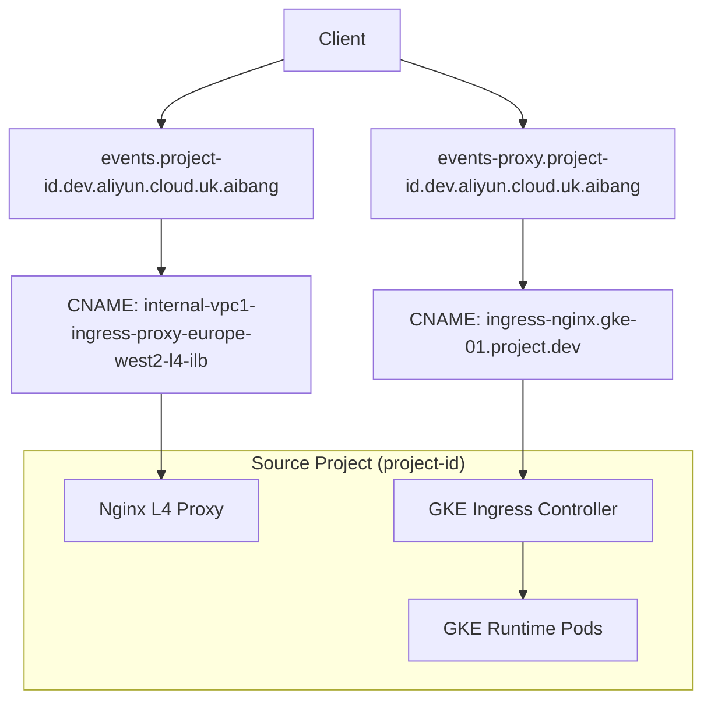
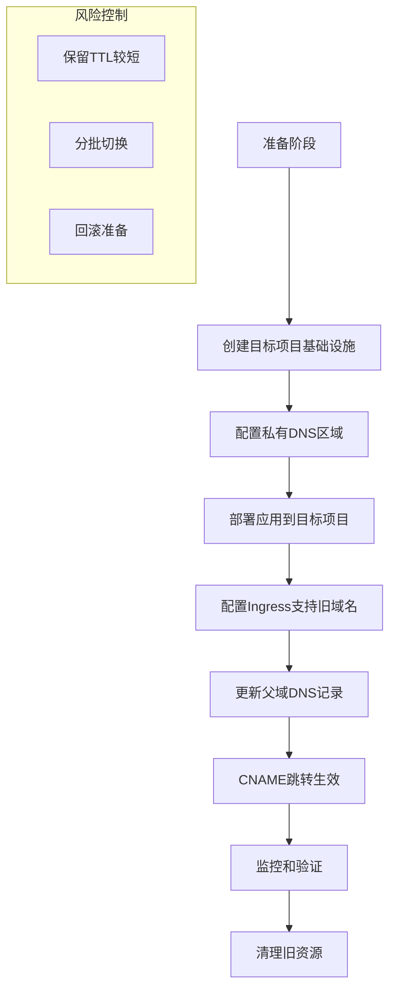
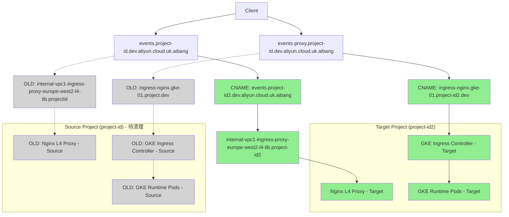
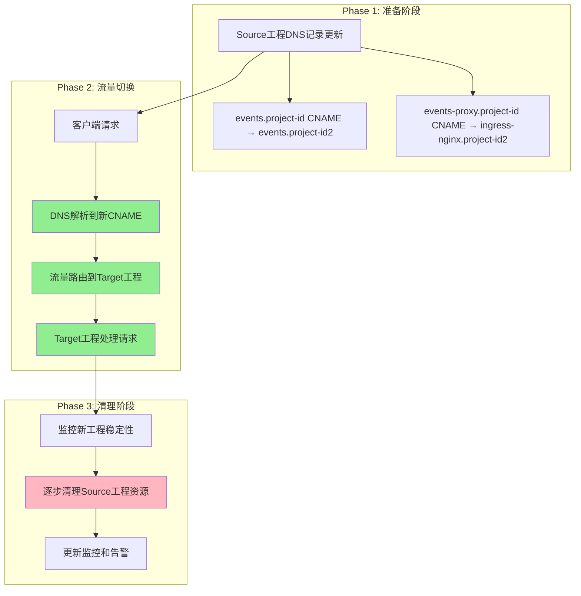
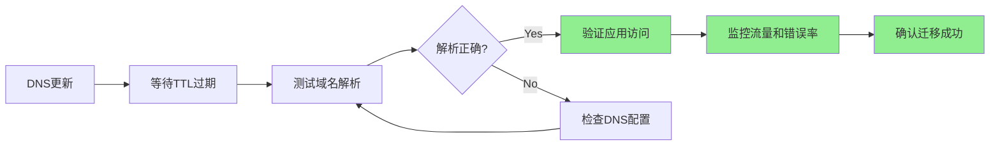
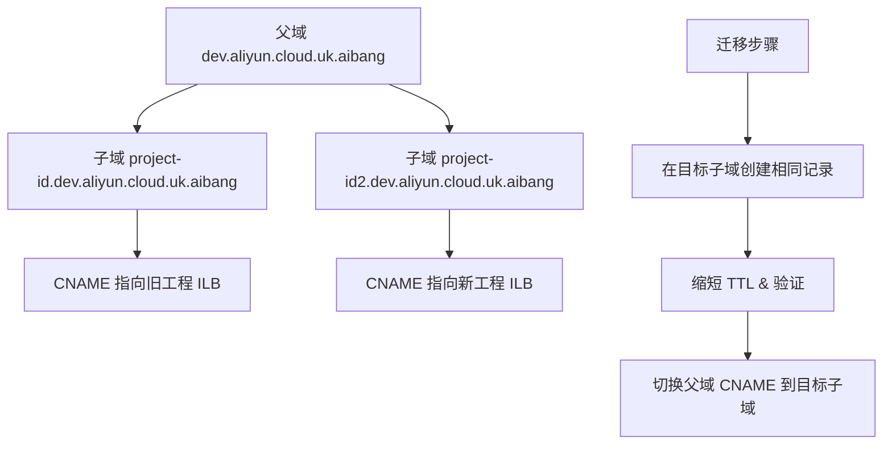
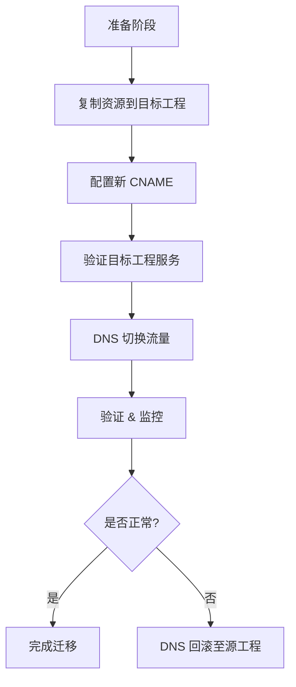
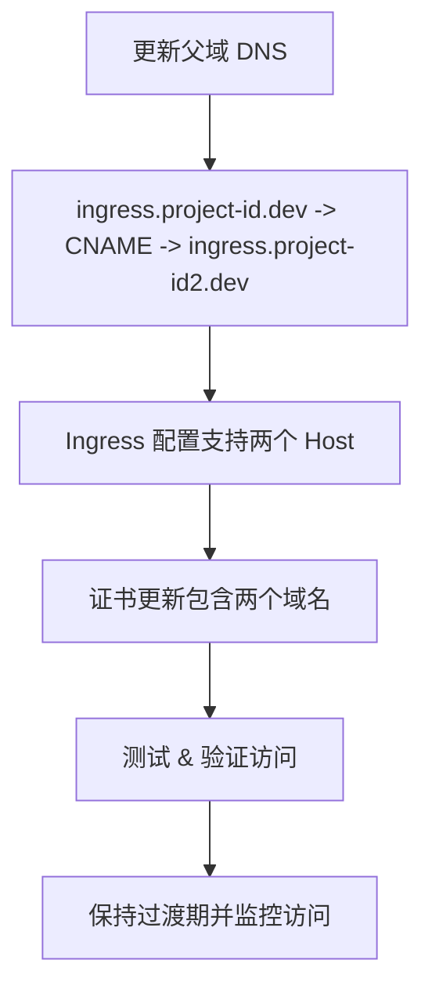

# Q
```
GCP里面的一个基础架构如下

Nginx proxy L4 dual network ==> GKE  [ingress control] ==> GKE  Runtime 

Source project 
events.project-id.dev.aliyun.cloud.uk.aibang ==> CNAME cinternal-vpc1-ingress-proxy-europe-west2-l4-ilb.projectid.dev.aliyun.cloud.uk.aibang.
events-proxy.project-id.dev.aliyun.cloud.uk.aibang ==> CNAME ingress-nginx.gke-01.project.dev.aliyun.cloud.uk.aibang.

如果我现在想把这个Source Project工程Migrate到另外一个工程,
比如我的target工程是project-id2.dev.aliyun.cloud.uk.aibang
那么我有什么办法能快速的把域名迁移到我的目的工程,或者如何确保原来的工作都是正常的

其实你可以看到我们的父域是
dev.aliyun.cloud.uk.aibang
然后对应的project都有自己的一些工程级别的域名
比如managed-zones分别为
project-id2.dev.aliyun.cloud.uk.aibang
project-id.dev.aliyun.cloud.uk.aibang

然后在这些managed-zones下面 我们配置的我说的那些泛解析的域名
比如我在project-id2里创建一个private的dns name project-id.dev.aliyun.cloud.uk.aibang.这样如果用户迁移到目的工程project-id2之后代码端,比如有用域名调用的情况下 仍然可以走旧的域名解析.因为DNS查找的原则是精准查找,可以走我的本地工程project-id2来解析了.但是我原来对外暴露的域名比如ingress.project-id.dev.aliyun.cloud.uk.aibang或者events.project-id.dev.aliyun.cloud.uk.aibang 这些用户还是解析到老的工程里面?我如果要直接让其指到我的新的工程?有什么办法么?

比如我们这个是统一管理的.找对应的团队,修改到project-id2的解析上?比如在这个对应的父域dev.aliyun.cloud.uk.aibang直接指向到我的project-id2?

是不是这样能解决问题?还有其他隐患问题?

比如有什么办法让其
ingress.project-id.dev.aliyun.cloud.uk.aibang
ingress.project-id2.dev.aliyun.cloud.uk.aibang 最终都解析到新的ingress.project-id2.dev.aliyun.cloud.uk.aibang工程,且保留一定的时间

比如原来客户端请求

ingress.project-id.dev.aliyun.cloud.uk.aibang 默认其实跳转到ingress.project-id2.dev.aliyun.cloud.uk.aibang? 或者比如CNAMEingress.project-id.dev.aliyun.cloud.uk.aibang到ingress.project-id2.dev.aliyun.cloud.uk.aibang?

下面是我的一个简单总结
VPC内部解析: 如果在目标工程 project-id2 的VPC网络中创建一个同名的私有DNS区域 (Private Managed Zone) project-id.dev.aliyun.cloud.uk.aibang.，那么仅当请求源自project-id2的VPC内部时，DNS查询会优先使用这个本地域的解析。这对于迁移后，新项目内部服务调用旧服务名非常有用，可以作为一种兼容手段。

通过 **CNAME 级别的跳转** 实现，让旧域名临时指向新工程，同时保留一段过渡期
	- 在统一管理的 DNS 区域中，将旧域名记录更新为 ingress.project-id.dev.aliyun.cloud.uk.aibang  CNAME  ingress.project-id2.dev.aliyun.cloud.uk.aibang
	- 客户端请求旧域名时，DNS 解析会先跳转到新域名；
	- 新域名再解析到新工程的 Ingress 或 IIL [确保目标 Ingress 支持 Host Header 识别旧域名.也就是要Listen]

(1) 分析用户当前的GCP架构和DNS配置，评估用户提出的解决方案（在目标项目创建私有DNS区域 vs. 修改父域DNS记录），并阐述各自的适用场景、优点和局限性。 
(2) 制定一个详细的分阶段迁移策略，确保平滑过渡： 
(a) 准备阶段：在目标项目（project-id2）中完整复制源项目的基础设施，包括GKE集群、Ingress控制器、负载均衡器等。 
(b) 测试阶段：为新部署的基础设施创建并配置新的DNS记录（例如 ingress.project-id2...），并进行全面测试，确保新环境独立运行正常。 
(3) 详细说明核心的DNS切换执行方案。重点阐述在父域（dev.aliyun.cloud.uk.aibang）的管理后台中，将旧域名（*.project-id...）的DNS记录类型修改为CNAME，并将其指向对应的新域名（*.project-id2...）的具体操作方法。 
(4) 探讨并强调DNS传播（Propagation）中的关键注意事项。研究在进行DNS切换之前，提前降低旧DNS记录的TTL（Time-To-Live）值的必要性和操作方法，以加速全球DNS缓存的更新，最大限度地减少服务中断时间。 
(5) 识别并分析迁移过程中除DNS外的关键风险点和隐藏问题： 
(a) SSL/TLS证书：研究如何确保用于旧域名的SSL证书能够被正确部署到新项目（project-id2）的Ingress控制器上并生效。 
(b) 网络与安全配置：检查并确认所有相关的防火墙规则、VPC对等连接、NAT配置以及IAM权限和服务账号都已在目标项目中正确复制和配置。 
(c) 硬编码依赖：分析应用程序代码或配置文件中是否存在硬编码的IP地址或旧项目特有的端点，这些依赖无法通过DNS更改解决。 
(6) 规划有状态服务（如数据库）的迁移方案和新环境的监控策略。即使当前问题未明确提及，也应研究相关的数据同步与迁移方法，并强调在正式切换流量前，必须为新环境建立起完善的监控、日志和告警系统。 
(7) 制定迁移完成后的验证与资源回收计划。规划在DNS切换后，需要并行监控新旧两个项目流量和日志的时间周期，并制定一个长期的计划，最终推动客户端更新其配置以使用新域名，并安全地停用（decommission）源项目中的旧资源和过渡性的CNAME记录。

```

# Summary
- 通过 **CNAME 级别的跳转** 实现，让旧域名临时指向新工程，同时保留一段过渡期
	- 在统一管理的 DNS 区域中，将旧域名记录更新为 ingress.project-id.dev.aliyun.cloud.uk.aibang  CNAME  ingress.project-id2.dev.aliyun.cloud.uk.aibang
	- 客户端请求旧域名时，DNS 解析会先跳转到新域名；
	- 新域名再解析到新工程的 Ingress 或 IIL [确保目标 Ingress 支持 Host Header 识别旧域名.也就是要Listen]
- **VPC内部解析**: 如果你在目标工程 `project-id2` 的VPC网络中创建一个同名的私有DNS区域 (Private Managed Zone) `project-id.dev.aliyun.cloud.uk.aibang.`，那么**仅当请求源自`project-id2`的VPC内部时**，DNS查询会优先使用这个本地域的解析。这对于迁移后，新项目内部服务调用旧服务名非常有用，可以作为一种兼容手段。

It is achieved through **CNAME - level redirection**. Temporarily point the old domain name to the new project while maintaining a transition period. - In the unified - managed DNS zone, update the old domain name record to make the old domain name a CNAME record of `ingress.project - id.dev.aliyun.cloud.uk.aibang` to `ingress.project - id2.dev.aliyun.cloud.uk.aibang`. - When a client requests the old domain name, the DNS resolution will first jump to the new domain name. - Then the new domain name is resolved to the Ingress or IIL of the new project [ensure that the target Ingress supports Host Header to identify the old domain name, that is, it needs to Listen]. - **VPC internal resolution**: If you create a private DNS zone (Private Managed Zone) with the same name `project - id.dev.aliyun.cloud.uk.aibang.` in the VPC network of the target project `project - id2`, then **only when the request originates from within the VPC of `project - id2`**, the DNS query will give priority to the resolution of this local zone. This is very useful for the internal service of the new project to call the old service name after migration and can be used as a compatibility measure.
# Claude
这是一个典型的GCP跨项目迁移场景。让我详细分析你的方案并提供完整的迁移策略。

## 迁移方案分析

### 当前架构理解



### 迁移策略

你的方案思路正确，我建议采用**分阶段迁移策略**：

#### 阶段1：VPC内部解析准备

在目标项目 `project-id2` 中创建私有DNS区域：

```bash
# 创建私有DNS区域
gcloud dns managed-zones create project-id-private \
    --dns-name="project-id.dev.aliyun.cloud.uk.aibang." \
    --description="Private zone for project-id migration" \
    --visibility=private \
    --networks=https://www.googleapis.com/compute/v1/projects/project-id2/global/networks/YOUR_VPC_NETWORK \
    --project=project-id2
```

#### 阶段2：CNAME跳转迁移

在父域管理区域 `dev.aliyun.cloud.uk.aibang` 中更新DNS记录：

```bash
# 更新旧域名指向新域名的CNAME记录
gcloud dns record-sets transaction start --zone=dev-aliyun.cloud-uk-aibang

# 删除旧记录
gcloud dns record-sets transaction remove \
    --name="events.project-id.dev.aliyun.cloud.uk.aibang." \
    --ttl=300 \
    --type=CNAME \
    --data="internal-vpc1-ingress-proxy-europe-west2-l4-ilb.projectid.dev.aliyun.cloud.uk.aibang." \
    --zone=dev-aliyun.cloud-uk-aibang

# 添加新CNAME指向新项目
gcloud dns record-sets transaction add \
    --name="events.project-id.dev.aliyun.cloud.uk.aibang." \
    --ttl=300 \
    --type=CNAME \
    --data="events.project-id2.dev.aliyun.cloud.uk.aibang." \
    --zone=dev-aliyun.cloud-uk-aibang

gcloud dns record-sets transaction execute --zone=dev-aliyun.cloud-uk-aibang
```

## 完整迁移流程



### 关键配置要点

#### 1. Ingress配置支持旧域名

目标项目的Ingress需要配置支持旧域名的Host Header：

```yaml
apiVersion: networking.k8s.io/v1
kind: Ingress
metadata:
  name: migration-ingress
  namespace: default
spec:
  rules:
  # 新域名
  - host: events.project-id2.dev.aliyun.cloud.uk.aibang
    http:
      paths:
      - path: /
        pathType: Prefix
        backend:
          service:
            name: your-service
            port:
              number: 80
  # 支持旧域名（通过CNAME跳转过来的请求）
  - host: events.project-id.dev.aliyun.cloud.uk.aibang
    http:
      paths:
      - path: /
        pathType: Prefix
        backend:
          service:
            name: your-service
            port:
              number: 80
```

#### 2. Kong Gateway配置

如果使用Kong，需要配置Service和Route支持两个域名：

```yaml
apiVersion: configuration.konghq.com/v1
kind: KongIngress
metadata:
  name: migration-kong-ingress
route:
  hosts:
  - events.project-id.dev.aliyun.cloud.uk.aibang      # 旧域名
  - events.project-id2.dev.aliyun.cloud.uk.aibang     # 新域名
```

### 潜在风险和解决方案

|风险项|影响|解决方案|
|---|---|---|
|DNS传播延迟|部分用户可能短暂无法访问|设置较短TTL（300s），分时段切换|
|SSL证书问题|HTTPS访问失败|确保新Ingress证书包含旧域名|
|内部服务调用|服务间通信中断|使用私有DNS区域做内部兼容|
|监控告警|告警规则失效|更新监控配置支持新域名|
|负载均衡健康检查|健康检查失败|确保健康检查路径在新服务中可用|

### 回滚策略


回滚命令：

```bash
# 紧急回滚CNAME记录
gcloud dns record-sets transaction start --zone=dev-aliyun.cloud-uk-aibang
gcloud dns record-sets transaction remove \
    --name="events.project-id.dev.aliyun.cloud.uk.aibang." \
    --ttl=300 \
    --type=CNAME \
    --data="events.project-id2.dev.aliyun.cloud.uk.aibang." \
    --zone=dev-aliyun.cloud-uk-aibang

gcloud dns record-sets transaction add \
    --name="events.project-id.dev.aliyun.cloud.uk.aibang." \
    --ttl=60 \
    --type=CNAME \
    --data="internal-vpc1-ingress-proxy-europe-west2-l4-ilb.projectid.dev.aliyun.cloud.uk.aibang." \
    --zone=dev-aliyun.cloud-uk-aibang

gcloud dns record-sets transaction execute --zone=dev-aliyun.cloud-uk-aibang
```

### 最佳实践建议

1. **渐进式迁移**：先迁移非核心服务测试
2. **监控覆盖**：确保新旧域名都有完整监控
3. **文档更新**：及时更新内部文档和配置
4. **沟通协调**：与DNS管理团队提前沟通切换时间窗口
5. **保留期设置**：建议保留旧域名CNAME跳转至少1-2个月

你的方案思路完全正确，通过CNAME跳转实现平滑迁移是最佳策略。关键是确保目标Ingress正确配置支持旧域名的Host Header，并做好充分的监控和回滚准备。

根据你的需求，我来绘制一个迁移过程的架构图，通过颜色变化展示流量从源工程切换到目标工程的过程。

## 迁移架构流程图



## 分阶段迁移流量切换图



## DNS记录迁移对比表

|记录类型|迁移前|迁移后|状态|
|---|---|---|---|
|events.project-id.dev.aliyun.cloud.uk.aibang|CNAME internal-vpc1-ingress-proxy-europe-west2-l4-ilb.**projectid**.dev|CNAME events.**project-id2**.dev.aliyun.cloud.uk.aibang|✅ 已切换|
|events-proxy.project-id.dev.aliyun.cloud.uk.aibang|CNAME ingress-nginx.gke-01.**project**.dev|CNAME ingress-nginx.gke-01.**project-id2**.dev|✅ 已切换|
|内部服务调用|直接调用Source工程|通过Private DNS解析到Target工程|✅ 兼容处理|

## 具体操作命令

### 1. 在Source工程中更新DNS记录

```bash
# 更新events域名的CNAME记录
gcloud dns record-sets transaction start --zone=project-id-dev-aliyun.cloud-uk-aibang --project=project-id

# 删除旧记录
gcloud dns record-sets transaction remove \
    --name="events.project-id.dev.aliyun.cloud.uk.aibang." \
    --ttl=300 \
    --type=CNAME \
    --data="internal-vpc1-ingress-proxy-europe-west2-l4-ilb.projectid.dev.aliyun.cloud.uk.aibang." \
    --zone=project-id-dev-aliyun.cloud-uk-aibang --project=project-id

# 添加新记录指向target工程
gcloud dns record-sets transaction add \
    --name="events.project-id.dev.aliyun.cloud.uk.aibang." \
    --ttl=300 \
    --type=CNAME \
    --data="events.project-id2.dev.aliyun.cloud.uk.aibang." \
    --zone=project-id-dev-aliyun.cloud-uk-aibang --project=project-id

gcloud dns record-sets transaction execute --zone=project-id-dev-aliyun.cloud-uk-aibang --project=project-id
```

### 2. 更新events-proxy域名

```bash
# 更新events-proxy域名的CNAME记录
gcloud dns record-sets transaction start --zone=project-id-dev-aliyun.cloud-uk-aibang --project=project-id

gcloud dns record-sets transaction remove \
    --name="events-proxy.project-id.dev.aliyun.cloud.uk.aibang." \
    --ttl=300 \
    --type=CNAME \
    --data="ingress-nginx.gke-01.project.dev.aliyun.cloud.uk.aibang." \
    --zone=project-id-dev-aliyun.cloud-uk-aibang --project=project-id

gcloud dns record-sets transaction add \
    --name="events-proxy.project-id.dev.aliyun.cloud.uk.aibang." \
    --ttl=300 \
    --type=CNAME \
    --data="ingress-nginx.gke-01.project-id2.dev.aliyun.cloud.uk.aibang." \
    --zone=project-id-dev-aliyun.cloud-uk-aibang --project=project-id

gcloud dns record-sets transaction execute --zone=project-id-dev-aliyun.cloud-uk-aibang --project=project-id
```

## 流量切换验证



## 关键注意点

1. **Target工程Ingress配置**：确保新工程的Ingress配置支持旧域名的Host Header
2. **SSL证书**：确保Target工程的证书包含旧域名
3. **健康检查**：验证L4代理和Ingress的健康检查正常
4. **监控切换**：更新监控系统监控新工程的指标
5. **回滚准备**：保留快速回滚到Source工程的能力

这样通过在Source工程中直接修改DNS记录，可以实现流量的平滑切换，同时保持域名不变，对客户端完全透明。

# Gemini

好的，这是一个非常经典且重要的GCP项目迁移场景。你的分析和提出的问题都非常到位，说明你对GCP的DNS架构有很深的理解。我们来一步步拆解这个问题，并给出一个清晰、安全的迁移方案。

### 核心问题分析

你的理解是完全正确的：

1. **VPC内部解析**: 如果你在目标工程 `project-id2` 的VPC网络中创建一个同名的私有DNS区域 (Private Managed Zone) `project-id.dev.aliyun.cloud.uk.aibang.`，那么**仅当请求源自`project-id2`的VPC内部时**，DNS查询会优先使用这个本地域的解析。这对于迁移后，新项目内部服务调用旧服务名非常有用，可以作为一种兼容手段。
    
2. **外部/跨项目解析**: 对于来自互联网或其他GCP项目（未与`project-id2`的VPC对等连接或共享DNS）的请求，它们仍然会遵循公共DNS的解析路径，或者你公司内部配置的中心DNS解析路径，最终找到在父域 `dev.aliyun.cloud.uk.aibang` 中定义的记录，这些记录目前还指向你老的 `project-id` 工程里的资源。
    

因此，**关键在于修改上层（父域）的DNS记录**，将流量引导到新的工程。

---

### 推荐的迁移策略和步骤

下面是一套推荐的、分阶段的迁移方案，旨在最大限度地减少服务中断，并确保平滑过渡。

#### 阶段一：准备新环境 (在 Target Project)

1. **部署完整的基础架构**: 在 `project-id2` 中，完整地部署你的Nginx Proxy L4 LB, GKE集群, GKE Ingress Controller, 以及所有后端服务。
    
2. **创建和配置新的DNS记录**:
    
    - 在 `project-id2` 的 Managed Zone (`project-id2.dev.aliyun.cloud.uk.aibang`) 中，为你的新服务创建DNS记录。
        
    - 例如，创建一个A记录 `ingress.project-id2.dev.aliyun.cloud.uk.aibang` 指向你新GKE Ingress的外部IP地址。
        
    - 同理，创建 `events.project-id2.dev.aliyun.cloud.uk.aibang` 指向新的L4 ILB。
        
3. **全面测试新环境**: 使用**新域名** (`*.project-id2.dev...`) 对新部署的环境进行完整的端到端测试，确保所有功能、性能和依赖项（如数据库连接、IAM权限等）都和旧环境一样正常工作。**在切换任何生产流量之前，这是最关键的一步。**
    

#### 阶段二：核心操作 - DNS 切换

这是回答你核心问题的部分。你的想法“找对应的团队,修改到project-id2的解析上”是完全正确的。

1. **沟通协调**: 联系管理父域 `dev.aliyun.cloud.uk.aibang` 的DNS团队。
    
2. **降低TTL (可选但强烈推荐)**: 在计划切换的24-48小时前，请求DNS团队将旧域名（如 `ingress.project-id.dev.aliyun.cloud.uk.aibang`）的TTL（Time-To-Live）值调低，例如从3600秒降至60秒。这能确保在切换后，全球的DNS缓存能更快地更新，缩短迁移阵痛期。
    
3. **执行切换 (使用CNAME)**:
    
    - 在切换窗口，请求DNS团队在父域 `dev.aliyun.cloud.uk.aibang` 的Zone文件中，将旧的DNS记录修改为指向新域名的CNAME记录。
        
    - **修改前**:
        
        DNS Zone file
        
        ```
        events.project-id.dev.aliyun.cloud.uk.aibang.  A/CNAME  [指向旧ILB的记录]
        ingress.project-id.dev.aliyun.cloud.uk.aibang. A/CNAME  [指向旧Ingress的记录]
        ```
        
    - **修改后**:
        
        DNS Zone file
        
        ```
        events.project-id.dev.aliyun.cloud.uk.aibang.  CNAME  events.project-id2.dev.aliyun.cloud.uk.aibang.
        ingress.project-id.dev.aliyun.cloud.uk.aibang. CNAME  ingress.project-id2.dev.aliyun.cloud.uk.aibang.
        ```
        

**为什么使用CNAME是最佳实践？**

- **解耦和灵活性**: 这种方式将旧域名“代理”到了新域名。未来如果 `project-id2` 中的服务IP地址发生变化，你只需要更新 `*.project-id2...` 的A记录即可，而 `*.project-id...` 的CNAME记录无需改动。
    
- **单一管理点**: 所有的真实IP地址只在 `project-id2` 的Zone中管理，权责清晰。
    

#### 阶段三：监控与验证

1. **监控流量**: 在DNS切换后，立即开始监控 `project-id2` 中新环境的Ingress和后端服务的流量、错误率和延迟。
    
2. **验证解析**: 使用 `dig` 或 `nslookup` 等工具从不同网络位置查询旧域名，确认它们是否正确解析到了新的CNAME，并最终解析到新环境的IP地址。
    
    Bash
    
    ```
    dig ingress.project-id.dev.aliyun.cloud.uk.aibang
    ```
    
    你应该能看到它CNAME到了 `ingress.project-id2...`，然后再解析出IP。
    
3. **观察旧环境**: 同时监控 `project-id` 中的旧环境，流量应该会逐渐减少并最终归零（取决于DNS缓存的过期时间）。
    

#### 阶段四：清理和退役

1. **设置过渡期**: 保持CNAME记录存在一段时间（例如几周或几个月），这个时间窗口称为“过渡期”或“冷却期”。
    
2. **通知用户**: 在此期间，通知所有依赖旧域名的内部和外部客户端，建议他们更新配置，直接使用新的 `*.project-id2...` 域名。这是一个更彻底、更清晰的长期解决方案。
    
3. **下线旧环境**: 在确认所有客户端都已经迁移，或者经过了足够长的过渡期后，可以安全地关闭并删除 `project-id` 中的旧资源。
    
4. **（可选）清理旧DNS**: 最后，当不再需要支持旧域名时，可以请求DNS团队删除这些CNAME记录。
    

---

### 其他潜在风险和隐患 (非常重要)

除了DNS本身，迁移过程中还需要注意以下问题：

1. **SSL/TLS证书**:
    
    - **问题**: 你的新Ingress Controller (在`project-id2`) 必须配置有能够服务于 `ingress.project-id.dev.aliyun.cloud.uk.aibang` 这个域名的SSL证书。
        
    - **解决方案**: 如果你使用Google管理的证书(Managed Certificates)，你需要在`project-id2`的`ManagedCertificate`对象中同时包含新旧两个域名：`ingress.project-id2.dev.aliyun.cloud.uk.aibang` 和 `ingress.project-id.dev.aliyun.cloud.uk.aibang`。确保在DNS切换前，这个证书已经成功Provisioned。否则，用户在切换后会看到证书错误。
        
2. **防火墙规则 (VPC Firewall & Cloud Armor)**:
    
    - **问题**: `project-id2` 的VPC防火墙规则必须与 `project-id` 的规则相匹配，允许来自同样源IP的流量。
        
    - **解决方案**: 仔细比对和迁移所有相关的防火墙规则。如果使用了Cloud Armor，也需要迁移相应的安全策略。
        
3. **IAM 权限**:
    
    - **问题**: GKE的节点或工作负载使用的Service Account，在`project-id2`中是否拥有访问其他GCP服务（如Cloud SQL, GCS, Pub/Sub）的相同权限？
        
    - **解决方案**: 审计并迁移所有相关的IAM绑定。这是最容易被忽略且导致应用功能性失败的原因之一。
        
4. **硬编码的端点**:
    
    - **问题**: 检查你的代码和配置，确保没有任何地方硬编码了旧项目的IP地址或者特定的内部DNS名称。
        
    - **解决方案**: 全局搜索代码库和配置文件，确保所有服务调用都使用域名。
        
5. **监控和告警**:
    
    - **问题**: 旧的监控仪表盘和告警规则都指向`project-id`的资源。
        
    - **解决方案**: 提前在`project-id2`中创建好新的监控和告警体系，并在切换后密切关注。
        

### 总结

你的思路是正确的，核心就是通过**在上层DNS中修改记录，使用CNAME将旧域名指向新域名**。

**最佳实践流程概览:**

1. 在新项目 (`project-id2`) 中克隆并测试完整环境，使用新域名 (`*.project-id2...`)。
    
2. 为新Ingress配置包含**新旧两个域名**的SSL证书。
    
3. 联系DNS团队，**将旧域名 (`*.project-id...`) CNAME到新域名 (`*.project-id2...`)**。
    
4. 监控新环境流量，验证服务正常。
    
5. 经过一段过渡期后，通知客户端更新域名，并最终下线旧环境。
    

这个方案可以确保迁移过程对最终用户是透明的，同时为你提供了一个清晰的回滚路径（只需将DNS改回即可），最大化地保证了业务的连续性。


# Gemini Deepsearch


# GCP基础设施迁移战略规划报告

## 第一部分：执行摘要与战略概览

### 1.1 迁移任务与目标

本报告旨在为将一个生产级的应用技术栈（L4代理 -> GKE）从源Google Cloud Platform (GCP)项目迁移至目标GCP项目提供一份详尽的、可执行的战略规划。核心目标是在迁移过程中实现最小化乃至零用户可见的停机时间，确保对外部用户和内部服务的连续性。

### 1.2 核心迁移战略：四阶段法

为确保迁移过程的结构化、可控性和安全性，本报告将遵循一个经过验证的四阶段迁移框架。此框架将整个复杂的迁移任务分解为一系列逻辑清晰、循序渐进的步骤，每一阶段都有明确的目标和交付成果。

1. **第一阶段：准备阶段** - 此阶段专注于对现有环境进行全面的审计，建立目标环境的基础设施，并进行详尽的风险评估与缓解规划。这是确保后续阶段顺利进行的关键基础。
    
2. **第二阶段：复制阶段** - 在此阶段，我们将以高保真度的方式将源项目中的基础设施和工作负载克隆到目标项目中。此阶段的目标是在不影响现有生产服务的情况下，在目标项目中创建一个功能完备、经过验证的“镜像”环境。
    
3. **第三阶段：切换阶段** - 这是迁移过程中最关键的面向用户的步骤。我们将通过精确控制的流程，将流量和DNS解析从源环境平滑地重定向到新的目标环境。
    
4. **第四阶段：退役阶段** - 在确认新环境稳定运行后，此阶段将安全、系统地停用并拆除源项目中的所有相关资源，以避免资源浪费和潜在的安全风险。
    

### 1.3 实现零停机切换的关键技术支柱

本次迁移计划的成功依赖于对GCP先进服务的战略性应用，这些技术共同构成了一个旨在消除停机时间的强大框架。

- **基础设施即代码 (Infrastructure as Code, IaC):** 整个迁移过程将严格遵循IaC原则。所有无状态资源，如L4负载均衡器、GKE集群的基础配置（节点池、网络设置）、防火墙策略等，都将使用Terraform进行定义和部署。这种方法确保了环境的一致性、可重复性和版本控制，从根本上消除了因手动配置错误导致的“配置漂移”风险 1。
    
- **托管式有状态迁移:** 对于应用的核心——GKE工作负载及其持久化数据，我们将采用GCP官方推荐的**Backup for GKE**服务。该服务能够可靠地执行跨项目的备份与恢复操作，完整地迁移包括持久卷声明（PVCs）在内的所有Kubernetes资源。这是确保有状态应用数据一致性和完整性的最可靠方法，远优于手动的清单导出和导入 3。
    
- **预配置SSL证书:** 传统迁移中的一个主要停机点是SSL证书的切换。本方案将采用**Certificate Manager的DNS授权**功能来规避此问题。该技术允许我们在迁移日之前，在目标项目中预先创建并验证Google管理的SSL证书，整个过程与实时流量路径完全解耦。这意味着当流量切换到新环境时，一个完全有效、受信任的SSL证书已经就绪，从而消除了因证书问题导致的连接错误和停机时间 7。
    
- **灵活的基于CNAME的DNS切换:** 针对用户最关心的DNS迁移问题，本方案摒弃了高风险的直接在父域修改A记录的方法。取而代之的是一种**CNAME链式切换**技术。这种方法将DNS控制权保留在项目级别，提供了极大的灵活性，支持平滑过渡、并行验证，并能在出现问题时提供简单、快速的回滚路径 10。
    

## 第二部分：第一阶段 - 迁移前评估与基础构建

### 2.1 源项目综合审计

在启动任何迁移操作之前，必须对源项目进行一次彻底的、细致的审计。这次审计的目的是创建一个详尽的资源清单和配置基线，这将成为我们IaC模板和复制工作的“事实来源”。一个成功的迁移始于对现状的完全理解，任何未被发现的配置或依赖项都可能在后期导致迁移失败 12。

审计过程应系统化地记录下表中所列的每一项资源及其关键配置。

**表1：迁移前基础设施审计清单**

|组件类别|资源名称/类型|关键配置参数|依赖项|IaC状态|
|---|---|---|---|---|
|**GKE**|集群 (Cluster)|GKE版本, 地域/区域, 网络/子网, 附加组件 (如 Backup for GKE, Config Connector)|VPC网络, IAM服务账户|待代码化|
||节点池 (Node Pools)|机器类型, 磁盘大小/类型, 自动扩缩容配置, 污点/标签|GKE集群|待代码化|
||Ingress/Gateway|Ingress Class, 注解 (Annotations), 后端服务配置|GKE服务, SSL证书|待代码化|
||服务 (Services)|类型 (ClusterIP, NodePort, LoadBalancer), 端口, 选择器|Pods/Deployments|待代码化|
||持久卷声明 (PVCs)|存储类别 (StorageClass), 容量, 访问模式|Persistent Disks|手动迁移 (通过Backup for GKE)|
||配置映射 (ConfigMaps)|数据键值对, 文件内容|Pods/Deployments|手动迁移 (通过Backup for GKE)|
||密钥 (Secrets)|密钥类型, 数据内容|Pods/Deployments, SSL证书|手动迁移 (通过Backup for GKE)|
|**网络**|L4负载均衡器|类型 (TCP/SSL Proxy), 全局静态IP地址, 转发规则 (端口), 目标代理|后端服务 (GKE NEG)|待代码化|
||VPC防火墙规则|优先级, 方向 (Ingress/Egress), 协议/端口, 源/目标 (标签/IP范围)|VPC网络|待代码化 (建议升级)|
||VPC网络/子网|名称, IP范围, 流日志配置|-|待代码化|
||Cloud DNS|Managed Zone (`project-id...`), CNAME记录, TTL值|父域, GKE Ingress|待代码化|
|**IAM与安全**|服务账户|角色绑定, 密钥管理策略|GKE节点, 应用Pod|待代码化 (重新创建)|
||IAM角色绑定|项目/资源级别的角色分配 (用户/组)|-|待代码化|
|**证书管理**|Google管理的SSL证书|域名, 状态 (ACTIVE), 关联的负载均衡器|Cloud DNS, 负载均衡器|手动迁移 (通过Certificate Manager)|

### 2.2 建立目标项目基础

在审计完成后，下一步是在目标项目中构建一个坚实的基础。这个基础环境必须与源环境在网络和安全层面保持一致，为后续的资源复制做好准备。

1. **启用必要的API：** 在目标项目中，通过控制台或`gcloud`命令启用所有将要使用的服务API，包括：Compute Engine API, Google Kubernetes Engine API, Certificate Manager API, 和 Backup for GKE API 6。
    
2. **网络基础设施配置：** 使用Terraform在目标项目中创建与源项目镜像的VPC网络和子网。确保IP地址范围不与任何需要对等连接的网络冲突。同时，配置任何必要的Cloud NAT（用于出站流量）或Cloud Router（用于混合连接）。
    
3. **IAM策略和服务账户配置：** 遵循**最小权限原则** 16。在目标项目中创建全新的服务账户，分别用于GKE节点和应用工作负载。切勿在项目间迁移或重用服务账户密钥，这是一种严重的安全风险 16。为新创建的服务账户和迁移团队成员精确授予所需的IAM角色。
    

**表2：IAM迁移角色矩阵**

|主体 (用户/服务账户)|GCP项目|所需角色|理由|
|---|---|---|---|
|迁移执行者|源项目|`roles/viewer`|读取所有资源的配置以进行审计和代码化。|
||源项目|`roles/gkebackup.admin`|创建和管理Backup for GKE的备份计划。|
||源项目|`roles/dns.reader`|读取DNS区域和记录配置。|
||源项目|`roles/iam.securityReviewer`|查看IAM策略以进行复制。|
|迁移执行者|目标项目|`roles/resourcemanager.projectIamAdmin`|管理目标项目的IAM策略。|
||目标项目|`roles/compute.admin`|创建网络、负载均衡器和GKE集群。|
||目标项目|`roles/container.admin`|管理GKE集群和工作负载。|
||目标项目|`roles/dns.admin`|在目标项目中创建和管理DNS区域及记录。|
||目标项目|`roles/certificatemanager.admin`|创建和管理SSL证书及DNS授权。|
||目标项目|`roles/gkebackup.admin`|创建和执行恢复计划。|

### 2.3 复制安全态势

项目迁移是审视和现代化安全配置的绝佳机会，而不仅仅是简单的“平移”。

源项目很可能使用的是传统的VPC防火墙规则。这种规则虽然有效，但其基于网络标签的管理方式缺乏精细的IAM访问控制，难以实现严格的职责分离 17。GCP现在提供了更为先进的

**网络防火墙策略 (Network Firewall Policies)**，它利用受IAM管理的标签 (IAM-governed Tags) 来实现对防火墙规则的精细化、分层级访问控制 17。

建议在迁移过程中直接升级到这一现代化的安全模型。这不仅能提升目标环境的安全性，还能简化未来的运维管理。GCP提供的**VPC防火墙规则迁移工具**可以分析现有的VPC防火墙规则，并辅助生成新的网络防火墙策略，从而大大减少手动配置的工作量和出错的可能性 17。

迁移策略应包括：

1. 使用迁移工具分析源项目的VPC防火墙规则。
    
2. 在目标项目中创建一个新的**全局网络防火墙策略**。
    
3. 将分析得出的规则逻辑转化为新的策略规则，并使用IAM管理的标签来定义源和目标，而不是依赖于不受控的网络标签。
    
4. 将此新策略关联到目标项目的VPC网络。
    
### 2.4 DNS预备协议：TTL缩减

DNS切换的平滑度直接取决于全球DNS解析器缓存更新的速度，而这个速度由**生存时间 (Time-to-Live, TTL)** 值控制。这是一个在迁移前必须执行的关键准备步骤。

标准的TTL值通常设置得较长（例如3600秒即1小时，或86400秒即24小时），以降低DNS服务器的查询负载并提升解析性能 19。然而，在迁移切换时，长TTL会成为一个严重障碍。如果在TTL为1小时的情况下更改DNS记录，那么全球各地的解析器在接下来的一小时内仍可能返回旧的、已失效的IP地址，导致部分用户无法访问服务。

更重要的是，对TTL值本身的更改也受制于其**原始的TTL值**。例如，一个记录的TTL为24小时，即使你将其修改为5分钟，解析器也需要等到当前的24小时缓存过期后，才会获取到这个新的5分钟TTL值 19。因此，必须提前数天开始，分阶段地降低TTL值，以确保在迁移当天，绝大多数解析器都以非常高的频率（例如每5分钟）来查询最新的记录。

**表3：DNS TTL缩减计划**

|距离切换时间|执行操作|目标TTL值 (秒)|目标记录|
|---|---|---|---|
|T-7 天|审计当前TTL值。如果高于86400，则将其降低。|86400 (24小时)|`ingress.source-project-id.dev.aliyun.cloud.uk.aibang`|
|T-3 天|第二次降低TTL值。|3600 (1小时)|`ingress.source-project-id.dev.aliyun.cloud.uk.aibang`|
|T-48 小时|第三次降低TTL值，为最终切换做准备。|300 (5分钟)|`ingress.source-project-id.dev.aliyun.cloud.uk.aibang`|
|切换后 (T+48小时)|在确认新环境稳定后，恢复TTL至标准值。|3600 (1小时)|所有相关记录|

此计划基于行业最佳实践制定 21。

## 第三部分：第二阶段 - 基础设施复制与验证

### 3.1 通过Backup for GKE进行工作负载迁移

这是整个迁移计划中复制应用状态的核心环节。手动迁移Kubernetes工作负载，尤其是涉及持久化数据的有状态应用，过程繁琐且极易出错 5。

**Backup for GKE**是GCP提供的托管服务，专为解决此类问题而设计，它能够以一致性的方式捕获Kubernetes清单和PVC数据快照，是实现可靠迁移的最佳选择 23。

该服务的关键特性是支持**跨项目恢复**，这与我们的需求完美契合。它允许我们在源项目创建备份，然后在目标项目中进行恢复，实现了职责和环境的清晰分离 4。

详细执行步骤如下：

1. **启用服务与插件：** 确保在源项目和目标项目的GKE集群中都已启用Backup for GKE API，并且集群本身也已安装了Backup for GKE插件。这可以通过`gcloud`命令完成：
    
    Bash
    
    ```
    gcloud container clusters update CLUSTER_NAME \
        --region=REGION \
        --update-addons=BackupRestore=ENABLED
    ```
    
    6
    
2. **在源项目创建备份计划 (`BackupPlan`)：** 定义一个备份计划，精确指定需要备份的资源范围。这可以包括整个集群、特定的命名空间、或按标签选择的工作负载。务必确保`includeVolumeData`设置为`true`以备份PVC数据，并`includeSecrets`设置为`true`以包含密钥。
    
3. **建立恢复通道 (`RestoreChannel`)：** 为了让目标项目能够访问源项目的备份，必须在源项目中创建一个恢复通道。这个通道本质上是一个IAM授权，明确允许目标项目中的特定服务账户读取备份数据 6。
    
4. **在目标项目创建恢复计划 (`RestorePlan`)：** 在目标项目中，创建一个恢复计划。此计划将引用源项目中的备份计划和之前创建的恢复通道。在恢复计划中，可以定义资源转换规则，例如，如果目标集群使用不同的存储类别（StorageClass），可以在此进行映射。
    
5. **执行恢复并验证：** 触发恢复计划，Backup for GKE将自动在目标集群中创建所有Kubernetes对象并从快照恢复PVC数据。恢复完成后，必须进行严格验证：
    
    - 检查所有Pods是否都处于`Running`状态。
        
    - 检查Services、Ingresses等网络资源是否已正确创建。
        
    - 进入有状态应用的Pod，验证挂载的持久卷中数据是否完整、一致。
        

### 3.2 复制L4 Nginx代理负载均衡器

根据用户描述的“Nginx proxy L4 dual network”架构，我们将其解读为**全局外部代理网络负载均衡器 (TCP/SSL Proxy)**。这种类型的负载均衡器工作在TCP/SSL层，能够将流量代理到后端的GKE集群 25。

我们将使用Terraform在目标项目中精确复制此负载均衡器。以下是关键资源的Terraform HCL代码片段示例：

Terraform

```
# 1. 预留一个全局静态IP地址
resource "google_compute_global_address" "lb_ip" {
  name = "nginx-proxy-static-ip"
}

# 2. 为Nginx后端创建健康检查
resource "google_compute_health_check" "nginx_health_check" {
  name                = "nginx-health-check"
  check_interval_sec  = 10
  timeout_sec         = 5
  tcp_health_check {
    port = "80" # 假设Nginx健康检查端口为80
  }
}

# 3. 创建后端服务，指向GKE的NEG
resource "google_compute_backend_service" "nginx_backend" {
  name                  = "nginx-gke-backend-service"
  protocol              = "TCP" # 或 SSL
  load_balancing_scheme = "EXTERNAL"
  health_checks         = [google_compute_health_check.nginx_health_check.id]

  backend {
    group = "projects/TARGET_PROJECT_ID/zones/ZONE/networkEndpointGroups/YOUR_GKE_NEG_NAME"
    balancing_mode = "CONNECTION"
  }
}

# 4. 创建目标TCP代理
resource "google_compute_target_tcp_proxy" "nginx_proxy" {
  name            = "nginx-target-tcp-proxy"
  backend_service = google_compute_backend_service.nginx_backend.id
}

# 5. 创建全局转发规则，将IP与代理关联
resource "google_compute_global_forwarding_rule" "default" {
  name       = "nginx-forwarding-rule"
  ip_address = google_compute_global_address.lb_ip.address
  ip_protocol = "TCP"
  port_range = "443" # 假设服务端口为443
  target     = google_compute_target_tcp_proxy.nginx_proxy.id
}
```

此代码基于GCP负载均衡器和Terraform的最佳实践构建 1。

### 3.3 零停机SSL证书预配

这是实现无缝切换的最关键技术环节。传统的Google管理证书依赖于**基于负载均衡器的授权**，即证书颁发机构(CA)必须能够通过域名访问到负载均衡器的IP地址来验证域所有权 9。在迁移场景中，这意味着必须先将DNS指向新的负载均衡器，但这会立即导致服务中断，因为旧的服务已下线。

**Certificate Manager的DNS授权**方法彻底解决了这个问题 27。其工作原理如下：

1. 它不依赖于主域名（如`ingress.project-id...`）的A记录，而是为域所有权验证生成一个专用的、唯一的CNAME记录，通常格式为 `_acme-challenge.your.domain` 27。
    
2. 我们只需将这个特殊的CNAME记录添加到我们的DNS区域中。
    
3. Google的CA会查找这个`_acme-challenge`记录来验证我们对域名的控制权。一旦验证通过，证书就会被签发并激活，而这一切都与主域名的A记录指向何处无关 8。
    

这种机制允许我们在迁移日之前的数天甚至数周，就在目标项目中将SSL证书完全预配好，使其处于`ACTIVE`状态。当流量最终切换过来时，SSL/TLS握手可以立即成功，从而避免了任何由于证书问题导致的停机。

执行步骤如下：

1. **创建DNS授权：**
    
    Bash
    
    ```
    gcloud certificate-manager dns-authorizations create my-dns-auth \
        --domain="ingress.source-project-id.dev.aliyun.cloud.uk.aibang"
    ```
    
2. **获取CNAME记录信息：**
    
    Bash
    
    ```
    gcloud certificate-manager dns-authorizations describe my-dns-auth
    ```
    
    输出将包含需要添加到DNS的`name`和`data`（目标）。
    
3. **将CNAME记录添加到Cloud DNS：** 在源项目的Cloud DNS托管区域中，添加上一步获取的`_acme-challenge` CNAME记录。
    
4. **创建证书并关联DNS授权：**
    
    Bash
    
    ```
    gcloud certificate-manager certificates create my-migrated-cert \
        --domains="ingress.source-project-id.dev.aliyun.cloud.uk.aibang" \
        --dns-authorizations=my-dns-auth
    ```
    
5. **将证书附加到新的L4负载均衡器：** 将新创建的证书附加到在3.2节中创建的目标代理（`google_compute_target_ssl_proxy`）。
    

### 3.4 暂存环境验证

在对生产流量进行任何更改之前，必须对新复制的环境进行端到端的彻底验证。

1. **创建临时测试主机名：** 在**目标项目**的Cloud DNS托管区域（`target-project-id.dev.aliyun.cloud.uk.aibang`）中，创建一个临时的A记录，例如`ingress-new.target-project-id.dev.aliyun.cloud.uk.aibang`，直接指向3.2节中为新负载均衡器预留的静态IP地址。
    
2. 执行综合验证计划 14：
    
    - **连通性测试：** 使用`curl --resolve`命令或修改本地`hosts`文件，强制将生产域名解析到新负载均衡器的IP地址。这可以绕过公共DNS，直接测试负载均衡器、SSL证书和后端服务的连通性。使用`openssl s_client`命令验证SSL证书链是否正确。
        
    - **应用功能测试：** 通过临时的测试主机名，运行完整的应用功能回归测试套件。确保所有API端点、用户流程和内部服务间通信都按预期工作。
        
    - **性能基线测试：** 对新环境进行负载测试，收集关键性能指标（如响应时间、吞吐量、错误率），并与源环境的性能基线进行比较，确保新环境的性能达标或更优。
        

## 第四部分：第三阶段 - DNS迁移与流量切换

### 4.1 基于CNAME的切换策略

现在我们来直接回答用户的核心问题：“是否应该直接请求管理父域的团队，将DNS解析直接指向我的新工程？”

**答案是：不建议这样做。** 直接请求上游团队修改父域的NS记录或创建新的A记录，存在以下弊端：

- **引入外部依赖：** 迁移的关键步骤依赖于另一个团队的响应时间和操作准确性，增加了协调成本和潜在的延迟风险。
    
- **降低控制力：** 你将失去对切换时机和细节的直接控制。
    
- **增加回滚难度：** 如果出现问题，你需要再次请求上游团队进行回滚操作，这会显著延长故障恢复时间。
    
- **缺乏灵活性：** 这种方法是一次性的、“硬切换”，不支持平滑过渡。
    

**推荐的策略是采用两步式CNAME更新，将控制权完全保留在项目团队内部：**

1. **准备新的权威名称：** 在目标项目的Cloud DNS托管区域中，为新服务创建一个规范的CNAME记录，例如`ingress.target-project-id.dev.aliyun.cloud.uk.aibang`。这个记录指向新L4负载均衡器的端点（如果它有FQDN）或通过A记录指向其IP。这将是未来的“真实”地址。
    
2. **执行切换：** 在迁移当天，**唯一需要执行的操作**是在**源项目**的Cloud DNS托管区域中，修改现有的CNAME记录 (`ingress.source-project-id.dev.aliyun.cloud.uk.aibang`)。将其目标值从指向旧的基础设施，改为指向第一步中创建的新的权威名称：`ingress.target-project-id.dev.aliyun.cloud.uk.aibang`。
    

这种**CNAME链式解析** (`旧CNAME -> 新CNAME -> 新IP`) 是一种非常强大且灵活的模式，它完全满足了用户对平滑过渡的需求，同时保持了操作的独立性和可控性 10。

### 4.2 实现双域名过渡期

上述的CNAME链式策略天然地实现了用户所期望的“旧域名和新域名都解析到新的目标工程”的过渡期。

其工作流程如下：

1. **切换前：** 新的权威主机名 (`ingress.target-project-id...`) 已经生效，并指向新的、经过充分验证的基础设施。团队可以继续使用此域名进行最后的确认测试。
    
2. **切换后：** 当旧的CNAME记录 (`ingress.source-project-id...`) 被更新后，任何对旧域名的DNS查询都会被解析到新的权威主机名，最终指向新的基础设施。
    
3. **过渡状态：** 在此之后的一段时间内，无论是访问旧域名还是新域名，所有流量都会被正确地路由到新的目标项目。这为内部系统或客户端更新其配置（从旧域名更新到新域名）提供了一个宽裕的窗口期，避免了因硬编码等问题导致的服务中断。
    

为了确保DNS更新的原子性（即一次性成功或失败），建议使用`gcloud dns record-sets transaction`命令来执行此更改 11。

### 4.3 管理内部服务发现

用户考虑“在目标项目中创建一个同名的私有DNS区域来解决内部调用”，这是一个有效的**分割DNS (Split Horizon)** 方案，可以解决目标项目VPC内部的解析问题 31。然而，对于需要跨项目进行服务发现的更复杂场景，有更优、更具扩展性的架构选择。

**推荐方案：Cloud DNS Peering**

对于需要长期、稳健地在多个项目间进行名称解析的场景，**Cloud DNS Peering** 是GCP官方推荐的最佳实践 10。

其优势在于：

- **专为GCP设计：** 与通常用于混合云场景的DNS转发区 (Forwarding Zones) 不同，DNS Peering是为GCP项目间的VPC网络通信量身定制的 33。
    
- **简化管理：** 它允许一个VPC（例如源项目的VPC）直接查询另一个VPC（目标项目）授权的私有DNS区域，就像查询自己的区域一样。
    
- **无需复杂网络配置：** 整个过程不需要配置复杂的防火墙规则或专用的DNS转发代理。
    

配置步骤很简单：在源项目的VPC网络设置中，创建一个DNS Peering配置，指向目标项目的私有托管区域。这样，源项目中的任何虚拟机都可以无缝地解析目标项目中定义的内部服务域名。

### 4.4 执行日操作手册 (模板)

为确保切换过程的精确无误，建议制定一份详细到分钟的操作手册。

- **T-60分钟：** 通过临时测试主机名对目标环境进行最后一次全面的健康检查。
    
- **T-30分钟：** 登录源项目的Cloud DNS，确认目标CNAME记录的TTL值已降至最低（例如300秒）。
    
- **T-5分钟：** 召开最终的“Go/No-Go”决策会议，所有关键人员就位。
    
- **T-0 (切换时刻)：** 执行`gcloud dns record-sets transaction`命令，将旧CNAME指向新CNAME。
    
- **T+1分钟：** 开始使用`dnschecker.org`等全球DNS传播检查工具，监控新记录的生效情况。
    
- **T+5分钟：** 密切关注Cloud Monitoring仪表盘，验证流量是否已开始流入新环境，并检查关键性能指标（延迟、错误率） 34。
    
- **T+60分钟：** 评估迁移是否成功。如果出现严重问题，立即执行回滚计划。回滚操作同样是一个DNS事务，只需将CNAME指回其原始值即可，整个过程可在几分钟内完成。
    

## 第五部分：第四阶段 - 迁移后监控与退役

### 5.1 “超级护理”期：强化监控与验证

迁移切换完成后，应立即进入一个为期48-72小时的“超级护理”(Hypercare)期。在此期间，运维团队需要对新环境进行最高级别的监控，以确保其稳定性和性能。

需要密切关注的关键指标和KPIs包括 34：

- **负载均衡器层面：** 请求计数、端到端延迟、后端健康检查状态、连接数。
    
- **GKE/应用层面：** Pod的CPU和内存利用率、容器重启次数、应用日志中的错误率（特别是HTTP 5xx错误）、数据库连接池状态。
    
- **用户体验层面：** 如果是Web应用，关注核心Web指标 (Core Web Vitals)，如LCP, FID, CLS。
    

### 5.2 DNS规范化

在“超级护理”期结束，并确认新环境已完全稳定运行后，需要执行DNS规范化操作。即，将之前为快速切换而降低的DNS TTL值，恢复到标准的、较高的值（例如3600秒或更高）。这有助于降低全球DNS系统的查询负载，并利用缓存来提高客户端的解析速度 19。

### 5.3 系统化退役

为避免产生不必要的费用和安全隐患，必须以一个结构化的、安全的方式拆除源项目中的所有资源。切忌直接删除项目。

推荐的退役顺序如下：

1. **断开流量入口：** 禁用或删除旧的L4负载均衡器的转发规则。
    
2. **缩减计算资源：** 将源GKE集群的所有节点池缩减到0个节点。
    
3. **删除集群：** 在节点池缩减完成后，删除GKE集群本身。
    
4. **清理存储：** 在为所有持久磁盘创建最终快照备份后，删除这些磁盘。
    
5. **拆除网络资源：** 删除防火墙规则、子网等网络组件。
    
6. **释放IP：** 最后，释放为旧负载均衡器预留的静态IP地址。
    

## 第六部分：综合风险分析与缓解计划

任何复杂的迁移都伴随着风险。主动识别这些风险，并预先制定缓解和回滚计划，是专业工程实践的标志。下表列出了本次迁移中可能遇到的主要风险及其应对策略。

**表4：迁移风险与缓解矩阵**

|风险类别|具体风险描述|可能性|影响|缓解策略 (主动)|回滚程序 (被动)|
|---|---|---|---|---|---|
|**DNS**|DNS记录更改后，全球传播延迟超出预期，导致部分用户长时间访问旧站点。|中|高|严格执行分阶段的TTL缩减计划。在切换前使用工具确认低TTL已生效。|立即执行预先准备好的DNS事务，将CNAME指回原始值。由于TTL已降至最低，回滚将很快生效。|
|**SSL证书**|新的Google管理证书在切换后未能正常工作（例如，验证失败或未激活）。|低|高|采用**DNS授权**方式预先配置和激活证书，并在切换前通过临时主机名进行充分测试。|证书问题不会影响回滚。立即执行DNS回滚，将流量切回使用旧的、工作正常的证书的源环境。|
|**GKE/应用**|Backup for GKE恢复的数据不完整或应用在新环境中出现性能问题/功能故障。|中|高|在切换前，对恢复后的目标环境进行全面的功能、集成和负载测试。|如果问题严重，执行DNS回滚。对于非关键问题，在新环境中进行热修复 (hotfix)。|
|**配置漂移**|源环境中的某些手动配置或“隐藏”依赖项未被审计发现，导致新环境功能异常。|中|中|严格执行审计清单，尽可能将所有配置代码化 (IaC)。在切换前进行多轮、多场景的测试。|执行DNS回滚。同时更新审计清单和IaC代码，修复遗漏的配置，然后重新规划切换窗口。|
|**网络/防火墙**|新的防火墙策略过于严格或配置错误，导致部分合法流量（包括内部服务调用）被阻止。|中|中|在切换前，使用VPC流日志和防火墙日志分析工具，模拟流量并验证规则。对内部服务进行详尽的连通性测试。|临时放宽有问题的防火墙规则以恢复服务，同时进行DNS回滚。线下修复规则后再重新部署。|
|**内部依赖**|组织内部有其他系统或应用硬编码了旧服务的IP地址或旧域名，迁移后导致其服务中断。|高|中|迁移前进行代码扫描和配置审查，找出硬编码的依赖项。提前通知所有依赖方，并提供新域名供其更新。|CNAME链式切换策略可以缓解此问题，因为旧域名在过渡期内仍然有效。如果问题严重，执行DNS回滚，并强制相关团队完成依赖更新。|


你的场景属于 多 Project 的独立 Managed Zone 管理，且父域名为 dev.aliyun.cloud.uk.aibang，每个工程有自己的子域 Zone。

⸻

1. 当前 DNS 架构特点
	•	父域：dev.aliyun.cloud.uk.aibang
	•	子域 Zone：
	•	project-id.dev.aliyun.cloud.uk.aibang
	•	project-id2.dev.aliyun.cloud.uk.aibang
	•	每个子域 Zone 独立托管对应的 CNAME、A 记录，解析到 ILB 或 Ingress 域名。

⸻

2. 迁移要点
	1.	DNS 层面
	•	迁移时无需修改父域，只需调整子域 Zone 的记录。
	•	如果想从 project-id 切换到 project-id2，需：
	•	在 project-id2.dev.aliyun.cloud.uk.aibang Zone 创建与 project-id.dev.aliyun.cloud.uk.aibang 相同的记录（如 CNAME）。
	•	然后修改上层引用，让 events.project-id.dev.aliyun.cloud.uk.aibang 的解析指向 project-id2 的 ILB/Ingress 域名。
	2.	资源层面
	•	确保目标工程 GKE 集群的 Ingress、Service、ILB 已部署并且状态正常。
	•	镜像、Secret、ConfigMap、PDB、HPA 等需复制到目标工程。
	3.	迁移步骤
	•	缩短 DNS TTL 至 30–60 秒。
	•	在目标工程创建与原工程一致的 DNS 记录。
	•	验证 dig、nslookup 返回的目标地址是否正确。
	•	逐步切换 CNAME 至新的子域域名。
	•	保留旧记录至少 24 小时，防止缓存失效期间出现流量丢失。

⸻

3. 建议方案

A. 快速切换（简单停机式）
	•	适合业务允许短暂连接重置的场景。
	•	切换 DNS 后观察是否存在 502 或连接拒绝问题，必要时回滚。

B. 双活灰度迁移
	•	在父域 Zone 中添加临时记录（如 test-events.project-id.dev.aliyun.cloud.uk.aibang），指向 project-id2 的 ILB。
	•	通过此临时域名验证运行状态。
	•	可使用 Cloud Armor 或 External DNS 做流量权重分配，平滑迁移。

⸻

4. DNS 变更流程示意


⸻

要不要我提供 Cloud DNS gcloud 命令脚本，直接同步 project-id Zone 的记录到 project-id2 Zone？
还是要做一个 父域 + 子域联动切换的完整操作手册（含回滚方案）？


以下是针对 **GCP 跨工程迁移域名及其后端架构** 的步骤，重点是 DNS、负载均衡、Ingress 控制器及后端服务的同步。

---

## **1. 迁移前准备**

  

### **核查资源清单**

- 当前源工程 project-id.dev.aliyun.cloud.uk.aibang 中的相关资源：
    
    - **DNS**：Cloud DNS zone，CNAME 指向 L4 ILB 和 GKE Ingress。
        
    - **网络**：VPC、子网、防火墙、Cloud NAT、Serverless VPC Connector 等。
        
    - **负载均衡**：Internal L4 ILB、GKE Ingress（L7）。
        
    - **GKE Runtime**：Deployment、Service、ConfigMap、Secret、PDB、HPA 等。
        
    

  

### **检查依赖**

- 是否有 GCP 资源引用工程 ID 或 Project Number（如 IAM、Service Account、Artifact Registry 镜像路径）。
    
- 是否有硬编码的域名或 API Endpoint。
    

---

## **2. 迁移策略**

  

### **A. DNS 快速切换方案**

1. **在目标工程中复制所有资源**
    
    - 在目标工程 project-id2.dev.aliyun.cloud.uk.aibang 创建相同的 VPC、GKE 集群、Ingress 控制器、Service 和后端 Runtime。
        
    - 可使用以下方式：
        
        - gcloud 导出 YAML (kubectl get all -o yaml) 并修改命名空间、镜像路径后重新应用；
            
        - 基于 GitOps（ArgoCD/FluxCD）直接部署。
            
        
    
2. **配置新的 CNAME 指向目标工程的 Ingress/ILB**
    
    - 在 DNS 中添加新的记录，例如：
        
    

```
events.project-id.dev.aliyun.cloud.uk.aibang
CNAME cinternal-vpc1-ingress-proxy-europe-west2-l4-ilb.project-id2.dev.aliyun.cloud.uk.aibang.

events-proxy.project-id.dev.aliyun.cloud.uk.aibang
CNAME ingress-nginx.gke-01.project-id2.dev.aliyun.cloud.uk.aibang.
```

2. -   
        
    - **不删除原记录**，先添加新的域名以验证连通性。
        
    
3. **验证目标工程的服务可用性**
    
    - 通过临时域名或 hosts 文件映射测试新工程的 Ingress 和 Runtime，确保流量可正常路由。
        
    
4. **执行 DNS 切换**
    
    - 修改现有 DNS CNAME 指向新的 Ingress/LB 域名。
        
    - 缩短 TTL（例如 60 秒），减少缓存影响。
        
    

---

### **B. 双活灰度迁移方案（可选）**

- 在切换之前，将流量通过 DNS Weight 或外部流量管理（如 Cloud Armor + URL Map）分流到新工程，逐步提升比例，降低中断风险。
    

---

## **3. 验证与回滚**

  

### **验证内容**

- Pod readiness 与探针状态；
    
- HTTP 200/502 统计，观察是否出现连接拒绝；
    
- GKE 后端 HPA/PDB 是否工作正常。
    

  

### **回滚方法**

- 仅需将 DNS CNAME 改回原工程即可快速回滚。
    

---

## **4. 流程图**



---

要不要我帮你生成 **完整迁移操作清单（含 gcloud/kubectl 命令）**，并加上 **回滚计划与 DNS 变更脚本**？

你是要 **停机式一次性切换**，还是 **双活灰度切换**？


是的，你可以通过 **CNAME 级别的跳转** 实现，让旧域名临时指向新工程，同时保留一段过渡期。

---

## **实现方法**

  

### **1. 直接使用 CNAME 解析**

  

在统一管理的 DNS 区域中，将旧域名记录更新为：

```
ingress.project-id.dev.aliyun.cloud.uk.aibang  CNAME  ingress.project-id2.dev.aliyun.cloud.uk.aibang
```

这样：

- 客户端请求旧域名时，DNS 解析会先跳转到新域名；
    
- 新域名再解析到新工程的 Ingress 或 ILB。
    

  

### **2. 注意事项**

- **确保目标 Ingress 支持 Host Header 识别旧域名**
    
    - GKE Ingress 需在 Ingress 或 Gateway 资源的 spec.rules.host 中加入旧域名。
        
    - 例如：
        
    

```
spec:
  rules:
  - host: ingress.project-id.dev.aliyun.cloud.uk.aibang
    http:
      paths:
      - backend:
          service:
            name: my-service
            port:
              number: 80
  - host: ingress.project-id2.dev.aliyun.cloud.uk.aibang
    http:
      paths:
      - backend:
          service:
            name: my-service
            port:
              number: 80
```

-   
    
- **DNS TTL 建议 30–60 秒**，减少缓存对迁移的影响。
    
- **确保 TLS 证书** 已包含两个域名（SAN 中列出），否则旧域名请求会报证书错误。
    

  

### **3. 过渡期**

- 保持 CNAME 映射 1–2 周，直到所有客户端更新或确认不再使用旧域名。
    
- 期间监控访问日志，确保仍有旧域名访问时不会中断。
    

---

## **流程图**



---

### **进一步增强**

  

要不要我帮你生成：

1. **Cloud DNS gcloud 命令** 用于快速添加 CNAME 记录？
    
2. **Ingress YAML 模板**（包含双域名 Host 配置 + TLS）？
    

  

这样可以直接在新工程应用，无需手动修改太多地方。要吗？