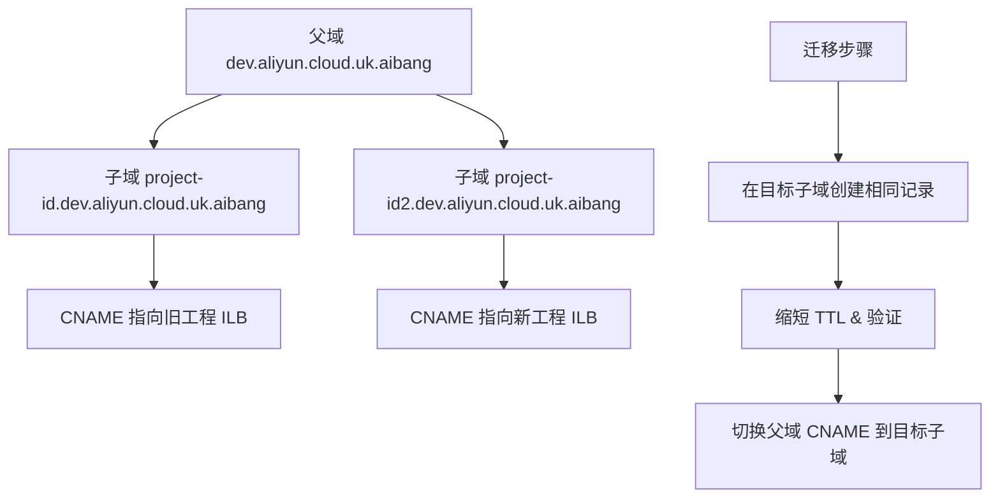
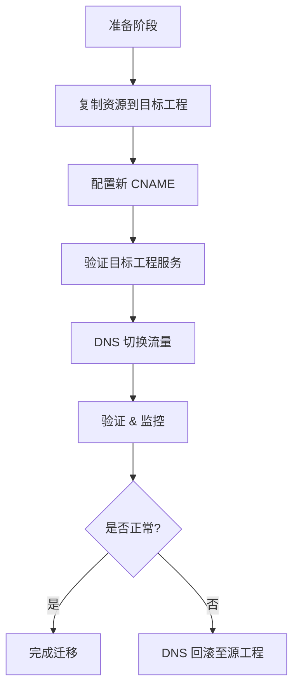

你的场景属于 多 Project 的独立 Managed Zone 管理，且父域名为 dev.aliyun.cloud.uk.aibang，每个工程有自己的子域 Zone。

⸻

1. 当前 DNS 架构特点
	•	父域：dev.aliyun.cloud.uk.aibang
	•	子域 Zone：
	•	project-id.dev.aliyun.cloud.uk.aibang
	•	project-id2.dev.aliyun.cloud.uk.aibang
	•	每个子域 Zone 独立托管对应的 CNAME、A 记录，解析到 ILB 或 Ingress 域名。

⸻

2. 迁移要点
	1.	DNS 层面
	•	迁移时无需修改父域，只需调整子域 Zone 的记录。
	•	如果想从 project-id 切换到 project-id2，需：
	•	在 project-id2.dev.aliyun.cloud.uk.aibang Zone 创建与 project-id.dev.aliyun.cloud.uk.aibang 相同的记录（如 CNAME）。
	•	然后修改上层引用，让 events.project-id.dev.aliyun.cloud.uk.aibang 的解析指向 project-id2 的 ILB/Ingress 域名。
	2.	资源层面
	•	确保目标工程 GKE 集群的 Ingress、Service、ILB 已部署并且状态正常。
	•	镜像、Secret、ConfigMap、PDB、HPA 等需复制到目标工程。
	3.	迁移步骤
	•	缩短 DNS TTL 至 30–60 秒。
	•	在目标工程创建与原工程一致的 DNS 记录。
	•	验证 dig、nslookup 返回的目标地址是否正确。
	•	逐步切换 CNAME 至新的子域域名。
	•	保留旧记录至少 24 小时，防止缓存失效期间出现流量丢失。

⸻

3. 建议方案

A. 快速切换（简单停机式）
	•	适合业务允许短暂连接重置的场景。
	•	切换 DNS 后观察是否存在 502 或连接拒绝问题，必要时回滚。

B. 双活灰度迁移
	•	在父域 Zone 中添加临时记录（如 test-events.project-id.dev.aliyun.cloud.uk.aibang），指向 project-id2 的 ILB。
	•	通过此临时域名验证运行状态。
	•	可使用 Cloud Armor 或 External DNS 做流量权重分配，平滑迁移。

⸻

4. DNS 变更流程示意


⸻

要不要我提供 Cloud DNS gcloud 命令脚本，直接同步 project-id Zone 的记录到 project-id2 Zone？
还是要做一个 父域 + 子域联动切换的完整操作手册（含回滚方案）？


以下是针对 **GCP 跨工程迁移域名及其后端架构** 的步骤，重点是 DNS、负载均衡、Ingress 控制器及后端服务的同步。

---

## **1. 迁移前准备**

  

### **核查资源清单**

- 当前源工程 project-id.dev.aliyun.cloud.uk.aibang 中的相关资源：
    
    - **DNS**：Cloud DNS zone，CNAME 指向 L4 ILB 和 GKE Ingress。
        
    - **网络**：VPC、子网、防火墙、Cloud NAT、Serverless VPC Connector 等。
        
    - **负载均衡**：Internal L4 ILB、GKE Ingress（L7）。
        
    - **GKE Runtime**：Deployment、Service、ConfigMap、Secret、PDB、HPA 等。
        
    

  

### **检查依赖**

- 是否有 GCP 资源引用工程 ID 或 Project Number（如 IAM、Service Account、Artifact Registry 镜像路径）。
    
- 是否有硬编码的域名或 API Endpoint。
    

---

## **2. 迁移策略**

  

### **A. DNS 快速切换方案**

1. **在目标工程中复制所有资源**
    
    - 在目标工程 project-id2.dev.aliyun.cloud.uk.aibang 创建相同的 VPC、GKE 集群、Ingress 控制器、Service 和后端 Runtime。
        
    - 可使用以下方式：
        
        - gcloud 导出 YAML (kubectl get all -o yaml) 并修改命名空间、镜像路径后重新应用；
            
        - 基于 GitOps（ArgoCD/FluxCD）直接部署。
            
        
    
2. **配置新的 CNAME 指向目标工程的 Ingress/ILB**
    
    - 在 DNS 中添加新的记录，例如：
        
    

```
events.project-id.dev.aliyun.cloud.uk.aibang
CNAME cinternal-vpc1-ingress-proxy-europe-west2-l4-ilb.project-id2.dev.aliyun.cloud.uk.aibang.

events-proxy.project-id.dev.aliyun.cloud.uk.aibang
CNAME ingress-nginx.gke-01.project-id2.dev.aliyun.cloud.uk.aibang.
```

2. -   
        
    - **不删除原记录**，先添加新的域名以验证连通性。
        
    
3. **验证目标工程的服务可用性**
    
    - 通过临时域名或 hosts 文件映射测试新工程的 Ingress 和 Runtime，确保流量可正常路由。
        
    
4. **执行 DNS 切换**
    
    - 修改现有 DNS CNAME 指向新的 Ingress/LB 域名。
        
    - 缩短 TTL（例如 60 秒），减少缓存影响。
        
    

---

### **B. 双活灰度迁移方案（可选）**

- 在切换之前，将流量通过 DNS Weight 或外部流量管理（如 Cloud Armor + URL Map）分流到新工程，逐步提升比例，降低中断风险。
    

---

## **3. 验证与回滚**

  

### **验证内容**

- Pod readiness 与探针状态；
    
- HTTP 200/502 统计，观察是否出现连接拒绝；
    
- GKE 后端 HPA/PDB 是否工作正常。
    

  

### **回滚方法**

- 仅需将 DNS CNAME 改回原工程即可快速回滚。
    

---

## **4. 流程图**



---

要不要我帮你生成 **完整迁移操作清单（含 gcloud/kubectl 命令）**，并加上 **回滚计划与 DNS 变更脚本**？

你是要 **停机式一次性切换**，还是 **双活灰度切换**？