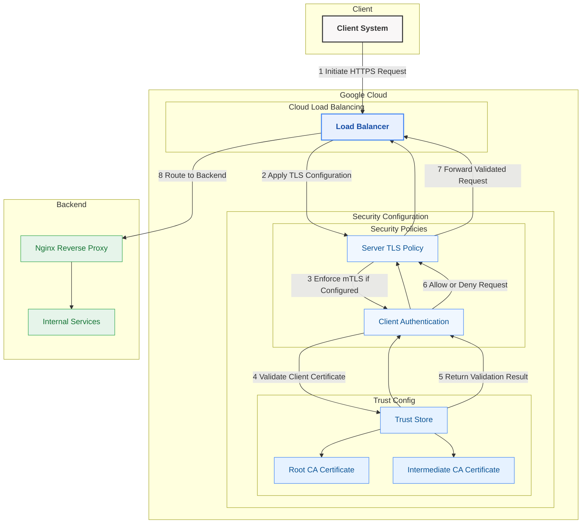
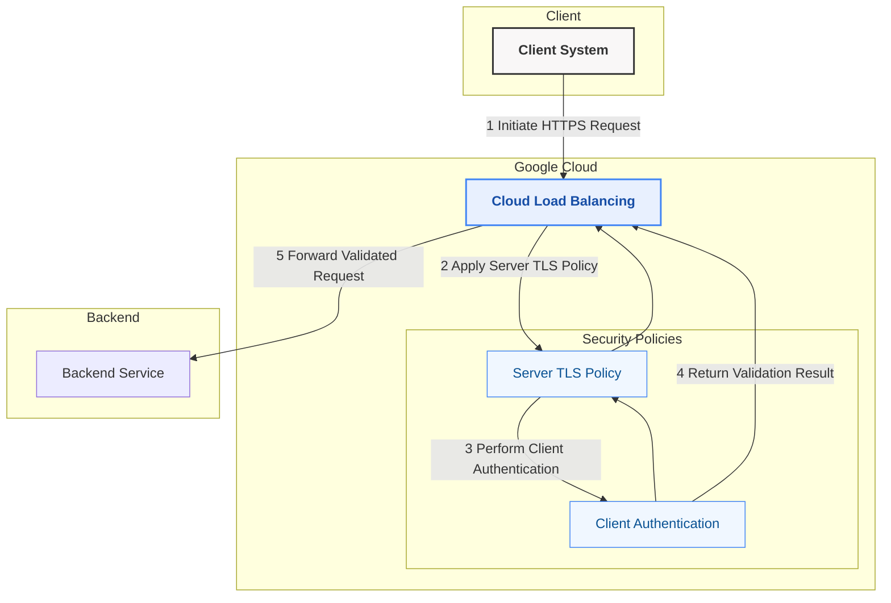

非常感谢你提供的详细流程图以及对 Cloud Load Balancing 中 Client Authentication 和 Server TLS Policy 部分的关注。
以下我将以 Markdown 格式详细展开讲述 **Client Authentication** 和 **Server TLS Policy** 的相关知识点，帮助你更好地理解这一部分在 Google Cloud 环境中的作用和配置。


---

## Client Authentication 和 Server TLS Policy 详解

在 Google Cloud 的负载均衡（Cloud Load Balancing）架构中，**Client Authentication** 和 **Server TLS Policy** 是确保安全通信的重要组成部分，特别是在涉及 mTLS（双向 TLS）认证的场景中。这两个部分主要负责定义客户端与负载均衡器之间、以及负载均衡器与后端服务之间的 TLS 连接行为和安全策略。

### 1. Client Authentication 概述

**Client Authentication** 是指在 mTLS（Mutual TLS）场景下，客户端（发起请求的一方）需要向服务器（在这里是 Google Cloud Load Balancer）提供一个有效的客户端证书，以证明自己的身份。通过这种双向认证，不仅服务器的身份被验证（通过其 TLS 证书），客户端的身份也得到了验证，从而确保通信双方的可信性。

在你的流程图中，Client Authentication 是外部安全层的一部分，直接影响负载均衡器如何处理来自客户端的请求。

#### 1.1 工作原理
- **客户端证书验证**：当客户端发起 HTTPS 请求时，负载均衡器会要求客户端提供一个证书（通常是 X.509 证书）。
- **信任链检查**：负载均衡器会根据预配置的 **Trust Config**（信任配置）来验证客户端证书的有效性。这包括检查证书是否由受信任的 CA（证书颁发机构）签发，以及证书是否在有效期内。
- **身份验证**：如果证书有效，负载均衡器会提取证书中的信息（例如 Subject DN 或 SAN），并根据策略决定是否允许该客户端访问后端服务。
- **请求转发**：只有通过了 Client Authentication 的请求才会被转发到后端服务（如你的流程图中的 Nginx 反向代理）。

#### 1.2 配置 Client Authentication
在 Google Cloud 中，Client Authentication 的配置通常与 **Server TLS Policy** 绑定，通过负载均衡器的目标 HTTPS 代理（Target HTTPS Proxy）来应用。以下是配置的关键步骤：

1. **创建 Trust Config**：
   - 定义一个 Trust Config，包含 Trust Store（信任存储），其中存储了信任锚（Root CA）和中间 CA 证书。
   - 示例命令（使用 `gcloud`）：
     ```bash
     gcloud certificate-manager trust-configs create my-trust-config \
         --trust-stores=my-trust-store:root-certs-file=root-ca.pem,intermediate-certs-file=intermediate-ca.pem
     ```

2. **关联 Trust Config 到 Server TLS Policy**：
   - 创建一个 Server TLS Policy，并指定信任配置，用于验证客户端证书。
   - 示例命令：
     ```bash
     gcloud network-security server-tls-policies create my-tls-policy \
         --trust-config=my-trust-config \
         --mtls-policy=STRICT \
         --region=global
     ```

3. **应用到负载均衡器**：
   - 将 Server TLS Policy 关联到负载均衡器的目标 HTTPS 代理。
   - 示例命令：
     ```bash
     gcloud compute target-https-proxies update my-https-proxy \
         --server-tls-policy=my-tls-policy
     ```

#### 1.3 注意事项
- **STRICT vs. ALLOW**：mTLS 策略可以设置为 `STRICT`（强制要求客户端证书）或 `ALLOW`（如果客户端未提供证书，仍然允许连接，但不会进行客户端身份验证）。
- **性能开销**：mTLS 验证会增加一定的计算开销，特别是在高并发场景下，需要评估负载均衡器的性能是否满足需求。
- **证书管理**：确保客户端证书和 CA 证书的定期更新，以避免因证书过期导致的连接失败。

---

### 2. Server TLS Policy 概述

**Server TLS Policy** 定义了负载均衡器作为服务器端在 TLS 连接中的行为规则，包括支持的 TLS 版本、加密套件（cipher suites）、以及是否启用 mTLS 等。这是一个集中化的策略配置，可以应用于多个负载均衡器实例，确保一致的安全性。

在你的流程图中，Server TLS Policy 与 Client Authentication 紧密相关，作为外部安全层的一部分，直接作用于负载均衡器。

#### 2.1 工作原理
- **TLS 版本和加密套件**：Server TLS Policy 指定了负载均衡器支持的 TLS 版本（如 TLS 1.2、TLS 1.3）和加密套件，确保只使用安全的加密算法。
- **mTLS 策略**：如果启用了 mTLS，Server TLS Policy 会引用 Trust Config，决定是否以及如何验证客户端证书。
- **服务器证书**：负载均衡器使用配置的服务器证书（如 SSL Certificate）向客户端证明自己的身份。
- **一致性**：通过 Server TLS Policy，可以在多个负载均衡器之间应用一致的 TLS 配置，简化大规模部署的安全管理。

#### 2.2 配置 Server TLS Policy
在 Google Cloud 中，Server TLS Policy 是一个独立的资源，可以通过以下步骤配置：

1. **创建 Server TLS Policy**：
   - 定义支持的 TLS 版本和加密套件，启用 mTLS，并指定 Trust Config。
   - 示例命令：
     ```bash
     gcloud network-security server-tls-policies create my-tls-policy \
         --min-tls-version=TLS_1_2 \
         --profile=COMPATIBLE \
         --mtls-policy=STRICT \
         --trust-config=my-trust-config \
         --region=global
     ```

2. **应用到负载均衡器**：
   - 将策略绑定到目标 HTTPS 代理。
   - 示例命令：
     ```bash
     gcloud compute target-https-proxies update my-https-proxy \
         --server-tls-policy=my-tls-policy
     ```

#### 2.3 配置选项解析
- **`min-tls-version`**：指定最低支持的 TLS 版本，推荐使用 TLS 1.2 或更高版本，避免使用已知不安全的 TLS 1.0 和 1.1。
- **`profile`**：指定加密套件配置文件，可以选择 `COMPATIBLE`（兼容性优先）或 `MODERN`（安全性优先）。
- **`mtls-policy`**：设置 mTLS 模式，`STRICT` 表示强制要求客户端证书，`ALLOW` 表示可选。

#### 2.4 最佳实践
- **安全性优先**：优先选择 `MODERN` 配置文件，避免使用已被废弃的加密算法（如 SHA-1）。
- **版本控制**：定期更新 TLS 策略，确保支持最新的 TLS 版本和加密标准。
- **监控和日志**：启用负载均衡器的日志功能，监控 TLS 连接失败或 mTLS 认证失败的请求，及时排查问题。

---

### 3. Client Authentication 与 Server TLS Policy 的关系
- **Client Authentication** 是 Server TLS Policy 的一个功能子集，主要关注客户端证书的验证。
- **Server TLS Policy** 是一个更广泛的配置，涵盖了负载均衡器作为服务器端的所有 TLS 行为，包括版本支持、加密套件选择，以及是否启用 mTLS（即 Client Authentication）。

在你的流程图中，`Client Authentication<br>Server TLS Policy` 作为一个整体模块，表明它们共同作用于负载均衡器，用于保护外部请求的安全性。

---

### 4. 与其他组件的关系（结合你的流程图）
- **Trust Config 和 Trust Store**：提供信任链，用于验证客户端证书，直接影响 Client Authentication 的结果。
- **MTLS Authentication**：流程图中的步骤 2 表示 mTLS 认证过程，Client Authentication 和 Server TLS Policy 在此步骤中发挥作用。
- **Cloud Armor**：虽然 Cloud Armor 主要负责 WAF（Web 应用防火墙）和 IP 白名单，但它与 Server TLS Policy 一起，确保请求在通过 TLS 认证后，还能通过额外的安全策略检查。
- **Nginx 和后端服务**：只有通过了 Client Authentication 和 Server TLS Policy 验证的请求，才会被负载均衡器转发到后端（如 Nginx 反向代理），从而确保整个通信链路的安全性。

---

### 5. 示例流程图（Mermaid）
为了更清晰地说明 Client Authentication 和 Server TLS Policy 在请求流程中的作用，我为你补充了一个简化的 Mermaid 流程图：



这个流程图展示了：
- 客户端发起 HTTPS 请求后，负载均衡器根据 Server TLS Policy 决定 TLS 连接行为。
- 如果启用了 mTLS，负载均衡器会通过 Client Authentication 验证客户端证书。
- 只有验证通过的请求才会被转发到后端服务。

---

### 6. 常见问题解答
#### Q1：Client Authentication 失败时会发生什么？
A：如果客户端未提供证书或证书无效（例如不在 Trust Store 中），负载均衡器会拒绝连接，并返回 TLS 握手失败的错误（如 `SSL_ERROR_BAD_CERT_DOMAIN`）。

#### Q2：是否可以在不启用 mTLS 的情况下使用 Server TLS Policy？
A：可以，Server TLS Policy 也可以仅用于定义 TLS 版本和加密套件，而不强制要求客户端证书（将 mTLS 策略设为 `ALLOW`）。

#### Q3：如何调试 Client Authentication 问题？
A：可以通过以下步骤调试：
- 检查负载均衡器的日志，查看 TLS 握手失败的具体原因。
- 验证客户端证书是否由受信任的 CA 签发，且未过期。
- 使用 `openssl s_client` 工具模拟客户端连接，检查握手过程：
  ```bash
  openssl s_client -connect <lb-ip>:443 -cert client-cert.pem -key client-key.pem
  ```

---

### 总结
**Client Authentication** 和 **Server TLS Policy** 是 Google Cloud Load Balancing 中保障通信安全的重要机制，尤其在 mTLS 场景中。Client Authentication 确保客户端身份的可信性，而 Server TLS Policy 则定义了负载均衡器的整体 TLS 行为，包括版本、加密套件和 mTLS 配置。通过合理配置这两个部分，可以有效保护外部请求，并确保只有经过验证的客户端才能访问后端服务。

如果你有进一步的问题或需要更具体的配置示例（如针对 GKE 或 Kong 的集成），欢迎继续提问！


# Chatgpt 

很好，既然你已经掌握了 Cloud Load Balancing 中的 mTLS 和 Cloud Armor，我们接下来可以更深入探讨关于 Client Authentication 和 Server TLS Policy 的部分，特别是它们如何在 GCP（Google Cloud Platform）中落地和使用。

⸻

🧩 一些前置概念：Client Authentication 与 Server TLS Policy

1. Client Authentication（客户端认证）

这通常用于实现 双向 TLS (mTLS)，其目标是：
	•	不是只有客户端验证服务端证书（常见于 HTTPS），
	•	而是服务端也要验证客户端身份（通过客户端证书）。

你可通过启用 Client TLS Policy 来要求客户端必须提供有效的证书才允许通信。

📌 应用场景：
	•	服务间调用（Service-to-Service）
	•	需要强身份验证的 API Gateway 流量
	•	零信任网络架构（Zero Trust）

⸻

2. Server TLS Policy（服务端 TLS 策略）

这是用来定义服务端的 TLS 行为配置，比如：
	•	启用哪些 TLS 版本（如 TLS 1.2/1.3）
	•	使用哪些加密套件（Cipher Suites）
	•	服务端证书的选择（如何颁发/管理）

Server TLS Policy 主要控制 你作为服务端接受 TLS 流量的“门槛和要求”。

⸻

🏗 在 GCP 中的配置方式（以 GCLB 为例）

在 Google Cloud Load Balancer (特别是 HTTPS Load Balancer with backend NEGs/PSCs) 的环境中，你通过以下方式配置 TLS 策略：

⸻

🔐 Server TLS Policy（gcloud）

gcloud network-security server-tls-policies create my-server-policy \
    --description="Restrict TLS to secure versions" \
    --min-tls-version=TLS_1_2 \
    --location=global

作用：
	•	定义服务端 TLS 最低版本
	•	控制客户端只能使用这些版本连接

绑定到 Backend Service 上：

gcloud compute backend-services update YOUR_BACKEND_SERVICE \
    --server-tls-policy=my-server-policy \
    --global


⸻

✅ Client Authentication (mTLS via Client TLS Policy)

这是强制要求客户端提供证书的地方。

gcloud network-security client-tls-policies create my-client-policy \
    --description="Require client certs for mTLS" \
    --client-certificate-required \
    --location=global

客户端证书校验会结合以下部分：
	•	信任的根证书（trust config）
	•	客户端证书的签发路径

你需要配置 Trust Config 来告诉系统哪些证书链是受信的：

gcloud network-security trust-configs create my-trust-config \
    --description="Trusted client CAs" \
    --location=global \
    --trust-store-type=CA_POOL \
    --trust-store=projects/PROJECT_ID/locations/global/caPools/POOL_NAME

然后将 client-tls-policy 与 Backend Service 绑定：

gcloud compute backend-services update YOUR_BACKEND_SERVICE \
    --client-tls-policy=my-client-policy \
    --global


⸻

🔎 一个组合示意（背后逻辑流程）
	1.	客户端发起请求
	2.	GCLB 检查 Server TLS Policy：
	•	TLS 版本是否满足？
	•	Cipher suite 是否允许？
	3.	若开启了 Client TLS Policy：
	•	客户端是否提供证书？
	•	证书是否由受信任 CA 签发？
	4.	验证通过，流量被转发至 Backend

⸻

🧠 注意事项与建议
	•	若你使用 Google-managed SSL certificates，配合 Server TLS Policy 需要注意 TLS version 的支持范围。
	•	Trust Config 可以指向 Google CAS（Certificate Authority Service）中的 CA Pools，建议统一管理。
	•	如果你用的是 Internal Load Balancer（L7 PSC），Client TLS Policy 是开启 mTLS 的关键。
	•	日志中会记录 TLS negotiation 失败的详细原因，可用于诊断（Stackdriver Logging）。

⸻

如果你愿意，我可以基于你目前的 mermaid flow，帮你补充这部分的结构，比如 mTLS handshake、Policy 的决策路径、或 Trust Chain 的建立过程。你需要这方面的图解吗？

