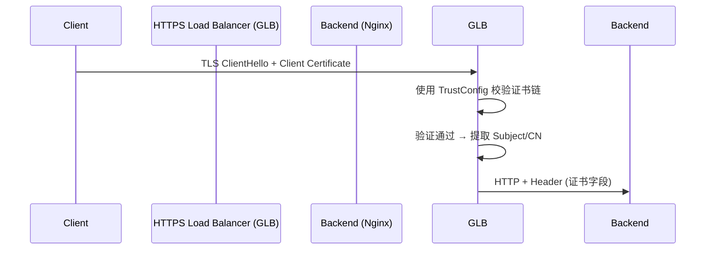

- [ ] **GCP GLB 配置**：GCP 负载均衡器会处理 SSL/TLS 握手并进行 MTLS 验证，但不会将证书信息传递给后端
- [ ] 

我想详细理解下，所有的客户端证书由同一个共同的CA签发，GLB完成统一MTLS验证。 把这个给我详细展开讲诉

当然可以，以下是详细展开的说明，并以 Markdown 文档形式组织，便于你在文档或审阅系统中直接使用：

⸻

使用统一 CA 的客户端证书通过 GLB 实现统一 mTLS 验证的详细机制

场景目标

在一个多服务环境中，不同的客户端需要访问不同的 API，但为了简化管理与提升安全性，希望：
	•	所有客户端证书由同一个 根 CA 或中间 CA 签发；
	•	Google HTTPS Load Balancer（GLB）统一完成客户端 mTLS 验证；
	•	后端（如 Nginx）根据客户端证书的具体字段（如 CN）路由到对应服务。

⸻

技术机制解析

1. 客户端证书的信任体系结构
```bash
Root CA
  └── Intermediate CA
         ├── client-a.aibang.com  (客户端证书A)
         ├── client-b.aibang.com  (客户端证书B)
         └── ...
```
	•	所有客户端证书都由同一个 Intermediate CA 签发，或直接由 Root CA 签发；
	•	Root CA/Intermediate CA 被导入到 Google Certificate Manager，用作 TrustConfig 的信任锚。

⸻

2. Google Load Balancer 统一 mTLS 验证

组件	说明
TrustConfig	包含客户端证书所信任的 CA 证书链（通常为 PEM 格式的 Root 或 Intermediate 证书）
ServerTlsPolicy	将 TrustConfig 绑定到 HTTPS Load Balancer，启用 client validation = REQUIRED
HTTPS Load Balancer	自动完成客户端证书验证流程：握手、有效期校验、签名链验证、吊销状态（可选）

流程图（简化）：

	•	GLB 验证通过后，会自动将客户端证书的相关字段加到 请求 Header 中传递给后端：

Header	说明
x-goog-authenticated-user-cert-subject	包含 Subject，例如：CN=client-a.aibang.com
x-goog-authenticated-user-cert-issuer	颁发者信息
x-forwarded-for	原始客户端 IP


⸻

3. 后端 Nginx 根据证书信息路由

你可以在 Nginx 中使用 $http_x_goog_authenticated_user_cert_subject 提取证书信息：
```nginx
map $http_x_goog_authenticated_user_cert_subject $client_cn {
    default "unknown";
    ~CN=client-a\.aibang\.com "client-a";
    ~CN=client-b\.aibang\.com "client-b";
}

location /api/ {
    if ($client_cn = "client-a") {
        proxy_pass http://service-a;
    }
    if ($client_cn = "client-b") {
        proxy_pass http://service-b;
    }
}
```
这样就实现了：
	•	mTLS 客户端验证在 GLB 层完成；
	•	服务识别和路由在 Nginx 中完成；
	•	后端服务 不再处理 TLS 握手，专注于业务逻辑。

⸻

为什么使用统一 CA 更具优势？

优点	描述
简化配置	只需一个 TrustConfig 就能支持所有客户端
降低维护成本	不需要为每类客户端配置多个证书信任策略
灵活性更高	后端服务可按需扩展、独立更新证书识别逻辑
安全增强	中央化信任锚控制，便于吊销/更新 CA


⸻

总结

组件	作用	位置
CA 证书	签发所有客户端证书	本地或受管平台
TrustConfig	GLB 用于校验客户端证书	Google Certificate Manager
ServerTlsPolicy	启用 mTLS 并绑定信任链	与 HTTPS LB 绑定
GLB	进行 TLS 握手 + mTLS 验证	第七层入口
Nginx	解析 Header 并实现基于证书路由	后端服务入口


⸻

如你需要，我也可以生成 TrustConfig YAML 示例与完整的 HTTPS LB 配置参考。是否继续？


你的场景如下总结非常清晰：
	•	所有 mTLS 请求 都走一个 统一的 Google Public IP（GLB）；
	•	请求 URL 类似：
https://mtls-api-aibang.com/service-a/v2/.well-known/health
https://mtls-api-aibang.com/service-b/v1/.well-known/health
	•	所有客户端证书由 同一个 Intermediate CA（由你们自建或受信根 CA 签发）签发。

⸻

我们来详细解释这个架构概念与背后的机制：

⸻

一、单一 Intermediate CA 签发多个客户端证书的含义

概念	说明
Intermediate CA	是 Root CA 授权签发证书的中间机构，一般用于隔离 Root CA 直接暴露风险。
单一 Intermediate CA 签发	所有客户端证书都来自一个信任链，证书信任锚是一致的。
GLB 配置 TrustConfig 的结果	你只需在 GLB 中配置一次该 Intermediate CA（或其链条），GLB 就能验证所有客户端证书。
安全性层级	中央化签发控制，证书吊销、生命周期管理都在一个 PKI 范围内控制。


⸻

二、GLB 如何处理这些请求与证书
	1.	客户端发起 mTLS 请求（在 TLS 握手中传入其证书）；
	2.	GLB 使用你在 Certificate Manager 中配置的 TrustConfig 对客户端证书进行验证；
	•	检查证书链（Intermediate CA → Root CA）
	•	验证有效期、吊销状态等
	3.	如果验证成功，GLB 将请求转发到后端（Nginx），并在 header 中插入证书信息：
	•	x-goog-authenticated-user-cert-subject
	•	x-goog-authenticated-user-cert-issuer
	4.	后端 Nginx 根据这些 header 信息（比如 CN = client-a.aibang.com）路由到不同的服务。

⸻

三、为什么你可以用统一的 CA 而无需多 TrustConfig

对比点	多 CA	单一 Intermediate CA
TrustConfig 数量	需要多个，每类证书一种	一个即可
ServerTlsPolicy 配置	多个 Policy，复杂	单个 Policy 即可
管理复杂度	高	低，易维护
安全可控性	分散，难集中吊销	统一集中吊销/更新
与 Nginx 联动（CN判断）	每个服务逻辑都要区分 CA	只区分 CN 或 Subject 即可


⸻

四、补充建议
	•	如果你担心某些客户端证书泄露或过期，可以实现：
	•	定期轮换 Intermediate CA
	•	利用 Certificate Revocation List (CRL) 或 OCSP（GLB 支持 OCSP）
	•	后端 Nginx 建议继续使用 CN 来做访问控制（你已经这么做是合理的）；
	•	URL 路由建议结合 location 和 CN 双重验证，避免绕过。

⸻

示例：你的场景映射图（Mermaid）

sequenceDiagram
    participant ClientA
    participant GLB
    participant Nginx
    participant ServiceA

    ClientA->>GLB: TLS Handshake (with Client Cert)
    GLB->>GLB: Verify mTLS via Intermediate CA
    GLB->>Nginx: Forward Request + Cert Headers
    Nginx->>Nginx: Check CN == client-a.aibang.com
    Nginx->>ServiceA: Proxy to /service-a/v2/.well-known/health


⸻

如需我帮你输出成整份文档结构，或者补充你的 TrustConfig 和 ServerTlsPolicy 示例，我也可以直接给出 YAML 和 Markdown 模板。需要我继续吗？
