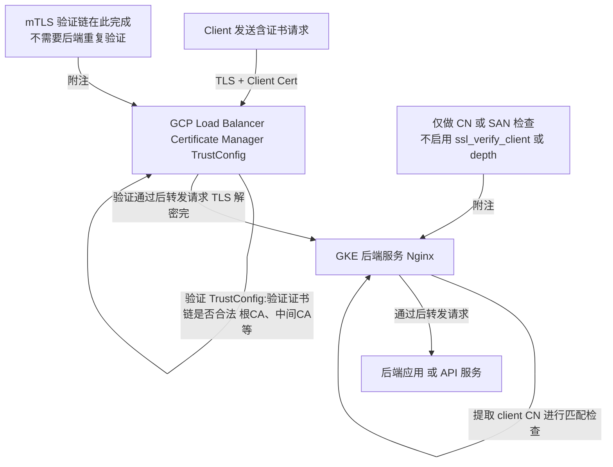

**GCP Certificates Trust Config** 的确与类似于 **SSLVerifyDepth** 的概念相关，但二者不是完全等价的配置项，而是**同一个验证链机制的不同表现层面**。我来帮你理清两者的关系。

---

## **🔐 GCP Trust Config 简述**

在 GCP 中（特别是 **Certificate Manager** 中），TrustConfig 主要用于配置 **客户端证书验证（mTLS）** 时服务器端用于验证客户端证书链的根证书和中间证书：

- TrustConfig 包含一个或多个 **trusted CA certificates**（通常是 PEM 格式的根证书或中间 CA）。
- 用于配置 **Server 端如何验证 Client 证书**。
- 一般在配置 **mTLS** 的 GCLB 或 GKE Gateway 等场景下使用。

---

## **🔎 什么是 SSLVerifyDepth？**

这是在 Apache HTTP Server 或 Nginx 中用于 TLS 客户端验证的参数，用于限制 **验证链的最大深度**。

简单来说，它控制了：

> “从客户端证书到信任根证书，最多允许多少层证书链”

举个例子：

```
Client cert -> Intermediate CA -> Root CA
```

这是一个**深度为 2** 的链条（Intermediate 是第 1 层，Root 是第 2 层）。

配置：

```
ssl_verify_depth 2;
```

意味着最多允许有两层中间 CA + root 证书。如果链太长，就拒绝。

---

## **✅ 二者的关系**

- 在 GCP 的 TrustConfig 中，并没有**显式的 verify_depth 参数**，但它 **隐含支持类似机制**。
- 如果你上传的 trust anchors（根或中间 CA）不足以验证 client 证书链，那么验证就会失败，相当于一个动态的 verify depth check。
- 目前 GCP 默认的 TLS 组件（如 GCLB 或 Gateway）**支持的最大证书链长度为约 10**，这个类似 ssl_verify_depth 的系统限制是硬编码的。

---

## **✅ 小结：是否有关？**

| **概念**   | **GCP TrustConfig**                             | **SSLVerifyDepth**       |
| ---------- | ----------------------------------------------- | ------------------------ |
| 是否相关   | ✅ 是（底层机制一致）                           | ✅ 是（显式配置）        |
| 在哪里配置 | GCP Certificate Manager, Gateway API            | Nginx / Apache / Envoy   |
| 控制方式   | 上传的 trusted roots 和链的完整性决定可验证深度 | 明确写出 max depth       |
| 默认行为   | 允许合理深度（如 5~10），过深可能失败           | 需要手动控制是否接受深链 |

---

如果你在 GCP Gateway 或 GCLB 中配置了 mTLS 并出现客户端证书验证失败的问题，可能就是：

- 信任链未补齐（缺中间证书）
- 证书链太深
- 上传的 trust config 不正确（PEM 错误、格式不对）

---

需要我帮你看具体配置或者 debug 某个验证失败的例子吗？你可以贴一下 trust config、证书链结构，我来一起分析。

# nginx

那么如果我们现在走 MTLS 的 TrustConfig 的验证的,后面的 Nginx 仅仅做 CN 的校验,那么其实就不用考虑 nginx 层去配置 SSLVerifyDepth?

当然可以，以下是描述你这个 mTLS 验证流程的 Mermaid 流程图，重点体现了 TrustConfig 在前端验证，Nginx 只做 CN 校验的结构：



---

### **💡 小提示：**

如果你后面考虑让后端服务进一步做细粒度控制（如基于证书的 RBAC），那可能还会需要把 X-Forwarded-Client-Cert 之类的头部带过去（在 GCP LB 里开启 client certificate forwarding）。但当前这个架构只校验 CN，是非常清晰且高效的。

要不要 also 我给你画一个带 CN 检查逻辑的 Nginx 配置示例？

好的，下面是一个典型的 **Nginx 配置示例**，适用于你的场景：**前端（GCP LB）做了 mTLS + TrustConfig 验证，后端 Nginx 只做 CN 校验**。

---

### **📄 Nginx 配置片段（仅校验 CN，不做 TLS 验证）**

```nginx
# 通常用于 HTTPS 后端或 Sidecar 模式
server {
    listen 443 ssl;
    server_name backend.example.com;

    ssl_certificate     /etc/nginx/ssl/server.crt;
    ssl_certificate_key /etc/nginx/ssl/server.key;

    # 注意：不启用客户端证书验证（由 GCP 处理）
    ssl_verify_client off;

    # 提取客户端证书信息（通过 GCP 传过来的 header）
    # 需在 GCP LB 中启用 client cert forwarding
    set $client_cert_cn "";
    if ($http_x_ssl_client_s_dn ~* "CN=(.*?)(?:,|$)") {
        set $client_cert_cn $1;
    }

    # 允许的客户端 CN（可配置为 map/白名单列表）
    map $client_cert_cn $cn_allowed {
        default 0;
        "service-client.example.com" 1;
        "trusted-agent.internal" 1;
    }

    # 拦截非法 CN
    if ($cn_allowed = 0) {
        return 403;
    }

    location / {
        proxy_pass http://upstream-service;
        # 其他 proxy 配置 ...
    }
}
```

---

### **✅ 配置说明**

| **配置项**            | **说明**                                 |
| --------------------- | ---------------------------------------- |
| ssl_verify_client off | 不做客户端证书验证，由 GCP 完成          |
| X-SSL-Client-S-DN     | 需要 GCP 配置开启 client cert forwarding |
| map + if 语句         | 实现基于 CN 的白名单校验                 |
| return 403            | 如果 CN 不合法，直接拒绝请求             |

---

### **💡 GCP 设置小提示：**

- 若使用 **GCLB + Certificate Manager mTLS**，你需在 Backend Config 中启用：

```
enable_client_certificate: true
```

-
- 并设置转发 header：

```
x-forwarded-client-cert: true
```

这样 Nginx 才能获取 X-SSL-Client-S-DN 或 X-Forwarded-Client-Cert。

---

如果你有打算把多个 CN 管理得更灵活，我们还可以用 Lua 或自定义 whitelist 文件方式，后续可以加上。需要的话我也可以写个版本 😎
