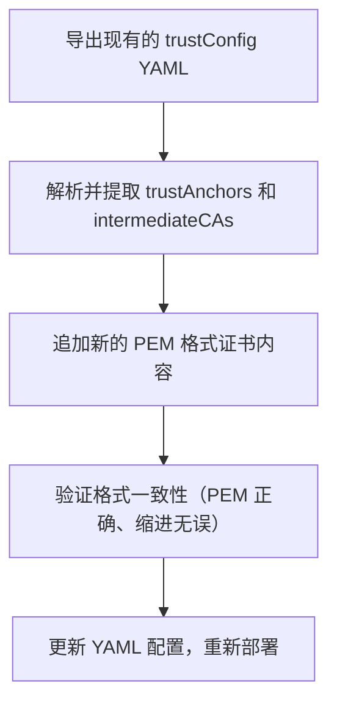

在 GCP 的 mTLS（Mutual TLS） 配置中，尤其是使用 GKE Gateway (或 Gateway API) 时，trustConfig 是用于配置可信根（trustAnchors）和中间证书（intermediateCAs）等内容的关键部分。当你需要进行 增量配置（比如追加新的中间证书或根证书）时，以下是一个比较清晰、可靠的处理流程和格式管理建议：

⸻

1. 推荐的逻辑流程：导出现有配置 + 追加新证书

你需要做到的是「不可破坏已有配置」并「增量式地添加新证书」，流程如下：



⸻

2. 操作细节：

a. 导出现有配置

kubectl get trustconfig your-trustconfig-name -n your-namespace -o yaml > trustconfig-backup.yaml

你可以直接从 trustStores.trustAnchors.pemCertificate 或 trustStores.intermediateCas.pemCertificate 中读取已有 PEM 格式证书。

⸻

b. 追加新证书逻辑（格式保持统一）

建议将 PEM 证书的内容以 YAML 数组的形式追加：
```yaml
trustStores:
  trustAnchors:
    pemCertificate:
      - |
        -----BEGIN CERTIFICATE-----
        ...
        -----END CERTIFICATE-----
      - |
        -----BEGIN CERTIFICATE-----
        ...
        -----END CERTIFICATE-----
  intermediateCas:
    pemCertificate:
      - |
        -----BEGIN CERTIFICATE-----
        ...
        -----END CERTIFICATE-----
```
	•	每个 - | 下是一个独立的 PEM 格式证书
	•	确保 YAML 缩进一致（通常两个空格）
	•	PEM 本体不要有额外空行
	•	多个证书不要合并到一个 PEM 中，否则解析容易出错

⸻

c. 验证 PEM 格式正确性

可使用 openssl 做基本的校验：

`openssl x509 -in new_cert.pem -noout -text`

你可以写一个小的 shell 脚本把多个 .pem 文件合并为 YAML 片段：
```shell
echo "    pemCertificate:" > append.yaml
for cert in certs/*.pem; do
  echo "      - |" >> append.yaml
  sed 's/^/        /' "$cert" >> append.yaml
done
```


⸻

3. 格式化建议与最佳实践

项	说明
缩进	建议 2 空格，不要混用 tab
PEM 格式	每个证书单独一段 `-
版本控制	推荐将 trustConfig YAML 放入 Git 管理版本
自动化	可编写小工具（Python / Bash）做 YAML 的 merge 操作


⸻

4. 示例：完整 YAML 段落结构
```yaml
apiVersion: networking.gke.io/v1
kind: TrustConfig
metadata:
  name: example-trust
  namespace: default
spec:
  trustStores:
    trustAnchors:
      pemCertificate:
        - |
          -----BEGIN CERTIFICATE-----
          MIIDdzCCAl+gAwIBAgIEb...
          -----END CERTIFICATE-----
        - |
          -----BEGIN CERTIFICATE-----
          MIIDeTCCAmGgAwIBAgI...
          -----END CERTIFICATE-----
    intermediateCas:
      pemCertificate:
        - |
          -----BEGIN CERTIFICATE-----
          MIIDdTCCAl2gAwIBAg...
          -----END CERTIFICATE-----
```


⸻

如果你有多个证书需要自动追加，我也可以帮你生成一个 bash 脚本或 yaml patch 的方式来处理，是否需要？


在 Google Cloud Platform (GCP) 的 mTLS 配置中，增量更新 Trust Config 的 YAML 文件涉及向 trustStores 中的 trustAnchors 和 intermediateCas 添加新的 pemCertificate，同时保持现有配置的完整性。以下是处理这一逻辑的推荐步骤，以及如何格式化和管理的详细建议。这些建议基于 GCP 官方文档和最佳实践，结合增量更新的需求。

1. 理解 Trust Config 的 YAML 结构
根据 GCP 的 Certificate Manager 文档，Trust Config 的 YAML 结构如下：
```yaml
name: "TRUST_CONFIG_ID"
trustStores:
  - trustAnchors:
      - pemCertificate: "CERTIFICATE_PEM_PAYLOAD_1"
      - pemCertificate: "CERTIFICATE_PEM_PAYLOAD_2"
    intermediateCas:
      - pemCertificate: "INTER_CERT_PEM_PAYLOAD_1"
      - pemCertificate: "INTER_CERT_PEM_PAYLOAD_2"
    allowlistedCertificates:
      - pemCertificate: "ALLOWLISTED_CERT_1"
      - pemCertificate: "ALLOWLISTED_CERT_2"
```
	•	trustAnchors：包含根证书（Root CA）的 PEM 编码证书。
	•	intermediateCas：包含中间证书（Intermediate CA）的 PEM 编码证书。
	•	allowlistedCertificates：可选，包含始终视为有效的证书（例如自签名证书）。
	•	每个 pemCertificate 字段包含一个完整的 PEM 证书（包括 -----BEGIN CERTIFICATE----- 和 -----END CERTIFICATE-----）。
增量更新的目标是在 trustAnchors 和 intermediateCas 中追加新的证书，而不覆盖现有配置。

2. 增量更新的逻辑处理
为了实现增量更新，建议采用以下步骤：
步骤 1：导出当前的 Trust Config 配置
GCP 提供了 gcloud 命令来导出 Trust Config 的当前配置到一个 YAML 文件：
```bash
gcloud certificate-manager trust-configs export TRUST_CONFIG_ID \
  --project=PROJECT_ID \
  --location=LOCATION \
  --destination=trust_config_old.yaml
```
	•	TRUST_CONFIG_ID：Trust Config 的唯一 ID。
	•	PROJECT_ID：GCP 项目 ID。
	•	LOCATION：Trust Config 存储的位置（例如 global 或特定区域）。
	•	trust_config_old.yaml：导出的 YAML 文件路径。
导出的 YAML 文件将包含当前的 trustStores 配置，包括现有的 trustAnchors 和 intermediateCas。
步骤 2：准备新的证书
确保新的根证书或中间证书已经格式化为正确的 PEM 格式。PEM 证书应包含以下结构：
-----BEGIN CERTIFICATE-----

-----END CERTIFICATE-----
为了保持一致性，建议对新的 PEM 证书进行格式化处理，去除多余的换行符或空格。可以借助脚本（例如 Python 或 Bash）来规范化 PEM 证书：
Python 示例：格式化 PEM 证书
```python
import base64
import textwrap

def format_pem_certificate(cert_content):
    # 移除多余的换行符和空格
    cert_content = cert_content.strip()
    # 提取证书内容（去除 BEGIN/END 标记）
    if cert_content.startswith("-----BEGIN CERTIFICATE-----"):
        cert_content = cert_content.replace("-----BEGIN CERTIFICATE-----", "").replace("-----END CERTIFICATE-----", "")
        cert_content = cert_content.strip()
    # 重新格式化为每行 64 字符
    wrapped = textwrap.wrap(cert_content, width=64)
    # 拼接 PEM 格式
    pem = "-----BEGIN CERTIFICATE-----\n" + "\n".join(wrapped) + "\n-----END CERTIFICATE-----"
    return pem

# 示例：读取证书文件并格式化
with open("new_cert.pem", "r") as f:
    cert = f.read()
formatted_cert = format_pem_certificate(cert)
print(formatted_cert)
Bash 示例：格式化 PEM 证书
# 使用 openssl 规范化 PEM 证书
openssl x509 -in new_cert.pem -out formatted_cert.pem
# 或者使用 base64 重新编码
cat new_cert.pem | grep -v "-----" | tr -d '\n' | fold -w 64 | sed 's/^/    /' | (echo "-----BEGIN CERTIFICATE-----" && cat && echo "-----END CERTIFICATE-----") > formatted_cert.pem
步骤 3：追加新证书到 YAML 文件
手动或通过脚本将新的 pemCertificate 追加到导出的 YAML 文件中的 trustAnchors 或 intermediateCas 部分。
手动编辑 打开 trust_config_old.yaml，在 trustAnchors 或 intermediateCas 下添加新的 pemCertificate 条目。例如：
```yaml
trustStores:
  - trustAnchors:
      - pemCertificate: "EXISTING_CERTIFICATE_PEM_PAYLOAD"
      - pemCertificate: "NEW_CERTIFICATE_PEM_PAYLOAD"  # 新增的根证书
    intermediateCas:
      - pemCertificate: "EXISTING_INTER_CERT_PEM_PAYLOAD"
      - pemCertificate: "NEW_INTER_CERT_PEM_PAYLOAD"  # 新增的中间证书
```
脚本自动化（推荐） 为了避免手动编辑出错，建议使用脚本解析和修改 YAML 文件。以下是一个 Python 示例，使用 PyYAML 库来追加证书：
```Python
import yaml

# 读取导出的 YAML 文件
with open("trust_config_old.yaml", "r") as f:
    config = yaml.safe_load(f)

# 新证书内容（已格式化）
new_trust_anchor = "-----BEGIN CERTIFICATE-----\n\n-----END CERTIFICATE-----"
new_intermediate_ca = "-----BEGIN CERTIFICATE-----\n\n-----END CERTIFICATE-----"

# 获取或初始化 trustStores
trust_stores = config.setdefault("trustStores", [{}])[0]
trust_anchors = trust_stores.setdefault("trustAnchors", [])
intermediate_cas = trust_stores.setdefault("intermediateCas", [])

# 追加新证书
trust_anchors.append({"pemCertificate": new_trust_anchor})
intermediate_cas.append({"pemCertificate": new_intermediate_ca})

# 保存修改后的 YAML 文件
with open("trust_config_new.yaml", "w") as f:
    yaml.safe_dump(config, f, default_flow_style=False, sort_keys=False)
```
确保安装 PyYAML：
pip install pyyaml
步骤 4：验证 YAML 文件
在导入新的 YAML 文件之前，验证其格式和内容：
	•	检查 YAML 语法：使用 yaml 工具或在线 YAML 验证器。
	•	检查 PEM 证书：确保每个 pemCertificate 的格式正确（包含 BEGIN/END 标记，每行 64 字符）。
	•	检查证书有效性：使用 openssl 验证证书：openssl x509 -in formatted_cert.pem -text -noout
	•	
步骤 5：导入更新后的 Trust Config
使用 gcloud 命令将修改后的 YAML 文件导入，覆盖现有的 Trust Config：
```bash
gcloud certificate-manager trust-configs import TRUST_CONFIG_ID \
  --project=PROJECT_ID \
  --source=trust_config_new.yaml \
  --location=LOCATION
```
	•	如果 Trust Config 已被 ServerTlsPolicy 引用，确保导入不会破坏现有的 mTLS 配置（例如，验证新证书是否与现有链兼容）。
	•	如果需要回滚，保留 trust_config_old.yaml 作为备份。

3. 格式化证书的注意事项
为了确保 pemCertificate 字段的一致性和正确性，遵循以下格式化规则：
	1	标准 PEM 格式：
	◦	每行 64 个字符（不包括换行符）。
	◦	以 -----BEGIN CERTIFICATE----- 开头，以 -----END CERTIFICATE----- 结尾。
	◦	证书内容为 Base64 编码。
	2	避免多余字符：
	◦	移除多余的换行符、空格或制表符。
	◦	确保 YAML 缩进正确（通常为 2 或 4 个空格）。
	3	环境变量辅助（可选）： 如果证书内容需要动态注入，可以将证书存储为环境变量并在 YAML 文件中使用。例如：export NEW_ROOT_CERT=$(cat new_root_cert.pem | sed 's/^[ ]*//g' | tr '\n' '\\n')
	4	export NEW_INTER_CERT=$(cat new_inter_cert.pem | sed 's/^[ ]*//g' | tr '\n' '\\n')
	5	cat << EOF > trust_config_new.yaml
	6	name: "TRUST_CONFIG_ID"
	7	trustStores:
	8	  - trustAnchors:
	9	      - pemCertificate: "${NEW_ROOT_CERT}"
	10	    intermediateCas:
	11	      - pemCertificate: "${NEW_INTER_CERT}"
	12	EOF
	13	注意：这种方法需要确保环境变量中的换行符 (\n) 被正确处理。
	14	批量处理多个证书： 如果需要添加多个证书，建议使用脚本循环处理。例如：for cert_file in ["cert1.pem", "cert2.pem"]:
	15	    with open(cert_file, "r") as f:
	16	        cert = format_pem_certificate(f.read())
	17	        trust_anchors.append({"pemCertificate": cert})
	18	

4. 优化增量更新的逻辑
为了使增量更新更健壮和可维护，考虑以下最佳实践：
	1	版本控制 YAML 文件：
	◦	将 Trust Config 的 YAML 文件纳入 Git 仓库，记录每次更新的变更历史。
	◦	使用 Git diff 检查新旧 YAML 文件的差异。
	2	去重检查：
	◦	在追加新证书前，检查是否已存在相同的证书（基于证书的指纹或序列号）。
	◦	使用 openssl 获取证书指纹：openssl x509 -in cert.pem -noout -fingerprint -sha256
	◦	
	3	自动化流水线：
	◦	使用 CI/CD 工具（例如 GitHub Actions 或 Cloud Build）自动化导出、修改和导入 Trust Config 的流程。
	◦	示例工作流：
	1	触发条件：新证书推送到 Git 仓库。
	2	运行脚本：导出当前 Trust Config，追加新证书，验证 YAML。
	3	执行 gcloud 导入命令。
	4	监控和验证：
	◦	更新 Trust Config 后，验证 mTLS 配置是否正常工作（例如，通过测试客户端连接）。
	◦	使用 GCP 的日志和监控工具检查是否有证书验证失败的错误。
	5	回滚计划：
	◦	在导入新配置前备份现有 Trust Config。
	◦	如果更新失败，使用备份文件快速恢复：gcloud certificate-manager trust-configs import TRUST_CONFIG_ID \
	◦	  --project=PROJECT_ID \
	◦	  --source=trust_config_old.yaml \
	◦	  --location=LOCATION
	◦	

5. 处理复杂场景
	1	多 Trust Store： 如果需要支持多个 trustStores，确保在 YAML 中正确组织。例如：trustStores:
	2	  - trustAnchors: [...]
	3	    intermediateCas: [...]
	4	  - trustAnchors: [...]
	5	    intermediateCas: [...]
	6	增量更新时，指定目标 trustStores 索引。
	7	证书过期管理：
	◦	定期检查 trustAnchors 和 intermediateCas 中的证书有效期：openssl x509 -in cert.pem -noout -dates
	◦	
	◦	替换即将过期的证书，保持链的完整性。
	8	区域 vs 全局 Trust Config：
	◦	确保 LOCATION 参数与负载均衡器类型匹配（全局负载均衡器使用 global，区域负载均衡器使用特定区域）。
	◦	如果需要跨区域同步，复制 YAML 文件并调整 location。

6. 示例：完整的增量更新脚本
以下是一个综合的 Python 脚本，集成了导出、追加和导入逻辑：
```Python
import yaml
import subprocess
import os

def run_gcloud_command(args):
    result = subprocess.run(["gcloud"] + args, capture_output=True, text=True)
    if result.returncode != 0:
        raise Exception(f"gcloud command failed: {result.stderr}")
    return result.stdout

def format_pem_certificate(cert_content):
    cert_content = cert_content.strip()
    if cert_content.startswith("-----BEGIN CERTIFICATE-----"):
        cert_content = cert_content.replace("-----BEGIN CERTIFICATE-----", "").replace("-----END CERTIFICATE-----", "")
        cert_content = cert_content.strip()
    wrapped = textwrap.wrap(cert_content, width=64)
    return "-----BEGIN CERTIFICATE-----\n" + "\n".join(wrapped) + "\n-----END CERTIFICATE-----"

# 配置参数
TRUST_CONFIG_ID = "my-trust-config"
PROJECT_ID = "my-project"
LOCATION = "global"
NEW_ROOT_CERT_FILE = "new_root_cert.pem"
NEW_INTER_CERT_FILE = "new_inter_cert.pem"

# 步骤 1：导出当前 Trust Config
run_gcloud_command([
    "certificate-manager", "trust-configs", "export", TRUST_CONFIG_ID,
    f"--project={PROJECT_ID}",
    f"--location={LOCATION}",
    "--destination=trust_config_old.yaml"
])

# 步骤 2：读取和格式化新证书
with open(NEW_ROOT_CERT_FILE, "r") as f:
    new_root_cert = format_pem_certificate(f.read())
with open(NEW_INTER_CERT_FILE, "r") as f:
    new_inter_cert = format_pem_certificate(f.read())

# 步骤 3：修改 YAML 文件
with open("trust_config_old.yaml", "r") as f:
    config = yaml.safe_load(f)

trust_stores = config.setdefault("trustStores", [{}])[0]
trust_anchors = trust_stores.setdefault("trustAnchors", [])
intermediate_cas = trust_stores.setdefault("intermediateCas", [])

# 追加新证书（检查是否重复）
if not any(c["pemCertificate"] == new_root_cert for c in trust_anchors):
    trust_anchors.append({"pemCertificate": new_root_cert})
if not any(c["pemCertificate"] == new_inter_cert for c in intermediate_cas):
    intermediate_cas.append({"pemCertificate": new_inter_cert})

# 保存新 YAML 文件
with open("trust_config_new.yaml", "w") as f:
    yaml.safe_dump(config, f, default_flow_style=False, sort_keys=False)

# 步骤 4：导入更新后的 Trust Config
run_gcloud_command([
    "certificate-manager", "trust-configs", "import", TRUST_CONFIG_ID,
    f"--project={PROJECT_ID}",
    f"--source=trust_config_new.yaml",
    f"--location={LOCATION}"
])

print("Trust Config updated successfully!")
```
7. 参考资料
	•	GCP 官方文档：Manage Trust Configs []
	•	GCP 官方文档：Set up frontend mTLS with user-provided certificates []
	•	GCP 官方文档：Mutual TLS overview []

总结
通过导出当前 Trust Config、格式化新证书、脚本化追加证书、验证和导入的流程，可以高效地实现增量更新。使用脚本自动化（如 Python 或 Bash）可以减少手动错误，并支持版本控制和 CI/CD 集成。关键是确保 PEM 证书格式正确、YAML 语法无误，并在更新前后验证 mTLS 配置的正确性。如果需要进一步优化或处理特定场景，请提供更多细节，我可以为你定制更具体的解决方案！
