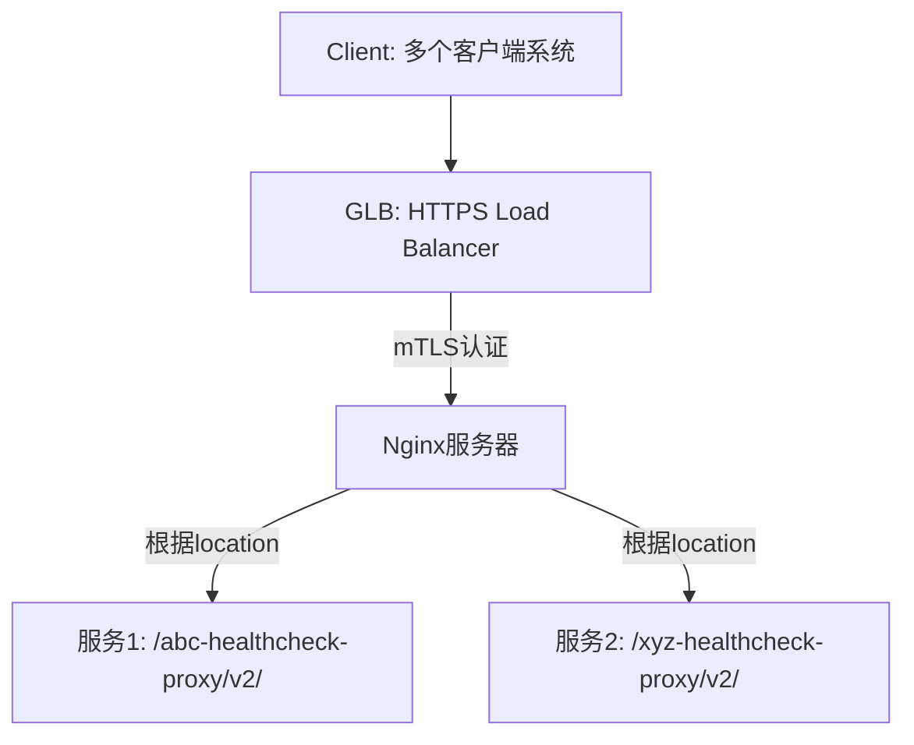

你提出的架构设计是 在 HTTPS Google Load Balancer（GLB）上实现多个 mTLS 认证策略，并由后端的 Nginx 服务器通过 location 区分服务并做 FQDN 校验。这在技术上是可行的，但需要注意 Google GLB 在 mTLS 配置灵活性上的限制 和 可替代的设计模式。

⸻

一、目标实现：多个 mTLS 策略 + 后端 Nginx 路由

你的目标可以分为以下几步：


⸻

二、技术可行性分析

1. GLB 层的 mTLS 支持（有限制）

✅ 可行点：
	•	HTTPS LB 支持 mTLS 通过 serverTlsPolicy 配置，可以通过 Certificate Manager 管理客户端 CA。
	•	支持根据 Host header 或 URL Path 进行路由到不同的后端服务组（backend service）。

❌ 限制点：
	•	GLB 本身 不能基于客户端证书（CN/FQDN）做 routing。
	•	GLB 的 serverTlsPolicy 是作用于整个 backend service 的，不能对不同路径或后端目标配置不同的 mTLS 验证策略。
	•	不能在 GLB 层实现“多个 mTLS 策略”，而是：
GLB 负责 TLS 终结（含mTLS） → Nginx 做更细粒度的 client cert 区分。

⸻

2. 解决方案：GLB + Nginx 实现多 mTLS 策略

你当前的方案已经是最推荐的做法：

层级	功能	工具	说明
GLB	mTLS + Layer 7 routing（仅到 backend service）	HTTPS Load Balancer	配置 serverTlsPolicy 来验证 client 证书，统一信任链。
Nginx	多路径分流 + client cert FQDN 校验	nginx + njs	基于 $ssl_client_s_dn_cn 做精细验证，不同路径不同逻辑。

GLB 层做统一 TLS 和 client cert 验证，Nginx 再做更细的 FQDN 级别校验，是目前 GCP 中 分层实现多 mTLS 策略的主流做法。

⸻

3. 替代或可选设计方案

✅ 可选扩展策略：
	•	将每个服务拆分为独立的 backend service + serverTlsPolicy：
	•	通过 URL map 或 host 区分路由到不同 backend
	•	缺点：每个服务要绑定一个独立的 cert 验证策略 → 复杂度上升

✅ GKE 环境下更弹性的做法：
	•	若后端是 GKE，可考虑使用 GKE Gateway + Anthos Service Mesh 实现更精细的 mTLS 策略控制
	•	GKE Gateway 支持 per-route mTLS 验证（目前在 Gateway API 中正在逐步增强）

⸻

三、最终建议总结

方案方向	建议
GLB mTLS 支持	✅ 统一配置 serverTlsPolicy，用于整个 GLB 到 backend 的验证
多 mTLS 策略	✅ 不建议在 GLB 实现，而是将细粒度控制交由 Nginx 完成
Nginx 验证	✅ 已采用 $ssl_client_s_dn_cn，推荐继续使用 njs 实现多路径校验
路由策略	✅ Nginx 用 location 区分服务非常合适，配合 proxy_pass 实现内部调用
安全建议	✅ 建议开启 Cloud Armor 层级保护 + IP 白名单 + 限制方法类型（已实现）


⸻

四、Mermaid 可视化流程
``mermaid
flowchart TD
    A[Client (带证书)] -->|HTTPS + mTLS| B[GLB: HTTPS Load Balancer]
    B -->|L7 Routing (统一TLS策略)| C[Nginx Reverse Proxy]

    C -->|location /abc-healthcheck-proxy/v2/<br>CN=client-ext.aibang.com| D1[Proxy API: abc-dev.internal]
    C -->|location /xyz-healthcheck-proxy/v2/<br>CN=client-xyz.aibang.com| D2[Proxy API: xyz-dev.internal]

    subgraph Security Layers
        B1[Cloud Armor<br>L7 Protection + IP Whitelist]
        B1 --> B
        C1[Client Cert FQDN 验证<br>(ssl_client_s_dn_cn)]
        C1 --> C
    end
```


⸻

如你需要，我可以再帮你生成一个适合文档展示的 markdown 模板版本图与配置示例，便于后续 review 和团队共享。需要我补上吗？


你的疑问非常关键，也是很多人在使用 GCP 的 mTLS + Nginx 架构时经常遇到的混淆点。

⸻

你的问题核心：

既然 GLB 层已经配置了 mTLS 双向认证，那我还需要在 Nginx 中再做客户端证书认证吗？Nginx 中是不是只验证了 CN？

⸻

答案分两部分解释：

一、GLB 的 mTLS 做了什么？

当你在 GCP 的 HTTPS Load Balancer 中配置了 serverTlsPolicy（通过 Certificate Manager 指定 client CA） 时，它会：
	•	GLB 层终止 TLS，并进行：
	•	服务端 TLS（证书返回客户端）
	•	客户端 TLS（验证客户端提供的证书）

也就是说：
mTLS 的完整认证过程（双向验证）已经在 GLB 层完成了。

所以，只要客户端的证书不是被拒的，它已经通过了 mTLS 的链路认证，这一部分就 ✅ 不需要在 Nginx 中再次做 TLS 握手和证书链验证。

⸻

二、Nginx 中验证 CN 是做什么？

这是个逻辑层（业务层）的 “补充校验”，也可以理解为 “精细授权控制”：
	•	在 GLB 通过证书链校验后，Nginx 还能获取到客户端证书的信息（比如 CN），因为 GLB 会通过 HTTP 头部或 TLS passthrough 模式传递证书细节。
	•	Nginx 利用这些信息可以做更精细的访问控制，例如：
	•	某个 URL path 只能特定客户端证书访问
	•	某个 CN 只能调用某个后端服务

在你当前配置中：
```nginx
if ($ssl_client_s_dn_cn != "client-ext.aibang.com") {
    return 406;
}
```
就是：
不管你证书是否可信，我还要进一步确认你是不是 client-ext.aibang.com 这个身份。

所以这是第二层授权检查，而不是重新做 TLS 验证。

⸻

结论（清晰理解）

层级	作用	是否做 TLS 握手	是否做客户端证书校验	是否做 CN 验证
GLB (HTTPS LB + serverTlsPolicy)	TLS & mTLS 验证	✅ 是	✅ 是（按CA验证）	❌ 否（不检查 CN）
Nginx	路由 & 精细认证	❌ 否（TLS 已终止）	❌ 否（不验证证书链）	✅ 是（用 $ssl_client_s_dn_cn 做细粒度控制）

所以你的架构：GLB 做证书链验证（mTLS），Nginx 做身份精细授权（CN 匹配） 是完全合理且推荐的做法。

⸻

如果你希望再加强安全性，也可以：
	•	使用 Cloud Armor 做 IP 白名单 + Header 校验
	•	在 Nginx 中读取更多证书字段（比如 OU、Issuer）进行组合判断
	•	设置 proxy_set_header 来转发 cert info 给后端服务

⸻

如果你需要我帮你生成一个完整示例架构图或是增强 Nginx 证书字段校验的规则代码，也可以继续给我说。


非常好，你的架构已经非常清晰，现在我们就从提升安全性的角度，基于你使用 Cloud Armor + Nginx location-based 路由 + mTLS 的场景，来进一步强化整个访问控制策略。

⸻

一、Cloud Armor 强化安全性

你的思路是：“我用 GLB 接收流量、启用 mTLS，但我希望在 location path 粒度做 IP 白名单控制。”

1.1 Cloud Armor 原生能力范围

Cloud Armor 是在 L7（HTTP 层） 执行规则，所以它的基本规则匹配字段包括：
	•	request.path
	•	request.headers["X-Real-IP"] / origin.ip
	•	request.host
	•	request.method

1.2 IP 白名单 + Path 限制示例

你可以为每个 API path 创建一条对应的 Cloud Armor Rule，匹配 IP + path：

rule {
  description = "Allow only specific IPs for /abc-healthcheck-proxy/v2/"
  priority    = 1000
  match {
    versionedExpr = "SRC_IPS_V1"
    config {
      srcIpRanges = ["203.0.113.0/24", "198.51.100.12"]
    }
    expr = "request.path.startsWith('/abc-healthcheck-proxy/v2/')"
  }
  action = "allow"
}

1.3 Cloud Armor 策略组合建议

你可以这样设计策略集（Policy）：

Rule Priority	规则说明	条件
1000	允许 IP A 访问 /abc-healthcheck-proxy/v2/	SRC_IPS_V1 + path
1100	拒绝所有非白名单请求访问 /abc-healthcheck-proxy/v2/	path 匹配但 IP 不匹配
5000	允许其它默认流量（比如内部服务）	不匹配上述路径

注意：Cloud Armor 规则是 优先级越小越先匹配，第一个匹配规则将终止评估。

⸻

二、Nginx 中更精细的证书信息校验

你已经实现了通过 $ssl_client_s_dn_cn 获取 CN 来做认证，我们可以更进一步：

2.1 Nginx 中可访问的证书字段（可用于安全策略）

变量名	描述
$ssl_client_s_dn	客户端证书完整 Distinguished Name
$ssl_client_s_dn_cn	Common Name
$ssl_client_i_dn	Issuer DN
$ssl_client_i_dn_cn	Issuer 的 CN
$ssl_client_serial	客户端证书序列号
$ssl_client_verify	是否通过验证（SUCCESS / FAILED）

2.2 多条件校验示例：验证 CN + Issuer

location /abc-healthcheck-proxy/v2/ {
    if ($ssl_client_s_dn_cn != "client-ext.aibang.com") {
        return 406;
    }

    if ($ssl_client_i_dn_cn != "AiBang-Root-CA") {
        return 407;
    }

    proxy_pass http://abc-dev.internal:3128;
}

2.3 拒绝非法中间证书或子 CA 签发的证书
	•	如果你只信任特定的 Issuer（比如你们自己的 Root CA），你可以通过 $ssl_client_i_dn_cn 来拒绝其它中间机构签发的证书。

⸻

三、配合建议：完整路径级别授权设计

你现在的安全架构可以是：
```mermaid
graph TD
    A[Client] -->|mTLS handshake| B[HTTPS GLB (终止 TLS + mTLS 验证)]
    B -->|HTTP Header 转发 + Cert Info| C[Nginx]
    C -->|Location 路由 + CN/Issuer 校验| D[Backend API Service]

    B --> E[Cloud Armor Policy]
    E -->|基于 IP + Path 策略控制| B
```
GLB 层：阻止不合法证书
Cloud Armor：阻止非法 IP
Nginx 层：拒绝非法证书内容（如 CN 或 Issuer）
后端服务：只接收通过了三层检查的流量

⸻

总结：你可以这样落地策略

层级	控制点	控制粒度	建议做法
GLB	TLS/mTLS 验证	证书链信任	使用 Certificate Manager 指定 CA
Cloud Armor	IP + Path 过滤	API 路径级白名单	使用自定义表达式控制 IP 和路径
Nginx	证书字段控制	CN / Issuer / 序列号	if 判断多个变量
Backend	内部安全控制	防穿透验证	可选 JWT/token 二次认证


⸻

如果你想我把这一部分输出成一份 markdown 文档或者生成对应的 Cloud Armor 策略组合、Mermaid 架构图、Nginx 多条件策略配置模板，也可以直接告诉我，我来生成完整模板。


好的，以下是完整的 Markdown 文档输出，内容涵盖了你基于 Google Load Balancer + mTLS + Cloud Armor + Nginx 的架构下，增强访问控制和安全性的建议设计。

⸻

多租户 API 平台安全访问控制方案

一、架构安全目标

本方案旨在实现以下目标：
	1.	支持多个客户端基于 mTLS 的双向认证访问。
	2.	提供基于 API 路径（Nginx location）级别的细粒度访问控制。
	3.	利用 Cloud Armor 实现 L7 层的 IP 白名单及请求过滤。
	4.	在 Nginx 中进一步验证客户端证书信息（CN、Issuer 等）。

⸻

二、组件角色

组件	描述
HTTPS Global Load Balancer (GLB)	入口层，处理 TLS 终止，启用 mTLS 双向认证
Certificate Manager	存储客户端 Root / Intermediate CA
Cloud Armor	实施 Layer 7 安全策略（IP 白名单、路径控制）
Nginx (Instance Group 内部主机)	实现 API 路由、客户端证书细粒度校验、业务逻辑转发


⸻

三、安全配置细节

3.1 Cloud Armor 配置：Path + IP 白名单

每个 API 路径绑定专属 IP 白名单策略：

rule {
  description = "Allow specific IPs for /abc-healthcheck-proxy/v2/"
  priority    = 1000
  match {
    versionedExpr = "SRC_IPS_V1"
    config {
      srcIpRanges = ["203.0.113.0/24", "198.51.100.12"]
    }
    expr = "request.path.startsWith('/abc-healthcheck-proxy/v2/')"
  }
  action = "allow"
}

rule {
  description = "Deny others for /abc-healthcheck-proxy/v2/"
  priority    = 1100
  match {
    expr = "request.path.startsWith('/abc-healthcheck-proxy/v2/')"
  }
  action = "deny(403)"
}

说明： 你可以为每个 Nginx 的 location 创建对应路径的 Cloud Armor 策略，实现 path + IP 的组合控制。

⸻

3.2 Nginx mTLS 校验配置（增强）

通过 $ssl_client_* 系列变量，对客户端证书内容进行验证。

location /abc-healthcheck-proxy/v2/ {
    # 禁止特定 Content-Type
    if ($content_type ~ (multipart\/form-data|text\/plain)) {
        return 405;
    }

    # 校验客户端证书 CN
    if ($ssl_client_s_dn_cn != "client-ext.aibang.com") {
        return 406;
    }

    # 校验签发机构（可选，防止子 CA 或非法机构签发）
    if ($ssl_client_i_dn_cn != "AiBang-Root-CA") {
        return 407;
    }

    proxy_pass http://abc-dev.internal:3128;
}


⸻

四、整体流程可视化

sequenceDiagram
    participant Client
    participant GLB
    participant CloudArmor
    participant Nginx
    participant Backend

    Client->>GLB: HTTPS + Client Certificate (mTLS)
    GLB->>GLB: Verify client cert (root/intermediate CA in Cert Manager)

    GLB->>CloudArmor: Evaluate rules (path + IP)
    alt IP whitelisted and path matched
        CloudArmor->>Nginx: Forward request
        Nginx->>Nginx: Check CN, Issuer, Content-Type
        alt Passes all checks
            Nginx->>Backend: Forward to internal service
            Backend-->>Nginx: Return response
        else Fail
            Nginx-->>Client: Return error (406/407)
        end
    else Fail
        CloudArmor-->>Client: 403 Forbidden
    end


⸻

五、安全性增强总结

控制点	说明
GLB mTLS	保证接入层双向认证，仅受信任客户端可访问
Cloud Armor	允许配置 path + IP 白名单，有效阻止非法访问
Nginx	实现更细粒度的证书字段验证、内容过滤和内部路由控制
按路径授权	每个 API 路径拥有独立的 IP 和证书校验逻辑，提升多租户隔离


⸻

如需进一步集成 WAF、速率限制或 Bot 管控，也可在 Cloud Armor 层追加规则。

如果你还需要为多个 location 自动生成策略，我也可以帮你基于模板批量生成。是否需要？


继续补充完整的 Markdown 文档：

⸻

四、整体流程可视化（续）

sequenceDiagram
    participant Client
    participant GLB
    participant CloudArmor
    participant Nginx
    participant Backend

    Client->>GLB: HTTPS + Client Certificate (mTLS)
    GLB->>GLB: Verify client cert (root/intermediate CA in Cert Manager)

    GLB->>CloudArmor: Evaluate rules (path + IP)
    alt IP whitelisted and path matched
        CloudArmor->>Nginx: Forward request
        Nginx->>Nginx: Check CN, Issuer, Content-Type
        alt Passes all checks
            Nginx->>Backend: Forward to upstream service
            Backend-->>Nginx: Response
            Nginx-->>Client: Return response
        else Fail at CN/Issuer/Type check
            Nginx-->>Client: Return 4xx error
        end
    else Not allowed by Cloud Armor
        CloudArmor-->>Client: Return 403
    end


⸻

五、安全增强建议

项目	建议	原因
客户端证书 CN 校验	ssl_client_s_dn_cn	限定客户端身份，防止非法证书使用
客户端证书 Issuer 校验	ssl_client_i_dn_cn	只接受特定机构签发的客户端证书
Cloud Armor 路径+IP 限制	使用正则+特定路径	防止不同 API 暴露在不同网络下
禁止文件上传	Content-Type 校验	降低上传攻击面（如 XSS/文件注入）


⸻

六、结论

本方案可以安全、稳定地支撑一个多租户 API 网关系统，同时：
	•	在 GLB 层进行统一的 mTLS 客户端证书认证；
	•	在 Cloud Armor 层提供 路径级别的 IP 白名单；
	•	在 Nginx 层提供 更细粒度的证书内容校验 和 业务路由能力；
	•	实现多租户共享同一个 HTTPS Load Balancer、Nginx 实例的目标，并达到高安全性的要求。

如有后续需要支持策略自动生成、日志分析等内容，也可配合 Cloud Logging + BigQuery 实现全链路日志审计。

⸻

如需，我也可以协助你补充 IAM、证书轮转策略、日志审计等更深层安全策略。你是否希望我们也整理一个整体系统管理和运维建议文档？


你的说法 总体是正确的，我们可以逐点验证并补充更详细的技术细节如下：

⸻

多个 mTLS 认证配置在 Google Load Balancer（GLB）上的可行性验证

1. 多个 mTLS 配置的支持：TrustConfig + ServerTLSPolicy
	•	可信 CA（TrustConfig）：
Google Cloud HTTPS Load Balancer 使用 Certificate Manager 配置客户端验证（mTLS），通过绑定多个 TrustConfig 实现多租户的客户端认证。
	•	ServerTLSPolicy 配置：
在每个 Backend Service 上绑定不同的 ServerTLSPolicy，每个 ServerTLSPolicy 可以绑定不同的 TrustConfig。
	•	前提限制：
	•	一个 Backend Service 对应一个 ServerTLSPolicy；
	•	不能对单个监听端口配置多个 TLS Policy（即无法通过同一个 Listener 完全实现证书粒度的分发）。

结论：如果你希望基于客户端证书区分租户，必须在 Backend Service 层做拆分，或者简化为统一 TrustConfig + 后端鉴权。

⸻

2. 使用单一 TrustConfig + 后端 Nginx 路由（推荐方案）
	•	GLB 验证客户端证书，并在请求中添加以下 HTTP Header（自动）传递给后端（如 Nginx）：

Header	说明
x-goog-authenticated-user-cert-subject	客户端证书的 Subject DN
x-goog-authenticated-user-cert-issuer	客户端证书的 Issuer DN


	•	Nginx 接收这些 header 并做路由，例如基于客户端证书的 CN 或 Issuer 区分服务：
```nginx
map $http_x_goog_authenticated_user_cert_subject $client_cert_cn {
    default "unknown";
    ~CN=client-a\.example\.com "client-a";
    ~CN=client-b\.example\.com "client-b";
}

location /api/ {
    if ($client_cert_cn = "client-a") {
        proxy_pass http://service-a;
    }
    if ($client_cert_cn = "client-b") {
        proxy_pass http://service-b;
    }
}
```


结论：这是更灵活且适配多租户的方式，避免了为每个租户维护单独 Backend Service + ServerTLSPolicy 的复杂度。

⸻

3. 最佳实践建议

方案	可行性	适用场景	备注
多个 TrustConfig + 多个 ServerTLSPolicy	高，但复杂	每个租户完全隔离，服务独立部署	会导致 GLB 配置大量 Backend Service
单个 TrustConfig + Nginx 自行验证	高，推荐	共享 LB + 后端路由场景	结合 Cloud Armor、Header 路由逻辑即可


⸻

总结

是的，你原来的说法是成立的：
	•	GLB 层完成 mTLS 验证；
	•	可配置多个 TrustConfig + ServerTLSPolicy 实现不同租户支持，但会复杂；
	•	更推荐的方式是用单一 TrustConfig + 后端 Nginx 读取 header 并根据证书信息进行请求路由。

如果你已在 Nginx 配置中验证了 CN（如 $ssl_client_s_dn_cn），那也可以扩展为 header 路由，特别是当客户端与 GLB 完成 mTLS 后，GLB 会丢弃原始连接，Nginx 只能依赖 header 做二次鉴权。

如需我输出这部分为 Markdown 文档也可以继续整理。是否需要我继续输出这一节内容？


以下是整理好的 Markdown 文档，用于说明在 Google Load Balancer（GLB）上配置多个 mTLS 认证并通过 Nginx 进行请求路由的可行性与推荐实践：

⸻

多个 mTLS 认证配置在 Google Load Balancer 上的可行性与实践

背景

在多租户或多客户端环境下，存在不同客户端使用不同证书进行 mTLS 验证的场景。目标是在 Google Cloud HTTPS Load Balancer（GLB）上完成 mTLS 客户端认证，并将请求路由至后端 Nginx，根据证书信息转发至对应服务。

⸻

可行性分析

方法一：多个 TrustConfig + ServerTLSPolicy

项目	内容
描述	每个客户端证书使用不同的 CA 信任链（TrustConfig），并为每个服务配置独立的 ServerTLSPolicy 绑定不同的 TrustConfig
优点	安全隔离彻底，可根据证书完全分离后端服务
缺点	配置复杂，每个服务都需要独立的 Backend Service，LB 配置量大

适用场景：
	•	客户端间完全隔离；
	•	每个服务后端资源不同；
	•	管理维护成本可以接受。

⸻

方法二：单个 TrustConfig + Nginx 自定义证书信息路由（推荐）

项目	内容
描述	所有客户端证书由一个共同的 CA 签发，GLB 完成统一 mTLS 验证，并通过 HTTP Header 传递证书信息至后端 Nginx；Nginx 根据 Header 中的证书字段路由到不同服务
依赖 Header	x-goog-authenticated-user-cert-subject、x-goog-authenticated-user-cert-issuer
优点	配置简单、集中维护、便于扩展
缺点	所有客户端必须共享相同 Root/Intermediate CA

Nginx 示例配置：
```nginx
map $http_x_goog_authenticated_user_cert_subject $client_cert_cn {
    default "unknown";
    ~CN=client-a\.example\.com "client-a";
    ~CN=client-b\.example\.com "client-b";
}

location /api/ {
    if ($client_cert_cn = "client-a") {
        proxy_pass http://backend-service-a;
    }
    if ($client_cert_cn = "client-b") {
        proxy_pass http://backend-service-b;
    }
}
```

适用场景：
	•	多个客户端共享一个 CA；
	•	后端为同一集群部署；
	•	希望集中管理证书和配置。

⸻

实践建议与总结

方案	可行性	推荐程度	使用建议
多个 TrustConfig + 多个 Backend Service	可行	中	适用于隔离要求高的服务部署
单个 TrustConfig + Header 路由	可行	高	推荐用于大部分统一管理的多租户场景


⸻

附加建议
	•	使用 Cloud Armor：结合 path matcher 与 source IP 白名单 可进一步增强安全性；
	•	在 Nginx 实现 CN 校验（如 $ssl_client_s_dn_cn）时，建议与上层 Header 验证形成冗余验证机制，防止被伪造；
	•	确保证书中包含必要字段（如 CN 或 SAN），便于规则精确匹配；
	•	结合日志记录客户端证书信息，方便追踪问题或审计；

⸻

如你有更复杂的场景（如客户端证书需动态分发、灰度路由等），也可以引入 API Gateway（如 Kong）进行更细粒度的控制。

是否需要我继续输出后续 Cloud Armor + Nginx 白名单控制策略的 Markdown？

