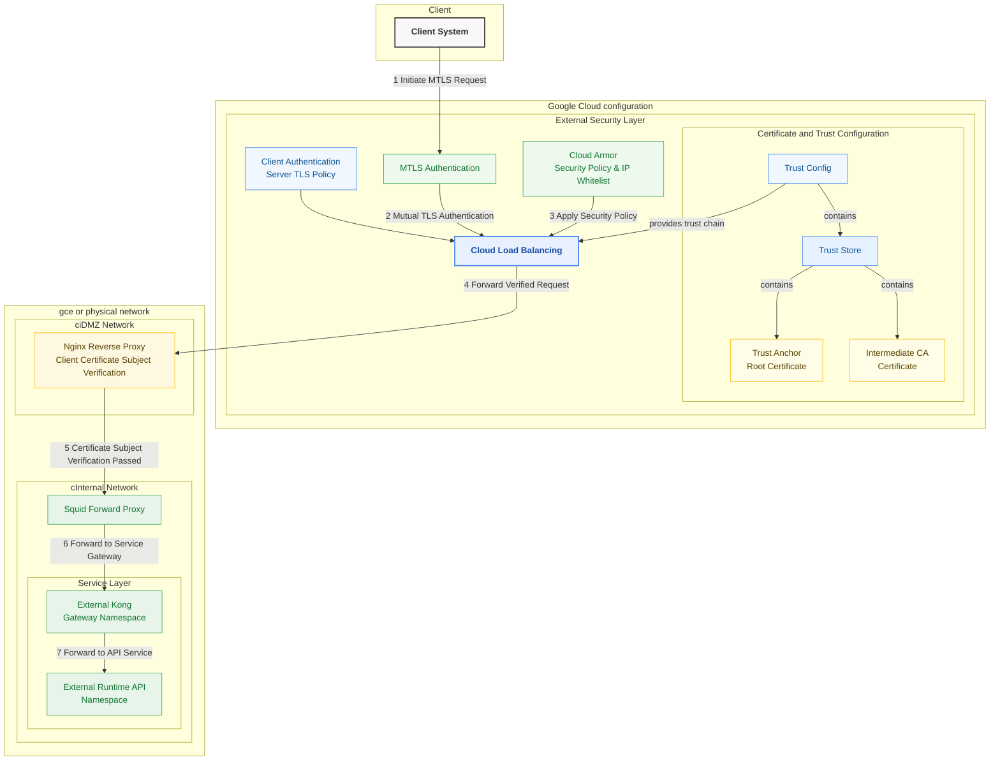

- summary flow log
对于我的整个流程现在如下. 而且这个是我已经跑通的流程,我现在有这样一些问题需要继续跟踪,比如我的客户端请求进来之后,我想具体的跟踪到所有的日志.而且我的backend-services 也是启用了日志的. 特别是为了校验CN,我在我的backend Service里面定义了一个customRequestHeaders 比如叫做
X-client-Cert-Leaf:{client_cert_leaf} 然后用nginx的njs模块进行
js_set $sse_client_s_dn_cn http.subjectcn;这样去获取这个head做CN校验了. 
我现在想要跟踪一个E2E的请求的所有日志 有没有好的办法.目前我看到的是在我的这个nginx日志中看不到更多的消息?或者信息.或者我是不是需要调整nginx的日志才能拿到这个信息?


好的，你的流程图清晰地展示了请求路径。要实现 E2E 请求跟踪并关联所有组件的日志，核心在于**确保有一个唯一的标识符（Trace ID）在请求的整个生命周期中传递，并且每个组件都能记录这个标识符**。

幸运的是，Google Cloud Load Balancer (GLB) 会自动为请求添加跟踪信息，这为我们提供了基础。

**解决方案：利用 GLB 的 Trace Context 和日志关联**

1.  **GLB 自动注入 Trace Context:**
    *   外部 HTTPS 负载均衡器（当你启用了 Cloud Trace 或日志记录时）会自动向后端发送的请求中添加 `X-Cloud-Trace-Context` HTTP 标头。
    *   这个标头的格式通常是 `TRACE_ID/SPAN_ID;o=TRACE_TRUE`。其中 `TRACE_ID` 是我们实现 E2E 跟踪的关键。

2.  **在 Nginx 中捕获并记录 Trace ID 和 Client CN:**
    *   **捕获 Trace ID:** 你可以通过 Nginx 变量 `$http_x_cloud_trace_context` 来访问 GLB 注入的完整标头。
    *   **捕获 Client CN:** 你已经通过 `X-client-Cert-Leaf` 自定义标头和 NJS 模块将其存入了 `$sse_client_s_dn_cn` 变量，这很好。
    *   **修改 Nginx 日志格式:** 你需要定义一个新的 `log_format`，将这两个关键信息以及其他需要的信息包含进去。

    **示例 Nginx `log_format` 定义 (在 `nginx.conf` 的 `http` 块中):**

    ```nginx
    http {
        # ... 其他 http 配置 ...

        # 定义 NJS 函数获取 CN (你已经有了)
        js_import utils from /etc/nginx/njs/http.js; # 假设你的 njs 文件路径
        js_set $sse_client_s_dn_cn utils.subjectcn;   # 假设你的 njs 函数名

        # 定义包含 Trace ID 和 Client CN 的日志格式
        log_format trace_json escape=json '{'
            '"time_local":"$time_local",'
            '"remote_addr":"$remote_addr",' # 看到的 IP (可能是 GLB IP)
            '"http_x_forwarded_for":"$http_x_forwarded_for",' # 真实客户端 IP (如果 GLB 配置了)
            '"request":"$request",'
            '"status":$status,'
            '"body_bytes_sent":$body_bytes_sent,'
            '"request_time":$request_time,'
            '"http_referer":"$http_referer",'
            '"http_user_agent":"$http_user_agent",'
            '"trace_id":"$http_x_cloud_trace_context",' # 捕获完整的 Trace Context Header
            '"client_cn":"$sse_client_s_dn_cn",' # 捕获你提取的 Client CN
            '"upstream_addr":"$upstream_addr",'
            '"upstream_status":"$upstream_status",'
            '"upstream_response_time":"$upstream_response_time"'
        '}';

        # ... 其他 http 配置 ...

        server {
            # ... server 配置 ...

            # 使用新的日志格式
            access_log /var/log/nginx/access.log trace_json;

            # ... location 配置 ...
        }
    }
    ```

    *   **关键点:**
        *   `$http_x_cloud_trace_context` 会记录如 `TRACE_ID/SPAN_ID;o=1` 这样的字符串。
        *   `$sse_client_s_dn_cn` 记录你通过 NJS 提取的 CN。
        *   推荐使用 JSON 格式 (`escape=json`)，这使得日志在 Cloud Logging 中更容易解析和搜索。

3.  **确保 Trace Context 在后续组件中传递:**
    *   **Nginx 到 Squid:** Nginx 默认不会将所有传入的请求头都转发给上游。你需要显式配置 Nginx 将 `X-Cloud-Trace-Context` 传递给 Squid。
        ```nginx
        location / {
            # ... 其他代理设置 ...
            proxy_pass http://your_squid_upstream;
            proxy_set_header Host $host;
            proxy_set_header X-Real-IP $remote_addr;
            proxy_set_header X-Forwarded-For $proxy_add_x_forwarded_for;
            proxy_set_header X-Forwarded-Proto $scheme;

            # !! 显式传递 Trace Context Header !!
            proxy_set_header X-Cloud-Trace-Context $http_x_cloud_trace_context;

            # !! (可选) 传递 Client CN (如果 Squid 或更下游需要) !!
            # proxy_set_header X-Client-Subject-CN $sse_client_s_dn_cn;
        }
        ```
    *   **Squid 到 Kong:** Squid 也需要配置以传递 `X-Cloud-Trace-Context` 头。这通常通过 `request_header_access` 或类似指令完成，允许该头部通过。Squid 的日志格式 (`logformat`) 也应配置为记录该头部 (`%<[X-Cloud-Trace-Context]h`)。
    *   **Kong 到 API Service:** Kong 通常对分布式跟踪有较好的支持。检查你的 Kong 配置，确保它能识别并传递 `X-Cloud-Trace-Context`（或其他标准跟踪头如 `traceparent`）。Kong 的日志插件（如 file-log, http-log）也需要配置为记录 Trace ID。
    *   **API Service:** 你的最终应用程序（API）也应该配置日志记录，以捕获并记录传入请求中的 `X-Cloud-Trace-Context` 头。

4.  **集中日志收集与分析:**
    *   **Cloud Logging Agent:** 在你的 Nginx、Squid、Kong 和 API Service 所在的 GCE 实例或容器中安装并配置 Cloud Logging Agent。确保 Agent 配置为收集你指定的日志文件（如 `/var/log/nginx/access.log`）并将其解析为 JSON（如果使用了 JSON 格式）。
    *   **Cloud Logging 查询:**
        *   一旦所有组件的日志都流入 Cloud Logging，你就可以使用日志浏览器进行查询。
        *   当你从 GLB 日志中找到一个特定请求的 `trace` 字段（这就是 `TRACE_ID`）时，你可以直接在 Cloud Logging 中搜索这个 `TRACE_ID`：
            ```
            trace="projects/YOUR_PROJECT_ID/traces/YOUR_TRACE_ID"
            ```
        *   或者，如果你在 Nginx 日志中记录了 `trace_id` 字段（如上面的 JSON 格式示例），你可以搜索：
            ```
            jsonPayload.trace_id:"YOUR_TRACE_ID/SPAN_ID;o=1"
            ```
            或者更精确地提取 TRACE_ID 部分进行搜索。
        *   这样就能将 GLB、Nginx、Squid、Kong、API Service 的日志条目关联起来，看到完整的请求流程。

5.  **利用 Cloud Trace (更高级):**
    *   由于你传递了 `X-Cloud-Trace-Context`，Google Cloud Trace 服务可以自动地将这些跨组件的日志（只要它们正确记录了 trace ID）关联起来，并生成一个可视化的分布式跟踪瀑布图。
    *   这能非常直观地展示请求在每个组件中花费的时间，帮助你快速定位性能瓶颈。
    *   你只需要确保 GLB 的日志记录已启用，并且下游服务正确传递并记录了 `X-Cloud-Trace-Context`，然后就可以在 Google Cloud Console 的 Trace 菜单中查看跟踪信息。

**总结:**

要实现 E2E 跟踪：

1.  **依赖 GLB 注入的 `X-Cloud-Trace-Context` 头。**
2.  **在 Nginx 中：**
    *   修改 `log_format` 以记录 `$http_x_cloud_trace_context` 和你的 `$sse_client_s_dn_cn`。推荐 JSON 格式。
    *   使用 `proxy_set_header` 将 `X-Cloud-Trace-Context` 传递给下一个组件 (Squid)。
3.  **在 Squid、Kong、API Service 中：**
    *   配置它们以传递 `X-Cloud-Trace-Context` 头。
    *   配置它们的日志记录以包含 `X-Cloud-Trace-Context` 头的内容。
4.  **使用 Cloud Logging Agent** 将所有日志集中到 Cloud Logging。
5.  **在 Cloud Logging 中** 使用 `trace` 字段或你记录的 `trace_id` 字段进行搜索，关联日志。
6.  **探索 Cloud Trace** 以获得可视化的分布式跟踪视图。

通过这种方式，即使 Nginx 日志本身只显示了部分信息，你也可以通过关联 `trace_id` 在 Cloud Logging 中看到请求从 GLB 进入到最终 API 处理的完整旅程。