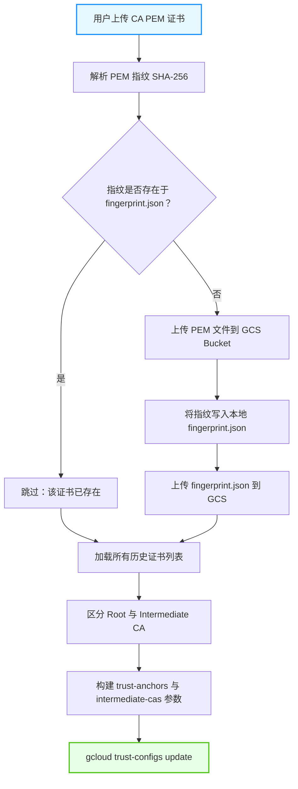

- [Q](#q)
- [FLow](#flow)
- [A](#a)
- [import](#import)

#  Q
我在使用Google的Manage trust configs来管理我的MTLS的用户证书
https://cloud.google.com/certificate-manager/docs/trust-configs?hl=zh-cn
我现在对下面命令有些疑惑
1 import
  gcloud certificate-manager trust-configs import
 https://cloud.google.com/sdk/gcloud/reference/certificate-manager/trust-configs/import
2 update
gcloud certificate-manager trust-configs update
https://cloud.google.com/sdk/gcloud/reference/certificate-manager/trust-configs/update
因为我的环境中比如已经导入过一些证书信息,我现在是想确保新的证书能被增量到trust config 

# FLow

# A


我需要你写一个这样的脚本.需求如下 验证fingerprint 因为要支持增量所以可以把这个fingerprint信息存储在Buckets里面比如叫做ca-fingerprint.yaml或者fingerprint.json
大概流程如下
[用户上传CA证书] --> [提取证书指纹SHA-256] 判断指纹是否已经存在
如果存在则返回已存在提示,如果不存在则继续存储指纹信息到fingerprint.json文件中 ,写入指纹存储到Bucket中
下一步需要更新Trust Config
gcloud certificate-manager trust-configs update
注意这里需要使用覆盖的命令来实现增量更新

# import

这是个非常关键的问题，下面是 权威解释：

⸻

🔍 gcloud certificate-manager trust-configs import 行为详解

根据 官方文档 和实际行为：

✅ 如果指定的 Trust Config 不存在：
	•	会创建一个新的 Trust Config。
	•	相当于 create 的效果，不会报错。

⚠️ 如果指定的 Trust Config 已经存在：
	•	会报错 ❗️：
ALREADY_EXISTS: trust config '<name>' already exists
	•	✅ 不会覆盖旧的 trust config，你需要使用 update 才能修改它。

⸻

📌 总结

| 场景 | 结果 | 备注 |
|------|------|------|
| Trust Config 不存在 | 自动创建 | 等价于 create |
| Trust Config 已存在 | 报错 ALREADY_EXISTS | 不会覆盖，需用 update |


⸻

✅ 正确使用建议

| 操作 | 命令 | 使用时机 |
|------|------|----------|
| 首次创建 | gcloud certificate-manager trust-configs import | 用户 Onboarding 阶段首次导入 |
| 后续追加或修改 | gcloud certificate-manager trust-configs update | 合并旧内容 + 新内容后更新配置 |


⸻

如果你希望实现：

“没有就新建，有就更新”

你需要在脚本里加一个 是否存在的判断逻辑。比如：
```bash
gcloud certificate-manager trust-configs describe "${TRUST_CONFIG_NAME}" \
  --location="${LOCATION}" \
  --project="${PROJECT_ID}" >/dev/null 2>&1

if [ $? -eq 0 ]; then
  echo "Trust config exists, going to update..."
  # merge + gcloud certificate-manager trust-configs update
else
  echo "Trust config does not exist, going to import..."
  # gcloud certificate-manager trust-configs import
fi
```
需要我给你写一个完整的自动化脚本样例吗？包括 fingerprint 检查 + bucket 读取 + import/update 逻辑全流程。

太好了！以下是 ✅ 最终版 Shell 脚本，满足你所有需求：
	•	✅ 支持证书增量更新
	•	✅ 校验 SHA-256 fingerprint
	•	✅ 使用 gcloud certificate-manager trust-configs update + --trust-store=trust-anchors=... 模式
	•	✅ 使用 GCS bucket 存储 fingerprint 和证书
	•	✅ 保留历史证书内容并追加新证书

⸻

🧩 自动化 Trust Config 管理脚本（完整可运行版）
```bash
#!/bin/bash
set -euo pipefail

# === 输入参数 ===
TRUST_CONFIG_NAME="my-trust-config"
PROJECT_ID="your-gcp-project-id"
LOCATION="global"
BUCKET_NAME="your-ca-bucket-name"
FINGERPRINT_FILE="fingerprint.json"
TMP_DIR="/tmp/ca-processing"
NEW_CA_FILES=("a-root.pem" "a-int.pem")  # 👈 替换为用户新上传的证书文件名

mkdir -p "$TMP_DIR"

# === 下载或初始化 fingerprint.json ===
FINGERPRINT_PATH="${TMP_DIR}/${FINGERPRINT_FILE}"
gsutil cp "gs://${BUCKET_NAME}/${FINGERPRINT_FILE}" "$FINGERPRINT_PATH" || echo "{}" > "$FINGERPRINT_PATH"

declare -A existing_fingerprints
while read -r fingerprint file; do
  existing_fingerprints["$fingerprint"]="$file"
done < <(jq -r 'to_entries[] | "\(.key) \(.value)"' "$FINGERPRINT_PATH")

# === 新证书处理 ===
for pem in "${NEW_CA_FILES[@]}"; do
  if [[ ! -f "$pem" ]]; then
    echo "证书文件 $pem 不存在！"
    exit 1
  fi

  fingerprint=$(openssl x509 -in "$pem" -noout -fingerprint -sha256 | cut -d'=' -f2 | tr -d ':')

  if [[ -n "${existing_fingerprints[$fingerprint]:-}" ]]; then
    echo "指纹 $fingerprint 已存在，跳过：$pem"
    continue
  fi

  echo "新增证书：$pem (fingerprint: $fingerprint)"
  gsutil cp "$pem" "gs://${BUCKET_NAME}/trust-config/${pem}"
  existing_fingerprints["$fingerprint"]="$pem"
done

# === 更新 fingerprint.json 到 bucket ===
{
  echo '{'
  first=1
  for fp in "${!existing_fingerprints[@]}"; do
    [[ $first -eq 0 ]] && echo ',' || first=0
    printf '  "%s": "%s"' "$fp" "${existing_fingerprints[$fp]}"
  done
  echo ''
  echo '}'
} > "$FINGERPRINT_PATH"

gsutil cp "$FINGERPRINT_PATH" "gs://${BUCKET_NAME}/${FINGERPRINT_FILE}"

# === 构建 trust-anchors 和 intermediate-cas 路径 ===
ALL_ROOT_CERTS=()
ALL_INT_CERTS=()

for fp in "${!existing_fingerprints[@]}"; do
  pem_file="${existing_fingerprints[$fp]}"
  gsutil cp "gs://${BUCKET_NAME}/trust-config/${pem_file}" "${TMP_DIR}/${pem_file}"
  subject=$(openssl x509 -in "${TMP_DIR}/${pem_file}" -noout -subject)
  issuer=$(openssl x509 -in "${TMP_DIR}/${pem_file}" -noout -issuer)

  if [[ "$subject" == "$issuer" ]]; then
    ALL_ROOT_CERTS+=("${pem_file}")
  else
    ALL_INT_CERTS+=("${pem_file}")
  fi
done

# === 构造 GCS 路径字符串 ===
ROOT_PEMS=$(IFS=\; ; echo "${ALL_ROOT_CERTS[*]}")
ROOT_PEMS=$(echo "${ROOT_PEMS// /}")
ROOT_PEMS=$(printf "gs://%s/trust-config/%s" "${BUCKET_NAME}" "${ROOT_PEMS//;/\",gs://${BUCKET_NAME}/trust-config/}")

INT_PEMS=$(IFS=\, ; echo "${ALL_INT_CERTS[*]}")
INT_PEMS=$(echo "${INT_PEMS// /}")
INT_PEMS=$(printf "gs://%s/trust-config/%s" "${BUCKET_NAME}" "${INT_PEMS//,/\",gs://${BUCKET_NAME}/trust-config/}")

# === 更新 Trust Config ===
echo "更新 Trust Config：$TRUST_CONFIG_NAME"
gcloud certificate-manager trust-configs update "${TRUST_CONFIG_NAME}" \
  --description="Updated trust config for ${TRUST_CONFIG_NAME}" \
  --location="${LOCATION}" \
  --project="${PROJECT_ID}" \
  --trust-store="trust-anchors=\"${ROOT_PEMS}\",intermediate-cas=\"${INT_PEMS}\""
```


⸻

📦 示例目录结构建议

你可以将所有证书 + 这个脚本 + README 放在一个目录，比如：
```bash
trust-config/
├── a-root.pem
├── a-int.pem
├── update-trust-config.sh   👈 就是上面这个脚本
```


⸻

🧪 下一步建议
	•	替换你的 PROJECT_ID、BUCKET_NAME、TRUST_CONFIG_NAME
	•	放入你实际上传的 PEM 文件名（支持多个）
	•	运行即可完成自动 fingerprint 管理 + trust config 更新

⸻

需要我再帮你把这个包装成 Cloud Build/Pipeline 流程，或者变成 Docker 镜像吗？还是你会直接从 CI 流水线里触发这个脚本？