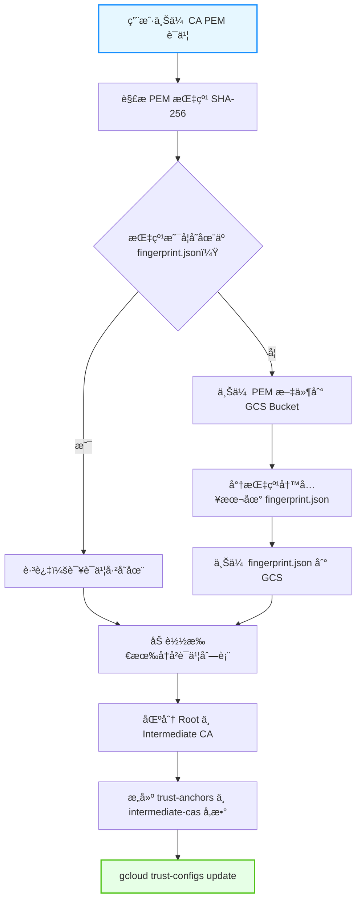

- [Q](#q)
- [FLow](#flow)
- [A](#a)
- [import](#import)

#  Q
我在使用Googleçš„Manage trust configsæ¥ç®¡ç†æˆ‘çš„MTLS的用户è¯ä¹¦
https://cloud.google.com/certificate-manager/docs/trust-configs?hl=zh-cn
我ç°åœ¨å¯¹ä¸‹é¢å‘½ä»¤æœ‰äº›ç–‘惑
1 import
  gcloud certificate-manager trust-configs import
 https://cloud.google.com/sdk/gcloud/reference/certificate-manager/trust-configs/import
2 update
gcloud certificate-manager trust-configs update
https://cloud.google.com/sdk/gcloud/reference/certificate-manager/trust-configs/update
因为我的ç¯å¢ƒä¸­æ¯”如已ç»å¯¼å…¥è¿‡ä¸€äº›è¯ä¹¦ä¿¡æ¯,我ç°åœ¨æ˜¯æƒ³ç¡®ä¿æ–°çš„è¯ä¹¦èƒ½è¢«å¢é‡åˆ°trust config 

# FLow

# A


我需è¦ä½ å†™ä¸€ä¸ªè¿™æ ·çš„脚本.需求如下 验è¯fingerprint 因为è¦æ”¯æŒå¢é‡æ‰€ä»¥å¯ä»¥æŠŠè¿™ä¸ªfingerprintä¿¡æ¯å­˜å‚¨åœ¨Buckets里é¢æ¯”如å«åšca-fingerprint.yaml或者fingerprint.json
大概æµç¨‹å¦‚下
[用户上传CAè¯ä¹¦] --> [æå–è¯ä¹¦æŒ‡çº¹SHA-256] 判断指纹是å¦å·²ç»å­˜åœ¨
如æœå­˜åœ¨åˆ™è¿”å›å·²å­˜åœ¨æ示,如æœä¸å­˜åœ¨åˆ™ç»§ç»­å­˜å‚¨æŒ‡çº¹ä¿¡æ¯åˆ°fingerprint.json文件中 ,写入指纹存储到Bucket中
下一步需è¦æ›´æ–°Trust Config
gcloud certificate-manager trust-configs update
注æ„这里需è¦ä½¿ç”¨è¦†ç›–的命令æ¥å®ç°å¢é‡æ›´æ–°

# import

这是个é常关键的问题，下é¢æ˜¯ æƒå¨è§£é‡Šï¼š

⸻

🔠gcloud certificate-manager trust-configs import 行为详解

æ ¹æ® å®˜æ–¹æ–‡æ¡£ å’Œå®é™…行为：

✅ 如æœæŒ‡å®šçš„ Trust Config ä¸å­˜åœ¨ï¼š
	•	会创建一个新的 Trust Config。
	•	ç›¸å½“äº create 的效æœï¼Œä¸ä¼šæŠ¥é”™ã€‚

âš ï¸ å¦‚æœæŒ‡å®šçš„ Trust Config å·²ç»å­˜åœ¨ï¼š
	•	会报错 â—ï¸ï¼š
ALREADY_EXISTS: trust config '<name>' already exists
	•	✅ ä¸ä¼šè¦†ç›–旧的 trust config，你需è¦ä½¿ç”¨ update æ‰èƒ½ä¿®æ”¹å®ƒã€‚

⸻

📌 总结

| 场景 | ç»“æœ | 备注 |
|------|------|------|
| Trust Config ä¸å­˜åœ¨ | 自动创建 | ç­‰ä»·äº create |
| Trust Config 已存在 | 报错 ALREADY_EXISTS | ä¸ä¼šè¦†ç›–，需用 update |


⸻

✅ 正确使用建议

| æ“作 | 命令 | 使用时机 |
|------|------|----------|
| 首次创建 | gcloud certificate-manager trust-configs import | 用户 Onboarding 阶段首次导入 |
| å续追加或修改 | gcloud certificate-manager trust-configs update | åˆå¹¶æ—§å†…容 + 新内容åæ›´æ–°é…ç½® |


⸻

如æœä½ å¸Œæœ›å®ç°ï¼š

“没有就新建，有就更新â€

你需è¦åœ¨è„šæœ¬é‡ŒåŠ ä¸€ä¸ª 是å¦å­˜åœ¨çš„判断逻辑。比如：
```bash
gcloud certificate-manager trust-configs describe "${TRUST_CONFIG_NAME}" \
  --location="${LOCATION}" \
  --project="${PROJECT_ID}" >/dev/null 2>&1

if [ $? -eq 0 ]; then
  echo "Trust config exists, going to update..."
  # merge + gcloud certificate-manager trust-configs update
else
  echo "Trust config does not exist, going to import..."
  # gcloud certificate-manager trust-configs import
fi
```
需è¦æˆ‘给你写一个完整的自动化脚本样例å—？包括 fingerprint 检查 + bucket è¯»å– + import/update 逻辑全æµç¨‹ã€‚

太好了ï¼ä»¥ä¸‹æ˜¯ ✅ 最终版 Shell 脚本，满足你所有需求：
	•	✅ 支æŒè¯ä¹¦å¢é‡æ›´æ–°
	•	✅ 校验 SHA-256 fingerprint
	•	✅ 使用 gcloud certificate-manager trust-configs update + --trust-store=trust-anchors=... 模å¼
	•	✅ 使用 GCS bucket 存储 fingerprint å’Œè¯ä¹¦
	•	✅ ä¿ç•™å†å²è¯ä¹¦å†…容并追加新è¯ä¹¦

⸻

🧩 自动化 Trust Config 管ç†è„šæœ¬ï¼ˆå®Œæ•´å¯è¿è¡Œç‰ˆï¼‰
```bash
#!/bin/bash
set -euo pipefail

# === 输入å‚æ•° ===
TRUST_CONFIG_NAME="my-trust-config"
PROJECT_ID="your-gcp-project-id"
LOCATION="global"
BUCKET_NAME="your-ca-bucket-name"
FINGERPRINT_FILE="fingerprint.json"
TMP_DIR="/tmp/ca-processing"
NEW_CA_FILES=("a-root.pem" "a-int.pem")  # 👈 替æ¢ä¸ºç”¨æˆ·æ–°ä¸Šä¼ çš„è¯ä¹¦æ–‡ä»¶å

mkdir -p "$TMP_DIR"

# === 下载或åˆå§‹åŒ– fingerprint.json ===
FINGERPRINT_PATH="${TMP_DIR}/${FINGERPRINT_FILE}"
gsutil cp "gs://${BUCKET_NAME}/${FINGERPRINT_FILE}" "$FINGERPRINT_PATH" || echo "{}" > "$FINGERPRINT_PATH"

declare -A existing_fingerprints
while read -r fingerprint file; do
  existing_fingerprints["$fingerprint"]="$file"
done < <(jq -r 'to_entries[] | "\(.key) \(.value)"' "$FINGERPRINT_PATH")

# === æ–°è¯ä¹¦å¤„ç† ===
for pem in "${NEW_CA_FILES[@]}"; do
  if [[ ! -f "$pem" ]]; then
    echo "è¯ä¹¦æ–‡ä»¶ $pem ä¸å­˜åœ¨ï¼"
    exit 1
  fi

  fingerprint=$(openssl x509 -in "$pem" -noout -fingerprint -sha256 | cut -d'=' -f2 | tr -d ':')

  if [[ -n "${existing_fingerprints[$fingerprint]:-}" ]]; then
    echo "指纹 $fingerprint 已存在，跳过：$pem"
    continue
  fi

  echo "æ–°å¢è¯ä¹¦ï¼š$pem (fingerprint: $fingerprint)"
  gsutil cp "$pem" "gs://${BUCKET_NAME}/trust-config/${pem}"
  existing_fingerprints["$fingerprint"]="$pem"
done

# === 更新 fingerprint.json 到 bucket ===
{
  echo '{'
  first=1
  for fp in "${!existing_fingerprints[@]}"; do
    [[ $first -eq 0 ]] && echo ',' || first=0
    printf '  "%s": "%s"' "$fp" "${existing_fingerprints[$fp]}"
  done
  echo ''
  echo '}'
} > "$FINGERPRINT_PATH"

gsutil cp "$FINGERPRINT_PATH" "gs://${BUCKET_NAME}/${FINGERPRINT_FILE}"

# === æ„建 trust-anchors å’Œ intermediate-cas 路径 ===
ALL_ROOT_CERTS=()
ALL_INT_CERTS=()

for fp in "${!existing_fingerprints[@]}"; do
  pem_file="${existing_fingerprints[$fp]}"
  gsutil cp "gs://${BUCKET_NAME}/trust-config/${pem_file}" "${TMP_DIR}/${pem_file}"
  subject=$(openssl x509 -in "${TMP_DIR}/${pem_file}" -noout -subject)
  issuer=$(openssl x509 -in "${TMP_DIR}/${pem_file}" -noout -issuer)

  if [[ "$subject" == "$issuer" ]]; then
    ALL_ROOT_CERTS+=("${pem_file}")
  else
    ALL_INT_CERTS+=("${pem_file}")
  fi
done

# === æ„造 GCS 路径字符串 ===
ROOT_PEMS=$(IFS=\; ; echo "${ALL_ROOT_CERTS[*]}")
ROOT_PEMS=$(echo "${ROOT_PEMS// /}")
ROOT_PEMS=$(printf "gs://%s/trust-config/%s" "${BUCKET_NAME}" "${ROOT_PEMS//;/\",gs://${BUCKET_NAME}/trust-config/}")

INT_PEMS=$(IFS=\, ; echo "${ALL_INT_CERTS[*]}")
INT_PEMS=$(echo "${INT_PEMS// /}")
INT_PEMS=$(printf "gs://%s/trust-config/%s" "${BUCKET_NAME}" "${INT_PEMS//,/\",gs://${BUCKET_NAME}/trust-config/}")

# === æ›´æ–° Trust Config ===
echo "更新 Trust Config：$TRUST_CONFIG_NAME"
gcloud certificate-manager trust-configs update "${TRUST_CONFIG_NAME}" \
  --description="Updated trust config for ${TRUST_CONFIG_NAME}" \
  --location="${LOCATION}" \
  --project="${PROJECT_ID}" \
  --trust-store="trust-anchors=\"${ROOT_PEMS}\",intermediate-cas=\"${INT_PEMS}\""
```


⸻

📦 示例目录结æ„建议

ä½ å¯ä»¥å°†æ‰€æœ‰è¯ä¹¦ + 这个脚本 + README 放在一个目录，比如：
```bash
trust-config/
├── a-root.pem
├── a-int.pem
├── update-trust-config.sh   👈 就是上é¢è¿™ä¸ªè„šæœ¬
```


⸻

🧪 下一步建议
	•	替æ¢ä½ çš„ PROJECT_IDã€BUCKET_NAMEã€TRUST_CONFIG_NAME
	•	放入你å®é™…上传的 PEM 文件å（支æŒå¤šä¸ªï¼‰
	•	è¿è¡Œå³å¯å®Œæˆè‡ªåŠ¨ fingerprint ç®¡ç† + trust config æ›´æ–°

⸻

需è¦æˆ‘å†å¸®ä½ æŠŠè¿™ä¸ªåŒ…è£…æˆ Cloud Build/Pipeline æµç¨‹ï¼Œæˆ–者å˜æˆ Docker é•œåƒå—？还是你会直æ¥ä» CI æµæ°´çº¿é‡Œè§¦å‘这个脚本？