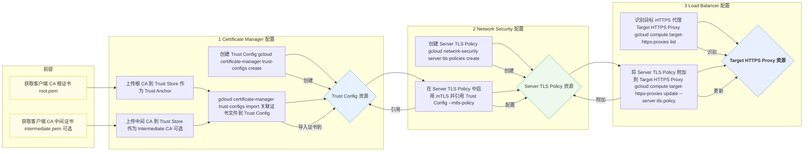
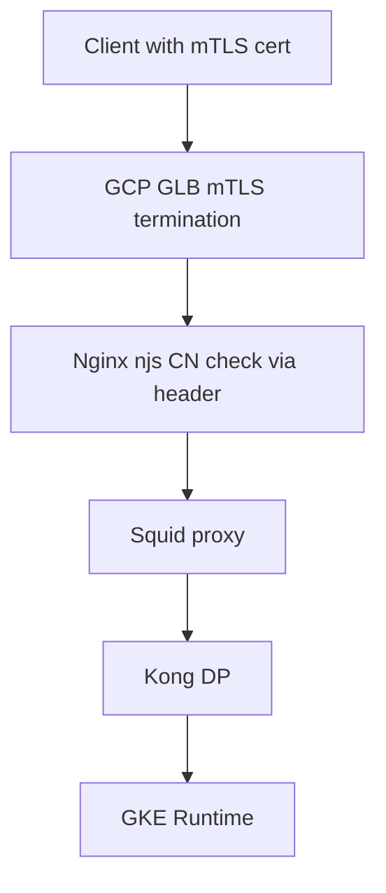

在 Google Cloud HTTPS 负载均衡 (GLB) 的 MTLS 配置下，需要管理客户端证书，而 Google 提供了一些产品来简化这个过程，包括 Google Cloud Certificate Manager 和 Google Cloud IAM 的 CA (Certificate Authority) 相关功能。


```bash
#!/bin/bash

# --- Configuration ---
# Replace with your actual trust config name
TRUST_CONFIG_NAME="your-trust-config-name"
# Replace with the location of your trust config (e.g., global, us-central1)
LOCATION="global"
# Optional: Replace with your Google Cloud project ID if not using the default configured one
# PROJECT_ID="your-project-id"

# --- Script Logic ---
echo "Describing Trust Config: $TRUST_CONFIG_NAME in location $LOCATION..."

# Construct the gcloud command
GCLOUD_COMMAND="gcloud certificate-manager trust-configs describe $TRUST_CONFIG_NAME --location=$LOCATION"

# Add project ID if specified
if [ -n "$PROJECT_ID" ]; then
  GCLOUD_COMMAND="$GCLOUD_COMMAND --project=$PROJECT_ID"
fi

# Execute the command
eval $GCLOUD_COMMAND

# Check the exit status of the gcloud command
if [ $? -eq 0 ]; then
  echo "Successfully described trust config '$TRUST_CONFIG_NAME'."
else
  echo "Error describing trust config '$TRUST_CONFIG_NAME'." >&2
  exit 1
fi

exit 0

```
⸻

1. 你需要管理的证书类型

在 MTLS (Mutual TLS) 认证下，涉及两类证书：
	1.	服务器端证书：用于 HTTPS 服务器认证，由 GLB 终止 TLS 连接（Server-Side TLS）。
	2.	客户端证书：用于客户端身份验证（Client Authentication），GLB 需要验证客户端证书是否可信。

⸻

2. 适用的 Google Cloud 产品

| Google Cloud 产品 | 作用 |
| --- | --- |
| Google Cloud Certificate Manager | 用于管理 服务器端 SSL/TLS 证书，GLB 可直接引用此证书进行 HTTPS 终止 |
| Google Cloud Private CA | 创建和管理 客户端证书 (Client Certificates)，用于 MTLS 认证 |
| Cloud IAM Policy (Identity & Access Management) | 可配合 Private CA 实现更细粒度的访问控制，限制哪些客户端可以访问 |


⸻

3. 你的 MTLS 解决方案

(1) 服务器证书 (GLB 终止 HTTPS)：
	•	你可以使用 Google Cloud Certificate Manager 来管理 HTTPS 证书，并将其绑定到 GLB。
	•	GLB 终止 TLS 后，将解密的请求转发给后端。

(2) 客户端证书管理 (MTLS 验证)：
	•	你需要使用 Google Cloud Private CA 颁发客户端证书，并提供给受信任的客户端使用。
	•	在 GLB 的 SSL Policy 里启用 MTLS，并上传受信任的 根 CA 证书 (Root CA Certificate) 以便 GLB 进行客户端证书验证。

(3) 额外的安全策略
	•	Cloud Armor：用于基于客户端 IP、HTTP Header 或其他规则进行白名单管理。
	•	GLB 后端：GLB 可以在 HTTP Header 中传递 X-SSL-Client-Cert，Nginx 可以继续解析并进行额外的验证，例如主题名称检查。

⸻

4. 具体实现步骤

(1) 服务器端 HTTPS 证书
	1.	在 Google Cloud Certificate Manager 创建 HTTPS 证书：
```bash
gcloud certificate-manager certificates create my-server-cert \
    --domains=my-api.example.com \
    --managed
```

	2.	将证书绑定到 HTTPS 负载均衡：
```bash
gcloud compute ssl-policies create my-ssl-policy \
    --profile MODERN \
    --min-tls-version 1.2
```

	3.	配置 HTTPS 负载均衡并关联 SSL 证书。

(2) 客户端证书管理
	1.	创建 Google Cloud Private CA
```bash
gcloud privateca authorities create my-client-ca \
    --location=us-central1 \
    --tier=dev \
    --pool=my-cert-pool \
    --key-algorithm=rsa-pkcs1-4096-sha256
```

	2.	生成并签发客户端证书
```bash
gcloud privateca certificates create my-client-cert \
    --issuer-pool=my-cert-pool \
    --subject="CN=client.example.com,O=MyCompany" \
    --generate-key \
    --key-output-file=client-key.pem \
    --cert-output-file=client-cert.pem
```

	3.	将根 CA 证书上传到 GLB
```bash
gcloud compute ssl-policies update my-ssl-policy \
    --custom-ca-certs=root-ca.pem
```

	4.	在 GLB 启用 MTLS ==> Using this one success 
```bash

gcloud compute target-https-proxies update my-proxy \
    --ssl-policy=my-ssl-policy
```


⸻

5. 后端 (Nginx) 配置

GLB 解析 HTTPS 后，会通过 X-SSL-Client-Cert 传递客户端证书：
```yaml
server {
    listen 443 ssl;

    ssl_certificate /etc/nginx/ssl/server.pem;
    ssl_certificate_key /etc/nginx/ssl/server-key.pem;

    location / {
        set $client_cert $http_x_ssl_client_cert;

        if ($client_cert ~ "CN=allowed-client") {
            # 允许访问
        }

        proxy_pass http://backend-service;
    }
}
```


1. 额外的 Cloud Armor 配置

你可以用 Cloud Armor 进行白名单控制：
```bash
gcloud compute security-policies rules create 1000 \
    --security-policy=my-policy \
    --expression="request.headers['X-SSL-Client-Cert'] =~ 'CN=allowed-client'"
```


1. 方案总结
	•	✅ GLB 负责 HTTPS 终止，并启用 MTLS 进行客户端身份验证。
	•	✅ Google Cloud Certificate Manager 管理 服务器证书。
	•	✅ Google Cloud Private CA 颁发 客户端证书，GLB 进行验证。
	•	✅ Cloud Armor 进行白名单和安全策略控制。
	•	✅ GLB 通过 X-SSL-Client-Cert 传递客户端证书到后端 Nginx，Nginx 进行额外检查。

这样，你的 HTTPS GLB 可以保持 原有的 MTLS 逻辑，并且大大简化了 nginx 的配置，不需要手动管理客户端证书，而是让 Google Cloud Private CA 来管理证书的颁发和验证。🚀


好的，我们来详细分解和可视化在 Google Cloud 中配置 mTLS 所需的证书管理、信任配置和负载均衡器关联的过程，并提供相应的 `gcloud` 命令。

**核心流程概述**

1.  **准备 CA 证书:** 您需要拥有颁发客户端证书的 CA 的根证书和任何中间 CA 证书（PEM 格式）。
2.  **创建 Trust Config:** 在 Certificate Manager 中创建一个 `Trust Config` 资源。这是定义信任策略的容器。
3.  **创建 Trust Store 并上传 CA:** 在 `Trust Config` 内部，定义一个 `Trust Store`，并将您的 CA 证书作为 `Trust Anchors`（根 CA）和/或 `Intermediate CAs` 上传到这里。
4.  **创建 Server TLS Policy:** 在 Network Security 中创建一个 `Server TLS Policy`。此策略定义负载均衡器的 TLS 行为，包括客户端证书验证。
5.  **配置 mTLS 并关联 Trust Config:** 在 `Server TLS Policy` 中，启用 mTLS 客户端验证，并将其指向您在 Certificate Manager 中创建的 `Trust Config`。
6.  **将 Server TLS Policy 附加到负载均衡器:** 将创建的 `Server TLS Policy` 附加到您的外部 HTTPS 负载均衡器的目标 HTTPS 代理（Target HTTPS Proxy）。

**可视化流程 (Mermaid)**



**命令行实现 (`gcloud`)**

**前提:**

*   您已经安装并配置了 `gcloud` CLI。
*   您已经登录到您的 Google Cloud 账号 (`gcloud auth login`)。
*   您已经设置了您的项目 ID (`gcloud config set project YOUR_PROJECT_ID`)。
*   您拥有必要的 IAM 权限（例如 `certificatemanager.trustconfigs.*`, `networksecurity.serverTlsPolicies.*`, `compute.targetHttpsProxies.setServerTlsPolicy`）。
*   您已经将需要信任的客户端 CA 的根证书保存为 `root.pem` 文件。
*   如果需要，您已经将中间 CA 证书保存为 `intermediate.pem` 文件。

**步骤 1: 配置 Certificate Manager (Trust Config & Trust Store)**

```bash
# 变量设置 (请替换为您自己的值)
export TRUST_CONFIG_NAME="my-client-trust-config"
export ROOT_CA_FILE="root.pem"
# export INTERMEDIATE_CA_FILE="intermediate.pem" # 如果有中间 CA，取消注释此行
export REGION="global" # 对于 Global External HTTPS LB, Trust Config 必须是 global
export PROJECT_ID=$(gcloud config get-value project)

# -- 创建 Trust Config 并导入 CA 证书 --
# 注意: gcloud certificate-manager trust-configs import 可以同时创建并导入
# 构建导入命令参数
IMPORT_ARGS=(
    "$TRUST_CONFIG_NAME"
    "--location=$REGION"
    "--project=$PROJECT_ID"
    "--trust-anchor=file=$ROOT_CA_FILE,pem-certificate"
)

# 如果有中间 CA 文件，添加到参数中
if [ -n "$INTERMEDIATE_CA_FILE" ] && [ -f "$INTERMEDIATE_CA_FILE" ]; then
  IMPORT_ARGS+=("--intermediate-ca=file=$INTERMEDIATE_CA_FILE,pem-certificate")
fi

# 执行创建和导入命令
echo "正在创建 Trust Config 并导入证书..."
gcloud certificate-manager trust-configs import "${IMPORT_ARGS[@]}" --description="Trust config for client certificate validation"

# (可选) 验证 Trust Config 是否创建
echo "验证 Trust Config..."
gcloud certificate-manager trust-configs describe "$TRUST_CONFIG_NAME" --location="$REGION" --project="$PROJECT_ID"
```

**步骤 2: 创建 Server TLS Policy 并关联 Trust Config**

```bash
# 变量设置 (请替换为您自己的值)
export POLICY_NAME="my-mtls-policy"
export REGION="global" # 对于 Global External HTTPS LB, Server TLS Policy 必须是 global
export TRUST_CONFIG_RESOURCE="//certificatemanager.googleapis.com/projects/$PROJECT_ID/locations/$REGION/trustConfigs/$TRUST_CONFIG_NAME"

# -- 创建 Server TLS Policy --
# clientValidationMode='REJECT_INVALID': 强制要求有效客户端证书，否则拒绝连接
# clientValidationMode='ALLOW_INVALID_OR_MISSING_CLIENT_CERT': 允许无效或缺失的证书，但会将证书信息（如果存在）传递给后端
# 根据您的需求选择，通常 mTLS 强制验证使用 REJECT_INVALID
echo "正在创建 Server TLS Policy..."
gcloud network-security server-tls-policies create "$POLICY_NAME" \
    --location="$REGION" \
    --project="$PROJECT_ID" \
    --description="mTLS policy requiring client cert validation" \
    --mtls-policy="clientValidationMode=REJECT_INVALID,clientValidationTrustConfig=$TRUST_CONFIG_RESOURCE"

# (可选) 验证 Server TLS Policy 是否创建
echo "验证 Server TLS Policy..."
gcloud network-security server-tls-policies describe "$POLICY_NAME" --location="$REGION" --project="$PROJECT_ID"
```

**步骤 3: 将 Server TLS Policy 附加到负载均衡器**

```bash
# 变量设置 (请替换为您自己的值)
export LB_PROXY_NAME="your-lb-https-proxy-name" # 替换为您的负载均衡器目标 HTTPS 代理名称
export POLICY_RESOURCE="//networksecurity.googleapis.com/projects/$PROJECT_ID/locations/$REGION/serverTlsPolicies/$POLICY_NAME"

# -- 首先，找到您的 Target HTTPS Proxy 名称 --
# 如果不确定名称，可以列出所有全局 Target HTTPS Proxies
# gcloud compute target-https-proxies list --global --project="$PROJECT_ID"

# -- 将 Server TLS Policy 附加到 Target HTTPS Proxy --
echo "正在将 Server TLS Policy 附加到 Target HTTPS Proxy..."
gcloud compute target-https-proxies update "$LB_PROXY_NAME" \
    --global \
    --project="$PROJECT_ID" \
    --server-tls-policy="$POLICY_RESOURCE"

# (可选) 验证 Target HTTPS Proxy 配置是否更新
echo "验证 Target HTTPS Proxy 配置..."
gcloud compute target-https-proxies describe "$LB_PROXY_NAME" --global --project="$PROJECT_ID" | grep "serverTlsPolicy"
```

**重要注意事项:**

*   **地域性:** 对于**外部 HTTPS 负载均衡器 (Global)**，其关联的 `Server TLS Policy` 和 `Trust Config` **都必须在 `global` 区域** 创建。
*   **传播时间:** 配置更改（尤其是附加策略到负载均衡器）可能需要几分钟才能完全生效。
*   **证书格式:** 确保证书文件是有效的 PEM 格式。
*   **`clientValidationMode`:** 仔细选择 `REJECT_INVALID` 或 `ALLOW_INVALID_OR_MISSING_CLIENT_CERT`。
    *   `REJECT_INVALID`: GLB 会严格验证客户端证书链，无效则直接拒绝 TLS 握手。这是最常见的 mTLS 强制模式。
    *   `ALLOW_INVALID_OR_MISSING_CLIENT_CERT`: GLB 尝试验证，但即使失败或客户端未提供证书，也会允许连接继续（如果其他条件满足），并将证书信息（如果存在）通过 `X-Forwarded-Client-Cert` 头传递给后端。这允许您在后端（如 Nginx）进行更复杂的逻辑判断，但 GLB 本身没有完全强制 mTLS。根据您的需求 “整个过程我要求实现MTLS”，`REJECT_INVALID` 可能更合适。
*   **错误处理:** 如果 `gcloud` 命令失败，请仔细检查错误消息、您的权限、资源名称和文件路径。

完成这些步骤后，您的 Google Cloud 外部 HTTPS 负载均衡器就配置好了 mTLS，它会要求客户端提供证书，并根据您上传的 CA 证书进行验证。


# Q 
我想了解GCP GLB certificate management 仅仅做证书校验？ 那么有没有一个说法他会将证书传递到后端？ 比如我后面是一个Nginx 用 njs 做CN校验 我们基于不同的location 分配不同的CN 在这个nginx 后面是 squid 把请求转发到我内部网络的Kong dp. GKE runtime 


你提到的架构包含：

- GCP Global Load Balancer (GLB) + **mTLS**
    
- 后端是 **Nginx（含 njs 模块做 client certificate 的 CN 校验）**
    
- Nginx 后面是 **Squid**
    
- Squid 转发到 **内部网络中的 Kong DP（GKE Runtime）**
    

---

### **✅ 回答你的核心问题：**

  

> **GCP GLB 的 Certificate Manager 的作用是否只是做证书校验？是否会将 client certificate 传递到后端？**

  

### **📌 答案是：**

  

**GCP HTTPS Load Balancer（包括 mTLS 配置）不会将客户端证书本体或其字段（如 CN）传递到后端服务。**

  

> Google GLB（Layer 7）**终止 TLS + 验证证书**，**不会将原始 client cert 透传**，也不会自动加到 header 传给你后端。

---

### **🔐 GCP GLB 的 mTLS 行为解析：**

|**功能**|**是否支持**|**说明**|
|---|---|---|
|客户端证书校验（TrustConfig）|✅ 支持|GLB 层会用 TrustConfig 中的 CA 来验证客户端证书|
|支持多个 CA|✅ 支持|TrustConfig 可以配置多个 CA|
|将 client cert 向后透传|❌ 不支持|不会将 client cert、其 CN、fingerprint 等内容发送至后端|
|插入 cert 信息到 header|❌ 不支持|不会自动插入 header（如 X-Client-Cert），需要你手动 workaround|

---

## **🔄 ✅ 解决方案建议：如何在 GCP GLB 之后获取 Client 证书信息？**

  

### **方法 1：使用** 

### **自托管 TLS 终止**

### **（GLB TCP 或内网 Internal LB）**

- 使用 TCP Load Balancer 或 Internal Load Balancer
    
- 将 TLS termination 移至 Nginx，使其可以 access 到 full cert
    

  

> 🚧 缺点：牺牲 HTTPS GLB 的功能，如 Cloud Armor、WAF、CDN、Header 插入、GCLB global IP

---

### **方法 2：GLB + Nginx 模拟 Cert 校验（推荐你目前方向）**

  

#### **📌 你可以这样操作：**

1. **GLB 只负责 mTLS 校验（TrustConfig）**
    
2. 后端（你的 Nginx）使用 Header 做逻辑判断，比如：
    

```
# GLB 不提供原始 cert，因此你需要让 client 发一个自定义 header 表明身份
location /cn-app-a {
    if ($http_x_client_cn != "team-a-client") {
        return 403;
    }
}
```

你可以通过让客户端 curl 时带上 -H "x-client-cn: team-a-client"，然后在 Nginx njs 里面判断 CN 或签发者等。

  

#### **🚧 但注意：**

- GCP 不允许客户端随意伪造 header 来冒充别人。所以此方法必须依赖 mTLS 中 TrustConfig **限制的 CA** 来保障 header 的可信性。
    
- 为了防止伪造，你还可以结合 **Cloud Armor 的 header enforcement 或 IP allowlist**。
    

---

### **方法 3：让客户端主动上传 cert 内容（可选）**

  

客户端 curl 时用 base64 encode cert，自定义 header：

```
curl https://your-domain.com/ \
  --cert client.crt --key client.key \
  -H "X-Client-Cert: $(base64 < client.crt)"
```

你在 Nginx 中 decode 后可分析 cert 信息，但注意：

- 不推荐这么做用于正式场景（header 有长度限制，容易被中间设备截断）
    
- 安全性依赖于 mTLS 层的信任配置
    

---

### **✅ 推荐你的架构做法总结：**



|**层级**|**功能**|
|---|---|
|GLB|mTLS 校验，终止 TLS|
|Nginx|基于 header 模拟 CN 校验（njs）|
|Squid|透明代理|
|Kong DP|处理业务请求|

---

### **📌 小结**

|**问题**|**是否可行**|**备注**|
|---|---|---|
|GLB 传 client cert 给后端|❌ 不支持|不可直接获取|
|Nginx 校验 CN（GLB后）|✅ 可行|需配合 header 或自定义 metadata|
|自定义 header 携带 cert CN|✅ 可行|注意保护 header，不被伪造|
|client 自己送上 cert 内容|⚠️ 有风险|长度、复杂度、保密性问题，建议仅用于调试或私有通道场景|

---

如果你希望我帮你写一段 **njs 脚本 + Nginx 配置**，支持不同 CN 的路由，请告诉我你的规则（如 CN → location 映射），我可以生成配置模板。