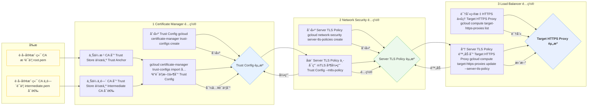

在 Google Cloud HTTPS è´Ÿè½½å‡è¡¡ (GLB) çš„ MTLS é…置下，需è¦ç®¡ç†å®¢æˆ·ç«¯è¯ä¹¦ï¼Œè€Œ Google æ供了一些产å“æ¥ç®€åŒ–这个过程，包括 Google Cloud Certificate Manager å’Œ Google Cloud IAM çš„ CA (Certificate Authority) 相关功能。


```bash
#!/bin/bash

# --- Configuration ---
# Replace with your actual trust config name
TRUST_CONFIG_NAME="your-trust-config-name"
# Replace with the location of your trust config (e.g., global, us-central1)
LOCATION="global"
# Optional: Replace with your Google Cloud project ID if not using the default configured one
# PROJECT_ID="your-project-id"

# --- Script Logic ---
echo "Describing Trust Config: $TRUST_CONFIG_NAME in location $LOCATION..."

# Construct the gcloud command
GCLOUD_COMMAND="gcloud certificate-manager trust-configs describe $TRUST_CONFIG_NAME --location=$LOCATION"

# Add project ID if specified
if [ -n "$PROJECT_ID" ]; then
  GCLOUD_COMMAND="$GCLOUD_COMMAND --project=$PROJECT_ID"
fi

# Execute the command
eval $GCLOUD_COMMAND

# Check the exit status of the gcloud command
if [ $? -eq 0 ]; then
  echo "Successfully described trust config '$TRUST_CONFIG_NAME'."
else
  echo "Error describing trust config '$TRUST_CONFIG_NAME'." >&2
  exit 1
fi

exit 0

```
⸻

1. 你需è¦ç®¡ç†çš„è¯ä¹¦ç±»å‹

在 MTLS (Mutual TLS) 认è¯ä¸‹ï¼Œæ¶‰åŠä¸¤ç±»è¯ä¹¦ï¼š
	1.	æœåŠ¡å™¨ç«¯è¯ä¹¦ï¼šç”¨äº HTTPS æœåŠ¡å™¨è®¤è¯ï¼Œç”± GLB 终止 TLS è¿æ¥ï¼ˆServer-Side TLS）。
	2.	客户端è¯ä¹¦ï¼šç”¨äºå®¢æˆ·ç«¯èº«ä»½éªŒè¯ï¼ˆClient Authentication），GLB 需è¦éªŒè¯å®¢æˆ·ç«¯è¯ä¹¦æ˜¯å¦å¯ä¿¡ã€‚

⸻

2. 适用的 Google Cloud 产å“

| Google Cloud äº§å“ | 作用 |
| --- | --- |
| Google Cloud Certificate Manager | 用äºç®¡ç† æœåŠ¡å™¨ç«¯ SSL/TLS è¯ä¹¦ï¼ŒGLB å¯ç›´æ¥å¼•ç”¨æ­¤è¯ä¹¦è¿›è¡Œ HTTPS 终止 |
| Google Cloud Private CA | åˆ›å»ºå’Œç®¡ç† å®¢æˆ·ç«¯è¯ä¹¦ (Client Certificates)ï¼Œç”¨äº MTLS è®¤è¯ |
| Cloud IAM Policy (Identity & Access Management) | å¯é…åˆ Private CA å®ç°æ›´ç»†ç²’度的访问æ§åˆ¶ï¼Œé™åˆ¶å“ªäº›å®¢æˆ·ç«¯å¯ä»¥è®¿é—® |


⸻

3. 你的 MTLS 解决方案

(1) æœåŠ¡å™¨è¯ä¹¦ (GLB 终止 HTTPS)：
	•	ä½ å¯ä»¥ä½¿ç”¨ Google Cloud Certificate Manager æ¥ç®¡ç† HTTPS è¯ä¹¦ï¼Œå¹¶å°†å…¶ç»‘定到 GLB。
	•	GLB 终止 TLS å，将解密的请求转å‘ç»™å端。

(2) 客户端è¯ä¹¦ç®¡ç† (MTLS 验è¯)：
	•	你需è¦ä½¿ç”¨ Google Cloud Private CA é¢å‘客户端è¯ä¹¦ï¼Œå¹¶æ供给å—信任的客户端使用。
	•	在 GLB çš„ SSL Policy 里å¯ç”¨ MTLS，并上传å—信任的 æ ¹ CA è¯ä¹¦ (Root CA Certificate) 以便 GLB 进行客户端è¯ä¹¦éªŒè¯ã€‚

(3) é¢å¤–的安全策略
	•	Cloud Armor：用äºåŸºäºå®¢æˆ·ç«¯ IPã€HTTP Header 或其他规则进行白åå•ç®¡ç†ã€‚
	•	GLB å端：GLB å¯ä»¥åœ¨ HTTP Header 中传递 X-SSL-Client-Cert，Nginx å¯ä»¥ç»§ç»­è§£æ并进行é¢å¤–的验è¯ï¼Œä¾‹å¦‚主题å称检查。

⸻

4. 具体å®ç°æ­¥éª¤

(1) æœåŠ¡å™¨ç«¯ HTTPS è¯ä¹¦
	1.	在 Google Cloud Certificate Manager 创建 HTTPS è¯ä¹¦ï¼š
```bash
gcloud certificate-manager certificates create my-server-cert \
    --domains=my-api.example.com \
    --managed
```

	2.	å°†è¯ä¹¦ç»‘定到 HTTPS è´Ÿè½½å‡è¡¡ï¼š
```bash
gcloud compute ssl-policies create my-ssl-policy \
    --profile MODERN \
    --min-tls-version 1.2
```

	3.	é…ç½® HTTPS è´Ÿè½½å‡è¡¡å¹¶å…³è” SSL è¯ä¹¦ã€‚

(2) 客户端è¯ä¹¦ç®¡ç†
	1.	创建 Google Cloud Private CA
```bash
gcloud privateca authorities create my-client-ca \
    --location=us-central1 \
    --tier=dev \
    --pool=my-cert-pool \
    --key-algorithm=rsa-pkcs1-4096-sha256
```

	2.	生æˆå¹¶ç­¾å‘客户端è¯ä¹¦
```bash
gcloud privateca certificates create my-client-cert \
    --issuer-pool=my-cert-pool \
    --subject="CN=client.example.com,O=MyCompany" \
    --generate-key \
    --key-output-file=client-key.pem \
    --cert-output-file=client-cert.pem
```

	3.	将根 CA è¯ä¹¦ä¸Šä¼ åˆ° GLB
```bash
gcloud compute ssl-policies update my-ssl-policy \
    --custom-ca-certs=root-ca.pem
```

	4.	在 GLB å¯ç”¨ MTLS ==> Using this one success 
```bash

gcloud compute target-https-proxies update my-proxy \
    --ssl-policy=my-ssl-policy
```


⸻

5. å端 (Nginx) é…ç½®

GLB 解æ HTTPS å，会通过 X-SSL-Client-Cert 传递客户端è¯ä¹¦ï¼š
```yaml
server {
    listen 443 ssl;

    ssl_certificate /etc/nginx/ssl/server.pem;
    ssl_certificate_key /etc/nginx/ssl/server-key.pem;

    location / {
        set $client_cert $http_x_ssl_client_cert;

        if ($client_cert ~ "CN=allowed-client") {
            # å…许访问
        }

        proxy_pass http://backend-service;
    }
}
```


1. é¢å¤–çš„ Cloud Armor é…ç½®

ä½ å¯ä»¥ç”¨ Cloud Armor 进行白åå•æ§åˆ¶ï¼š
```bash
gcloud compute security-policies rules create 1000 \
    --security-policy=my-policy \
    --expression="request.headers['X-SSL-Client-Cert'] =~ 'CN=allowed-client'"
```


1. 方案总结
	•	✅ GLB è´Ÿè´£ HTTPS 终止，并å¯ç”¨ MTLS 进行客户端身份验è¯ã€‚
	•	✅ Google Cloud Certificate Manager ç®¡ç† æœåŠ¡å™¨è¯ä¹¦ã€‚
	•	✅ Google Cloud Private CA é¢å‘ 客户端è¯ä¹¦ï¼ŒGLB 进行验è¯ã€‚
	•	✅ Cloud Armor 进行白åå•å’Œå®‰å…¨ç­–ç•¥æ§åˆ¶ã€‚
	•	✅ GLB 通过 X-SSL-Client-Cert 传递客户端è¯ä¹¦åˆ°å端 Nginx，Nginx 进行é¢å¤–检查。

这样，你的 HTTPS GLB å¯ä»¥ä¿æŒ åŸæœ‰çš„ MTLS 逻辑，并且大大简化了 nginx çš„é…置，ä¸éœ€è¦æ‰‹åŠ¨ç®¡ç†å®¢æˆ·ç«¯è¯ä¹¦ï¼Œè€Œæ˜¯è®© Google Cloud Private CA æ¥ç®¡ç†è¯ä¹¦çš„é¢å‘和验è¯ã€‚🚀


好的，我们æ¥è¯¦ç»†åˆ†è§£å’Œå¯è§†åŒ–在 Google Cloud 中é…ç½® mTLS 所需的è¯ä¹¦ç®¡ç†ã€ä¿¡ä»»é…置和负载å‡è¡¡å™¨å…³è”的过程，并æ供相应的 `gcloud` 命令。

**核心æµç¨‹æ¦‚è¿°**

1.  **准备 CA è¯ä¹¦:** 您需è¦æ‹¥æœ‰é¢å‘客户端è¯ä¹¦çš„ CA çš„æ ¹è¯ä¹¦å’Œä»»ä½•ä¸­é—´ CA è¯ä¹¦ï¼ˆPEM æ ¼å¼ï¼‰ã€‚
2.  **创建 Trust Config:** 在 Certificate Manager 中创建一个 `Trust Config` 资æºã€‚这是定义信任策略的容器。
3.  **创建 Trust Store 并上传 CA:** 在 `Trust Config` 内部，定义一个 `Trust Store`，并将您的 CA è¯ä¹¦ä½œä¸º `Trust Anchors`（根 CA）和/或 `Intermediate CAs` 上传到这里。
4.  **创建 Server TLS Policy:** 在 Network Security 中创建一个 `Server TLS Policy`。此策略定义负载å‡è¡¡å™¨çš„ TLS 行为，包括客户端è¯ä¹¦éªŒè¯ã€‚
5.  **é…ç½® mTLS å¹¶å…³è” Trust Config:** 在 `Server TLS Policy` 中，å¯ç”¨ mTLS 客户端验è¯ï¼Œå¹¶å°†å…¶æŒ‡å‘您在 Certificate Manager 中创建的 `Trust Config`。
6.  **å°† Server TLS Policy 附加到负载å‡è¡¡å™¨:** 将创建的 `Server TLS Policy` 附加到您的外部 HTTPS è´Ÿè½½å‡è¡¡å™¨çš„目标 HTTPS 代ç†ï¼ˆTarget HTTPS Proxy）。

**å¯è§†åŒ–æµç¨‹ (Mermaid)**



**命令行å®ç° (`gcloud`)**

**å‰æ:**

*   您已ç»å®‰è£…并é…置了 `gcloud` CLI。
*   您已ç»ç™»å½•åˆ°æ‚¨çš„ Google Cloud è´¦å· (`gcloud auth login`)。
*   您已ç»è®¾ç½®äº†æ‚¨çš„项目 ID (`gcloud config set project YOUR_PROJECT_ID`)。
*   您拥有必è¦çš„ IAM æƒé™ï¼ˆä¾‹å¦‚ `certificatemanager.trustconfigs.*`, `networksecurity.serverTlsPolicies.*`, `compute.targetHttpsProxies.setServerTlsPolicy`）。
*   您已ç»å°†éœ€è¦ä¿¡ä»»çš„客户端 CA çš„æ ¹è¯ä¹¦ä¿å­˜ä¸º `root.pem` 文件。
*   如æœéœ€è¦ï¼Œæ‚¨å·²ç»å°†ä¸­é—´ CA è¯ä¹¦ä¿å­˜ä¸º `intermediate.pem` 文件。

**步骤 1: é…ç½® Certificate Manager (Trust Config & Trust Store)**

```bash
# å˜é‡è®¾ç½® (请替æ¢ä¸ºæ‚¨è‡ªå·±çš„值)
export TRUST_CONFIG_NAME="my-client-trust-config"
export ROOT_CA_FILE="root.pem"
# export INTERMEDIATE_CA_FILE="intermediate.pem" # 如æœæœ‰ä¸­é—´ CA，å–消注释此行
export REGION="global" # å¯¹äº Global External HTTPS LB, Trust Config 必须是 global
export PROJECT_ID=$(gcloud config get-value project)

# -- 创建 Trust Config 并导入 CA è¯ä¹¦ --
# 注æ„: gcloud certificate-manager trust-configs import å¯ä»¥åŒæ—¶åˆ›å»ºå¹¶å¯¼å…¥
# æ„建导入命令å‚æ•°
IMPORT_ARGS=(
    "$TRUST_CONFIG_NAME"
    "--location=$REGION"
    "--project=$PROJECT_ID"
    "--trust-anchor=file=$ROOT_CA_FILE,pem-certificate"
)

# 如æœæœ‰ä¸­é—´ CA 文件，添加到å‚数中
if [ -n "$INTERMEDIATE_CA_FILE" ] && [ -f "$INTERMEDIATE_CA_FILE" ]; then
  IMPORT_ARGS+=("--intermediate-ca=file=$INTERMEDIATE_CA_FILE,pem-certificate")
fi

# 执行创建和导入命令
echo "正在创建 Trust Config 并导入è¯ä¹¦..."
gcloud certificate-manager trust-configs import "${IMPORT_ARGS[@]}" --description="Trust config for client certificate validation"

# (å¯é€‰) éªŒè¯ Trust Config 是å¦åˆ›å»º
echo "éªŒè¯ Trust Config..."
gcloud certificate-manager trust-configs describe "$TRUST_CONFIG_NAME" --location="$REGION" --project="$PROJECT_ID"
```

**步骤 2: 创建 Server TLS Policy å¹¶å…³è” Trust Config**

```bash
# å˜é‡è®¾ç½® (请替æ¢ä¸ºæ‚¨è‡ªå·±çš„值)
export POLICY_NAME="my-mtls-policy"
export REGION="global" # å¯¹äº Global External HTTPS LB, Server TLS Policy 必须是 global
export TRUST_CONFIG_RESOURCE="//certificatemanager.googleapis.com/projects/$PROJECT_ID/locations/$REGION/trustConfigs/$TRUST_CONFIG_NAME"

# -- 创建 Server TLS Policy --
# clientValidationMode='REJECT_INVALID': 强制è¦æ±‚有效客户端è¯ä¹¦ï¼Œå¦åˆ™æ‹’ç»è¿æ¥
# clientValidationMode='ALLOW_INVALID_OR_MISSING_CLIENT_CERT': å…许无效或缺失的è¯ä¹¦ï¼Œä½†ä¼šå°†è¯ä¹¦ä¿¡æ¯ï¼ˆå¦‚æœå­˜åœ¨ï¼‰ä¼ é€’ç»™å端
# æ ¹æ®æ‚¨çš„需求选择，通常 mTLS 强制验è¯ä½¿ç”¨ REJECT_INVALID
echo "正在创建 Server TLS Policy..."
gcloud network-security server-tls-policies create "$POLICY_NAME" \
    --location="$REGION" \
    --project="$PROJECT_ID" \
    --description="mTLS policy requiring client cert validation" \
    --mtls-policy="clientValidationMode=REJECT_INVALID,clientValidationTrustConfig=$TRUST_CONFIG_RESOURCE"

# (å¯é€‰) éªŒè¯ Server TLS Policy 是å¦åˆ›å»º
echo "éªŒè¯ Server TLS Policy..."
gcloud network-security server-tls-policies describe "$POLICY_NAME" --location="$REGION" --project="$PROJECT_ID"
```

**步骤 3: å°† Server TLS Policy 附加到负载å‡è¡¡å™¨**

```bash
# å˜é‡è®¾ç½® (请替æ¢ä¸ºæ‚¨è‡ªå·±çš„值)
export LB_PROXY_NAME="your-lb-https-proxy-name" # 替æ¢ä¸ºæ‚¨çš„è´Ÿè½½å‡è¡¡å™¨ç›®æ ‡ HTTPS 代ç†å称
export POLICY_RESOURCE="//networksecurity.googleapis.com/projects/$PROJECT_ID/locations/$REGION/serverTlsPolicies/$POLICY_NAME"

# -- 首先，找到您的 Target HTTPS Proxy å称 --
# 如æœä¸ç¡®å®šå称，å¯ä»¥åˆ—出所有全局 Target HTTPS Proxies
# gcloud compute target-https-proxies list --global --project="$PROJECT_ID"

# -- 将 Server TLS Policy 附加到 Target HTTPS Proxy --
echo "正在将 Server TLS Policy 附加到 Target HTTPS Proxy..."
gcloud compute target-https-proxies update "$LB_PROXY_NAME" \
    --global \
    --project="$PROJECT_ID" \
    --server-tls-policy="$POLICY_RESOURCE"

# (å¯é€‰) éªŒè¯ Target HTTPS Proxy é…置是å¦æ›´æ–°
echo "éªŒè¯ Target HTTPS Proxy é…ç½®..."
gcloud compute target-https-proxies describe "$LB_PROXY_NAME" --global --project="$PROJECT_ID" | grep "serverTlsPolicy"
```

**é‡è¦æ³¨æ„事项:**

*   **地域性:** 对äº**外部 HTTPS è´Ÿè½½å‡è¡¡å™¨ (Global)**，其关è”çš„ `Server TLS Policy` å’Œ `Trust Config` **都必须在 `global` 区域** 创建。
*   **传播时间:** é…置更改（尤其是附加策略到负载å‡è¡¡å™¨ï¼‰å¯èƒ½éœ€è¦å‡ åˆ†é’Ÿæ‰èƒ½å®Œå…¨ç”Ÿæ•ˆã€‚
*   **è¯ä¹¦æ ¼å¼:** ç¡®ä¿è¯ä¹¦æ–‡ä»¶æ˜¯æœ‰æ•ˆçš„ PEM æ ¼å¼ã€‚
*   **`clientValidationMode`:** 仔细选择 `REJECT_INVALID` 或 `ALLOW_INVALID_OR_MISSING_CLIENT_CERT`。
    *   `REJECT_INVALID`: GLB 会严格验è¯å®¢æˆ·ç«¯è¯ä¹¦é“¾ï¼Œæ— æ•ˆåˆ™ç›´æ¥æ‹’ç» TLS æ¡æ‰‹ã€‚这是最常è§çš„ mTLS 强制模å¼ã€‚
    *   `ALLOW_INVALID_OR_MISSING_CLIENT_CERT`: GLB å°è¯•éªŒè¯ï¼Œä½†å³ä½¿å¤±è´¥æˆ–客户端未æä¾›è¯ä¹¦ï¼Œä¹Ÿä¼šå…许è¿æ¥ç»§ç»­ï¼ˆå¦‚æœå…¶ä»–æ¡ä»¶æ»¡è¶³ï¼‰ï¼Œå¹¶å°†è¯ä¹¦ä¿¡æ¯ï¼ˆå¦‚æœå­˜åœ¨ï¼‰é€šè¿‡ `X-Forwarded-Client-Cert` 头传递给å端。这å…许您在å端（如 Nginx）进行更å¤æ‚的逻辑判断，但 GLB 本身没有完全强制 mTLS。根æ®æ‚¨çš„需求 “整个过程我è¦æ±‚å®ç°MTLSâ€ï¼Œ`REJECT_INVALID` å¯èƒ½æ›´åˆé€‚。
*   **错误处ç†:** å¦‚æœ `gcloud` 命令失败，请仔细检查错误消æ¯ã€æ‚¨çš„æƒé™ã€èµ„æºå称和文件路径。

完æˆè¿™äº›æ­¥éª¤å，您的 Google Cloud 外部 HTTPS è´Ÿè½½å‡è¡¡å™¨å°±é…置好了 mTLS，它会è¦æ±‚客户端æä¾›è¯ä¹¦ï¼Œå¹¶æ ¹æ®æ‚¨ä¸Šä¼ çš„ CA è¯ä¹¦è¿›è¡ŒéªŒè¯ã€‚


# Q 
我想了解GCP GLB certificate management ä»…ä»…åšè¯ä¹¦æ ¡éªŒï¼Ÿ 那么有没有一个说法他会将è¯ä¹¦ä¼ é€’到å端？ 比如我åé¢æ˜¯ä¸€ä¸ªNginx 用 njs åšCN校验 我们基äºä¸åŒçš„location 分é…ä¸åŒçš„CN 在这个nginx åé¢æ˜¯ squid 把请求转å‘到我内部网络的Kong dp. GKE runtime 


ä½ æ到的æ¶æ„包å«ï¼š

- GCP Global Load Balancer (GLB) + **mTLS**
    
- å端是 **Nginxï¼ˆå« njs 模å—åš client certificate çš„ CN 校验）**
    
- Nginx åé¢æ˜¯ **Squid**
    
- Squid 转å‘到 **内部网络中的 Kong DP（GKE Runtime）**
    

---

### **✅ å›ç­”你的核心问题：**

  

> **GCP GLB çš„ Certificate Manager 的作用是å¦åªæ˜¯åšè¯ä¹¦æ ¡éªŒï¼Ÿæ˜¯å¦ä¼šå°† client certificate 传递到å端？**

  

### **📌 答案是：**

  

**GCP HTTPS Load Balancer（包括 mTLS é…置）ä¸ä¼šå°†å®¢æˆ·ç«¯è¯ä¹¦æœ¬ä½“或其字段（如 CN）传递到å端æœåŠ¡ã€‚**

  

> Google GLB（Layer 7）**终止 TLS + 验è¯è¯ä¹¦**，**ä¸ä¼šå°†åŸå§‹ client cert é€ä¼ **，也ä¸ä¼šè‡ªåŠ¨åŠ åˆ° header 传给你å端。

---

### **🔠GCP GLB çš„ mTLS 行为解æ：**

|**功能**|**是å¦æ”¯æŒ**|**说æ˜**|
|---|---|---|
|客户端è¯ä¹¦æ ¡éªŒï¼ˆTrustConfig）|✅ 支æŒ|GLB 层会用 TrustConfig 中的 CA æ¥éªŒè¯å®¢æˆ·ç«¯è¯ä¹¦|
|支æŒå¤šä¸ª CA|✅ 支æŒ|TrustConfig å¯ä»¥é…置多个 CA|
|å°† client cert å‘åé€ä¼ |⌠ä¸æ”¯æŒ|ä¸ä¼šå°† client certã€å…¶ CNã€fingerprint 等内容å‘é€è‡³å端|
|æ’å…¥ cert ä¿¡æ¯åˆ° header|⌠ä¸æ”¯æŒ|ä¸ä¼šè‡ªåŠ¨æ’å…¥ header（如 X-Client-Cert），需è¦ä½ æ‰‹åŠ¨ workaround|

---

## **🔄 ✅ 解决方案建议：如何在 GCP GLB 之åè·å– Client è¯ä¹¦ä¿¡æ¯ï¼Ÿ**

  

### **方法 1：使用** 

### **自托管 TLS 终止**

### **（GLB TCP 或内网 Internal LB）**

- 使用 TCP Load Balancer 或 Internal Load Balancer
    
- å°† TLS termination 移至 Nginx，使其å¯ä»¥ access 到 full cert
    

  

> 🚧 缺点：牺牲 HTTPS GLB 的功能，如 Cloud Armorã€WAFã€CDNã€Header æ’å…¥ã€GCLB global IP

---

### **方法 2：GLB + Nginx 模拟 Cert 校验（æ¨èä½ ç›®å‰æ–¹å‘）**

  

#### **📌 ä½ å¯ä»¥è¿™æ ·æ“作：**

1. **GLB åªè´Ÿè´£ mTLS 校验（TrustConfig）**
    
2. å端（你的 Nginx）使用 Header åšé€»è¾‘判断，比如：
    

```
# GLB ä¸æä¾›åŸå§‹ cert，因此你需è¦è®© client å‘一个自定义 header 表æ˜èº«ä»½
location /cn-app-a {
    if ($http_x_client_cn != "team-a-client") {
        return 403;
    }
}
```

ä½ å¯ä»¥é€šè¿‡è®©å®¢æˆ·ç«¯ curl 时带上 -H "x-client-cn: team-a-client"，然å在 Nginx njs 里é¢åˆ¤æ–­ CN 或签å‘者等。

  

#### **🚧 但注æ„：**

- GCP ä¸å…许客户端éšæ„伪造 header æ¥å†’充别人。所以此方法必须ä¾èµ– mTLS 中 TrustConfig **é™åˆ¶çš„ CA** æ¥ä¿éšœ header çš„å¯ä¿¡æ€§ã€‚
    
- 为了防止伪造，你还å¯ä»¥ç»“åˆ **Cloud Armor çš„ header enforcement 或 IP allowlist**。
    

---

### **方法 3：让客户端主动上传 cert 内容（å¯é€‰ï¼‰**

  

客户端 curl 时用 base64 encode cert，自定义 header：

```
curl https://your-domain.com/ \
  --cert client.crt --key client.key \
  -H "X-Client-Cert: $(base64 < client.crt)"
```

你在 Nginx 中 decode åå¯åˆ†æ cert ä¿¡æ¯ï¼Œä½†æ³¨æ„：

- ä¸æ¨è这么åšç”¨äºæ­£å¼åœºæ™¯ï¼ˆheader 有长度é™åˆ¶ï¼Œå®¹æ˜“被中间设备截断）
    
- 安全性ä¾èµ–äº mTLS 层的信任é…ç½®
    

---

### **✅ æ¨èä½ çš„æ¶æ„åšæ³•æ€»ç»“：**


|**层级**|**功能**|
|---|---|
|GLB|mTLS 校验，终止 TLS|
|Nginx|åŸºäº header 模拟 CN 校验（njs）|
|Squid|é€æ˜ä»£ç†|
|Kong DP|处ç†ä¸šåŠ¡è¯·æ±‚|

---

### **📌 å°ç»“**

|**问题**|**是å¦å¯è¡Œ**|**备注**|
|---|---|---|
|GLB ä¼  client cert ç»™å端|⌠ä¸æ”¯æŒ|ä¸å¯ç›´æ¥è·å–|
|Nginx 校验 CN（GLBå）|✅ å¯è¡Œ|需é…åˆ header 或自定义 metadata|
|自定义 header æºå¸¦ cert CN|✅ å¯è¡Œ|注æ„ä¿æŠ¤ header，ä¸è¢«ä¼ªé€ |
|client 自己é€ä¸Š cert 内容|âš ï¸ æœ‰é£é™©|长度ã€å¤æ‚度ã€ä¿å¯†æ€§é—®é¢˜ï¼Œå»ºè®®ä»…用äºè°ƒè¯•æˆ–ç§æœ‰é€šé“场景|

---

如æœä½ å¸Œæœ›æˆ‘帮你写一段 **njs 脚本 + Nginx é…ç½®**，支æŒä¸åŒ CN 的路由，请告诉我你的规则（如 CN → location 映射），我å¯ä»¥ç”Ÿæˆé…置模æ¿ã€‚