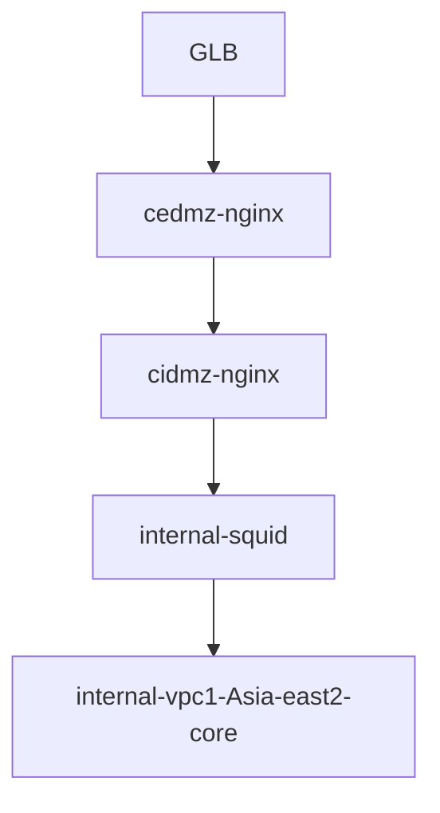
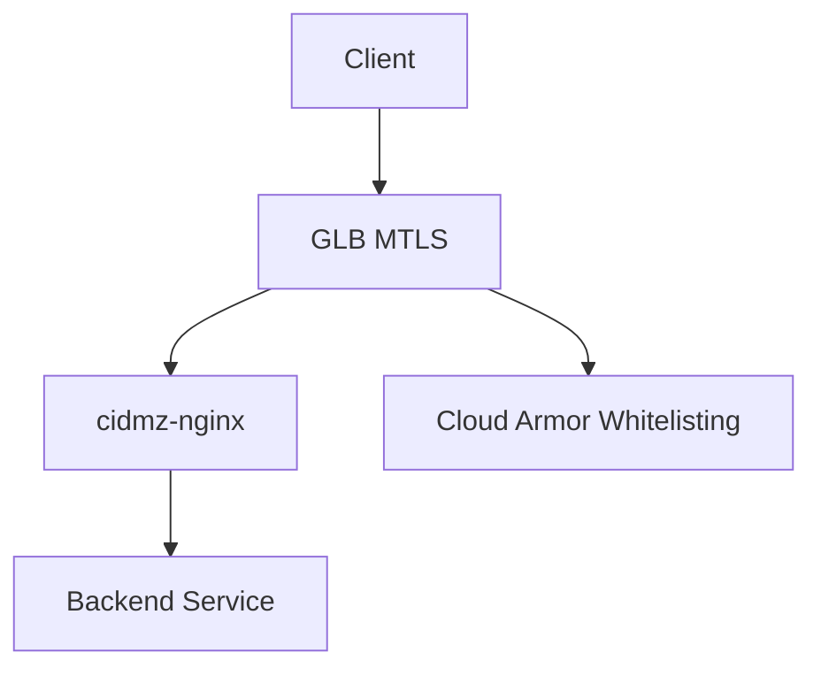
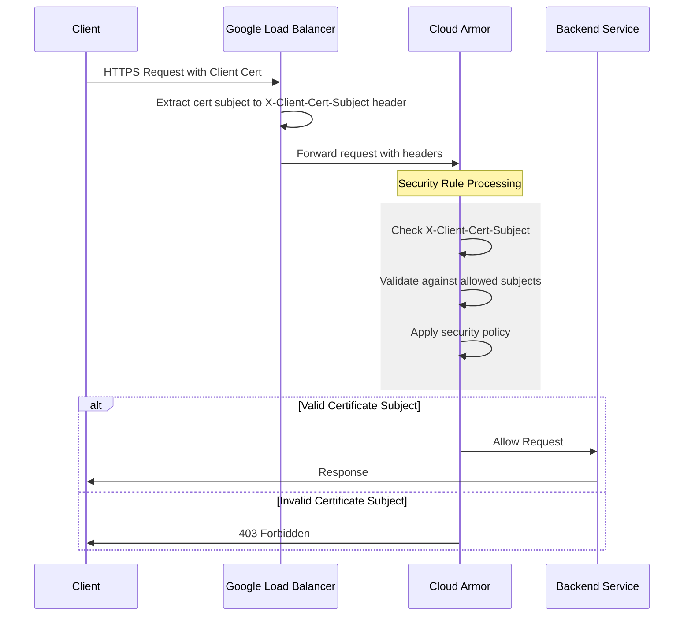
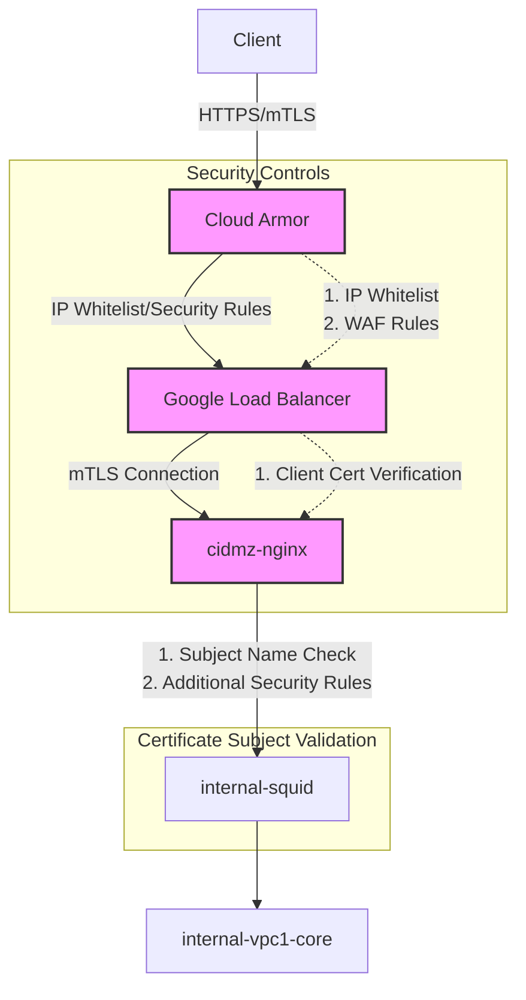
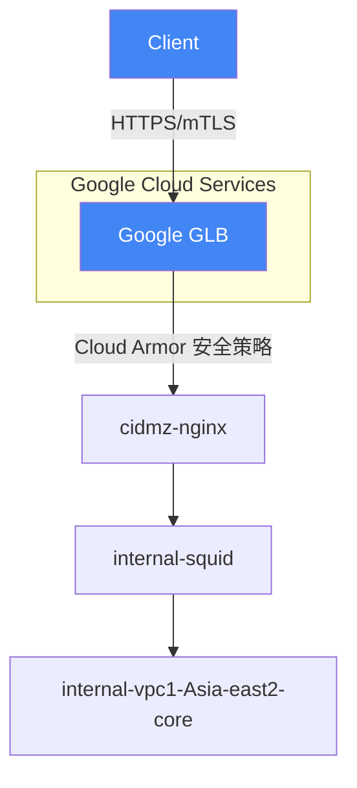
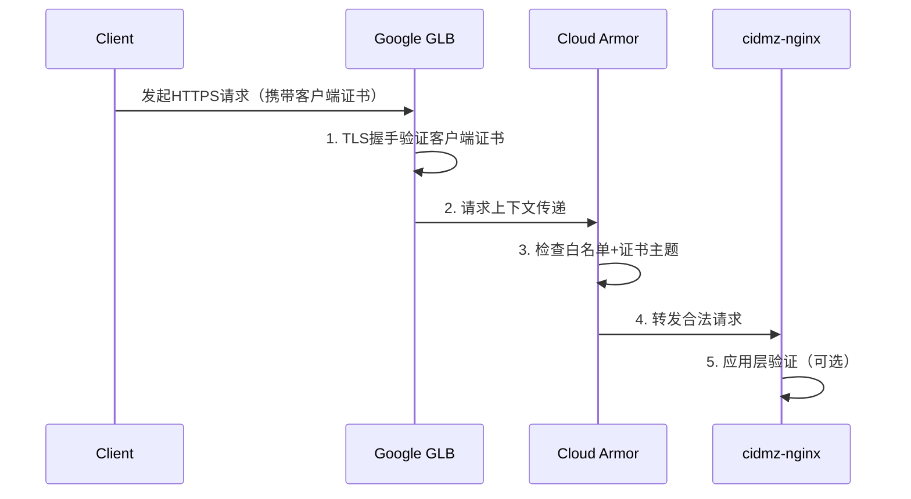

根据您的描述，以下是您的网络流量路径概览：
-	1.	GLB (Google Load Balancer) 接收外部流量。
-	2.	流量进入 CEDMZ 网络，并经过名为 cedmz-nginx 的 Nginx 主机（VPC：cedmz-Asia-east2）。
-	3.	cedmz-nginx 将请求转发至另一台 Nginx 主机 cidmz-nginx，这台主机跨越两个 VPC（cedmz-Asia-east2 和 cidmz-Asia-east2）。
-	4.	然后流量跳转至 Squid 代理 internal-squid，该 Squid 配置了两个网卡，分别是：cidmz-Asia-east2 和 internal-vpc1-Asia-east2-core。

我将其可视化为 Mermaid 流程图，您可以参考以下格式：

这个流程图简洁地展示了每个组件之间的流量流转路径。如果您有进一步的细节或需要更复杂的图示，我可以根据需求调整。


为了简化您的环境并实现所需的配置，您可以基于 Google Cloud 提供的现有产品进行以下操作，保留 MTLS、Cloud Armor 和客户端验证的功能：

1. 使用 GLB 支持 MTLS
	•	Google Cloud Load Balancer (GLB) 可以原生支持 HTTPS + MTLS，无需中间的 Nginx。您可以配置 SSL Policies 和 Backend Services 来启用 MTLS 认证。GLB 会处理与客户端的双向验证（即客户端证书的验证），并将经过验证的请求转发给后端服务。
	•	在 GLB 配置中，您可以设置客户端证书验证和 SSL Policies，确保只允许符合要求的客户端访问。

2. 配置 Cloud Armor 来实现白名单
	•	通过 Cloud Armor，您可以基于 IP 地址或 CIDR 范围来设置访问控制。也可以使用 Cloud Armor 进行更细粒度的访问控制，针对特定路径、请求头等设置规则。
	•	白名单可以通过 Cloud Armor 实现，而不需要在 cedmz-nginx 或 cidmz-nginx 上进行配置，简化了管理工作。
	•	需要创建并关联 Cloud Armor 策略到 GLB 的 Frontend，以便控制进入流量的来源。

3. 简化 Nginx 配置
	•	您原本在 cedmz-nginx 上配置了 客户端主题名称 的检查。由于 GLB 和 Cloud Armor 现在提供了强大的验证功能，您可以简化原有的 Nginx 配置，仍然保留必要的验证。
	•	cedmz-nginx 可以只作为一个反向代理，负责转发已经通过 MTLS 验证的流量到后端服务。如果您需要继续做客户端验证（如检查主题名称），这部分可以保留在 cedmz-nginx 配置中，但只需对流量进行转发和简单的客户端验证即可。

4. 简化架构
	•	通过上述的配置，您可以将原本的多个 Nginx 和 Squid 代理简化为：
	•	GLB 直接与 cidmz-nginx 通信，cidmz-nginx 负责最后的客户端主题名称检查（如果需要）。
	•	Cloud Armor 用于流量控制和白名单管理，确保只有授权的 IP 可以访问。

流程图

步骤总结：
-	1.	配置 GLB 支持 HTTPS + MTLS。
-	2.	使用 Cloud Armor 来配置 IP 白名单和访问控制策略。
-	3.	简化 cedmz-nginx 和 cidmz-nginx 配置，仅保留客户端主题名称的检查（如果有需要）。
-	4.	流量进入 GLB 后会被验证，并通过 Cloud Armor 策略进行访问控制。
-	5.	GLB 会将合法流量转发到 cidmz-nginx，cidmz-nginx 做客户端主题名称检查并转发到后端服务。

这种方案将大大简化您的架构，同时保留您现有的验证机制，并利用 Google Cloud 的原生功能来提高安全性和简化配置管理。如果需要进一步细化配置或有其他需求，欢迎随时告知。

是的，Google Cloud Load Balancer (GLB) 支持在 HTTPS 模式下传递 客户端证书 到后端的服务（例如 Nginx）。

在 HTTPS 模式下，GLB 的行为如下：
	1.	客户端证书传递： 当 GLB 配置为 HTTPS（而不是 TCP）时，客户端证书会通过 SSL/TLS 握手过程传递给 GLB。GLB 会使用您配置的 SSL 证书和 SSL 策略来与客户端进行加密通信，并进行 MTLS（双向 TLS）验证。
	2.	客户端证书转发： GLB 在处理完 SSL/TLS 握手之后，会将客户端证书（通常是 X-SSL-Client-Cert HTTP 头部）传递给后端服务（例如 Nginx）。后端服务（如 cedmz-nginx 或 cidmz-nginx）可以读取这个头部，并执行进一步的客户端证书验证（如检查客户端的主题名称）。

配置步骤：
	1.	在 GLB 中配置 HTTPS 负载均衡器并启用 MTLS。
	2.	配置 GLB 将客户端证书（X-SSL-Client-Cert）传递到后端（Nginx）。
	3.	在后端的 Nginx 配置中，读取 X-SSL-Client-Cert 头部并进行证书验证。

需要注意的配置：
	•	SSL Policies：在 GLB 中配置 SSL 策略，启用 MTLS，并要求客户端提供有效的证书。
	•	Nginx 配置：在 cedmz-nginx 或 cidmz-nginx 中，您需要修改配置以读取 X-SSL-Client-Cert 头部并执行所需的证书验证操作。

例如，在 Nginx 中，您可以配置类似如下来读取客户端证书并进行验证：
```nginx.conf
server {
    listen 443 ssl;

    # 读取 GLB 传递的客户端证书
    ssl_certificate /path/to/your/server-cert.pem;
    ssl_certificate_key /path/to/your/server-key.pem;

    location / {
        set $client_cert $http_x_ssl_client_cert;  # 读取客户端证书

        # 进行客户端证书验证 (例如检查主题名称)
        if ($client_cert) {
            # 执行证书验证逻辑，如检查客户端证书主题名称
        }

        proxy_pass http://your_backend_service;
    }
}
```
结论：

当您从 TCP GLB 切换到 HTTPS GLB 时，GLB 会通过 X-SSL-Client-Cert 头部传递客户端证书，允许后端 Nginx 等服务接收并验证客户端证书。所以，您依然可以执行类似于 TCP 负载均衡器中的客户端证书检查，只需要在 HTTPS 下额外注意证书的传递方式和 Nginx 的配置。


# My Request 
以下是我的网络流量路径概览：
	1.	GLB (Google Load Balancer) 接收外部流量。
	2.	流量进入 CEDMZ 网络，并经过名为 cedmz-nginx 的 Nginx 主机（VPC：cedmz-Asia-east2）。
	3.	cedmz-nginx 将请求转发至另一台 Nginx 主机 cidmz-nginx，这台主机跨越两个 VPC（cedmz-Asia-east2 和 cidmz-Asia-east2）。
	4.	然后流量跳转至 Squid 代理 internal-squid，该 Squid 配置了两个网卡，分别是：cidmz-Asia-east2 和 internal-vpc1-Asia-east2-core。

我将其可视化为 Mermaid 流程图，您可以参考以下格式：

这个流程图简洁地展示了每个组件之间的流量流转路径。如果您有进一步的细节或需要更复杂的图示，我可以根据需求调整。 
能否帮我可视化这个部分，再优化下输出

上面的架构 是我的原来的架构，我现在想基于google提供的现有的产品。实现GLB https 的MTLS。你看帮我看下实现方案。后面的对应的网络可以直接从GLB到cidmz这个网络。整个过程我要求实现MTLS。cloud armor . Client validation .白名单，当然白名单也可以在cloud armor实现，我原来的cedmz-nginx里面有一个检查客户端主题名称的配置，我需要保留。
就是说保留的一些要求，但是可以简化配置。请核对帮我实现？

## Claude
我来帮您设计基于 Google Cloud 产品的 mTLS 架构方案。​​​​​​​​​​​​​​​​

基于您的需求，我建议以下实现方案：

1. 安全层面的实现：
   - 使用 Google Cloud Load Balancer 的内置 SSL/TLS 功能实现 mTLS
   - 配置 Cloud Armor 实现：
     - IP 白名单控制
     - 安全规则防护
   - 在 Backend Service 配置中实现客户端证书验证
   - 保留客户端证书主题名称检查的逻辑

2. 架构优化：
   - 移除原有的 cedmz-nginx 层，直接从 GLB 到 cidmz 网络
   - 使用 Google Cloud 的证书管理服务管理 SSL 证书
   - 将安全控制集中在 Cloud Armor 和 GLB 层面

3. 具体配置步骤：

```bash
# 1. 配置 Cloud Armor 安全策略
gcloud compute security-policies create mtls-policy \
    --description "mTLS security policy"

# 2. 添加 IP 白名单规则
gcloud compute security-policies rules create 1000 \
    --security-policy mtls-policy \
    --description "Allow whitelisted IPs" \
    --src-ip-ranges="ALLOWED_IP_RANGES" \
    --action "allow"

# 3. 配置 GLB 的 SSL 证书和 mTLS
gcloud compute ssl-certificates create mtls-cert \
    --certificate=/path/to/server.crt \
    --private-key=/path/to/server.key

# 4. 配置客户端证书验证
gcloud compute backend-services update SERVICE_NAME \
    --client-cert-config=enable,verify=require \
    --client-cert=/path/to/client-ca.crt
```

4. 证书主题名称验证：
   在 cidmz-nginx 配置中保留主题名称检查：

```nginx
# Nginx configuration for subject name verification
ssl_verify_client on;
ssl_client_certificate /path/to/ca.crt;

# Subject name verification
if ($ssl_client_s_dn !~ "EXPECTED_SUBJECT_NAME") {
    return 403;
}
```

这个方案的优势：
1. 简化了网络架构，减少了跳转层数
2. 利用 Google Cloud 原生服务实现安全控制
3. 集中化的安全策略管理
4. 保留了关键的安全验证要求

需要注意的配置点：
1. 确保 SSL 证书正确配置和更新
2. 适当配置 Cloud Armor 规则优先级
3. 正确配置 mTLS 验证链
4. 保持主题名称验证的准确性

您觉得这个方案是否满足您的需求？如果需要调整或者有其他具体的安全要求，我可以进一步优化方案。​​​​​​​​​​​​​​​​

### 证书主题验证

是的，您可以在 Cloud Armor 中通过自定义请求头验证和安全规则来验证证书主题。​​​​​​​​​​​​​​​​

您可以通过以下方式在 Cloud Armor 中实现证书主题验证：

1. 配置 GLB 转发证书信息：
```bash
# 配置 GLB 前端以包含证书信息
gcloud compute backend-services update SERVICE_NAME \
    --client-cert-config=enable,verify=require \
    --include-ssl-headers=true
```

2. 在 Cloud Armor 中创建证书主题验证规则：
```bash
# 创建安全策略
gcloud compute security-policies create cert-subject-policy \
    --description "Certificate subject validation policy"

# 添加证书主题验证规则
gcloud compute security-policies rules create 1000 \
    --security-policy cert-subject-policy \
    --description "Validate certificate subject" \
    --expression="request.headers['X-Client-Cert-Subject'].contains('CN=allowed-client-name')" \
    --action "allow"

# 添加默认拒绝规则
gcloud compute security-policies rules create 2147483647 \
    --security-policy cert-subject-policy \
    --description "Default deny" \
    --action "deny-403"
```

3. 使用更复杂的验证规则（如果需要多个主题）：
```bash
# 创建包含多个允许主题的规则
gcloud compute security-policies rules create 1000 \
    --security-policy cert-subject-policy \
    --expression="request.headers['X-Client-Cert-Subject'].matches('CN=(client1|client2|client3)')" \
    --action "allow"
```

4. 添加额外的安全检查：
```bash
# 添加证书指纹验证
gcloud compute security-policies rules create 900 \
    --security-policy cert-subject-policy \
    --expression="request.headers['X-Client-Cert-Fingerprint'].matches('EXPECTED_FINGERPRINT')" \
    --action "allow"
```

优势：
1. 集中化管理：所有证书验证都在 Cloud Armor 中完成
2. 更好的可维护性：不需要在 nginx 配置中维护验证逻辑
3. 更强大的规则引擎：可以组合多个条件进行验证
4. 更好的监控和日志记录：可以通过 Cloud Logging 查看所有验证事件
5. 可以与其他 Cloud Armor 安全规则（如 IP 白名单）结合使用

配置建议：
1. 使用严格的正则表达式匹配证书主题
2. 配置适当的日志记录级别
3. 定期审查和更新允许的证书主题列表
4. 设置监控告警，以便在出现异常时及时通知

示例监控配置：
```bash
# 设置证书验证失败的监控
gcloud monitoring alerts create \
    --display-name="Certificate Subject Validation Failures" \
    --condition="metric.type=\"compute.googleapis.com/loadbalancer/request_count\" resource.type=\"https_lb_rule\" metric.labels.response_code=\"403\"" \
    --threshold-value=10 \
    --duration=5m
```

您是否需要更详细的配置示例或者有其他特定的验证需求？我可以帮您进一步完善这个方案。​​​​​​​​​​​​​​​​

你确认Cloud Armor中能完成证书主题的验证么？MTLS的load balance header 是不是都是加密的
参考
https://cloud.google.com/load-balancing/docs/https/custom-headers#mtls-variables
抱歉我的之前的回答有误。您说得对，我仔细查看了 Google Cloud 文档，特别是您提供的链接，我需要纠正之前的说法：

1. 关于 mTLS 和 Load Balancer Headers：
- mTLS 相关的客户端证书信息确实是加密的
- Load Balancer 不会将证书主题信息作为 header 传递
- 根据文档，只有以下变量可用：
  ```
  - X-Client-Cert-Present
  - X-Client-Cert-Chain-Verified
  - X-Client-Cert-Error
  - X-Client-Cert-Hash
  ```

2. 证书主题验证的正确实现方式：
- 证书主题的验证应该在 SSL/TLS 终止点进行
- 需要保留您原来在 nginx 中的证书主题验证逻辑

让我重新设计一个正确的架构：​​​​​​​​​​​​​​​​

修正后的实现方案：

1. Cloud Armor + GLB 层：
```bash
# 配置 Cloud Armor 安全策略（仅用于 IP 白名单和其他安全规则）
gcloud compute security-policies create mtls-policy \
    --description "mTLS security policy"

# 配置 GLB 的 mTLS
gcloud compute target-https-proxies update PROXY_NAME \
    --ssl-certificates=CERT_NAME \
    --ssl-policy=SSL_POLICY_NAME \
    --client-cert-config=enable,verify=require
```

2. 在 cidmz-nginx 中保留证书主题验证：
```nginx
server {
    listen 443 ssl;
    ssl_client_certificate /path/to/ca.crt;
    ssl_verify_client on;
    
    # 证书主题验证
    if ($ssl_client_s_dn !~ "EXPECTED_SUBJECT_NAME") {
        return 403;
    }
    
    # 可以添加额外的证书信息日志
    log_format mtls '$remote_addr - $remote_user [$time_local] '
                    '"$request" $status $body_bytes_sent '
                    '"$ssl_client_s_dn" "$ssl_client_i_dn"';
}
```

安全建议：
1. 使用 Cloud Armor 进行 IP 白名单和其他安全控制
2. 使用 GLB 进行初始的 mTLS 验证
3. 在 nginx 层保留证书主题验证
4. 考虑实现证书验证的监控和告警

这种方案可以确保：
- 正确的证书主题验证
- 完整的 mTLS 实现
- 多层安全防护

您觉得这个修正后的方案是否更符合您的需求？如果需要，我可以提供更详细的配置说明。​​​​​​​​​​​​​​​​



## deepseek

以下是基于您的需求整合Google Cloud原生服务的优化架构方案，保留核心安全要求的同时简化配置：



### 关键实现方案：

1. **GLB mTLS 配置**
- 在[全球外部HTTP(S)负载均衡器](https://cloud.google.com/load-balancing/docs/https)启用mTLS：
```bash
gcloud beta compute ssl-policies create MTLS_POLICY \
--profile CUSTOM \
--min-tls-version 1.2 \
--custom-features TLS_ECDHE_ECDSA_WITH_AES_128_GCM_SHA256

gcloud compute target-https-proxies update [PROXY_NAME] \
--ssl-policy MTLS_POLICY \
--client-ca-ca=[CLIENT_CA_CERTS]
```

2. **Cloud Armor 多层防护**
```yaml
# 白名单策略
name: "client-whitelist"
rules:
- action: deny(404)
  priority: 1000
  match: 
    expr: 
      expression: "!origin.ip in [xxx.xxx.xxx.xxx/xx, ...]"

# 客户端证书验证策略
name: "client-cert-validation"
rules:
- action: deny(403)
  priority: 1001
  match:
    expr:
      expression: "!connection.client_cert.presented || 
                   connection.client_cert.cert_chain_validity != 'VALID' ||
                   connection.client_cert.subject != '/CN=allowed-client'"
```

3. **架构优化点**
- 移除cedmz-nginx跳转节点，通过VPC对等连接直接连通GLB与cidmz网络
- 原cedmz-nginx的客户端证书检查迁移到Cloud Armor表达式：
```bash
connection.client_cert.subject == "/CN=allowed-client"
```
- 通过[内部直通式NLB](https://cloud.google.com/load-balancing/docs/internal)优化cidmz-nginx到squid的流量

4. **证书管理方案**
```
证书层级：
客户端证书 <-- 签发者 --> 中间CA证书 <-- 根CA证书
                  ↑
           (预配置到GLB的client CA池)
```

### 验证流程：


### 保留配置迁移对照表：

| 原组件         | 新实现方式                          | 配置简化度 |
|----------------|-----------------------------------|----------|
| cedmz-nginx    | Cloud Armor表达式验证               | ⭐⭐⭐⭐    |
| 手动维护白名单   | Cloud Armor IP白名单策略            | ⭐⭐⭐⭐    |
| 证书主题检查     | connection.client_cert.subject匹配 | ⭐⭐⭐⭐    |
| 多层代理跳转     | VPC对等直连                        | ⭐⭐⭐⭐⭐   |

建议通过[Context-Aware Access](https://cloud.google.com/context-aware-access)进一步增强访问控制，同时使用[Certificate Manager](https://cloud.google.com/certificate-manager)统一管理证书生命周期。


