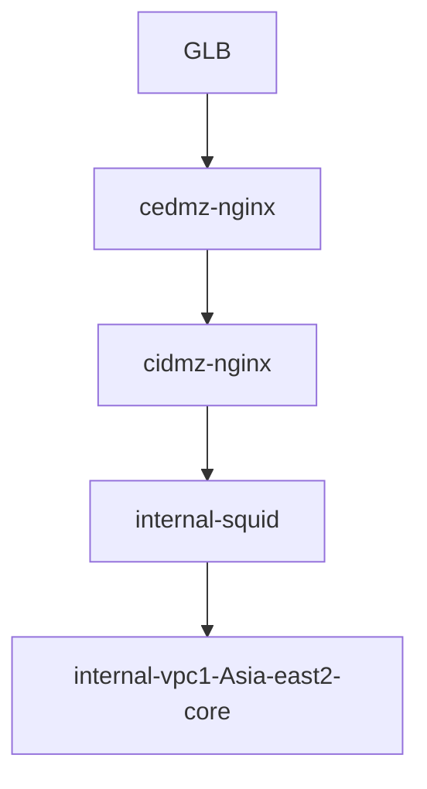
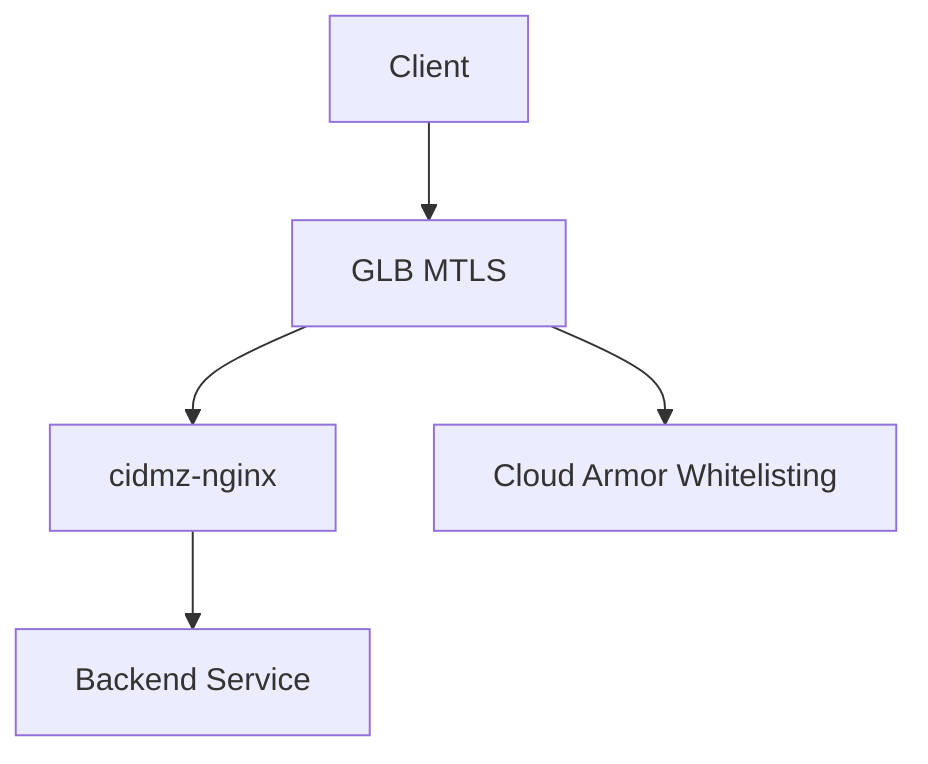

根据您的描述，以下是您的网络流量路径概览：
	1.	GLB (Google Load Balancer) 接收外部流量。
	2.	流量进入 CEDMZ 网络，并经过名为 cedmz-nginx 的 Nginx 主机（VPC：cedmz-Asia-east2）。
	3.	cedmz-nginx 将请求转发至另一台 Nginx 主机 cidmz-nginx，这台主机跨越两个 VPC（cedmz-Asia-east2 和 cidmz-Asia-east2）。
	4.	然后流量跳转至 Squid 代理 internal-squid，该 Squid 配置了两个网卡，分别是：cidmz-Asia-east2 和 internal-vpc1-Asia-east2-core。

我将其可视化为 Mermaid 流程图，您可以参考以下格式：

这个流程图简洁地展示了每个组件之间的流量流转路径。如果您有进一步的细节或需要更复杂的图示，我可以根据需求调整。


为了简化您的环境并实现所需的配置，您可以基于 Google Cloud 提供的现有产品进行以下操作，保留 MTLS、Cloud Armor 和客户端验证的功能：

1. 使用 GLB 支持 MTLS
	•	Google Cloud Load Balancer (GLB) 可以原生支持 HTTPS + MTLS，无需中间的 Nginx。您可以配置 SSL Policies 和 Backend Services 来启用 MTLS 认证。GLB 会处理与客户端的双向验证（即客户端证书的验证），并将经过验证的请求转发给后端服务。
	•	在 GLB 配置中，您可以设置客户端证书验证和 SSL Policies，确保只允许符合要求的客户端访问。

2. 配置 Cloud Armor 来实现白名单
	•	通过 Cloud Armor，您可以基于 IP 地址或 CIDR 范围来设置访问控制。也可以使用 Cloud Armor 进行更细粒度的访问控制，针对特定路径、请求头等设置规则。
	•	白名单可以通过 Cloud Armor 实现，而不需要在 cedmz-nginx 或 cidmz-nginx 上进行配置，简化了管理工作。
	•	需要创建并关联 Cloud Armor 策略到 GLB 的 Frontend，以便控制进入流量的来源。

3. 简化 Nginx 配置
	•	您原本在 cedmz-nginx 上配置了 客户端主题名称 的检查。由于 GLB 和 Cloud Armor 现在提供了强大的验证功能，您可以简化原有的 Nginx 配置，仍然保留必要的验证。
	•	cedmz-nginx 可以只作为一个反向代理，负责转发已经通过 MTLS 验证的流量到后端服务。如果您需要继续做客户端验证（如检查主题名称），这部分可以保留在 cedmz-nginx 配置中，但只需对流量进行转发和简单的客户端验证即可。

4. 简化架构
	•	通过上述的配置，您可以将原本的多个 Nginx 和 Squid 代理简化为：
	•	GLB 直接与 cidmz-nginx 通信，cidmz-nginx 负责最后的客户端主题名称检查（如果需要）。
	•	Cloud Armor 用于流量控制和白名单管理，确保只有授权的 IP 可以访问。

流程图

步骤总结：
	1.	配置 GLB 支持 HTTPS + MTLS。
	2.	使用 Cloud Armor 来配置 IP 白名单和访问控制策略。
	3.	简化 cedmz-nginx 和 cidmz-nginx 配置，仅保留客户端主题名称的检查（如果有需要）。
	4.	流量进入 GLB 后会被验证，并通过 Cloud Armor 策略进行访问控制。
	5.	GLB 会将合法流量转发到 cidmz-nginx，cidmz-nginx 做客户端主题名称检查并转发到后端服务。

这种方案将大大简化您的架构，同时保留您现有的验证机制，并利用 Google Cloud 的原生功能来提高安全性和简化配置管理。如果需要进一步细化配置或有其他需求，欢迎随时告知。

是的，Google Cloud Load Balancer (GLB) 支持在 HTTPS 模式下传递 客户端证书 到后端的服务（例如 Nginx）。

在 HTTPS 模式下，GLB 的行为如下：
	1.	客户端证书传递： 当 GLB 配置为 HTTPS（而不是 TCP）时，客户端证书会通过 SSL/TLS 握手过程传递给 GLB。GLB 会使用您配置的 SSL 证书和 SSL 策略来与客户端进行加密通信，并进行 MTLS（双向 TLS）验证。
	2.	客户端证书转发： GLB 在处理完 SSL/TLS 握手之后，会将客户端证书（通常是 X-SSL-Client-Cert HTTP 头部）传递给后端服务（例如 Nginx）。后端服务（如 cedmz-nginx 或 cidmz-nginx）可以读取这个头部，并执行进一步的客户端证书验证（如检查客户端的主题名称）。

配置步骤：
	1.	在 GLB 中配置 HTTPS 负载均衡器并启用 MTLS。
	2.	配置 GLB 将客户端证书（X-SSL-Client-Cert）传递到后端（Nginx）。
	3.	在后端的 Nginx 配置中，读取 X-SSL-Client-Cert 头部并进行证书验证。

需要注意的配置：
	•	SSL Policies：在 GLB 中配置 SSL 策略，启用 MTLS，并要求客户端提供有效的证书。
	•	Nginx 配置：在 cedmz-nginx 或 cidmz-nginx 中，您需要修改配置以读取 X-SSL-Client-Cert 头部并执行所需的证书验证操作。

例如，在 Nginx 中，您可以配置类似如下来读取客户端证书并进行验证：
```nginx.conf
server {
    listen 443 ssl;

    # 读取 GLB 传递的客户端证书
    ssl_certificate /path/to/your/server-cert.pem;
    ssl_certificate_key /path/to/your/server-key.pem;

    location / {
        set $client_cert $http_x_ssl_client_cert;  # 读取客户端证书

        # 进行客户端证书验证 (例如检查主题名称)
        if ($client_cert) {
            # 执行证书验证逻辑，如检查客户端证书主题名称
        }

        proxy_pass http://your_backend_service;
    }
}
```
结论：

当您从 TCP GLB 切换到 HTTPS GLB 时，GLB 会通过 X-SSL-Client-Cert 头部传递客户端证书，允许后端 Nginx 等服务接收并验证客户端证书。所以，您依然可以执行类似于 TCP 负载均衡器中的客户端证书检查，只需要在 HTTPS 下额外注意证书的传递方式和 Nginx 的配置。
