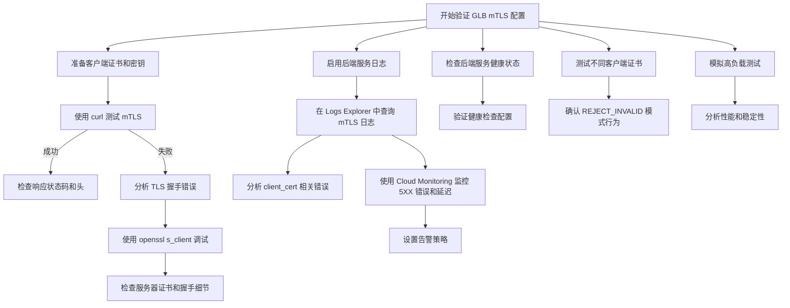
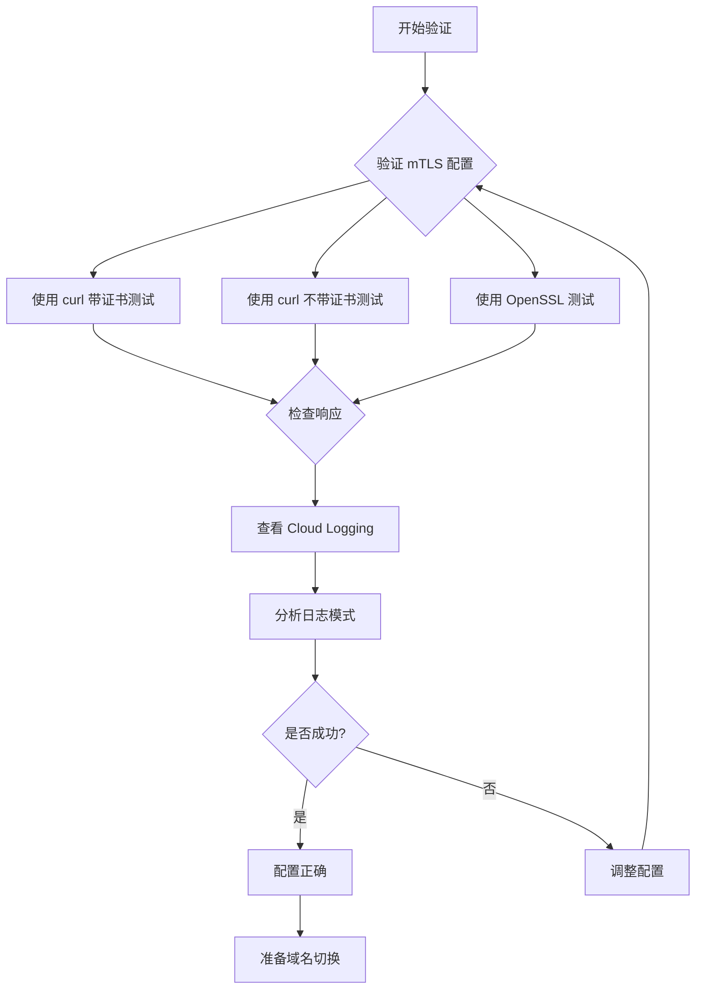

# ChatGPT 
你现在的场景是在 GLB（Google Cloud Load Balancer）配置好 mTLS 后，还未正式进行 域名切换，想验证配置正确性并获取相关日志信息。下面我将从三个角度为你提供完整思路和可执行建议：

  

  

  

  

✅ 验证方式（在未切换域名的情况下）

  

  

  

1. 使用 

curl

 测试 IP 地址 + 客户端证书（mTLS）

  

  

你可以使用下面命令验证：

curl -v https://34.120.88.88 \

  --cert client.crt \

  --key client.key \

  --cacert ca.crt

  

- client.crt 是客户端证书。
- client.key 是私钥。
- ca.crt 是 GLB 所信任的 CA（即 TrustConfig 中定义的）。
- 若配置成功，应能拿到 200 OK 或目标服务响应。

  

  

注意事项：

  

- 若你开启了 Host-based Routing（基于域名），可加 -H "Host: example.com"：

  

curl -v https://34.120.88.88 --cert client.crt --key client.key --cacert ca.crt -H "Host: yourdomain.com"

  

  

  

  

  

2. 使用 OpenSSL 检查 TLS 层握手

  

  

可以分析 TLS 连接和证书握手过程：

openssl s_client -connect 34.120.88.88:443 \

  -cert client.crt \

  -key client.key \

  -CAfile ca.crt

  

- 可以确认 TLS 成功与否、证书链是否正常。
- 注意输出中的 Verify return code: 0 (ok) 说明成功。

  

  

  

  

  

3. 使用自定义 header 验证后端

  

  

如果你在 BackendService 或服务后端（如 Nginx 或 App） 中配置了自定义 header（例如 X-Client-Cert），可检查服务日志看该 header 是否被注入。

  

  

  

  

🔍 获取日志信息（GLB 和后端）

  

  

  

1. 

开启 Cloud Logging（推荐）

  

  

确保 GCP 的 Logging 在以下层开启：

|   |   |   |
|---|---|---|
|层级|启用位置|日志类型说明|
|HTTPS LB|Load balancer → Logging|接收层流量，含 TLS 握手失败、连接状态等|
|Backend Service|Backend service → Logging|请求是否命中 backend|
|GKE/Nginx/App|GKE Pod / Nginx / Runtime日志|实际业务日志|

🔧 开启步骤：

  

1. 打开 GCP Console
2. 进入 Network Services → Load Balancing
3. 选择你的 HTTPS Load Balancer
4. 查看 Backend Service 配置
5. 确保 “Enable logging” 勾选，并选择合适的采样率（可设为 1.0 以捕获所有请求）

  

  

📍查看路径：

Cloud Logging 控制台中搜索：

resource.type="http_load_balancer"

resource.labels.forwarding_rule_name="your-forwarding-rule-name"

或者用：

resource.type="https_load_balancer"

jsonPayload.statusDetails:("client_tls_handshake_failed" OR "backend_connection_closed" OR "ok")

  

  

  

  

2. 

抓包分析（本地调试）

  

  

如果 curl 报错，但你无法定位是哪一层失败，可以抓包：

sudo tcpdump -i any port 443 -w mtls_glb_test.pcap

然后用 Wireshark 观察：

  

- 是否握手成功
- TLS Alert 是否为 certificate_unknown、unknown_ca 等

  

  

  

  

  

🔬 高级验证策略（推荐）

  

|   |   |
|---|---|
|验证方法|说明|
|使用自定义 health check 模拟请求|自定义一个 HTTPS health check 含 client cert 去验证后端响应是否符合预期（可用于模拟 mTLS 流程）|
|配置 Preview 域名|若你可控制 DNS，可设一个 preview.yourdomain.com 指向新 IP 用于测试|
|设置 backend header echo|后端服务打印所有 header（特别是 X-Client-Cert, X-Forwarded-For）帮助验证|
|使用 GCP Cloud Monitoring 中的 mTLS 指标（如果已开启）|查看 handshake 成功率、latency、cert fingerprint 使用情况等|

  

  

  

  

✅ 最佳实践流程（Mermaid）

  

graph TD;

    A[准备 client cert, key, CA cert] --> B[用 curl / openssl 测试 IP];

    B --> C[观察 TLS 连接是否成功];

    C --> D[开启 GLB 和 Backend Logging];

    D --> E[使用 Logging 查询 handshake / backend 日志];

    E --> F[设置 preview DNS 进行更真实验证];

  

  

  

  

总结表格

  

|   |   |   |
|---|---|---|
|工具/方式|功能|说明|
|curl -v|模拟请求（含 mTLS）|必须传入 --cert / --key / --cacert|
|openssl s_client|分析 TLS 握手|可看到详细 TLS 层信息|
|Cloud Logging|查看 handshake/forwarding 日志|需启用后查看 https_load_balancer 类型日志|
|tcpdump/Wireshark|抓包分析 TLS 问题|用于 curl 报错时进一步诊断|
|backend logs|查看 backend 是否收到请求|需要开启 logging 或在后端记录日志|
|自定义域名|设置 preview 环境测试域名|模拟切换后的真实访问效果|

  

  

  

如果你提供当前配置（如 TrustConfig、BackendService 是否启用 header 插入等），我可以帮你进一步诊断具体的验证命令和日志查询语句。是否需要我生成一个日志查询的模板？


以下是适用于 GCP HTTPS Load Balancer + mTLS 的 Cloud Logging 日志查询模板，你可以在 Cloud Logging Explorer 中粘贴使用（支持自定义时间范围等）。

  

  

  

  

📌 查询 1：GLB 接收请求日志（含 TLS 握手状态）

  

resource.type="https_load_balancer"

resource.labels.forwarding_rule_name="your-forwarding-rule-name"

logName="projects/your-project-id/logs/requests"

  

✅ 如果你想过滤只看异常情况（如 TLS 握手失败）：

  

resource.type="https_load_balancer"

resource.labels.forwarding_rule_name="your-forwarding-rule-name"

logName="projects/your-project-id/logs/requests"

jsonPayload.statusDetails != "response_sent_by_backend"

  

🔍 常见 statusDetails 值（可帮助识别问题）：

  

|   |   |
|---|---|
|statusDetails|说明|
|client_tls_handshake_failed|客户端 TLS 握手失败（证书问题/格式错误）|
|client_closed_connection|客户端未完成连接或断开|
|response_sent_by_backend|请求成功发送至后端|
|backend_connection_closed|后端连接提前关闭|

  

  

  

  

📌 查询 2：后端服务日志（BackendService → VM/GKE）

  

  

若你启用了 backend logging（默认会记录实际流量日志），可使用：

resource.type="http_load_balancer"

resource.labels.backend_service_name="your-backend-service-name"

logName="projects/your-project-id/logs/requests"

📘 如果你用的是 GKE 后端，请同时检查 GKE Pod 的 stdout 日志。

  

  

  

  

📌 查询 3：GKE 服务日志（用于验证 Header 插入 / 客户端信息）

  

  

假设你启用了 Nginx 或 App 日志输出：

resource.type="k8s_container"

resource.labels.project_id="your-project-id"

resource.labels.cluster_name="your-cluster-name"

resource.labels.namespace_name="your-namespace"

resource.labels.container_name="your-container"

你也可以加：

textPayload:"X-Client-Cert"

  

  

  

  

✅ 使用建议

  

|   |   |
|---|---|
|情况|查询建议|
|验证是否 mTLS 成功|查询 GLB 日志中 statusDetails="response_sent_by_backend"|
|验证证书失败|搜索 client_tls_handshake_failed 或 tls_handshake_failure|
|观察请求内容是否到后端|检查后端日志中是否含有 X-Client-Cert 等|
|多客户端测试 mTLS|搭配 X-Forwarded-For、自定义 header 观察不同行为|

  

  

  

  

🧪 示例命令用于 curl 生成日志：

  

curl -v https://34.120.88.88 \

  --cert client.crt \

  --key client.key \

  --cacert ca.crt \

  -H "Host: yourdomain.com"

执行完后约几秒钟内你可以在 Cloud Logging 查询上面日志，看有没有 statusCode: 200、response_sent_by_backend 以及 client IP、证书 fingerprint 等字段。

  

  

  

是否需要我帮你定制一个完整的 curl 脚本 + Cloud Logging 查询模板（包括你当前使用的 forwarding rule name 和 backend service name）？你也可以提供项目 ID 和 LB 名称，我来为你组合完整的可执行命令。

# Grok 
在 Google Cloud Platform (GCP) 中配置了全局负载均衡器（Global Load Balancer, GLB）的 mTLS（Mutual TLS）后，在域名切换之前验证配置是否正确非常重要。你提到使用 curl -v https://34.120.88.88 可以看到一些返回信息，但需要进一步验证 mTLS 配置的正确性以及获取相关日志。本回答将详细说明如何验证 GLB 的 mTLS 配置、提供多种校验方法，并指导如何获取和分析日志，全部以 Markdown 格式输出，并附带流程图以帮助理解。

  

验证 GCP GLB mTLS 配置的方法

在域名切换之前，你可以通过以下方法验证 GLB 的 mTLS 配置是否正确。这些方法涵盖了直接测试、证书验证、后端通信检查等多个方面。

1. 使用 `curl` 测试 mTLS 配置

你已经尝试了 curl -v https://34.120.88.88，但为了验证 mTLS，你需要显式提供客户端证书和密钥，以模拟真实的 mTLS 握手。以下是具体步骤：

步骤

1. 准备客户端证书和密钥：

- 确保你有一个有效的客户端证书（.crt 文件）和对应的私钥（.key 文件），这些证书需要被 GLB 的信任存储（Trust Store）接受。
- 确认证书满足 GCP mTLS 的要求（例如，证书链有效，Subject Alternative Name (SAN) 符合要求，签名算法支持等）。

3. 执行 curl 测试： 使用以下命令测试 mTLS：  
    curl -v --cert client-cert.crt --key client-key.key https://34.120.88.88
4.   
    

- --cert：指定客户端证书文件。
- --key：指定客户端私钥文件。
- -v：启用详细输出，以便查看 TLS 握手细节。

6. 分析返回结果：

- 成功情况：如果 mTLS 配置正确，curl 应该返回 HTTP 200 状态码（或其他预期状态码），并且你可以看到后端服务的响应内容。
- 失败情况：

- 如果返回 403 或 400 错误，可能是客户端证书无效或未被信任。
- 如果连接被拒绝，检查 ServerTlsPolicy 的 clientValidationMode 是否设置为 REJECT_INVALID（严格模式），且证书未通过验证。
- 查看详细的 TLS 错误信息，例如握手失败的原因。

8. 测试无证书情况（可选）： 如果你的 ServerTlsPolicy 设置为 ALLOW_INVALID_OR_MISSING_CLIENT_CERT，可以尝试不提供证书：  
    curl -v https://34.120.88.88
9.   
    

- 观察是否按预期通过（带有自定义头信息表明证书缺失）或被拒绝。

示例输出

成功握手的输出可能如下：

* TLSv1.3 (OUT), TLS handshake, Client hello (1):

* TLSv1.3 (IN), TLS handshake, Server hello (2):

* TLSv1.3 (IN), TLS handshake, Certificate (11):

* TLSv1.3 (IN), TLS handshake, Server key exchange (12):

* TLSv1.3 (OUT), TLS handshake, Client key exchange (16):

* TLSv1.3 (IN), TLS handshake, Finished (20):

* TLSv1.3 (OUT), TLS handshake, Finished (20):

* SSL connection using TLSv1.3 / AES_256_GCM_SHA384

* Server certificate:

*  subject: CN=example.com

*  start date: May 01 00:00:00 2025 GMT

*  expire date: Aug 01 00:00:00 2025 GMT

*  issuer: CN=TrustedCA

* HTTP/1.1 200 OK

失败的输出可能包含类似以下信息：

* TLSv1.3 (OUT), TLS alert, handshake failure (552):

* OpenSSL SSL_connect: SSL_ERROR_SYSCALL in connection to 34.120.88.88:443

注意事项

- 确保你的 curl 命令使用的是 HTTPS 协议（https://），因为 mTLS 只适用于 HTTPS。
- 如果你使用的是自签名证书，添加 --cacert ca-cert.pem 或 --insecure 跳过服务器证书验证（仅用于测试）。
- 检查返回的自定义 mTLS 头（如 X-Client-Cert-Present），以确认后端是否正确接收到 mTLS 相关信息。

  

2. 使用 `openssl` 验证 TLS 握手

curl 提供的高级信息可能不足以调试复杂的 mTLS 问题。openssl s_client 工具可以提供更详细的 TLS 握手信息。

步骤

1. 运行 openssl s_client：  
    openssl s_client -connect 34.120.88.88:443 -cert client-cert.pem -key client-key.pem -CAfile ca-cert.pem
2.   
    

- -connect：指定 GLB 的 IP 地址和端口。
- -cert 和 -key：提供客户端证书和密钥。
- -CAfile：指定信任的 CA 证书，用于验证服务器证书。

4. 分析输出：

- 检查服务器证书是否正确（匹配你的配置）。
- 确认客户端证书是否被服务器请求（输出中会包含 Certificate Request）。
- 查看握手是否成功（Verification: OK 表示成功）。
- 如果失败，输出会显示类似 handshake failure 或 certificate verify failed 的错误。

6. 测试不同 TLS 版本（可选）： GLB 支持 TLS 1.0、1.1、1.2 和 1.3（具体版本取决于负载均衡器类型）。可以指定 TLS 版本测试兼容性：  
    openssl s_client -connect 34.120.88.88:443 -cert client-cert.pem -key client-key.pem -CAfile ca-cert.pem -tls1_2
7.   
    

示例输出

成功握手的输出可能如下：

---

Certificate chain

 0 s:/CN=example.com

   i:/CN=TrustedCA

---

Server certificate

-----BEGIN CERTIFICATE-----

...

-----END CERTIFICATE-----

SSL-Session:

    Protocol  : TLSv1.3

    Cipher    : AES256-GCM-SHA384

    Verify return code: 0 (ok)

---

  

3. 检查后端服务的 mTLS 自定义头

GLB 支持将 mTLS 验证结果通过自定义 HTTP 头传递给后端服务，这可以帮助验证客户端证书的状态。

步骤

1. 配置自定义头：

- 在你的后端服务或 URL Map 上启用 mTLS 自定义头，例如：  
    gcloud compute backend-services update BACKEND_SERVICE \
-   --global \
-   --enable-logging \
-   --logging-sample-rate=1 \
-   --custom-request-header='X-Client-Cert-Present:{client_cert_present}' \
-   --custom-request-header='X-Client-Cert-Chain-Verified:{client_cert_chain_verified}' \
-   --custom-request-header='X-Client-Cert-Error:{client_cert_error}'
-   
    
- 常用头包括：

- X-Client-Cert-Present：指示客户端是否提供了证书。
- X-Client-Cert-Chain-Verified：指示证书链是否通过验证。
- X-Client-Cert-Error：如果验证失败，描述错误原因。

3. 测试后端接收的头：

- 使用 curl 发送请求，并检查后端日志或响应头。
- 可以在后端服务中添加调试代码，记录收到的 HTTP 头。例如，在 Nginx 中：  
    server {
-     listen 80;
-     location / {
-         access_log /var/log/nginx/access.log;
-         return 200 "Headers: $http_x_client_cert_present, $http_x_client_cert_chain_verified, $http_x_client_cert_error";
-     }
- }
-   
    

5. 验证结果：

- 如果 X-Client-Cert-Present: true 且 X-Client-Cert-Chain-Verified: true，说明 mTLS 配置正常。
- 如果 X-Client-Cert-Error 包含错误信息，检查证书或 ServerTlsPolicy 配置。

注意事项

- 确保后端服务能够解析这些自定义头。
- 如果使用 ALLOW_INVALID_OR_MISSING_CLIENT_CERT 模式，即使客户端证书无效，请求也会被转发，但头中会反映验证失败。

  

4. 模拟真实客户端请求

为了更贴近生产环境的测试，可以使用编程语言（如 Python）模拟客户端请求，验证 mTLS 在不同场景下的表现。

示例：Python 客户端

import requests

from requests_pkcs12 import Pkcs12Adapter

  

# 使用 PKCS12 证书（包含证书和私钥）

pkcs12_file = 'client.p12'

pkcs12_password = 'your_password'

  

# 创建会话并附加证书

session = requests.Session()

session.mount('https://34.120.88.88', Pkcs12Adapter(pkcs12_filename=pkcs12_file, pkcs12_password=pkcs12_password))

  

# 发送请求

response = session.get('https://34.120.88.88')

print(response.status_code)

print(response.headers)

print(response.text)

说明

- 使用 requests_pkcs12 库支持 mTLS。
- 检查响应状态码和头，确认是否与预期一致。
- 如果请求失败，捕获异常并分析错误（如证书验证失败）。

  

5. 使用 GCP 健康检查验证后端连通性

GLB 的健康检查可以帮助验证后端服务是否可达，以及 mTLS 配置是否影响后端通信。

步骤

1. 检查健康检查配置：

- 在 GCP 控制台中，导航到 Load Balancing > Backend Services，查看与 GLB 关联的后端服务的健康检查设置。
- 确保健康检查协议与 mTLS 配置一致（例如，使用 HTTPS 且端口为 443）。

3. 验证后端健康状态：

- 在 GCP 控制台的 Load Balancing 页面，检查后端实例的健康状态。
- 如果后端显示为不健康，检查健康检查日志（见日志获取部分）或后端服务的 mTLS 配置。

5. 临时禁用 mTLS 测试（可选）：

- 将 ServerTlsPolicy 的 clientValidationMode 临时设置为 ALLOW_INVALID_OR_MISSING_CLIENT_CERT，观察健康检查是否恢复正常，以排除 mTLS 配置问题。

  

6. 预域名切换的额外校验

在切换域名之前，可以执行以下额外校验，确保 mTLS 配置稳健：

1. 验证信任存储（Trust Store）：

- 确保 TrustConfig 中包含正确的根 CA 和中间 CA 证书。
- 使用以下命令检查：  
    gcloud certificate-manager trust-configs describe TRUST_CONFIG_NAME --location=global
-   
    
- 确认证书链是否完整，Subject Key Identifier (SKID) 和 Authority Key Identifier (AKID) 是否匹配。

3. 测试不同客户端证书：

- 使用多个客户端证书（有效、无效、过期等）测试 GLB 的行为，确保 REJECT_INVALID 模式下只允许有效证书通过。

5. 验证 DNS 配置（可选）：

- 虽然你尚未切换域名，但可以临时设置一个测试域名，指向 GLB 的 IP（34.120.88.88），并使用 Google 管理的 SSL 证书进行测试。
- 更新 DNS A 记录，指向 GLB IP，然后使用以下命令测试：  
    curl -v --cert client-cert.crt --key client-key.key https://test-domain.com
-   
    

7. 检查防火墙规则：

- 确保 GCP 的防火墙规则允许从客户端到 GLB IP（34.120.88.88）的 HTTPS 流量（端口 443）。
- 使用以下命令检查：  
    gcloud compute firewall-rules list --filter="targetTags:load-balancer"
-   
    

9. 模拟高负载测试：

- 使用工具如 ab（Apache Benchmark）或 wrk 模拟多客户端请求，验证 mTLS 在高并发场景下的稳定性：ab -n 1000 -c 10 -C client-cert.pem:client-key.pem https://34.120.88.88/
-   
    

  

获取和分析 GCP GLB 的 mTLS 日志

为了深入了解 mTLS 配置的行为，获取和分析日志至关重要。以下是获取日志的详细步骤和分析方法。

1. 启用 GLB 日志

GLB 的日志默认可能未启用，需要手动为后端服务启用日志记录。

步骤

1. 启用后端服务日志：  
    gcloud compute backend-services update BACKEND_SERVICE \
2.   --global \
3.   --enable-logging \
4.   --logging-sample-rate=1.0
5.   
    

- --logging-sample-rate=1.0 表示记录 100% 的请求。
- 可选：使用 --logging-optional-fields 指定额外字段，例如 mTLS 相关头：--logging-optional-fields=X-Client-Cert-Present,X-Client-Cert-Chain-Verified,X-Client-Cert-Error
-   
    

7. 验证日志配置：

- 在 GCP 控制台中，导航到 Load Balancing > Backend Services，确认日志已启用。

  

2. 使用 Logs Explorer 查看 mTLS 日志

GCP 的 Cloud Logging 提供详细的负载均衡器日志，特别是 mTLS 相关错误。

步骤

1. 访问 Logs Explorer：

- 在 GCP 控制台中，导航到 Logging > Logs Explorer。

3. 构建 mTLS 日志查询：

- 使用以下查询过滤 mTLS 相关日志：  
    resource.type="http_load_balancer"
- jsonPayload.statusDetails=~"client_cert"
- resource.labels.forwarding_rule_name="FORWARDING_RULE_NAME"
-   
    
- 将 FORWARDING_RULE_NAME 替换为你的 GLB 前端转发规则的名称。

5. 分析日志字段：

- 检查 jsonPayload.statusDetails 字段，查找 mTLS 相关错误，例如：

- client_cert_error：证书验证失败。
- client_cert_missing：客户端未提供证书。
- client_cert_invalid：证书无效或未被信任。

- 查看 jsonPayload.authz_info 字段，获取授权策略的详细信息。

7. 示例查询：

- 查找所有 mTLS 失败的请求：  
    resource.type="http_load_balancer"
- jsonPayload.statusDetails="client_cert_error"
-   
    
- 查找特定 IP 的请求：  
    resource.type="http_load_balancer"
- jsonPayload.remoteIp="YOUR_CLIENT_IP"
-   
    

示例日志输出

{

  "resource": {

    "type": "http_load_balancer",

    "labels": {

      "forwarding_rule_name": "my-forwarding-rule"

    }

  },

  "jsonPayload": {

    "@type": "type.googleapis.com/google.cloud.loadbalancing.type.LoadBalancerLogEntry",

    "statusDetails": "client_cert_error",

    "authz_info": {

      "error": "Certificate verification failed: invalid signature"

    },

    "remoteIp": "YOUR_CLIENT_IP"

  }

}

  

3. 使用 Cloud Monitoring 监控 GLB 性能

Cloud Monitoring 提供负载均衡器的性能指标，可以帮助你监控 mTLS 配置的影响。

步骤

1. 访问 Monitoring 仪表板：

- 在 GCP 控制台中，导航到 Monitoring > Dashboards。
- 选择 Google Cloud Load Balancers 或 External HTTP(S) Load Balancers 仪表板。

3. 检查关键指标：

- 5XX 响应比率：如果 mTLS 配置错误，可能导致 5XX 错误（如 502 或 503）。
- 后端延迟：mTLS 握手可能增加延迟，检查是否在可接受范围内。
- 请求计数：验证是否所有请求都被正确记录。

5. 设置告警：

- 创建告警策略，监控 mTLS 相关错误：

- 指标类型：loadbalancing.googleapis.com/https/request_count
- 过滤器：response_code_class=500
- 通知渠道：配置为电子邮件或 Slack。

  

4. 检查后端服务日志

如果你的后端服务运行在 Compute Engine、GKE 或 Cloud Run 上，检查后端日志以确认是否收到 mTLS 自定义头。

步骤

1. GKE 示例：

- 如果后端是 GKE 集群，查看 Pod 日志：  
    kubectl logs -n NAMESPACE POD_NAME
-   
    
- 搜索包含 mTLS 自定义头的日志条目，例如 X-Client-Cert-Present。

3. Cloud Run 示例：

- 在 GCP 控制台中，导航到 Cloud Run > 服务 > Logs。
- 过滤包含 mTLS 头的日志：  
    httpRequest.requestUrl:"34.120.88.88" X-Client-Cert-Present
-   
    

5. Compute Engine 示例：

- 登录到 VM 实例，检查应用日志（例如 Nginx 的 /var/log/nginx/access.log）。

  

流程图：mTLS 验证和日志获取流程

以下是验证 GLB mTLS 配置和获取日志的流程图，使用 Mermaid 格式：


```
  

总结和建议

验证方法总结

|   |   |   |
|---|---|---|
|方法|描述|工具/命令|
|curl 测试|测试 mTLS 握手和后端响应|curl -v --cert --key|
|openssl 调试|详细分析 TLS 握手过程|openssl s_client|
|自定义头验证|检查后端是否收到 mTLS 相关头|gcloud compute backend-services update|
|Python 客户端模拟|模拟真实客户端请求|requests with requests_pkcs12|
|健康检查验证|确保后端服务可达|GCP 控制台 > Load Balancing|
|信任存储检查|验证 TrustConfig 配置|gcloud certificate-manager trust-configs|
|高负载测试|模拟生产环境流量|ab 或 wrk|

日志获取总结

|   |   |   |
|---|---|---|
|日志来源|获取方法|查询示例|
|Cloud Logging|Logs Explorer 中查询 http_load_balancer 和 client_cert 相关日志|jsonPayload.statusDetails=~"client_cert"|
|Cloud Monitoring|监控 5XX 错误、延迟等指标|loadbalancing.googleapis.com/https/request_count|
|后端服务日志|检查 GKE、Cloud Run 或 Compute Engine 的应用日志|kubectl logs 或 Cloud Run Logs|

建议

- 测试多种场景：包括有效证书、无效证书、无证书、过期证书等，确保 mTLS 行为符合预期。
- 启用全面日志：设置 logging-sample-rate=1.0 以捕获所有请求，便于调试。
- 自动化验证：编写脚本定期测试 mTLS 配置，并通过 Cloud Monitoring 设置告警。
- 备份配置：在切换域名之前，备份当前的 GLB 配置（包括 ServerTlsPolicy 和 TrustConfig）。
- 参考文档：查看 Google Cloud 官方文档中的 mTLS 配置指南（如 和）。

如果你在验证过程中遇到具体错误（例如证书验证失败或日志中出现异常），请提供详细错误信息，我可以进一步帮助分析和调试！

  

参考文献：

- Mutual TLS overview | Load Balancing | Google Cloud
- Global external Application Load Balancer logging and monitoring | Google Cloud
- Set up frontend mTLS with user-provided certificates | Load Balancing | Google Cloud


# Claude
要在域名切换前验证 GCP Global Load Balancer (GLB) 的 mTLS 配置并获取相关日志，可以采用以下几种方法：

## 1. curl 测试验证

使用 curl 命令可以测试 mTLS 连接，需要提供客户端证书和密钥：

```bash
curl -v https://34.120.88.88 \
  --cert /path/to/client.crt \
  --key /path/to/client.key \
  --cacert /path/to/ca.crt
```

如果不带证书请求，应该看到 SSL 握手错误或 403 禁止访问的响应，这表示 mTLS 配置已生效。

## 2. 查看 GCP 负载均衡器日志

### 通过 Cloud Logging 获取 GLB 日志：

```bash
gcloud logging read 'resource.type="http_load_balancer" AND resource.labels.forwarding_rule_name="YOUR_FORWARDING_RULE_NAME"' --limit=10
```

或在 Google Cloud Console 中：
1. 进入 Cloud Logging
2. 创建查询：
   ```
   resource.type="http_load_balancer"
   resource.labels.forwarding_rule_name="YOUR_FORWARDING_RULE_NAME"
   ```

### 查看特定的 mTLS 相关日志：

```bash
gcloud logging read 'resource.type="http_load_balancer" AND jsonPayload.statusDetails="client_cert_invalid"' --limit=10
```

## 3. 创建临时域名记录进行测试

在进行正式切换前，可以通过以下方式添加临时域名测试：

1. 修改本地 hosts 文件
```bash
sudo echo "34.120.88.88 your-intended-domain.com" >> /etc/hosts
```

2. 然后使用域名进行测试：
```bash
curl -v https://your-intended-domain.com \
  --cert /path/to/client.crt \
  --key /path/to/client.key \
  --cacert /path/to/ca.crt \
  -H "Host: your-intended-domain.com"
```

## 4. 使用 OpenSSL 进行验证

```bash
openssl s_client -connect 34.120.88.88:443 \
  -cert /path/to/client.crt \
  -key /path/to/client.key \
  -CAfile /path/to/ca.crt
```

这会显示详细的 SSL/TLS 协商过程，包括证书验证。

## 5. 利用 tcpdump 捕获流量

```bash
sudo tcpdump -i any host 34.120.88.88 -w tls_capture.pcap
```

然后使用 Wireshark 分析 TLS 握手过程。

## 6. 查看 GCP GLB 的健康检查状态

```bash
gcloud compute health-checks list
gcloud compute health-checks describe YOUR_HEALTH_CHECK_NAME
```

## 7. 验证流程图



通过以上方法，您可以在域名切换前全面验证 GLB 的 mTLS 配置是否正常工作，同时通过日志分析识别潜在问题。​​​​​​​​​​​​​​​​