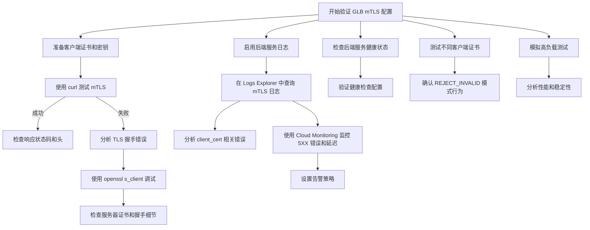
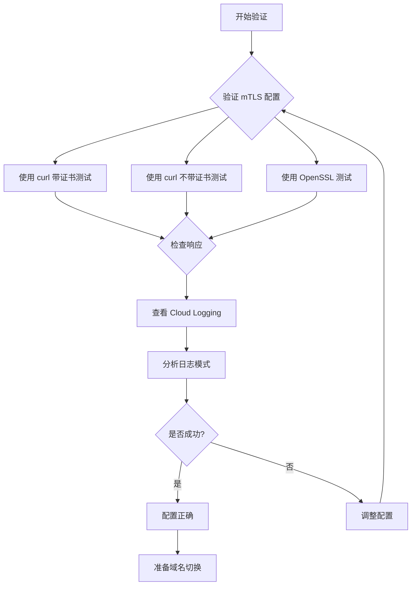

# gemini

全面验证GCP GLB mTLS配置：域名切换前的深度校验与日志分析指南
I. 引言
在现代网络安全架构中，双向传输层安全性 (mTLS) 已成为确保客户端与服务器之间通信完整性与机密性的关键机制。与传统的 TLS 单向认证（仅服务器向客户端证明其身份）不同，mTLS 要求客户端和服务器双方都出示并验证数字证书，从而建立更高级别的信任和安全防护 。对于部署在 Google Cloud Platform (GCP) 上的应用，特别是通过全局负载均衡器 (GLB) 暴露的服务，正确配置 mTLS 至关重要，它能够有效抵御中间人攻击、未经授权的访问和数据泄露，助力实现零信任安全模型 。
用户在 GCP 项目中为 GLB 配置 mTLS 后，通常面临一个挑战：在将生产域名正式切换到新的 GLB IP 地址之前，如何全面验证 mTLS 配置的正确性？直接使用 IP 地址（例如 34.120.88.88）进行测试时，可能会遇到证书域名不匹配等问题。此外，如何有效地从 GCP 获取并分析相关的日志信息，以诊断潜在的配置缺陷，也是一个常见的痛点。
本报告旨在提供一个详尽的指南，专门解决在域名切换前验证 GCP GLB mTLS 配置的各项挑战。报告将深入探讨多种验证方法，包括使用命令行工具如 curl 和 openssl s_client 直接通过 IP 地址进行测试，并阐述如何正确处理服务器名称指示 (SNI) 和证书校验问题。同时，本报告将详细介绍如何从 GCP Cloud Logging 中获取和解读与 mTLS 相关的日志条目，特别是关键的 jsonPayload.statusDetails 字段，以及如何检查后端服务收到的 mTLS 上下文信息。最后，报告将提供一份全面的 GCP 配置审计清单和上线前的最佳实践，帮助用户在域名切换前建立充分的信心，确保 mTLS 功能按预期工作。
II. 通过 IP 地址进行客户端测试（域名切换前）
在将 DNS 记录指向新的 GLB IP 地址之前，通过直接使用 IP 地址进行测试是验证 mTLS 配置的第一步。这有助于隔离 GLB 本身的 mTLS 设置问题，排除 DNS 传播延迟或配置错误的干扰。
A. 使用 curl 进行 mTLS 测试
curl 是一个功能强大的命令行工具，广泛用于进行 HTTP(S) 请求测试。对于 mTLS 验证，需要向 curl 提供客户端证书和私钥。
 * 基本 mTLS 测试命令结构：
   使用 curl 测试 mTLS 时，主要涉及以下参数：
   * --cert <client_cert.pem>: 指定 PEM 格式的客户端证书文件。
   * --key <client_key.pem>: 指定 PEM 格式的客户端私钥文件。
   * --cacert <ca_bundle.pem> (可选但推荐): 指定用于验证 GLB 服务器证书的 CA 证书包。如果 GLB 使用的是公共 CA 签发的证书，curl 通常能自动验证。如果使用私有 CA，则必须提供此 CA 的根证书或中间证书链。
   * -v 或 --verbose: 显示详细的握手信息和头部，有助于调试。
 * 针对 GLB IP 地址进行测试：
   可以直接向 GLB 的 IP 地址发起请求，例如 https://34.120.88.88。
 * 处理服务器名称指示 (SNI) 和证书主机名验证：
   当直接使用 IP 地址访问时，GLB 可能无法确定客户端期望访问哪个域名，导致其无法提供正确的服务器证书，或者客户端因证书中的主机名与请求的 IP 不匹配而拒绝连接。
   * 使用 --resolve 选项指定 SNI：
     --resolve 选项允许将特定的主机名和端口解析到指定的 IP 地址。这使得 curl 在 TLS 握手时能够发送正确的 SNI，GLB 从而可以返回与该主机名匹配的服务器证书。
     命令格式：curl --resolve <域名>:<端口>:<GLB_IP地址> https://<域名> --cert client.pem --key client.key -v
     例如：`curl --resolve your.domain.com:443:34.120.88.88 https://your.domain.com --cert client.pem --key client.key -v 。`
   * 处理服务器证书验证错误：
     * -k 或 --insecure：此选项会使 curl 跳过服务器证书的验证。强烈不建议在生产环境或最终验证中使用此选项，因为它会使连接容易受到中间人攻击 。它仅适用于早期调试，以确认 mTLS 的客户端认证部分是否工作，而不考虑服务器证书的有效性。
     * 使用 --cacert：如前所述，提供正确的 CA 证书包是验证 GLB 服务器证书的安全方法。
 * 预期输出：
   * 成功：如果 mTLS 配置正确，并且客户端证书被 GLB 接受，curl 将成功完成 TLS 握手并收到来自后端服务的 HTTP 响应。详细输出 (-v) 会显示 TLS 握手过程，包括服务器证书和客户端证书的交换。
   * 失败：如果配置错误（例如，客户端证书无效、CA 不受信任、私钥不匹配等），curl 会报告 TLS 握手错误。详细输出将提供关于失败原因的线索，例如 "alert handshake failure"、"certificate verify failed" 等。
下表总结了 curl 进行 mTLS 测试时常用的参数：

| curl 参数 | 描述 | 参考资料 |
|---|---|---|
| --cert <文件路径> | 指定客户端证书文件 (PEM 格式)。 |  |
| --key <文件路径> | 指定客户端私钥文件 (PEM 格式)。 |  |
| --cacert <文件路径> | 指定 CA 证书包文件，用于验证服务器证书。 |  |
| --resolve <主机:端口:IP地址> | 强制将指定的主机和端口解析到给定的 IP 地址，用于正确发送 SNI。 |  |
| -k 或 --insecure | 禁用服务器证书验证 (不安全，仅用于调试)。 |  |
| -v 或 --verbose | 显示详细的通信过程，包括 TLS 握手信息。 |  |
| --cert-type <类型> | 指定客户端证书类型 (如 PEM, DER)。默认为 PEM。 |  |
| --key-type <类型> | 指定客户端私钥类型 (如 PEM, DER)。默认为 PEM。 |  |

B. 使用 openssl s_client 进行 mTLS 测试
openssl s_client 是一个非常强大的 SSL/TLS 诊断工具，可以提供比 curl 更底层的 TLS 握手信息 。
 * 基本 mTLS 测试命令结构：
   * -connect <IP地址>:<端口>: 指定要连接的服务器 IP 地址和端口，例如 34.120.88.88:443 。
   * -cert <client_cert.pem>: 指定客户端证书文件 。
   * -key <client_key.pem>: 指定客户端私钥文件 。
   * -CAfile <ca_bundle.pem>: 指定用于验证服务器证书的 CA 证书文件。这对于确保连接到正确的 GLB 实例并验证其身份至关重要 。
   * -servername <域名>: 此参数用于在 TLS ClientHello 消息中设置 SNI 扩展。即使是连接 IP 地址，也应提供 GLB 配置的预期域名，以便 GLB 返回正确的服务器证书 。
 * 示例命令：
   openssl s_client -connect 34.120.88.88:443 -servername your.domain.com -cert client.pem -key client.key -CAfile your_glb_ca.pem -status -brief
 * 解读输出：
   openssl s_client 的输出非常详细，需要关注以下关键部分：
   * Certificate chain: 显示服务器提供的证书链。可以检查颁发者、使用者、有效期等信息。
   * Client certificate: 如果服务器请求了客户端证书（mTLS 的核心），这里会显示客户端发送的证书信息。
   * SSL-Session:
     * Protocol: 协商的 TLS 协议版本。
     * Cipher: 协商的密码套件。
     * Verify return code: 这是非常重要的一行。0 (ok) 表示服务器证书验证成功（如果使用了 -CAfile 并且匹配）。如果客户端证书验证失败（GLB 侧），连接通常会在此阶段之后被服务器关闭，并可能显示如 handshake failure 的错误。
   * New, TLSv1.x, Cipher is...: 确认 TLS 版本和密码套件。
   * Server public key is...: 服务器公钥的位数。
   * Peer signing digest: 客户端证书签名使用的摘要算法。
   * Peer signature type: 客户端证书签名算法类型。
   * Verification error:...: 如果服务器证书验证失败，这里会显示具体的错误原因。
   * depth=X... verify return:1: 逐级显示证书链的验证状态。
   * 如果 mTLS 成功，命令行会进入一个交互模式，可以输入字符发送到服务器。如果 mTLS 失败，通常会看到 TLS 警报（如 handshake_failure）并且连接被关闭。
下表总结了 openssl s_client 进行 mTLS 测试时常用的参数：

| openssl s_client 参数 | 描述 | 参考资料 |
|---|---|---|
| -connect <主机:端口> | 指定要连接的目标服务器及其端口。 |  |
| -cert <文件路径> | 指定客户端证书文件 (PEM 格式)。 |  |
| -key <文件路径> | 指定客户端私钥文件 (PEM 格式)。 |  |
| -CAfile <文件路径> | 指定包含受信任 CA 证书的文件，用于验证服务器证书。 |  |
| -servername <主机名> | 设置 TLS SNI (Server Name Indication) 扩展，即使连接 IP 也应指定域名。 |  |
| -showcerts | 显示服务器发送的完整证书链 (PEM 格式)。 |  |
| -status | 发送并打印 OCSP 状态请求。 |  |
| -brief | 仅打印简要的连接信息。 |  |
| -verify_return_error | 如果验证失败则返回错误代码，而不是继续连接。 |  |
| -state | 打印 SSL 会话状态。 |  |
| -msg | 显示所有 TLS 协议消息的十六进制转储。 |  |

使用 curl 和 openssl s_client 直接通过 IP 地址测试，并结合 SNI (--resolve 或 -servername)，是在域名切换前验证 GLB mTLS 配置的核心手段。它们能够模拟真实客户端的连接行为，并提供详细的诊断信息，帮助定位配置问题。
C. 本地 hosts 文件测试方法 (可选)
作为 --resolve (curl) 或 -servername (openssl) 的替代或补充方法，可以临时修改测试机器上的 hosts 文件，将目标域名直接映射到 GLB 的 IP 地址。这样，所有使用该域名的网络请求（包括浏览器、curl 等不指定 IP 的工具）都会被导向配置的 GLB IP。
 * 修改 hosts 文件：
   * Linux/macOS: sudo nano /etc/hosts 
   * Windows: 以管理员身份运行记事本，打开 C:\Windows\System32\drivers\etc\hosts 
   * 添加一行，格式为：34.120.88.88 your.domain.com
 * 进行测试：
   修改 hosts 文件后，可以直接使用域名通过 curl、浏览器或其他客户端工具进行测试，无需特殊指定 IP 地址或 SNI（因为操作系统层面已经做了映射）。
   curl https://your.domain.com --cert client.pem --key client.key -v
 * 注意事项：
   * 测试完成后，务必将 hosts 文件恢复原状，以免影响正常的域名解析。
   * 某些操作系统可能需要刷新 DNS 缓存才能使 hosts 文件更改立即生效（例如，macOS 上使用 sudo dscacheutil -flushcache; sudo killall -HUP mDNSResponder）。
   * 此方法修改的是本地测试环境的 DNS 解析行为，对于验证 GLB 的 mTLS 配置非常有效，因为它能更真实地模拟 DNS 切换后的客户端行为。
通过上述客户端测试方法，可以在不影响现有生产流量的情况下，对新 GLB 的 mTLS 配置进行初步但关键的验证。如果这些测试成功，表明 GLB 的 mTLS 策略、信任配置以及客户端证书的验证逻辑基本正确。
III. GCP 日志分析与获取
当客户端测试遇到问题，或者需要更深入地了解 GLB 如何处理 mTLS 请求时，GCP 提供的日志是至关重要的信息来源。
A. 启用和访问 GLB 日志
Google Cloud Load Balancing 的日志记录功能需要为关联的后端服务显式启用。
 * 启用后端服务日志：
   * 对于外部应用负载均衡器，日志记录是在每个后端服务级别上配置的 。
   * 可以在创建新的后端服务时启用日志记录，或为现有的后端服务更新配置。
   * 通过 Google Cloud Console：导航到“负载均衡”，选择相应的负载均衡器，编辑其“后端配置”，然后编辑目标后端服务。在“日志记录”部分，勾选“启用日志记录”并可以设置“采样率”（0.0 到 1.0 之间，1.0 表示记录所有请求）。
   * 通过 gcloud 命令：
     gcloud compute backend-services update BACKEND_SERVICE_NAME \
    --global \
    --enable-logging \
    --logging-sample-rate=1.0

     （如果不是全局后端服务，请移除 --global 或替换为相应的区域标志）。
 * 访问日志：
   * GLB 的日志会发送到 Cloud Logging。
   * 在 Google Cloud Console 中，导航到“日志浏览器”(Logs Explorer) 。
   * 要查看特定 GLB 的日志，可以在资源过滤器中选择“Cloud HTTP Load Balancer”，然后可以按转发规则名称或 URL 映射进行进一步筛选 。
B. 解读 GLB 日志中的 mTLS 相关信息
GLB 日志条目包含丰富的字段，其中一些对于诊断 mTLS 问题特别有用。
 * 关键字段：jsonPayload.statusDetails：
   此字段是诊断 mTLS 握手和客户端证书验证问题的核心。它提供了关于负载均衡器为何返回特定 HTTP 状态码或终止连接的文本说明 。
   以下是一些与 mTLS 客户端证书验证相关的常见 statusDetails 值及其含义：
   * client_cert_not_provided: 客户端在 TLS 握手期间未提供所请求的证书。这通常意味着客户端没有配置证书，或者服务器没有正确请求客户端证书。
   * client_cert_validation_failed: 客户端证书未能通过 TrustConfig 中的 CA 进行验证。可能原因包括：客户端证书由不受信任的 CA 签发，证书链不完整，或者证书本身（如哈希算法）不符合要求（例如使用 MD5、SHA-1 等已弃用的算法）。
   * client_cert_invalid_rsa_key_size: 客户端叶证书或中间证书的 RSA 密钥大小无效。
   * client_cert_unsupported_elliptic_curve_key: 客户端或中间证书使用了不受支持的椭圆曲线。
   * client_cert_unsupported_key_algorithm: 客户端或中间证书使用了非 RSA 或非 ECDSA 算法。
   * client_cert_chain_invalid_eku: 客户端证书或其颁发者证书缺少值为 clientAuth 的扩展密钥用法 (EKU)。这是 mTLS 的一个常见要求。
   * client_cert_validation_not_performed: 配置了 mTLS 但未设置 TrustConfig。
   * client_cert_validation_timed_out: 验证证书链时超时。
   * client_cert_validation_search_limit_exceeded: 尝试验证证书链时达到深度或迭代限制。
     （更多 statusDetails 值可参考 ）
   理解这些 statusDetails 值，可以直接揭示 mTLS 握手失败的具体环节。例如，看到 client_cert_chain_invalid_eku 就应检查客户端证书是否包含正确的 EKU。
 * 查询示例 (Cloud Logging Query Language)：
   * 查找所有与客户端证书相关的错误：
     resource.type="http_load_balancer"
resource.labels.forwarding_rule_name="YOUR_FORWARDING_RULE_NAME" # 可选，替换为您的转发规则名称
jsonPayload.statusDetails=~"client_cert"
jsonPayload.@type="type.googleapis.com/google.cloud.loadbalancing.type.LoadBalancerLogEntry"

     (改编自 )
   * 查找特定错误，例如客户端未提供证书：
     resource.type="http_load_balancer"
jsonPayload.statusDetails="client_cert_not_provided"

 * 其他相关日志字段：
   * httpRequest.status: HTTP 响应状态码。对于 mTLS 失败，如果 GLB 配置为拒绝无效证书，通常不会有 HTTP 状态码，连接会在 TLS 层终止。如果配置为允许无效证书并转发，则后端可能会返回错误，或者此字段可能为 0，表示连接在 LB 响应前中断 。
   * tls.earlyDataRequest: 指示请求是否包含 TLS 早期数据 。
   * jsonPayload.proxyStatus.proxy_status_error: 对于区域性或内部负载均衡器，此字段可能包含有关 TLS 错误的更详细信息，例如客户端未能证明其拥有私钥时 。
下表列出了对 GLB mTLS 问题诊断至关重要的 jsonPayload.statusDetails 值：

| jsonPayload.statusDetails 值 | 含义 | 可能原因/故障排除方向 |
|---|---|---|
| client_cert_not_provided | 客户端未提供证书。 | 客户端未配置证书发送；服务器未正确请求客户端证书。 |
| client_cert_validation_failed | 客户端证书验证失败 (基于 TrustConfig)。 | 证书由不受信任的 CA 签发；证书链不完整；证书使用弱哈希算法 (MD5, SHA-1)；证书过期或格式错误。 |
| client_cert_chain_invalid_eku | 客户端证书或其颁发者缺少 clientAuth EKU。 | 客户端证书未被正确签发用于客户端认证。 |
| client_cert_validation_not_performed | 配置了 mTLS 但未设置 TrustConfig。 | GLB 的 mTLS 配置不完整，缺少信任锚。 |
| client_cert_expired | 客户端证书已过期。 | 更新客户端证书。 |
| client_cert_unsupported_key_algorithm | 客户端证书使用了不受支持的密钥算法。 | 客户端证书应使用 RSA 或 ECDSA。 |
| failed_to_connect_to_backend | 负载均衡器无法连接到后端。 | 虽然不是直接的 mTLS 客户端错误，但如果所有后端都因其他原因不健康，即使 mTLS 成功，请求也会失败。检查后端健康状况和防火墙规则。 |
| ssl_certificate_error (通用，需结合其他信息) | 通用 SSL 证书错误。 | 可能是服务器端证书问题或更广泛的 TLS 配置问题。 |

C. 理解后端服务日志和自定义标头 (传递给后端的 mTLS 上下文)
GLB 在与客户端完成 mTLS 握手后，可以将关于该 mTLS 连接和客户端证书的上下文信息通过自定义 HTTP 标头传递给后端服务 。这对于后端应用根据 mTLS 验证结果执行进一步的授权逻辑至关重要。
 * mTLS 信息如何到达后端：
   由于 GLB 终止了来自客户端的 TLS 连接并与后端建立新的连接（可能是 HTTP 或 HTTPS），后端服务本身不直接参与与原始客户端的 mTLS 握手。因此，GLB 必须通过带外方式（即 HTTP 标头）传递这些信息。
 * 标准的 mTLS 相关自定义标头：
   GCP GLB 支持通过在后端服务中配置自定义请求标头来传递 mTLS 上下文。这些标头的值使用特定的占位符变量，由 GLB 在请求转发时填充 。
   常用的 mTLS 相关标头及其占位符包括：
   * X-Client-Cert-Present: {client_cert_present}: 布尔值，指示客户端是否提供了证书。
   * X-Client-Cert-Chain-Verified: {client_cert_chain_verified}: 布尔值，指示客户端证书链是否成功验证。
   * X-Client-Cert-Error: {client_cert_error}: 字符串，如果证书验证失败，则包含失败的原因。
   * X-Client-Cert-Hash: {client_cert_sha256_fingerprint}: 客户端证书的 SHA256 指纹。
   * X-Client-Cert-Serial-Number: {client_cert_serial_number}: 客户端证书的序列号。
   * X-Client-Cert-SPIFFE-Id: {client_cert_spiffe_id}: 客户端证书的 SPIFFE ID (如果存在)。
   * X-Client-Cert-URI-SANs: {client_cert_uri_sans}: 客户端证书中的 URI类型的 SANs (逗号分隔)。
   * X-Client-Cert-DNSName-SANs: {client_cert_dnsname_sans}: 客户端证书中的 DNSName 类型的 SANs (逗号分隔)。
     (部分示例见 ，完整列表需查阅 GCP 官方文档)
     注意：用户在  中提到 x-forwarded-for-client-cert 未被传递，应关注 GCP 官方文档中记录的标准 mTLS 自定义标头。
 * 在后端服务上配置自定义请求标头：
   * 通过 Google Cloud Console：编辑后端服务，在“高级配置”下的“自定义请求标头”部分添加上述标头及其占位符 。
   * 通过 gcloud 命令：
     gcloud compute backend-services update BACKEND_SERVICE_NAME \
    --global \
    --custom-request-header='X-Client-Cert-Present:{client_cert_present}' \
    --custom-request-header='X-Client-Cert-Chain-Verified:{client_cert_chain_verified}' \
    --custom-request-header='X-Client-Cert-Error:{client_cert_error}'
    # 添加其他需要的标头

 * 配置后端应用 (例如 Nginx, Apache) 记录这些标头：
   为了验证这些 mTLS 上下文信息是否正确传递并被后端应用接收，需要在后端应用的访问日志中记录这些自定义标头。
   * Nginx 示例 (nginx.conf 中的 log_format 指令)：
     log_format mtls_log '$remote_addr - $remote_user [$time_local] "$request" '
                   '$status $body_bytes_sent "$http_referer" '
                   '"$http_user_agent" "$http_x_forwarded_for" '
                   '"X-Client-Cert-Present: $http_x_client_cert_present" '
                   '"X-Client-Cert-Chain-Verified: $http_x_client_cert_chain_verified" '
                   '"X-Client-Cert-Error: $http_x_client_cert_error"';
access_log /var/log/nginx/access.log mtls_log;

     (Nginx 变量名通常是 HTTP 标头名称的小写形式，并用 http_ 前缀替换破折号)
   * Apache 示例 (httpd.conf 或虚拟主机配置中的 LogFormat 和 CustomLog 指令)：
     LogFormat "%h %l %u %t \"%r\" %>s %b \"%{Referer}i\" \"%{User-Agent}i\" \"X-Client-Cert-Present: %{X-Client-Cert-Present}i\" \"X-Client-Cert-Chain-Verified: %{X-Client-Cert-Chain-Verified}i\" \"X-Client-Cert-Error: %{X-Client-Cert-Error}i\"" mtls_combined
CustomLog logs/access_log mtls_combined

     (Apache 中使用 %{Header-Name}i 来引用请求标头)
     (一般标头记录概念来自 ；特定的 mTLS 标头来自 )
   在后端日志中检查这些标头，可以确认 GLB 不仅执行了 mTLS 验证，而且将验证结果正确地传递给了后端应用。如果后端应用依赖这些信息进行授权决策，那么这一环节的验证就尤为重要。
下表汇总了 GCP GLB 可以传递给后端的关键 mTLS 自定义请求标头：

| 标头名称 (在后端服务中配置) | 占位符变量 | 描述的信息 |
|---|---|---|
| X-Client-Cert-Present | {client_cert_present} | 客户端是否提供了证书 (true/false)。 |
| X-Client-Cert-Chain-Verified | {client_cert_chain_verified} | 客户端证书链是否通过验证 (true/false)。 |
| X-Client-Cert-Error | {client_cert_error} | 如果证书验证失败，则为失败原因的字符串。 |
| X-Client-Cert-Hash | {client_cert_sha256_fingerprint} | 客户端叶证书的 SHA256 指纹。 |
| X-Client-Cert-Serial-Number | {client_cert_serial_number} | 客户端叶证书的序列号。 |
| X-Client-Cert-SPIFFE-Id | {client_cert_spiffe_id} | 客户端叶证书的 SPIFFE ID (如果存在)。 |
| X-Client-Cert-URI-SANs | {client_cert_uri_sans} | 客户端叶证书中所有 URI 类型的 Subject Alternative Names (逗号分隔)。 |
| X-Client-Cert-DNSName-SANs | {client_cert_dnsname_sans} | 客户端叶证书中所有 DNSName 类型的 Subject Alternative Names (逗号分隔)。 |


通过结合 GLB 日志和后端应用日志，可以全面了解 mTLS 握手的全过程及其结果如何影响到最终的应用请求处理。
IV. 全面 GCP 配置审计
除了客户端测试和日志分析，对 GCP 中涉及 mTLS 的各项资源配置进行彻底审计也至关重要。这能确保所有组件都按照预期协同工作。
A. 验证 TargetHTTPSProxy mTLS 配置
TargetHTTPSProxy 是 GLB 前端的核心组件，mTLS 的客户端验证策略在此定义。
 * 描述 TargetHTTPSProxy：
   使用 gcloud 命令查看 TargetHTTPSProxy 的详细配置：
   gcloud compute target-https-proxies describe YOUR_PROXY_NAME --global
   
   在输出中，需要关注与客户端 TLS 策略或 mTLS 相关的字段。根据较新的配置方式，这可能是一个 mtlsPolicy 块，或者是一个指向“客户端身份验证”(Client Authentication) 资源的引用，该资源在某些文档中也被称为 ServerTlsPolicy（尽管其功能是定义客户端证书的验证策略）。
 * 检查客户端身份验证 (ClientAuthentication / ServerTlsPolicy) 资源：
   此资源定义了 GLB 如何处理客户端证书 。
   关键属性包括：
   * clientValidationMode (或类似名称)：决定了当客户端证书验证失败或缺失时的行为。常见值有：
     * ALLOW_INVALID_OR_MISSING_CLIENT_CERT: 即使客户端证书无效或未提供，请求也会被转发到后端（通常会通过自定义标头传递验证失败的信息）。
     * REJECT_INVALID: 如果客户端证书无效或验证失败，连接将被终止 。
   * trustConfig (或类似名称)：引用了用于验证客户端证书的 TrustConfig 资源 。
   可以通过 Google Cloud Console 中的“身份验证配置”(Authentication Configuration) 页面检查此资源，或使用类似如下的 gcloud 命令（具体命令可能因资源确切类型而异，需参考最新 gcloud 文档）：
   gcloud certificate-manager client-tls-policies describe POLICY_NAME --location=global (假设资源类型为 client-tls-policies)
   或者，如果它是作为 TargetHttpsProxy 的内嵌策略：
   gcloud compute target-https-proxies describe YOUR_PROXY_NAME --global 的输出中会包含这些设置。
 * 验证 TrustConfig 资源：
   TrustConfig 资源包含了 GLB 用来验证客户端证书的信任锚（根 CA 证书）和可选的中间 CA 证书 。
   需要验证：
   * 正确的根 CA 证书是否已作为 trustAnchors 上传。
   * 所有必需的中间 CA 证书是否包含在 intermediateCas 中。
   * （可选）如果配置了 allowlistedCertificates，检查是否包含了期望直接信任的特定客户端证书 。
   可以通过 Certificate Manager 控制台或使用 gcloud 命令检查：
   gcloud certificate-manager trust-configs describe YOUR_TRUST_CONFIG_NAME --location=global 
   TargetHTTPSProxy、客户端身份验证策略和 TrustConfig 共同构成了 GLB 客户端 mTLS 验证逻辑的核心。其中任何一个环节配置错误（例如，clientValidationMode 设置不当，或 TrustConfig 中缺少正确的客户端 CA），都会直接导致 mTLS 失败。系统地审计这些组件至关重要。如果客户端提供的证书是由一个未包含在 TrustConfig 中的 CA 签发的，那么验证将会失败 。
B. 验证服务器端 SSL/TLS 配置 (GLB 到客户端)
虽然用户的核心问题是 mTLS（客户端认证），但 GLB 与客户端之间的基础 TLS（服务器认证）必须首先稳固建立。
 * 检查 GLB 的服务器 SSL 证书：
   确保附加到 TargetHTTPSProxy 的是正确的服务器 SSL 证书，即客户端将看到并验证的证书。
   验证其状态（例如 ACTIVE）、涵盖的域名以及有效期 。
   使用 gcloud 命令：
   gcloud compute ssl-certificates describe YOUR_CERT_NAME --global
   或者：
   gcloud compute target-https-proxies describe YOUR_PROXY_NAME --global --format="get(sslCertificates)" 
   这是标准的 TLS 配置，但它是 mTLS 能够开始的前提。
 * 检查 SSL 策略：
   附加到 TargetHTTPSProxy 的 SSL 策略定义了 GLB 将与客户端协商的 TLS 版本（例如 TLS 1.2, TLS 1.3）和密码套件 。
   验证该策略是否符合安全要求和客户端兼容性。
   使用 gcloud 命令：
   gcloud compute ssl-policies describe YOUR_SSL_POLICY_NAME --global 或在控制台中查看 。
   mTLS 是 TLS 的扩展。标准的 TLS 握手（服务器身份验证、会话密钥建立）必须成功完成，然后才能进行客户端身份验证（mTLS 中的 'm'）。因此，验证 GLB 自身的证书和 SSL 策略是先决条件。
C. 确保后端服务健康和配置
即使客户端到 GLB 的 mTLS 完美无缺，如果后端服务不健康或配置不当，用户仍会遇到错误。
 * 确认后端健康检查状态：
   GLB 只有在后端实例健康时才会向其转发请求 。
   使用 gcloud 命令：
   gcloud compute backend-services get-health YOUR_BACKEND_SERVICE_NAME --global 
   或在控制台中检查。确保防火墙规则允许来自 GCP 健康检查探测器的流量（通常源 IP 范围是 35.191.0.0/16 和 130.211.0.0/22）。
 * 验证后端服务协议：
   后端服务的协议（例如 HTTPS、HTTP/2、HTTP）应正确配置。如果 GLB 与后端之间也使用 HTTPS (即后端 mTLS 或后端 TLS)，则需要确保后端配置了有效的服务器证书，并且 GLB 的后端服务配置了正确的验证逻辑（例如，通过 BackendAuthenticationConfig）。但这与客户端到 GLB 的 mTLS 是不同的连接段。
 * 审查 mTLS 的自定义请求标头（如第 III.C 节所述）：
   再次确认后端服务已配置为添加期望的 mTLS 上下文标头（例如 X-Client-Cert-Present 等），以便后端应用可以接收到这些信息 。
   GLB 充当代理。在通过 mTLS 对客户端进行身份验证后，它需要将请求转发到健康的后端。如果所有后端都不健康，即使 mTLS 成功，GLB 也会返回错误（例如 502 failed_to_pick_backend）。同样，如果未在后端服务上配置用于将 mTLS 上下文传递到后端的自定义标头，则后端应用程序将丢失此关键信息。
下表汇总了用于验证 mTLS 各配置组件的 gcloud 命令：

| GCP 资源 | gcloud 命令 (示例) | 关键检查信息 |
|---|---|---|
| TargetHTTPSProxy | gcloud compute target-https-proxies describe <PROXY_NAME> --global | 关联的客户端身份验证策略 (例如 clientTlsPolicy 或 mtlsPolicy 块)，服务器 SSL 证书，SSL 策略。 |
| 客户端身份验证策略 (ClientTlsPolicy) | gcloud certificate-manager client-tls-policies describe <POLICY_NAME> --location=global (或从 TargetHTTPSProxy 输出中获取) | clientValidationMode (例如 REJECT_INVALID, ALLOW_INVALID_OR_MISSING_CLIENT_CERT)，引用的 TrustConfig。 |
| TrustConfig | gcloud certificate-manager trust-configs describe <TRUST_CONFIG_NAME> --location=global | trustAnchors (根 CA)，intermediateCas (中间 CA)，allowlistedCertificates (可选的白名单证书)。 |
| GLB 服务器 SSL 证书 | gcloud compute ssl-certificates describe <CERT_NAME> --global | 证书状态 (ACTIVE)，域名覆盖，有效期。 |
| SSL 策略 | gcloud compute ssl-policies describe <SSL_POLICY_NAME> --global | 最低 TLS 版本，启用的 TLS 特性/密码套件。 |
| 后端服务健康 | gcloud compute backend-services get-health <BACKEND_SERVICE_NAME> --global | 后端实例组或 NEG 的健康状况。 |
| 后端服务自定义标头 | gcloud compute backend-services describe <BACKEND_SERVICE_NAME> --global | 检查 customRequestHeaders 字段是否包含配置的 mTLS 上下文标头 (如 X-Client-Cert-Present:{client_cert_present}). |


通过系统地执行这些审计步骤，可以大大提高在域名切换前发现并修复 mTLS 配置问题的几率。
V. 高级诊断与上线前最佳实践
除了直接的客户端测试、日志分析和配置审计，还可以利用一些高级诊断工具和遵循最佳实践来进一步确保 mTLS 配置的稳健性。
A. 利用 GCP 连接性测试 (主要用于网络路径验证)
GCP 连接性测试 (Connectivity Tests) 是一个强大的诊断工具，可以帮助验证网络路径的连通性 。
 * 功能与范围：连接性测试通过分析网络配置（如 VPC 网络、防火墙规则、路由、VPN 通道等）并模拟数据包的预期转发路径，来检查两个网络端点之间的连接性。在某些情况下，它还会执行实际的数据平面分析，发送探测包以验证连接并提供延迟和丢包的基线诊断 。
 * 对于 GLB mTLS 的应用：
   * 可以创建从代表性客户端源（例如，互联网上的某个 IP，或 VPC 内的某个 VM）到 GLB VIP 地址（例如 34.120.88.88）的连接性测试。
   * 还可以测试从 GLB（作为源）到后端实例的连接性。
   * 这有助于诊断是否存在底层网络问题，例如防火墙规则阻止了到 GLB IP 地址 443 端口的流量，或者 GLB 无法访问后端实例。
 * 局限性：需要明确的是，连接性测试主要关注 L3/L4 层的网络可达性，它不直接诊断 TLS/mTLS 握手的具体细节，如证书交换、密码套件协商或客户端身份验证逻辑 。它的作用是排除或确认网络层面的故障。如果连接性测试显示从客户端到 GLB IP 和端口 443 的路径是通畅的，那么 curl 或 openssl s_client 测试的失败更有可能归因于 TLS/mTLS 配置本身。
 * 如何使用：在 GCP Console 的“网络智能中心”下找到“连接性测试”，创建新的测试，指定源和目标（IP 地址、VM 实例等）、协议（TCP）和目标端口（443）。运行测试后，分析结果会显示模拟数据包的路径以及任何检测到的配置问题 。
虽然不是专门的 mTLS 验证工具，但连接性测试可以有效地排除可能被误认为是 mTLS 问题的底层网络连接障碍。
B. 常见 mTLS 错误配置与故障排除步骤
在配置和测试 mTLS 时，可能会遇到一些常见的问题。了解这些陷阱有助于快速定位和解决问题。
 * 客户端问题：
   * 证书或密钥错误：客户端使用了错误的证书文件、私钥文件，或者私钥与证书不匹配。
   * 证书过期：客户端证书已过有效期。
   * CA 不受信任：客户端证书不是由 GLB 的 TrustConfig 中配置的 CA 之一签发的，或者证书链不完整，导致 GLB 无法验证其信任路径 。
   * 缺少 clientAuth EKU：客户端证书的扩展密钥用法 (EKU) 中没有包含 clientAuth (OID: 1.3.6.1.5.5.7.3.2)，这是许多 mTLS 实现的要求 。
   * 客户端未发送证书：客户端应用没有被正确配置为在 TLS 握手期间收到服务器的 CertificateRequest 消息后发送其证书。
   * TLS 版本或密码套件不兼容：客户端尝试使用的 TLS 版本或密码套件不被 GLB 的 SSL 策略支持。
 * GLB 配置问题：
   * TrustConfig 配置错误：TrustConfig 中未包含正确的客户端根 CA 或中间 CA 证书 。或者，上传的证书格式不正确。
   * 客户端身份验证策略模式不当：clientValidationMode 设置与预期不符。例如，期望严格拒绝无效证书 (REJECT_INVALID)，但实际配置为允许 (ALLOW_INVALID_OR_MISSING_CLIENT_CERT)，反之亦然。
   * GLB 服务器证书问题：GLB 自身的服务器证书过期、域名不匹配（尽管 SNI 通常能解决此问题，但仍需检查），或不受客户端信任。
   * SSL 策略过于严格：SSL 策略中配置的 TLS 最低版本过高，或密码套件列表过于受限，导致某些合法客户端无法连接。
   * 未正确关联资源：例如，TrustConfig 或客户端身份验证策略未正确关联到 TargetHTTPSProxy。
 * 网络/防火墙问题：
   * 防火墙（GCP 防火墙规则或客户端侧防火墙）阻止了到 GLB IP 地址的 TCP 端口 443 的流量。这可以通过连接性测试来排查。
 * 故障排除主要依据：
   * GLB 日志中的 jsonPayload.statusDetails：这是诊断 GLB 端 mTLS 问题的首要信息来源（详见第 III.B 节）。
   * 客户端工具的详细输出：curl -v 和 openssl s_client 的输出提供了 TLS 握手过程的详细信息。
   * 后端服务日志中的自定义标头：检查后端是否收到了预期的 mTLS 上下文标头（详见第 III.C 节）。
   * GCP 配置审计：系统地检查所有相关 GCP 资源的配置（详见第 IV 节）。
   * 参考 GCP 关于外部 HTTPS 负载均衡器 5XX 错误的故障排除指南 ，因为某些后端问题有时可能间接影响或被误认为是 mTLS 问题。
通过对这些常见错误配置的了解，可以更有针对性地进行故障排查，从而缩短解决问题的时间。
C. 域名切换前 mTLS 验证清单
在进行最终的 DNS 域名切换之前，强烈建议执行以下全面的验证清单，以确保 mTLS 配置按预期工作，并最大限度地降低对生产环境造成影响的风险。
下表提供了一个结构化的清单：

| 验证步骤 | 工具/方法 | 关键成功标准/检查点 | 相关报告章节 |
|---|---|---|---|
| 1. 客户端 curl 测试 (IP 直连) | curl 命令行工具 | 使用 --resolve 指定 SNI，提供客户端证书和密钥。成功建立 TLS 连接并收到预期 HTTP 响应。详细输出 (-v) 显示正确的证书交换和握手成功。 | II.A |
| 2. 客户端 openssl s_client 测试 (IP 直连) | openssl s_client 命令行工具 | 使用 -connect IP:PORT 和 -servername 指定 SNI，提供客户端证书和密钥。TLS 握手成功，Verify return code: 0 (ok) (若验证服务器证书)，服务器请求并接受客户端证书。 | II.B |
| 3. (可选) 本地 hosts 文件测试 | 修改本地 hosts 文件，然后使用 curl 或浏览器 | 域名成功解析到 GLB IP。使用域名进行 mTLS 测试成功。 | II.C |
| 4. GLB 日志分析 | GCP Cloud Logging (日志浏览器) | 为后端服务启用日志记录。查询 GLB 日志，检查 jsonPayload.statusDetails 是否有 mTLS 相关错误 (如 client_cert_not_provided, client_cert_validation_failed)。对于成功的 mTLS 连接，不应出现验证错误。 | III.A, III.B |
| 5. 后端服务日志检查 (mTLS 自定义标头) | 检查后端应用 (Nginx, Apache 等) 的访问日志 | 如果配置了 mTLS 自定义标头 (如 X-Client-Cert-Present)，确认这些标头已正确传递并记录在后端日志中，其值符合预期 (例如，对于成功验证的客户端，X-Client-Cert-Chain-Verified 应为 true)。 | III.C |
| 6. TargetHTTPSProxy 配置审计 | gcloud compute target-https-proxies describe... | 确认已关联正确的客户端身份验证策略 (ClientTlsPolicy / mtlsPolicy)。 | IV.A |
| 7. 客户端身份验证策略审计 | gcloud certificate-manager client-tls-policies describe... (或 TargetHTTPSProxy 输出) | 确认 clientValidationMode (例如 REJECT_INVALID) 和引用的 TrustConfig 符合预期。 | IV.A |
| 8. TrustConfig 审计 | gcloud certificate-manager trust-configs describe... | 确认 trustAnchors 包含所有合法的客户端根 CA，intermediateCas 包含所有必需的中间 CA。 | IV.A |
| 9. GLB 服务器 SSL 证书审计 | gcloud compute ssl-certificates describe... | 确认 GLB 使用的服务器证书状态为 ACTIVE，域名正确，且未过期。 | IV.B |
| 10. SSL 策略审计 | gcloud compute ssl-policies describe... | 确认 SSL 策略定义的 TLS 版本和密码套件符合安全要求和客户端兼容性。 | IV.B |
| 11. 后端服务健康检查 | gcloud compute backend-services get-health... | 确认所有后端实例或 NEG 端点均处于健康状态。防火墙规则允许健康检查流量。 | IV.C |
| 12. (可选) GCP 连接性测试 | GCP Console (网络智能中心 -> 连接性测试) | 验证从代表性客户端源到 GLB VIP (端口 443) 以及从 GLB 到后端的 L3/L4 网络路径通畅。 | V.A |

完成此清单中的所有适用步骤，并确认各项检查均符合预期，将为域名切换提供坚实的基础和高度的信心。
VI. 结论与最终建议
在将生产域名切换到配置了 mTLS 的 GCP 全局负载均衡器 (GLB) 之前，进行全面细致的验证是确保服务平稳过渡和安全运行的不可或缺的环节。本报告详细阐述了多种验证方法和诊断途径，旨在帮助用户系统地完成这一过程。
关键验证步骤回顾：
 * 客户端直接 IP 测试：通过 curl (配合 --resolve) 和 openssl s_client (配合 -servername)，使用客户端证书和密钥直接测试 GLB 的 IP 地址，模拟 mTLS 握手过程，是域名切换前最直接有效的验证手段。
 * GCP 日志深入分析：启用并仔细审查 GLB 在 Cloud Logging 中的日志，特别是 jsonPayload.statusDetails 字段，可以准确诊断 mTLS 握手失败的具体原因。同时，检查后端服务日志中由 GLB 传递的 mTLS 上下文自定义标头，可以确认信息流的完整性。
 * GCP 配置全面审计：使用 gcloud 命令或 GCP Console 仔细核查 TargetHTTPSProxy、客户端身份验证策略 (ClientTlsPolicy/mtlsPolicy)、TrustConfig、服务器 SSL 证书、SSL 策略以及后端服务的健康状况和配置，确保所有组件协同工作。
域名切换前的最终建议：
 * 通过彻底测试建立信心：只有在上述各项测试和审计均显示配置正确且功能符合预期后，才应考虑进行 DNS 切换。
 * 制定 DNS 回滚计划：尽管进行了详尽测试，但在复杂的生产环境中仍可能出现未预见的问题。因此，在进行 DNS 切换前，务必准备好快速有效的 DNS 回滚计划，以便在必要时能迅速恢复到切换前的状态。
 * 切换后密切监控：在 DNS 记录切换生效后，应立即并持续密切监控 GLB 的日志（特别是错误率和 statusDetails）、后端服务的健康状况以及关键业务指标，以便及时发现并响应任何异常。
 * 持续的证书生命周期管理：mTLS 依赖于有效的数字证书。务必建立完善的证书管理流程，包括监控客户端证书和服务器证书的有效期，并按时续订和轮换，以避免因证书过期导致的服务中断 。
 * 文档化配置和测试结果：详细记录 mTLS 的配置参数、测试过程、遇到的问题及其解决方案，以及最终的验证结果。这对于未来的维护、故障排除和知识传递都非常有价值。
遵循本报告中概述的验证策略和最佳实践，可以显著提高 GCP GLB mTLS 配置的可靠性和安全性，确保在域名切换后，应用能够为授权客户端提供安全、可信的访问。


# ChatGPT 
你现在的场景是在 GLB（Google Cloud Load Balancer）配置好 mTLS 后，还未正式进行 域名切换，想验证配置正确性并获取相关日志信息。下面我将从三个角度为你提供完整思路和可执行建议：

  

  

  

  

✅ 验证方式（在未切换域名的情况下）

  

  

  

1. 使用 

curl

 测试 IP 地址 + 客户端证书（mTLS）

  

  

你可以使用下面命令验证：

curl -v https://34.120.88.88 \

  --cert client.crt \

  --key client.key \

  --cacert ca.crt

  

- client.crt 是客户端证书。
- client.key 是私钥。
- ca.crt 是 GLB 所信任的 CA（即 TrustConfig 中定义的）。
- 若配置成功，应能拿到 200 OK 或目标服务响应。

  

  

注意事项：

  

- 若你开启了 Host-based Routing（基于域名），可加 -H "Host: example.com"：

  

curl -v https://34.120.88.88 --cert client.crt --key client.key --cacert ca.crt -H "Host: yourdomain.com"

  

  

  

  

  

2. 使用 OpenSSL 检查 TLS 层握手

  

  

可以分析 TLS 连接和证书握手过程：

openssl s_client -connect 34.120.88.88:443 \

  -cert client.crt \

  -key client.key \

  -CAfile ca.crt

  

- 可以确认 TLS 成功与否、证书链是否正常。
- 注意输出中的 Verify return code: 0 (ok) 说明成功。

  

  

  

  

  

3. 使用自定义 header 验证后端

  

  

如果你在 BackendService 或服务后端（如 Nginx 或 App） 中配置了自定义 header（例如 X-Client-Cert），可检查服务日志看该 header 是否被注入。

  

  

  

  

🔍 获取日志信息（GLB 和后端）

  

  

  

1. 

开启 Cloud Logging（推荐）

  

  

确保 GCP 的 Logging 在以下层开启：

|   |   |   |
|---|---|---|
|层级|启用位置|日志类型说明|
|HTTPS LB|Load balancer → Logging|接收层流量，含 TLS 握手失败、连接状态等|
|Backend Service|Backend service → Logging|请求是否命中 backend|
|GKE/Nginx/App|GKE Pod / Nginx / Runtime日志|实际业务日志|

🔧 开启步骤：

  

1. 打开 GCP Console
2. 进入 Network Services → Load Balancing
3. 选择你的 HTTPS Load Balancer
4. 查看 Backend Service 配置
5. 确保 “Enable logging” 勾选，并选择合适的采样率（可设为 1.0 以捕获所有请求）

  

  

📍查看路径：

Cloud Logging 控制台中搜索：

resource.type="http_load_balancer"

resource.labels.forwarding_rule_name="your-forwarding-rule-name"

或者用：

resource.type="https_load_balancer"

jsonPayload.statusDetails:("client_tls_handshake_failed" OR "backend_connection_closed" OR "ok")

  

  

  

  

2. 

抓包分析（本地调试）

  

  

如果 curl 报错，但你无法定位是哪一层失败，可以抓包：

sudo tcpdump -i any port 443 -w mtls_glb_test.pcap

然后用 Wireshark 观察：

  

- 是否握手成功
- TLS Alert 是否为 certificate_unknown、unknown_ca 等

  

  

  

  

  

🔬 高级验证策略（推荐）

  

|   |   |
|---|---|
|验证方法|说明|
|使用自定义 health check 模拟请求|自定义一个 HTTPS health check 含 client cert 去验证后端响应是否符合预期（可用于模拟 mTLS 流程）|
|配置 Preview 域名|若你可控制 DNS，可设一个 preview.yourdomain.com 指向新 IP 用于测试|
|设置 backend header echo|后端服务打印所有 header（特别是 X-Client-Cert, X-Forwarded-For）帮助验证|
|使用 GCP Cloud Monitoring 中的 mTLS 指标（如果已开启）|查看 handshake 成功率、latency、cert fingerprint 使用情况等|

  

  

  

  

✅ 最佳实践流程（Mermaid）

  

graph TD;

    A[准备 client cert, key, CA cert] --> B[用 curl / openssl 测试 IP];

    B --> C[观察 TLS 连接是否成功];

    C --> D[开启 GLB 和 Backend Logging];

    D --> E[使用 Logging 查询 handshake / backend 日志];

    E --> F[设置 preview DNS 进行更真实验证];

  

  

  

  

总结表格

  

|   |   |   |
|---|---|---|
|工具/方式|功能|说明|
|curl -v|模拟请求（含 mTLS）|必须传入 --cert / --key / --cacert|
|openssl s_client|分析 TLS 握手|可看到详细 TLS 层信息|
|Cloud Logging|查看 handshake/forwarding 日志|需启用后查看 https_load_balancer 类型日志|
|tcpdump/Wireshark|抓包分析 TLS 问题|用于 curl 报错时进一步诊断|
|backend logs|查看 backend 是否收到请求|需要开启 logging 或在后端记录日志|
|自定义域名|设置 preview 环境测试域名|模拟切换后的真实访问效果|

  

  

  

如果你提供当前配置（如 TrustConfig、BackendService 是否启用 header 插入等），我可以帮你进一步诊断具体的验证命令和日志查询语句。是否需要我生成一个日志查询的模板？


以下是适用于 GCP HTTPS Load Balancer + mTLS 的 Cloud Logging 日志查询模板，你可以在 Cloud Logging Explorer 中粘贴使用（支持自定义时间范围等）。

  

  

  

  

📌 查询 1：GLB 接收请求日志（含 TLS 握手状态）

  

resource.type="https_load_balancer"

resource.labels.forwarding_rule_name="your-forwarding-rule-name"

logName="projects/your-project-id/logs/requests"

  

✅ 如果你想过滤只看异常情况（如 TLS 握手失败）：

  

resource.type="https_load_balancer"

resource.labels.forwarding_rule_name="your-forwarding-rule-name"

logName="projects/your-project-id/logs/requests"

jsonPayload.statusDetails != "response_sent_by_backend"

  

🔍 常见 statusDetails 值（可帮助识别问题）：

  

|   |   |
|---|---|
|statusDetails|说明|
|client_tls_handshake_failed|客户端 TLS 握手失败（证书问题/格式错误）|
|client_closed_connection|客户端未完成连接或断开|
|response_sent_by_backend|请求成功发送至后端|
|backend_connection_closed|后端连接提前关闭|

  

  

  

  

📌 查询 2：后端服务日志（BackendService → VM/GKE）

  

  

若你启用了 backend logging（默认会记录实际流量日志），可使用：

resource.type="http_load_balancer"

resource.labels.backend_service_name="your-backend-service-name"

logName="projects/your-project-id/logs/requests"

📘 如果你用的是 GKE 后端，请同时检查 GKE Pod 的 stdout 日志。

  

  

  

  

📌 查询 3：GKE 服务日志（用于验证 Header 插入 / 客户端信息）

  

  

假设你启用了 Nginx 或 App 日志输出：

resource.type="k8s_container"

resource.labels.project_id="your-project-id"

resource.labels.cluster_name="your-cluster-name"

resource.labels.namespace_name="your-namespace"

resource.labels.container_name="your-container"

你也可以加：

textPayload:"X-Client-Cert"

  

  

  

  

✅ 使用建议

  

|   |   |
|---|---|
|情况|查询建议|
|验证是否 mTLS 成功|查询 GLB 日志中 statusDetails="response_sent_by_backend"|
|验证证书失败|搜索 client_tls_handshake_failed 或 tls_handshake_failure|
|观察请求内容是否到后端|检查后端日志中是否含有 X-Client-Cert 等|
|多客户端测试 mTLS|搭配 X-Forwarded-For、自定义 header 观察不同行为|

  

  

  

  

🧪 示例命令用于 curl 生成日志：

  

curl -v https://34.120.88.88 \

  --cert client.crt \

  --key client.key \

  --cacert ca.crt \

  -H "Host: yourdomain.com"

执行完后约几秒钟内你可以在 Cloud Logging 查询上面日志，看有没有 statusCode: 200、response_sent_by_backend 以及 client IP、证书 fingerprint 等字段。

  

  

  

是否需要我帮你定制一个完整的 curl 脚本 + Cloud Logging 查询模板（包括你当前使用的 forwarding rule name 和 backend service name）？你也可以提供项目 ID 和 LB 名称，我来为你组合完整的可执行命令。

# Grok 
在 Google Cloud Platform (GCP) 中配置了全局负载均衡器（Global Load Balancer, GLB）的 mTLS（Mutual TLS）后，在域名切换之前验证配置是否正确非常重要。你提到使用 curl -v https://34.120.88.88 可以看到一些返回信息，但需要进一步验证 mTLS 配置的正确性以及获取相关日志。本回答将详细说明如何验证 GLB 的 mTLS 配置、提供多种校验方法，并指导如何获取和分析日志，全部以 Markdown 格式输出，并附带流程图以帮助理解。

  

验证 GCP GLB mTLS 配置的方法

在域名切换之前，你可以通过以下方法验证 GLB 的 mTLS 配置是否正确。这些方法涵盖了直接测试、证书验证、后端通信检查等多个方面。

1. 使用 `curl` 测试 mTLS 配置

你已经尝试了 curl -v https://34.120.88.88，但为了验证 mTLS，你需要显式提供客户端证书和密钥，以模拟真实的 mTLS 握手。以下是具体步骤：

步骤

1. 准备客户端证书和密钥：

- 确保你有一个有效的客户端证书（.crt 文件）和对应的私钥（.key 文件），这些证书需要被 GLB 的信任存储（Trust Store）接受。
- 确认证书满足 GCP mTLS 的要求（例如，证书链有效，Subject Alternative Name (SAN) 符合要求，签名算法支持等）。

3. 执行 curl 测试： 使用以下命令测试 mTLS：  
    curl -v --cert client-cert.crt --key client-key.key https://34.120.88.88
4.   
    

- --cert：指定客户端证书文件。
- --key：指定客户端私钥文件。
- -v：启用详细输出，以便查看 TLS 握手细节。

6. 分析返回结果：

- 成功情况：如果 mTLS 配置正确，curl 应该返回 HTTP 200 状态码（或其他预期状态码），并且你可以看到后端服务的响应内容。
- 失败情况：

- 如果返回 403 或 400 错误，可能是客户端证书无效或未被信任。
- 如果连接被拒绝，检查 ServerTlsPolicy 的 clientValidationMode 是否设置为 REJECT_INVALID（严格模式），且证书未通过验证。
- 查看详细的 TLS 错误信息，例如握手失败的原因。

8. 测试无证书情况（可选）： 如果你的 ServerTlsPolicy 设置为 ALLOW_INVALID_OR_MISSING_CLIENT_CERT，可以尝试不提供证书：  
    curl -v https://34.120.88.88
9.   
    

- 观察是否按预期通过（带有自定义头信息表明证书缺失）或被拒绝。

示例输出

成功握手的输出可能如下：

* TLSv1.3 (OUT), TLS handshake, Client hello (1):

* TLSv1.3 (IN), TLS handshake, Server hello (2):

* TLSv1.3 (IN), TLS handshake, Certificate (11):

* TLSv1.3 (IN), TLS handshake, Server key exchange (12):

* TLSv1.3 (OUT), TLS handshake, Client key exchange (16):

* TLSv1.3 (IN), TLS handshake, Finished (20):

* TLSv1.3 (OUT), TLS handshake, Finished (20):

* SSL connection using TLSv1.3 / AES_256_GCM_SHA384

* Server certificate:

*  subject: CN=example.com

*  start date: May 01 00:00:00 2025 GMT

*  expire date: Aug 01 00:00:00 2025 GMT

*  issuer: CN=TrustedCA

* HTTP/1.1 200 OK

失败的输出可能包含类似以下信息：

* TLSv1.3 (OUT), TLS alert, handshake failure (552):

* OpenSSL SSL_connect: SSL_ERROR_SYSCALL in connection to 34.120.88.88:443

注意事项

- 确保你的 curl 命令使用的是 HTTPS 协议（https://），因为 mTLS 只适用于 HTTPS。
- 如果你使用的是自签名证书，添加 --cacert ca-cert.pem 或 --insecure 跳过服务器证书验证（仅用于测试）。
- 检查返回的自定义 mTLS 头（如 X-Client-Cert-Present），以确认后端是否正确接收到 mTLS 相关信息。

  

2. 使用 `openssl` 验证 TLS 握手

curl 提供的高级信息可能不足以调试复杂的 mTLS 问题。openssl s_client 工具可以提供更详细的 TLS 握手信息。

步骤

1. 运行 openssl s_client：  
    openssl s_client -connect 34.120.88.88:443 -cert client-cert.pem -key client-key.pem -CAfile ca-cert.pem
2.   
    

- -connect：指定 GLB 的 IP 地址和端口。
- -cert 和 -key：提供客户端证书和密钥。
- -CAfile：指定信任的 CA 证书，用于验证服务器证书。

4. 分析输出：

- 检查服务器证书是否正确（匹配你的配置）。
- 确认客户端证书是否被服务器请求（输出中会包含 Certificate Request）。
- 查看握手是否成功（Verification: OK 表示成功）。
- 如果失败，输出会显示类似 handshake failure 或 certificate verify failed 的错误。

6. 测试不同 TLS 版本（可选）： GLB 支持 TLS 1.0、1.1、1.2 和 1.3（具体版本取决于负载均衡器类型）。可以指定 TLS 版本测试兼容性：  
    openssl s_client -connect 34.120.88.88:443 -cert client-cert.pem -key client-key.pem -CAfile ca-cert.pem -tls1_2
7.   
    

示例输出

成功握手的输出可能如下：

---

Certificate chain

 0 s:/CN=example.com

   i:/CN=TrustedCA

---

Server certificate

-----BEGIN CERTIFICATE-----

...

-----END CERTIFICATE-----

SSL-Session:

    Protocol  : TLSv1.3

    Cipher    : AES256-GCM-SHA384

    Verify return code: 0 (ok)

---

  

3. 检查后端服务的 mTLS 自定义头

GLB 支持将 mTLS 验证结果通过自定义 HTTP 头传递给后端服务，这可以帮助验证客户端证书的状态。

步骤

1. 配置自定义头：

- 在你的后端服务或 URL Map 上启用 mTLS 自定义头，例如：  
    gcloud compute backend-services update BACKEND_SERVICE \
-   --global \
-   --enable-logging \
-   --logging-sample-rate=1 \
-   --custom-request-header='X-Client-Cert-Present:{client_cert_present}' \
-   --custom-request-header='X-Client-Cert-Chain-Verified:{client_cert_chain_verified}' \
-   --custom-request-header='X-Client-Cert-Error:{client_cert_error}'
-   
    
- 常用头包括：

- X-Client-Cert-Present：指示客户端是否提供了证书。
- X-Client-Cert-Chain-Verified：指示证书链是否通过验证。
- X-Client-Cert-Error：如果验证失败，描述错误原因。

3. 测试后端接收的头：

- 使用 curl 发送请求，并检查后端日志或响应头。
- 可以在后端服务中添加调试代码，记录收到的 HTTP 头。例如，在 Nginx 中：  
    server {
-     listen 80;
-     location / {
-         access_log /var/log/nginx/access.log;
-         return 200 "Headers: $http_x_client_cert_present, $http_x_client_cert_chain_verified, $http_x_client_cert_error";
-     }
- }
-   
    

5. 验证结果：

- 如果 X-Client-Cert-Present: true 且 X-Client-Cert-Chain-Verified: true，说明 mTLS 配置正常。
- 如果 X-Client-Cert-Error 包含错误信息，检查证书或 ServerTlsPolicy 配置。

注意事项

- 确保后端服务能够解析这些自定义头。
- 如果使用 ALLOW_INVALID_OR_MISSING_CLIENT_CERT 模式，即使客户端证书无效，请求也会被转发，但头中会反映验证失败。

  

4. 模拟真实客户端请求

为了更贴近生产环境的测试，可以使用编程语言（如 Python）模拟客户端请求，验证 mTLS 在不同场景下的表现。

示例：Python 客户端

import requests

from requests_pkcs12 import Pkcs12Adapter

  

# 使用 PKCS12 证书（包含证书和私钥）

pkcs12_file = 'client.p12'

pkcs12_password = 'your_password'

  

# 创建会话并附加证书

session = requests.Session()

session.mount('https://34.120.88.88', Pkcs12Adapter(pkcs12_filename=pkcs12_file, pkcs12_password=pkcs12_password))

  

# 发送请求

response = session.get('https://34.120.88.88')

print(response.status_code)

print(response.headers)

print(response.text)

说明

- 使用 requests_pkcs12 库支持 mTLS。
- 检查响应状态码和头，确认是否与预期一致。
- 如果请求失败，捕获异常并分析错误（如证书验证失败）。

  

5. 使用 GCP 健康检查验证后端连通性

GLB 的健康检查可以帮助验证后端服务是否可达，以及 mTLS 配置是否影响后端通信。

步骤

1. 检查健康检查配置：

- 在 GCP 控制台中，导航到 Load Balancing > Backend Services，查看与 GLB 关联的后端服务的健康检查设置。
- 确保健康检查协议与 mTLS 配置一致（例如，使用 HTTPS 且端口为 443）。

3. 验证后端健康状态：

- 在 GCP 控制台的 Load Balancing 页面，检查后端实例的健康状态。
- 如果后端显示为不健康，检查健康检查日志（见日志获取部分）或后端服务的 mTLS 配置。

5. 临时禁用 mTLS 测试（可选）：

- 将 ServerTlsPolicy 的 clientValidationMode 临时设置为 ALLOW_INVALID_OR_MISSING_CLIENT_CERT，观察健康检查是否恢复正常，以排除 mTLS 配置问题。

  

6. 预域名切换的额外校验

在切换域名之前，可以执行以下额外校验，确保 mTLS 配置稳健：

1. 验证信任存储（Trust Store）：

- 确保 TrustConfig 中包含正确的根 CA 和中间 CA 证书。
- 使用以下命令检查：  
    gcloud certificate-manager trust-configs describe TRUST_CONFIG_NAME --location=global
-   
    
- 确认证书链是否完整，Subject Key Identifier (SKID) 和 Authority Key Identifier (AKID) 是否匹配。

3. 测试不同客户端证书：

- 使用多个客户端证书（有效、无效、过期等）测试 GLB 的行为，确保 REJECT_INVALID 模式下只允许有效证书通过。

5. 验证 DNS 配置（可选）：

- 虽然你尚未切换域名，但可以临时设置一个测试域名，指向 GLB 的 IP（34.120.88.88），并使用 Google 管理的 SSL 证书进行测试。
- 更新 DNS A 记录，指向 GLB IP，然后使用以下命令测试：  
    curl -v --cert client-cert.crt --key client-key.key https://test-domain.com
-   
    

7. 检查防火墙规则：

- 确保 GCP 的防火墙规则允许从客户端到 GLB IP（34.120.88.88）的 HTTPS 流量（端口 443）。
- 使用以下命令检查：  
    gcloud compute firewall-rules list --filter="targetTags:load-balancer"
-   
    

9. 模拟高负载测试：

- 使用工具如 ab（Apache Benchmark）或 wrk 模拟多客户端请求，验证 mTLS 在高并发场景下的稳定性：ab -n 1000 -c 10 -C client-cert.pem:client-key.pem https://34.120.88.88/
-   
    

  

获取和分析 GCP GLB 的 mTLS 日志

为了深入了解 mTLS 配置的行为，获取和分析日志至关重要。以下是获取日志的详细步骤和分析方法。

1. 启用 GLB 日志

GLB 的日志默认可能未启用，需要手动为后端服务启用日志记录。

步骤

1. 启用后端服务日志：  
    gcloud compute backend-services update BACKEND_SERVICE \
2.   --global \
3.   --enable-logging \
4.   --logging-sample-rate=1.0
5.   
    

- --logging-sample-rate=1.0 表示记录 100% 的请求。
- 可选：使用 --logging-optional-fields 指定额外字段，例如 mTLS 相关头：--logging-optional-fields=X-Client-Cert-Present,X-Client-Cert-Chain-Verified,X-Client-Cert-Error
-   
    

7. 验证日志配置：

- 在 GCP 控制台中，导航到 Load Balancing > Backend Services，确认日志已启用。

  

2. 使用 Logs Explorer 查看 mTLS 日志

GCP 的 Cloud Logging 提供详细的负载均衡器日志，特别是 mTLS 相关错误。

步骤

1. 访问 Logs Explorer：

- 在 GCP 控制台中，导航到 Logging > Logs Explorer。

3. 构建 mTLS 日志查询：

- 使用以下查询过滤 mTLS 相关日志：  
    resource.type="http_load_balancer"
- jsonPayload.statusDetails=~"client_cert"
- resource.labels.forwarding_rule_name="FORWARDING_RULE_NAME"
-   
    
- 将 FORWARDING_RULE_NAME 替换为你的 GLB 前端转发规则的名称。

5. 分析日志字段：

- 检查 jsonPayload.statusDetails 字段，查找 mTLS 相关错误，例如：

- client_cert_error：证书验证失败。
- client_cert_missing：客户端未提供证书。
- client_cert_invalid：证书无效或未被信任。

- 查看 jsonPayload.authz_info 字段，获取授权策略的详细信息。

7. 示例查询：

- 查找所有 mTLS 失败的请求：  
    resource.type="http_load_balancer"
- jsonPayload.statusDetails="client_cert_error"
-   
    
- 查找特定 IP 的请求：  
    resource.type="http_load_balancer"
- jsonPayload.remoteIp="YOUR_CLIENT_IP"
-   
    

示例日志输出

{

  "resource": {

    "type": "http_load_balancer",

    "labels": {

      "forwarding_rule_name": "my-forwarding-rule"

    }

  },

  "jsonPayload": {

    "@type": "type.googleapis.com/google.cloud.loadbalancing.type.LoadBalancerLogEntry",

    "statusDetails": "client_cert_error",

    "authz_info": {

      "error": "Certificate verification failed: invalid signature"

    },

    "remoteIp": "YOUR_CLIENT_IP"

  }

}

  

3. 使用 Cloud Monitoring 监控 GLB 性能

Cloud Monitoring 提供负载均衡器的性能指标，可以帮助你监控 mTLS 配置的影响。

步骤

1. 访问 Monitoring 仪表板：

- 在 GCP 控制台中，导航到 Monitoring > Dashboards。
- 选择 Google Cloud Load Balancers 或 External HTTP(S) Load Balancers 仪表板。

3. 检查关键指标：

- 5XX 响应比率：如果 mTLS 配置错误，可能导致 5XX 错误（如 502 或 503）。
- 后端延迟：mTLS 握手可能增加延迟，检查是否在可接受范围内。
- 请求计数：验证是否所有请求都被正确记录。

5. 设置告警：

- 创建告警策略，监控 mTLS 相关错误：

- 指标类型：loadbalancing.googleapis.com/https/request_count
- 过滤器：response_code_class=500
- 通知渠道：配置为电子邮件或 Slack。

  

4. 检查后端服务日志

如果你的后端服务运行在 Compute Engine、GKE 或 Cloud Run 上，检查后端日志以确认是否收到 mTLS 自定义头。

步骤

1. GKE 示例：

- 如果后端是 GKE 集群，查看 Pod 日志：  
    kubectl logs -n NAMESPACE POD_NAME
-   
    
- 搜索包含 mTLS 自定义头的日志条目，例如 X-Client-Cert-Present。

3. Cloud Run 示例：

- 在 GCP 控制台中，导航到 Cloud Run > 服务 > Logs。
- 过滤包含 mTLS 头的日志：  
    httpRequest.requestUrl:"34.120.88.88" X-Client-Cert-Present
-   
    

5. Compute Engine 示例：

- 登录到 VM 实例，检查应用日志（例如 Nginx 的 /var/log/nginx/access.log）。

  

流程图：mTLS 验证和日志获取流程

以下是验证 GLB mTLS 配置和获取日志的流程图，使用 Mermaid 格式：


```
  

总结和建议

验证方法总结

|   |   |   |
|---|---|---|
|方法|描述|工具/命令|
|curl 测试|测试 mTLS 握手和后端响应|curl -v --cert --key|
|openssl 调试|详细分析 TLS 握手过程|openssl s_client|
|自定义头验证|检查后端是否收到 mTLS 相关头|gcloud compute backend-services update|
|Python 客户端模拟|模拟真实客户端请求|requests with requests_pkcs12|
|健康检查验证|确保后端服务可达|GCP 控制台 > Load Balancing|
|信任存储检查|验证 TrustConfig 配置|gcloud certificate-manager trust-configs|
|高负载测试|模拟生产环境流量|ab 或 wrk|

日志获取总结

|   |   |   |
|---|---|---|
|日志来源|获取方法|查询示例|
|Cloud Logging|Logs Explorer 中查询 http_load_balancer 和 client_cert 相关日志|jsonPayload.statusDetails=~"client_cert"|
|Cloud Monitoring|监控 5XX 错误、延迟等指标|loadbalancing.googleapis.com/https/request_count|
|后端服务日志|检查 GKE、Cloud Run 或 Compute Engine 的应用日志|kubectl logs 或 Cloud Run Logs|

建议

- 测试多种场景：包括有效证书、无效证书、无证书、过期证书等，确保 mTLS 行为符合预期。
- 启用全面日志：设置 logging-sample-rate=1.0 以捕获所有请求，便于调试。
- 自动化验证：编写脚本定期测试 mTLS 配置，并通过 Cloud Monitoring 设置告警。
- 备份配置：在切换域名之前，备份当前的 GLB 配置（包括 ServerTlsPolicy 和 TrustConfig）。
- 参考文档：查看 Google Cloud 官方文档中的 mTLS 配置指南（如 和）。

如果你在验证过程中遇到具体错误（例如证书验证失败或日志中出现异常），请提供详细错误信息，我可以进一步帮助分析和调试！

  

参考文献：

- Mutual TLS overview | Load Balancing | Google Cloud
- Global external Application Load Balancer logging and monitoring | Google Cloud
- Set up frontend mTLS with user-provided certificates | Load Balancing | Google Cloud


# Claude
要在域名切换前验证 GCP Global Load Balancer (GLB) 的 mTLS 配置并获取相关日志，可以采用以下几种方法：

## 1. curl 测试验证

使用 curl 命令可以测试 mTLS 连接，需要提供客户端证书和密钥：

```bash
curl -v https://34.120.88.88 \
  --cert /path/to/client.crt \
  --key /path/to/client.key \
  --cacert /path/to/ca.crt
```

如果不带证书请求，应该看到 SSL 握手错误或 403 禁止访问的响应，这表示 mTLS 配置已生效。

## 2. 查看 GCP 负载均衡器日志

### 通过 Cloud Logging 获取 GLB 日志：

```bash
gcloud logging read 'resource.type="http_load_balancer" AND resource.labels.forwarding_rule_name="YOUR_FORWARDING_RULE_NAME"' --limit=10
```

或在 Google Cloud Console 中：
1. 进入 Cloud Logging
2. 创建查询：
   ```
   resource.type="http_load_balancer"
   resource.labels.forwarding_rule_name="YOUR_FORWARDING_RULE_NAME"
   ```

### 查看特定的 mTLS 相关日志：

```bash
gcloud logging read 'resource.type="http_load_balancer" AND jsonPayload.statusDetails="client_cert_invalid"' --limit=10
```

## 3. 创建临时域名记录进行测试

在进行正式切换前，可以通过以下方式添加临时域名测试：

1. 修改本地 hosts 文件
```bash
sudo echo "34.120.88.88 your-intended-domain.com" >> /etc/hosts
```

2. 然后使用域名进行测试：
```bash
curl -v https://your-intended-domain.com \
  --cert /path/to/client.crt \
  --key /path/to/client.key \
  --cacert /path/to/ca.crt \
  -H "Host: your-intended-domain.com"
```

## 4. 使用 OpenSSL 进行验证

```bash
openssl s_client -connect 34.120.88.88:443 \
  -cert /path/to/client.crt \
  -key /path/to/client.key \
  -CAfile /path/to/ca.crt
```

这会显示详细的 SSL/TLS 协商过程，包括证书验证。

## 5. 利用 tcpdump 捕获流量

```bash
sudo tcpdump -i any host 34.120.88.88 -w tls_capture.pcap
```

然后使用 Wireshark 分析 TLS 握手过程。

## 6. 查看 GCP GLB 的健康检查状态

```bash
gcloud compute health-checks list
gcloud compute health-checks describe YOUR_HEALTH_CHECK_NAME
```

## 7. 验证流程图



通过以上方法，您可以在域名切换前全面验证 GLB 的 mTLS 配置是否正常工作，同时通过日志分析识别潜在问题。​​​​​​​​​​​​​​​​