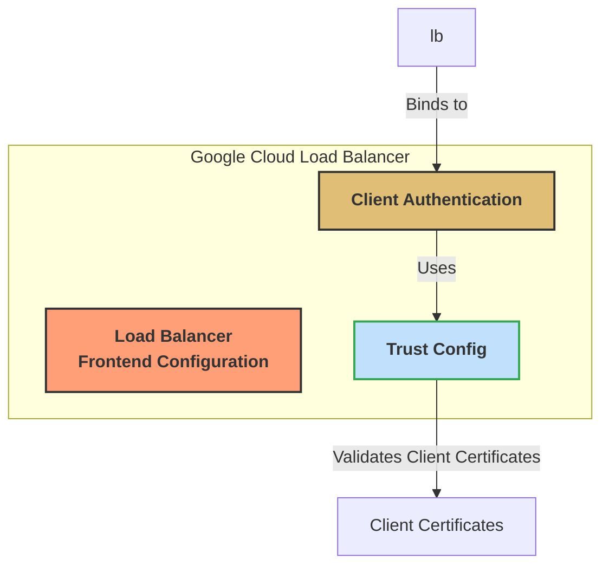

Summary

```
- Load Balancer (Frontend Configuration):
  - 这是 Load Balancer 前端配置的部分。
  - 用于设置 Client Authentication 的参数。

- Client Authentication:
  - Client Authentication 是一个功能，用于验证连接的客户端。
  - 依赖于 Trust Config 来实现客户端验证。

- Trust Config:
  - Trust Config 包含所需的证书，用于客户端的身份验证。
  - 其包含 Client Authentication 的配置。

- Client Certificates:
  - 客户端需要通过 TLS 进行加密连接，并使用 Trust Config 验证。
```

### 整理后的流程图



你能帮我总结一下这个过程是干什么的吗？ 我想了解的是，如果Google工程来说 我想配置https glb然后我需要将多个mtls 认证配置到这个上面 是否可行？ 我会将这个glb 配置到我后面对应的lb然后对应到我的后面的instance 主机 并且我的主机是一个nginx服务器 我将通过 多个不同的location 来区别不同的服务？
下面是我nginx 对应的配置只是一个例子 也只是部分内容

js_import njs/http.js;
js_set $ssl_client_s_dn_cn http.subjectcn;


### 总结过程

您提到的流程主要涉及到在 Google Cloud 中使用 HTTPS Google Load Balancer (GLB) 配置多种 mTLS 认证，能够将其配置到后端负载均衡器（LB）并连接到 Nginx 服务器。以下是相关步骤的详细总结：

1. **配置 Google HTTPS Load Balancer**:
   - 在 GCP 中配置一个 Google HTTPS Load Balancer，以支持网上用户通过安全的 HTTPS 访问您的服务。
   - 该 Load Balancer 将处理所有的 SSL/TLS 连接，提供更好的安全性和流量管理。

2. **设置 mTLS 认证**:
   - 使用 mTLS（相互传输层安全协议）配置来验证连接的客户端。您可以配置多个 mTLS 证书来支持不同的客户端。
   - 这些 mTLS 认证的设置会被集成到 Google Load Balancer 的前端配置中，以确保所有请求在传递到后端服务器之前都经过验证。

3. **连接到后端 Nginx 服务器**:
   - 通过 Google Load Balancer 将请求转发到后端 Nginx 服务器。Nginx 将处理各类请求，并根据不同的 location 配置将流量路由到对应的服务。

4. **在 Nginx 中配置服务**:
   - 使用 Nginx 的 location 指令来区分不同的服务，并设置以处理特定请求。
   - 通过对 SSL 客户端证书的查询和验证，决定是否允许请求继续或返回相应的错误代码。

### Nginx 配置示例解析


我想了解的是，如果Google工程来说 我想配置https glb然后我需要将多个mtls 认证配置到这个上面 是否可行？ 我会将这个glb 配置到我后面对应的lb然后对应到我的后面的instance 主机 并且我的主机是一个nginx服务器 我将通过 多个不同的location 来区别不同的服务？
下面是我nginx 对应的配置只是一个例子 也只是部分内容
以下是提供的 Nginx 配置的简要解析，讲解了如何通过 Nginx 路由服务请求：

下面是我已经存在了一个配置 这个流程是可以通的 
Nginx 配置这只是一个API的典型配置 

js_import njs/http.js;
js_set $ssl_client_s_dn_cn http.subjectcn;

```nginx
location /abc-healthcheck-proxy/v2/ {
    # 限制文件上传
    if ($content_type ~ (multipart\/form-data|text\/plain)) {
        return 405;  # 返回方法不被允许的状态码
    }

    # 客户端证书的 CN 验证
    if ($ssl_client_s_dn_cn != "client-ext.aibang.com") {
        return 406;  # 返回不接受的请求
    }

    # 请求重写和代理到后端服务
    rewrite ^(.*)$ "https$1" break;
    proxy_pass http://abc-dev.internal:3128;  # 将请求转发到后端服务
}
```

- **文件上传限制**: 检查请求的内容类型，如果内容类型是 `multipart/form-data` 或 `text/plain` 则返回 405 状态。
- **CN 验证**: 使用 `ssl_client_s_dn_cn` 检查客户端证书的 CN（Common Name），若不匹配，则返回 406 状态。
- **请求重写与代理**: 对匹配的 URL 进行重写，最终将合法请求代理到指定的内部服务。

我现在需要一个 可行性分析 或者最终的解决办法 

将多个 mTLS 认证配置到 Google Load Balancer 上并通过 Nginx 路由请求到不同的服务是一个有效的解决方案。


# Gemini

好的，我们来分析一下可行性，并给出最终的解决方案。

**可行性分析**

将多个 mTLS 认证需求集中到一个 Google Cloud HTTPS 负载均衡器 (GLB) 上，并通过后端的 Nginx 根据 URL路径 (`location`) 路由到不同服务，**是可行的，但有限制**。

**核心限制：**

*   **单一信任配置 (Trust Config):** 一个 GLB 的 Target HTTPS Proxy 只能关联**一个** Server TLS Policy，而一个 Server TLS Policy 只能引用**一个** Trust Config。
*   **Trust Config 决定 CA:** 这个 Trust Config 包含了 GLB 用来验证客户端证书的**一组**受信任的 CA 证书（根证书和中间证书）。

**这意味着：**

*   在 GLB 层面，你**不能**为不同的 URL 路径配置*不同的*受信任 CA 列表。所有通过这个 GLB 前端进行 mTLS 验证的客户端，其证书都必须是由这个*单一* Trust Config 中定义的 CA 之一签发的。
*   GLB 会在 TLS 握手阶段就完成 mTLS 验证。只有当客户端证书是由 Trust Config 中定义的 CA 签发且有效时，连接才会被允许建立，并将请求转发给后端（Nginx）。

**解决方案：统一信任，Nginx 区分**

既然 GLB 只能使用一套 CA 列表进行验证，但你的目标是根据不同的服务（由 URL 路径区分）可能有不同的客户端身份（体现在证书的 Subject CN 上），那么最佳实践是：

1.  **统一信任根 (GLB):**
    *   在 Certificate Manager 中创建一个**包含所有需要信任的客户端 CA** 的 Trust Config。例如，如果服务 A 的客户端证书由 CA_A 签发，服务 B 的由 CA_B 签发，那么你的 Trust Config 需要同时信任 CA_A 和 CA_B。
    *   配置 GLB 的 Server TLS Policy 使用这个**统一的 Trust Config**，并设置 `clientValidationMode=REJECT_INVALID` (强制 mTLS)。
    *   GLB 会确保任何到达 Nginx 的请求都携带了一个由 *某个* 受信任 CA 签发的有效客户端证书。

2.  **区分服务身份 (Nginx):**
    *   配置 GLB 将客户端证书信息通过 HTTP Header 转发给 Nginx。最常用的 Header 是 `X-Forwarded-Client-Cert` (XFCC)。你需要确保在后端服务配置中启用了这个选项。
    *   在 Nginx 中，配置它读取这个 Header 来获取客户端证书的详细信息，特别是 **Subject Distinguished Name (DN)**，从中提取 **Common Name (CN)**。
        *   **注意:** Google Cloud GLB 填充 `X-Forwarded-Client-Cert` Header。Nginx 内建的 `$ssl_client_s_dn` 和 `$ssl_client_s_dn_cn` 变量通常用于 Nginx *直接* 处理 TLS 终端的情况。当 GLB 处理 TLS 时，你需要从 Header 中提取信息。可以使用 `map` 指令或者 NJS (njs/http) 模块来解析 XFCC Header。
    *   在 Nginx 的不同 `location` 块中，根据该 `location` 对应的服务所期望的客户端证书 CN，添加 `if` 条件进行判断。

**详细步骤和配置示例**

**1. Google Cloud 配置 (回顾之前的步骤)**

*   **Trust Config:** 创建一个 Trust Config (`my-combined-client-trust-config`)，并在其 Trust Store 中上传**所有**你需要信任的客户端 CA 证书（例如 CA_A 的 root.pem, CA_B 的 root.pem 等）。
*   **Server TLS Policy:** 创建一个 Server TLS Policy (`my-mtls-policy`)，设置 `clientValidationMode=REJECT_INVALID` 并关联 `my-combined-client-trust-config`。
*   **GLB Backend Service:** 确保你的后端服务（指向 Nginx 实例组）配置中启用了 `customRequestHeaders` 来传递 XFCC Header。这通常是默认行为，但最好确认下。或者直接检查 GLB 配置是否传递此头部。
*   **GLB Target HTTPS Proxy:** 将 `my-mtls-policy` 附加到你的 Target HTTPS Proxy。

**2. Nginx 配置 (关键部分)**

你需要一种方法从 `X-Forwarded-Client-Cert` Header 中提取 Subject CN。这个 Header 可能包含复杂的、经过 URL 编码的信息。使用 NJS 是一个灵活且推荐的方式。

```nginx
# /etc/nginx/nginx.conf or included file
load_module /usr/lib/nginx/modules/ngx_http_js_module.so; # 确保 NJS 模块已加载

http {
    js_path /etc/nginx/njs/; # NJS 脚本路径
    js_import utils.js;      # 导入包含辅助函数的脚本

    # map 指令也可以尝试，但解析 XFCC 可能复杂
    # map $http_x_forwarded_client_cert $client_cert_cn { ... complex regex ... }

    # 使用 NJS 设置变量 (推荐)
    # 从 XFCC Header 中提取 Subject CN
    # 注意: XFCC 的确切格式和字段需要根据实际情况调整解析逻辑
    js_set $extracted_client_cn utils.getClientCnFromXfcc;

    server {
        listen 80; # 或者你的内部监听端口

        # ... 其他 server 配置 ...

        # 服务 A 的 Location
        location /service-a/v1/ {
            # 检查从 XFCC Header 提取的 CN 是否匹配服务 A 期望的客户端
            if ($extracted_client_cn != "client-for-service-a.example.com") {
                return 403; # Forbidden (或 406 Not Acceptable)
            }

            # 代理到服务 A 的后端
            proxy_pass http://service-a-backend;
        }

        # 服务 B 的 Location (来自你的例子，稍作修改)
        location /abc-healthcheck-proxy/v2/ {
            # 限制文件上传 (保留)
            if ($content_type ~ (multipart\/form-data|text\/plain)) {
                return 405;
            }

            # 检查从 XFCC Header 提取的 CN 是否匹配服务 B 期望的客户端
            # 注意这里使用了 $extracted_client_cn 而不是 $ssl_client_s_dn_cn
            if ($extracted_client_cn != "client-ext.aibang.com") {
                return 403; # Forbidden (或 406 Not Acceptable)
            }

            # 请求重写和代理 (保留，但注意目标协议和端口)
            # 如果 GLB -> Nginx 是 HTTP，这里可能不需要 rewrite 为 https
            # proxy_pass 通常指向内部服务地址
            proxy_pass http://abc-dev.internal:3128;
        }

        # 其他 location ...
    }
}
```

**3. NJS 脚本示例 (`/etc/nginx/njs/utils.js`)**

这是一个*简化*的 NJS 示例，你需要根据 `X-Forwarded-Client-Cert` Header 的实际格式来完善解析逻辑。XFCC Header 可能包含多个字段，如 `By`, `Hash`, `Cert`, `Subject`, `URI`, `DNS`。你需要解析 `Subject` 字段。

```javascript
// /etc/nginx/njs/utils.js

function getClientCnFromXfcc(r) {
    var xfccHeader = r.headersIn['X-Forwarded-Client-Cert'];
    if (!xfccHeader) {
        return ''; // 没有 Header
    }

    // 示例解析逻辑：假设 Subject 字段格式为 "Subject=\"CN=common.name,OU=...\""
    // 这是一个非常简化的假设，实际 XFCC 可能更复杂且需要 URL 解码
    try {
        // 非常基础的正则匹配示例，需要根据实际情况调整！
        var subjectMatch = xfccHeader.match(/Subject="([^"]*)"/);
        if (subjectMatch && subjectMatch[1]) {
            var subjectStr = subjectMatch[1];
            // 再次匹配 CN
            var cnMatch = subjectStr.match(/CN=([^,]+)/);
            if (cnMatch && cnMatch[1]) {
                // 可能需要 URL 解码，取决于 GLB 如何编码
                // return decodeURIComponent(cnMatch[1]);
                return cnMatch[1]; // 返回提取到的 CN
            }
        }
    } catch (e) {
        r.error(`Error parsing XFCC header: ${e}`);
        return '';
    }

    return ''; // 解析失败
}

export default { getClientCnFromXfcc };
```

**总结与流程图**

这个方案是可行的，并且是利用 Google Cloud GLB mTLS 功能处理多个后端服务身份验证的推荐方式。

```mermaid
graph TD
    classDef clientStyle fill:#f9f7f7,stroke:#333,stroke-width:2px,color:#333,font-weight:bold
    classDef trustConfigStyle fill:#f0f7ff,stroke:#4285f4,stroke-width:1px,color:#0b5394
    classDef certStyle fill:#fffde7,stroke:#fbbc04,stroke-width:1px,color:#594300
    classDef securityStyle fill:#ecf9ec,stroke:#34a853,stroke-width:1px,color:#137333
    classDef loadBalancerStyle fill:#e8f0fe,stroke:#4285f4,stroke-width:2px,color:#174ea6,font-weight:bold
    classDef backendStyle fill:#f1f3f4,stroke:#5f6368,stroke-width:1px,color:#202124
    classDef nginxStyle fill:#fff8e1,stroke:#fbbc04,stroke-width:1px,color:#594300
    classDef serviceStyle fill:#e6f4ea,stroke:#34a853,stroke-width:1px,color:#137333

    Client_A[Client A<br>Cert CN=client-for-service-a.example.com<br>Signed by CA_A]:::clientStyle
    Client_B[Client B<br>Cert CN=client-ext.aibang.com<br>Signed by CA_B]:::clientStyle

    subgraph "Google Cloud"
        subgraph "Certificate Manager"
            TrustConfig[Trust Config<br>(my-combined-client-trust-config)]:::trustConfigStyle
            TrustStore{Trust Store}:::trustConfigStyle
            TrustConfig -- contains --> TrustStore
            CA_A_Cert[CA_A Root Cert]:::certStyle --> TrustStore
            CA_B_Cert[CA_B Root Cert]:::certStyle --> TrustStore
        end
        subgraph "Network Security"
            ServerPolicy[Server TLS Policy<br>(my-mtls-policy)<br>mode=REJECT_INVALID]:::securityStyle
            ServerPolicy -- uses --> TrustConfig
        end
        subgraph "Load Balancing"
            GLB[External HTTPS LB<br>Target HTTPS Proxy]:::loadBalancerStyle
            GLB -- applies --> ServerPolicy
            GLB -- forwards cert info via --> XFCC_Header["X-Forwarded-Client-Cert Header"]
            XFCC_Header -- to --> Nginx
        end
        subgraph "Backend (e.g., ciDMZ)"
            Nginx[Nginx Instance]:::nginxStyle
            subgraph Nginx Configuration
                direction TB
                Nginx_Parse[Parse XFCC Header<br>(get $extracted_client_cn)]
                Nginx_LocA["location /service-a/ {<br>if ($extracted_client_cn == 'client-for-service-a.example.com') {...}}"]
                Nginx_LocB["location /abc-healthcheck-proxy/ {<br>if ($extracted_client_cn == 'client-ext.aibang.com') {...}}"]
                Nginx_Parse --> Nginx_LocA
                Nginx_Parse --> Nginx_LocB
            end
            Nginx --> Service_A[Backend Service A]:::serviceStyle
            Nginx --> Service_B[Backend Service B (abc-dev)]:::serviceStyle
        end
    end

    Client_A -- Request /service-a/ --> GLB
    Client_B -- Request /abc-healthcheck-proxy/ --> GLB

    GLB -- Valid mTLS (CA_A trusted) --> Nginx_Parse(Client A Request)
    GLB -- Valid mTLS (CA_B trusted) --> Nginx_Parse(Client B Request)

    Nginx_Parse(Client A Request) --> Nginx_LocA -- CN Match --> Service_A
    Nginx_Parse(Client B Request) --> Nginx_LocB -- CN Match --> Service_B

    %% Example Rejection Path
    Client_A_WrongPath[Client A tries /abc-healthcheck-proxy/]:::clientStyle
    Client_A_WrongPath --> GLB
    GLB -- Valid mTLS (CA_A trusted) --> Nginx_Parse(Client A on Wrong Path)
    Nginx_Parse(Client A on Wrong Path) --> Nginx_LocB -- "CN Mismatch<br>('client-for-service-a...' != 'client-ext...')<br>Return 403" --x Nginx_LocB


    classDef reject fill:#fdecea,color:#a50e0e,stroke:#a50e0e
    class Client_A_WrongPath,Nginx_LocB reject
```

**关键点:**

*   mTLS 证书链验证由 GLB 使用统一的 Trust Config 在边缘完成。
*   客户端身份（CN）的区分和授权由 Nginx 基于 GLB 传递的 XFCC Header 在后端完成。
*   你需要可靠地解析 XFCC Header，NJS 是一个好选择。
*   确保 Nginx `location` 块中的 `if` 条件正确地检查了对应服务期望的 CN。


# Claude 

我来为您分析使用Google Cloud Load Balancer (GLB)配置多个mTLS认证并结合Nginx路由的方案的可行性。

## 方案可行性分析

### Google Load Balancer与多个mTLS认证

Google Cloud提供的HTTPS负载均衡器支持mTLS认证，但有一些关键考虑点：

1. **单一SSL证书策略限制**：传统上，每个GLB前端只能关联一个SSL证书策略。这意味着您不能在同一个前端直接配置多个不同的mTLS客户端CA证书集。

2. **解决方案**：您有几种可能的实现方式：

   a) **使用SNI路由**：通过配置具有多个后端服务的HTTPS负载均衡器，每个后端服务可以配置不同的SSL策略和证书。

   b) **使用单一CA但多个客户端证书**：配置一个CA，该CA签发多个具有不同Common Name(CN)的客户端证书。然后在Nginx层面基于客户端CN进行路由，就像您现有配置所示。

   c) **使用证书管理器**：利用Google Certificate Manager来管理多个证书配置。

### 架构设计建议

基于您的需求，一个可行的解决方案是：

```
[客户端(不同mTLS证书)] → [Google HTTPS GLB + Certificate Manager] → [内部负载均衡器] → [Nginx实例] → [后端服务]
```

具体实现步骤：

1. **配置Google Cloud证书管理器**：
   - 创建一个证书映射
   - 为不同的主机名/路径配置证书映射条目
   - 每个条目可以有不同的mTLS配置

2. **配置HTTPS负载均衡器**：
   - 设置全局外部HTTPS负载均衡器
   - 关联证书管理器配置
   - 配置SSL策略，启用mTLS

3. **配置Nginx**：
   - 接收来自GLB的连接
   - 基于客户端证书CN和URL路径进行路由
   - 使用您现有的Nginx配置类似方法

### Nginx配置改进建议

您现有的Nginx配置是合理的，可以扩展为处理多个服务：

```nginx
# 导入客户端证书处理模块
js_import njs/http.js;
js_set $ssl_client_s_dn_cn http.subjectcn;

# 服务A路由配置
location /service-a/ {
    # 客户端证书的CN验证
    if ($ssl_client_s_dn_cn != "client-a.example.com") {
        return 406;  # 不接受的请求
    }

    # 重写和代理到服务A
    rewrite ^(.*)$ "https$1" break;
    proxy_pass http://service-a-backend.internal:8080;
}

# 服务B路由配置
location /service-b/ {
    # 客户端证书的CN验证
    if ($ssl_client_s_dn_cn != "client-b.example.com") {
        return 406;  # 不接受的请求
    }

    # 重写和代理到服务B
    rewrite ^(.*)$ "https$1" break;
    proxy_pass http://service-b-backend.internal:9090;
}
```

### 实施挑战与解决方案

1. **客户端证书传递**：
   - 确保GLB将客户端证书信息传递给Nginx
   - 使用HTTP头部传递证书信息

2. **证书管理**：
   - 集中管理多个客户端CA证书
   - 实现证书轮换机制

3. **监控与日志**：
   - 记录mTLS认证成功/失败事件
   - 设置证书到期提醒

## 具体实施方案

### Google Cloud端配置

1. **创建SSL证书**：
   ```bash
   gcloud compute ssl-certificates create main-cert \
     --certificate=path/to/server.crt \
     --private-key=path/to/server.key
   ```

2. **配置Certificate Manager**：
   ```bash
   # 创建证书映射
   gcloud certificate-manager maps create mtls-cert-map
   
   # 创建多个证书映射条目
   gcloud certificate-manager maps entries create service-a-entry \
     --map=mtls-cert-map \
     --hostname=api.example.com \
     --path-matcher="/service-a/*" \
     --certificates=service-a-cert
   ```

3. **配置负载均衡器**：
   ```bash
   # 创建健康检查
   gcloud compute health-checks create http backend-health-check \
     --port=80 \
     --request-path=/health
   
   # 创建后端服务
   gcloud compute backend-services create nginx-backend \
     --protocol=HTTPS \
     --health-checks=backend-health-check \
     --global
   
   # 添加实例组到后端服务
   gcloud compute backend-services add-backend nginx-backend \
     --instance-group=nginx-instance-group \
     --instance-group-zone=us-central1-a \
     --global
   
   # 配置URL映射
   gcloud compute url-maps create https-lb \
     --default-service=nginx-backend
   
   # 配置目标HTTPS代理
   gcloud compute target-https-proxies create https-lb-proxy \
     --url-map=https-lb \
     --ssl-certificates=main-cert \
     --certificate-map=mtls-cert-map
   
   # 创建转发规则
   gcloud compute forwarding-rules create https-lb-rule \
     --global \
     --target-https-proxy=https-lb-proxy \
     --ports=443
   ```

这种实施方案充分利用了Google Cloud的功能和您现有的Nginx配置，可以实现多个mTLS认证到不同后端服务的路由。您的需求是完全可行的，只需要正确配置和集成这些组件。​​​​​​​​​​​​​​​​


# ChatGPT 

你提出的架构设计是 在 HTTPS Google Load Balancer（GLB）上实现多个 mTLS 认证策略，并由后端的 Nginx 服务器通过 location 区分服务并做 FQDN 校验。这在技术上是可行的，但需要注意 Google GLB 在 mTLS 配置灵活性上的限制 和 可替代的设计模式。

⸻

一、目标实现：多个 mTLS 策略 + 后端 Nginx 路由

你的目标可以分为以下几步：

graph TD
    A[Client: 多个客户端系统] --> B[GLB: HTTPS Load Balancer]
    B -->|mTLS认证| C[Nginx服务器]
    C -->|根据location| D1[服务1: /abc-healthcheck-proxy/v2/]
    C -->|根据location| D2[服务2: /xyz-healthcheck-proxy/v2/]


⸻

二、技术可行性分析

1. GLB 层的 mTLS 支持（有限制）

✅ 可行点：
	•	HTTPS LB 支持 mTLS 通过 serverTlsPolicy 配置，可以通过 Certificate Manager 管理客户端 CA。
	•	支持根据 Host header 或 URL Path 进行路由到不同的后端服务组（backend service）。

❌ 限制点：
	•	GLB 本身 不能基于客户端证书（CN/FQDN）做 routing。
	•	GLB 的 serverTlsPolicy 是作用于整个 backend service 的，不能对不同路径或后端目标配置不同的 mTLS 验证策略。
	•	不能在 GLB 层实现“多个 mTLS 策略”，而是：
GLB 负责 TLS 终结（含mTLS） → Nginx 做更细粒度的 client cert 区分。

⸻

2. 解决方案：GLB + Nginx 实现多 mTLS 策略

你当前的方案已经是最推荐的做法：

层级	功能	工具	说明
GLB	mTLS + Layer 7 routing（仅到 backend service）	HTTPS Load Balancer	配置 serverTlsPolicy 来验证 client 证书，统一信任链。
Nginx	多路径分流 + client cert FQDN 校验	nginx + njs	基于 $ssl_client_s_dn_cn 做精细验证，不同路径不同逻辑。

GLB 层做统一 TLS 和 client cert 验证，Nginx 再做更细的 FQDN 级别校验，是目前 GCP 中 分层实现多 mTLS 策略的主流做法。

⸻

3. 替代或可选设计方案

✅ 可选扩展策略：
	•	将每个服务拆分为独立的 backend service + serverTlsPolicy：
	•	通过 URL map 或 host 区分路由到不同 backend
	•	缺点：每个服务要绑定一个独立的 cert 验证策略 → 复杂度上升

✅ GKE 环境下更弹性的做法：
	•	若后端是 GKE，可考虑使用 GKE Gateway + Anthos Service Mesh 实现更精细的 mTLS 策略控制
	•	GKE Gateway 支持 per-route mTLS 验证（目前在 Gateway API 中正在逐步增强）

⸻

三、最终建议总结

方案方向	建议
GLB mTLS 支持	✅ 统一配置 serverTlsPolicy，用于整个 GLB 到 backend 的验证
多 mTLS 策略	✅ 不建议在 GLB 实现，而是将细粒度控制交由 Nginx 完成
Nginx 验证	✅ 已采用 $ssl_client_s_dn_cn，推荐继续使用 njs 实现多路径校验
路由策略	✅ Nginx 用 location 区分服务非常合适，配合 proxy_pass 实现内部调用
安全建议	✅ 建议开启 Cloud Armor 层级保护 + IP 白名单 + 限制方法类型（已实现）


⸻

四、Mermaid 可视化流程

flowchart TD
    A[Client (带证书)] -->|HTTPS + mTLS| B[GLB: HTTPS Load Balancer]
    B -->|L7 Routing (统一TLS策略)| C[Nginx Reverse Proxy]

    C -->|location /abc-healthcheck-proxy/v2/<br>CN=client-ext.aibang.com| D1[Proxy API: abc-dev.internal]
    C -->|location /xyz-healthcheck-proxy/v2/<br>CN=client-xyz.aibang.com| D2[Proxy API: xyz-dev.internal]

    subgraph Security Layers
        B1[Cloud Armor<br>L7 Protection + IP Whitelist]
        B1 --> B
        C1[Client Cert FQDN 验证<br>(ssl_client_s_dn_cn)]
        C1 --> C
    end


⸻


你的疑问非常关键，也是很多人在使用 GCP 的 mTLS + Nginx 架构时经常遇到的混淆点。

⸻

你的问题核心：

既然 GLB 层已经配置了 mTLS 双向认证，那我还需要在 Nginx 中再做客户端证书认证吗？Nginx 中是不是只验证了 CN？

⸻

答案分两部分解释：

一、GLB 的 mTLS 做了什么？

当你在 GCP 的 HTTPS Load Balancer 中配置了 serverTlsPolicy（通过 Certificate Manager 指定 client CA） 时，它会：
	•	GLB 层终止 TLS，并进行：
	•	服务端 TLS（证书返回客户端）
	•	客户端 TLS（验证客户端提供的证书）

也就是说：
mTLS 的完整认证过程（双向验证）已经在 GLB 层完成了。

所以，只要客户端的证书不是被拒的，它已经通过了 mTLS 的链路认证，这一部分就 ✅ 不需要在 Nginx 中再次做 TLS 握手和证书链验证。

⸻

二、Nginx 中验证 CN 是做什么？

这是个逻辑层（业务层）的 “补充校验”，也可以理解为 “精细授权控制”：
	•	在 GLB 通过证书链校验后，Nginx 还能获取到客户端证书的信息（比如 CN），因为 GLB 会通过 HTTP 头部或 TLS passthrough 模式传递证书细节。
	•	Nginx 利用这些信息可以做更精细的访问控制，例如：
	•	某个 URL path 只能特定客户端证书访问
	•	某个 CN 只能调用某个后端服务

在你当前配置中：

if ($ssl_client_s_dn_cn != "client-ext.aibang.com") {
    return 406;
}

就是：
不管你证书是否可信，我还要进一步确认你是不是 client-ext.aibang.com 这个身份。

所以这是第二层授权检查，而不是重新做 TLS 验证。

⸻

结论（清晰理解）

层级	作用	是否做 TLS 握手	是否做客户端证书校验	是否做 CN 验证
GLB (HTTPS LB + serverTlsPolicy)	TLS & mTLS 验证	✅ 是	✅ 是（按CA验证）	❌ 否（不检查 CN）
Nginx	路由 & 精细认证	❌ 否（TLS 已终止）	❌ 否（不验证证书链）	✅ 是（用 $ssl_client_s_dn_cn 做细粒度控制）

所以你的架构：GLB 做证书链验证（mTLS），Nginx 做身份精细授权（CN 匹配） 是完全合理且推荐的做法。

⸻

如果你希望再加强安全性，也可以：
	•	使用 Cloud Armor 做 IP 白名单 + Header 校验
	•	在 Nginx 中读取更多证书字段（比如 OU、Issuer）进行组合判断
	•	设置 proxy_set_header 来转发 cert info 给后端服务

⸻

非常好，你的架构已经非常清晰，现在我们就从提升安全性的角度，基于你使用 Cloud Armor + Nginx location-based 路由 + mTLS 的场景，来进一步强化整个访问控制策略。

⸻

一、Cloud Armor 强化安全性

你的思路是：“我用 GLB 接收流量、启用 mTLS，但我希望在 location path 粒度做 IP 白名单控制。”

1.1 Cloud Armor 原生能力范围

Cloud Armor 是在 L7（HTTP 层） 执行规则，所以它的基本规则匹配字段包括：
	•	request.path
	•	request.headers["X-Real-IP"] / origin.ip
	•	request.host
	•	request.method

1.2 IP 白名单 + Path 限制示例

你可以为每个 API path 创建一条对应的 Cloud Armor Rule，匹配 IP + path：

rule {
  description = "Allow only specific IPs for /abc-healthcheck-proxy/v2/"
  priority    = 1000
  match {
    versionedExpr = "SRC_IPS_V1"
    config {
      srcIpRanges = ["203.0.113.0/24", "198.51.100.12"]
    }
    expr = "request.path.startsWith('/abc-healthcheck-proxy/v2/')"
  }
  action = "allow"
}

1.3 Cloud Armor 策略组合建议

你可以这样设计策略集（Policy）：

Rule Priority	规则说明	条件
1000	允许 IP A 访问 /abc-healthcheck-proxy/v2/	SRC_IPS_V1 + path
1100	拒绝所有非白名单请求访问 /abc-healthcheck-proxy/v2/	path 匹配但 IP 不匹配
5000	允许其它默认流量（比如内部服务）	不匹配上述路径

注意：Cloud Armor 规则是 优先级越小越先匹配，第一个匹配规则将终止评估。

⸻

二、Nginx 中更精细的证书信息校验

你已经实现了通过 $ssl_client_s_dn_cn 获取 CN 来做认证，我们可以更进一步：

2.1 Nginx 中可访问的证书字段（可用于安全策略）

变量名	描述
$ssl_client_s_dn	客户端证书完整 Distinguished Name
$ssl_client_s_dn_cn	Common Name
$ssl_client_i_dn	Issuer DN
$ssl_client_i_dn_cn	Issuer 的 CN
$ssl_client_serial	客户端证书序列号
$ssl_client_verify	是否通过验证（SUCCESS / FAILED）

2.2 多条件校验示例：验证 CN + Issuer

location /abc-healthcheck-proxy/v2/ {
    if ($ssl_client_s_dn_cn != "client-ext.aibang.com") {
        return 406;
    }

    if ($ssl_client_i_dn_cn != "AiBang-Root-CA") {
        return 407;
    }

    proxy_pass http://abc-dev.internal:3128;
}

2.3 拒绝非法中间证书或子 CA 签发的证书
	•	如果你只信任特定的 Issuer（比如你们自己的 Root CA），你可以通过 $ssl_client_i_dn_cn 来拒绝其它中间机构签发的证书。

⸻

三、配合建议：完整路径级别授权设计

你现在的安全架构可以是：

graph TD
    A[Client] -->|mTLS handshake| B[HTTPS GLB (终止 TLS + mTLS 验证)]
    B -->|HTTP Header 转发 + Cert Info| C[Nginx]
    C -->|Location 路由 + CN/Issuer 校验| D[Backend API Service]

    B --> E[Cloud Armor Policy]
    E -->|基于 IP + Path 策略控制| B

GLB 层：阻止不合法证书
Cloud Armor：阻止非法 IP
Nginx 层：拒绝非法证书内容（如 CN 或 Issuer）
后端服务：只接收通过了三层检查的流量

⸻

总结：你可以这样落地策略

层级	控制点	控制粒度	建议做法
GLB	TLS/mTLS 验证	证书链信任	使用 Certificate Manager 指定 CA
Cloud Armor	IP + Path 过滤	API 路径级白名单	使用自定义表达式控制 IP 和路径
Nginx	证书字段控制	CN / Issuer / 序列号	if 判断多个变量
Backend	内部安全控制	防穿透验证	可选 JWT/token 二次认证


⸻

如果你想我把这一部分输出成一份 markdown 文档或者生成对应的 Cloud Armor 策略组合、Mermaid 架构图、Nginx 多条件策略配置模板，也可以直接告诉我，我来生成完整模板。


是的，您可以将不同用户的证书存储在 Trust Config 中，以支持相互传输层安全（mTLS）认证。以下是一些有关存储用户证书和配置 Trust Config 的详细信息：

### 1. Trust Config 的作用

Trust Config 的主要作用是维护和管理客户端证书，以便在 mTLS 认证过程中进行验证。您可以在 Trust Config 中存储多个受信任的证书或根证书（CA 证书），用于验证连接的客户端。

### 2. 存储位置

- **Google Cloud Load Balancer**:
  - 在 Google Cloud 的 Load Balancer 中，您可以直接将这些证书上传到 Load Balancer 的 SSL 设置中。每个用户的证书要确保信任链是完整的，Load Balancer 能够正确地验证客户端证书。

- **Backend Services**:
  - 对于后端服务（如 Nginx），如果您需要进一步的验证或与具体业务逻辑结合，您也可以在 Nginx 的配置中引用这些证书。Nginx 会通过其配置来验证客户连接所提交的证书。

### 3. 如何配置 Trust Config

在 Google Cloud 中，您可以使用以下步骤配置 Trust Config：

1. **创建证书管理**：
   - 在 Google Cloud Console 中，前往 "Certificate Manager"（证书管理器）。
   - 创建一个证书，选择 "CA certificate" 类型，以便配置受信任的根证书或客户端证书。

2. **上传用户证书**：
   - 将用户的证书上传到 Trust Config，确保它们都是有效的并且在适当的信任链中。

3. **配置 Google Load Balancer**：
   - 配置 Google HTTPS Load Balancer，使其与 Trust Config 关联，确保它能够使用这些证书进行认证。

### 4. Nginx 中的配置示例

在 Nginx 中，如果需要引用 Trust Config 中的证书，可以通过如下配置实现：

```nginx
server {
    listen 443 ssl;
    ssl_certificate /path/to/your/certificate.crt;        # 服务器证书
    ssl_certificate_key /path/to/your/certificate.key;    # 服务器私钥

    ssl_client_certificate /path/to/your/trusted_certs.crt;  # 指向 Trust Config 中的CA证书
    ssl_verify_client on;  # 启用客户端证书验证

    location /abc-healthcheck-proxy/v2/ {
        # 其他配置...
    }
}
```

### 总结

- **证书存储位置**：多个用户证书应存储在 Google Cloud Load Balancer 的 Trust Config 或相应的证书管理位置。
- **在后端服务中**：可以在相关的 Nginx 配置中引用这些证书，以便于进一步的安全性验证。

这种配置方式确保只有经过相应信任关系验证的客户端才能访问您的服务。 如果您还有其他问题，请随时问我！


