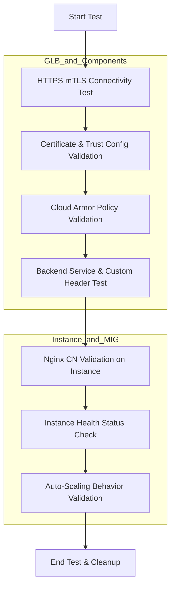

- [Test Case Design for Migrating GCP TCP MTLS to HTTPS MTLS GLB](#test-case-design-for-migrating-gcp-tcp-mtls-to-https-mtls-glb)
  - [Background Overview](#background-overview)
  - [Test Case Design](#test-case-design)
    - [Test Case 1: Certificate Management Verification](#test-case-1-certificate-management-verification)
      - [Objective](#objective)
      - [Steps](#steps)
      - [Expected Results](#expected-results)
    - [Test Case 2: HTTPS and mTLS Configuration Verification](#test-case-2-https-and-mtls-configuration-verification)
      - [Objective](#objective-1)
      - [Steps](#steps-1)
      - [Expected Results](#expected-results-1)
    - [Test Case 3: Cloud Armor Verification](#test-case-3-cloud-armor-verification)
      - [Objective](#objective-2)
      - [Steps](#steps-2)
      - [Expected Results](#expected-results-2)
    - [Test Case 4: Backend Service Verification](#test-case-4-backend-service-verification)
      - [Objective](#objective-3)
      - [Steps](#steps-3)
      - [Expected Results](#expected-results-3)
    - [Test Case 5: Nginx Configuration Verification](#test-case-5-nginx-configuration-verification)
      - [Objective](#objective-4)
      - [Steps](#steps-4)
      - [Expected Results](#expected-results-4)
    - [Test Case 6: Client Certificate Subject Name Verification](#test-case-6-client-certificate-subject-name-verification)
      - [Objective](#objective-5)
      - [Steps](#steps-5)
      - [Expected Results](#expected-results-5)
    - [Test Case 7: Custom Header Verification](#test-case-7-custom-header-verification)
      - [Objective](#objective-6)
      - [Steps](#steps-6)
      - [Expected Results](#expected-results-6)
    - [Test Case 8: MIG (Managed Instance Group) Behavior and Autoscaling](#test-case-8-mig-managed-instance-group-behavior-and-autoscaling)
      - [Objective](#objective-7)
      - [Steps](#steps-7)
      - [Expected Results:](#expected-results-7)
    - [Test Case 9: Performance Verification](#test-case-9-performance-verification)
      - [Objective](#objective-8)
      - [Steps](#steps-8)
      - [Expected Results](#expected-results-8)
    - [Test Case 10: Error Handling Verification](#test-case-10-error-handling-verification)
      - [Objective](#objective-9)
      - [Steps](#steps-9)
      - [Expected Results](#expected-results-9)
    - [Test Case 10: End-to-End Integration Test](#test-case-10-end-to-end-integration-test)
      - [Objective](#objective-10)
      - [Steps](#steps-10)
      - [Expected Results](#expected-results-10)
  - [Test Execution Recommendations](#test-execution-recommendations)
    - [Test Environment Setup](#test-environment-setup)
    - [Test Execution Order](#test-execution-order)
    - [Test Results Recording](#test-results-recording)
  - [Conclusion](#conclusion)
- [Grok](#grok)
- [Test Case for GCP HTTPS mTLS Migration with GLB and Instance Validation](#test-case-for-gcp-https-mtls-migration-with-glb-and-instance-validation)
  - [Test Case Overview](#test-case-overview)
  - [Test Case Details](#test-case-details)
    - [1. HTTPS mTLS Connectivity Test with GLB](#1-https-mtls-connectivity-test-with-glb)
    - [2. Certificate and Trust Config Validation](#2-certificate-and-trust-config-validation)
    - [3. Cloud Armor Security Policy Validation](#3-cloud-armor-security-policy-validation)
    - [4. Backend Service and Custom Header Validation](#4-backend-service-and-custom-header-validation)
    - [5. Nginx Configuration and CN Validation on Instance](#5-nginx-configuration-and-cn-validation-on-instance)
    - [6. Instance Health Status Validation](#6-instance-health-status-validation)
    - [7. Auto-Scaling Behavior Validation](#7-auto-scaling-behavior-validation)
  - [Test Environment Cleanup](#test-environment-cleanup)
  - [Mermaid Flowchart for Test Process](#mermaid-flowchart-for-test-process)
  - [Notes](#notes)
- [Gemini](#gemini)
  - [Chinese](#chinese)
- [one](#one)
- [Two](#two)
- [GCP TCP MTLS 迁移到 HTTPS MTLS GLB 的测试用例设计](#gcp-tcp-mtls-迁移到-https-mtls-glb-的测试用例设计)
  - [背景概述](#背景概述)
  - [测试用例设计](#测试用例设计)
    - [测试用例 1: 证书管理验证](#测试用例-1-证书管理验证)
    - [测试用例 2: HTTPS 和 mTLS 配置验证](#测试用例-2-https-和-mtls-配置验证)
    - [测试用例 3: Cloud Armor 验证](#测试用例-3-cloud-armor-验证)
    - [测试用例 4: Backend Service 验证](#测试用例-4-backend-service-验证)
    - [测试用例 5: Nginx 配置验证](#测试用例-5-nginx-配置验证)
    - [测试用例 6: 客户端证书主题名称验证](#测试用例-6-客户端证书主题名称验证)
    - [测试用例 7: 自定义 Header 验证](#测试用例-7-自定义-header-验证)
    - [测试用例 8: 性能验证](#测试用例-8-性能验证)
    - [测试用例 9: 异常处理验证](#测试用例-9-异常处理验证)
    - [测试用例 10: 端到端集成测试](#测试用例-10-端到端集成测试)
  - [测试执行建议](#测试执行建议)
  - [总结](#总结)

# Test Case Design for Migrating GCP TCP MTLS to HTTPS MTLS GLB

## Background Overview

Migrating from GCP's TCP MTLS to HTTPS MTLS GLB involves several key component changes, including:

- Google Cloud Certificate Manager
- Trust Config
- Cloud Armor
- SSL Certificates
- Backend Service
- Custom Headers
- Nginx Configuration and instance group (MIG)

The migration process involves several steps, including:
1. Verify the correctness of the new HTTPS MTLS configuration
2. Verify the correctness of the new Cloud Armor configuration
3. Verify the correctness of the new Backend Service configuration
4. Verify the correctness of the new Nginx configuration
5. Verify the correctness of the new MIG configuration

To ensure the proper functionality of the system post-migration, we need to design comprehensive test cases to verify each aspect of the system.

## Test Case Design

### Test Case 1: Certificate Management Verification

#### Objective

Ensure that the certificates in Google Cloud Certificate Manager are properly configured and that TrustConfig is correctly set up.

#### Steps

1. Verify if the server certificate is correctly uploaded to Certificate Manager
2. Verify if the client root and intermediate certificates are correctly uploaded to the Trust Store
3. Check if TrustConfig correctly associates all necessary certificates
4. Confirm the validity period of the certificates

#### Expected Results

- All certificates are correctly uploaded
- TrustConfig is properly configured with required certificates
- All certificates have valid expiration dates

### Test Case 2: HTTPS and mTLS Configuration Verification

#### Objective

Verify that HTTPS and mTLS configurations are functioning correctly.

#### Steps

1. Send a request to the GLB address using a valid client certificate through cURL or Postman
2. Send a request using an invalid client certificate
3. Send a request without a client certificate
4. Verify if the Server TLS Policy is properly configured with the clientValidationMode

#### Expected Results

- Requests with valid client certificates should succeed with a 200 response
- Requests with invalid client certificates should be rejected
- Requests without client certificates should be rejected (if clientValidationMode=REJECT_INVALID)

### Test Case 3: Cloud Armor Verification

#### Objective

Ensure that Cloud Armor security rules are effective.

#### Steps

1. Send requests from a whitelisted IP
2. Send requests from a non-whitelisted IP
3. Send simulated attack traffic (e.g., SQL injection, XSS)
4. Verify that Cloud Armor logs the events correctly

#### Expected Results

- Requests from whitelisted IPs should pass
- Requests from non-whitelisted IPs should be rejected
- Attack traffic should be intercepted effectively
- Security events should be logged correctly

### Test Case 4: Backend Service Verification

#### Objective

Verify that the backend service can handle requests forwarded to it by the Backend Service.

#### Steps

1. Send requests to GLB and confirm that they are forwarded to the Backend Service via HTTPS
2. Check if Nginx correctly forwards requests and headers
3. Ensure that the backend service processes these requests and responds correctly

#### Expected Results

- Requests should be successfully forwarded to the Backend Service via HTTPS
- Custom headers should be correctly forwarded
- The backend service should process requests as expected

### Test Case 5: Nginx Configuration Verification

#### Objective

Ensure that Nginx is properly configured to handle requests through HTTPS MTLS.

#### Steps

1. Verify if Nginx can correctly read the client certificate information forwarded by GLB (via HTTP headers)
2. Test if Nginx can handle HTTPS requests correctly
3. Verify if Nginx can route requests based on the client certificate's CN or subject name

#### Expected Results

- Nginx should be able to read headers like X-SSL-Client-Cert
- Nginx should route requests based on certificate information
- Request paths should be correct and as expected

### Test Case 6: Client Certificate Subject Name Verification

#### Objective

Verify that the system correctly processes the subject name of the client certificate.

#### Steps

1. Send requests with client certificates having different CNs
2. Verify if GLB forwards certificate information via HTTP headers (e.g., X-SSL-Client-Cert-Subject) to the backend
3. Check if the backend can correctly route or reject requests based on the certificate subject name

#### Expected Results

- Certificate subject information should be forwarded correctly to the backend
- The backend should process requests based on certificate subject information
- Requests with subject names not meeting expectations should be rejected

### Test Case 7: Custom Header Verification

#### Objective

Verify that custom headers are successfully passed and handled by the backend.

#### Steps

1. Add custom headers to the request
2. Verify if the headers are correctly forwarded when transmitted through the HTTPS MTLS channel
3. Ensure that the backend processes the header and checks its value

#### Expected Results

- Custom headers should be passed successfully, and their values should be correct

### Test Case 8: MIG (Managed Instance Group) Behavior and Autoscaling

#### Objective

Ensure that MIG instances built by Terraform operate normally, with high availability and scalability capabilities.

#### Steps

1.	Build MIG through Terraform Apply, and confirm that the number of instances created, image version, and startup scripts meet expectations.
2.	Verify whether MIG instances pass Health Check (GCE health check or custom TCP/HTTPS).
3.	Trigger automatic scaling scenarios (such as CPU > 90% or increased connections), verify whether new instances can be automatically created.
4.	Manually stop one instance, verify whether it can automatically recover and maintain the expected number of instances.
5.	Check whether there is configuration loading or service failure information in Nginx logs and system logs.

#### Expected Results:

1. MIG instances come online normally, health checks pass.
2. Automatic scaling logic takes effect.
3. Each new instance contains the correct Nginx configuration and certificates.
4. Failed instances can be automatically replaced without affecting overall service availability.

### Test Case 9: Performance Verification

#### Objective

Ensure that the HTTPS MTLS configuration does not introduce significant performance bottlenecks.

#### Steps

1. Perform stress tests on the new HTTPS MTLS configuration, simulating high concurrent traffic
2. Monitor response times, connection setup times, and success request rates
3. Compare the performance with the old TCP MTLS configuration and check for any significant drops

#### Expected Results

- The system should handle high-concurrency scenarios without timeouts or failures
- The performance should be close to expectations, with no noticeable decline

### Test Case 10: Error Handling Verification

#### Objective

Ensure that the system can correctly handle configuration errors or exceptional conditions.

#### Steps

1. Simulate conditions such as expired certificates, invalid certificates, or misconfigurations
2. Verify if the system responds correctly and provides appropriate error messages
3. Test if error messages are properly logged

#### Expected Results

- Invalid or expired certificates should return appropriate error codes
- Error messages should be clear and easy to troubleshoot

### Test Case 10: End-to-End Integration Test

#### Objective

Verify that the entire system's end-to-end workflow operates correctly.

#### Steps

1. Simulate a real client making a full business request
2. Track the request's journey from the client to GLB and then to the backend service
3. Verify that logs and monitoring are functioning correctly for each stage

#### Expected Results

- The full business process should execute successfully
- All components should collaborate without errors

## Test Execution Recommendations

### Test Environment Setup

- Set up a test environment similar to the production setup
- Prepare multiple client certificates (valid, invalid, expired, etc.)
- Set up test scripts and tools (e.g., cURL, Postman, JMeter)

### Test Execution Order

- Start with the foundational component tests (Certificates, TrustConfig)
- Then execute functionality tests (HTTPS, mTLS, Cloud Armor)
- Finally, perform performance testing and end-to-end testing

### Test Results Recording

- Keep detailed records of each test case execution
- Analyze and fix any failed test cases
- Retest after fixes

## Conclusion

By executing the above test/following cases, we can comprehensively verify the migration from TCP MTLS to HTTPS MTLS GLB and ensure that the system operates correctly. The tests should cover certificate management, HTTPS and mTLS configuration, Cloud Armor, Backend Service, Nginx configuration, client certificate validation, custom headers, performance, and error handling. Only when all test cases pass should we consider the migration successful.

# Grok

# Test Case for GCP HTTPS mTLS Migration with GLB and Instance Validation

Below is a comprehensive test case designed to validate the migration from TCP mTLS to HTTPS mTLS using Google Cloud Platform (GCP) Global Load Balancer (GLB), incorporating components like Google Cloud Certificate Manager, Trust Config, Cloud Armor, SSL Certificates, Backend Services with custom headers, and Nginx configuration on an Instance within a Managed Instance Group (MIG). The test case also includes validation of instance health, CN (Common Name) validation, and auto-scaling settings.

This test case is structured to ensure all components work together seamlessly post-migration.

---

## Test Case Overview

**Objective:** Validate the end-to-end functionality of the HTTPS mTLS setup with GLB, ensure proper certificate handling, backend communication, instance health, and auto-scaling behavior.

**Scope:**
- Validate HTTPS mTLS configuration with GLB.
- Verify Google Cloud Certificate Manager and Trust Config setup.
- Confirm Cloud Armor and SSL Certificate integration.
- Test Backend Service with custom headers.
- Validate Nginx configuration on MIG instances for mTLS and CN checks.
- Verify instance health status and auto-scaling behavior.

**Pre-requisites:**
- GCP project with necessary permissions.
- HTTPS mTLS GLB setup completed (including Certificate Manager, Trust Config, Cloud Armor, SSL Certificates, and Backend Services).
- MIG created via Terraform with Nginx configuration for CN validation.
- Monitoring and logging enabled for debugging.
- Test client or tool (e.g., `curl`, browser, or custom script) with mTLS certificates for testing.

---

## Test Case Details

### 1. HTTPS mTLS Connectivity Test with GLB
**Objective:** Ensure that the GLB is correctly configured for HTTPS mTLS and can establish a secure connection with clients.

- **Test Steps:**
  1. Use a test client with valid mTLS certificates to connect to the GLB's public IP or DNS.
  2. Verify the handshake completes successfully using HTTPS.
  3. Check if the connection fails when using an invalid or expired client certificate.

- **Expected Result:**
  - Successful HTTPS mTLS connection with valid certificates (HTTP 200 or appropriate response).
  - Connection rejection with invalid certificates (HTTP 403 or similar error).
  - Logs in GLB or Cloud Armor should show successful and failed connection attempts.

- **Tools:** `curl` with mTLS certificates, browser with client certificate installed.

---

### 2. Certificate and Trust Config Validation
**Objective:** Verify that the Google Cloud Certificate Manager and Trust Config are correctly set up and used by GLB.

- **Test Steps:**
  1. Check the GLB configuration in GCP Console or via `gcloud` CLI to confirm the correct SSL certificate is attached.
  2. Validate that the Trust Config for mTLS is applied to the GLB.
  3. Simulate a connection with a client certificate signed by an untrusted CA and verify rejection.

- **Expected Result:**
  - GLB uses the correct server certificate (visible in connection details or via `openssl s_client`).
  - Trust Config enforces client certificate validation.
  - Connections with untrusted client certificates are rejected.

- **Tools:** `gcloud` CLI, `openssl s_client`, GCP Console.

---

### 3. Cloud Armor Security Policy Validation
**Objective:** Ensure Cloud Armor policies are applied to protect the GLB and filter unwanted traffic.

- **Test Steps:**
  1. Send a legitimate HTTPS mTLS request to GLB and confirm access.
  2. Simulate malicious traffic (e.g., SQL injection patterns or known bad IPs if rules are configured) and verify blocking.
  3. Check Cloud Armor logs for allowed and denied requests.

- **Expected Result:**
  - Legitimate traffic is allowed.
  - Malicious traffic is blocked based on defined rules.
  - Cloud Armor logs reflect policy enforcement.

- **Tools:** Custom scripts, `curl`, GCP Logging.

---

### 4. Backend Service and Custom Header Validation
**Objective:** Confirm that the Backend Service is correctly configured and custom headers are passed to the backend instances.

- **Test Steps:**
  1. Send an HTTPS request to GLB and capture the response from the backend.
  2. Check backend instance logs (or response headers if configured) to verify custom headers are received.
  3. Validate that Backend Service health checks pass for all instances.

- **Expected Result:**
  - Custom headers (e.g., `X-Custom-Header`) are present in backend requests.
  - Backend Service shows healthy status for all instances in GCP Console.

- **Tools:** `curl`, backend instance logs, GCP Console.

---

### 5. Nginx Configuration and CN Validation on Instance
**Objective:** Ensure Nginx on MIG instances is correctly configured for mTLS and performs CN validation.

- **Test Steps:**
  1. SSH into an instance in the MIG or use a test endpoint to simulate a client request.
  2. Send a request with a client certificate containing the expected CN and verify acceptance.
  3. Send a request with a certificate having an incorrect CN and verify rejection.
  4. Check Nginx access and error logs for validation details.

- **Expected Result:**
  - Requests with correct CN are processed (HTTP 200 or appropriate response).
  - Requests with incorrect CN are rejected (HTTP 403 or similar).
  - Nginx logs show CN validation results.

- **Tools:** SSH, `curl` with certificates, Nginx logs.

---

### 6. Instance Health Status Validation
**Objective:** Verify that the MIG instances are healthy and properly integrated with the Backend Service.

- **Test Steps:**
  1. Check the health status of instances in the MIG via GCP Console or `gcloud` CLI.
  2. Simulate a failure by stopping Nginx or making an instance unhealthy (e.g., block health check endpoint).
  3. Verify that GLB stops routing traffic to the unhealthy instance.
  4. Restart Nginx or restore health and confirm traffic resumes.

- **Expected Result:**
  - Healthy instances receive traffic.
  - Unhealthy instances are marked as such and excluded from traffic routing.
  - Recovery of health restores traffic routing.

- **Tools:** GCP Console, `gcloud` CLI, custom scripts to simulate failure.

---

### 7. Auto-Scaling Behavior Validation
**Objective:** Confirm that the MIG auto-scaling settings work as expected under load or failure conditions.

- **Test Steps:**
  1. Review the auto-scaling configuration in Terraform or GCP Console (e.g., CPU utilization threshold, min/max instances).
  2. Simulate high load on the MIG instances using a load testing tool to trigger scaling out.
  3. Simulate low load or instance failure to trigger scaling in.
  4. Monitor the number of instances and health status during scaling events.

- **Expected Result:**
  - MIG scales out when CPU utilization exceeds the defined threshold.
  - MIG scales in when load decreases or instances fail (if configured).
  - New instances are healthy and integrated into the Backend Service.

- **Tools:** Load testing tools (e.g., `ab`, `locust`), GCP Monitoring, `gcloud` CLI.

---

## Test Environment Cleanup
- After testing, ensure any temporary changes (e.g., failed instance simulations) are reverted.
- Review logs for any anomalies during testing.
- Document test results for future reference.

---

## Mermaid Flowchart for Test Process

This flowchart illustrates the sequence of test steps and groups them into GLB-related validations and Instance/MIG-related validations.

---

## Notes
- Ensure logging is enabled for all components (GLB, Cloud Armor, Nginx) to debug issues during testing.
- Use automation scripts (e.g., Bash or Python) to simulate load or failures for consistent test results.
- If any test fails, isolate the component (e.g., GLB, Nginx, MIG) and rerun the specific test after troubleshooting.

This test case ensures a thorough validation of the migrated HTTPS mTLS setup and associated configurations. Let me know if you need deeper details on any specific test or additional scenarios!

# Gemini 

Okay, let's design a comprehensive test plan to validate your migration from GCP TCP Proxy mTLS to HTTPS GLB mTLS, including the instance-level Nginx configuration and autoscaling aspects managed by Terraform.

---

**Test Plan: GCP HTTPS GLB mTLS Migration Validation**

**1. Objective:**
To verify the successful migration from the legacy TCP Proxy mTLS setup to the new Global HTTPS Load Balancer (GLB) mTLS architecture. This includes validating the functionality of the GLB, Certificate Manager (Server Certs & Trust Config), Cloud Armor integration, Backend Service configuration (including custom headers), Nginx configuration on backend instances (specifically CN validation), Managed Instance Group (MIG) health, and autoscaling behavior. The infrastructure (especially the MIG) is provisioned via Terraform.

**2. Scope:**

*   **In Scope:**
    *   GLB endpoint reachability and responsiveness (HTTPS).
    *   Server certificate presentation by the GLB (via Certificate Manager).
    *   mTLS handshake validation at the GLB level (using Trust Config).
    *   Client certificate validation:
        *   Valid certificate from trusted CA.
        *   Invalid/expired certificate.
        *   Certificate from untrusted CA.
        *   Connection attempt without a client certificate.
    *   Backend Service configuration (protocol, health checks).
    *   Custom header injection/forwarding by the GLB (e.g., `X-Forwarded-Client-Cert`).
    *   Nginx configuration on backend instances (via MIG/Instance Template).
    *   **Instance-level CN (Common Name) validation performed by Nginx.**
    *   MIG health checks and instance status reporting.
    *   MIG autoscaling functionality (scale-up and scale-down based on policy).
    *   Basic Cloud Armor policy validation (if applicable, e.g., IP whitelisting/blacklisting alongside mTLS).
    *   Logging and monitoring verification (GLB logs, Nginx logs, Cloud Monitoring metrics).
*   **Out of Scope:**
    *   Performance benchmarking beyond validating autoscaling triggers.
    *   Underlying GCP network infrastructure testing (VPC, Firewall rules beyond basic connectivity).
    *   Terraform code linting, syntax checking, or plan validation (this plan focuses on the *result* of the Terraform deployment).
    *   Detailed application-level functional testing beyond validating connectivity and CN-based authorization.
    *   Certificate lifecycle management testing (rotation, renewal) unless explicitly part of the immediate deployment.

**3. Prerequisites:**

*   The new HTTPS GLB, Certificate Manager resources (Server Cert, Trust Config), Backend Service, MIG (with Nginx configured instances), and any relevant Cloud Armor policies have been deployed (presumably via Terraform).
*   Access to the GCP console and relevant permissions (Compute Engine, Load Balancing, Certificate Manager, Cloud Armor, Logging, Monitoring).
*   Access to backend instance VMs (e.g., via SSH) for log inspection and configuration verification.
*   Test client environment with tools like `curl`, `openssl`.
*   Valid client certificate(s) signed by a CA present in the Trust Config.
    *   At least one certificate with a CN expected/allowed by the Nginx configuration.
    *   At least one certificate with a CN *not* expected/allowed by the Nginx configuration.
*   An invalid or expired client certificate (signed by a trusted CA, if possible).
*   A client certificate signed by a CA *not* present in the Trust Config.
*   Load generation tool (e.g., `wrk`, `ab`, `JMeter`, `hey`) for autoscaling tests.
*   IP addresses for testing Cloud Armor rules (if applicable).

**4. Test Environment:**

*   GCP Project where the new infrastructure is deployed.
*   Client machine(s) external to GCP or within a different VPC/network segment for realistic testing.

**5. Test Cases:**

| Test Case ID | Category                  | Test Description                                                                                                                               | Test Steps                                                                                                                                                                                                                                                                                                                         | Expected Result                                                                                                                                                                                          | Actual Result | Status (Pass/Fail) |
| :----------- | :------------------------ | :------------------------------------------------------------------------------------------------------------------------------------------- | :--------------------------------------------------------------------------------------------------------------------------------------------------------------------------------------------------------------------------------------------------------------------------------------------------------------------------------- | :------------------------------------------------------------------------------------------------------------------------------------------------------------------------------------------------------- | :------------ | :----------------- |
| **GLB-001**  | Connectivity              | Verify GLB HTTPS endpoint reachability (without client cert).                                                                                | 1. `curl -v https://[GLB_IP_OR_DNS]`                                                                                                                                                                                                                                                                                             | TLS handshake fails, likely with a "certificate required" error or similar (e.g., HTTP 400 Bad Request if GLB handles it that way). Connection should not timeout. Server certificate details should be visible. |               |                    |
| **GLB-002**  | Connectivity              | Verify GLB HTTP endpoint behavior (if configured).                                                                                           | 1. `curl -v http://[GLB_IP_OR_DNS]`                                                                                                                                                                                                                                                                                              | If redirection to HTTPS is configured: 3xx redirect. If HTTP is disabled: Connection refused or error.                                                                                                    |               |                    |
| **GLB-003**  | Server Certificate        | Verify the correct server certificate is presented by the GLB.                                                                               | 1. `openssl s_client -connect [GLB_IP_OR_DNS]:443 -showcerts`   2. Inspect the presented server certificate details (Subject, Issuer, Validity).                                                                                                                                                                           | The presented server certificate matches the one configured in Google Cloud Certificate Manager and associated with the GLB Target Proxy.                                                               |               |                    |
| **MTLS-001** | mTLS Handshake (Valid)    | Test connection with a valid client certificate from a trusted CA.                                                                           | 1. `curl -v --cert /path/to/valid_client.crt --key /path/to/valid_client.key https://[GLB_IP_OR_DNS]/`   *(Assume this cert's CN is allowed by Nginx for now)*                                                                                                                                                           | Successful TLS handshake. Connection established. HTTP 2xx or other success code returned (depends on backend/Nginx).                                                                                    |               |                    |
| **MTLS-002** | mTLS Handshake (Untrusted)| Test connection with a client certificate from an untrusted CA.                                                                               | 1. `curl -v --cert /path/to/untrusted_client.crt --key /path/to/untrusted_client.key https://[GLB_IP_OR_DNS]/`                                                                                                                                                                                                              | TLS handshake fails. Connection rejected by the GLB. `curl` likely reports a TLS handshake error. Check GLB logs for rejection details.                                                                  |               |                    |
| **MTLS-003** | mTLS Handshake (No Cert)  | Test connection without providing a client certificate (same as GLB-001, confirming behavior).                                                 | 1. `curl -v https://[GLB_IP_OR_DNS]/`                                                                                                                                                                                                                                                                                             | TLS handshake fails or results in an HTTP error code (e.g., 400) indicating a required certificate was not provided. Connection rejected by the GLB.                                                         |               |                    |
| **MTLS-004** | mTLS Handshake (Invalid)  | Test connection with an invalid/expired client certificate (if available).                                                                   | 1. `curl -v --cert /path/to/invalid_client.crt --key /path/to/invalid_client.key https://[GLB_IP_OR_DNS]/`                                                                                                                                                                                                             | TLS handshake fails. Connection rejected by the GLB. Behavior might depend on specific invalidity (expired vs. revoked if CRL/OCSP used).                                                                  |               |                    |
| **HDR-001**  | Custom Headers            | Verify custom headers (e.g., client cert details) are forwarded to the backend.                                                              | 1. Ensure Nginx access logs are configured to log the required header (e.g., `$ssl_client_escaped_cert` or custom headers like `X-Forwarded-Client-Cert` set by LB).   2. Make a successful mTLS request (like MTLS-001).   3. SSH into a backend instance.   4. Check Nginx access logs (`/var/log/nginx/access.log`). | The relevant header(s) (e.g., containing client certificate details) should be present in the Nginx access log entry for the request.                                                                        |               |                    |
| **NGX-001**  | Instance Config           | Verify Nginx configuration file content on a backend instance.                                                                               | 1. SSH into a backend instance created by the MIG.   2. Inspect `/etc/nginx/nginx.conf` and included files (e.g., in `sites-enabled` or `conf.d`).                                                                                                                                                                        | Configuration matches the expected settings deployed via Terraform/startup script (correct listen ports, server names, location blocks, header processing logic, CN validation logic).                  |               |                    |
| **NGX-002**  | Instance CN Validation (Pass) | Test request with a valid client cert (trusted CA) AND a CN that IS ALLOWED by Nginx config.                                            | 1. `curl -v --cert /path/to/valid_cert_allowed_cn.crt --key /path/to/valid_cert_allowed_cn.key https://[GLB_IP_OR_DNS]/[TARGET_PATH]`                                                                                                                                                                             | Successful mTLS handshake. Request reaches Nginx. Nginx processes the request successfully based on the allowed CN. Expected application response (e.g., HTTP 200 OK).                                     |               |                    |
| **NGX-003**  | Instance CN Validation (Fail) | Test request with a valid client cert (trusted CA) BUT a CN that IS NOT ALLOWED by Nginx config.                                        | 1. `curl -v --cert /path/to/valid_cert_disallowed_cn.crt --key /path/to/valid_cert_disallowed_cn.key https://[GLB_IP_OR_DNS]/[TARGET_PATH]`                                                                                                                                                                          | Successful mTLS handshake. Request reaches Nginx. Nginx rejects the request due to the disallowed CN. Expected error response (e.g., HTTP 403 Forbidden). Check Nginx error logs for details.              |               |                    |
| **MIG-001**  | Instance Health           | Verify initial instances in the MIG are healthy.                                                                                             | 1. Go to GCP Console -> Compute Engine -> Instance Groups -> Select the MIG.   2. Check the status of all instances.   3. Check Backend Service health status in Load Balancing section.                                                                                                                            | All instances in the MIG should be listed as `RUNNING`. The Backend Service health check status for instances should be `HEALTHY`. The number of instances should match the `minReplicas` setting.       |               |                    |
| **MIG-002**  | Health Check Failure      | Simulate an instance failure and verify LB/MIG reaction.                                                                                    | 1. SSH into one instance in the MIG.   2. Stop the Nginx service (`sudo systemctl stop nginx`) or block health check port via firewall.   3. Monitor the Backend Service health status for that instance.   4. Monitor traffic distribution (if possible).   5. Monitor MIG actions.                             | The instance should become `UNHEALTHY` in the Backend Service view. The GLB should stop sending traffic to the unhealthy instance. The MIG should eventually detect the failure and initiate repair/replacement. |               |                    |
| **MIG-003**  | Autoscaling (Scale Up)    | Verify MIG scales up under load.                                                                                                              | 1. Note the current number of instances (`minReplicas`).   2. Start load test tool targeting the GLB endpoint using a valid client cert (`curl` options might be needed in the tool): `[LOAD_TOOL] -c [connections] -d [duration] -H "Authorization: Bearer ..." https://[GLB_IP_OR_DNS]/` (adjust tool syntax). Ensure load exceeds the scale-up threshold (e.g., CPU utilization).   3. Monitor MIG size and instance status in GCP Console.   4. Monitor CPU utilization metrics in Cloud Monitoring. | The number of instances in the MIG should increase according to the autoscaling policy. New instances should become `RUNNING` and `HEALTHY` and start serving traffic.                                     |               |                    |
| **MIG-004**  | Autoscaling (Scale Down)  | Verify MIG scales down when load decreases.                                                                                                  | 1. Stop the load generation tool used in MIG-003.   2. Wait for the cool-down period specified in the autoscaling policy.   3. Monitor MIG size in GCP Console.                                                                                                                                                 | The number of instances in the MIG should decrease back towards `minReplicas` after the cool-down period.                                                                                                   |               |                    |
| **CA-001**   | Cloud Armor (Block)       | If IP blocking rules exist, test access from a blocked IP.                                                                                  | 1. Attempt a connection (e.g., `curl`) from an IP address that should be blocked by Cloud Armor policy. Use a valid client cert.                                                                                                                                                                                           | Connection should be rejected, likely with an HTTP 403 Forbidden or other error configured in the Cloud Armor policy. Check Cloud Armor logs.                                                             |               |                    |
| **CA-002**   | Cloud Armor (Allow)       | If IP allowing rules exist, test access from an allowed IP.                                                                                 | 1. Attempt a connection (e.g., `curl`) from an IP address that should be allowed by Cloud Armor policy. Use a valid client cert.                                                                                                                                                                                           | Connection attempt should pass the Cloud Armor check and proceed to the mTLS validation stage (tested in MTLS-* / NGX-* cases).                                                                             |               |                    |
| **LOG-001**  | Logging                   | Verify GLB and Nginx logs capture relevant information.                                                                                     | 1. Perform various test requests (valid mTLS, invalid mTLS, CN allowed, CN denied).   2. Check Cloud Logging for HTTP Load Balancer logs.   3. SSH into backend instances and check Nginx access and error logs (`/var/log/nginx/*`).                                                                               | GLB logs should show request details, status codes, latency, and potentially mTLS info. Nginx logs should show received requests, custom headers, status codes, and any errors related to CN validation.   |               |                    |
| **MON-001**  | Monitoring                | Verify key metrics are available in Cloud Monitoring.                                                                                       | 1. Go to Cloud Monitoring -> Metrics Explorer.   2. Check for metrics related to:      - HTTPS Load Balancer (Request Count, Latency, Backend Request Count, Response Codes)      - Instance Group (CPU Utilization, Instance Count)      - VM Instance (CPU, Network)                                            | Relevant metrics should be populated and reflect the activity during testing (e.g., increased request counts, CPU spikes during load test, instance count changes during autoscaling).                   |               |                    |

**6. Success Criteria:**

*   All test cases categorized as critical (e.g., GLB-001, MTLS-001, NGX-002, NGX-003, MIG-001) must pass.
*   At least 95% of all test cases must pass.
*   No blocking issues preventing legitimate clients (valid cert, allowed CN) from accessing the service.
*   Unauthorized access attempts (no cert, untrusted cert, disallowed CN) are correctly blocked at the appropriate layer (GLB or Nginx).
*   Autoscaling behaves as configured based on load.
*   Instances remain healthy under normal load, and the MIG recovers from simulated failures.
*   Logging and Monitoring provide adequate visibility into the system's operation.

**7. Reporting:**

*   Record the "Actual Result" and "Status" for each test case in the table above.
*   Document any failures with detailed steps to reproduce, error messages, relevant log snippets, and screenshots.
*   Summarize the overall test results and adherence to Success Criteria.
*   List any identified defects or areas requiring further investigation.

---

This test plan provides a structured approach to validate your new HTTPS mTLS setup. Remember to adapt specific paths, commands, IP addresses, DNS names, and expected CNs to your actual environment. Good luck with your testing!

## Chinese

GCP TCP MTLS 迁移到 HTTPS MTLS GLB 的测试用例设计

背景概述

从 GCP 的 TCP MTLS 迁移到 HTTPS MTLS GLB 涉及多个关键组件的变更，包括：
• Google Cloud Certificate Manager
• Trust Config
• Cloud Armor
• SSL 证书
• Backend Service
• 自定义 Header
• Nginx 配置

为确保迁移后的系统正常工作，我们需要设计全面的测试用例来验证各个环节。

测试用例设计

测试用例 1: 证书管理验证

目标: 确保 Google Cloud Certificate Manager 中的证书已正确配置，并且 TrustConfig 已正确设置。

步骤: 1. 验证服务器证书是否正确上传到 Certificate Manager 2. 验证客户端证书的根证书和中间证书是否正确上传到 Trust Store 3. 检查 TrustConfig 是否正确关联了所有必要的证书 4. 确认证书的有效期是否正常

预期结果:
• 所有证书已正确上传
• TrustConfig 正确配置了所需的证书
• 所有证书的有效期正常

测试用例 2: HTTPS 和 mTLS 配置验证

目标: 验证 HTTPS 和 mTLS 配置是否正确工作。

步骤: 1. 使用有效的客户端证书通过 cURL 或 Postman 向 GLB 地址发送 HTTPS 请求 2. 使用无效的客户端证书发送请求 3. 不提供客户端证书发送请求 4. 验证 Server TLS Policy 是否正确配置了 clientValidationMode

预期结果:
• 使用有效客户端证书的请求成功，返回 200
• 使用无效客户端证书的请求被拒绝
• 不提供客户端证书的请求被拒绝（如果 clientValidationMode=REJECT_INVALID）

测试用例 3: Cloud Armor 验证

目标: 确保 Cloud Armor 的安全规则已生效。

步骤: 1. 从白名单 IP 发送请求 2. 从非白名单 IP 发送请求 3. 发送模拟攻击流量（如 SQL 注入、XSS 等） 4. 验证 Cloud Armor 日志记录是否正确

预期结果:
• 白名单 IP 的请求通过
• 非白名单 IP 的请求被拒绝
• 攻击流量被有效拦截
• 安全事件被正确记录

测试用例 4: Backend Service 验证

目标: 验证后端服务是否能够处理传递到 Backend Service 的请求。

步骤: 1. 向 GLB 发起请求，确认请求能通过 HTTPS 到达 Backend Service 2. 检查 Nginx 是否正确传递请求和 headers 3. 确保后端服务能够处理这些请求，并正确响应

预期结果:
• 请求通过 HTTPS 成功转发到 Backend Service
• 自定义 headers 正确传递
• 后端服务按预期处理请求

测试用例 5: Nginx 配置验证

目标: 确保 Nginx 配置正确，能处理通过 HTTPS MTLS 的请求。

步骤: 1. 验证 Nginx 是否能正确读取 GLB 传递的客户端证书信息（通过 HTTP 头） 2. 测试 Nginx 是否能正确处理 HTTPS 请求 3. 验证 Nginx 是否能根据客户端证书的 CN 或主题名称进行路由

预期结果:
• Nginx 能正确读取 X-SSL-Client-Cert 等头信息
• Nginx 能根据证书信息正确路由请求
• 请求路径与预期一致

测试用例 6: 客户端证书主题名称验证

目标: 验证系统能否正确处理客户端证书的主题名称验证。

步骤: 1. 使用不同 CN 的客户端证书发送请求 2. 验证 GLB 是否将证书信息通过 HTTP 头（如 X-SSL-Client-Cert-Subject）传递给后端 3. 检查后端是否能根据证书主题名称正确路由或拒绝请求

预期结果:
• 证书主题信息被正确传递到后端
• 后端能根据证书主题信息正确处理请求
• 不符合预期的证书主题名称的请求被拒绝

测试用例 7: 自定义 Header 验证

目标: 验证自定义 header 是否能够成功传递，并能被后端处理。

步骤: 1. 在请求中添加自定义 header 2. 验证通过 HTTPS MTLS 通道传递时，header 是否被正确传递 3. 后端服务接收到 header 后，确认其值是否正确

预期结果:
• 自定义 header 被成功传递，并且其值无误

测试用例 8: 性能验证

目标: 确保 HTTPS MTLS 配置不会引入明显的性能瓶颈。

步骤: 1. 对新的 HTTPS MTLS 配置进行压力测试，模拟高并发流量 2. 监控响应时间、连接建立时间以及成功请求的比率 3. 与旧的 TCP MTLS 配置做对比，检查性能是否有显著下降

预期结果:
• 在高并发情况下，系统仍能稳定响应，不出现超时或失败
• 性能与预期接近，无明显下降

测试用例 9: 异常处理验证

目标: 确保系统能正确处理配置错误或异常情况。

步骤: 1. 模拟证书过期、无效证书、错误配置等情况 2. 验证系统是否能正确响应并给出合适的错误信息 3. 测试错误信息是否被恰当记录

预期结果:
• 对于无效证书、过期证书等问题，系统能返回适当的错误码
• 错误信息清晰可见，易于排查

测试用例 10: 端到端集成测试

目标: 验证整个系统的端到端流程是否正常工作。

步骤: 1. 模拟真实客户端发起完整的业务请求 2. 跟踪请求从客户端到 GLB，再到后端服务的完整路径 3. 验证每个环节的日志和监控是否正常

预期结果:
• 完整的业务流程能够正常执行
• 所有组件协同工作，无错误

测试执行建议 1. 测试环境准备:
• 创建与生产环境相似的测试环境
• 准备多种客户端证书（有效、无效、过期等）
• 准备测试脚本和工具（如 cURL、Postman、JMeter 等） 2. 测试执行顺序:
• 先执行基础组件测试（证书、TrustConfig）
• 再执行功能测试（HTTPS、mTLS、Cloud Armor）
• 最后执行性能测试和端到端测试 3. 测试结果记录:
• 详细记录每个测试用例的执行结果
• 对失败的测试用例进行分析和修复
• 重新测试修复后的问题

总结

通过执行以上测试用例，可以全面验证从 TCP MTLS 迁移到 HTTPS MTLS GLB 的各个环节，确保系统能够正常工作。测试应该覆盖证书管理、HTTPS 和 mTLS 配置、Cloud Armor、Backend Service、Nginx 配置、客户端证书验证、自定义 Header、性能和异常处理等方面。只有当所有测试用例都通过后，才能确认迁移是成功的。

# one

从 GCP 的 TCP MTLS 迁移到 HTTPS MTLS 的过程中，涉及的技术和组件非常多，测试时需要确保每个环节都正确配置并按预期工作。以下是一个建议的 Test Case 设计，覆盖所有可能的改动和考虑点。

1. 前提条件
   • 确保所有相关的 GCP 资源（例如 SSL 证书、TrustConfig、Cloud Armor、Backend Service 等）已经正确配置，并已成功关联。
   • 确保 Nginx 代理和各个服务（如 Kong 和应用服务）均已更新为 HTTPS MTLS。

2. Test Case 设计

测试目标：验证整个 HTTPS MTLS 流程的正确性

⸻

Test Case 1: 证书管理验证

目标: 确保 Google Cloud Certificate Manager 中的证书已经正确上传，并且 TrustConfig 已配置好。
• 步骤: 1. 在 GCP Console 中，验证上传的证书是否包含预期的公共密钥和私钥。 2. 检查 TrustConfig 是否正确包含所有必要的证书指纹。 3. 确保每个证书的有效期没有问题。
• 预期结果:
• 所有证书已经正确上传。
• TrustConfig 正确配置了所需的证书指纹。
• 所有证书的有效期正常。

⸻

Test Case 2: HTTPS 和 mTLS 配置验证

目标: 验证 HTTPS 和 mTLS 配置是否正确工作。
• 步骤: 1. 通过 cURL 或 Postman 向 GLB 地址发送 HTTPS 请求。 2. 确认请求能成功建立 TLS 连接，并验证是否启用了客户端证书的验证。 3. 测试客户端证书验证是否按预期工作，使用无效证书时应拒绝连接。
• 预期结果:
• 客户端证书验证正常，成功请求时返回 200，证书无效时拒绝连接。

⸻

Test Case 3: Cloud Armor 验证

目标: 确保 Cloud Armor 的安全规则已生效。
• 步骤: 1. 配置 Cloud Armor 安全规则，并通过不同的请求来源进行测试（比如模拟正常流量和攻击流量）。 2. 验证恶意请求是否被 Cloud Armor 拦截。 3. 确保合法请求未被错误拦截。
• 预期结果:
• 攻击流量被有效拦截（如 SQL 注入、XSS 等）。
• 正常流量通过，无误报。

⸻

Test Case 4: Backend Service 验证

目标: 验证后端服务是否能够处理传递到 Backend Service 的请求，并且是否符合预期的流量模式。
• 步骤: 1. 向 GLB 发起请求，确认请求能通过 HTTPS 到达 Backend Service。 2. 使用 Nginx 作为反向代理，检查 Nginx 是否正确传递请求和 headers（特别是自定义 header）。 3. 确保后端服务能够处理这些请求，并正确响应。
• 预期结果:
• 请求通过 HTTPS 成功转发到 Backend Service。
• 自定义 headers 正确传递。
• 后端服务按预期处理请求。

⸻

Test Case 5: Nginx 配置验证

目标: 确保 Nginx 配置正确，能处理通过 HTTPS MTLS 的请求。
• 步骤: 1. 在 Nginx 中配置 SSL/TLS 证书，验证证书链是否正确。 2. 测试 Nginx 是否能正确处理 HTTPS 请求，并返回正确的响应。 3. 验证 Nginx 是否将正确的 header 信息传递到下游服务。
• 预期结果:
• Nginx 正常响应 HTTPS 请求，并正确传递 header。
• 请求路径与预期一致，Nginx 配置不漏掉任何中间件/反向代理的处理。

⸻

Test Case 6: 性能验证

目标: 确保 HTTPS MTLS 配置不会引入明显的性能瓶颈。
• 步骤: 1. 对新的 HTTPS MTLS 配置进行压力测试，模拟高并发流量。 2. 监控响应时间、连接建立时间以及成功请求的比率。 3. 与旧的 TCP MTLS 配置做对比，检查性能是否有显著下降。
• 预期结果:
• 在高并发情况下，系统仍能稳定响应，不出现超时或失败。
• 性能与预期接近，无明显下降。

⸻

Test Case 7: 自定义 Header 验证

目标: 验证自定义 header 是否能够成功传递，并能被后端处理。
• 步骤: 1. 在请求中添加自定义 header。 2. 验证通过 HTTPS MTLS 通道传递时，header 是否被正确传递。 3. 后端服务接收到 header 后，确认其值是否正确。
• 预期结果:
• 自定义 header 被成功传递，并且其值无误。

⸻

Test Case 8: 异常处理验证

目标: 确保系统能正确处理配置错误或异常情况。
• 步骤: 1. 模拟证书过期、无效证书、错误配置等情况。 2. 验证系统是否能正确响应并给出合适的错误信息（如 403, 500）。 3. 测试错误信息是否被恰当记录（例如，通过日志查看错误详情）。
• 预期结果:
• 对于无效证书、过期证书等问题，系统能返回 403 错误，并且日志记录详细。
• 错误信息清晰可见，易于排查。

⸻

3. 总结

这些测试用例可以帮助你覆盖迁移后的各个方面，确保 HTTPS MTLS 流程、Cloud Armor、Backend Service 和 Nginx 配置都能正常工作。如果这些测试都能顺利通过，你应该可以确认迁移后的流程是成功且稳定的。

# Two

# GCP TCP MTLS 迁移到 HTTPS MTLS GLB 的测试用例设计

## 背景概述

从 GCP 的 TCP MTLS 迁移到 HTTPS MTLS GLB 涉及多个关键组件的变更，包括：

- Google Cloud Certificate Manager
- Trust Config
- Cloud Armor
- SSL 证书
- Backend Service
- 自定义 Header
- Nginx 配置

为确保迁移后的系统正常工作，我们需要设计全面的测试用例来验证各个环节。

## 测试用例设计

### 测试用例 1: 证书管理验证

**目标**: 确保 Google Cloud Certificate Manager 中的证书已正确配置，并且 TrustConfig 已正确设置。

**步骤**:

1. 验证服务器证书是否正确上传到 Certificate Manager
2. 验证客户端证书的根证书和中间证书是否正确上传到 Trust Store
3. 检查 TrustConfig 是否正确关联了所有必要的证书
4. 确认证书的有效期是否正常

**预期结果**:

- 所有证书已正确上传
- TrustConfig 正确配置了所需的证书
- 所有证书的有效期正常

### 测试用例 2: HTTPS 和 mTLS 配置验证

**目标**: 验证 HTTPS 和 mTLS 配置是否正确工作。

**步骤**:

1. 使用有效的客户端证书通过 cURL 或 Postman 向 GLB 地址发送 HTTPS 请求
2. 使用无效的客户端证书发送请求
3. 不提供客户端证书发送请求
4. 验证 Server TLS Policy 是否正确配置了 clientValidationMode

**预期结果**:

- 使用有效客户端证书的请求成功，返回 200
- 使用无效客户端证书的请求被拒绝
- 不提供客户端证书的请求被拒绝（如果 clientValidationMode=REJECT_INVALID）

### 测试用例 3: Cloud Armor 验证

**目标**: 确保 Cloud Armor 的安全规则已生效。

**步骤**:

1. 从白名单 IP 发送请求
2. 从非白名单 IP 发送请求
3. 发送模拟攻击流量（如 SQL 注入、XSS 等）
4. 验证 Cloud Armor 日志记录是否正确

**预期结果**:

- 白名单 IP 的请求通过
- 非白名单 IP 的请求被拒绝
- 攻击流量被有效拦截
- 安全事件被正确记录

### 测试用例 4: Backend Service 验证

**目标**: 验证后端服务是否能够处理传递到 Backend Service 的请求。

**步骤**:

1. 向 GLB 发起请求，确认请求能通过 HTTPS 到达 Backend Service
2. 检查 Nginx 是否正确传递请求和 headers
3. 确保后端服务能够处理这些请求，并正确响应

**预期结果**:

- 请求通过 HTTPS 成功转发到 Backend Service
- 自定义 headers 正确传递
- 后端服务按预期处理请求

### 测试用例 5: Nginx 配置验证

**目标**: 确保 Nginx 配置正确，能处理通过 HTTPS MTLS 的请求。

**步骤**:

1. 验证 Nginx 是否能正确读取 GLB 传递的客户端证书信息（通过 HTTP 头）
2. 测试 Nginx 是否能正确处理 HTTPS 请求
3. 验证 Nginx 是否能根据客户端证书的 CN 或主题名称进行路由

**预期结果**:

- Nginx 能正确读取 X-SSL-Client-Cert 等头信息
- Nginx 能根据证书信息正确路由请求
- 请求路径与预期一致

### 测试用例 6: 客户端证书主题名称验证

**目标**: 验证系统能否正确处理客户端证书的主题名称验证。

**步骤**:

1. 使用不同 CN 的客户端证书发送请求
2. 验证 GLB 是否将证书信息通过 HTTP 头（如 X-SSL-Client-Cert-Subject）传递给后端
3. 检查后端是否能根据证书主题名称正确路由或拒绝请求

**预期结果**:

- 证书主题信息被正确传递到后端
- 后端能根据证书主题信息正确处理请求
- 不符合预期的证书主题名称的请求被拒绝

### 测试用例 7: 自定义 Header 验证

**目标**: 验证自定义 header 是否能够成功传递，并能被后端处理。

**步骤**:

1. 在请求中添加自定义 header
2. 验证通过 HTTPS MTLS 通道传递时，header 是否被正确传递
3. 后端服务接收到 header 后，确认其值是否正确

**预期结果**:

- 自定义 header 被成功传递，并且其值无误

### 测试用例 8: 性能验证

**目标**: 确保 HTTPS MTLS 配置不会引入明显的性能瓶颈。

**步骤**:

1. 对新的 HTTPS MTLS 配置进行压力测试，模拟高并发流量
2. 监控响应时间、连接建立时间以及成功请求的比率
3. 与旧的 TCP MTLS 配置做对比，检查性能是否有显著下降

**预期结果**:

- 在高并发情况下，系统仍能稳定响应，不出现超时或失败
- 性能与预期接近，无明显下降

### 测试用例 9: 异常处理验证

**目标**: 确保系统能正确处理配置错误或异常情况。

**步骤**:

1. 模拟证书过期、无效证书、错误配置等情况
2. 验证系统是否能正确响应并给出合适的错误信息
3. 测试错误信息是否被恰当记录

**预期结果**:

- 对于无效证书、过期证书等问题，系统能返回适当的错误码
- 错误信息清晰可见，易于排查

### 测试用例 10: 端到端集成测试

**目标**: 验证整个系统的端到端流程是否正常工作。

**步骤**:

1. 模拟真实客户端发起完整的业务请求
2. 跟踪请求从客户端到 GLB，再到后端服务的完整路径
3. 验证每个环节的日志和监控是否正常

**预期结果**:

- 完整的业务流程能够正常执行
- 所有组件协同工作，无错误

## 测试执行建议

1. **测试环境准备**:

   - 创建与生产环境相似的测试环境
   - 准备多种客户端证书（有效、无效、过期等）
   - 准备测试脚本和工具（如 cURL、Postman、JMeter 等）

2. **测试执行顺序**:

   - 先执行基础组件测试（证书、TrustConfig）
   - 再执行功能测试（HTTPS、mTLS、Cloud Armor）
   - 最后执行性能测试和端到端测试

3. **测试结果记录**:
   - 详细记录每个测试用例的执行结果
   - 对失败的测试用例进行分析和修复
   - 重新测试修复后的问题

## 总结

通过执行以上测试用例，可以全面验证从 TCP MTLS 迁移到 HTTPS MTLS GLB 的各个环节，确保系统能够正常工作。测试应该覆盖证书管理、HTTPS 和 mTLS 配置、Cloud Armor、Backend Service、Nginx 配置、客户端证书验证、自定义 Header、性能和异常处理等方面。只有当所有测试用例都通过后，才能确认迁移是成功的。
