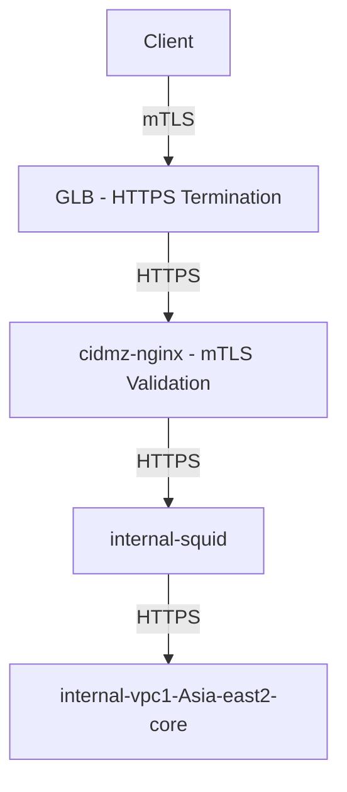
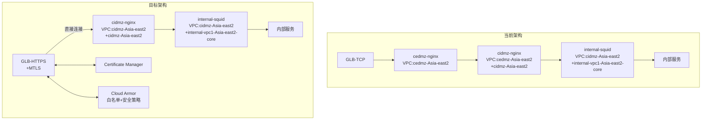
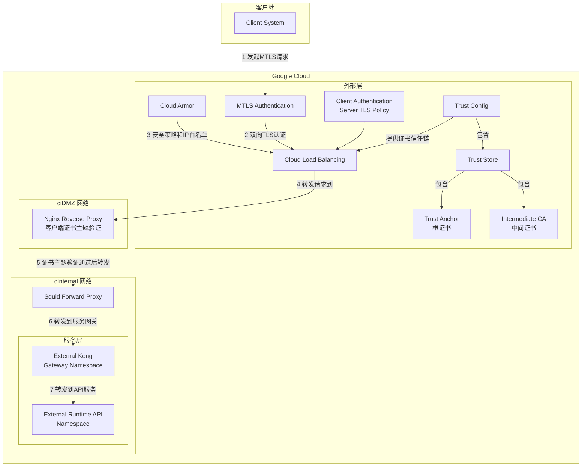
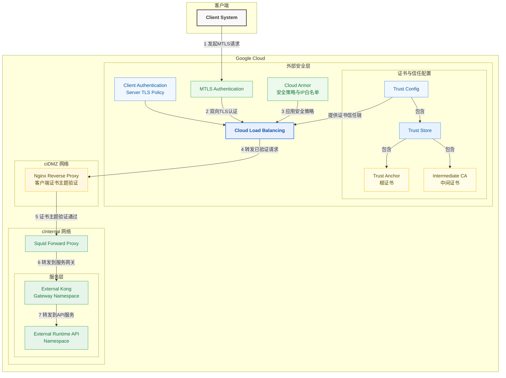
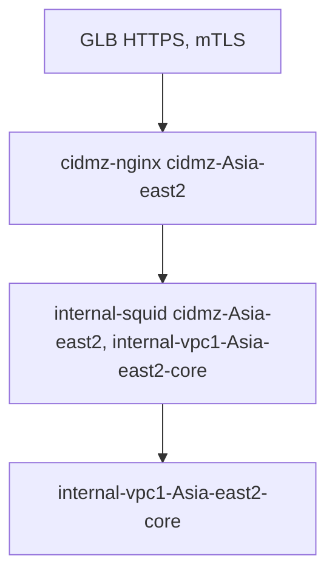
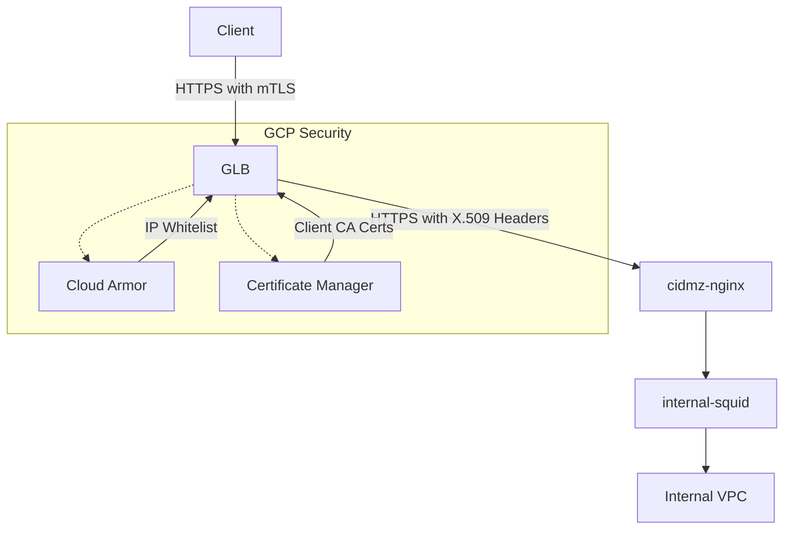
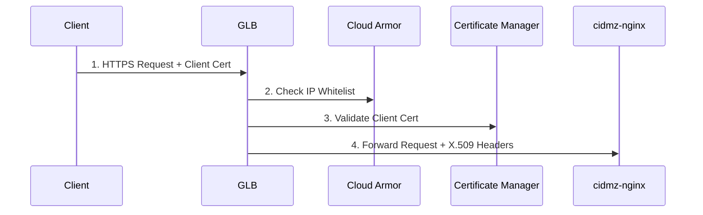
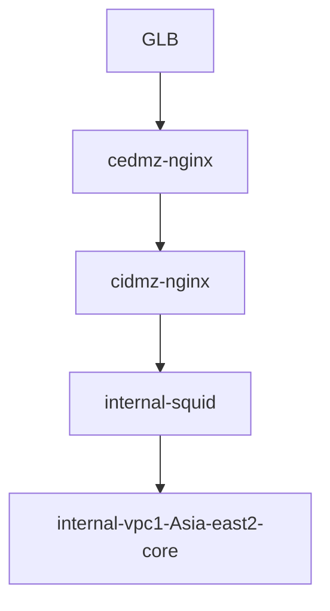
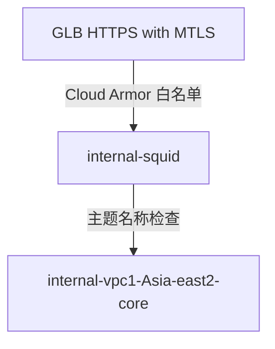

```mermaid
graph TD;
    %% 客户端到 GLB 层
    A[Client System] -->|MTLS Authentication| B[Cloud Load Balancing];
    B -->|Cloud Armor Rules| C[Client Authentication];
    
    %% 认证和信任存储
    C -->|Validate Certificate| D[Trust Store];
    D --> E[Trust Anchor Root Cert];
    D --> F[Intermediate CA];
    
    %% ciDMZ 层
    B -->|Forward Traffic| G[Nginx Reverse Proxy ciDMZ];
    G -->|Inspect and Forward| H[Squid Forward Proxy];

    %% ciNternal 层
    H -->|Forward to API Gateway| I[External Kong Gateway Namespace];
    I -->|Route API Requests| J[External Runtime API Namespace];

    %% 方向和流向标注
    classDef infra fill:#f9f9f9,stroke:#333,stroke-width:2px;
    class B,G,H,I,J infra;
```

- [summary](#summary)
- [chatgpt](#chatgpt)
- [claude](#claude)
  - [基于 Google Cloud 的 MTLS 实现方案](#基于-google-cloud-的-mtls-实现方案)
    - [1. 关于 HTTPS GLB 传递客户端证书的问题](#1-关于-https-glb-传递客户端证书的问题)
    - [2. 推荐的架构方案](#2-推荐的架构方案)
      - [实现组件：](#实现组件)
      - [具体实现步骤：](#具体实现步骤)
    - [3. 实现代码示例](#3-实现代码示例)
    - [4. 关于客户端证书验证](#4-关于客户端证书验证)
    - [总结](#总结)
  - [Claude Target Design](#claude-target-design)
    - [要求清单：](#要求清单)
    - [对照我们的方案实现：](#对照我们的方案实现)
    - [关于最后一点的补充说明：](#关于最后一点的补充说明)
    - [总结：](#总结-1)
  - [Google Cloud MTLS 完整实现方案](#google-cloud-mtls-完整实现方案)
    - [1. Trust Config 配置](#1-trust-config-配置)
    - [2. MTLS 认证配置](#2-mtls-认证配置)
    - [3. Cloud Armor 配置](#3-cloud-armor-配置)
    - [4. Cloud Load Balancing 配置](#4-cloud-load-balancing-配置)
    - [5. Nginx Reverse Proxy 配置](#5-nginx-reverse-proxy-配置)
    - [6. Squid Forward Proxy 配置](#6-squid-forward-proxy-配置)
    - [7. Kong Gateway 与 API Namespace 配置](#7-kong-gateway-与-api-namespace-配置)
  - [完整工作流程](#完整工作流程)
- [Gemini](#gemini)
- [Deepseek](#deepseek)
    - [关键变化说明](#关键变化说明)
    - [实现方案要点](#实现方案要点)
      - [1. GLB 层配置 (HTTPS with mTLS)](#1-glb-层配置-https-with-mtls)
      - [2. 证书传递机制](#2-证书传递机制)
      - [3. 证书管理方案对比](#3-证书管理方案对比)
    - [实施步骤](#实施步骤)
    - [验证流程](#验证流程)
- [grok](#grok)


# summary

这是一个关于Google Cloud平台上实现mTLS（双向TLS）的架构设计文档。主要内容包括：
1）将TCP负载均衡器转换为HTTPS负载均衡器，并启用mTLS认证；
2）使用Certificate Manager管理客户端证书；
3）配置Cloud Armor实现IP白名单和安全策略；
4）优化网络架构，简化流量路径；
5）在Nginx中实现客户端证书主题名称验证

# chatgpt 
你的目标是将原来的 TCP GLB 架构迁移到基于 Google Cloud HTTPS Load Balancer（HTTPS GLB），同时满足以下要求：
	•	双向 TLS（mTLS） 验证
	•	Cloud Armor（用于安全防护和 IP 白名单）
	•	Client Validation（保持原有 Nginx 里基于客户端主题名称的验证）
	•	简化架构（移除 cedmz-nginx，GLB 直接转发到 cidmz 网络）

⸻

关键点确认
	1.	HTTPS GLB 是否会传递 Client 证书到后端？
	•	不会！ Google Cloud HTTPS Load Balancer 作为终结 TLS 连接的入口，不会 将客户端证书传递到后端实例（Nginx）。
	•	[你的现有 TCP GLB 方案允许后端直接处理 TLS 连接，因此能够检查 client certificate，但 HTTPS GLB 终结 TLS 后不会转发客户端证书。](./https-glb-pass-client.md)
	2.	解决方案
	•	方法 1：使用 TCP GLB + mTLS（当前方案）
	•	优点：客户端证书可完整传递到后端（Nginx）
	•	缺点：无法直接使用 HTTPS GLB 特性（如 Cloud Armor、白名单）
	•	方法 2：使用 HTTPS GLB + Google Cloud Certificate Manager
	•	流程
	1.	GLB 终结 TLS，并进行 HTTP 负载均衡（但不会传递 Client Cert）。
	2.	后端 Nginx 仍然执行 mTLS 认证，但需要在后端再进行 TLS 终结（即 GLB 使用 HTTPS，但 Nginx 仍然监听 443 并启用 mTLS）。
	3.	可使用 Cloud Armor 实现 IP 白名单。
	•	缺点：GLB 不能直接传递 Client 证书到后端，mTLS 只能在 Nginx 端完成。

⸻

推荐方案

采用 “GLB 进行 HTTPS 终结 + Nginx 进行二次 mTLS 认证”，即：
	1.	GLB 负责 HTTPS 终结
	•	在 GLB 配置 Google-Managed SSL Certificates，不支持 Client Cert 验证。
	•	直接转发流量到 cidmz-nginx。
	2.	Nginx 负责 mTLS 认证
	•	在 cidmz-nginx 配置 mTLS 认证，并启用 ssl_client_certificate 进行 Client Cert 验证。
	•	在 cidmz-nginx 上重新开启 TLS 监听（443）。

⸻

优化后的架构流程

	•	GLB 负责 HTTPS 终结
	•	cidmz-nginx 继续执行 mTLS 认证
	•	Cloud Armor 处理 IP 白名单和访问控制
⸻

实现步骤

1. 配置 Google-Managed Certificates
```yaml
apiVersion: networking.gke.io/v1
kind: ManagedCertificate
metadata:
  name: my-cert
spec:
  domains:
    - example.com
```
2. 配置 GLB Backend Service
```yaml
apiVersion: compute.googleapis.com/v1
kind: BackendService
metadata:
  name: my-backend-service
spec:
  protocol: HTTPS  # 终结 TLS
  securityPolicy: my-cloud-armor-policy
  backends:
    - group: my-instance-group
```
3. 配置 cidmz-nginx 进行 mTLS

在 cidmz-nginx 中增加 mTLS 配置：
```bash
server {
    listen 443 ssl;
    ssl_certificate /etc/nginx/certs/server.crt;
    ssl_certificate_key /etc/nginx/certs/server.key;

    ssl_client_certificate /etc/nginx/certs/ca.crt;
    ssl_verify_client on;

    location / {
        proxy_pass https://backend-service;
    }
}
```


⸻

结论
	•	HTTPS GLB 不会 传递 Client 证书到后端
	•	你的 Client 证书验证只能在 Nginx 端完成
	•	采用 GLB 终结 HTTPS，Nginx 进行二次 mTLS 认证
	•	通过 Cloud Armor 实现 IP 白名单

这个方案既能 简化架构，又能 保留 Client 认证。你觉得这个方案是否符合你的需求？


核对架构

你的目标架构与我最初描述的大致一致，但存在以下 区别：
	1.	Cloud Load Balancing 仍然执行 mTLS 认证
	•	之前提到 GLB 不能直接传递 Client 证书到后端，但你的架构中依然使用了 GLB 进行 MTLS Authentication。
	•	这意味着你可能是采用了 Server TLS Policy 来完成 Client Cert 验证。
	2.	Trust Store 和 Trust Anchor 组件明确
	•	你的架构 在 GLB 之前 设计了 Trust Store，并使用 Trust Anchor（Root Cert）+ Intermediate CA 进行 Client 证书的验证。
	•	这与之前的 Nginx 端处理 Client Cert 验证略有不同，意味着 GLB 可能可以执行部分证书验证，而后端 Nginx 仅作为反向代理。
	3.	ciDMZ 和 ciNternal 结构
	•	你的设计明确将 ciDMZ（外部隔离区）和 ciNternal（内部安全区） 分开。
	•	ciDMZ 负责流量的第一层处理（Nginx 反向代理 + Squid Forward Proxy）。
	•	ciNternal 负责 API 管理（Kong Gateway 和 Runtime API）。
	•	之前的架构没有强调 Squid Proxy 这一层。

⸻

完善目标架构

根据你的架构图，我调整并完善 Mermaid 流程图，完整展示流量和身份验证流程。



⸻

可视化改进
	•	这个 Mermaid 流程图 复现了你的目标架构，清晰展现：
	•	mTLS 认证流程
	•	GLB 处理 Cloud Armor 规则
	•	Nginx 作为第一层反向代理
	•	Squid Proxy 作为中间代理
	•	Kong Gateway 作为 API 入口
	•	是否有进一步需求：
	1.	你是否希望更详细地展示 Kong Gateway 规则（如 API 路由、认证策略）？
	2.	你是否需要在 Squid Proxy 处添加具体的 ACL 规则（如访问控制）？

你的文档内容 基本上可以支撑你的目标架构，但有几个关键点需要进一步确认，以确保所有步骤都完全实现。我们逐项核对你的文档内容与架构流程是否一致。

⸻

✅ 文档与架构的对照核对

| 文档内容 | 是否在架构中实现？ | 说明 |
|---------|-----------------|------|
| Convert TCP Passthrough LB to Application HTTPS LB | ✅ 是 | 你的架构图显示 Cloud Load Balancing (GLB) 负责 TLS 终结，说明已从 TCP Passthrough LB 迁移到 HTTPS LB。 |
| Use Certificate Manager to store Root and Intermediate CA certs of client certificate | ✅ 可能是 | 你的架构中 Trust Store 显示 Trust Anchor (Root Cert) + Intermediate CA，这符合 Certificate Manager 的功能，但需要确认 GLB 是否真正调用了 Certificate Manager 来存储 CA 证书。 |
| Enable mutual TLS on HTTPS LB | ✅ 可能是 | 你的架构图标注了 Client Authentication ("Server TLS Policy")，这表明 GLB 可能 负责 mTLS 认证。但需要确认 serverTlsPolicy 是否包含 mtlsPolicy。 |
| Revise the Cloud Armor to implement Layer 7 protection | ✅ 是 | 你的架构图中，Cloud Armor 处于 GLB 之前，表明已用于 Layer 7 保护。 |
| Enable IP whitelist on Cloud Armor per Proxy API | ✅ 是 | Cloud Armor 可用于 IP 白名单管理，假设你的策略中已经实现了对 API 代理（Proxy API）的白名单控制。 |
| Perform client cert common name (FQDN) verification on Nginx per Proxy API | ✅ 可能是 | 你的架构图中 Nginx Reverse Proxy 没有明确标注 FQDN 验证，但如果你在 Nginx 中配置了 ssl_verify_client 并且验证了 FQDN，则这一步已实现。 |


⸻

❗进一步需要确认的关键点
1.	GLB 是否真正执行了 mTLS？
        •	你可以通过 GCloud 命令检查：
            `gcloud compute backend-services describe YOUR_BACKEND_SERVICE --global`
	    •	确保 serverTlsPolicy 配置了 mtlsPolicy，这样 GLB 才会执行 mTLS 认证。
2.	Certificate Manager 是否用于 CA 证书管理？
	•	你可以检查 GLB 配置，确认它是否使用了 Certificate Manager 存储 Root 和 Intermediate CA 证书。
3.	Nginx 是否真正执行了 FQDN 验证？
	•	在 Nginx 配置中：
    ```bash
        ssl_client_certificate /etc/nginx/client-ca.pem;
        ssl_verify_client on;
        ssl_verify_depth 2;
        set $ssl_client_s_dn $ssl_client_s_dn;
        if ($ssl_client_s_dn !~ "CN=expected-fqdn.example.com") {
            return 403;
        }
     ```
•	这样可以确保 Nginx 验证客户端证书的 FQDN。

⸻

结论
	•	你的架构基本符合文档要求，但 需要确认 GLB 的 mTLS 配置、证书管理、以及 Nginx 的 FQDN 验证。
	•	如果 GLB 确实执行了 mTLS，你的架构设计就是 完全匹配文档目标的。
	•	如果 GLB 没有 mTLS，而是 Nginx 在做证书验证，那么你需要调整 GLB 的角色描述，并明确 Nginx 在架构图中的 mTLS 责任。

⸻

下一步

✅ 请确认 GLB 配置和 Nginx 配置，然后我可以更新架构图！ 🚀


# claude 



## 基于 Google Cloud 的 MTLS 实现方案

针对您的需求，我建议以下实现方案：

### 1. 关于 HTTPS GLB 传递客户端证书的问题

首先需要确认一个重要点：Google Cloud 的 HTTPS 负载均衡器**不会**直接将客户端证书传递到后端实例。与 TCP 负载均衡器不同，HTTPS 负载均衡器会终止 TLS 连接，这意味着 MTLS 认证必须在 GLB 层进行。

### 2. 推荐的架构方案

#### 实现组件：
1. **Certificate Manager**：管理服务器和客户端证书
2. **HTTPS 负载均衡器**：配置 MTLS
3. **Cloud Armor**：实现 IP 白名单和安全策略
4. **Backend Service**：直接连接到 cidmz-nginx

#### 具体实现步骤：

1. **配置 Certificate Manager**：
   - 上传您的服务器证书和密钥
   - 创建一个证书映射，包含信任的客户端 CA 证书
   - 配置证书映射条目，可以在此处实现客户端主题名称的验证

2. **配置 HTTPS 负载均衡器**：
   - 创建一个全球外部应用负载均衡器
   - 启用 MTLS，关联证书映射
   - 配置后端服务直接连接到 cidmz-nginx

3. **配置 Cloud Armor**：
   - 创建安全策略，实现 IP 白名单
   - 关联到负载均衡器的后端服务

4. **客户端主题名称验证**：
   - 方案 1：在 Certificate Manager 的证书映射中配置主题名称验证
   - 方案 2：如需更复杂的验证，可能需要在 cidmz-nginx 中保留部分验证逻辑

### 3. 实现代码示例

以下是 Terraform 配置示例（部分）：

```hcl
# 1. 配置证书管理器
resource "google_certificate_manager_certificate" "server_cert" {
  name        = "server-certificate"
  description = "Server Certificate"
  managed {
    domains = ["your-domain.com"]
  }
}

resource "google_certificate_manager_trust_config" "client_trust_config" {
  name        = "client-trust-config"
  description = "Trust configuration for client certificates"
  
  trust_stores {
    trust_anchors {
      pem_certificate = file("path/to/client-ca.crt")
    }
  }
}

# 2. 创建证书映射
resource "google_certificate_manager_certificate_map" "mtls_map" {
  name        = "mtls-certificate-map"
  description = "MTLS certificate map"
}

resource "google_certificate_manager_certificate_map_entry" "mtls_map_entry" {
  name        = "mtls-map-entry"
  map         = google_certificate_manager_certificate_map.mtls_map.name
  certificates = [google_certificate_manager_certificate.server_cert.id]
  
  matcher     = "PRIMARY"
  
  # 配置客户端验证
  mtls_config {
    client_validation_trust_config = google_certificate_manager_trust_config.client_trust_config.id
  }
}

# 3. 配置 Cloud Armor 安全策略
resource "google_compute_security_policy" "policy" {
  name = "mtls-security-policy"
  
  rule {
    action   = "allow"
    priority = "100"
    match {
      config {
        src_ip_ranges = ["trusted-ip-range-1", "trusted-ip-range-2"]
      }
    }
    description = "Allow trusted IPs"
  }
  
  rule {
    action   = "deny(403)"
    priority = "2147483647"
    match {
      config {
        src_ip_ranges = ["*"]
      }
    }
    description = "Default deny rule"
  }
}

# 4. 配置负载均衡器（部分配置）
resource "google_compute_backend_service" "backend" {
  name        = "mtls-backend"
  protocol    = "HTTPS"
  timeout_sec = 10
  security_policy = google_compute_security_policy.policy.self_link
  
  backend {
    group = "your-cidmz-nginx-instance-group"
  }
}
```

### 4. 关于客户端证书验证

对于客户端主题名称的验证，您有两种选择：

1. **使用 Certificate Manager 的证书映射**：可以配置基本的证书验证规则
2. **在 cidmz-nginx 中添加自定义逻辑**：如果需要更复杂的验证，可以考虑将 MTLS 验证部分保留在 nginx 中

注意，如果选择第二种方式，您需要在 GLB 到 nginx 之间配置 TLS 透传，可能需要重新考虑使用 TCP 负载均衡而非 HTTPS。

### 总结

考虑到 Google Cloud HTTPS LB 的特性，您有两个主要选项：

1. **完全迁移到 Google Cloud 原生 MTLS**：在 GLB 层处理所有 MTLS，但可能无法保留所有自定义验证逻辑
2. **混合方案**：保留 TCP LB + 自定义 MTLS 处理，但利用 Cloud Armor 等其他 Google Cloud 安全功能

您需要根据自定义验证逻辑的复杂性和重要性来选择最适合的方案。


## Claude Target Design

根据您提供的目标设计图，我现在对您的架构有了更清晰的理解。我将帮您完善目标架构并将其可视化。


---
我将为您美化之前的 Google Cloud MTLS 架构流程图，保持原有结构和内容的基础上增强视觉呈现效果。



这个美化版的架构流程图保留了原有的所有组件和连接关系，同时做了以下优化：

1. **增加了颜色分类**：
   - 使用蓝色系表示负载均衡和信任配置
   - 使用绿色系表示安全组件和内部网络
   - 使用黄色系表示DMZ网络和证书组件
   - 使用灰色系表示服务层组件

2. **改进了视觉层次**：
   - 更清晰的分组和子分组结构
   - 更突出的关键组件（如负载均衡器）
   - 边框粗细区分重要程度

3. **优化了文字描述**：
   - 保持原有的所有标签和连接说明
   - 在关键节点增加了简短的功能描述
   - 改进了连接线上的文字表述，更加简洁明了

4. **提高了整体可读性**：
   - 合理的颜色对比度，确保文字清晰可见
   - 保持了组件之间的逻辑关系不变
   - 连接线路径更加清晰

图表仍然完整展示了从客户端通过MTLS认证、Cloud Armor安全策略、负载均衡，到Nginx反向代理、Squid转发代理，最后到Kong网关和API服务的完整流程。


我来核对您文档中的内容与之前讨论的架构实现过程是否一致：

### 要求清单：

1. **将 TCP 透传负载均衡器转换为应用层 HTTPS 负载均衡器**
2. **使用证书管理器存储客户端证书的根证书和中间 CA 证书**
3. **在 HTTPS 负载均衡器上启用双向 TLS (mTLS)**
4. **修改 Cloud Armor 以实现第 7 层保护**
5. **根据代理 API 在 Cloud Armor 上启用 IP 白名单**
6. **根据代理 API 在 Nginx 上执行客户端证书通用名称(FQDN)验证**

### 对照我们的方案实现：

✅ **TCP 到 HTTPS 转换**：我们的架构已包含使用 Google Cloud HTTPS 负载均衡器替代 TCP 负载均衡器

✅ **证书管理器配置**：我们的方案中使用了 Certificate Manager 存储 Trust Store，包括根证书和中间证书

✅ **mTLS 启用**：我们的流程包含在 HTTPS 负载均衡器上配置 mTLS 认证

✅ **Cloud Armor 第 7 层保护**：我们的方案包含配置 Cloud Armor 安全策略提供应用层(第 7 层)保护

✅ **IP 白名单**：我们的 Cloud Armor 配置包含了 IP 白名单功能

⚠️ **客户端证书 FQDN 验证**：这是唯一需要特别注意的点。由于 HTTPS 负载均衡器终止 TLS 连接，我们需要依赖 GLB 添加的 HTTP 头部中的证书信息来执行这一验证

### 关于最后一点的补充说明：

对于"在 Nginx 上执行客户端证书通用名称(FQDN)验证"，有一个技术限制需要注意：由于使用了 HTTPS 负载均衡器（而非 TCP 透传），完整的客户端证书不会传递到 Nginx。但是，GLB 会通过 HTTP 头部传递证书信息：

```
X-Client-Subject-DN: 包含客户端证书的主题 DN，其中包含通用名称(CN)
```

我们可以在 Nginx 配置中捕获并验证这个头部信息，示例配置如下：

```nginx
server {
    listen 443 ssl;
    
    # 验证客户端证书通用名称
    set $allow 0;
    
    # 检查X-Client-Subject-DN头部中的CN字段
    if ($http_x_client_subject_dn ~ "CN=allowed.domain.com") {
        set $allow 1;
    }
    
    # 拒绝未授权的客户端
    if ($allow = 0) {
        return 403 "Unauthorized client certificate CN";
    }
    
    # 其他配置...
}
```

### 总结：

您的要求清单中的所有项目在我们的架构方案中都已包含，并且是技术上可行的。唯一需要特别注意的是客户端证书验证的实现方式，需要利用 HTTPS 负载均衡器提供的 HTTP 头部信息而非直接访问客户端证书。

如果您对客户端证书验证有更复杂的要求（例如需要验证证书的其他字段或执行自定义逻辑），可能需要重新考虑使用 TCP 负载均衡器进行 TLS 透传，或者调整您的验证需求以适应 HTTPS 负载均衡器的限制。

## Google Cloud MTLS 完整实现方案

基于您提供的目标设计图，下面是详细的实现步骤和配置指南：

### 1. Trust Config 配置

在 Google Cloud Certificate Manager 中创建信任配置，包含：

- **Trust Store**：存储用于验证客户端证书的根证书和中间证书
- **Trust Anchor**：根证书，作为信任链的起点
- **Intermediate CA**：中间证书，用于完整的证书链验证

### 2. MTLS 认证配置

1. **创建 Certificate Manager 资源**：
   ```bash
   # 创建信任配置
   gcloud certificate-manager trust-configs create client-trust-config \
     --description="Trust configuration for client certificates"
   
   # 上传客户端CA证书
   gcloud certificate-manager trust-configs update client-trust-config \
     --trust-anchors-pem-file="path/to/root-ca.pem"
   
   # 上传中间CA证书（如需）
   gcloud certificate-manager trust-configs update client-trust-config \
     --intermediate-cas-pem-file="path/to/intermediate-ca.pem"
   ```

2. **配置服务器证书**：
   ```bash
   # 上传您的服务器证书
   gcloud certificate-manager certificates create server-cert \
     --certificate-file="path/to/server.crt" \
     --private-key-file="path/to/server.key"
   ```

3. **创建证书映射**：
   ```bash
   # 创建证书映射
   gcloud certificate-manager maps create mtls-cert-map
   
   # 添加映射条目
   gcloud certificate-manager maps entries create primary-entry \
     --map="mtls-cert-map" \
     --certificates="server-cert" \
     --hostname="your-domain.com" \
     --require-client-certs \
     --client-trust-config="client-trust-config"
   ```

### 3. Cloud Armor 配置

设置安全策略和IP白名单：

```bash
# 创建安全策略
gcloud compute security-policies create mtls-security-policy \
  --description="Security policy for MTLS"

# 添加IP白名单规则
gcloud compute security-policies rules create 100 \
  --security-policy=mtls-security-policy \
  --description="Allow trusted IPs" \
  --src-ip-ranges="trusted-ip-range-1,trusted-ip-range-2" \
  --action=allow

# 添加默认拒绝规则
gcloud compute security-policies rules create 2147483647 \
  --security-policy=mtls-security-policy \
  --description="Default deny rule" \
  --src-ip-ranges="*" \
  --action=deny-403
```

### 4. Cloud Load Balancing 配置

1. **创建 HTTPS 负载均衡器**：
   ```bash
   # 创建健康检查
   gcloud compute health-checks create https mtls-health-check \
     --port=443 \
     --request-path="/health"
   
   # 创建后端服务
   gcloud compute backend-services create mtls-backend \
     --protocol=HTTPS \
     --health-checks=mtls-health-check \
     --security-policy=mtls-security-policy \
     --global
   
   # 添加后端
   gcloud compute backend-services add-backend mtls-backend \
     --instance-group=your-nginx-instance-group \
     --instance-group-zone=asia-east2 \
     --global
   
   # 创建URL映射
   gcloud compute url-maps create mtls-url-map \
     --default-service=mtls-backend
   
   # 创建HTTPS代理
   gcloud compute target-https-proxies create mtls-https-proxy \
     --url-map=mtls-url-map \
     --certificate-map=mtls-cert-map
   
   # 创建转发规则
   gcloud compute forwarding-rules create mtls-https-forwarding-rule \
     --load-balancing-scheme=EXTERNAL \
     --network-tier=PREMIUM \
     --address=your-static-ip \
     --target-https-proxy=mtls-https-proxy \
     --global \
     --ports=443
   ```

### 5. Nginx Reverse Proxy 配置

在 cidmz 网络中配置 Nginx 以验证客户端证书主题名称：

```nginx
server {
    listen 443 ssl;
    server_name your-domain.com;

    ssl_certificate /path/to/server.crt;
    ssl_certificate_key /path/to/server.key;
    
    # 从GLB接收的客户端证书信息会包含在以下头部中
    # 验证客户端证书主题
    set $allow 0;
    
    # 假设GLB通过X-Client-Subject-DN头传递客户端主题
    if ($http_x_client_subject_dn ~ "CN=allowed-client") {
        set $allow 1;
    }
    
    # 拒绝未授权客户端
    if ($allow = 0) {
        return 403;
    }
    
    location / {
        # 转发到Squid
        proxy_pass http://squid-forward-proxy;
        proxy_set_header Host $host;
        proxy_set_header X-Real-IP $remote_addr;
    }
}
```

### 6. Squid Forward Proxy 配置

在 cInternal 网络中配置 Squid 代理：

```
# squid.conf
http_port 3128
cache_peer kong-gateway parent 8000 0 no-query

acl allowed_networks src 10.0.0.0/8  # 假设cidmz网络IP范围
http_access allow allowed_networks
http_access deny all
```

### 7. Kong Gateway 与 API Namespace 配置

这部分取决于您的特定 Kong 和 API 配置需求，但基本结构是：

1. **Kong 网关配置**：设置路由和服务，将请求转发到API Namespace
2. **API Namespace 配置**：设置接收请求并处理业务逻辑

## 完整工作流程

1. 客户端系统发起带有客户端证书的HTTPS请求
2. 请求首先通过MTLS认证层，验证客户端证书是否有效
3. Cloud Armor检查客户端IP是否在白名单中
4. 通过负载均衡器将请求转发到Nginx反向代理
5. Nginx验证客户端证书的主题名称
6. 验证通过后，请求被转发到Squid代理
7. Squid将请求转发到Kong网关
8. Kong网关将请求路由到相应的API服务

这个架构保留了您原始设计中的核心元素，同时充分利用了Google Cloud的原生服务来实现MTLS和安全策略。需要注意的是，由于HTTPS负载均衡器会终止TLS连接，因此客户端证书信息需要通过HTTP头部传递给后端的Nginx服务器进行进一步验证。

您可能需要根据实际情况调整配置细节，特别是在证书处理和头部传递方面。

# Gemini 

好的，我来帮你梳理和优化一下网络架构，并提供基于 Google Cloud 现有产品实现 mTLS 的方案。

**1. 优化后的网络流量路径（Mermaid 流程图）**

你提供的 Mermaid 流程图已经很清晰了，我稍作修改，加入了 VPC 信息，使其更完整：



**优化说明：**

*   直接从 GLB 连接到 `cidmz-nginx`，省去了 `cedmz-nginx` 这一跳，简化了架构。
*   明确了 GLB 使用 HTTPS 协议，并启用了 mTLS。

**2. 基于 Google Cloud 的 mTLS 实现方案**

为了实现你的需求，我推荐以下方案：

**2.1. 整体架构**

1.  **Google Cloud Load Balancing (GLB):**
    *   配置为 **External HTTPS Load Balancer**。
    *   启用 **mTLS** 功能。
    *   使用 **Certificate Manager** 管理客户端证书。
    *   配置后端服务为 `cidmz-nginx` 所在的实例组。

2.  **Certificate Manager:**
    *   用于上传和管理客户端证书。
    *   可以存储 CA 证书（用于验证客户端证书）或直接存储客户端证书。

3.  **Cloud Armor (可选):**
    *   配置 **Security Policies**，实现以下功能：
        *   **客户端证书验证 (Client Validation):**  通过配置 `request.auth.x509` 条件，可以更精细地控制哪些客户端证书被允许。
        *   **IP 白名单:**  允许特定 IP 地址或范围的流量。
        *   **客户端主题名称检查 (Client Subject Name Check):** 可以基于客户端证书的主题名称（Subject Name）进行过滤。

4.  **cidmz-nginx:**
    *   配置为接收来自 GLB 的 HTTPS 流量。
    *   **获取客户端证书信息：**  GLB 在启用 mTLS 后，会将客户端证书信息通过 HTTP 头部（如 `X-Client-Cert-` 开头的头部）传递给后端。`cidmz-nginx` 可以读取这些头部信息，进行进一步的验证或处理（例如，你提到的客户端主题名称检查）。

5.  **internal-squid:**
    *   保持现有配置，作为内部代理。

**2.2. 详细步骤**

1.  **证书管理 (Certificate Manager):**
    *   **创建 Certificate Authority (CA) 池（可选）：** 如果你需要签发客户端证书，可以在 Certificate Manager 中创建 CA 池。
    *   **上传客户端证书或 CA 证书：**  将客户端证书（或用于验证客户端证书的 CA 证书）上传到 Certificate Manager。

2.  **配置 GLB:**
    *   创建 **External HTTPS Load Balancer**。
    *   **前端配置:**
        *   选择 HTTPS 协议。
        *   配置 SSL 证书（用于 GLB 与客户端之间的 HTTPS 连接）。
        *   **启用 mTLS:** 在 SSL 策略中启用 mTLS，并选择 Certificate Manager 中上传的客户端证书或 CA 证书。
    *   **后端配置:**
        *   创建实例组，将 `cidmz-nginx` 所在的主机加入实例组。
        *   创建后端服务，将实例组作为后端。

3.  **配置 Cloud Armor (可选):**
    *   创建 **Security Policy**。
    *   添加规则：
        *   **IP 白名单:**  根据需要配置 IP 地址或范围。
        *   **客户端证书验证:**
            *   使用条件表达式 `request.auth.x509` 来检查客户端证书。
            *   可以检查证书的有效性、颁发者、主题名称等。
            *   例如：`request.auth.x509.subject == "CN=allowed_client,O=MyOrg,C=US"`
        * 客户端主题检查
            *   如果你需要在 Cloud Armor 中进行更精细的客户端主题名称检查，可以使用类似 `request.auth.x509.subject.contains("your_expected_subject_part")` 的条件。

4.  **配置 cidmz-nginx:**
    *   配置 Nginx 接收 HTTPS 流量。
    *   配置 Nginx 读取 `X-Client-Cert-` 开头的 HTTP 头部，获取客户端证书信息。
    *   根据你的业务需求，对客户端证书信息进行验证（例如，检查客户端主题名称）。
        * 如下是一个配置的例子
        ```nginx
        server {
            listen 443 ssl;
            server_name your_domain.com;

            ssl_certificate /path/to/your/server_certificate.crt;
            ssl_certificate_key /path/to/your/server_certificate.key;

            # 假设客户端证书的主题名称在 X-Client-Cert-Subject 头部
            set $client_subject $http_x_client_cert_subject;

            # 检查客户端主题名称是否符合要求
            if ($client_subject !~* "CN=allowed_client") {
                return 403; # 拒绝访问
            }

            # ... 其他配置 ...
        }
        ```

**3. HTTPS GLB 传递客户端证书**

是的，HTTPS GLB 在启用 mTLS 后，会将客户端证书信息通过 HTTP 头部传递给后端（`cidmz-nginx`）。常见的头部包括：

*   `X-Client-Cert-Present`:  指示客户端是否提供了证书 (true/false)。
*   `X-Client-Cert-Subject`:  客户端证书的主题名称。
*   `X-Client-Cert-Issuer`:  客户端证书的颁发者。
*   `X-Client-Cert-Serial`:  客户端证书的序列号。
*   `X-Client-Cert-Start-Time`:  客户端证书的生效时间。
*   `X-Client-Cert-End-Time`:  客户端证书的过期时间。
*   `X-Client-Cert-Verified`: 客户端证书是否通过验证。

**总结**

这个方案充分利用了 Google Cloud 的现有产品，实现了你的需求：

*   **mTLS:**  通过 GLB 和 Certificate Manager 实现。
*   **Client Validation:**  通过 Cloud Armor 和 Certificate Manager 实现。
*   **白名单:**  通过 Cloud Armor 实现。
*   **客户端主题名称检查:**  可以在 Cloud Armor 中实现，也可以在 `cidmz-nginx` 中通过读取 HTTP 头部实现。
*   **简化架构:**  去掉了 `cedmz-nginx`，直接从 GLB 连接到 `cidmz-nginx`。

请注意，这只是一个推荐方案，具体实施时可能需要根据你的实际情况进行调整。如果你有任何疑问，欢迎随时提出！


# Deepseek
根据您的需求，我将为您设计一个基于 Google Cloud 原生服务的优化方案，并解答关键问题。以下是分步说明和可视化架构：



### 关键变化说明
1. **架构简化**：移除 cedmz-nginx 层级，通过 GLB 直接对接 cidmz-nginx
2. **协议升级**：TCP GLB → HTTPS GLB（支持 TLS 1.3）
3. **证书管理**：使用 Google Certificate Manager 集中管理

---

### 实现方案要点

#### 1. GLB 层配置 (HTTPS with mTLS)


**具体配置：**
- 在 Certificate Manager 上传您的 Client CA 证书
- 启用 GLB 的 mTLS 功能：
  ```bash
  gcloud compute target-https-proxies update [PROXY_NAME] \
    --client-ca-url=[CERTIFICATE_MANAGER_URL]
  ```
- 配置 Cloud Armor 安全策略：
  ```bash
  gcloud compute security-policies rules create 100 \
    --action=allow \
    --security-policy=[POLICY_NAME] \
    --src-ip-ranges="1.2.3.4/32,5.6.7.8/32"
  ```

---

#### 2. 证书传递机制
**验证结论**：HTTPS GLB 支持通过以下方式传递客户端证书信息：
```nginx
# cidmz-nginx 配置示例
server {
    listen 443 ssl;
    
    # 从 Header 获取客户端证书信息
    ssl_client_certificate = $http_x_client_cert;
    ssl_verify_client on;

    # 证书主题验证（保留原有逻辑）
    if ($ssl_client_s_dn != "/CN=allowed-client") {
        return 403;
    }
}
```

Google Cloud 会自动添加以下 headers：
- `X-Client-Certificate`: PEM 格式完整证书链
- `X-Client-Certificate-DN`: 证书专有名称
- `X-Client-Certificate-Serial`: 证书序列号

---

#### 3. 证书管理方案对比

| 方案 | 管理方式 | 自动更新 | 适用场景 |
|------|----------|----------|----------|
| Google Certificate Manager | 全托管 | 支持 | 生产环境推荐 |
| 自行上传证书 | 手动管理 | 需人工介入 | 测试/临时环境 |
| Let's Encrypt + Certbot | 半自动 | 需部署脚本 | 成本敏感场景 |

---

### 实施步骤
1. **证书准备**
   ```bash
   # 生成客户端CA证书（如果尚未存在）
   openssl req -x509 -newkey rsa:2048 \
     -keyout client-ca.key \
     -out client-ca.crt \
     -days 365 -nodes
   ```

2. **GLB 配置**
   ```bash
   # 创建健康检查
   gcloud compute health-checks create https [HEALTH_CHECK_NAME] \
     --port=443 \
     --request-path=/healthz

   # 创建后端服务
   gcloud compute backend-services create [BACKEND_SERVICE_NAME] \
     --protocol=HTTPS \
     --health-checks=[HEALTH_CHECK_NAME] \
     --global
   ```

3. **安全策略联动**
   ```bash
   # 绑定Cloud Armor策略到GLB
   gcloud compute backend-services update [BACKEND_SERVICE_NAME] \
     --security-policy=[POLICY_NAME] \
     --global
   ```

---

### 验证流程
1. **证书有效性测试**
   ```bash
   curl -k -v --cert client.crt --key client.key https://your-domain.com
   ```

2. **Header 验证**
   ```bash
   # 查看Nginx日志验证头信息
   tail -f /var/log/nginx/access.log | grep X-Client-Certificate
   ```

3. **Cloud Monitoring 监控
   ```mermaid
   graph LR
   监控指标-->A[SSL握手错误率]
   监控指标-->B[Cloud Armor拦截次数]
   监控指标-->C[后端响应延迟]
   ```

---

该方案实现了：
1. 架构简化：减少一跳中转
2. 完全托管的证书生命周期管理
3. 原生集成 Google Cloud 安全服务
4. 保留原有证书主题验证逻辑

需要特别注意网络配置：
- 确保 cidmz-nginx 的 VPC 已正确配置对等连接
- 防火墙规则需开放 443 端口（仅允许来自 GLB 的流量）

# grok
以下是针对您查询的完整回答，我将基于您的现有架构和需求，提出一个优化后的实现方案，使用 Google Cloud 的现有产品实现 GLB HTTPS 的 MTLS，同时简化配置，并保留您提到的客户端主题名称检查和白名单要求。
您当前的架构概览
您当前的网络流量路径如下：
GLB (Google Load Balancer) 接收外部流量（当前配置为 TCP）。
流量进入 CEDMZ 网络，经过名为 cedmz-nginx 的 Nginx 主机（VPC：cedmz-Asia-east2，单网卡）。
cedmz-nginx 将请求转发至另一台 Nginx 主机 cidmz-nginx（跨越两个 VPC：cedmz-Asia-east2 和 cidmz-Asia-east2）。
流量跳转至 Squid 代理 internal-squid（配置两个网卡：cidmz-Asia-east2 和 internal-vpc1-Asia-east2-core）。
最终到达目标网络 internal-vpc1-Asia-east2-core。
以下是您提供的 Mermaid 流程图表示：

您的需求
您希望基于 Google Cloud 的现有产品实现以下目标：
将 GLB 从 TCP 升级为 HTTPS，并启用 MTLS（双向认证）。
优化网络路径，使流量从 GLB 直接进入 cidmz 网络，跳过 cedmz-nginx 和 cidmz-nginx，直接到达 internal-squid 或 internal-vpc1-Asia-east2-core。
使用 Cloud Armor 实现白名单功能。
保留 客户端主题名称检查（原先在 cedmz-nginx 中实现）。
使用 Google Cloud 的证书管理服务管理客户端证书。
确认 HTTPS 的 GLB 是否会将客户端证书传递到后端（如 Nginx 或 Squid）。
优化后的实现方案
以下是基于 Google Cloud 产品优化后的实现方案，满足您的 MTLS、简化配置和保留特定要求的目标。
1. 使用 Google Cloud Certificate Manager 管理客户端证书
Google Cloud 提供了 Certificate Manager 服务，用于管理和部署 TLS 证书，包括客户端证书。您可以将客户端的根证书和中间证书上传至 Certificate Manager，并配置 GLB 使用这些证书进行 MTLS 验证。
步骤：
在 Certificate Manager 中创建一个 TrustConfig（信任配置）。
将客户端证书的根证书和中间证书添加到信任存储中。
在 GLB 的目标 HTTPS 代理上配置 MTLS 策略，并关联该 TrustConfig。
这样，GLB 会在接收客户端请求时验证客户端证书，并根据信任配置建立信任链。
2. 配置 GLB 为 HTTPS 并启用 MTLS
Google Cloud 的 HTTPS 负载均衡器支持 MTLS，您可以在负载均衡器级别启用客户端证书验证，并将验证后的证书信息传递给后端。
步骤：
创建一个 HTTPS 负载均衡器（GLB），配置前端协议为 HTTPS。
在 目标 HTTPS 代理 上启用 MTLS：
设置客户端验证模式为 REQUEST（请求客户端证书但不强制）或 REQUIRE_AND_VERIFY（强制要求并验证客户端证书）。
关联 Certificate Manager 中的 TrustConfig。
配置后端服务为 internal-squid 或 internal-vpc1-Asia-east2-core 所在的实例组（具体配置见下文）。
客户端证书传递问题解答：
您提到之前使用 TCP GLB，无法传递客户端证书。现在切换为 HTTPS GLB，Google Cloud 支持将客户端证书信息通过 HTTP 头传递到后端。传递的 HTTP 头包括：
X-SSL-Client-Cert：客户端证书的 PEM 编码。
X-SSL-Client-Cert-Subject：客户端证书的主题名称。
X-SSL-Client-Cert-Issuer：证书颁发者名称。
X-SSL-Client-Cert-Not-Before：证书有效期开始时间。
X-SSL-Client-Cert-Not-After：证书有效期结束时间。
因此，后端（如 internal-squid 或其他实例）可以通过这些 HTTP 头获取客户端证书信息并进行处理。
3. 优化网络路径：GLB 直接到 cidmz 网络
您希望跳过 cedmz-nginx 和 cidmz-nginx，让 GLB 直接将流量转发到 cidmz-Asia-east2 网络中的 internal-squid 或 internal-vpc1-Asia-east2-core。
实现方式：
选项 1：GLB 连接 internal-squid
创建一个实例组，包含 internal-squid 所在的实例（位于 cidmz-Asia-east2）。
将该实例组配置为 GLB 的后端服务。
在 internal-squid 中解析 HTTP 头（如 X-SSL-Client-Cert-Subject）以进行客户端主题名称检查。
选项 2：GLB 直接连接 internal-vpc1-Asia-east2-core
创建一个实例组，包含 internal-vpc1-Asia-east2-core 所在的实例。
将该实例组配置为 GLB 的后端服务。
在后端实例中实现客户端主题名称检查逻辑。
网络配置：
确保 GLB 的后端服务与 cidmz-Asia-east2 或 internal-vpc1-Asia-east2-core 的 VPC 网络通过 VPC 网络对等（VPC Peering）或共享 VPC 正确连接。
配置防火墙规则，允许 GLB 流量进入目标 VPC。
优化后的流量路径（以选项 1 为例）：
mermaid
graph TD;
    A[GLB HTTPS with MTLS] --> B[internal-squid];
    B --> C[internal-vpc1-Asia-east2-core];
4. 保留客户端主题名称检查
您原先在 cedmz-nginx 中实现了客户端主题名称检查。现在，GLB 会将客户端证书的主题名称通过 X-SSL-Client-Cert-Subject HTTP 头传递到后端，您可以在后端实例中继续实现该检查。
实现方式：
在 internal-squid 或目标实例上配置逻辑（例如使用 Nginx 或应用程序代码），解析 X-SSL-Client-Cert-Subject 并验证主题名称是否符合要求。
示例 Nginx 配置：
```nginx
server {
    listen 443 ssl;
    if ($http_x_ssl_client_cert_subject !~ "CN=allowed-client") {
        return 403;
    }
    # 继续处理请求
}
```
5. 使用 Cloud Armor 实现白名单
Google Cloud 的 Cloud Armor 是一种 Web 应用防火墙服务，可与 GLB 集成，用于配置白名单和黑名单。
步骤：
创建一个 Cloud Armor 安全策略。
配置规则，例如只允许特定 IP 地址或 CIDR 范围访问 GLB：
plaintext
allow 192.168.1.0/24
deny all
将该安全策略关联到 GLB 的前端配置。
这样，只有白名单中的客户端才能访问 GLB。
完整实现步骤
以下是具体实施的步骤总结：
管理客户端证书：
使用 Certificate Manager 创建 TrustConfig，上传客户端根证书和中间证书。
配置 GLB：
创建 HTTPS 负载均衡器，启用 MTLS。
在目标 HTTPS 代理上配置 MTLS 策略，关联 TrustConfig。
优化后端：
创建实例组（包含 internal-squid 或 internal-vpc1-Asia-east2-core）。
将实例组设为 GLB 后端服务。
客户端主题名称检查：
在后端解析 X-SSL-Client-Cert-Subject HTTP 头并实现检查逻辑。
白名单配置：
使用 Cloud Armor 创建安全策略，配置白名单并关联到 GLB。
回答您的具体问题
客户端证书部署：
是的，您需要将客户端证书的根证书和中间证书上传到 Google Cloud 的 Certificate Manager，以便 GLB 进行 MTLS 验证。
HTTPS GLB 是否传递客户端证书：
是的，HTTPS GLB 支持将客户端证书信息通过 HTTP 头传递到后端，与之前的 TCP GLB 不同。
优化后的架构可视化
以下是优化后的流量路径（假设选择 internal-squid 作为后端）：

总结
通过以上方案，您可以：
使用 Google Cloud 的 HTTPS GLB 和 Certificate Manager 实现 MTLS。
简化网络路径，从 GLB 直接到 cidmz-Asia-east2。
通过 Cloud Armor 实现白名单。
保留客户端主题名称检查功能。
如果您需要更详细的配置示例或有其他问题，请随时告诉我！