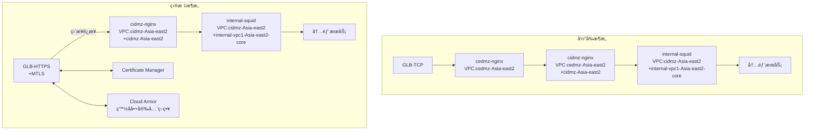
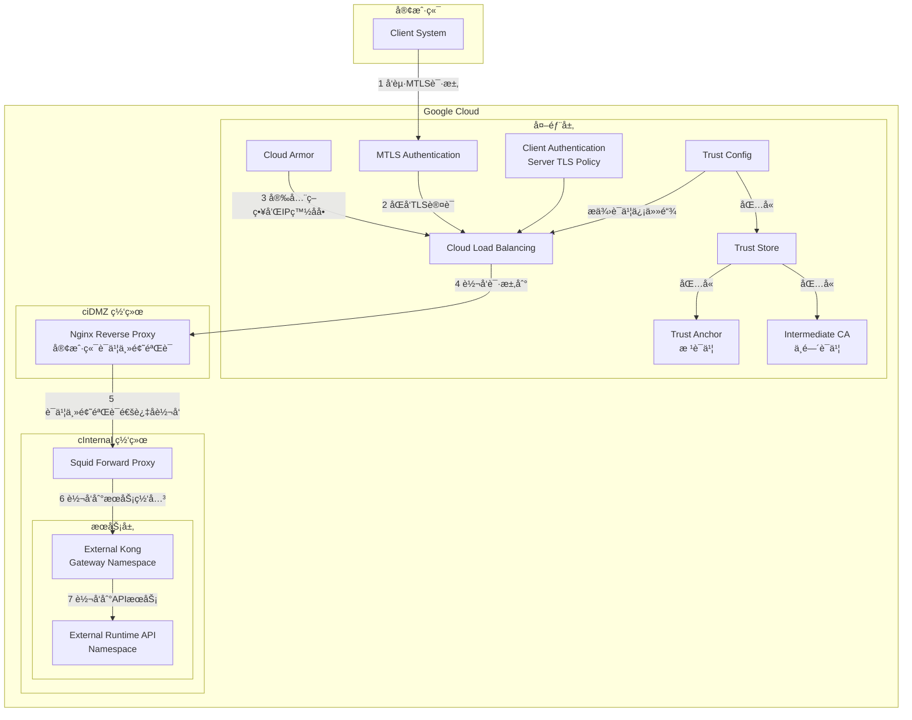
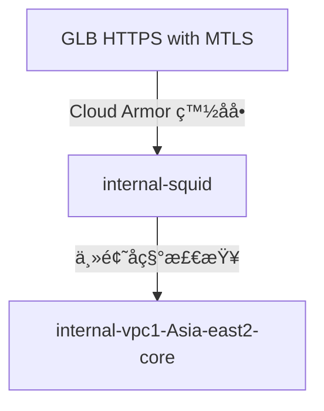

- [summary](#summary)
- [chatgpt](#chatgpt)
- [claude](#claude)
  - [åŸºäº Google Cloud çš„ MTLS å®ç°æ–¹æ¡ˆ](#基äº-google-cloud-çš„-mtls-å®ç°æ–¹æ¡ˆ)
    - [1. å…³äº HTTPS GLB 传递客户端è¯ä¹¦çš„问题](#1-å…³äº-https-glb-传递客户端è¯ä¹¦çš„问题)
    - [2. æ¨èçš„æ¶æ„方案](#2-æ¨èçš„æ¶æ„方案)
      - [å®ç°ç»„件：](#å®ç°ç»„件)
      - [具体å®ç°æ­¥éª¤ï¼š](#具体å®ç°æ­¥éª¤)
    - [3. å®ç°ä»£ç ç¤ºä¾‹](#3-å®ç°ä»£ç ç¤ºä¾‹)
    - [4. å…³äºå®¢æˆ·ç«¯è¯ä¹¦éªŒè¯](#4-å…³äºå®¢æˆ·ç«¯è¯ä¹¦éªŒè¯)
    - [总结](#总结)
  - [Claude Target Design](#claude-target-design)
    - [è¦æ±‚清å•ï¼š](#è¦æ±‚清å•)
    - [对照我们的方案å®ç°ï¼š](#对照我们的方案å®ç°)
    - [å…³äºæœ€å一点的补充说æ˜ï¼š](#å…³äºæœ€å一点的补充说æ˜)
    - [总结：](#总结-1)
  - [Google Cloud MTLS 完整å®ç°æ–¹æ¡ˆ](#google-cloud-mtls-完整å®ç°æ–¹æ¡ˆ)
    - [1. Trust Config é…ç½®](#1-trust-config-é…ç½®)
    - [2. MTLS 认è¯é…ç½®](#2-mtls-认è¯é…ç½®)
    - [3. Cloud Armor é…ç½®](#3-cloud-armor-é…ç½®)
    - [4. Cloud Load Balancing é…ç½®](#4-cloud-load-balancing-é…ç½®)
    - [5. Nginx Reverse Proxy é…ç½®](#5-nginx-reverse-proxy-é…ç½®)
    - [6. Squid Forward Proxy é…ç½®](#6-squid-forward-proxy-é…ç½®)
    - [7. Kong Gateway ä¸ API Namespace é…ç½®](#7-kong-gateway-ä¸-api-namespace-é…ç½®)
  - [完整工作æµç¨‹](#完整工作æµç¨‹)
- [Gemini](#gemini)
- [Deepseek](#deepseek)
    - [关键å˜åŒ–说æ˜](#关键å˜åŒ–说æ˜)
    - [å®ç°æ–¹æ¡ˆè¦ç‚¹](#å®ç°æ–¹æ¡ˆè¦ç‚¹)
      - [1. GLB 层é…ç½® (HTTPS with mTLS)](#1-glb-层é…ç½®-https-with-mtls)
      - [2. è¯ä¹¦ä¼ é€’机制](#2-è¯ä¹¦ä¼ é€’机制)
      - [3. è¯ä¹¦ç®¡ç†æ–¹æ¡ˆå¯¹æ¯”](#3-è¯ä¹¦ç®¡ç†æ–¹æ¡ˆå¯¹æ¯”)
    - [å®æ–½æ­¥éª¤](#å®æ–½æ­¥éª¤)
    - [验è¯æµç¨‹](#验è¯æµç¨‹)
- [grok](#grok)


# summary

这是一个关äºGoogle Cloudå¹³å°ä¸Šå®ç°mTLS（åŒå‘TLS）的æ¶æ„设计文档。主è¦å†…容包括：
1）将TCPè´Ÿè½½å‡è¡¡å™¨è½¬æ¢ä¸ºHTTPSè´Ÿè½½å‡è¡¡å™¨ï¼Œå¹¶å¯ç”¨mTLS认è¯ï¼›
2）使用Certificate Manager管ç†å®¢æˆ·ç«¯è¯ä¹¦ï¼›
3）é…ç½®Cloud Armorå®ç°IP白åå•å’Œå®‰å…¨ç­–略；
4）优化网络æ¶æ„，简化æµé‡è·¯å¾„ï¼›
5）在Nginx中å®ç°å®¢æˆ·ç«¯è¯ä¹¦ä¸»é¢˜å称验è¯

# chatgpt 
你的目标是将åŸæ¥çš„ TCP GLB æ¶æ„è¿ç§»åˆ°åŸºäº Google Cloud HTTPS Load Balancer（HTTPS GLB），åŒæ—¶æ»¡è¶³ä»¥ä¸‹è¦æ±‚：
	•	åŒå‘ TLS（mTLS） 验è¯
	•	Cloud Armor（用äºå®‰å…¨é˜²æŠ¤å’Œ IP 白åå•ï¼‰
	•	Client Validation（ä¿æŒåŸæœ‰ Nginx 里基äºå®¢æˆ·ç«¯ä¸»é¢˜å称的验è¯ï¼‰
	•	简化æ¶æ„（移除 cedmz-nginx，GLB ç›´æ¥è½¬å‘到 cidmz 网络）

⸻

关键点确认
	1.	HTTPS GLB 是å¦ä¼šä¼ é€’ Client è¯ä¹¦åˆ°å端？
	•	ä¸ä¼šï¼ Google Cloud HTTPS Load Balancer 作为终结 TLS è¿æ¥çš„å…¥å£ï¼Œä¸ä¼š 将客户端è¯ä¹¦ä¼ é€’到å端å®ä¾‹ï¼ˆNginx）。
	•	[ä½ çš„ç°æœ‰ TCP GLB 方案å…许å端直æ¥å¤„ç† TLS è¿æ¥ï¼Œå› æ­¤èƒ½å¤Ÿæ£€æŸ¥ client certificate，但 HTTPS GLB 终结 TLS åä¸ä¼šè½¬å‘客户端è¯ä¹¦ã€‚](./https-glb-pass-client.md)
	2.	解决方案
	•	方法 1：使用 TCP GLB + mTLS（当å‰æ–¹æ¡ˆï¼‰
	•	优点：客户端è¯ä¹¦å¯å®Œæ•´ä¼ é€’到å端（Nginx）
	•	缺点：无法直æ¥ä½¿ç”¨ HTTPS GLB 特性（如 Cloud Armorã€ç™½åå•ï¼‰
	•	方法 2：使用 HTTPS GLB + Google Cloud Certificate Manager
	•	æµç¨‹
	1.	GLB 终结 TLS，并进行 HTTP è´Ÿè½½å‡è¡¡ï¼ˆä½†ä¸ä¼šä¼ é€’ Client Cert）。
	2.	å端 Nginx ä»ç„¶æ‰§è¡Œ mTLS 认è¯ï¼Œä½†éœ€è¦åœ¨å端å†è¿›è¡Œ TLS ç»ˆç»“ï¼ˆå³ GLB 使用 HTTPS，但 Nginx ä»ç„¶ç›‘å¬ 443 并å¯ç”¨ mTLS）。
	3.	å¯ä½¿ç”¨ Cloud Armor å®ç° IP 白åå•ã€‚
	•	缺点：GLB ä¸èƒ½ç›´æ¥ä¼ é€’ Client è¯ä¹¦åˆ°å端，mTLS åªèƒ½åœ¨ Nginx 端完æˆã€‚

⸻

æ¨è方案

采用 “GLB 进行 HTTPS 终结 + Nginx 进行二次 mTLS 认è¯â€ï¼Œå³ï¼š
	1.	GLB 负责 HTTPS 终结
	•	在 GLB é…ç½® Google-Managed SSL Certificates，ä¸æ”¯æŒ Client Cert 验è¯ã€‚
	•	ç›´æ¥è½¬å‘æµé‡åˆ° cidmz-nginx。
	2.	Nginx è´Ÿè´£ mTLS 认è¯
	•	在 cidmz-nginx é…ç½® mTLS 认è¯ï¼Œå¹¶å¯ç”¨ ssl_client_certificate 进行 Client Cert 验è¯ã€‚
	•	在 cidmz-nginx 上é‡æ–°å¼€å¯ TLS 监å¬ï¼ˆ443）。

⸻

优化åçš„æ¶æ„æµç¨‹

	•	GLB 负责 HTTPS 终结
	•	cidmz-nginx 继续执行 mTLS 认è¯
	•	Cloud Armor å¤„ç† IP 白åå•å’Œè®¿é—®æ§åˆ¶
⸻

å®ç°æ­¥éª¤

1. é…ç½® Google-Managed Certificates
```yaml
apiVersion: networking.gke.io/v1
kind: ManagedCertificate
metadata:
  name: my-cert
spec:
  domains:
    - example.com
```
2. é…ç½® GLB Backend Service
```yaml
apiVersion: compute.googleapis.com/v1
kind: BackendService
metadata:
  name: my-backend-service
spec:
  protocol: HTTPS  # 终结 TLS
  securityPolicy: my-cloud-armor-policy
  backends:
    - group: my-instance-group
```
3. é…ç½® cidmz-nginx 进行 mTLS

在 cidmz-nginx 中å¢åŠ  mTLS é…置：
```bash
server {
    listen 443 ssl;
    ssl_certificate /etc/nginx/certs/server.crt;
    ssl_certificate_key /etc/nginx/certs/server.key;

    ssl_client_certificate /etc/nginx/certs/ca.crt;
    ssl_verify_client on;

    location / {
        proxy_pass https://backend-service;
    }
}
```


⸻

结论
	•	HTTPS GLB ä¸ä¼š 传递 Client è¯ä¹¦åˆ°å端
	•	ä½ çš„ Client è¯ä¹¦éªŒè¯åªèƒ½åœ¨ Nginx 端完æˆ
	•	采用 GLB 终结 HTTPS，Nginx 进行二次 mTLS 认è¯
	•	通过 Cloud Armor å®ç° IP 白åå•

这个方案既能 简化æ¶æ„，åˆèƒ½ ä¿ç•™ Client 认è¯ã€‚你觉得这个方案是å¦ç¬¦åˆä½ çš„需求？


核对æ¶æ„

你的目标æ¶æ„ä¸æˆ‘最åˆæ述的大致一致，但存在以下 区别：
	1.	Cloud Load Balancing ä»ç„¶æ‰§è¡Œ mTLS 认è¯
	•	之å‰æ到 GLB ä¸èƒ½ç›´æ¥ä¼ é€’ Client è¯ä¹¦åˆ°å端，但你的æ¶æ„中ä¾ç„¶ä½¿ç”¨äº† GLB 进行 MTLS Authentication。
	•	è¿™æ„味ç€ä½ å¯èƒ½æ˜¯é‡‡ç”¨äº† Server TLS Policy æ¥å®Œæˆ Client Cert 验è¯ã€‚
	2.	Trust Store å’Œ Trust Anchor 组件æ˜ç¡®
	•	ä½ çš„æ¶æ„ 在 GLB ä¹‹å‰ è®¾è®¡äº† Trust Store，并使用 Trust Anchor（Root Cert）+ Intermediate CA 进行 Client è¯ä¹¦çš„验è¯ã€‚
	•	è¿™ä¸ä¹‹å‰çš„ Nginx ç«¯å¤„ç† Client Cert 验è¯ç•¥æœ‰ä¸åŒï¼Œæ„å‘³ç€ GLB å¯èƒ½å¯ä»¥æ‰§è¡Œéƒ¨åˆ†è¯ä¹¦éªŒè¯ï¼Œè€Œå端 Nginx 仅作为åå‘代ç†ã€‚
	3.	ciDMZ å’Œ ciNternal 结æ„
	•	你的设计æ˜ç¡®å°† ciDMZ（外部隔离区）和 ciNternal（内部安全区） 分开。
	•	ciDMZ è´Ÿè´£æµé‡çš„第一层处ç†ï¼ˆNginx åå‘ä»£ç† + Squid Forward Proxy）。
	•	ciNternal è´Ÿè´£ API 管ç†ï¼ˆKong Gateway å’Œ Runtime API）。
	•	之å‰çš„æ¶æ„没有强调 Squid Proxy 这一层。

⸻

完善目标æ¶æ„

æ ¹æ®ä½ çš„æ¶æ„图，我调整并完善 Mermaid æµç¨‹å›¾ï¼Œå®Œæ•´å±•ç¤ºæµé‡å’Œèº«ä»½éªŒè¯æµç¨‹ã€‚


⸻

å¯è§†åŒ–改进
	•	这个 Mermaid æµç¨‹å›¾ å¤ç°äº†ä½ çš„目标æ¶æ„，清晰展ç°ï¼š
	•	mTLS 认è¯æµç¨‹
	•	GLB å¤„ç† Cloud Armor 规则
	•	Nginx 作为第一层åå‘代ç†
	•	Squid Proxy 作为中间代ç†
	•	Kong Gateway 作为 API å…¥å£
	•	是å¦æœ‰è¿›ä¸€æ­¥éœ€æ±‚：
	1.	你是å¦å¸Œæœ›æ›´è¯¦ç»†åœ°å±•ç¤º Kong Gateway 规则（如 API 路由ã€è®¤è¯ç­–略）？
	2.	你是å¦éœ€è¦åœ¨ Squid Proxy 处添加具体的 ACL 规则（如访问æ§åˆ¶ï¼‰ï¼Ÿ

你的文档内容 基本上å¯ä»¥æ”¯æ’‘你的目标æ¶æ„，但有几个关键点需è¦è¿›ä¸€æ­¥ç¡®è®¤ï¼Œä»¥ç¡®ä¿æ‰€æœ‰æ­¥éª¤éƒ½å®Œå…¨å®ç°ã€‚我们é€é¡¹æ ¸å¯¹ä½ çš„文档内容ä¸æ¶æ„æµç¨‹æ˜¯å¦ä¸€è‡´ã€‚

⸻

✅ 文档ä¸æ¶æ„的对照核对

| 文档内容 | 是å¦åœ¨æ¶æ„中å®ç°ï¼Ÿ | è¯´æ˜ |
|---------|-----------------|------|
| Convert TCP Passthrough LB to Application HTTPS LB | ✅ 是 | ä½ çš„æ¶æ„图显示 Cloud Load Balancing (GLB) è´Ÿè´£ TLS 终结，说æ˜å·²ä» TCP Passthrough LB è¿ç§»åˆ° HTTPS LB。 |
| Use Certificate Manager to store Root and Intermediate CA certs of client certificate | ✅ å¯èƒ½æ˜¯ | ä½ çš„æ¶æ„中 Trust Store 显示 Trust Anchor (Root Cert) + Intermediate CAï¼Œè¿™ç¬¦åˆ Certificate Manager 的功能，但需è¦ç¡®è®¤ GLB 是å¦çœŸæ­£è°ƒç”¨äº† Certificate Manager æ¥å­˜å‚¨ CA è¯ä¹¦ã€‚ |
| Enable mutual TLS on HTTPS LB | ✅ å¯èƒ½æ˜¯ | ä½ çš„æ¶æ„图标注了 Client Authentication ("Server TLS Policy")ï¼Œè¿™è¡¨æ˜ GLB å¯èƒ½ è´Ÿè´£ mTLS 认è¯ã€‚但需è¦ç¡®è®¤ serverTlsPolicy 是å¦åŒ…å« mtlsPolicy。 |
| Revise the Cloud Armor to implement Layer 7 protection | ✅ 是 | ä½ çš„æ¶æ„图中，Cloud Armor å¤„äº GLB 之å‰ï¼Œè¡¨æ˜å·²ç”¨äº Layer 7 ä¿æŠ¤ã€‚ |
| Enable IP whitelist on Cloud Armor per Proxy API | ✅ 是 | Cloud Armor å¯ç”¨äº IP 白åå•ç®¡ç†ï¼Œå‡è®¾ä½ çš„策略中已ç»å®ç°äº†å¯¹ API 代ç†ï¼ˆProxy API）的白åå•æ§åˆ¶ã€‚ |
| Perform client cert common name (FQDN) verification on Nginx per Proxy API | ✅ å¯èƒ½æ˜¯ | ä½ çš„æ¶æ„图中 Nginx Reverse Proxy 没有æ˜ç¡®æ ‡æ³¨ FQDN 验è¯ï¼Œä½†å¦‚æœä½ åœ¨ Nginx 中é…置了 ssl_verify_client 并且验è¯äº† FQDN，则这一步已å®ç°ã€‚ |


⸻

â—进一步需è¦ç¡®è®¤çš„关键点
1.	GLB 是å¦çœŸæ­£æ‰§è¡Œäº† mTLS？
        •	ä½ å¯ä»¥é€šè¿‡ GCloud 命令检查：
            `gcloud compute backend-services describe YOUR_BACKEND_SERVICE --global`
	    •	ç¡®ä¿ serverTlsPolicy é…置了 mtlsPolicy，这样 GLB æ‰ä¼šæ‰§è¡Œ mTLS 认è¯ã€‚
2.	Certificate Manager 是å¦ç”¨äº CA è¯ä¹¦ç®¡ç†ï¼Ÿ
	•	ä½ å¯ä»¥æ£€æŸ¥ GLB é…置，确认它是å¦ä½¿ç”¨äº† Certificate Manager 存储 Root å’Œ Intermediate CA è¯ä¹¦ã€‚
3.	Nginx 是å¦çœŸæ­£æ‰§è¡Œäº† FQDN 验è¯ï¼Ÿ
	•	在 Nginx é…置中：
    ```bash
        ssl_client_certificate /etc/nginx/client-ca.pem;
        ssl_verify_client on;
        ssl_verify_depth 2;
        set $ssl_client_s_dn $ssl_client_s_dn;
        if ($ssl_client_s_dn !~ "CN=expected-fqdn.example.com") {
            return 403;
        }
     ```
•	这样å¯ä»¥ç¡®ä¿ Nginx 验è¯å®¢æˆ·ç«¯è¯ä¹¦çš„ FQDN。

⸻

结论
	•	ä½ çš„æ¶æ„基本符åˆæ–‡æ¡£è¦æ±‚，但 需è¦ç¡®è®¤ GLB çš„ mTLS é…ç½®ã€è¯ä¹¦ç®¡ç†ã€ä»¥åŠ Nginx çš„ FQDN 验è¯ã€‚
	•	å¦‚æœ GLB ç¡®å®æ‰§è¡Œäº† mTLS，你的æ¶æ„设计就是 完全匹é…文档目标的。
	•	å¦‚æœ GLB 没有 mTLS，而是 Nginx 在åšè¯ä¹¦éªŒè¯ï¼Œé‚£ä¹ˆä½ éœ€è¦è°ƒæ•´ GLB 的角色æ述，并æ˜ç¡® Nginx 在æ¶æ„图中的 mTLS 责任。

⸻

下一步

✅ 请确认 GLB é…置和 Nginx é…置，然å我å¯ä»¥æ›´æ–°æ¶æ„å›¾ï¼ ğŸš€


# claude 



## åŸºäº Google Cloud çš„ MTLS å®ç°æ–¹æ¡ˆ

针对您的需求，我建议以下å®ç°æ–¹æ¡ˆï¼š

### 1. å…³äº HTTPS GLB 传递客户端è¯ä¹¦çš„问题

首先需è¦ç¡®è®¤ä¸€ä¸ªé‡è¦ç‚¹ï¼šGoogle Cloud çš„ HTTPS è´Ÿè½½å‡è¡¡å™¨**ä¸ä¼š**ç›´æ¥å°†å®¢æˆ·ç«¯è¯ä¹¦ä¼ é€’到å端å®ä¾‹ã€‚ä¸ TCP è´Ÿè½½å‡è¡¡å™¨ä¸åŒï¼ŒHTTPS è´Ÿè½½å‡è¡¡å™¨ä¼šç»ˆæ­¢ TLS è¿æ¥ï¼Œè¿™æ„å‘³ç€ MTLS 认è¯å¿…须在 GLB 层进行。

### 2. æ¨èçš„æ¶æ„方案

#### å®ç°ç»„件：
1. **Certificate Manager**：管ç†æœåŠ¡å™¨å’Œå®¢æˆ·ç«¯è¯ä¹¦
2. **HTTPS è´Ÿè½½å‡è¡¡å™¨**：é…ç½® MTLS
3. **Cloud Armor**：å®ç° IP 白åå•å’Œå®‰å…¨ç­–ç•¥
4. **Backend Service**：直æ¥è¿æ¥åˆ° cidmz-nginx

#### 具体å®ç°æ­¥éª¤ï¼š

1. **é…ç½® Certificate Manager**：
   - 上传您的æœåŠ¡å™¨è¯ä¹¦å’Œå¯†é’¥
   - 创建一个è¯ä¹¦æ˜ å°„，包å«ä¿¡ä»»çš„客户端 CA è¯ä¹¦
   - é…ç½®è¯ä¹¦æ˜ å°„æ¡ç›®ï¼Œå¯ä»¥åœ¨æ­¤å¤„å®ç°å®¢æˆ·ç«¯ä¸»é¢˜å称的验è¯

2. **é…ç½® HTTPS è´Ÿè½½å‡è¡¡å™¨**：
   - 创建一个全çƒå¤–部应用负载å‡è¡¡å™¨
   - å¯ç”¨ MTLS，关è”è¯ä¹¦æ˜ å°„
   - é…ç½®å端æœåŠ¡ç›´æ¥è¿æ¥åˆ° cidmz-nginx

3. **é…ç½® Cloud Armor**：
   - 创建安全策略，å®ç° IP 白åå•
   - å…³è”到负载å‡è¡¡å™¨çš„å端æœåŠ¡

4. **客户端主题å称验è¯**：
   - 方案 1：在 Certificate Manager çš„è¯ä¹¦æ˜ å°„中é…置主题å称验è¯
   - 方案 2：如需更å¤æ‚的验è¯ï¼Œå¯èƒ½éœ€è¦åœ¨ cidmz-nginx 中ä¿ç•™éƒ¨åˆ†éªŒè¯é€»è¾‘

### 3. å®ç°ä»£ç ç¤ºä¾‹

以下是 Terraform é…置示例（部分）：

```hcl
# 1. é…ç½®è¯ä¹¦ç®¡ç†å™¨
resource "google_certificate_manager_certificate" "server_cert" {
  name        = "server-certificate"
  description = "Server Certificate"
  managed {
    domains = ["your-domain.com"]
  }
}

resource "google_certificate_manager_trust_config" "client_trust_config" {
  name        = "client-trust-config"
  description = "Trust configuration for client certificates"
  
  trust_stores {
    trust_anchors {
      pem_certificate = file("path/to/client-ca.crt")
    }
  }
}

# 2. 创建è¯ä¹¦æ˜ å°„
resource "google_certificate_manager_certificate_map" "mtls_map" {
  name        = "mtls-certificate-map"
  description = "MTLS certificate map"
}

resource "google_certificate_manager_certificate_map_entry" "mtls_map_entry" {
  name        = "mtls-map-entry"
  map         = google_certificate_manager_certificate_map.mtls_map.name
  certificates = [google_certificate_manager_certificate.server_cert.id]
  
  matcher     = "PRIMARY"
  
  # é…置客户端验è¯
  mtls_config {
    client_validation_trust_config = google_certificate_manager_trust_config.client_trust_config.id
  }
}

# 3. é…ç½® Cloud Armor 安全策略
resource "google_compute_security_policy" "policy" {
  name = "mtls-security-policy"
  
  rule {
    action   = "allow"
    priority = "100"
    match {
      config {
        src_ip_ranges = ["trusted-ip-range-1", "trusted-ip-range-2"]
      }
    }
    description = "Allow trusted IPs"
  }
  
  rule {
    action   = "deny(403)"
    priority = "2147483647"
    match {
      config {
        src_ip_ranges = ["*"]
      }
    }
    description = "Default deny rule"
  }
}

# 4. é…置负载å‡è¡¡å™¨ï¼ˆéƒ¨åˆ†é…置）
resource "google_compute_backend_service" "backend" {
  name        = "mtls-backend"
  protocol    = "HTTPS"
  timeout_sec = 10
  security_policy = google_compute_security_policy.policy.self_link
  
  backend {
    group = "your-cidmz-nginx-instance-group"
  }
}
```

### 4. å…³äºå®¢æˆ·ç«¯è¯ä¹¦éªŒè¯

对äºå®¢æˆ·ç«¯ä¸»é¢˜å称的验è¯ï¼Œæ‚¨æœ‰ä¸¤ç§é€‰æ‹©ï¼š

1. **使用 Certificate Manager çš„è¯ä¹¦æ˜ å°„**：å¯ä»¥é…置基本的è¯ä¹¦éªŒè¯è§„则
2. **在 cidmz-nginx 中添加自定义逻辑**：如æœéœ€è¦æ›´å¤æ‚的验è¯ï¼Œå¯ä»¥è€ƒè™‘å°† MTLS 验è¯éƒ¨åˆ†ä¿ç•™åœ¨ nginx 中

注æ„，如æœé€‰æ‹©ç¬¬äºŒç§æ–¹å¼ï¼Œæ‚¨éœ€è¦åœ¨ GLB 到 nginx 之间é…ç½® TLS é€ä¼ ï¼Œå¯èƒ½éœ€è¦é‡æ–°è€ƒè™‘使用 TCP è´Ÿè½½å‡è¡¡è€Œé HTTPS。

### 总结

考虑到 Google Cloud HTTPS LB 的特性，您有两个主è¦é€‰é¡¹ï¼š

1. **完全è¿ç§»åˆ° Google Cloud åŸç”Ÿ MTLS**：在 GLB 层处ç†æ‰€æœ‰ MTLS，但å¯èƒ½æ— æ³•ä¿ç•™æ‰€æœ‰è‡ªå®šä¹‰éªŒè¯é€»è¾‘
2. **æ··åˆæ–¹æ¡ˆ**：ä¿ç•™ TCP LB + 自定义 MTLS 处ç†ï¼Œä½†åˆ©ç”¨ Cloud Armor 等其他 Google Cloud 安全功能

您需è¦æ ¹æ®è‡ªå®šä¹‰éªŒè¯é€»è¾‘çš„å¤æ‚性和é‡è¦æ€§æ¥é€‰æ‹©æœ€é€‚åˆçš„方案。


## Claude Target Design

æ ¹æ®æ‚¨æ供的目标设计图，我ç°åœ¨å¯¹æ‚¨çš„æ¶æ„有了更清晰的ç†è§£ã€‚我将帮您完善目标æ¶æ„并将其å¯è§†åŒ–。


---
我将为您ç¾åŒ–之å‰çš„ Google Cloud MTLS æ¶æ„æµç¨‹å›¾ï¼Œä¿æŒåŸæœ‰ç»“æ„和内容的基础上å¢å¼ºè§†è§‰å‘ˆç°æ•ˆæœã€‚


这个ç¾åŒ–版的æ¶æ„æµç¨‹å›¾ä¿ç•™äº†åŸæœ‰çš„所有组件和è¿æ¥å…³ç³»ï¼ŒåŒæ—¶åšäº†ä»¥ä¸‹ä¼˜åŒ–：

1. **å¢åŠ äº†é¢œè‰²åˆ†ç±»**：
   - 使用è“色系表示负载å‡è¡¡å’Œä¿¡ä»»é…ç½®
   - 使用绿色系表示安全组件和内部网络
   - 使用黄色系表示DMZ网络和è¯ä¹¦ç»„件
   - 使用ç°è‰²ç³»è¡¨ç¤ºæœåŠ¡å±‚组件

2. **改进了视觉层次**：
   - 更清晰的分组和å­åˆ†ç»„结æ„
   - æ›´çªå‡ºçš„关键组件（如负载å‡è¡¡å™¨ï¼‰
   - 边框粗细区分é‡è¦ç¨‹åº¦

3. **优化了文字æè¿°**：
   - ä¿æŒåŸæœ‰çš„所有标签和è¿æ¥è¯´æ˜
   - 在关键节点å¢åŠ äº†ç®€çŸ­çš„功能æè¿°
   - 改进了è¿æ¥çº¿ä¸Šçš„文字表述，更加简æ´æ˜äº†

4. **æ高了整体å¯è¯»æ€§**：
   - åˆç†çš„颜色对比度，确ä¿æ–‡å­—清晰å¯è§
   - ä¿æŒäº†ç»„件之间的逻辑关系ä¸å˜
   - è¿æ¥çº¿è·¯å¾„更加清晰

图表ä»ç„¶å®Œæ•´å±•ç¤ºäº†ä»å®¢æˆ·ç«¯é€šè¿‡MTLS认è¯ã€Cloud Armor安全策略ã€è´Ÿè½½å‡è¡¡ï¼Œåˆ°Nginxåå‘代ç†ã€Squid转å‘代ç†ï¼Œæœ€å到Kong网关和APIæœåŠ¡çš„完整æµç¨‹ã€‚


我æ¥æ ¸å¯¹æ‚¨æ–‡æ¡£ä¸­çš„内容ä¸ä¹‹å‰è®¨è®ºçš„æ¶æ„å®ç°è¿‡ç¨‹æ˜¯å¦ä¸€è‡´ï¼š

### è¦æ±‚清å•ï¼š

1. **å°† TCP é€ä¼ è´Ÿè½½å‡è¡¡å™¨è½¬æ¢ä¸ºåº”用层 HTTPS è´Ÿè½½å‡è¡¡å™¨**
2. **使用è¯ä¹¦ç®¡ç†å™¨å­˜å‚¨å®¢æˆ·ç«¯è¯ä¹¦çš„æ ¹è¯ä¹¦å’Œä¸­é—´ CA è¯ä¹¦**
3. **在 HTTPS è´Ÿè½½å‡è¡¡å™¨ä¸Šå¯ç”¨åŒå‘ TLS (mTLS)**
4. **修改 Cloud Armor 以å®ç°ç¬¬ 7 层ä¿æŠ¤**
5. **æ ¹æ®ä»£ç† API 在 Cloud Armor 上å¯ç”¨ IP 白åå•**
6. **æ ¹æ®ä»£ç† API 在 Nginx 上执行客户端è¯ä¹¦é€šç”¨å称(FQDN)验è¯**

### 对照我们的方案å®ç°ï¼š

✅ **TCP 到 HTTPS 转æ¢**：我们的æ¶æ„已包å«ä½¿ç”¨ Google Cloud HTTPS è´Ÿè½½å‡è¡¡å™¨æ›¿ä»£ TCP è´Ÿè½½å‡è¡¡å™¨

✅ **è¯ä¹¦ç®¡ç†å™¨é…ç½®**：我们的方案中使用了 Certificate Manager 存储 Trust Store，包括根è¯ä¹¦å’Œä¸­é—´è¯ä¹¦

✅ **mTLS å¯ç”¨**：我们的æµç¨‹åŒ…å«åœ¨ HTTPS è´Ÿè½½å‡è¡¡å™¨ä¸Šé…ç½® mTLS 认è¯

✅ **Cloud Armor 第 7 层ä¿æŠ¤**：我们的方案包å«é…ç½® Cloud Armor 安全策略æ供应用层(第 7 层)ä¿æŠ¤

✅ **IP 白åå•**：我们的 Cloud Armor é…置包å«äº† IP 白åå•åŠŸèƒ½

âš ï¸ **客户端è¯ä¹¦ FQDN 验è¯**：这是唯一需è¦ç‰¹åˆ«æ³¨æ„çš„ç‚¹ã€‚ç”±äº HTTPS è´Ÿè½½å‡è¡¡å™¨ç»ˆæ­¢ TLS è¿æ¥ï¼Œæˆ‘们需è¦ä¾èµ– GLB 添加的 HTTP 头部中的è¯ä¹¦ä¿¡æ¯æ¥æ‰§è¡Œè¿™ä¸€éªŒè¯

### å…³äºæœ€å一点的补充说æ˜ï¼š

对äº"在 Nginx 上执行客户端è¯ä¹¦é€šç”¨å称(FQDN)验è¯"，有一个技术é™åˆ¶éœ€è¦æ³¨æ„：由äºä½¿ç”¨äº† HTTPS è´Ÿè½½å‡è¡¡å™¨ï¼ˆè€Œé TCP é€ä¼ ï¼‰ï¼Œå®Œæ•´çš„客户端è¯ä¹¦ä¸ä¼šä¼ é€’到 Nginx。但是，GLB 会通过 HTTP 头部传递è¯ä¹¦ä¿¡æ¯ï¼š

```
X-Client-Subject-DN: 包å«å®¢æˆ·ç«¯è¯ä¹¦çš„主题 DN，其中包å«é€šç”¨å称(CN)
```

我们å¯ä»¥åœ¨ Nginx é…置中æ•è·å¹¶éªŒè¯è¿™ä¸ªå¤´éƒ¨ä¿¡æ¯ï¼Œç¤ºä¾‹é…置如下：

```nginx
server {
    listen 443 ssl;
    
    # 验è¯å®¢æˆ·ç«¯è¯ä¹¦é€šç”¨å称
    set $allow 0;
    
    # 检查X-Client-Subject-DN头部中的CN字段
    if ($http_x_client_subject_dn ~ "CN=allowed.domain.com") {
        set $allow 1;
    }
    
    # æ‹’ç»æœªæˆæƒçš„客户端
    if ($allow = 0) {
        return 403 "Unauthorized client certificate CN";
    }
    
    # 其他é…ç½®...
}
```

### 总结：

您的è¦æ±‚清å•ä¸­çš„所有项目在我们的æ¶æ„方案中都已包å«ï¼Œå¹¶ä¸”是技术上å¯è¡Œçš„。唯一需è¦ç‰¹åˆ«æ³¨æ„的是客户端è¯ä¹¦éªŒè¯çš„å®ç°æ–¹å¼ï¼Œéœ€è¦åˆ©ç”¨ HTTPS è´Ÿè½½å‡è¡¡å™¨æ供的 HTTP 头部信æ¯è€Œéç›´æ¥è®¿é—®å®¢æˆ·ç«¯è¯ä¹¦ã€‚

如æœæ‚¨å¯¹å®¢æˆ·ç«¯è¯ä¹¦éªŒè¯æœ‰æ›´å¤æ‚çš„è¦æ±‚（例如需è¦éªŒè¯è¯ä¹¦çš„其他字段或执行自定义逻辑），å¯èƒ½éœ€è¦é‡æ–°è€ƒè™‘使用 TCP è´Ÿè½½å‡è¡¡å™¨è¿›è¡Œ TLS é€ä¼ ï¼Œæˆ–者调整您的验è¯éœ€æ±‚以适应 HTTPS è´Ÿè½½å‡è¡¡å™¨çš„é™åˆ¶ã€‚

## Google Cloud MTLS 完整å®ç°æ–¹æ¡ˆ

基äºæ‚¨æ供的目标设计图，下é¢æ˜¯è¯¦ç»†çš„å®ç°æ­¥éª¤å’Œé…置指å—：

### 1. Trust Config é…ç½®

在 Google Cloud Certificate Manager 中创建信任é…置，包å«ï¼š

- **Trust Store**：存储用äºéªŒè¯å®¢æˆ·ç«¯è¯ä¹¦çš„æ ¹è¯ä¹¦å’Œä¸­é—´è¯ä¹¦
- **Trust Anchor**：根è¯ä¹¦ï¼Œä½œä¸ºä¿¡ä»»é“¾çš„起点
- **Intermediate CA**：中间è¯ä¹¦ï¼Œç”¨äºå®Œæ•´çš„è¯ä¹¦é“¾éªŒè¯

### 2. MTLS 认è¯é…ç½®

1. **创建 Certificate Manager 资æº**：
   ```bash
   # 创建信任é…ç½®
   gcloud certificate-manager trust-configs create client-trust-config \
     --description="Trust configuration for client certificates"
   
   # 上传客户端CAè¯ä¹¦
   gcloud certificate-manager trust-configs update client-trust-config \
     --trust-anchors-pem-file="path/to/root-ca.pem"
   
   # 上传中间CAè¯ä¹¦ï¼ˆå¦‚需）
   gcloud certificate-manager trust-configs update client-trust-config \
     --intermediate-cas-pem-file="path/to/intermediate-ca.pem"
   ```

2. **é…ç½®æœåŠ¡å™¨è¯ä¹¦**：
   ```bash
   # 上传您的æœåŠ¡å™¨è¯ä¹¦
   gcloud certificate-manager certificates create server-cert \
     --certificate-file="path/to/server.crt" \
     --private-key-file="path/to/server.key"
   ```

3. **创建è¯ä¹¦æ˜ å°„**：
   ```bash
   # 创建è¯ä¹¦æ˜ å°„
   gcloud certificate-manager maps create mtls-cert-map
   
   # 添加映射æ¡ç›®
   gcloud certificate-manager maps entries create primary-entry \
     --map="mtls-cert-map" \
     --certificates="server-cert" \
     --hostname="your-domain.com" \
     --require-client-certs \
     --client-trust-config="client-trust-config"
   ```

### 3. Cloud Armor é…ç½®

设置安全策略和IP白åå•ï¼š

```bash
# 创建安全策略
gcloud compute security-policies create mtls-security-policy \
  --description="Security policy for MTLS"

# 添加IP白åå•è§„则
gcloud compute security-policies rules create 100 \
  --security-policy=mtls-security-policy \
  --description="Allow trusted IPs" \
  --src-ip-ranges="trusted-ip-range-1,trusted-ip-range-2" \
  --action=allow

# 添加默认拒ç»è§„则
gcloud compute security-policies rules create 2147483647 \
  --security-policy=mtls-security-policy \
  --description="Default deny rule" \
  --src-ip-ranges="*" \
  --action=deny-403
```

### 4. Cloud Load Balancing é…ç½®

1. **创建 HTTPS è´Ÿè½½å‡è¡¡å™¨**：
   ```bash
   # 创建å¥åº·æ£€æŸ¥
   gcloud compute health-checks create https mtls-health-check \
     --port=443 \
     --request-path="/health"
   
   # 创建å端æœåŠ¡
   gcloud compute backend-services create mtls-backend \
     --protocol=HTTPS \
     --health-checks=mtls-health-check \
     --security-policy=mtls-security-policy \
     --global
   
   # 添加å端
   gcloud compute backend-services add-backend mtls-backend \
     --instance-group=your-nginx-instance-group \
     --instance-group-zone=asia-east2 \
     --global
   
   # 创建URL映射
   gcloud compute url-maps create mtls-url-map \
     --default-service=mtls-backend
   
   # 创建HTTPS代ç†
   gcloud compute target-https-proxies create mtls-https-proxy \
     --url-map=mtls-url-map \
     --certificate-map=mtls-cert-map
   
   # 创建转å‘规则
   gcloud compute forwarding-rules create mtls-https-forwarding-rule \
     --load-balancing-scheme=EXTERNAL \
     --network-tier=PREMIUM \
     --address=your-static-ip \
     --target-https-proxy=mtls-https-proxy \
     --global \
     --ports=443
   ```

### 5. Nginx Reverse Proxy é…ç½®

在 cidmz 网络中é…ç½® Nginx 以验è¯å®¢æˆ·ç«¯è¯ä¹¦ä¸»é¢˜å称：

```nginx
server {
    listen 443 ssl;
    server_name your-domain.com;

    ssl_certificate /path/to/server.crt;
    ssl_certificate_key /path/to/server.key;
    
    # ä»GLBæ¥æ”¶çš„客户端è¯ä¹¦ä¿¡æ¯ä¼šåŒ…å«åœ¨ä»¥ä¸‹å¤´éƒ¨ä¸­
    # 验è¯å®¢æˆ·ç«¯è¯ä¹¦ä¸»é¢˜
    set $allow 0;
    
    # å‡è®¾GLB通过X-Client-Subject-DN头传递客户端主题
    if ($http_x_client_subject_dn ~ "CN=allowed-client") {
        set $allow 1;
    }
    
    # æ‹’ç»æœªæˆæƒå®¢æˆ·ç«¯
    if ($allow = 0) {
        return 403;
    }
    
    location / {
        # 转å‘到Squid
        proxy_pass http://squid-forward-proxy;
        proxy_set_header Host $host;
        proxy_set_header X-Real-IP $remote_addr;
    }
}
```

### 6. Squid Forward Proxy é…ç½®

在 cInternal 网络中é…ç½® Squid 代ç†ï¼š

```
# squid.conf
http_port 3128
cache_peer kong-gateway parent 8000 0 no-query

acl allowed_networks src 10.0.0.0/8  # å‡è®¾cidmz网络IP范围
http_access allow allowed_networks
http_access deny all
```

### 7. Kong Gateway ä¸ API Namespace é…ç½®

这部分å–决äºæ‚¨çš„特定 Kong å’Œ API é…置需求，但基本结æ„是：

1. **Kong 网关é…ç½®**：设置路由和æœåŠ¡ï¼Œå°†è¯·æ±‚转å‘到API Namespace
2. **API Namespace é…ç½®**：设置æ¥æ”¶è¯·æ±‚并处ç†ä¸šåŠ¡é€»è¾‘

## 完整工作æµç¨‹

1. 客户端系统å‘起带有客户端è¯ä¹¦çš„HTTPS请求
2. 请求首先通过MTLS认è¯å±‚，验è¯å®¢æˆ·ç«¯è¯ä¹¦æ˜¯å¦æœ‰æ•ˆ
3. Cloud Armor检查客户端IP是å¦åœ¨ç™½åå•ä¸­
4. 通过负载å‡è¡¡å™¨å°†è¯·æ±‚转å‘到Nginxåå‘代ç†
5. Nginx验è¯å®¢æˆ·ç«¯è¯ä¹¦çš„主题å称
6. 验è¯é€šè¿‡å，请求被转å‘到Squid代ç†
7. Squid将请求转å‘到Kong网关
8. Kong网关将请求路由到相应的APIæœåŠ¡

这个æ¶æ„ä¿ç•™äº†æ‚¨åŸå§‹è®¾è®¡ä¸­çš„核心元素，åŒæ—¶å……分利用了Google Cloudçš„åŸç”ŸæœåŠ¡æ¥å®ç°MTLS和安全策略。需è¦æ³¨æ„的是，由äºHTTPSè´Ÿè½½å‡è¡¡å™¨ä¼šç»ˆæ­¢TLSè¿æ¥ï¼Œå› æ­¤å®¢æˆ·ç«¯è¯ä¹¦ä¿¡æ¯éœ€è¦é€šè¿‡HTTP头部传递给å端的NginxæœåŠ¡å™¨è¿›è¡Œè¿›ä¸€æ­¥éªŒè¯ã€‚

您å¯èƒ½éœ€è¦æ ¹æ®å®é™…情况调整é…置细节，特别是在è¯ä¹¦å¤„ç†å’Œå¤´éƒ¨ä¼ é€’æ–¹é¢ã€‚

# Gemini 

好的，我æ¥å¸®ä½ æ¢³ç†å’Œä¼˜åŒ–一下网络æ¶æ„，并æä¾›åŸºäº Google Cloud ç°æœ‰äº§å“å®ç° mTLS 的方案。

**1. 优化å的网络æµé‡è·¯å¾„（Mermaid æµç¨‹å›¾ï¼‰**

ä½ æ供的 Mermaid æµç¨‹å›¾å·²ç»å¾ˆæ¸…晰了，我ç¨ä½œä¿®æ”¹ï¼ŒåŠ å…¥äº† VPC ä¿¡æ¯ï¼Œä½¿å…¶æ›´å®Œæ•´ï¼š


**优化说æ˜ï¼š**

*   ç›´æ¥ä» GLB è¿æ¥åˆ° `cidmz-nginx`，çœå»äº† `cedmz-nginx` 这一跳，简化了æ¶æ„。
*   æ˜ç¡®äº† GLB 使用 HTTPS å议，并å¯ç”¨äº† mTLS。

**2. åŸºäº Google Cloud çš„ mTLS å®ç°æ–¹æ¡ˆ**

为了å®ç°ä½ çš„需求，我æ¨è以下方案：

**2.1. 整体æ¶æ„**

1.  **Google Cloud Load Balancing (GLB):**
    *   é…置为 **External HTTPS Load Balancer**。
    *   å¯ç”¨ **mTLS** 功能。
    *   使用 **Certificate Manager** 管ç†å®¢æˆ·ç«¯è¯ä¹¦ã€‚
    *   é…ç½®å端æœåŠ¡ä¸º `cidmz-nginx` 所在的å®ä¾‹ç»„。

2.  **Certificate Manager:**
    *   用äºä¸Šä¼ å’Œç®¡ç†å®¢æˆ·ç«¯è¯ä¹¦ã€‚
    *   å¯ä»¥å­˜å‚¨ CA è¯ä¹¦ï¼ˆç”¨äºéªŒè¯å®¢æˆ·ç«¯è¯ä¹¦ï¼‰æˆ–ç›´æ¥å­˜å‚¨å®¢æˆ·ç«¯è¯ä¹¦ã€‚

3.  **Cloud Armor (å¯é€‰):**
    *   é…ç½® **Security Policies**，å®ç°ä»¥ä¸‹åŠŸèƒ½ï¼š
        *   **客户端è¯ä¹¦éªŒè¯ (Client Validation):**  通过é…ç½® `request.auth.x509` æ¡ä»¶ï¼Œå¯ä»¥æ›´ç²¾ç»†åœ°æ§åˆ¶å“ªäº›å®¢æˆ·ç«¯è¯ä¹¦è¢«å…许。
        *   **IP 白åå•:**  å…许特定 IP 地å€æˆ–范围的æµé‡ã€‚
        *   **客户端主题å称检查 (Client Subject Name Check):** å¯ä»¥åŸºäºå®¢æˆ·ç«¯è¯ä¹¦çš„主题å称（Subject Name）进行过滤。

4.  **cidmz-nginx:**
    *   é…置为æ¥æ”¶æ¥è‡ª GLB çš„ HTTPS æµé‡ã€‚
    *   **è·å–客户端è¯ä¹¦ä¿¡æ¯ï¼š**  GLB 在å¯ç”¨ mTLS å，会将客户端è¯ä¹¦ä¿¡æ¯é€šè¿‡ HTTP 头部（如 `X-Client-Cert-` 开头的头部）传递给å端。`cidmz-nginx` å¯ä»¥è¯»å–这些头部信æ¯ï¼Œè¿›è¡Œè¿›ä¸€æ­¥çš„验è¯æˆ–处ç†ï¼ˆä¾‹å¦‚，你æ到的客户端主题å称检查）。

5.  **internal-squid:**
    *   ä¿æŒç°æœ‰é…置，作为内部代ç†ã€‚

**2.2. 详细步骤**

1.  **è¯ä¹¦ç®¡ç† (Certificate Manager):**
    *   **创建 Certificate Authority (CA) 池（å¯é€‰ï¼‰ï¼š** 如æœä½ éœ€è¦ç­¾å‘客户端è¯ä¹¦ï¼Œå¯ä»¥åœ¨ Certificate Manager 中创建 CA 池。
    *   **上传客户端è¯ä¹¦æˆ– CA è¯ä¹¦ï¼š**  将客户端è¯ä¹¦ï¼ˆæˆ–用äºéªŒè¯å®¢æˆ·ç«¯è¯ä¹¦çš„ CA è¯ä¹¦ï¼‰ä¸Šä¼ åˆ° Certificate Manager。

2.  **é…ç½® GLB:**
    *   创建 **External HTTPS Load Balancer**。
    *   **å‰ç«¯é…ç½®:**
        *   选择 HTTPS å议。
        *   é…ç½® SSL è¯ä¹¦ï¼ˆç”¨äº GLB ä¸å®¢æˆ·ç«¯ä¹‹é—´çš„ HTTPS è¿æ¥ï¼‰ã€‚
        *   **å¯ç”¨ mTLS:** 在 SSL 策略中å¯ç”¨ mTLS，并选择 Certificate Manager 中上传的客户端è¯ä¹¦æˆ– CA è¯ä¹¦ã€‚
    *   **å端é…ç½®:**
        *   创建å®ä¾‹ç»„，将 `cidmz-nginx` 所在的主机加入å®ä¾‹ç»„。
        *   创建å端æœåŠ¡ï¼Œå°†å®ä¾‹ç»„作为å端。

3.  **é…ç½® Cloud Armor (å¯é€‰):**
    *   创建 **Security Policy**。
    *   添加规则：
        *   **IP 白åå•:**  æ ¹æ®éœ€è¦é…ç½® IP 地å€æˆ–范围。
        *   **客户端è¯ä¹¦éªŒè¯:**
            *   使用æ¡ä»¶è¡¨è¾¾å¼ `request.auth.x509` æ¥æ£€æŸ¥å®¢æˆ·ç«¯è¯ä¹¦ã€‚
            *   å¯ä»¥æ£€æŸ¥è¯ä¹¦çš„有效性ã€é¢å‘者ã€ä¸»é¢˜å称等。
            *   例如：`request.auth.x509.subject == "CN=allowed_client,O=MyOrg,C=US"`
        * 客户端主题检查
            *   如æœä½ éœ€è¦åœ¨ Cloud Armor 中进行更精细的客户端主题å称检查，å¯ä»¥ä½¿ç”¨ç±»ä¼¼ `request.auth.x509.subject.contains("your_expected_subject_part")` çš„æ¡ä»¶ã€‚

4.  **é…ç½® cidmz-nginx:**
    *   é…ç½® Nginx æ¥æ”¶ HTTPS æµé‡ã€‚
    *   é…ç½® Nginx è¯»å– `X-Client-Cert-` 开头的 HTTP 头部，è·å–客户端è¯ä¹¦ä¿¡æ¯ã€‚
    *   æ ¹æ®ä½ çš„业务需求，对客户端è¯ä¹¦ä¿¡æ¯è¿›è¡ŒéªŒè¯ï¼ˆä¾‹å¦‚，检查客户端主题å称）。
        * 如下是一个é…置的例å­
        ```nginx
        server {
            listen 443 ssl;
            server_name your_domain.com;

            ssl_certificate /path/to/your/server_certificate.crt;
            ssl_certificate_key /path/to/your/server_certificate.key;

            # å‡è®¾å®¢æˆ·ç«¯è¯ä¹¦çš„主题å称在 X-Client-Cert-Subject 头部
            set $client_subject $http_x_client_cert_subject;

            # 检查客户端主题å称是å¦ç¬¦åˆè¦æ±‚
            if ($client_subject !~* "CN=allowed_client") {
                return 403; # æ‹’ç»è®¿é—®
            }

            # ... 其他é…ç½® ...
        }
        ```

**3. HTTPS GLB 传递客户端è¯ä¹¦**

是的，HTTPS GLB 在å¯ç”¨ mTLS å，会将客户端è¯ä¹¦ä¿¡æ¯é€šè¿‡ HTTP 头部传递给å端（`cidmz-nginx`）。常è§çš„头部包括：

*   `X-Client-Cert-Present`:  指示客户端是å¦æ供了è¯ä¹¦ (true/false)。
*   `X-Client-Cert-Subject`:  客户端è¯ä¹¦çš„主题å称。
*   `X-Client-Cert-Issuer`:  客户端è¯ä¹¦çš„é¢å‘者。
*   `X-Client-Cert-Serial`:  客户端è¯ä¹¦çš„åºåˆ—å·ã€‚
*   `X-Client-Cert-Start-Time`:  客户端è¯ä¹¦çš„生效时间。
*   `X-Client-Cert-End-Time`:  客户端è¯ä¹¦çš„过期时间。
*   `X-Client-Cert-Verified`: 客户端è¯ä¹¦æ˜¯å¦é€šè¿‡éªŒè¯ã€‚

**总结**

这个方案充分利用了 Google Cloud çš„ç°æœ‰äº§å“，å®ç°äº†ä½ çš„需求：

*   **mTLS:**  通过 GLB å’Œ Certificate Manager å®ç°ã€‚
*   **Client Validation:**  通过 Cloud Armor å’Œ Certificate Manager å®ç°ã€‚
*   **白åå•:**  通过 Cloud Armor å®ç°ã€‚
*   **客户端主题å称检查:**  å¯ä»¥åœ¨ Cloud Armor 中å®ç°ï¼Œä¹Ÿå¯ä»¥åœ¨ `cidmz-nginx` ä¸­é€šè¿‡è¯»å– HTTP 头部å®ç°ã€‚
*   **简化æ¶æ„:**  å»æ‰äº† `cedmz-nginx`，直æ¥ä» GLB è¿æ¥åˆ° `cidmz-nginx`。

请注æ„，这åªæ˜¯ä¸€ä¸ªæ¨è方案，具体å®æ–½æ—¶å¯èƒ½éœ€è¦æ ¹æ®ä½ çš„å®é™…情况进行调整。如æœä½ æœ‰ä»»ä½•ç–‘问，欢è¿éšæ—¶æ出ï¼


# Deepseek
æ ¹æ®æ‚¨çš„éœ€æ±‚ï¼Œæˆ‘å°†ä¸ºæ‚¨è®¾è®¡ä¸€ä¸ªåŸºäº Google Cloud åŸç”ŸæœåŠ¡çš„优化方案，并解答关键问题。以下是分步说æ˜å’Œå¯è§†åŒ–æ¶æ„：


### 关键å˜åŒ–说æ˜
1. **æ¶æ„简化**：移除 cedmz-nginx 层级，通过 GLB ç›´æ¥å¯¹æ¥ cidmz-nginx
2. **åè®®å‡çº§**：TCP GLB → HTTPS GLBï¼ˆæ”¯æŒ TLS 1.3）
3. **è¯ä¹¦ç®¡ç†**：使用 Google Certificate Manager 集中管ç†

---

### å®ç°æ–¹æ¡ˆè¦ç‚¹

#### 1. GLB 层é…ç½® (HTTPS with mTLS)


**具体é…置：**
- 在 Certificate Manager 上传您的 Client CA è¯ä¹¦
- å¯ç”¨ GLB çš„ mTLS 功能：
  ```bash
  gcloud compute target-https-proxies update [PROXY_NAME] \
    --client-ca-url=[CERTIFICATE_MANAGER_URL]
  ```
- é…ç½® Cloud Armor 安全策略：
  ```bash
  gcloud compute security-policies rules create 100 \
    --action=allow \
    --security-policy=[POLICY_NAME] \
    --src-ip-ranges="1.2.3.4/32,5.6.7.8/32"
  ```

---

#### 2. è¯ä¹¦ä¼ é€’机制
**验è¯ç»“论**：HTTPS GLB 支æŒé€šè¿‡ä»¥ä¸‹æ–¹å¼ä¼ é€’客户端è¯ä¹¦ä¿¡æ¯ï¼š
```nginx
# cidmz-nginx é…置示例
server {
    listen 443 ssl;
    
    # ä» Header è·å–客户端è¯ä¹¦ä¿¡æ¯
    ssl_client_certificate = $http_x_client_cert;
    ssl_verify_client on;

    # è¯ä¹¦ä¸»é¢˜éªŒè¯ï¼ˆä¿ç•™åŸæœ‰é€»è¾‘）
    if ($ssl_client_s_dn != "/CN=allowed-client") {
        return 403;
    }
}
```

Google Cloud 会自动添加以下 headers：
- `X-Client-Certificate`: PEM æ ¼å¼å®Œæ•´è¯ä¹¦é“¾
- `X-Client-Certificate-DN`: è¯ä¹¦ä¸“有å称
- `X-Client-Certificate-Serial`: è¯ä¹¦åºåˆ—å·

---

#### 3. è¯ä¹¦ç®¡ç†æ–¹æ¡ˆå¯¹æ¯”

| 方案 | 管ç†æ–¹å¼ | 自动更新 | 适用场景 |
|------|----------|----------|----------|
| Google Certificate Manager | 全托管 | æ”¯æŒ | 生产ç¯å¢ƒæ¨è |
| 自行上传è¯ä¹¦ | æ‰‹åŠ¨ç®¡ç† | 需人工介入 | 测试/临时ç¯å¢ƒ |
| Let's Encrypt + Certbot | åŠè‡ªåŠ¨ | 需部署脚本 | æˆæœ¬æ•æ„Ÿåœºæ™¯ |

---

### å®æ–½æ­¥éª¤
1. **è¯ä¹¦å‡†å¤‡**
   ```bash
   # 生æˆå®¢æˆ·ç«¯CAè¯ä¹¦ï¼ˆå¦‚æœå°šæœªå­˜åœ¨ï¼‰
   openssl req -x509 -newkey rsa:2048 \
     -keyout client-ca.key \
     -out client-ca.crt \
     -days 365 -nodes
   ```

2. **GLB é…ç½®**
   ```bash
   # 创建å¥åº·æ£€æŸ¥
   gcloud compute health-checks create https [HEALTH_CHECK_NAME] \
     --port=443 \
     --request-path=/healthz

   # 创建å端æœåŠ¡
   gcloud compute backend-services create [BACKEND_SERVICE_NAME] \
     --protocol=HTTPS \
     --health-checks=[HEALTH_CHECK_NAME] \
     --global
   ```

3. **安全策略è”动**
   ```bash
   # 绑定Cloud Armor策略到GLB
   gcloud compute backend-services update [BACKEND_SERVICE_NAME] \
     --security-policy=[POLICY_NAME] \
     --global
   ```

---

### 验è¯æµç¨‹
1. **è¯ä¹¦æœ‰æ•ˆæ€§æµ‹è¯•**
   ```bash
   curl -k -v --cert client.crt --key client.key https://your-domain.com
   ```

2. **Header 验è¯**
   ```bash
   # 查看Nginx日志验è¯å¤´ä¿¡æ¯
   tail -f /var/log/nginx/access.log | grep X-Client-Certificate
   ```

3. **Cloud Monitoring 监æ§
   ```mermaid
   graph LR
   监æ§æŒ‡æ ‡-->A[SSLæ¡æ‰‹é”™è¯¯ç‡]
   监æ§æŒ‡æ ‡-->B[Cloud Armor拦截次数]
   监æ§æŒ‡æ ‡-->C[å端å“应延迟]
   ```

---

该方案å®ç°äº†ï¼š
1. æ¶æ„简化：å‡å°‘一跳中转
2. 完全托管的è¯ä¹¦ç”Ÿå‘½å‘¨æœŸç®¡ç†
3. åŸç”Ÿé›†æˆ Google Cloud 安全æœåŠ¡
4. ä¿ç•™åŸæœ‰è¯ä¹¦ä¸»é¢˜éªŒè¯é€»è¾‘

需è¦ç‰¹åˆ«æ³¨æ„网络é…置：
- ç¡®ä¿ cidmz-nginx çš„ VPC 已正确é…置对等è¿æ¥
- 防ç«å¢™è§„则需开放 443 端å£ï¼ˆä»…å…许æ¥è‡ª GLB çš„æµé‡ï¼‰

# grok
以下是针对您查询的完整å›ç­”，我将基äºæ‚¨çš„ç°æœ‰æ¶æ„和需求，æ出一个优化åçš„å®ç°æ–¹æ¡ˆï¼Œä½¿ç”¨ Google Cloud çš„ç°æœ‰äº§å“å®ç° GLB HTTPS çš„ MTLS，åŒæ—¶ç®€åŒ–é…置，并ä¿ç•™æ‚¨æ到的客户端主题å称检查和白åå•è¦æ±‚。
您当å‰çš„æ¶æ„概览
您当å‰çš„网络æµé‡è·¯å¾„如下：
GLB (Google Load Balancer) æ¥æ”¶å¤–部æµé‡ï¼ˆå½“å‰é…置为 TCP）。
æµé‡è¿›å…¥ CEDMZ 网络，ç»è¿‡å为 cedmz-nginx çš„ Nginx 主机（VPC：cedmz-Asia-east2，å•ç½‘å¡ï¼‰ã€‚
cedmz-nginx 将请求转å‘至å¦ä¸€å° Nginx 主机 cidmz-nginx（跨越两个 VPC：cedmz-Asia-east2 å’Œ cidmz-Asia-east2）。
æµé‡è·³è½¬è‡³ Squid ä»£ç† internal-squid（é…置两个网å¡ï¼šcidmz-Asia-east2 å’Œ internal-vpc1-Asia-east2-core）。
最终到达目标网络 internal-vpc1-Asia-east2-core。
以下是您æ供的 Mermaid æµç¨‹å›¾è¡¨ç¤ºï¼š

您的需求
æ‚¨å¸Œæœ›åŸºäº Google Cloud çš„ç°æœ‰äº§å“å®ç°ä»¥ä¸‹ç›®æ ‡ï¼š
å°† GLB ä» TCP å‡çº§ä¸º HTTPS，并å¯ç”¨ MTLS（åŒå‘认è¯ï¼‰ã€‚
优化网络路径，使æµé‡ä» GLB ç›´æ¥è¿›å…¥ cidmz 网络，跳过 cedmz-nginx å’Œ cidmz-nginx，直æ¥åˆ°è¾¾ internal-squid 或 internal-vpc1-Asia-east2-core。
使用 Cloud Armor å®ç°ç™½åå•åŠŸèƒ½ã€‚
ä¿ç•™ 客户端主题å称检查（åŸå…ˆåœ¨ cedmz-nginx 中å®ç°ï¼‰ã€‚
使用 Google Cloud çš„è¯ä¹¦ç®¡ç†æœåŠ¡ç®¡ç†å®¢æˆ·ç«¯è¯ä¹¦ã€‚
确认 HTTPS çš„ GLB 是å¦ä¼šå°†å®¢æˆ·ç«¯è¯ä¹¦ä¼ é€’到å端（如 Nginx 或 Squid）。
优化åçš„å®ç°æ–¹æ¡ˆ
ä»¥ä¸‹æ˜¯åŸºäº Google Cloud 产å“优化åçš„å®ç°æ–¹æ¡ˆï¼Œæ»¡è¶³æ‚¨çš„ MTLSã€ç®€åŒ–é…置和ä¿ç•™ç‰¹å®šè¦æ±‚的目标。
1. 使用 Google Cloud Certificate Manager 管ç†å®¢æˆ·ç«¯è¯ä¹¦
Google Cloud æ供了 Certificate Manager æœåŠ¡ï¼Œç”¨äºç®¡ç†å’Œéƒ¨ç½² TLS è¯ä¹¦ï¼ŒåŒ…括客户端è¯ä¹¦ã€‚您å¯ä»¥å°†å®¢æˆ·ç«¯çš„æ ¹è¯ä¹¦å’Œä¸­é—´è¯ä¹¦ä¸Šä¼ è‡³ Certificate Manager，并é…ç½® GLB 使用这些è¯ä¹¦è¿›è¡Œ MTLS 验è¯ã€‚
步骤：
在 Certificate Manager 中创建一个 TrustConfig（信任é…置）。
将客户端è¯ä¹¦çš„æ ¹è¯ä¹¦å’Œä¸­é—´è¯ä¹¦æ·»åŠ åˆ°ä¿¡ä»»å­˜å‚¨ä¸­ã€‚
在 GLB 的目标 HTTPS 代ç†ä¸Šé…ç½® MTLS 策略，并关è”该 TrustConfig。
这样，GLB 会在æ¥æ”¶å®¢æˆ·ç«¯è¯·æ±‚时验è¯å®¢æˆ·ç«¯è¯ä¹¦ï¼Œå¹¶æ ¹æ®ä¿¡ä»»é…置建立信任链。
2. é…ç½® GLB 为 HTTPS 并å¯ç”¨ MTLS
Google Cloud çš„ HTTPS è´Ÿè½½å‡è¡¡å™¨æ”¯æŒ MTLS，您å¯ä»¥åœ¨è´Ÿè½½å‡è¡¡å™¨çº§åˆ«å¯ç”¨å®¢æˆ·ç«¯è¯ä¹¦éªŒè¯ï¼Œå¹¶å°†éªŒè¯åçš„è¯ä¹¦ä¿¡æ¯ä¼ é€’ç»™å端。
步骤：
创建一个 HTTPS è´Ÿè½½å‡è¡¡å™¨ï¼ˆGLB），é…ç½®å‰ç«¯å议为 HTTPS。
在 目标 HTTPS ä»£ç† ä¸Šå¯ç”¨ MTLS：
设置客户端验è¯æ¨¡å¼ä¸º REQUEST（请求客户端è¯ä¹¦ä½†ä¸å¼ºåˆ¶ï¼‰æˆ– REQUIRE_AND_VERIFY（强制è¦æ±‚并验è¯å®¢æˆ·ç«¯è¯ä¹¦ï¼‰ã€‚
å…³è” Certificate Manager 中的 TrustConfig。
é…ç½®å端æœåŠ¡ä¸º internal-squid 或 internal-vpc1-Asia-east2-core 所在的å®ä¾‹ç»„（具体é…ç½®è§ä¸‹æ–‡ï¼‰ã€‚
客户端è¯ä¹¦ä¼ é€’问题解答：
您æ到之å‰ä½¿ç”¨ TCP GLB，无法传递客户端è¯ä¹¦ã€‚ç°åœ¨åˆ‡æ¢ä¸º HTTPS GLB，Google Cloud 支æŒå°†å®¢æˆ·ç«¯è¯ä¹¦ä¿¡æ¯é€šè¿‡ HTTP 头传递到å端。传递的 HTTP 头包括：
X-SSL-Client-Cert：客户端è¯ä¹¦çš„ PEM ç¼–ç ã€‚
X-SSL-Client-Cert-Subject：客户端è¯ä¹¦çš„主题å称。
X-SSL-Client-Cert-Issuer：è¯ä¹¦é¢å‘者å称。
X-SSL-Client-Cert-Not-Before：è¯ä¹¦æœ‰æ•ˆæœŸå¼€å§‹æ—¶é—´ã€‚
X-SSL-Client-Cert-Not-After：è¯ä¹¦æœ‰æ•ˆæœŸç»“æŸæ—¶é—´ã€‚
因此，å端（如 internal-squid 或其他å®ä¾‹ï¼‰å¯ä»¥é€šè¿‡è¿™äº› HTTP 头è·å–客户端è¯ä¹¦ä¿¡æ¯å¹¶è¿›è¡Œå¤„ç†ã€‚
3. 优化网络路径：GLB ç›´æ¥åˆ° cidmz 网络
您希望跳过 cedmz-nginx å’Œ cidmz-nginx，让 GLB ç›´æ¥å°†æµé‡è½¬å‘到 cidmz-Asia-east2 网络中的 internal-squid 或 internal-vpc1-Asia-east2-core。
å®ç°æ–¹å¼ï¼š
选项 1：GLB è¿æ¥ internal-squid
创建一个å®ä¾‹ç»„ï¼ŒåŒ…å« internal-squid 所在的å®ä¾‹ï¼ˆä½äº cidmz-Asia-east2）。
将该å®ä¾‹ç»„é…置为 GLB çš„å端æœåŠ¡ã€‚
在 internal-squid 中解æ HTTP 头（如 X-SSL-Client-Cert-Subject）以进行客户端主题å称检查。
选项 2：GLB ç›´æ¥è¿æ¥ internal-vpc1-Asia-east2-core
创建一个å®ä¾‹ç»„ï¼ŒåŒ…å« internal-vpc1-Asia-east2-core 所在的å®ä¾‹ã€‚
将该å®ä¾‹ç»„é…置为 GLB çš„å端æœåŠ¡ã€‚
在å端å®ä¾‹ä¸­å®ç°å®¢æˆ·ç«¯ä¸»é¢˜å称检查逻辑。
网络é…置：
ç¡®ä¿ GLB çš„å端æœåŠ¡ä¸ cidmz-Asia-east2 或 internal-vpc1-Asia-east2-core çš„ VPC 网络通过 VPC 网络对等（VPC Peering）或共享 VPC 正确è¿æ¥ã€‚
é…置防ç«å¢™è§„则，å…许 GLB æµé‡è¿›å…¥ç›®æ ‡ VPC。
优化åçš„æµé‡è·¯å¾„（以选项 1 为例）：
mermaid
graph TD;
    A[GLB HTTPS with MTLS] --> B[internal-squid];
    B --> C[internal-vpc1-Asia-east2-core];
4. ä¿ç•™å®¢æˆ·ç«¯ä¸»é¢˜å称检查
您åŸå…ˆåœ¨ cedmz-nginx 中å®ç°äº†å®¢æˆ·ç«¯ä¸»é¢˜å称检查。ç°åœ¨ï¼ŒGLB 会将客户端è¯ä¹¦çš„主题å称通过 X-SSL-Client-Cert-Subject HTTP 头传递到å端，您å¯ä»¥åœ¨å端å®ä¾‹ä¸­ç»§ç»­å®ç°è¯¥æ£€æŸ¥ã€‚
å®ç°æ–¹å¼ï¼š
在 internal-squid 或目标å®ä¾‹ä¸Šé…置逻辑（例如使用 Nginx 或应用程åºä»£ç ï¼‰ï¼Œè§£æ X-SSL-Client-Cert-Subject 并验è¯ä¸»é¢˜å称是å¦ç¬¦åˆè¦æ±‚。
示例 Nginx é…置：
```nginx
server {
    listen 443 ssl;
    if ($http_x_ssl_client_cert_subject !~ "CN=allowed-client") {
        return 403;
    }
    # 继续处ç†è¯·æ±‚
}
```
5. 使用 Cloud Armor å®ç°ç™½åå•
Google Cloud çš„ Cloud Armor æ˜¯ä¸€ç§ Web 应用防ç«å¢™æœåŠ¡ï¼Œå¯ä¸ GLB 集æˆï¼Œç”¨äºé…置白åå•å’Œé»‘åå•ã€‚
步骤：
创建一个 Cloud Armor 安全策略。
é…置规则，例如åªå…许特定 IP 地å€æˆ– CIDR 范围访问 GLB：
plaintext
allow 192.168.1.0/24
deny all
将该安全策略关è”到 GLB çš„å‰ç«¯é…置。
这样，åªæœ‰ç™½åå•ä¸­çš„客户端æ‰èƒ½è®¿é—® GLB。
完整å®ç°æ­¥éª¤
以下是具体å®æ–½çš„步骤总结：
管ç†å®¢æˆ·ç«¯è¯ä¹¦ï¼š
使用 Certificate Manager 创建 TrustConfig，上传客户端根è¯ä¹¦å’Œä¸­é—´è¯ä¹¦ã€‚
é…ç½® GLB：
创建 HTTPS è´Ÿè½½å‡è¡¡å™¨ï¼Œå¯ç”¨ MTLS。
在目标 HTTPS 代ç†ä¸Šé…ç½® MTLS ç­–ç•¥ï¼Œå…³è” TrustConfig。
优化å端：
创建å®ä¾‹ç»„ï¼ˆåŒ…å« internal-squid 或 internal-vpc1-Asia-east2-core）。
å°†å®ä¾‹ç»„设为 GLB å端æœåŠ¡ã€‚
客户端主题å称检查：
在å端解æ X-SSL-Client-Cert-Subject HTTP 头并å®ç°æ£€æŸ¥é€»è¾‘。
白åå•é…置：
使用 Cloud Armor 创建安全策略，é…置白åå•å¹¶å…³è”到 GLB。
å›ç­”您的具体问题
客户端è¯ä¹¦éƒ¨ç½²ï¼š
是的，您需è¦å°†å®¢æˆ·ç«¯è¯ä¹¦çš„æ ¹è¯ä¹¦å’Œä¸­é—´è¯ä¹¦ä¸Šä¼ åˆ° Google Cloud çš„ Certificate Manager，以便 GLB 进行 MTLS 验è¯ã€‚
HTTPS GLB 是å¦ä¼ é€’客户端è¯ä¹¦ï¼š
是的，HTTPS GLB 支æŒå°†å®¢æˆ·ç«¯è¯ä¹¦ä¿¡æ¯é€šè¿‡ HTTP 头传递到å端，ä¸ä¹‹å‰çš„ TCP GLB ä¸åŒã€‚
优化åçš„æ¶æ„å¯è§†åŒ–
以下是优化åçš„æµé‡è·¯å¾„（å‡è®¾é€‰æ‹© internal-squid 作为å端）：

总结
通过以上方案，您å¯ä»¥ï¼š
使用 Google Cloud çš„ HTTPS GLB å’Œ Certificate Manager å®ç° MTLS。
ç®€åŒ–ç½‘ç»œè·¯å¾„ï¼Œä» GLB ç›´æ¥åˆ° cidmz-Asia-east2。
通过 Cloud Armor å®ç°ç™½åå•ã€‚
ä¿ç•™å®¢æˆ·ç«¯ä¸»é¢˜å称检查功能。
如æœæ‚¨éœ€è¦æ›´è¯¦ç»†çš„é…置示例或有其他问题，请éšæ—¶å‘Šè¯‰æˆ‘ï¼