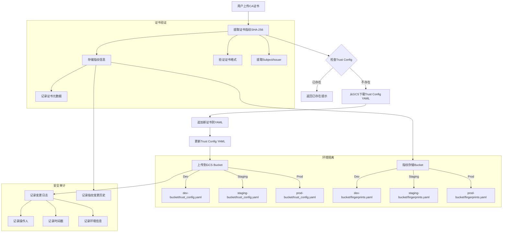

# CA证书Onboarding流程（含指纹存储）



## 指纹存储结构

```yaml
fingerprints:
  - sha256: "certificate_fingerprint_1"
    subject: "CN=Example Corp Root CA"
    issuer: "CN=Example Corp Root CA"
    added_at: "2024-01-20T10:00:00Z"
    added_by: "admin@example.com"
    environment: "prod"
    status: "active"
  - sha256: "certificate_fingerprint_2"
    subject: "CN=Example Corp Intermediate CA"
    issuer: "CN=Example Corp Root CA"
    added_at: "2024-01-20T11:00:00Z"
    added_by: "admin@example.com"
    environment: "prod"
    status: "active"
```

## 流程说明

1. **证书上传与指纹提取**
   - 用户上传CA证书（Root/Intermediate）
   - 系统验证证书格式并提取SHA-256指纹
   - 将指纹信息存储到对应环境的fingerprints.yaml

2. **指纹存储与查询**
   - 指纹信息按环境隔离存储
   - 包含证书元数据和审计信息
   - 支持快速查询和重复检查

3. **重复性检查**
   - 优先通过指纹文件进行快速查重
   - 避免重复添加相同证书

4. **配置更新**
   - 从对应环境的GCS Bucket获取配置
   - 追加新证书到YAML配置
   - 上传更新后的配置

5. **环境管理**
   - 支持多环境配置（Dev/Staging/Prod）
   - 通过不同Bucket隔离环境
   - 证书指纹和Trust Config分开存储

6. **审计日志**
   - 记录所有配置变更
   - 记录指纹存储变更
   - 包含操作人、时间、环境信息