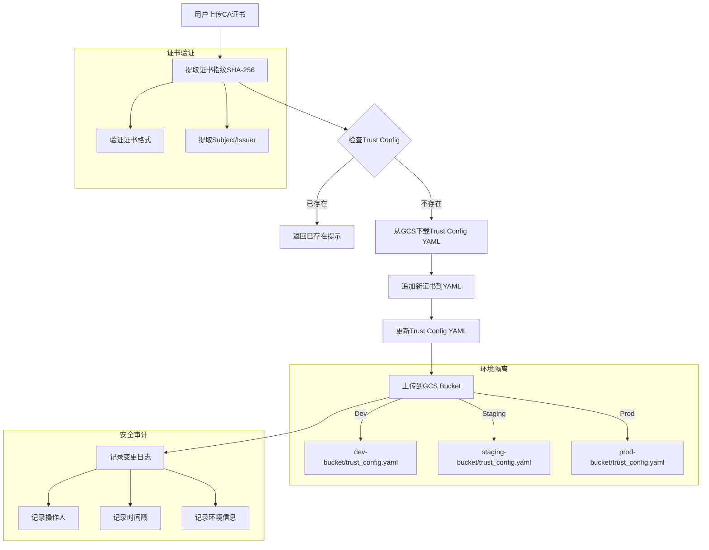

- [summary Flow](#summary-flow)
  - [流程说明](#流程说明)
- [Chatgtp](#chatgtp)
  - [How to onboarding CA to trust config](#how-to-onboarding-ca-to-trust-config)
  - [Yaml 管理的例子脚本](#yaml-管理的例子脚本)
  - [Buckets safe](#buckets-safe)
- [Grok](#grok)
    - [处理方案](#处理方案)
      - [1. 证书存储与管理](#1-证书存储与管理)
      - [2. 证书去重](#2-证书去重)
      - [3. Trust Config更新](#3-trust-config更新)
      - [4. 用户与证书关联](#4-用户与证书关联)
    - [处理步骤](#处理步骤)
      - [步骤 1：用户上传CA证书](#步骤-1用户上传ca证书)
      - [步骤 2：计算证书指纹](#步骤-2计算证书指纹)
      - [步骤 3：检查Trust Config](#步骤-3检查trust-config)
      - [步骤 4：更新Trust Config](#步骤-4更新trust-config)
      - [步骤 5：记录用户与证书关联](#步骤-5记录用户与证书关联)
      - [步骤 6：定期维护](#步骤-6定期维护)
    - [方案优势](#方案优势)
    - [注意事项](#注意事项)
    - [总结](#总结)
- [Claude](#claude)
  - [Trust Config管理方案](#trust-config管理方案)
    - [1. 证书管理数据库](#1-证书管理数据库)
    - [2. 证书查重流程](#2-证书查重流程)
    - [3. Trust Config更新流程](#3-trust-config更新流程)
  - [具体实施步骤](#具体实施步骤)
    - [步骤1: 证书验证与指纹计算](#步骤1-证书验证与指纹计算)
    - [步骤2: 检查证书是否已存在](#步骤2-检查证书是否已存在)
    - [步骤3: 获取当前Trust Config内容](#步骤3-获取当前trust-config内容)
    - [步骤4: 更新Trust Config](#步骤4-更新trust-config)
    - [步骤5: 完整的用户Onboarding流程](#步骤5-完整的用户onboarding流程)
  - [后续维护与最佳实践](#后续维护与最佳实践)

# summary Flow



## 流程说明

1. **证书上传与验证**
   - 用户上传CA证书（Root/Intermediate）
   - 系统验证证书格式并提取指纹

2. **重复性检查**
   - 使用SHA-256指纹检查是否已存在
   - 避免重复添加相同证书

3. **配置更新**
   - 从对应环境的GCS Bucket获取配置
   - 追加新证书到YAML配置
   - 上传更新后的配置

4. **环境管理**
   - 支持多环境配置（Dev/Staging/Prod）
   - 通过不同Bucket隔离环境

5. **审计日志**
   - 记录所有配置变更
   - 包含操作人、时间、环境信息

# Chatgtp 
## How to onboarding CA to trust config 
一个多租户服务平台，入口是统一域名（通过 Location Path 区分租户），支持用户的 API 接入时使用 mTLS，用户需要提供 Root CA 和 Intermediate CA，这些你会加入到你们的 Trust Config 中。

你现在关注的关键点是：

✅ 如何判断上传的 Root CA / Intermediate CA 是否已经存在于现有的 Trust Config 中？

我们来从几个方面拆解并展开讲解，包括背后的原理以及实现建议。

⸻

🧠 先理清：Trust Config 背后的结构

一个 TLS 信任配置（Trust Config）本质上是：
	•	一组 PEM 编码的 证书（X.509），
	•	它构成服务端在握手过程中用于验证客户端证书链的根证书集合（信任锚），
	•	它们可通过 Cloud Load Balancing 的 Server TLS Policy 或 Google-managed trust config 来引用。

⸻

✅ 判断已存在的 Root / Intermediate CA：方案解析

你要做的其实是“避免重复添加已存在的 CA”，这需要识别两个证书是否语义等价（即使内容略有不同，比如不同编码格式或者顺序）。

1. 🔐 基于证书的 Fingerprint 来比对

推荐方式是对上传的证书做指纹（Fingerprint）计算，常用的是：
	•	SHA-256 或 SHA-1 的 certificate fingerprint
	•	使用证书内容（DER 编码）作为输入，生成哈希

示例操作（用 OpenSSL）：

`openssl x509 -in uploaded_cert.pem -noout -fingerprint -sha256`

然后对你当前 Trust Config 里的每个证书也做一次指纹提取，做对比即可判断是否已存在。

2. 🏷️ 比较 Subject / Issuer / Serial Number

如果你不想用哈希，也可以做结构比对，例如提取以下字段：
	•	Subject
	•	Issuer
	•	Serial Number
	•	Not Before / Not After

这些组成的信息基本可以唯一地标识一张证书。你可以用如下命令提取：

`openssl x509 -in cert.pem -noout -subject -issuer -serial`

然后和 Trust Config 中的每一个证书进行对比。

💡注意：Intermediate CA 一般也会重复，所以最好建立一个“指纹索引表”来避免重复加载。

⸻

🧰 实现建议（假设你用的是 GCP + GKE 平台）

方式 A：平台控制层实现（比如服务管理模块）

你可以维护一个信任配置注册系统：
	1.	用户上传 CA 时，提取 fingerprint
	2.	查询本地 TrustConfig 中是否已有匹配的证书
	3.	若无重复，则 append 到 TrustConfig 文件或 Secret 中
	4.	同步更新 Cloud Load Balancer 的 Server TLS Policy（或 mTLS policy）

方式 B：结合 K8s Secret + ConfigMap 管理信任链

可以将每个租户的 trust chain 分开存储，构建全局 TrustConfig 时聚合：
	•	所有 cert 都按 fingerprint 存储（可用哈希名）
	•	避免写入重复证书
	•	便于动态构建“合并 Trust Bundle”

⸻

🛡️ 顺带一提：你可能遇到的坑
	•	🧱 Intermediate CA 如果重复但顺序不同，mTLS 会失败（GCP 使用的 Envoy 组件对 cert chain 顺序较敏感）
	•	🔁 用户上传完整 chain 和单个 root 分开管理时，注意 dedup 和顺序的问题
	•	🔐 不同用户用相同 root，但中间链不同，建议全量保存并使用 fingerprint 去重

⸻

✅ 结论：你可以怎么做

| 步骤 | 动作 |
|------|------|
| 1 | 用户上传 cert chain（Root + Intermediate） |
| 2 | 提取 fingerprint（推荐 SHA-256） |
| 3 | 对比当前 TrustConfig 中的 cert fingerprints |
| 4 | 若新证书不在其中，则追加 |
| 5 | 更新 Server TLS Policy 所引用的 trust config |
| 6 | 可选：记录用户与其 CA 的对应关系做审计追踪 |


⸻

如果你愿意，我还可以帮你写一段脚本（Python 或 Bash）来做 fingerprint 提取和对比，或者帮你规划一个 CA dedup 的小服务。

你想用什么语言来做这部分校验？或者你目前的 Trust Config 是怎么管理的（YAML/数据库/K8s Secret）？


非常好，我们先从你提到的最紧迫的事情出发：

⸻

🧪 第一步：写一个 Shell 脚本判断新的 CA 是否已在现有 Trust Config 中

🎯 目标：

用户上传一个 PEM 格式的 CA（可能是 Root 或 Intermediate），我们要判断这个 CA 的内容是否已存在于当前的 Trust Config（同样是 PEM 格式的一堆 cert）中。

⸻

✅ 示例 Shell 脚本（假设 Bash 环境 + OpenSSL 可用）
```bash
#!/bin/bash

# 新上传的CA证书路径（PEM格式）
NEW_CA="$1"

# 已有的Trust Config文件（PEM格式，可能包含多个证书）
TRUSTED_CA_BUNDLE="$2"

# 提取新CA的subject和fingerprint
new_fp=$(openssl x509 -in "$NEW_CA" -noout -fingerprint -sha256 | cut -d= -f2)
new_subject=$(openssl x509 -in "$NEW_CA" -noout -subject)

echo "Checking if the certificate already exists in Trust Config..."
found=0

# 将 Trust Config 中的 cert 拆成一个个单独检查
csplit -f temp_cert_ -b "%02d.pem" "$TRUSTED_CA_BUNDLE" '/-----BEGIN CERTIFICATE-----/' '{*}' >/dev/null 2>&1

for cert in temp_cert_*.pem; do
    fp=$(openssl x509 -in "$cert" -noout -fingerprint -sha256 | cut -d= -f2)
    subject=$(openssl x509 -in "$cert" -noout -subject)

    if [[ "$fp" == "$new_fp" ]]; then
        echo "✅ Found matching certificate (same fingerprint): $cert"
        found=1
        break
    elif [[ "$subject" == "$new_subject" ]]; then
        echo "⚠️ Subject matches but fingerprint differs. Might be a different cert with same subject."
    fi
done

# 清理临时证书
rm -f temp_cert_*.pem

if [[ "$found" -eq 0 ]]; then
    echo "❌ Certificate NOT found in Trust Config."
    exit 1
else
    exit 0
fi
```


⸻

🛠 用法示例

`./check_ca.sh user_uploaded_ca.pem current_trust_config.pem`


⸻

📦 第二部分：Trust Config 用 YAML vs 数据库怎么实现？

你想做的是系统化管理 CA 的生命周期，以下是对比说明：

⸻

✅ YAML 管理（适合轻量/CI/CD集成）
	•	形式：
```yaml
trust_config:
  - name: ca-user-1
    pem: |
      -----BEGIN CERTIFICATE-----
      ...
      -----END CERTIFICATE-----
  - name: ca-user-2
    pem: |
      ...
```

	•	优点：
	•	易于版本控制（GitOps）。
	•	适合静态文件加载、自动部署。
	•	与 K8S Secret / ConfigMap 结构天然兼容。
	•	缺点：
	•	查询效率低。
	•	不适合动态更新（需要重新部署或加载）。
	•	去重、过期管理不方便。

⸻

✅ 数据库管理（适合动态多租户平台）
	•	结构设计：
```sql
CREATE TABLE trust_cas (
  id SERIAL PRIMARY KEY,
  name TEXT,
  fingerprint TEXT UNIQUE,
  subject TEXT,
  cert_pem TEXT,
  created_at TIMESTAMP
);
```

	•	优点：
	•	可快速去重（通过 fingerprint 唯一约束）。
	•	可做 TTL 失效、更新、审计等功能。
	•	适合通过 API 动态加载（比如将 cert 动态注入 Listener 或 mTLS Policy）。
	•	缺点：
	•	运维复杂度高。
	•	要配套构建信任链动态生效机制（或周期性同步到实际配置文件/Secret）。

⸻

✅ 建议（如果你打算扩展）
| 场景 | 建议 |
|------|------|
| CI/CD、静态配置、单体应用 | 用 YAML 管理 |
| 动态多租户、要支持 API 调整的场景 | 用数据库（配合缓存或同步）管理 |


⸻


## Yaml 管理的例子脚本
是否要我再帮你写一个 YAML 管理的例子脚本（比如如何把新证书追加到 YAML 中，或如何校验 YAML 里是否已存在）？或者你想先整理下你们目前是怎么管理这些 CA 文件的？
太好了，你的架构思路很清晰，下面我来为你写一个基于 YAML 管理 Trust Config 的示例，并且考虑多环境（比如 dev/staging/prod），通过指定 bucket 实现隔离和统一脚本处理。

⸻

🧾 假设的 Trust Config YAML 结构

我们先定义一下 Trust Config YAML 的样子，简单可扩展：
```yaml
trust_cas:
  - name: customer-a-root
    pem: |
      -----BEGIN CERTIFICATE-----
      MIIDdzCCAl+gAwIBAgIE...
      -----END CERTIFICATE-----
  - name: customer-b-root
    pem: |
      -----BEGIN CERTIFICATE-----
      MIIDXTCCAkWgAwIBAgIJ...
      -----END CERTIFICATE-----
```


⸻

🧰 脚本功能目标
	•	指定 环境参数（如 dev/staging/prod）
	•	从指定 bucket 下载该环境的 Trust Config YAML
	•	判断一个上传的 CA 是否已存在（基于 cert fingerprint 对比）
	•	如果不存在，可以选择自动追加

⸻

🐚 Shell 脚本：check_and_update_trust_config.sh
```bash
#!/bin/bash

set -e

ENV="$1"                  # 环境名称，如 dev / staging / prod
NEW_CA_FILE="$2"          # 用户上传的 PEM 文件路径
TMP_DIR="/tmp/trust_config_check"
YAML_LOCAL="$TMP_DIR/trust_config.yaml"

# bucket 配置（可按需调整）
declare -A BUCKET_MAP
BUCKET_MAP[dev]="gs://my-config-dev/trust_config.yaml"
BUCKET_MAP[staging]="gs://my-config-staging/trust_config.yaml"
BUCKET_MAP[prod]="gs://my-config-prod/trust_config.yaml"

# 准备临时目录
mkdir -p "$TMP_DIR"

# 下载当前环境的 trust config YAML
echo "Downloading trust config from ${BUCKET_MAP[$ENV]}..."
gsutil cp "${BUCKET_MAP[$ENV]}" "$YAML_LOCAL"

# 提取现有 Trust CA PEMs 到临时文件夹
echo "Extracting certs from YAML..."
yq eval '.trust_cas[].pem' "$YAML_LOCAL" | awk 'BEGIN {n=0} /BEGIN CERT/ {n+=1; filename=sprintf("'"$TMP_DIR"'/ca_%03d.pem", n)} {print > filename}'

# 计算新上传证书的 Fingerprint
NEW_FP=$(openssl x509 -in "$NEW_CA_FILE" -noout -fingerprint -sha256 | cut -d= -f2)

# 比对是否已存在
FOUND=0
for cert in "$TMP_DIR"/ca_*.pem; do
  FP=$(openssl x509 -in "$cert" -noout -fingerprint -sha256 | cut -d= -f2)
  if [[ "$FP" == "$NEW_FP" ]]; then
    echo "✅ Certificate already exists in Trust Config: $cert"
    FOUND=1
    break
  fi
done

# 如未找到，提示可追加
if [[ "$FOUND" -eq 0 ]]; then
  echo "❌ Certificate NOT found in Trust Config."
  echo "Do you want to add it? (y/n)"
  read -r ADD_CERT

  if [[ "$ADD_CERT" == "y" ]]; then
    CERT_NAME=$(basename "$NEW_CA_FILE" | sed 's/.pem//')
    echo "Appending certificate to YAML..."

    # 用 yq 追加
    yq eval -i ".trust_cas += [{\"name\": \"$CERT_NAME\", \"pem\": \"$(awk '{printf "%s\\n", $0}' $NEW_CA_FILE)\"}]" "$YAML_LOCAL"

    # 上传回 GCS
    echo "Uploading updated Trust Config to ${BUCKET_MAP[$ENV]}"
    gsutil cp "$YAML_LOCAL" "${BUCKET_MAP[$ENV]}"
  else
    echo "Aborted appending."
  fi
fi

# 清理
rm -rf "$TMP_DIR"
```


⸻

🔧 依赖说明
	•	yq: 用于操作 YAML（推荐 Mike Farah’s yq）
	•	gsutil: 用于 GCS Bucket 操作
	•	openssl: 提取证书指纹

安装 yq（v4+）：
```bash
brew install yq      # macOS
sudo snap install yq # Ubuntu
```


⸻

✅ 用法

`./check_and_update_trust_config.sh dev ./uploaded_customer_ca.pem`


⸻

💡 YAML vs. 数据库管理 Trust Config 的对比建议

| 特性 | YAML 文件 | 数据库管理 |
|------|-----------|------------|
| 简单性 | ✅ 易上手，适合初期配置 | ❌ 需要额外架构支撑 |
| 审计（git/变更记录） | ✅ 可以 git 管理 | ❌ 需额外日志系统 |
| 多环境隔离 | ✅ 可用多个 Bucket 管理 | ✅ 数据库中增加 env 字段实现 |
| 自动化变更 | ✅ 配合 CI/CD 很容易 | ✅ REST API 可自动更新 |
| 高并发更新 | ❌ 存在并发冲突风险（如多人编辑） | ✅ 天然支持并发 |
| 灵活查询 | ❌ 不易快速查询/模糊查找 | ✅ 查询、检索更高效 |

总结建议：
若你们处于“平台稳定，但证书管理更新频率不高”的阶段，YAML + GCS + 脚本自动化 是简单又稳的解决方案。
一旦需要频繁动态更新、支持 UI 管理、租户接入多样等，可以逐步迁移至 DB（如 Firestore、PostgreSQL）+ 后端服务。

⸻

## Buckets safe 
- GCS 分 Bucket 管理 trust_config.yaml 是完全合理的
你提到的这个问题非常关键，咱们来系统性拆解：

⸻

✅ 一、公开的 CA 证书（Root / Intermediate）是否属于敏感信息？

✳️ 简单回答：它们本身不是敏感信息。
	•	Root CA / Intermediate CA 的证书（即 public key 和 metadata）是公开的，用于让他人信任其签发的证书。
	•	它们不包含私钥，因此本身泄露 并不构成安全隐患。
	•	举例：我们日常浏览器中的 Root CA，都可以从 Mozilla CA List 等公开渠道下载。

⸻

🧠 那为什么我们还要小心处理？

虽然 CA 证书不敏感，但在你的上下文（多租户、用户接入）中，还需要考虑以下几点：

⸻

🔐 二、安全关注点（即使是“非敏感”）

| 关注点 | 原因 | 建议 |
|--------|------|------|
| 数据完整性 | 防止 YAML 配置被误改、注入非法 CA，影响服务接入安全 | 建议配置版本控制（如 Git 管理）、或加签 |
| 桶权限控制 | GCS Bucket 中的 trust_config.yaml 不应被非受信任角色读写 | 建议通过 IAM 控制服务账号权限 |
| 多环境隔离 | 避免用户误将 PRD 配置用于 DEV，引发连接失败 | 明确 Bucket 命名、配合 CI 校验 |
| 审计与变更记录 | 便于排查某个接入出问题时，追踪 Trust List 变更历史 | 建议使用 GitOps 或至少日志记录变更 |


⸻

📂 三、推荐管理方式：YAML + GCS + GitOps（或脚本版本控制）

你现在使用 GCS 分 Bucket 管理 trust_config.yaml 是完全合理的。推荐加一点小改进：

✅ 管理建议

| 项目 | 建议方式 |
|------|----------|
| 配置存储 | 每个环境一个 bucket：gs://my-config-<env>/trust_config.yaml |
| 配置更新 | 脚本更新 + 变更记录日志（可以写入 BigQuery / log sink） |
| 校验逻辑 | 使用 SHA256 指纹去重、校验证书合法性 |
| 发布策略 | 支持预览 → 审批 → apply 的流程（可简单实现） |
| 可审计性 | 每次更新打 commit log 或记录到 GCS 另一个日志文件 |


⸻

✅ 举个“安全而清晰”的多环境 Trust Config 管理脚本思路（伪代码）
```bash
ENV=$1                      # dev / staging / prd
NEW_CA_PEM=$2               # path to uploaded CA PEM
YAML_PATH="gs://my-config-$ENV/trust_config.yaml"
# 下载原有配置
gsutil cp "$YAML_PATH" ./trust_config.yaml

# 判断是否已有同样的 fingerprint
# 如无则追加新 CA，重写 trust_config.yaml

# 上传回 GCS
gsutil cp ./trust_config.yaml "$YAML_PATH"
```
- 可选：写一条日志变更记录（例如写入另一个 bucket 或 BigQuery）


⸻

如果你希望的话，我可以直接帮你实现这个完整的脚本，支持：
	•	多环境处理
	•	证书去重（根据 fingerprint）
	•	自动追加 PEM 到 YAML
	•	上传至 GCS

要不要我给你写个完整版本？可以直接跑的那种。


当然可以！我来给你一个完整的版本，涵盖以下需求：

⸻

✅ 目标：
	1.	管理 YAML 格式的 Trust Config（包含多个 CA）；
	2.	支持多个环境（dev/staging/prod），通过指定 GCS Bucket；
	3.	用户上传一个新的 CA（PEM 格式），脚本自动检查是否已存在，若不存在则追加并上传回对应的 Bucket；
	4.	安全性考虑到位（但证书仅含公钥，无需担心泄露）；

⸻

📁 目录结构假设

check_and_update_trust_config.sh         # 脚本文件
new_ca.pem                               # 用户上传的 CA
tmp_trust_config.yaml                    # 下载的临时 YAML


⸻

🛠️ 脚本：check_and_update_trust_config.sh
```bash
#!/bin/bash

# Usage: ./check_and_update_trust_config.sh dev new_ca.pem

set -e

ENV="$1"
NEW_CA_FILE="$2"
BUCKET_PREFIX="gs://my-config-${ENV}"
TRUST_CONFIG_FILE="trust_config.yaml"
TMP_LOCAL_COPY="./tmp_${TRUST_CONFIG_FILE}"

if [[ -z "$ENV" || -z "$NEW_CA_FILE" ]]; then
  echo "Usage: $0 <env: dev|staging|prd> <new_ca_file.pem>"
  exit 1
fi

echo "📥 Downloading existing trust config from: ${BUCKET_PREFIX}/${TRUST_CONFIG_FILE}"
gsutil cp "${BUCKET_PREFIX}/${TRUST_CONFIG_FILE}" "${TMP_LOCAL_COPY}" || {
  echo "⚠️ Config file not found. Creating a new one."
  echo "trust_cas: []" > "${TMP_LOCAL_COPY}"
}

# Extract normalized SHA256 of uploaded cert
NEW_CA_HASH=$(openssl x509 -in "$NEW_CA_FILE" -noout -fingerprint -sha256 | sed 's/.*=//;s/://g')

echo "🔍 Looking for existing CA with hash: $NEW_CA_HASH"

# Loop over existing entries
FOUND=0
while IFS= read -r block; do
  PEM=$(echo "$block" | yq e '.pem' -)
  if [[ "$PEM" == "null" ]]; then continue; fi

  echo "$PEM" > /tmp/existing_ca.pem
  EXISTING_HASH=$(openssl x509 -in /tmp/existing_ca.pem -noout -fingerprint -sha256 | sed 's/.*=//;s/://g')

  if [[ "$NEW_CA_HASH" == "$EXISTING_HASH" ]]; then
    echo "✅ CA already exists in trust config."
    FOUND=1
    break
  fi
done < <(yq e '.trust_cas[]' "${TMP_LOCAL_COPY}" -o=json)

if [[ $FOUND -eq 0 ]]; then
  echo "➕ Appending new CA to trust config..."

  # Add the new CA
  NAME="uploaded-$(date +%s)"
  yq e -i ".trust_cas += [{\"name\": \"$NAME\", \"pem\": \"$(awk '{printf "%s\\n", $0}' $NEW_CA_FILE)\"}]" "${TMP_LOCAL_COPY}"

  echo "🚀 Uploading updated trust config to ${BUCKET_PREFIX}/${TRUST_CONFIG_FILE}"
  gsutil cp "${TMP_LOCAL_COPY}" "${BUCKET_PREFIX}/${TRUST_CONFIG_FILE}"
else
  echo "⚠️ No changes needed."
fi

rm -f /tmp/existing_ca.pem "${TMP_LOCAL_COPY}"
```


⸻

🧪 使用方式
```bash
chmod +x check_and_update_trust_config.sh
./check_and_update_trust_config.sh dev new_ca.pem
```
这会自动处理：
	•	下载当前 dev 环境的 trust_config.yaml；
	•	判断新上传的 PEM 是否已存在；
	•	如不存在，则追加到 YAML 并上传回对应 Bucket。

⸻

✅ 安全性小结
| 项目 | 安全风险 | 备注 |
|------|----------|------|
| PEM 内容 | ✅ 安全 | 仅包含证书公钥，公开信息 |
| GCS Bucket 权限 | ⚠️ 需限制 | 只允许内部 CI 或管理员账号访问 |
| 脚本执行者 | ⚠️ 管控 | 建议运行在安全环境或 CI 流程中 |


⸻

如果你希望我继续补上：YAML 的格式校验、支持嵌套路径、或集成 Git 版本管理（例如更新完自动 commit），我也可以继续完善。你觉得呢？


# Grok 
好的，我来帮你梳理和回答这个问题。你关心的是在用户Onboarding阶段，如何处理用户上传的root CA和intermediate CA证书，追加到trust config中，同时避免重复添加相同的证书，并确保trust config能够正确更新。下面我将为你提供一个完整的处理方案和具体步骤。

---

### 处理方案

为了高效管理用户的CA证书并维护trust config，我们需要一个系统化的方法来存储、去重和更新证书。核心思路是：

1. **中心化证书管理**：将所有用户的CA证书存储在一个中心化的证书库中，并为每个证书生成唯一标识（如指纹）。
2. **证书去重**：通过检查证书的唯一标识，判断trust config中是否已包含该证书，避免重复添加。
3. **动态更新**：根据用户上传的证书动态更新trust config，同时记录用户与证书的关联关系。
4. **定期维护**：确保trust config中的证书有效且必要。

以下是详细的解决方案：

#### 1. 证书存储与管理
- 将用户的root CA和intermediate CA存储在一个中心化的证书库中，可以是数据库、文件系统或其他存储系统。
- 为每个证书生成一个唯一标识符，例如使用证书的指纹（fingerprint）或SHA-256哈希值。

#### 2. 证书去重
- 用户上传证书时，计算其指纹或哈希值。
- 检查trust config中是否已存在相同指纹的证书：
  - 如果存在，则无需重复添加。
  - 如果不存在，则将新证书追加到trust config。

#### 3. Trust Config更新
- trust config应支持动态更新，能够根据需要添加新证书。
- 如果发现新证书需要添加，直接追加到trust config中，确保格式正确。
- 可考虑定期清理不再使用的证书（例如用户停用服务时）。

#### 4. 用户与证书关联
- 维护一个映射表，记录每个用户与其使用的CA证书的对应关系。
- 这有助于追踪和管理哪些用户在使用哪些证书。

---

### 处理步骤

以下是具体的操作步骤，确保你的平台能够高效处理用户上传的CA证书并更新trust config：

#### 步骤 1：用户上传CA证书
- 用户通过平台界面或API上传其root CA和intermediate CA证书。
- 平台接收证书后，验证其有效性，例如：
  - 检查证书是否为CA证书（通过Basic Constraints扩展）。
  - 检查证书是否过期。
  - 确保证书格式正确（如PEM格式）。

#### 步骤 2：计算证书指纹
- 对每个上传的证书计算其指纹或哈希值，使用SHA-256等算法。
- 示例方法：可以用OpenSSL命令`openssl x509 -in certificate.pem -fingerprint -sha256`生成指纹，或者在代码中实现类似逻辑。
- 指纹是一个唯一标识，用于后续去重判断。

#### 步骤 3：检查Trust Config
- 查询当前trust config中的证书，提取已有证书的指纹。
- 比较用户上传证书的指纹与trust config中已有证书的指纹：
  - **如果匹配**：说明trust config已包含该证书，无需追加。
  - **如果不匹配**：说明这是一个新证书，需要追加到trust config。

#### 步骤 4：更新Trust Config
- 如果需要添加新证书，将其追加到trust config中。
- 确保trust config的格式正确，例如：
  - 如果是PEM格式，每个证书应包含`-----BEGIN CERTIFICATE-----`和`-----END CERTIFICATE-----`标记。
  - 多个证书按顺序拼接即可。
- 更新后，验证trust config的完整性，确保能被系统正确加载。

#### 步骤 5：记录用户与证书关联
- 在数据库或配置文件中记录用户与证书的关联关系。
- 示例表结构：
  ```
  | 用户ID | 证书指纹           | 证书类型         |
  |--------|-------------------|-----------------|
  | user1  | SHA256:abc123... | Root CA         |
  | user1  | SHA256:def456... | Intermediate CA |
  | user2  | SHA256:abc123... | Root CA         |
  ```
- 通过这种方式，可以追踪哪些用户使用了哪些证书。

#### 步骤 6：定期维护
- 定期检查trust config中的证书：
  - 移除过期证书。
  - 如果有用户停用服务或更换证书，更新trust config和关联记录。
- 确保trust config保持整洁和高效。

---

### 方案优势
- **避免重复**：通过指纹判断证书是否已存在，避免冗余添加。
- **高效管理**：中心化存储和用户关联记录让管理更清晰。
- **安全性**：定期维护确保只包含有效证书。

---

### 注意事项
1. **证书格式**：
   - 确保证书是标准PEM格式，追加到trust config时不要破坏原有结构。
2. **性能考虑**：
   - 如果用户和证书数量较多，证书库和指纹查询需优化（如使用索引）。
3. **安全性**：
   - 确保证书存储安全，防止泄露或篡改，例如使用加密存储。
4. **日志记录**：
   - 建议记录每次trust config的更新操作，便于排查问题。

---

### 总结
通过上述方案和步骤，你的平台可以高效处理用户上传的root CA和intermediate CA证书。你只需要在用户上传时计算指纹、检查trust config去重、动态更新配置并记录关联关系，就能满足需求。这样既避免了重复添加相同的证书，也能确保不同证书被正确追加到trust config中。如果有其他具体场景或细节需要调整，可以进一步讨论！


# Claude 

您的问题涉及如何高效管理和更新Trust Config，特别是在多用户共享同一个入口域名但使用不同证书的情况下。以下是我针对您场景的处理方案和步骤：

## Trust Config管理方案

### 1. 证书管理数据库

首先，建立一个证书管理数据库以跟踪所有已添加的证书：

```
证书管理表结构：
- cert_id: 唯一标识符
- cert_type: 'ROOT_CA' 或 'INTERMEDIATE_CA'
- cert_fingerprint: 证书的SHA-256指纹
- cert_subject: 证书主题
- cert_issuer: 证书颁发者
- cert_content: 证书PEM格式内容
- added_date: 添加日期
- user_id: 关联用户
```

### 2. 证书查重流程

当用户提交新的Root CA或Intermediate CA时：

```
1. 计算提交证书的SHA-256指纹
2. 查询数据库是否已存在该指纹的证书
3. 如果存在，记录关联但不进行Trust Config更新
4. 如果不存在，将证书保存并更新Trust Config
```

### 3. Trust Config更新流程

```
1. 获取当前Trust Config中的证书列表
2. 将新证书与现有列表合并
3. 使用Google Cloud API更新Trust Config
4. 记录更新时间和证书变更
```

## 具体实施步骤

### 步骤1: 证书验证与指纹计算

```python
import hashlib
import OpenSSL.crypto as crypto

def validate_and_fingerprint(cert_data):
    try:
        # 尝试解析证书
        cert = crypto.load_certificate(crypto.FILETYPE_PEM, cert_data)
        
        # 获取证书主题
        subject = cert.get_subject().CN
        
        # 获取证书颁发者
        issuer = cert.get_issuer().CN
        
        # 计算指纹
        fingerprint = hashlib.sha256(crypto.dump_certificate(
            crypto.FILETYPE_ASN1, cert)).hexdigest()
            
        # 验证证书有效期
        not_after = cert.get_notAfter().decode('ascii')
        
        return {
            'valid': True,
            'fingerprint': fingerprint,
            'subject': subject,
            'issuer': issuer,
            'not_after': not_after
        }
    except Exception as e:
        return {'valid': False, 'error': str(e)}
```

### 步骤2: 检查证书是否已存在

```python
def is_cert_exists(db_connection, fingerprint):
    query = "SELECT cert_id FROM certificates WHERE cert_fingerprint = %s"
    cursor = db_connection.cursor()
    cursor.execute(query, (fingerprint,))
    result = cursor.fetchone()
    return result is not None, result[0] if result else None
```

### 步骤3: 获取当前Trust Config内容

```python
from google.cloud import certificatemanager_v1

def get_current_trust_config(project_id, location, trust_config_id):
    client = certificatemanager_v1.CertificateManagerClient()
    name = f"projects/{project_id}/locations/{location}/trustConfigs/{trust_config_id}"
    
    try:
        trust_config = client.get_trust_config(name=name)
        return trust_config
    except Exception as e:
        print(f"Error retrieving trust config: {e}")
        return None
```

### 步骤4: 更新Trust Config

```python
def update_trust_config(project_id, location, trust_config_id, new_cert_pem):
    client = certificatemanager_v1.CertificateManagerClient()
    name = f"projects/{project_id}/locations/{location}/trustConfigs/{trust_config_id}"
    
    # 获取当前配置
    current_config = client.get_trust_config(name=name)
    
    # 准备更新
    update_mask = {
        "paths": ["trust_anchors"]
    }
    
    # 添加新证书
    trust_anchors = list(current_config.trust_anchors)
    trust_anchors.append(certificatemanager_v1.TrustAnchor(
        pem_certificate=new_cert_pem
    ))
    
    # 更新请求
    request = certificatemanager_v1.UpdateTrustConfigRequest(
        trust_config=certificatemanager_v1.TrustConfig(
            name=name,
            trust_anchors=trust_anchors
        ),
        update_mask=update_mask
    )
    
    operation = client.update_trust_config(request=request)
    result = operation.result()
    
    return result
```

### 步骤5: 完整的用户Onboarding流程

```python
def process_user_certificate(user_id, cert_type, cert_pem):
    # 1. 验证证书并计算指纹
    cert_info = validate_and_fingerprint(cert_pem)
    if not cert_info['valid']:
        return {"success": False, "error": cert_info['error']}
    
    # 2. 检查证书是否已存在
    db = get_database_connection()
    exists, cert_id = is_cert_exists(db, cert_info['fingerprint'])
    
    # 3. 如果证书已存在，关联用户但不更新Trust Config
    if exists:
        associate_cert_with_user(db, cert_id, user_id)
        return {"success": True, "message": "Certificate already exists, associated with user", "updated": False}
    
    # 4. 如果证书不存在，添加到数据库
    new_cert_id = save_certificate(db, {
        'cert_type': cert_type,
        'cert_fingerprint': cert_info['fingerprint'],
        'cert_subject': cert_info['subject'],
        'cert_issuer': cert_info['issuer'],
        'cert_content': cert_pem,
        'user_id': user_id
    })
    
    # 5. 更新Trust Config
    project_id = "your-project-id"
    location = "global"
    trust_config_id = "your-trust-config-id"
    
    result = update_trust_config(project_id, location, trust_config_id, cert_pem)
    
    # 6. 记录更新操作
    log_trust_config_update(db, trust_config_id, new_cert_id)
    
    return {"success": True, "message": "Certificate added and Trust Config updated", "updated": True}
```

## 后续维护与最佳实践

1. **定期清理过期证书**:
   - 创建一个定期任务检查证书有效期
   - 对即将过期的证书通知用户
   - 移除过期且未被任何用户使用的证书

2. **Trust Config版本控制**:
   - 为每次Trust Config更新记录版本
   - 在紧急情况下支持回滚到先前版本

3. **操作审计日志**:
   - 记录所有证书添加和Trust Config更新操作
   - 包括操作人、操作时间和变更内容

4. **性能考虑**:
   - 监控Trust Config大小，证书过多可能影响性能
   - 考虑按服务类型或部门分割多个Trust Config

5. **自动化测试**:
   - 在每次更新Trust Config后，自动测试各类用户的mTLS连接
   - 确保更新不会破坏现有服务

通过以上方案，您可以有效管理多用户共享同一Trust Config的情况，既避免了重复证书的添加，又确保了所有用户的证书都能被正确验证。系统会自动检测新证书是否已存在，只有在必要时才更新Trust Config，从而减少不必要的API调用和服务中断风险。