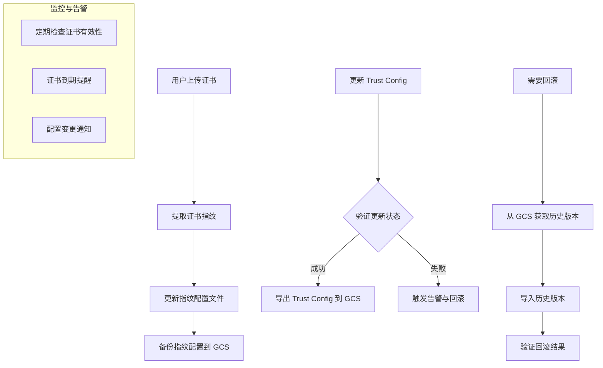
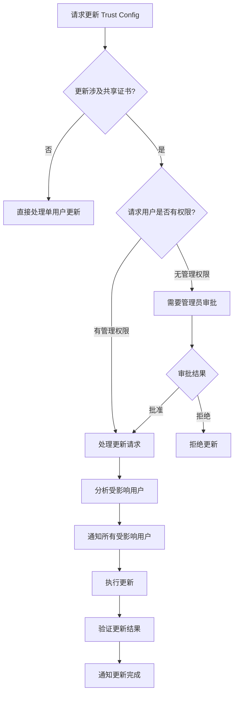

# Q
关于GCP工程里面的MTLS验证，我们走trust config .如果我们是多个用户的多个cert放在这个trust config里面。那么
1 我们如何对这个配置做版本控制？ 我们有Buckets版本控制 里面可以存放导出的trust config yaml;
2 我们如何对用户上传的cert比如root证书和中间键证书做rollback ?
3 如果我们有对应的程序更新了trust config 我们如何做对应的校验，确保更新是成功的
4 我们目前是将用户的root和中间键指纹做了存储 比如有一个fingerprint.conf 文件或者yaml 文件都可以。
对于上面几个需求有没有好的解决办法？

# Grok

感谢您的补充问题！您提到的情况是多个用户拥有不同的 CN（Common Name），但可能共享相同的 Root CA 或 Intermediate CA 证书，并且需要更新 Trust Config，同时确保更新逻辑的正确性和隔离性。这是一个复杂但常见的多租户 mTLS 配置场景，我将详细分析并提供解决方案，确保更新逻辑的安全性、一致性和可追溯性。

以下是针对您的问题的详细解答，遵循您要求的 Markdown 格式，包含流程图、代码示例和表格，并结合 GCP Certificate Manager 和 Trust Config 的最佳实践。

  

问题分析

在多租户场景中，多个用户的证书可能共享相同的 Root CA 或 Intermediate CA，但 CN 不同，表明每个用户的客户端证书是独立的。更新 Trust Config 时，需要考虑以下关键点：

1. 隔离性：确保一个用户的更新不会影响其他用户的 mTLS 配置。
2. 一致性：确保 Trust Config 中的信任锚（Root CA）和中间证书链保持有效，且更新后的配置与预期一致。
3. 可追溯性：记录每次更新的来源（哪个用户）、内容和时间，便于审计和回滚。
4. 冲突管理：当多个用户共享 Root 或 Intermediate CA 时，避免更新冲突（如覆盖或误删除其他用户的信任锚）。

为了解决这些问题，我将提出一个基于 GCP 的解决方案，结合 Trust Config 的管理、版本控制和自动化校验机制。

  

解决方案

核心设计原则

- 单一 Trust Config 管理：所有用户的 Root 和 Intermediate CA 存储在同一个 Trust Config 中，通过元数据或标签区分用户归属。
- 用户隔离：为每个用户分配唯一的标识（如 CN 或用户 ID），并在更新时验证其权限和证书。
- 版本控制与快照：每次更新前创建 Trust Config 快照，存储到版本控制的 Cloud Storage Bucket，便于回滚。
- 自动化校验：更新后自动验证 Trust Config 的完整性和 mTLS 功能。
- 冲突检测：在更新 Trust Config 前，检查是否会覆盖或删除其他用户的信任锚。

实现方案

1. Trust Config 结构设计

将 Trust Config 配置为包含所有用户的 Root 和 Intermediate CA，并通过 labels 或外部元数据（如 YAML 文件）记录每个证书的归属用户。例如：

name: projects/your-project-id/locations/global/trustConfigs/your-trust-config

trustStores:

  trustAnchors:

    - pemCertificate: |

        -----BEGIN CERTIFICATE-----

        [Root CA 1]

        -----END CERTIFICATE-----

    - pemCertificate: |

        -----BEGIN CERTIFICATE-----

        [Root CA 2]

        -----END CERTIFICATE-----

  intermediateCas:

    - pemCertificate: |

        -----BEGIN CERTIFICATE-----

        [Intermediate CA 1]

        -----END CERTIFICATE-----

labels:

  user1: cn=user1.example.com

  user2: cn=user2.example.com

- 元数据存储：维护一个外部 YAML 文件（如 trust-config-metadata.yaml），记录每个证书的指纹和用户映射：  
    certificates:
-   - fingerprint: "12:34:56:78:9A:BC:DE:F0:..."
-     type: root
-     user_id: user1
-     cn: user1.example.com
-     trust_config: projects/your-project-id/locations/global/trustConfigs/your-trust-config
-   - fingerprint: "AB:CD:EF:01:23:45:67:89:..."
-     type: intermediate
-     user_id: user2
-     cn: user2.example.com
-     trust_config: projects/your-project-id/locations/global/trustConfigs/your-trust-config
-   
    
- 存储位置：将元数据文件存储在 Cloud Storage 或 Secret Manager，并启用版本控制。

2. 更新逻辑

当某个用户需要更新 Trust Config（例如添加新的 Root CA 或替换 Intermediate CA），按照以下步骤执行：

1. 权限验证：

- 检查用户是否有更新 Trust Config 的 IAM 权限（如 certificateManager.trustConfigs.update）。
- 使用用户 ID 或 CN 验证其身份，确保只能更新与其关联的证书。

3. 冲突检测：

- 导出当前 Trust Config：  
    gcloud certificate-manager trust-configs export your-trust-config \
-   --project=your-project-id \
-   --location=global \
-   --destination=trust-config-current.yaml
-   
    
- 比较用户提交的新证书指纹与现有证书指纹，检查是否会覆盖其他用户的信任锚。
- 示例脚本（Python）：  
    import yaml
- import hashlib
-   
    
- def get_fingerprint(cert_path):
-     with open(cert_path, 'r') as f:
-         cert_data = f.read()
-     return hashlib.sha256(cert_data.encode()).hexdigest()
-   
    
- def check_conflict(new_cert_path, metadata_path):
-     new_fingerprint = get_fingerprint(new_cert_path)
-     with open(metadata_path, 'r') as f:
-         metadata = yaml.safe_load(f)
-     for cert in metadata['certificates']:
-         if cert['fingerprint'] == new_fingerprint and cert['user_id'] != current_user_id:
-             raise ValueError(f"Certificate conflicts with user {cert['user_id']}")
-     return True
-   
    

5. 创建快照：

- 在更新前导出当前 Trust Config 作为快照：  
    gcloud certificate-manager trust-configs export your-trust-config \
-   --project=your-project-id \
-   --location=global \
-   --destination=trust-config-snapshot-$(date +%Y%m%d%H%M%S).yaml
- gsutil cp trust-config-snapshot-*.yaml gs://your-bucket-name/trust-configs/snapshots/
-   
    

7. 更新 Trust Config：

- 合并新证书到 Trust Config：  
    gcloud certificate-manager trust-configs import your-trust-config \
-   --project=your-project-id \
-   --source=new-trust-config.yaml \
-   --location=global
-   
    
- 更新元数据文件，添加新证书的指纹和用户映射：  
    def update_metadata(metadata_path, new_cert_path, user_id, cn):
-     new_fingerprint = get_fingerprint(new_cert_path)
-     with open(metadata_path, 'r') as f:
-         metadata = yaml.safe_load(f)
-     metadata['certificates'].append({
-         'fingerprint': new_fingerprint,
-         'type': 'root',  # 或 'intermediate'
-         'user_id': user_id,
-         'cn': cn,
-         'trust_config': 'projects/your-project-id/locations/global/trustConfigs/your-trust-config'
-     })
-     with open(metadata_path, 'w') as f:
-         yaml.dump(metadata, f)
-   
    

9. 校验更新：

- 检查 Trust Config 状态：  
    gcloud certificate-manager trust-configs describe your-trust-config \
-   --project=your-project-id \
-   --location=global
-   
    
- 验证证书链：  
    openssl verify -CAfile root.cert intermediate.cert
-   
    
- 模拟 mTLS 请求：  
    curl --cert client.crt --key client.key --cacert root.cert \
-   https://your-load-balancer-url
-   
    

11. 记录日志：

- 将更新操作记录到 Cloud Logging：  
    gcloud logging write trust-config-updates \
-   "User $USER_ID updated Trust Config with fingerprint $NEW_FINGERPRINT" \
-   --project=your-project-id
-   
    

3. 回滚机制

如果更新失败或需要回滚：

- 从 Cloud Storage 下载最近的快照：  
    gsutil cp gs://your-bucket-name/trust-configs/snapshots/trust-config-snapshot-20250513.yaml trust-config-restore.yaml
-   
    
- 导入回滚配置：  
    gcloud certificate-manager trust-configs import your-trust-config \
-   --project=your-project-id \
-   --source=trust-config-restore.yaml \
-   --location=global
-   
    

4. 冲突管理策略

- 只读检查：在更新前，比较新 Trust Config 与当前 Trust Config 的差异，确保不删除其他用户的证书。
- 锁定机制：使用分布式锁（如 Cloud Spanner 或 Redis）防止并发更新导致冲突。
- 分片 Trust Config（可选）：如果用户数量非常多，考虑为每个用户或用户组创建单独的 Trust Config，降低冲突风险，但需权衡管理复杂性。

  

流程图

以下是更新 Trust Config 的完整流程：

graph TD

    A[用户请求更新 Trust Config] --> B[验证用户权限和 CN]

    B --> C[导出当前 Trust Config 快照]

    C --> D[检查新证书指纹冲突]

    D -->|无冲突| E[更新 Trust Config]

    D -->|有冲突| F[拒绝更新并通知用户]

    E --> G[更新元数据文件]

    G --> H[验证 Trust Config 和 mTLS]

    H -->|成功| I[记录日志并完成]

    H -->|失败| J[回滚到快照]

    J --> K[通知用户]

  

表格：更新逻辑关键点

|   |   |   |   |
|---|---|---|---|
|步骤|工具/技术|目的|注意事项|
|权限验证|IAM, CN 检查|确保用户有权更新|配置最小权限原则|
|冲突检测|证书指纹比较, 元数据文件|防止覆盖其他用户证书|确保指纹唯一且元数据最新|
|快照创建|Cloud Storage, gcloud export|支持回滚|启用版本控制，定期清理旧快照|
|Trust Config 更新|gcloud import|应用新证书|验证 YAML 格式正确|
|校验|OpenSSL, curl, Cloud Logging|确认更新生效|自动化脚本，设置超时|
|日志记录|Cloud Logging|审计和追溯|包含用户 ID、指纹和时间戳|

  

示例：自动化更新脚本

以下是一个 Python 脚本示例，涵盖权限验证、冲突检测、快照、更新和校验：

from google.cloud import storage

from google.cloud import logging

import subprocess

import yaml

import hashlib

import datetime

  

PROJECT_ID = "your-project-id"

TRUST_CONFIG_NAME = "your-trust-config"

LOCATION = "global"

BUCKET_NAME = "your-bucket-name"

CURRENT_USER_ID = "user1"

CURRENT_CN = "user1.example.com"

  

def get_fingerprint(cert_path):

    with open(cert_path, 'r') as f:

        cert_data = f.read()

    return hashlib.sha256(cert_data.encode()).hexdigest()

  

def export_snapshot():

    timestamp = datetime.datetime.now().strftime("%Y%m%d%H%M%S")

    cmd = f"gcloud certificate-manager trust-configs export {TRUST_CONFIG_NAME} \

           --project={PROJECT_ID} --location={LOCATION} \

           --destination=trust-config-snapshot-{timestamp}.yaml"

    subprocess.run(cmd, shell=True, check=True)

    subprocess.run(f"gsutil cp trust-config-snapshot-{timestamp}.yaml \

                    gs://{BUCKET_NAME}/trust-configs/snapshots/", shell=True, check=True)

  

def check_conflict(new_cert_path, metadata_path):

    new_fingerprint = get_fingerprint(new_cert_path)

    with open(metadata_path, 'r') as f:

        metadata = yaml.safe_load(f)

    for cert in metadata['certificates']:

        if cert['fingerprint'] == new_fingerprint and cert['user_id'] != CURRENT_USER_ID:

            raise ValueError(f"Certificate conflicts with user {cert['user_id']}")

    return True

  

def update_trust_config(new_cert_path):

    cmd = f"gcloud certificate-manager trust-configs import {TRUST_CONFIG_NAME} \

           --project={PROJECT_ID} --source={new_cert_path} --location={LOCATION}"

    subprocess.run(cmd, shell=True, check=True)

  

def validate_update():

    cmd = f"gcloud certificate-manager trust-configs describe {TRUST_CONFIG_NAME} \

           --project={PROJECT_ID} --location={LOCATION}"

    result = subprocess.run(cmd, shell=True, capture_output=True, text=True)

    if "updateTime" not in result.stdout:

        raise ValueError("Trust Config update failed")

    # 模拟 mTLS 请求（需替换为实际 URL 和证书）

    cmd = "curl --cert client.crt --key client.key --cacert root.cert https://your-load-balancer-url"

    result = subprocess.run(cmd, shell=True, capture_output=True, text=True)

    if result.returncode != 0:

        raise ValueError("mTLS validation failed")

  

def log_update(fingerprint):

    client = logging.Client(project=PROJECT_ID)

    logger = client.logger("trust-config-updates")

    logger.log_text(f"User {CURRENT_USER_ID} updated Trust Config with fingerprint {fingerprint}")

  

def main(new_cert_path, metadata_path):

    try:

        export_snapshot()

        check_conflict(new_cert_path, metadata_path)

        update_trust_config(new_cert_path)

        new_fingerprint = get_fingerprint(new_cert_path)

        validate_update()

        log_update(new_fingerprint)

        print("Trust Config updated successfully")

    except Exception as e:

        print(f"Update failed: {e}")

        # 回滚逻辑（示例）

        subprocess.run(f"gsutil cp gs://{BUCKET_NAME}/trust-configs/snapshots/trust-config-snapshot-*.yaml \

                        trust-config-restore.yaml", shell=True)

        subprocess.run(f"gcloud certificate-manager trust-configs import {TRUST_CONFIG_NAME} \

                        --project={PROJECT_ID} --source=trust-config-restore.yaml --location={LOCATION}", shell=True)

  

if __name__ == "__main__":

    main("new-root-cert.yaml", "trust-config-metadata.yaml")

  

补充建议

1. 多 Trust Config 策略：

- 如果用户数量较多或更新频繁，考虑为每个用户或用户组创建独立的 Trust Config，降低冲突风险。
- 缺点是管理复杂性增加，需权衡。

3. 并发控制：

- 使用 Cloud Spanner 或 Firestore 存储锁状态，防止多个用户同时更新 Trust Config。
- 示例：更新前在 Spanner 中写入 lock_key: trust-config-update，完成后释放。

5. 监控与告警：

- 配置 Cloud Monitoring 监控 Trust Config 更新事件和 mTLS 错误率。
- 示例告警策略：  
    gcloud monitoring policies create \
-   --policy-from-file=policy.yaml
-   
    displayName: Trust Config Update Failure
- conditions:
-   - conditionThreshold:
-       filter: metric.type="logging.googleapis.com/user/trust-config-updates" AND "failed" in textPayload
-       thresholdValue: 1
-       duration: 60s
-       comparison: COMPARISON_GT
- notificationChannels: ["your-channel"]
-   
    

7. 审计与合规：

- 启用 Cloud Audit Logs，记录所有 Trust Config 操作：  
    gcloud logging read "resource.type=certificate_manager_trust_config" \
-   --project=your-project-id
-   
    

9. 测试环境：

- 在非生产环境中模拟多用户更新场景，验证冲突检测和回滚逻辑。
- 使用沙箱负载均衡器测试 mTLS 连接。

  

总结

通过以下措施，您可以确保多用户共享 Root/Intermediate CA 的 Trust Config 更新逻辑安全可靠：

- 使用元数据文件追踪证书归属，结合指纹进行冲突检测。
- 在更新前创建快照，支持快速回滚。
- 自动化校验 Trust Config 和 mTLS 连接，确保更新生效。
- 记录日志并配置监控，增强可追溯性和告警能力。

上述方案利用 GCP 的 Cloud Storage、Certificate Manager 和 Logging 等服务，结合脚本自动化，满足隔离性、一致性和可追溯性的需求。如需进一步优化（如并发控制的具体实现）或针对特定场景调整，请提供更多细节，我可以进一步定制方案！


# claude 

# GCP mTLS 验证与信任配置管理方案

针对您使用 GCP 工程中的 mTLS 验证和信任配置(trust config)的管理问题，我提供以下解决方案：

## 1. 信任配置的版本控制

使用 Google Cloud Storage Buckets 进行版本控制是很好的选择，具体实现方案：

```bash
# 启用 GCS bucket 版本控制
gsutil versioning set on gs://your-trust-config-bucket

# 导出当前 trust config 到 bucket 并添加时间戳
TIMESTAMP=$(date +%Y%m%d%H%M%S)
gcloud certificate-manager trust-configs export trust-config-name \
  --destination=gs://your-trust-config-bucket/trust-config-$TIMESTAMP.yaml
```

## 2. 证书回滚方案

对于 root 证书和中间证书的回滚：

```bash
# 从指定版本恢复 trust config
gsutil cp gs://your-trust-config-bucket/trust-config-[VERSION].yaml ./trust-config-restore.yaml

# 导入恢复的 trust config
gcloud certificate-manager trust-configs import trust-config-name \
  --source=./trust-config-restore.yaml \
  --description="Rollback to version [VERSION]"
```

## 3. 更新验证机制

使用以下方法确保 trust config 更新成功：

```bash
# 更新 trust config 后获取其状态
CONFIG_STATUS=$(gcloud certificate-manager trust-configs describe trust-config-name --format="value(state)")

# 验证状态是否为 ACTIVE
if [ "$CONFIG_STATUS" == "ACTIVE" ]; then
  echo "Trust config updated successfully"
else
  echo "Trust config update failed with status: $CONFIG_STATUS"
fi

# 获取证书指纹并与预期值比对
CURRENT_FINGERPRINTS=$(gcloud certificate-manager trust-configs describe trust-config-name --format="json" | jq -r '.trustStores[].certificates[].fingerprint')
```

## 4. 指纹存储与管理方案

对于存储用户 root 和中间证书指纹的方案，建议使用结构化的 YAML 格式：

```yaml
version: "2.0"
updated_at: "2025-05-13T10:00:00Z"
certificates:
  - name: "customer-a-root"
    fingerprint: "AA:BB:CC:DD:EE:FF:00:11:22:33:44:55:66:77:88:99"
    type: "root"
    expires_at: "2030-01-01"
  - name: "customer-a-intermediate"
    fingerprint: "11:22:33:44:55:66:77:88:99:AA:BB:CC:DD:EE:FF:00"
    type: "intermediate"
    expires_at: "2028-01-01"
```

## 完整工作流程

以下是一个完整的工作流程图，展示了证书管理和信任配置的整个生命周期：



## 建议的自动化解决方案

创建一个完整的自动化管理系统：

1. **证书管理服务**：处理证书上传、验证、指纹提取和存储
2. **版本控制服务**：管理 trust config 的版本并存储到 GCS
3. **验证服务**：确保更新成功并提供回滚能力
4. **监控服务**：监控证书有效期和配置变更

### 示例架构

| 组件 | 功能 | 实现技术 |
|------|------|----------|
| 证书管理 API | 接收、验证证书并提取指纹 | Cloud Functions/Cloud Run |
| 指纹存储库 | 保存证书指纹信息 | Firestore/Cloud SQL |
| 版本控制服务 | 管理 trust config 版本 | Cloud Run + GCS |
| 验证服务 | 确保配置更新成功 | Cloud Functions |
| 监控与告警 | 监控证书有效期和配置变更 | Cloud Monitoring + Pub/Sub |

通过这套解决方案，您可以有效地管理多个用户的多个证书，确保 trust config 的可靠更新与回滚，并拥有完整的审计与监控能力。​​​​​​​​​​​​​​​​

# 管理多用户共享证书的 Trust Config 更新策略

当多个用户拥有不同的 CN（Common Name）但共享相同的 Root 或中间证书时，Trust Config 的更新需要特别谨慎。以下是处理这种情况的方案：

## 用户-证书映射管理

首先，建立用户与证书的关系映射：

```yaml
# users-certificates-mapping.yaml
version: "2.0"
updated_at: "2025-05-13T14:30:00Z"
certificates:
  root_cert_1:
    fingerprint: "AA:BB:CC:DD:EE:FF:00:11:22:33:44:55:66:77:88:99"
    users:
      - user_id: "user1"
        cn: "client1.example.com"
      - user_id: "user2"
        cn: "client2.example.com"
  intermediate_cert_1:
    fingerprint: "11:22:33:44:55:66:77:88:99:AA:BB:CC:DD:EE:FF:00"
    users:
      - user_id: "user1"
        cn: "client1.example.com"
      - user_id: "user3"
        cn: "client3.example.com"
```

## 更新影响分析与通知机制

在更新 Trust Config 前进行影响分析：

```bash
#!/bin/bash
# analyze_trust_config_update.sh

# 获取将要更新的证书指纹
NEW_FINGERPRINT="$1"
CERT_TYPE="$2"  # root 或 intermediate

# 查找受影响的用户
AFFECTED_USERS=$(yq eval ".certificates.${CERT_TYPE}_cert_*.users[] | select(.fingerprint == \"$NEW_FINGERPRINT\") | .user_id" users-certificates-mapping.yaml)

# 通知受影响的用户
for USER in $AFFECTED_USERS; do
  echo "Notifying user $USER about upcoming certificate change"
  # 实际通知逻辑 (例如发送邮件或触发 Pub/Sub 事件)
  # gcloud pubsub topics publish cert-updates --message="Certificate update affecting user $USER"
done
```

## 增量更新与原子性保证

使用事务性更新来确保 Trust Config 更新的原子性：

```bash
#!/bin/bash
# update_trust_config.sh

# 获取当前 Trust Config
gcloud certificate-manager trust-configs export current-trust-config \
  --destination=./current-trust-config.yaml

# 备份当前版本
TIMESTAMP=$(date +%Y%m%d%H%M%S)
gsutil cp ./current-trust-config.yaml gs://your-trust-config-bucket/trust-config-$TIMESTAMP.yaml

# 更新指定证书 (使用 yq 工具)
yq eval -i "修改特定证书而不影响其他部分的表达式" ./current-trust-config.yaml

# 验证更新的配置
# ... 验证逻辑

# 导入更新后的配置
gcloud certificate-manager trust-configs import trust-config-name \
  --source=./current-trust-config.yaml
```

## 用户权限与更新策略

建立更新策略决策树：



## 共享证书更新的验证机制

为共享证书创建特殊的验证流程：

```bash
#!/bin/bash
# verify_shared_cert_update.sh

CERT_FINGERPRINT="$1"
TRUST_CONFIG_NAME="$2"

# 验证证书是否存在于更新后的 Trust Config 中
VERIFY_RESULT=$(gcloud certificate-manager trust-configs describe $TRUST_CONFIG_NAME --format="json" | \
  jq --arg fp "$CERT_FINGERPRINT" '.trustStores[].certificates[] | select(.fingerprint == $fp) | .fingerprint')

if [ -z "$VERIFY_RESULT" ]; then
  echo "ERROR: Certificate not found in updated Trust Config"
  exit 1
fi

# 验证所有依赖该证书的用户 CN 是否仍然有效
# ... 具体验证逻辑

echo "Verification passed for shared certificate update"
```

## 建议实施方案

1. **集中式证书授权管理**：
   - 创建一个管理控制台，明确哪些用户有权限更新共享证书
   - 使用 IAM 角色控制更新权限

2. **预更新测试环境**：
   - 在测试环境中先验证更新不会影响其他用户
   - 使用沙箱环境测试所有受影响用户的连接

3. **更新时间窗口与自动回滚**：

   | 步骤 | 时间 | 操作 | 验证标准 |
   |------|------|------|----------|
   | 1 | T+0min | 备份当前配置 | 确认备份成功 |
   | 2 | T+1min | 更新 Trust Config | 验证更新状态为 ACTIVE |
   | 3 | T+3min | 验证所有用户连接 | 所有用户连接成功率 ≥ 99% |
   | 4 | T+5min | 确认更新成功 | 所有验证通过 |
   | * | 任何时间 | 自动回滚（如验证失败） | 恢复到备份版本 |

通过这种方式，您可以安全地管理多用户环境中的共享证书更新，确保一个用户的更新不会意外影响其他用户，同时保持证书管理的高效性。​​​​​​​​​​​​​​​​


# Gemini 

优化GCP工程中多租户mTLS TrustConfig的先进管理策略
I. 引言：管理多租户GCP TrustConfig的挑战
双向传输层安全性（mTLS）是一种重要的安全机制，它要求客户端和服务器双方使用数字证书相互验证身份。在Google Cloud Platform (GCP) 中，Certificate Manager的TrustConfig资源用于配置信任存储（包含根证书和中间证书颁发机构CA证书），GCP负载均衡器利用此配置来验证客户端证书，从而实现mTLS。TrustConfig本质上是客户端证书必须依据的一组受信任的CA证书。
当前用户面临的场景是：多个用户提供多种证书，这些证书都需要纳入TrustConfig中，导致配置日益复杂。由此引发了一系列管理上的痛点：
 * 版本控制：需要比基础的Google Cloud Storage (GCS) 存储桶版本控制更为健壮的版本管理方案。
 * 证书回滚：当用户上传的根证书或中间CA证书出现问题时，需要可靠的回滚机制，既能回滚整个配置，也能针对性地处理单个证书。
 * 更新验证：在以编程方式（尤其是自动化脚本）更新TrustConfig后，必须确保更新成功且配置有效。
 * 证书指纹管理：如何有效地管理和利用当前存储在fingerprint.conf或YAML文件中的证书指纹，并将其与TrustConfig关联起来。
这些挑战普遍存在于mTLS基础设施扩展而缺乏成熟的GitOps或声明式管理方法的场景中。即便使用GCS进行版本控制，通过命令式方法管理原始YAML文件，在规模扩大时也容易出错，并且缺乏强大的审计和回滚能力。用户对“程序化更新”和“验证”的需求，则明确指向了对持续集成/持续部署（CI/CD）自动化的诉求，这意味着手动流程已无法满足效率或风险控制的要求。因此，寻求安全、可自动化（例如通过Cloud Build）、可审计且符合GCP最佳实践的解决方案至关重要。采纳下述建议方案，可能需要团队在运维实践上向更声明化、自动化和以Git为中心的工作流演进，这可能涉及引入新的工具和技能集（例如，若使用Config Connector则需Kubernetes，或Terraform）。
II. TrustConfig YAML的高级版本控制策略
A. 利用GCS对象版本控制：现状与局限性
Google Cloud Storage (GCS) 的对象版本控制功能通过在替换或删除对象的活动版本时保留非当前版本来实现数据保护，每个版本都由其世代编号唯一标识 。用户目前将导出的TrustConfig YAML文件存储在启用了版本控制的GCS存储桶中，这确实提供了一个基础级别的数据备份和恢复能力。
然而，这种方法存在一些固有的局限性：
 * 缺乏真正的声明式状态管理：它本质上是文件级别的版本控制，而非对期望状态的声明式管理。
 * 手动回滚：恢复到先前版本需要手动检索旧版本的YAML文件，然后重新导入，过程繁琐且易错。
 * 审计追踪不足：GCS版本历史记录了文件的变更，但缺乏关于变更原因的上下文信息（例如Git提交消息中包含的详细说明）。
 * 协作效率低下：缺乏拉取请求（Pull Request）或代码审查等流程，不利于团队协作进行配置变更。
 * 存储桶删除风险：除非同时启用了软删除功能，否则对象版本控制无法防止因存储桶被删除而导致的数据丢失。
B. GitOps与Config Connector：TrustConfig的声明式管理
Config Connector是一个Kubernetes插件，允许用户使用Kubernetes清单以声明方式管理GCP资源 。它通过将GCP资源的状态与KRM (Kubernetes Resource Model) YAML中定义的期望状态进行协调来实现这一点。
资源定义：
 * Kind: CertificateManagerTrustConfig。GCP文档中列出certificatemanager.googleapis.com/TrustConfig作为支持自定义组织策略的GA级别资源，这强烈暗示了此Kind名称的正确性。
 * API Group: certificatemanager.cnrm.cloud.google.com。所有Config Connector资源均使用cnrm.cloud.google.com作为API组前缀，certificatemanager是特定于服务的标识。
 * API Version: 通常为v1beta1，这是许多Config Connector资源的通用版本，但具体需以官方CRD为准。
YAML结构 (spec字段映射)：
TrustConfig的元素将映射到KRM资源的spec字段中。基于Terraform Provider的结构 以及TrustConfig本身的要求 ，其结构可能如下：
 * spec.description: (可选) 人类可读的描述。
 * spec.location: (必选) global或特定区域。
 * spec.trustStores: 一个信任存储数组，每个信任存储包含：
   * trustAnchors: 信任锚（根CA证书）列表。
     * pemCertificate: 包含PEM编码的根证书的字符串 。
   * intermediateCas: (可选) 中间CA证书列表。
     * pemCertificate: 包含PEM编码的中间CA证书的字符串 。
 * spec.allowlistedCertificates: (可选) 允许列表中的证书。
   * pemCertificate: 包含PEM编码的允许列表证书的字符串。
工作流程：
 * 将CertificateManagerTrustConfig KRM YAML文件存储在Git仓库中。
 * 使用Config Sync（Anthos Config Management的一部分，或独立部署）监控Git仓库的变更。
 * Config Sync将变更应用到Config Controller（如果使用如Config Controller这样的托管GKE设置）或直接应用到安装了Config Connector的Kubernetes集群。
 * Config Connector控制器协调KRM资源，在GCP Certificate Manager中创建或更新实际的TrustConfig资源。
优势：真正的声明式状态管理、基于Git的审计跟踪、拉取请求审查工作流以及自动化同步。
选择Config Connector进行TrustConfig管理，意味着将TrustConfig的生命周期与Kubernetes原生工作流对齐，这对于深度投入Kubernetes生态系统的团队而言是理想选择。这种方式将GCP资源视为KRM对象，通过kubectl进行管理，并通过Config Sync实现同步。
C. 备选方案：使用Terraform进行TrustConfig的GitOps管理
Terraform是另一种广泛应用的IaC (Infrastructure as Code) 工具，可用于管理GCP资源。google_certificate_manager_trust_config Terraform资源允许以HCL (HashiCorp Configuration Language) 声明方式定义TrustConfig。
PEM证书通常通过file()函数从PEM文件读取，或直接嵌入HCL字符串中进行处理。
工作流程：
 * 将Terraform配置文件（.tf文件）存储在Git仓库中。
 * 使用CI/CD流水线（例如Cloud Build）运行terraform plan和terraform apply。
优势：成熟的生态系统、广泛的社区支持和强大的状态管理能力。
考量：需要Terraform专业知识，并妥善管理Terraform状态文件。
Terraform提供了一种更广泛的IaC方法，可能用于管理非GCP资源，或者对于已有Terraform使用经验的团队更具吸引力。
无论是Config Connector还是Terraform，采纳任一方案都意味着将TrustConfig的“事实来源”从GCP环境本身（或导出的YAML文件）转移到Git仓库。这是GitOps的核心原则，意味着应避免在GCP控制台中直接进行更改，否则这些更改可能会被后续的自动化流程覆盖。这种转变是声明式工具工作方式的体现：在代码中定义期望状态，然后由工具（Config Connector控制器或Terraform）使实际环境与此状态匹配。如果手动在GCP控制台进行更改，会造成与声明状态的“漂移”，工具将在下次运行时尝试“纠正”它。这是其核心优势（强制执行期望状态），但也是团队必须适应的行为变化。
D. TrustConfig版本控制策略对比
为了帮助选择最适合特定需求、现有基础设施和团队技能的策略，下表对几种TrustConfig版本控制方法进行了比较：
| 特性 | GCS对象版本控制 | Git + gcloud CLI (命令式) | Git + Config Connector (声明式) | Git + Terraform (声明式) |
|---|---|---|---|---|
| 管理模式 | 文件级备份 | 命令式脚本 | 声明式 (KRM) | 声明式 (HCL) |
| 事实来源 | GCS中的文件 | Git中的脚本/YAML | Git中的KRM YAML | Git中的HCL及状态文件 |
| 审计性 | 有限 (文件历史) | 良好 (Git提交历史) | 优秀 (Git提交历史, K8s事件) | 优秀 (Git提交历史, TF状态) |
| 回滚粒度/便捷性 | 文件级，手动导入 | 脚本/文件级，可能需手动调整 | 提交级，自动协调 | 提交级，自动协调 (apply) |
| 协作性 | 较差 | 一般 (依赖Git流程) | 良好 (PR, K8s原生) | 良好 (PR, Terraform流程) |
| 自动化复杂度 | 低 | 中等 | 较高 (需K8s/Config Connector) | 中等 (需Terraform/CI) |
| 学习曲线 | 低 | 中等 | 高 | 中高 |
| 原生K8s集成 | 无 | 无 | 是 | 否 |
| 漂移检测/修正 | 无 | 无 | 自动 | 自动 (plan/apply) |
此表清晰地对比了不同策略的关键特性，有助于用户根据自身情况做出明智决策。通过GitOps工作流管理TrustConfig不仅改进了版本控制，还通过可审查的变更、运维一致性和灾难恢复能力的提升，增强了此关键mTLS组件的安全态势。
III. 稳健的证书和配置回滚机制
A. 使用GCS对象版本控制进行回滚
如前所述，当TrustConfig YAML文件存储在启用了版本控制的GCS存储桶中时，回滚操作涉及以下步骤：
 * 列出TrustConfig YAML文件的非当前版本 。
 * 根据世代编号检索特定的先前版本 。
 * 手动将这个旧版本的YAML文件通过gcloud certificate-manager trust-configs import TRUST_CONFIG_ID --source=OLD_YAML_FILE --location=LOCATION命令重新导入 。
局限性：这是一个手动过程，容易出现人为错误。如果在重新导入过程中处理不当，可能会导致服务中断。此外，与Git相比，其审计追踪不够清晰。
B. GitOps工作流中的回滚 (通过 git revert)
在GitOps工作流中（无论是使用Config Connector还是Terraform），如果已部署的变更（新的TrustConfig KRM或Terraform HCL配置）引发了问题，主要的回滚方法是在Git仓库中执行git revert命令，以撤销有问题的提交。
一旦还原提交被推送到仓库，Config Sync（对于Config Connector）或CI/CD流水线（对于Terraform）将检测到这一变更，并应用先前已知的良好配置。
优势：
 * 自动化：回滚过程可由GitOps工具自动执行。
 * 审计性：充分利用Git强大的版本控制和审计历史记录。
 * 一致性：与IaC最佳实践保持一致。
虽然没有直接针对TrustConfig的git revert示例，但这是标准的GitOps实践。GCP服务（如Cloud Run）和Config Connector 本身处理变更和回滚的方式，为GitOps工具提供了编排的基础。真正的回滚能力与所选的版本控制策略密切相关。GitOps通过版本化意图并自动化协调过程，提供了比单独使用GCS对象版本控制更稳健和可审计的回滚。
C. TrustConfig内单个证书变更的回滚策略
当一个TrustConfig包含多个用户的证书时，某个有问题的证书可能只需要回滚该特定证书，而非整个配置。在GitOps工作流中：
 * 识别引入问题证书的Git提交。
 * 在一个新的提交中，修改KRM/HCL文件，仅删除或替换问题证书的特定pemCertificate条目，然后推送变更。TrustConfig YAML（或其KRM/HCL等效文件）明确列出了每个证书的PEM数据 ，这使得有针对性的编辑成为可能。
 * 或者，如果变更是孤立的（即该提交仅包含此证书的添加），则git revert该特定提交可能是可行的。但如果同一提交中包含其他更改，则需谨慎操作。
这种方法比将整个TrustConfig恢复到先前版本更为精细，特别是当其他有效更改与问题证书同时进行时。变更的原子性对回滚的复杂性有直接影响。如果将多个不相关的证书更新捆绑到单个TrustConfig更新中（即一次提交），那么在不影响其他证书的情况下回滚一个有问题的证书，将比每个逻辑更改都是单独提交的情况更为复杂。这凸显了在GitOps工作流中原子提交对于简化回滚的重要性。
有效的回滚策略能够显著缩短因TrustConfig更新错误导致的事件的平均恢复时间（MTTR），这对于维护受mTLS保护的服务的可用性至关重要。回滚机制的选择应与组织的恢复时间目标（RTO）和恢复点目标（RPO）相一致。
IV. TrustConfig更新的综合验证策略
对TrustConfig的更新进行全面验证至关重要，以确保配置的正确性和安全性。一个强大的验证策略应包含部署前、部署后以及持续的检查。
A. 部署前验证（“左移”方法）
在配置应用到实际环境之前尽早发现错误，是“左移”测试的核心思想。
1. YAML Linting和结构检查：
 * 使用标准的YAML检查工具（如yamllint）来捕捉TrustConfig YAML文件或KRM清单中的语法错误。这是基础的第一道检查。
2. KRM验证（针对Config Connector）：
 * 若使用Config Connector和Config Sync，nomos vet工具可以验证KRM资源的结构正确性和部分策略合规性 。
 * KRM Function提供了一种更强大的方式来实现自定义验证逻辑。这些是操作KRM资源的容器化程序 。
   * 函数接收一个ResourceList（输入的KRM对象），并可以输出一个修改后的ResourceList和/或results（验证消息）。
   * 可使用多种语言编写（如Go, TypeScript，甚至bash脚本）。
   * 应用示例：确保所有CertificateManagerTrustConfig资源都包含必要的标签、描述，或者PEM字符串不为空。
3. 基于自定义脚本的验证（在Cloud Build中使用Python/Bash）：
 * 验证PEM编码的证书：
   * 利用OpenSSL命令行工具（例如 openssl x509 -in <cert.pem> -noout -text -checkend <seconds_until_expiry>）或Python的cryptography库 进行以下检查：
     * 从TrustConfig YAML中提取PEM字符串（在Bash中可使用yq等工具提取特定YAML字段）。
     * 检查证书有效期（未过期、未到生效期）。
     * 如果存在中间CA且根CA已知，则验证证书链的完整性。
     * 检查特定扩展，例如CA证书的Basic Constraints CA:true。
 * 比较证书指纹：
   * 计算从TrustConfig YAML中提取的PEM证书的指纹（例如SHA256）。
   * 将这些计算出的指纹与用户提供的fingerprint.conf文件中的指纹进行比较。这确保了正在添加的证书是预期的证书。
   * fingerprint.conf文件本身应进行版本控制，并在CI流水线中可访问。
B. 部署后验证
1. 通过gcloud或API调用验证更新成功：
 * 在导入操作或Config Connector协调完成后，使用gcloud certificate-manager trust-configs describe <TRUST_CONFIG_ID> --location=<LOCATION>命令获取已应用的配置。
 * 通过编程方式检查输出是否与预期状态匹配（例如，信任锚的数量是否正确，如果可能，检查特定证书的详细信息，以及updateTime字段是否已更新）。
 * 也可使用Network Security API进行此类验证。
2. 自动化mTLS握手测试：
 * 作为最终验证步骤，针对一个使用更新后TrustConfig的负载均衡器所保护的测试端点，执行实际的mTLS握手。
 * 使用curl命令，并提供适当的客户端证书和密钥（--cert, --key）以及CA证书（如果测试服务器身份验证，则--cacert指向服务器的CA；对于客户端身份验证，则依赖负载均衡器的信任存储）。
 * 将此测试脚本化，并在Cloud Build中执行。成功的连接（例如HTTP 200响应）表明使用新TrustConfig的mTLS设置工作正常。脚本应能处理错误情况，如TLS握手失败。
 * 更全面的TLS测试可使用如testssl.sh之类的工具。
 * 如果已使用Datadog Synthetics 或Harness 等工具，也可考虑集成它们的mTLS测试功能。
C. 使用Cloud Audit Logs进行持续审计
 * 启用并利用Certificate Manager的Cloud Audit Logs 。
 * CreateTrustConfig、UpdateTrustConfig和DeleteTrustConfig等操作会生成管理员活动审计日志。
 * 这些日志记录了操作者、操作时间、操作地点等信息，为安全监控和合规性提供了重要的追踪依据。
 * 通过protoPayload.methodName（例如 "google.cloud.certificatemanager.v1.CertificateManager.UpdateTrustConfig"）过滤日志，以跟踪特定的TrustConfig变更 。
 * 利用此功能持续验证变更是否经过授权，并调查任何不一致之处。
D. TrustConfig验证检查与工具对照表
| 验证阶段 | 检查类型 | 工具/方法 |
|---|---|---|
| 部署前 | YAML语法 | yamllint |
|  | KRM结构 | nomos vet, KRM Functions |
|  | 证书有效性 (有效期、链) | OpenSSL, Python cryptography |
|  | 证书指纹匹配 | 自定义脚本 (Bash+yq/Python) + fingerprint.conf |
| 部署后 | API状态确认 | gcloud certificate-manager trust-configs describe, API调用 |
|  | mTLS握手功能测试 | curl, testssl.sh, 专用测试框架 (Datadog Synthetics, Harness) |
| 持续进行 | 变更审计 | Cloud Audit Logs |
一个全面的TrustConfig验证策略必须是多层次的，结合静态分析、加密检查、API状态验证和功能测试。仅依赖单一验证方法不足以保障关键安全基础设施的可靠性。将证书指纹验证（依据受信任的fingerprint.conf）集成到CI流水线的预部署阶段，是防止意外或恶意证书替换的关键步骤，即使证书本身结构有效。实施稳健、自动化的验证能够显著降低mTLS配置错误的风险，这些错误可能导致服务中断或安全漏洞。“左移”方法（在CI早期进行验证）比在生产环境中修复问题更具成本效益。
V. 在TrustConfig工作流中管理用户证书和指纹
A. 在TrustConfig YAML中安全地嵌入PEM证书
TrustConfig的配置，无论是通过gcloud YAML导入，还是通过Config Connector KRM或Terraform HCL进行管理，都涉及到将完整的PEM编码证书字符串直接嵌入到配置文件中，用于定义信任锚、中间CA和允许列表中的证书 。
这带来了以下影响：
 * TrustConfig YAML文件本身因包含证书数据而变得敏感。
 * 必须将包含这些敏感配置的Git仓库置于严格的访问控制之下，确保其安全。
 * 对Git仓库凭证和任何CI/CD服务账户的密钥管理变得至关重要。
B. 将fingerprint.conf集成到GitOps和验证生命周期中
用户当前使用fingerprint.conf或YAML文件存储用户证书指纹。为了有效地将其集成到管理流程中：
 * 版本控制：包含用户证书指纹的fingerprint.conf文件必须与TrustConfig YAML、KRM或HCL文件一起存储在同一个Git仓库中。这确保了对受信任指纹的更改与它们相关的配置更改一起进行版本控制和审计。
 * 自动化检查：作为CI/CD流水线中预部署验证的一部分（如第四节A.3所述），应部署一个脚本执行以下操作：
   * 解析TrustConfig YAML文件，提取所有嵌入的PEM证书（根证书和中间证书）。
   * 为每个提取的证书计算指纹（例如SHA256）。
   * 从fingerprint.conf文件中加载预期的指纹。
   * 将计算出的指纹与预期指纹进行比较。如果现有条目的指纹不匹配，或者新证书的指纹未明确添加到fingerprint.conf中（这需要有意识地更新指纹文件），则构建应失败。
此过程确保只有通过指纹明确信任的证书才能被部署。将指纹管理在fingerprint.conf中，并与TrustConfig YAML一起存放在Git中，形成了一种双重保障，但必须通过CI验证步骤来强制两者的一致性。CI脚本充当了这种一致性的执行者。
C. 证书轮换和TrustConfig自动化更新的考量
证书具有生命周期，需要定期轮换以维护安全性。当用户的根CA或中间CA证书临近过期并需要轮换时，流程如下：
 * 获取新的PEM证书。
 * 计算新证书的指纹，并将其添加/更新到fingerprint.conf文件中。
 * 更新TrustConfig YAML/KRM/HCL文件，以包含新的PEM证书，并可能移除旧证书（或在过渡期内同时保留两者）。
 * 此变更通过标准的GitOps拉取请求、验证和部署流程进行。
自动化考量：
 * 可以考虑使用脚本或流程来监控证书的到期时间（例如，如果fingerprint.conf中存储了到期日期，或者通过检查证书本身）。
 * 向用户/管理员发送关于即将到期的证书的通知。
 * 更进一步，如果与CA或证书生命周期管理（CLM）系统集成，则可能实现自动获取新证书，并创建包含更新后TrustConfig和fingerprint.conf的草稿PR。
对于包含“多个用户，多个证书”的TrustConfig，证书轮换如果完全手动操作，将是一项巨大的运维负担。在此场景下，即使只是通知或PR草稿创建的自动化，也能带来极高的价值。一个定义良好且部分自动化的证书轮换流程，并与TrustConfig的GitOps工作流集成，对于维护安全（无过期证书）和运维效率至关重要。
VI. 使用Cloud Build实施自动化CI/CD流水线
A. 流水线架构：Git (源) -> Cloud Build (验证、打包、部署、测试) -> GCP Certificate Manager
CI/CD流水线的典型流程如下：
 * 开发人员将对TrustConfig KRM/HCL和/或fingerprint.conf的更改推送到Git仓库的特性分支。
 * 创建拉取请求（PR）。
 * Cloud Build触发器 在PR创建或更新时执行验证步骤。
 * 如果验证通过，PR被合并到主分支或发布分支。
 * 另一个Cloud Build触发器在合并到主分支/发布分支时执行部署步骤。
 * 执行部署后测试。
Cloud Build在此流程中充当编排者。
B. 关键的Cloud Build cloudbuild.yaml步骤
以下是cloudbuild.yaml中关键阶段的示例片段：
验证阶段 (PR触发)：
steps:
  # 1. 检出源代码
  - name: 'gcr.io/cloud-builders/git'
    args:
  # 2. YAML Linting
  - name: 'gcr.io/cloud-builders/yamllint' # 或其他linter镜像
    args: ['--config-file', '.yamllint.yaml', '.']
  # 3. KRM验证 (如果使用Config Connector)
  - name: 'gcr.io/google.com/cloudsdktool/cloud-sdk'
    entrypoint: 'bash'
    args:
      - -c
      - |
        # gcloud components install nomos # 如果需要
        # nomos vet --source-format unstructured --path. # 示例
        echo "KRM validation step (e.g., nomos vet or KRM function execution)"
  # 4. 自定义证书和指纹验证脚本
  - name: 'python:3.9-slim' # 或 gcr.io/cloud-builders/python
    entrypoint: 'python'
    args: ['./scripts/validate_trust_config.py', './path/to/trust_config.yaml', './path/to/fingerprint.conf']

 * validate_trust_config.py脚本将使用如yq（通过subprocess调用或Python YAML库）解析YAML，使用OpenSSL 或Python cryptography库 验证证书，并比较指纹。
部署阶段 (合并到主分支触发)：
steps:
  # 1. 检出源代码
  - name: 'gcr.io/cloud-builders/git'
    args:
  # 2.A. 使用Config Connector部署 (示例：kubectl apply)
  # 假设Config Sync从Git轮询，或者Cloud Build直接提交到同步的仓库
  # - name: 'gcr.io/google.com/cloudsdktool/cloud-sdk'
  #   entrypoint: 'kubectl'
  #   args: ['apply', '-f', './path/to/trust_config_krm.yaml']
  # 2.B. 使用Terraform部署
  # - name: 'hashicorp/terraform:latest'
  #   entrypoint: 'sh'
  #   args:
  #     - -c
  #     - |
  #       terraform init
  #       terraform apply -auto-approve
  # 2.C. 使用gcloud命令导入 (命令式，但作为选项)
  - name: 'gcr.io/google.com/cloudsdktool/cloud-sdk'
    args:
      - 'certificate-manager'
      - 'trust-configs'
      - 'import'
      - 'your-trust-config-name'
      - '--source=./path/to/trust_config.yaml'
      - '--location=global' # 或特定区域
      - '--project=${PROJECT_ID}'

部署后测试阶段：
steps:
  #...部署步骤之后...
  # 1. 验证API状态
  - name: 'gcr.io/google.com/cloudsdktool/cloud-sdk'
    entrypoint: 'gcloud'
    args:
      - 'certificate-manager'
      - 'trust-configs'
      - 'describe'
      - 'your-trust-config-name'
      - '--location=global' # 或特定区域
      - '--project=${PROJECT_ID}'
      - '--format=json'
    id: 'verify-api-state'
  # 2. 运行mTLS握手测试
  - name: 'curlimages/curl:latest' # 或自定义包含curl和证书的镜像
    entrypoint: 'bash'
    args:
      - -c
      - |
        # curl --cert client.pem --key client.key --cacert ca_server.pem https://your-mtls-endpoint/test
        echo "mTLS handshake test step"
        # 检查curl的退出码和响应
    id: 'mtls-handshake-test'

Cloud Build流水线的复杂性将与所选的管理方法（Config Connector、Terraform或gcloud）直接相关。gcloud导入步骤  可能最初看起来最简单，但缺乏声明式管理的优势。Config Connector则需要与Kubernetes交互。Terraform有其自身的设置要求。然而，无论部署工具如何，验证步骤的复杂性大体相似。
C. Cloud Build服务账户的IAM权限
Cloud Build服务账户 (@cloudbuild.gserviceaccount.com) 需要以下IAM权限：
 * roles/certificatemanager.editor 或包含 certificatemanager.trustconfigs.* 权限的自定义角色，用于管理TrustConfig。
 * roles/storage.objectViewer：如果TrustConfig YAML或fingerprint.conf从GCS读取。
 * roles/source.reader：如果使用Cloud Source Repositories。
 * roles/container.developer：如果在Config Connector运行的集群上执行kubectl apply。
 * Terraform所需的权限：通常是项目级的roles/editor或更细粒度的权限。
应始终遵循最小权限原则。使用Cloud Build管理TrustConfig引入了对Cloud Build可用性及其服务账户权限的依赖。Cloud Build环境自身的安全（例如，构建的完整性、服务账户密钥的保护）变得至关重要。
D. Cloud Build流水线关键阶段和示例命令表
| 阶段 | 步骤描述 | Cloud Builder | 示例命令片段 (概念性) |
|---|---|---|---|
| PR验证 | Lint YAML | gcr.io/cloud-builders/yamllint | yamllint. |
|  | KRM结构验证 (若适用) | gcr.io/google.com/cloudsdktool/cloud-sdk | nomos vet --source-format unstructured |
|  | 证书属性及指纹验证 | python / gcr.io/cloud-builders/python | python./scripts/validate_certs.py trust_config.yaml fingerprint.conf |
| 主分支部署 | 应用TrustConfig (gcloud) | gcr.io/google.com/cloudsdktool/cloud-sdk | gcloud certificate-manager trust-configs import my-tc --source=tc.yaml --location=global |
|  | 应用TrustConfig (KCC) | gcr.io/google.com/cloudsdktool/cloud-sdk | kubectl apply -f trust_config_krm.yaml |
|  | 应用TrustConfig (Terraform) | hashicorp/terraform:latest | terraform apply -auto-approve |
| 部署后测试 | 验证API状态 | gcr.io/google.com/cloudsdktool/cloud-sdk | gcloud certificate-manager trust-configs describe my-tc --location=global |
|  | 测试mTLS握手 | curlimages/curl / 自定义测试镜像 | curl --cert client.pem --key client.key https://mtls-endpoint/health |
此表提供了cloudbuild.yaml如何构建的实用视图，将概念性流水线转化为具体操作，便于用户实施CI/CD。
完全自动化的TrustConfig管理显著提高了敏捷性和可靠性，但同时也需要将安全焦点转移到保护CI/CD流水线及其组件（源代码仓库、构建服务、制品库等）。
VII. 推荐的解决方案架构和工作流
A. 建议的以GitOps为中心的工作流图示
一个理想的以GitOps为中心的工作流应包含以下组件和流程：
 * Git仓库：作为唯一事实来源，存储CertificateManagerTrustConfig的KRM YAML文件（或Terraform HCL文件）以及fingerprint.conf指纹文件。
 * 拉取请求 (PR) / 合并流程：所有变更都通过PR发起，经过代码审查和自动化检查。
 * Cloud Build触发器：响应Git事件（如PR创建/更新、分支合并）。
 * Cloud Build流水线：
   * 验证阶段：执行YAML Linting、KRM验证（若使用Config Connector）、自定义证书脚本验证（解析PEM、检查有效期和链、与fingerprint.conf比对指纹）。
   * 部署阶段：根据所选工具（kubectl apply用于Config Connector，或terraform apply用于Terraform）应用配置。
 * Config Sync / Config Connector (若使用KRM)：将Git中的声明状态同步到GCP Certificate Manager。
 * GCP Certificate Manager TrustConfig：实际的GCP资源。
 * GCP负载均衡器：使用更新后的TrustConfig进行mTLS验证。
 * 反馈回路：部署后测试的结果（例如，mTLS握手测试）应反馈到流水线，并在失败时触发告警或回滚。
B. 更新和验证TrustConfig的步骤流程
 * 变更需求：用户需要添加、更新或移除TrustConfig中的某个证书。
 * 获取证书：用户准备或从CA获取新的PEM格式证书。
 * 更新指纹：用户计算新证书的指纹，并在fingerprint.conf文件中添加或更新对应条目。
 * 修改配置：用户编辑CertificateManagerTrustConfig的KRM YAML文件（或Terraform HCL文件），以包含、更新或移除相应的pemCertificate字符串。
 * 提交到Git：用户将对fingerprint.conf和TrustConfig配置文件的更改提交到一个新的Git分支。
 * 创建拉取请求 (PR)：用户针对目标分支（如main或develop）创建PR。
 * Cloud Build PR验证：
   * 自动触发Cloud Build流水线。
   * 执行YAML Linting。
   * 执行KRM验证（例如，使用nomos vet）。
   * 运行自定义Python/Bash脚本：
     * 从提议的TrustConfig KRM中提取PEM证书。
     * 验证证书属性（如有效期、证书链）。
     * 计算提取证书的指纹，并与已提交的fingerprint.conf中的指纹进行核对。
   * 将验证状态报告回PR。
 * 审查与合并：如果所有检查通过，PR由相关人员审查并合并到主分支。
 * Cloud Build主分支部署：
   * 自动触发Cloud Build流水线。
   * 检出合并后的代码。
   * 使用kubectl apply应用TrustConfig KRM YAML（Config Connector将进行协调），或运行terraform apply。
 * Cloud Build部署后验证：
   * 通过gcloud certificate-manager trust-configs describe验证API状态，确认配置已更新。
   * 运行自动化的mTLS握手测试（例如，使用curl）。
   * 报告成功或失败。如果失败，向管理员发送警报，并可能触发自动回滚机制（例如，通过git revert并重新运行流水线）。
 * 持续审计：Cloud Audit Logs持续跟踪所有对TrustConfig的变更。
推荐的工作流强调以GitOps为中心、声明式的方法，这本身就促进了协作、可审计性和自动协调。此工作流的成功在很大程度上取决于自动化验证步骤的质量和全面性。验证中的任何失误都可能导致部署配置错误或不安全的TrustConfig。因此，对验证脚本本身进行测试也至关重要。采用此架构不仅为TrustConfig提供了一个强大的管理框架，其原则也可扩展到管理其他GCP网络安全资源，从而在组织内实现配置管理实践的标准化。
VIII. 结论和未来考量
A. 关键建议总结
为有效管理GCP工程中包含多个用户证书的mTLS TrustConfig，建议采取以下核心策略：
 * 采纳GitOps方法：优先考虑使用Config Connector（以实现KRM原生管理）或Terraform，对TrustConfig进行版本控制和部署。这将“事实来源”确立在Git仓库中，提供声明式管理、变更追踪和协作审查。
 * 实施多层次验证：在Cloud Build CI/CD流水线中构建全面的验证策略，包括：
   * 静态分析：YAML Linting和KRM结构验证。
   * 自定义证书检查：通过脚本（Python/Bash结合OpenSSL或cryptography库）验证PEM证书的有效性（有效期、链完整性）和与fingerprint.conf中指纹的一致性。
   * 部署后测试：通过API确认配置已应用，并执行实际的mTLS握手测试。
 * 统一管理指纹文件：将fingerprint.conf与TrustConfig的声明式配置文件一同纳入版本控制，并将其作为自动化验证流程的关键输入。
 * 规范证书轮换流程：利用GitOps工作流处理证书的轮换，确保更新过程同样经过验证和审计。
B. 集成第三方证书生命周期管理 (CLM) 工具的潜力
证书生命周期管理（CLM）工具能够自动化证书的发现、颁发、续期和吊销等多个环节。将CLM工具与上述GitOps工作流集成，可以进一步提升自动化水平：
 * CLM系统检测到即将到期的证书。
 * CLM系统自动从CA续期或请求新证书。
 * CLM系统（或一个中间脚本）可以自动执行以下操作：
   * 计算新证书的指纹。
   * 在Git中创建一个新分支。
   * 使用新的PEM更新TrustConfig KRM/HCL文件。
   * 更新fingerprint.conf文件。
   * 自动创建一个PR，提交给人工审查和自动化验证流水线。
     这将显著减少手动操作，特别是在管理大量证书时。
C. 结合HashiCorp Vault进行证书存储/检索（如适用）
如果证书（尤其是用于测试的客户端证书私钥，或者在放入TrustConfig之前集中管理的CA证书）存储在HashiCorp Vault中，CI/CD流水线将需要安全地从中检索这些证书。
 * Cloud Build可以与Vault集成，但这会增加密钥管理和IAM配置的复杂性。
 * 由Config Connector或Terraform管理的TrustConfig资源本身仍会嵌入PEM数据。Vault可以作为这些PEM数据的来源，在提交到Git之前或在CI过程中（如果证书不直接提交到Git）提供它们。
 * Terraform有Vault Provider，可以与Vault交互，尽管google_certificate_manager_trust_config资源本身不直接与Vault集成以获取证书内容，但Terraform配置可以设计为从Vault读取敏感数据。
最终思考
向一个完全自动化、安全且可审计的TrustConfig管理系统的演进是一个迭代过程。从建立稳健的版本控制和基础的CI验证开始，然后逐步添加更复杂的检查和外部工具（如CLM、Vault）集成，是一种务实的实施路径。
虽然本文档的焦点是TrustConfig，但所讨论的原则和模式——如GitOps、CI/CD验证、声明式管理——广泛适用于管理其他GCP安全和基础设施资源。在组织层面推广这些实践，有助于形成一致、高效和安全的云运营模型 。对这些改进的TrustConfig管理实践的投入，通过确保mTLS的信任基础（信任存储）得到正确配置、一致应用并能抵御错误，从而增强了整体安全态势，并为实现零信任安全模型做出贡献。
