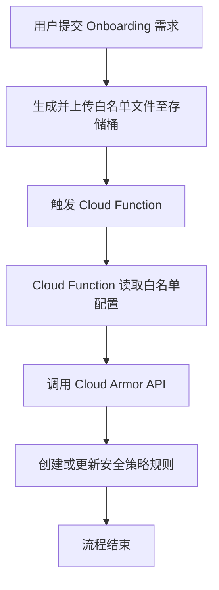

基于存储桶白名单自动创建或更新 Cloud Armor 规则的用户 Onboarding 流程

流程概述

在用户接入（Onboarding）场景下，本流程通过读取存储于 Google Cloud Storage（GCS）中存储桶中的“白名单”配置文件，自动创建或更新 Google Cloud Armor 的安全策略规则。具体来说，当有新用户需要接入系统时，相关的允许访问信息（例如用户的 IP 地址、域名等）会被生成并写入指定的 GCS 存储桶。随后，预先部署的 Cloud Function 脚本将被触发，读取该白名单文件并使用 Cloud Armor API 自动创建或更新相应的安全策略规则，从而放行这些新用户的流量。整个流程实现端到端自动化，避免了手动配置安全规则的繁琐操作。

主要流程如下：
	•	用户提交 Onboarding 请求后，系统生成对应的允许列表（白名单）配置文件。
	•	将白名单文件上传至特定的 GCS 存储桶，触发 Cloud Function 事件。
	•	Cloud Function 读取存储桶中的白名单内容，并调用 Cloud Armor 的 API 接口，自动创建或更新安全策略（Security Policy）及其内的规则。
	•	最终，新用户的访问请求因新增或更新的 Cloud Armor 规则而被允许或拦截，实现安全自动化接入。

流程图

下图示例展示了基于存储桶白名单自动创建或更新 Cloud Armor 规则的完整 Onboarding 流程：

流程图说明：
	•	用户提交 Onboarding 需求： 管理员或自动化系统发起新的用户接入申请。
	•	生成并上传白名单文件： 系统根据申请生成允许列表（如 IP 地址清单），并将文件上传到 GCS 的指定存储桶。
	•	触发 Cloud Function： 存储桶文件变更触发预先部署的 Cloud Function。
	•	读取白名单配置： Cloud Function 读取存储桶中的白名单文件内容。
	•	调用 Cloud Armor API： Cloud Function 解析白名单数据后，调用 Google Cloud Armor 的 API 创建或更新安全策略规则。
	•	创建或更新安全策略规则： 根据白名单动态生成的规则被添加到 Cloud Armor 安全策略中，以放行对应的用户流量。

脚本示例

以下示例展示了在 Bash 脚本中执行主要操作的常用命令。请根据具体环境和安全策略名称进行相应修改和替换。

示例 1：上传白名单文件至 GCS 存储桶

# 将本地的 white_list.txt 上传到指定的 GCS 存储桶
```bash
gsutil cp white_list.txt gs://my-whitelist-bucket/path/to/white_list.txt
```
示例 2：更新 Cloud Armor 安全策略规则

# 假设安全策略名为 USER-ONBOARDING-POLICY，以下命令更新其规则
```bash
gcloud compute security-policies rules update 100 \
    --security-policy=USER-ONBOARDING-POLICY \
    --action=allow \
    --src-ip-ranges="203.0.113.0/24,198.51.100.0/24" \
    --description="更新 Onboarding 白名单"
```
示例 3：创建新的安全策略及规则（如果策略不存在）

# 创建新的 Cloud Armor 安全策略
```bash
gcloud compute security-policies create USER-ONBOARDING-POLICY \
    --description="用户 Onboarding 白名单策略"
```
# 在策略中创建允许规则（优先级设为100）
```basg
gcloud compute security-policies rules create 100 \
    --security-policy=USER-ONBOARDING-POLICY \
    --action=allow \
    --src-ip-ranges="203.0.113.0/24,198.51.100.0/24" \
    --description="允许 Onboarding 白名单 IP"
```
下面的表格列出了上述脚本中使用的常见命令及其功能简介：

脚本命令	描述
```bash
gsutil cp <本地路径> gs://<bucket>/<路径>/	上传本地文件到 GCS 存储桶
gcloud compute security-policies create	创建 Cloud Armor 安全策略
gcloud compute security-policies rules create	向策略中添加新的安全规则
gcloud compute security-policies rules update	更新已有安全策略规则
```
注意事项
	•	权限配置： 确保执行脚本的服务账号（例如 Cloud Function 的服务账号）拥有读取 GCS 存储桶和更新 Cloud Armor 的相应权限。例如需要 roles/storage.objectViewer、roles/cloudfunctions.invoker、roles/compute.securityAdmin 等权限。以下表格列出了各组件所需的 IAM 角色：
```bash
资源组件	需要的 IAM 角色	说明
GCS 存储桶	roles/storage.objectViewer	读取白名单文件
Cloud Function	roles/cloudfunctions.invoker	执行触发函数
Cloud Armor 安全策略	roles/compute.securityAdmin	更新安全策略
```

	•	安全策略命名： 建议预先创建 Cloud Armor 安全策略并统一命名（如 USER-ONBOARDING-POLICY），或者在脚本中进行判断后动态创建。命名、项目和地区要保持一致，避免混淆。
	•	优先级管理： Cloud Armor 安全策略中的规则有优先级（priority）字段，请合理设置，避免与已有规则冲突。通常，将允许访问的白名单规则设置较低的优先级值（优先级值越低优先级越高）。
	•	存储桶触发条件： Cloud Function 应配置为仅针对特定存储桶和文件路径触发，避免对其他文件操作做出响应。同时，可通过前缀（prefix）和后缀（suffix）过滤器提高触发准确性。
	•	白名单文件格式： 确定白名单文件格式（如文本、JSON 或 YAML），并在 Cloud Function 脚本中按对应格式解析。确保文件内容格式正确且不为空，以免导致脚本错误。
	•	日志和监控： 建议在 Cloud Function 中添加日志记录，并监控 Cloud Armor 安全策略的变更，以便追踪自动更新的情况。如果发生错误，可通过日志排查问题。
	•	测试验证： 在生产环境中部署前，先在测试环境中进行验证。确保新的安全策略规则仅允许预期的流量通过，不会意外影响其他服务或造成安全风险。


# Grok 
梳理用户Onboarding流程以创建或更新Cloud Armor规则，并基于存储在Google Cloud Storage (GCS) Bucket中的ipwhitelist.yaml白名单动态生成规则，优先级从30000开始递增。以下是详细的流程设计和实现建议：
1. 流程梳理
用户Onboarding流程的目标是根据用户提供的ipwhitelist.yaml白名单，基于API名称和请求路径（request_path）自动创建或更新Google Cloud Armor规则。流程触发由用户修改白名单信息（存储在GCS Bucket）后，通过Pipeline自动化执行。以下是核心步骤：
	1	触发条件：
	◦	用户更新或上传ipwhitelist.yaml到GCS Bucket。
	◦	GCS事件（如对象创建或更新）触发Cloud Build或类似CI/CD Pipeline。

	2	读取白名单：
	◦	从GCS Bucket下载ipwhitelist.yaml。
	◦	解析YAML文件，提取API名称、请求路径（request_path）和IP白名单（可能包含多个IP或CIDR范围）。

	3	检查现有Cloud Armor规则：
	◦	使用gcloud compute security-policies rules list列出当前Security Policy中的所有规则，获取已使用的优先级（Priority）。
	◦	检查是否存在与当前API名称对应的规则（基于描述或元数据中的API名称）。

	4	确定优先级：
	◦	从30000开始，查找未使用的优先级（递增分配）。
	◦	确保新规则的优先级不会与现有规则冲突。

	5	生成规则表达式：
	◦	根据ipwhitelist.yaml中的IP列表，构造Cloud Armor规则的表达式，例如：request.path.matches('$REQUEST_PATH') && (inIpRange(origin.ip, 'IP1') || inIpRange(origin.ip, 'IP2') ...)
	
	6	创建或更新规则：
	◦	如果规则不存在，使用gcloud compute security-policies rules create创建新规则。
	◦	如果规则存在，使用gcloud compute security-policies rules update更新现有规则。

	7	验证和日志记录：
	◦	验证规则是否成功创建或更新（通过gcloud命令或API调用）。
	◦	记录操作日志（成功/失败），便于调试和审计。

	8	错误处理：
	◦	处理GCS文件读取失败、YAML解析错误、优先级冲突、Cloud Armor API调用失败等异常。
	◦	通知用户或系统管理员（如通过Cloud Logging或Pub/Sub）。

	9	Pipeline集成：
	◦	将上述逻辑封装为脚本（建议使用Python或Bash），在Pipeline中执行。
	◦	Pipeline触发器基于GCS事件，运行环境为Cloud Build或其他CI/CD工具。

2. 实现建议与脚本框架
以下是一个基于Python的脚本框架，用于实现上述流程。假设使用Google Cloud SDK和Python的google-cloud-storage、google-cloud-compute库。
脚本框架
```python
import yaml
from google.cloud import storage
from google.cloud import compute_v1
import subprocess
import logging

# 配置日志
logging.basicConfig(level=logging.INFO)
logger = logging.getLogger(__name__)

# 配置
BUCKET_NAME = "your-bucket-name"
IP_WHITELIST_FILE = "ipwhitelist.yaml"
SECURITY_POLICY_NAME = "your-security-policy"
BASE_PRIORITY = 30000

def download_ip_whitelist(bucket_name, file_name):
    """从GCS下载ipwhitelist.yaml"""
    try:
        storage_client = storage.Client()
        bucket = storage_client.bucket(bucket_name)
        blob = bucket.blob(file_name)
        content = blob.download_as_text()
        return yaml.safe_load(content)
    except Exception as e:
        logger.error(f"Failed to download or parse {file_name}: {e}")
        raise

def get_existing_priorities():
    """获取当前Cloud Armor规则的优先级"""
    try:
        result = subprocess.run(
            ["gcloud", "compute", "security-policies", "rules", "list",
             f"--security-policy={SECURITY_POLICY_NAME}", "--format=value(priority)"],
            capture_output=True, text=True, check=True
        )
        priorities = set(int(p) for p in result.stdout.splitlines() if p)
        return priorities
    except subprocess.CalledProcessError as e:
        logger.error(f"Failed to list priorities: {e}")
        raise

def find_next_priority(existing_priorities):
    """从30000开始查找下一个未使用的优先级"""
    priority = BASE_PRIORITY
    while priority in existing_priorities:
        priority += 1
    return priority

def build_expression(request_path, ip_ranges):
    """构建Cloud Armor规则表达式"""
    ip_conditions = " || inIpRange(origin.ip, '{}')".join(ip_ranges)
    return f"request.path.matches('{request_path}') && ({ip_conditions})"

def rule_exists(api_name):
    """检查是否存在与API名称对应的规则"""
    try:
        result = subprocess.run(
            ["gcloud", "compute", "security-policies", "rules", "list",
             f"--security-policy={SECURITY_POLICY_NAME}", "--format=value(description,priority)"],
            capture_output=True, text=True, check=True
        )
        for line in result.stdout.splitlines():
            if api_name in line:
                priority = int(line.split(",")[1])
                return priority
        return None
    except subprocess.CalledProcessError as e:
        logger.error(f"Failed to check existing rules: {e}")
        raise

def create_or_update_rule(priority, api_name, expression, action="allow"):
    """创建或更新Cloud Armor规则"""
    command = [
        "gcloud", "compute", "security-policies", "rules",
        "create" if not rule_exists(api_name) else "update",
        str(priority),
        f"--security-policy={SECURITY_POLICY_NAME}",
        f"--description={api_name}",
        f"--action={action}",
        f"--expression={expression}"
    ]
    try:
        subprocess.run(command, check=True)
        logger.info(f"Rule for {api_name} {'created' if not rule_exists(api_name) else 'updated'} with priority {priority}")
    except subprocess.CalledProcessError as e:
        logger.error(f"Failed to create/update rule for {api_name}: {e}")
        raise

def main():
    # 1. 读取白名单
    whitelist = download_ip_whitelist(BUCKET_NAME, IP_WHITELIST_FILE)
    
    # 2. 获取现有优先级
    existing_priorities = get_existing_priorities()
    
    # 3. 遍历白名单中的每个API配置
    for config in whitelist.get("apis", []):
        api_name = config.get("api_name")
        request_path = config.get("request_path")
        ip_ranges = config.get("ip_ranges", [])
        
        if not all([api_name, request_path, ip_ranges]):
            logger.warning(f"Skipping invalid config: {config}")
            continue
        
        # 4. 检查规则是否存在
        existing_priority = rule_exists(api_name)
        
        # 5. 确定优先级
        priority = existing_priority if existing_priority else find_next_priority(existing_priorities)
        
        # 6. 构建表达式
        expression = build_expression(request_path, ip_ranges)
        
        # 7. 创建或更新规则
        create_or_update_rule(priority, api_name, expression)
        
        # 8. 更新优先级集合（用于下一次循环）
        if not existing_priority:
            existing_priorities.add(priority)

if __name__ == "__main__":
    main()
```
ipwhitelist.yaml 示例
```yaml
apis:
  - api_name: "user-api"
    request_path: "/api/v1/user/*"
    ip_ranges:
      - "119.29.28.23/23"
      - "118.26.24.26/32"
  - api_name: "order-api"
    request_path: "/api/v1/order/*"
    ip_ranges:
      - "203.0.113.0/24"
```
Pipeline 配置（Cloud Build 示例）
在cloudbuild.yaml中定义Pipeline步骤，触发于GCS对象变化：
```yaml
steps:
  - name: 'python:3.9'
    entrypoint: 'bash'
    args:
      - '-c'
      - |
        pip install pyyaml google-cloud-storage
        python update_cloud_armor.py
triggers:
  - event: 'storage.objects.create'
    bucket: 'your-bucket-name'
    object: 'ipwhitelist.yaml'
```
3. 关键点说明
	1	优先级管理：
	◦	从30000开始递增，避免与默认规则（如1000、2000）冲突。
	◦	使用find_next_priority确保优先级唯一。
	2	规则唯一性：
	◦	以api_name作为规则的唯一标识，存储在--description中，便于查找和更新。
	◦	如果规则存在，执行更新操作；否则，创建新规则。
	3	表达式生成：
	◦	动态生成inIpRange条件，支持多个IP/CIDR。
	◦	使用request.path.matches确保路径匹配精确。
	4	Pipeline触发：
	◦	通过GCS事件触发Cloud Build，自动化执行脚本。
	◦	确保Pipeline有权限操作GCS和Cloud Armor（IAM角色如roles/compute.securityAdmin）。
	5	错误处理：
	◦	捕获GCS读取、YAML解析、gcloud命令执行等异常。
	◦	通过Cloud Logging记录详细日志，便于排查。
	6	扩展性：
	◦	支持多API配置，每个API独立生成规则。
	◦	可扩展为支持其他Cloud Armor动作（如deny）或复杂表达式。
4. 部署与测试
	1	权限配置：
	◦	确保服务账号具有以下权限：
	▪	storage.objects.get（读取GCS文件）
	▪	compute.securityPolicies.get/update（操作Cloud Armor）
	◦	使用gcloud iam service-accounts配置。
	2	测试步骤：
	◦	上传示例ipwhitelist.yaml到GCS。
	◦	触发Pipeline，验证Cloud Armor规则是否正确创建/更新。
	◦	使用gcloud compute security-policies rules list检查规则。
	3	监控与告警：
	◦	配置Cloud Monitoring，监控Pipeline执行状态。
	◦	设置告警策略，通知失败事件。
5. 优化建议
	•	批量处理：如果白名单包含大量API，考虑并行处理规则创建/更新以提高效率。
	•	规则清理：定期检查并删除不再使用的规则（例如，API下线时）。
	•	版本控制：在GCS中为ipwhitelist.yaml启用版本控制，防止误操作。
	•	表达式验证：在生成规则前，验证IP范围和路径表达式的合法性。
如果需要进一步细化某个部分（例如Pipeline配置、错误处理逻辑）或提供其他语言（如Bash）的实现，请告诉我！


# Gemini

好的，我们来梳理一下这个用户 Onboarding 流程，用于自动化地将 GCS Bucket 中的 IP 白名单添加到 Cloud Armor 安全策略规则中。

**目标:**

当用户更新存储在 GCS Bucket 中的 `ipwhitelist.yaml` 文件时，触发一个 Pipeline，该 Pipeline 自动创建或更新 Cloud Armor 中对应的安全策略规则。规则基于 API 名称（作为描述）和请求路径，允许来自白名单 IP 的访问。规则优先级从 30000 开始递增管理。

**核心要素:**

1.  **输入:** `ipwhitelist.yaml` 文件 (GCS Bucket), API 名称, 请求路径 (文件内定义), 目标 Cloud Armor 安全策略名称。
2.  **处理:** Pipeline (Cloud Build, Jenkins, GitLab CI, GitHub Actions 等) 执行脚本。
3.  **输出:** Cloud Armor 中创建或更新的规则。
4.  **关键逻辑:**
    *   从 GCS 下载并解析 YAML 文件。
    *   根据 API 名称（作为规则描述）检查 Cloud Armor 中是否已存在规则。
    *   如果存在，更新该规则的 IP 列表和路径。
    *   如果不存在，计算新的优先级（从 30000 开始，找当前 >=30000 的最大优先级 + 1），然后创建新规则。
    *   构建 Cloud Armor CEL 表达式。

**建议的 `ipwhitelist.yaml` 文件结构:**

为了清晰起见，建议每个 YAML 文件对应一个 API 的白名单规则。

```yaml
# gs://<YOUR_BUCKET_NAME>/<user_or_api_identifier>/ipwhitelist.yaml
api_name: "unique-api-identifier- V1"        # 用于规则的 description，必须在策略内唯一
request_path_pattern: "/v1/service/resource/.*" # 用于 request.path.matches() 的正则表达式
ip_ranges:
  - "119.29.28.23/32"    # 单个 IP 通常用 /32
  - "118.26.24.26/32"
  - "10.10.0.0/16"       # IP 段
  # 可以有更多 IP 或 CIDR 段
```

**自动化处理流程 (Pipeline Steps):**

1.  **触发 (Trigger):**
    *   配置 GCS Bucket 的对象变更通知 (Object Change Notification)。
    *   该通知可以触发 Cloud Functions, Cloud Run, 或直接触发 Cloud Build。推荐使用 Cloud Build，因为它内置了 `gcloud` 和 `gsutil`，并且易于集成。

2.  **初始化 (Pipeline Start):**
    *   Pipeline 作业开始。
    *   获取触发事件的信息，例如被修改的 GCS 对象路径 (`gs://<BUCKET_NAME>/<PATH>/ipwhitelist.yaml`)。
    *   设置必要的环境变量，如 `PROJECT_ID`, `SECURITY_POLICY_NAME` (目标 Cloud Armor 策略)。

3.  **下载和解析白名单 (Fetch & Parse):**
    *   使用 `gsutil cp` 将 `ipwhitelist.yaml` 文件下载到 Pipeline 的工作环境中。
    *   使用 YAML 解析工具 (如 Python 的 `PyYAML`, Go 的 `yaml`库, 或 Linux 工具 `yq`) 读取文件内容。
    *   提取 `api_name`, `request_path_pattern`, 和 `ip_ranges` 列表。
    *   **校验:** 检查 `api_name`, `request_path_pattern` 是否存在，`ip_ranges` 是否为非空列表。如果格式错误或 IP 列表为空，则记录错误并终止 Pipeline。

4.  **构建 IP 条件表达式 (Build IP Expression):**
    *   遍历 `ip_ranges` 列表。
    *   动态构建 Cloud Armor CEL 表达式中的 `inIpRange` 部分。
    *   示例逻辑 (伪代码):
        ```
        ip_conditions = []
        for ip in ip_ranges:
            ip_conditions.append(f"inIpRange(origin.ip, '{ip}')")
        ip_expression_part = " || ".join(ip_conditions)
        # => "inIpRange(origin.ip, '119.29.28.23/32') || inIpRange(origin.ip, '118.26.24.26/32') || inIpRange(origin.ip, '10.10.0.0/16')"
        ```
    *   完整的 CEL 表达式:
        ```
        full_expression = f"request.path.matches('{request_path_pattern}') && ({ip_expression_part})"
        # => "request.path.matches('/v1/service/resource/.*') && (inIpRange(origin.ip, '119.29.28.23/32') || ... )"
        ```

5.  **检查现有规则 (Check Existing Rule):**
    *   使用 `gcloud compute security-policies rules list` 并通过 `--filter` 查找描述 (description) 与 `api_name` 匹配的规则。
    *   命令:
        ```bash
        EXISTING_PRIORITY=$(gcloud compute security-policies rules list $SECURITY_POLICY_NAME \
            --project=$PROJECT_ID \
            --filter="description='$API_NAME'" \
            --format="value(priority)" 2>/dev/null) # 2>/dev/null 抑制找不到时的错误输出
        ```
    *   判断 `EXISTING_PRIORITY` 变量是否为空。

6.  **执行操作 (Create or Update):**

    *   **情况 A: 规则已存在 (EXISTING_PRIORITY 非空)**
        *   准备 `gcloud update` 命令。
        *   命令:
            ```bash
            gcloud compute security-policies rules update $EXISTING_PRIORITY \
                --security-policy=$SECURITY_POLICY_NAME \
                --project=$PROJECT_ID \
                --description="$API_NAME" \
                --action="allow" \
                --expression="$FULL_EXPRESSION"
            ```
        *   执行命令并检查退出码。

    *   **情况 B: 规则不存在 (EXISTING_PRIORITY 为空)**
        *   **计算新优先级:**
            1.  获取所有优先级 >= 30000 的规则:
                ```bash
                PRIORITIES=$(gcloud compute security-policies rules list $SECURITY_POLICY_NAME \
                    --project=$PROJECT_ID \
                    --filter="priority >= 30000" \
                    --sort-by ~priority \
                    --format="value(priority)" 2>/dev/null)
                ```
            2.  找到当前最大的优先级。如果列表为空，则基础优先级为 30000；否则为 `max(PRIORITIES) + 1`。
                ```bash
                if [ -z "$PRIORITIES" ]; then
                    NEW_PRIORITY=30000
                else
                    # 获取最后一行 (即最高优先级)
                    MAX_PRIORITY=$(echo "$PRIORITIES" | tail -n 1)
                    NEW_PRIORITY=$((MAX_PRIORITY + 1))
                fi
                # 可选：检查 NEW_PRIORITY 是否超过 Cloud Armor 优先级上限 (通常 2147483647)
                ```
        *   准备 `gcloud create` 命令。
        *   命令:
            ```bash
            gcloud compute security-policies rules create $NEW_PRIORITY \
                --security-policy=$SECURITY_POLICY_NAME \
                --project=$PROJECT_ID \
                --description="$API_NAME" \
                --action="allow" \
                --expression="$FULL_EXPRESSION"
            ```
        *   执行命令并检查退出码。

7.  **结果处理与日志 (Logging & Cleanup):**
    *   记录操作是创建还是更新，以及使用的优先级和表达式。
    *   如果 `gcloud` 命令失败，记录详细错误信息，并使 Pipeline 失败。
    *   清理下载的临时文件。

**示例 Pipeline 脚本片段 (Bash - 适用于 Cloud Build):**

假设在 Cloud Build 中运行，`$PROJECT_ID`, `$SECURITY_POLICY_NAME` 已设置，触发信息提供了 `$GCS_OBJECT_PATH` (例如 `gs://my-bucket/api-x/ipwhitelist.yaml`)。

```bash
#!/bin/bash
set -e # Exit immediately if a command exits with a non-zero status.

# --- Configuration ---
# SECURITY_POLICY_NAME="your-security-policy" # Should be passed as env var or substitution
# PROJECT_ID="your-gcp-project"            # Usually available in Cloud Build
# GCS_OBJECT_PATH="gs://..."             # From trigger event

LOCAL_YAML_FILE="ipwhitelist.yaml"
MIN_PRIORITY=30000

# --- 1. Download YAML ---
echo "Downloading whitelist from $GCS_OBJECT_PATH..."
gsutil cp "$GCS_OBJECT_PATH" "$LOCAL_YAML_FILE"

# --- 2. Parse YAML (using yq - requires yq binary in the build environment) ---
echo "Parsing YAML file..."
# Install yq if needed: https://github.com/mikefarah/yq/#install
# Example using yq v4+
API_NAME=$(yq e '.api_name' "$LOCAL_YAML_FILE")
REQUEST_PATH=$(yq e '.request_path_pattern' "$LOCAL_YAML_FILE")
# Read IP ranges into a Bash array (requires yq 4.18+)
mapfile -t IP_RANGES < <(yq e '.ip_ranges[]' "$LOCAL_YAML_FILE")

# --- 3. Validate ---
if [ -z "$API_NAME" ]; then echo "Error: api_name is missing in YAML."; exit 1; fi
if [ -z "$REQUEST_PATH" ]; then echo "Error: request_path_pattern is missing in YAML."; exit 1; fi
if [ ${#IP_RANGES[@]} -eq 0 ]; then echo "Error: ip_ranges is empty or missing in YAML."; exit 1; fi
echo "Found API Name: $API_NAME"
echo "Found Request Path: $REQUEST_PATH"
echo "Found IP Ranges: ${IP_RANGES[*]}"

# --- 4. Build CEL Expression ---
IP_CONDITIONS=""
for ip in "${IP_RANGES[@]}"; do
  # Basic validation (optional, gcloud will validate too)
  if [[ ! "$ip" =~ ^[0-9]+\.[0-9]+\.[0-9]+\.[0-9]+/[0-9]{1,2}$ ]]; then
      echo "Warning: Skipping potentially invalid CIDR format: $ip"
      continue # Skip this entry
  fi
  if [ -z "$IP_CONDITIONS" ]; then
    IP_CONDITIONS="inIpRange(origin.ip, '$ip')"
  else
    IP_CONDITIONS="$IP_CONDITIONS || inIpRange(origin.ip, '$ip')"
  fi
done

if [ -z "$IP_CONDITIONS" ]; then
    echo "Error: No valid IP conditions could be generated from the list."
    exit 1
fi

FULL_EXPRESSION="request.path.matches('$REQUEST_PATH') && ($IP_CONDITIONS)"
echo "Generated CEL Expression: $FULL_EXPRESSION"

# --- 5. Check Existing Rule ---
echo "Checking for existing rule with description: $API_NAME..."
EXISTING_PRIORITY=$(gcloud compute security-policies rules list "$SECURITY_POLICY_NAME" \
    --project="$PROJECT_ID" \
    --filter="description='$API_NAME'" \
    --format="value(priority)" 2>/dev/null || true) # Use || true to prevent exit on error if not found

# --- 6. Create or Update ---
if [ -n "$EXISTING_PRIORITY" ]; then
    echo "Rule found with priority $EXISTING_PRIORITY. Updating rule..."
    gcloud compute security-policies rules update "$EXISTING_PRIORITY" \
        --security-policy="$SECURITY_POLICY_NAME" \
        --project="$PROJECT_ID" \
        --description="$API_NAME" \
        --action="allow" \
        --expression="$FULL_EXPRESSION"
    echo "Rule updated successfully."
else
    echo "No existing rule found. Creating new rule..."
    # Calculate new priority
    echo "Calculating new priority starting from $MIN_PRIORITY..."
    PRIORITIES=$(gcloud compute security-policies rules list "$SECURITY_POLICY_NAME" \
        --project="$PROJECT_ID" \
        --filter="priority >= $MIN_PRIORITY" \
        --sort-by ~priority \
        --format="value(priority)" 2>/dev/null || true)

    if [ -z "$PRIORITIES" ]; then
        NEW_PRIORITY=$MIN_PRIORITY
    else
        MAX_PRIORITY=$(echo "$PRIORITIES" | tail -n 1)
        # Handle potential non-numeric output if filtering fails unexpectedly
        if [[ "$MAX_PRIORITY" =~ ^[0-9]+$ ]]; then
             NEW_PRIORITY=$((MAX_PRIORITY + 1))
        else
             echo "Error: Could not determine maximum priority. Found: '$MAX_PRIORITY'"
             exit 1
        fi
    fi
    echo "Calculated new priority: $NEW_PRIORITY"

    gcloud compute security-policies rules create "$NEW_PRIORITY" \
        --security-policy="$SECURITY_POLICY_NAME" \
        --project="$PROJECT_ID" \
        --description="$API_NAME" \
        --action="allow" \
        --expression="$FULL_EXPRESSION"
    echo "Rule created successfully with priority $NEW_PRIORITY."
fi

# --- 7. Cleanup ---
rm "$LOCAL_YAML_FILE"
echo "Whitelist processing complete for $API_NAME."

```

**先决条件和注意事项:**

1.  **IAM 权限:** 执行 Pipeline 的服务账号 (例如 Cloud Build 服务账号) 需要以下 IAM 角色或等效权限：
    *   `storage.objectViewer` (读取 GCS Bucket)
    *   `compute.securityPolicies.get`
    *   `compute.securityPolicies.list`
    *   `compute.securityPolicies.updateRule` (或 `compute.securityPolicies.update`)
    *   `compute.securityPolicies.createRule` (或 `compute.securityPolicies.update`)
    *   更简单的可能是授予 `roles/compute.securityAdmin`，但权限较大，请根据最小权限原则评估。
2.  **工具:** Pipeline 环境需要 `gcloud` CLI, `gsutil`, 以及 YAML 解析工具 (`yq` 或脚本语言库)。Cloud Build 默认包含 `gcloud` 和 `gsutil`。
3.  **错误处理:** 脚本应包含更健壮的错误处理，例如对 `gcloud` 命令失败的捕获和日志记录。
4.  **并发:** 如果多个用户可能同时更新 *不同* API 的白名单，此流程是安全的，因为每个 API 对应一个规则。如果可能同时为 *同一* API 触发 Pipeline（不太可能，但可能发生），更新操作 (`gcloud update`) 通常是幂等的最后写入者获胜。创建新规则时的优先级计算存在微小的竞争条件，但 `gcloud create` 如果遇到优先级冲突会失败，Pipeline 应能捕获此错误并可能重试。
5.  **规则删除:** 此流程不处理 API 下线时删除对应规则的情况。需要一个单独的流程或手动步骤来清理不再需要的规则。
6.  **API 名称唯一性:** 流程依赖 `api_name` (作为 description) 在 Cloud Armor 策略内的唯一性来查找和更新规则。确保用户提供的 `api_name` 是唯一的。
7.  **Cloud Armor 限制:** 注意 Cloud Armor 的规则数量限制。

这个流程和脚本提供了一个坚实的基础，你可以根据你的具体 Pipeline 技术和错误处理需求进行调整。

好的，我们来总结一下这个自动化 Cloud Armor 规则 onboarding 流程的步骤。

**中文版本 (Chinese Version):**

**自动化 Cloud Armor IP 白名单规则 Onboarding 流程**

1.  **触发 (Trigger):**
    *   用户更新或上传位于指定 GCS Bucket 路径下的 `ipwhitelist.yaml` 文件。
    *   GCS 对象变更通知触发自动化 Pipeline (例如 Cloud Build)。

2.  **初始化与获取 (Initialization & Fetch):**
    *   Pipeline 启动，获取触发事件信息（如被修改的 GCS 文件路径）。
    *   Pipeline 从 GCS 下载对应的 `ipwhitelist.yaml` 文件到工作环境。

3.  **解析与验证 (Parse & Validate):**
    *   使用 YAML 解析工具读取文件内容。
    *   提取关键信息：`api_name` (用于规则描述), `request_path_pattern` (用于路径匹配), `ip_ranges` (IP 地址/CIDR 列表)。
    *   验证这些信息是否存在且格式基本正确（例如，IP 列表不能为空）。

4.  **构建规则表达式 (Build Expression):**
    *   根据 `ip_ranges` 列表，动态生成 Cloud Armor CEL 表达式的 IP 匹配部分 ( `inIpRange(...) || inIpRange(...) ...` )。
    *   将 IP 匹配部分与 `request_path_pattern` 结合，形成完整的 CEL 表达式 ( `request.path.matches(...) && (IP 匹配部分)` )。

5.  **检查规则存在性 (Check Rule Existence):**
    *   使用 `gcloud` 命令查询目标 Cloud Armor 安全策略。
    *   通过 `--filter` 参数，根据 `description` 字段等于提取的 `api_name` 来查找是否已存在对应的规则。

6.  **执行创建或更新 (Execute Create or Update):**
    *   **如果规则已存在:**
        *   获取现有规则的优先级。
        *   执行 `gcloud compute security-policies rules update` 命令，使用现有优先级更新规则的 `expression` 为新构建的 CEL 表达式。
    *   **如果规则不存在:**
        *   执行 `gcloud compute security-policies rules list` 获取所有优先级 `>= 30000` 的规则。
        *   计算新优先级：取当前 `>= 30000` 的最大优先级加 1；如果不存在此类规则，则使用 `30000`。
        *   执行 `gcloud compute security-policies rules create` 命令，使用计算出的新优先级、`api_name` 作为描述、`allow` 作为动作，以及新构建的 CEL 表达式来创建新规则。

7.  **记录与清理 (Log & Cleanup):**
    *   记录本次操作是创建还是更新，以及使用的优先级和最终的规则配置。
    *   报告成功或失败状态。
    *   清理 Pipeline 工作环境中的临时文件（如下载的 `ipwhitelist.yaml`）。

---

**英文版本 (English Version):**

**Automated Cloud Armor IP Whitelist Rule Onboarding Process**

1.  **Trigger:**
    *   User updates or uploads the `ipwhitelist.yaml` file located in a specified GCS Bucket path.
    *   A GCS Object Change Notification triggers an automated Pipeline (e.g., Cloud Build).

2.  **Initialization & Fetch:**
    *   The Pipeline starts and retrieves information about the triggering event (e.g., the modified GCS file path).
    *   The Pipeline downloads the corresponding `ipwhitelist.yaml` file from GCS to its workspace.

3.  **Parse & Validate:**
    *   Use a YAML parsing tool to read the file content.
    *   Extract key information: `api_name` (used for rule description), `request_path_pattern` (for path matching), `ip_ranges` (list of IP addresses/CIDRs).
    *   Validate that this information exists and is in a basically correct format (e.g., the IP list is not empty).

4.  **Build Rule Expression:**
    *   Dynamically generate the IP matching part of the Cloud Armor CEL expression ( `inIpRange(...) || inIpRange(...) ...` ) based on the `ip_ranges` list.
    *   Combine the IP matching part with the `request_path_pattern` to form the complete CEL expression ( `request.path.matches(...) && (IP matching part)` ).

5.  **Check Rule Existence:**
    *   Use the `gcloud` command to query the target Cloud Armor security policy.
    *   Use the `--filter` parameter to check if a rule with the `description` field equal to the extracted `api_name` already exists.

6.  **Execute Create or Update:**
    *   **If the Rule Exists:**
        *   Retrieve the priority of the existing rule.
        *   Execute the `gcloud compute security-policies rules update` command, using the existing priority to update the rule's `expression` with the newly built CEL expression.
    *   **If the Rule Does Not Exist:**
        *   Execute `gcloud compute security-policies rules list` to get all rules with priority `>= 30000`.
        *   Calculate a new priority: Take the current maximum priority `>= 30000` and add 1; if no such rules exist, use `30000`.
        *   Execute the `gcloud compute security-policies rules create` command, using the calculated new priority, the `api_name` as the description, `allow` as the action, and the newly built CEL expression to create the new rule.

7.  **Log & Cleanup:**
    *   Log whether a create or update operation was performed, the priority used, and the final rule configuration.
    *   Report the success or failure status.
    *   Clean up temporary files (like the downloaded `ipwhitelist.yaml`) from the Pipeline workspace.


# Claude 
我将为您梳理一个完整的用户 onboarding 流程，用于从 ipwhitelist.yaml 创建或更新 Cloud Armor 规则。

## 流程概述

1. 用户提供 ipwhitelist.yaml 文件并上传到 GCP Buckets
2. 触发 Pipeline 检测文件变更
3. 读取并解析 YAML 文件
4. 检索现有 Cloud Armor 规则
5. 为每个 API 创建或更新规则
6. 记录操作日志并通知用户

## 详细设计方案

### YAML 文件结构设计

首先，让我设计一个合理的 ipwhitelist.yaml 结构：

```yaml
apis:
  - name: user-management-api
    path: "/api/v1/users/*"
    whitelist:
      - 119.29.28.0/23
      - 118.26.24.26/32
      - 192.168.1.0/24
  
  - name: payment-processing-api
    path: "/api/v1/payments/*"
    whitelist:
      - 119.29.28.0/23
      - 203.0.113.0/24
```

### 脚本实现

以下是实现流程的 Bash 脚本示例：​​​​​​​​​​​​​​​​
```bash
#!/bin/bash

# 配置参数
BUCKET_NAME="your-config-bucket"
YAML_PATH="configs/ipwhitelist.yaml"
SECURITY_POLICY="your-security-policy"
LOG_FILE="/var/log/cloud-armor-update.log"
PRIORITY_START=30000

# 函数：记录日志
log() {
  local message="$1"
  local timestamp=$(date +"%Y-%m-%d %H:%M:%S")
  echo "[$timestamp] $message" | tee -a "$LOG_FILE"
}

# 函数：下载YAML配置
download_config() {
  log "正在从 gs://$BUCKET_NAME/$YAML_PATH 下载配置..."
  gsutil cp "gs://$BUCKET_NAME/$YAML_PATH" /tmp/ipwhitelist.yaml
  if [ $? -ne 0 ]; then
    log "错误：无法下载配置文件"
    exit 1
  fi
}

# 函数：获取可用的优先级
get_next_priority() {
  log "获取现有规则优先级..."
  local existing_priorities=$(gcloud compute security-policies rules list --security-policy="$SECURITY_POLICY" --format="value(priority)" | grep -E '^[3][0-9]{4}$' | sort -n)
  
  if [ -z "$existing_priorities" ]; then
    log "没有找到现有规则，使用起始优先级 $PRIORITY_START"
    echo $PRIORITY_START
    return
  fi
  
  local last_priority=$(echo "$existing_priorities" | tail -1)
  local next_priority=$((last_priority + 1))
  
  # 确保优先级不超过 Cloud Armor 限制
  if [ $next_priority -ge 65000 ]; then
    log "警告：优先级接近上限，重新从 $PRIORITY_START 开始查找空隙"
    
    # 寻找空隙
    local prev_priority=$PRIORITY_START
    for priority in $existing_priorities; do
      if [ $((priority - prev_priority)) -gt 1 ]; then
        next_priority=$((prev_priority + 1))
        break
      fi
      prev_priority=$priority
    done
  fi
  
  log "下一个可用优先级: $next_priority"
  echo $next_priority
}

# 函数：检查API规则是否存在
check_rule_exists() {
  local api_name="$1"
  
  log "检查API '$api_name' 的规则是否存在..."
  local rule_id=$(gcloud compute security-policies rules list \
    --security-policy="$SECURITY_POLICY" \
    --filter="description~$api_name" \
    --format="value(priority)")
  
  if [ -n "$rule_id" ]; then
    log "发现现有规则，优先级为 $rule_id"
    echo $rule_id
  else
    log "没有找到现有规则"
    echo ""
  fi
}

# 函数：构建IP范围表达式
build_ip_range_expression() {
  local ip_list=("$@")
  local expression=""
  
  for ip in "${ip_list[@]}"; do
    if [ -n "$expression" ]; then
      expression="$expression || "
    fi
    expression="${expression}inIpRange(origin.ip, '$ip')"
  done
  
  echo "$expression"
}

# 函数：创建或更新规则
update_rule() {
  local api_name="$1"
  local path="$2"
  local ip_ranges=("${@:3}")
  
  # 检查规则是否存在
  local existing_rule=$(check_rule_exists "$api_name")
  local ip_expression=$(build_ip_range_expression "${ip_ranges[@]}")
  local full_expression="request.path.matches('$path') && ($ip_expression)"
  
  if [ -n "$existing_rule" ]; then
    # 更新现有规则
    log "更新规则 '$api_name'，优先级 $existing_rule..."
    gcloud compute security-policies rules update "$existing_rule" \
      --security-policy="$SECURITY_POLICY" \
      --description="$api_name" \
      --action=allow \
      --expression="$full_expression"
    
    if [ $? -eq 0 ]; then
      log "成功更新规则 '$api_name'"
    else
      log "更新规则 '$api_name' 失败"
    fi
  else
    # 创建新规则
    local priority=$(get_next_priority)
    
    log "创建新规则 '$api_name'，优先级 $priority..."
    gcloud compute security-policies rules create "$priority" \
      --security-policy="$SECURITY_POLICY" \
      --description="$api_name" \
      --action=allow \
      --expression="$full_expression"
    
    if [ $? -eq 0 ]; then
      log "成功创建规则 '$api_name'"
    else
      log "创建规则 '$api_name' 失败"
    fi
  fi
}

# 函数：解析YAML并更新规则
process_yaml() {
  log "开始处理 YAML 配置..."
  
  # 这里我们使用 yq (https://github.com/mikefarah/yq) 来解析YAML
  # 请确保已安装 yq
  local api_count=$(yq e '.apis | length' /tmp/ipwhitelist.yaml)
  
  for ((i=0; i<$api_count; i++)); do
    local api_name=$(yq e ".apis[$i].name" /tmp/ipwhitelist.yaml)
    local path=$(yq e ".apis[$i].path" /tmp/ipwhitelist.yaml)
    
    log "处理 API: $api_name, 路径: $path"
    
    # 获取白名单IP列表
    local ip_list=()
    local ip_count=$(yq e ".apis[$i].whitelist | length" /tmp/ipwhitelist.yaml)
    
    for ((j=0; j<$ip_count; j++)); do
      local ip=$(yq e ".apis[$i].whitelist[$j]" /tmp/ipwhitelist.yaml)
      ip_list+=("$ip")
    done
    
    # 更新规则
    update_rule "$api_name" "$path" "${ip_list[@]}"
  done
}

# 主流程
main() {
  log "===== 开始 Cloud Armor IP 白名单更新流程 ====="
  
  # 下载配置
  download_config
  
  # 处理YAML并更新规则
  process_yaml
  
  log "===== Cloud Armor IP 白名单更新完成 ====="
}

# 执行主流程
main
```
### 完整的 Cloud Build 流水线配置

下面是一个完整的 Cloud Build 流水线配置，用于自动化执行上述脚本：​​​​​​​​​​​​​​​​
```bash
steps:
# 安装依赖工具
- name: 'gcr.io/cloud-builders/apt-get'
  args: ['update']
- name: 'gcr.io/cloud-builders/apt-get'
  args: ['install', '-y', 'wget']

# 安装 yq 用于解析 YAML
- name: 'gcr.io/cloud-builders/bash'
  entrypoint: 'bash'
  args:
  - '-c'
  - |
    wget https://github.com/mikefarah/yq/releases/download/v4.25.2/yq_linux_amd64 -O /usr/bin/yq && chmod +x /usr/bin/yq

# 复制脚本并授予执行权限
- name: 'gcr.io/cloud-builders/gsutil'
  args: ['cp', 'gs://${_SCRIPTS_BUCKET}/cloud-armor-update.sh', '/workspace/cloud-armor-update.sh']
- name: 'gcr.io/cloud-builders/bash'
  args: ['chmod', '+x', '/workspace/cloud-armor-update.sh']

# 执行更新脚本
- name: 'gcr.io/google.com/cloudsdktool/cloud-sdk'
  entrypoint: 'bash'
  args: ['/workspace/cloud-armor-update.sh']
  env:
  - 'BUCKET_NAME=${_CONFIG_BUCKET}'
  - 'YAML_PATH=${_YAML_PATH}'
  - 'SECURITY_POLICY=${_SECURITY_POLICY}'

# 发送完成通知
- name: 'gcr.io/cloud-builders/curl'
  entrypoint: 'bash'
  args:
  - '-c'
  - |
    if [ $CLOUDBUILD_STATUS = "SUCCESS" ]; then
      curl -X POST -H "Content-Type: application/json" \
        -d '{"text":"Cloud Armor IP 白名单更新成功"}' \
        ${_NOTIFICATION_WEBHOOK}
    else
      curl -X POST -H "Content-Type: application/json" \
        -d '{"text":"Cloud Armor IP 白名单更新失败"}' \
        ${_NOTIFICATION_WEBHOOK}
    fi

# 构建超时设置
timeout: '1800s'

# 替换变量
substitutions:
  _CONFIG_BUCKET: 'your-config-bucket' # 配置文件所在的 Bucket
  _YAML_PATH: 'configs/ipwhitelist.yaml' # YAML 文件路径
  _SCRIPTS_BUCKET: 'your-scripts-bucket' # 脚本所在的 Bucket
  _SECURITY_POLICY: 'your-security-policy' # Cloud Armor 安全策略名称
  _NOTIFICATION_WEBHOOK: 'https://chat.googleapis.com/v1/spaces/xxx/messages' # 通知 Webhook
```
### 自动触发设置

为了自动检测 Bucket 中的 YAML 文件变更并触发流水线，我们可以使用 Cloud Storage 触发器。以下是设置方法：​​​​​​​​​​​​​​​​
```bash
#!/bin/bash

# 配置参数
PROJECT_ID="your-project-id"
CONFIG_BUCKET="your-config-bucket"
YAML_PATH="configs/ipwhitelist.yaml"
BUILD_CONFIG_PATH="cloud-build-configs/cloud-armor-update.yaml"
TRIGGER_NAME="ip-whitelist-update-trigger"
TRIGGER_DESCRIPTION="自动触发 Cloud Armor IP 白名单更新"

# 创建 Cloud Build 触发器
gcloud beta builds triggers create cloud-storage \
  --name="$TRIGGER_NAME" \
  --project="$PROJECT_ID" \
  --description="$TRIGGER_DESCRIPTION" \
  --bucket="$CONFIG_BUCKET" \
  --path="$YAML_PATH" \
  --build-config="$BUILD_CONFIG_PATH" \
  --include-logs-with-status \
  --service-account="projects/$PROJECT_ID/serviceAccounts/cloud-armor-updater@$PROJECT_ID.iam.gserviceaccount.com"

echo "Cloud Build 触发器已创建成功！"
```
### 权限设置

为了正确运行更新脚本，我们需要设置适当的权限：​​​​​​​​​​​​​​​​
```bash
#!/bin/bash

# 配置参数
PROJECT_ID="your-project-id"
SERVICE_ACCOUNT="cloud-armor-updater"
SA_EMAIL="$SERVICE_ACCOUNT@$PROJECT_ID.iam.gserviceaccount.com"

# 创建服务账号
gcloud iam service-accounts create "$SERVICE_ACCOUNT" \
  --project="$PROJECT_ID" \
  --description="用于更新 Cloud Armor 安全规则的服务账号" \
  --display-name="Cloud Armor Updater"

# 授予存储桶读取权限
gcloud storage buckets add-iam-policy-binding "gs://your-config-bucket" \
  --member="serviceAccount:$SA_EMAIL" \
  --role="roles/storage.objectViewer"

# 授予 Cloud Armor 规则编辑权限
gcloud projects add-iam-policy-binding "$PROJECT_ID" \
  --member="serviceAccount:$SA_EMAIL" \
  --role="roles/compute.securityAdmin"

# 授予 Cloud Build 服务账号使用自定义服务账号的权限
gcloud iam service-accounts add-iam-policy-binding "$SA_EMAIL" \
  --member="serviceAccount:$PROJECT_ID@cloudbuild.gserviceaccount.com" \
  --role="roles/iam.serviceAccountUser"

echo "权限设置完成！"
```

## 完整的用户 Onboarding 流程

基于上述设计，以下是完整的用户 Onboarding 流程：

1. **初始设置（一次性）**：
   - 创建专用服务账号
   - 设置必要的 IAM 权限
   - 创建 Cloud Build 触发器
   - 将更新脚本上传到脚本存储桶
   - 创建 Cloud Build 配置

2. **用户 Onboarding 流程**：
   - 与用户沟通所需的 YAML 格式和结构
   - 协助用户准备 ipwhitelist.yaml 文件（按照上述 YAML 结构）
   - 用户将 YAML 文件上传到指定的 GCS 存储桶路径
   - 系统自动触发 Cloud Build 流水线
   - 流水线执行以下步骤：
     - 安装必要的工具（yq 等）
     - 下载用户的 YAML 配置
     - 解析 YAML 文件中的 API 和 IP 白名单信息
     - 对每个 API：
       - 检查是否已存在相应规则
       - 如果存在，更新规则
       - 如果不存在，从 30000 开始查找可用优先级并创建规则
     - 记录操作日志
     - 发送操作完成通知

3. **规则更新流程**：
   - 用户修改 ipwhitelist.yaml 文件并上传到同一路径
   - 系统自动检测文件变更并触发流水线
   - 流水线重新执行上述步骤，更新或创建规则

## 优势和特点

1. **自动化**：整个流程完全自动化，用户只需上传或修改 YAML 文件
2. **可追踪**：所有操作都有详细日志记录
3. **智能处理**：
   - 自动检测规则是否存在
   - 自动管理规则优先级（从 30000 开始）
   - 自动构建复杂的 IP 白名单表达式
4. **安全**：使用专用服务账号，权限最小化
5. **易于维护**：清晰的流程和良好的日志记录便于故障排查

您可以根据实际需求调整上述脚本和配置。这个设计提供了一个完整的端到端解决方案，自动化从用户提供 IP 白名单到更新 Cloud Armor 规则的整个流程。​​​​​​​​​​​​​​​​


# opencat Gemini

下面我将为你梳理一个完整的用户Onboarding流程，用于从存储在Google Cloud Storage (GCS) Bucket中的`ipwhitelist.yaml`文件解析IP白名单，并将其应用到Cloud Armor安全策略规则中。同时，我会考虑规则的优先级（Priority）动态分配、规则的创建与更新逻辑、以及Pipeline触发机制的设计。

---

### **目标概述**
1. **读取白名单**：从GCS Bucket中获取用户提供的`ipwhitelist.yaml`，解析出IP地址列表。
2. **规则优先级管理**：从30000开始分配优先级，确保不与其他规则冲突。
3. **规则创建/更新**：基于API名称和请求路径（request path）创建或更新Cloud Armor规则，允许多个IP范围。
4. **Pipeline触发**：通过用户修改白名单文件触发Pipeline，执行脚本完成规则更新。

---

### **完整流程设计**

#### **1. 前置条件**
- 用户将`ipwhitelist.yaml`文件上传到指定的GCS Bucket（例如：`gs://your-bucket-name/ipwhitelist.yaml`）。
- 文件内容格式如下（示例）：
  ```yaml
  api_name: "my-api"
  request_path: "/api/v1/resource"
  ip_ranges:
    - "119.29.28.23/23"
    - "118.26.24.26/32"
  ```
- Cloud Armor安全策略已经创建，例如策略名称为`my-security-policy`。
- Pipeline工具（如Cloud Build或Jenkins）已配置好触发机制，监听GCS Bucket文件的变化。

#### **2. 流程步骤**

1. **触发Pipeline**
   - 用户上传或更新`ipwhitelist.yaml`文件到GCS Bucket。
   - GCS Bucket的事件触发器（如通过Cloud Pub/Sub）通知Pipeline开始执行。

2. **脚本获取白名单文件**
   - Pipeline中执行脚本，从GCS Bucket下载`ipwhitelist.yaml`文件。
   - 解析YAML文件，提取`api_name`、`request_path`和`ip_ranges`。

3. **检查现有Cloud Armor规则**
   - 使用`gcloud compute security-policies rules list`命令，列出当前安全策略中的所有规则及其优先级。
   - 筛选出优先级从30000开始的规则，找到未使用的优先级值（例如：如果30000和30001已使用，则分配30002）。
   - 检查是否存在与`api_name`相关的规则（可以通过描述或标签判断），以决定是创建新规则还是更新已有规则。

4. **构建IP范围表达式**
   - 从YAML中提取的`ip_ranges`列表，构建Cloud Armor规则的表达式部分，例如：
     ```bash
     expression="request.path.matches('$request_path') && (inIpRange(origin.ip, '119.29.28.23/23') || inIpRange(origin.ip, '118.26.24.26/32'))"
     ```

5. **创建或更新规则**
   - 如果规则不存在（即没有与`api_name`匹配的规则）：
     - 使用`gcloud compute security-policies rules create`命令创建新规则。
   - 如果规则已存在：
     - 使用`gcloud compute security-policies rules update`命令更新现有规则的表达式或描述。
   - 规则描述中包含`api_name`，便于后续查询。

6. **验证规则**
   - 使用`gcloud compute security-policies rules describe`命令验证规则是否正确应用。
   - 记录日志，确保Pipeline执行的结果可追溯。

#### **3. 脚本示例（Python + gcloud）**

以下是一个简化的脚本逻辑，假设使用Python来实现Pipeline中的自动化流程。

```python
import subprocess
import yaml
from google.cloud import storage

# 配置
BUCKET_NAME = "your-bucket-name"
FILE_NAME = "ipwhitelist.yaml"
SECURITY_POLICY = "my-security-policy"
PRIORITY_START = 30000

def download_file_from_gcs():
    storage_client = storage.Client()
    bucket = storage_client.bucket(BUCKET_NAME)
    blob = bucket.blob(FILE_NAME)
    blob.download_to_filename(f"/tmp/{FILE_NAME}")
    return f"/tmp/{FILE_NAME}"

def parse_yaml_file(file_path):
    with open(file_path, 'r') as f:
        data = yaml.safe_load(f)
    return data['api_name'], data['request_path'], data['ip_ranges']

def get_existing_rules():
    cmd = f"gcloud compute security-policies rules list --security-policy={SECURITY_POLICY} --format=json"
    result = subprocess.run(cmd, shell=True, capture_output=True, text=True)
    return json.loads(result.stdout)

def find_available_priority(existing_rules):
    used_priorities = {int(rule['priority']) for rule in existing_rules if int(rule['priority']) >= PRIORITY_START}
    priority = PRIORITY_START
    while priority in used_priorities:
        priority += 1
    return priority

def build_expression(request_path, ip_ranges):
    ip_conditions = " || ".join([f"inIpRange(origin.ip, '{ip}')" for ip in ip_ranges])
    return f"request.path.matches('{request_path}') && ({ip_conditions})"

def rule_exists(api_name, existing_rules):
    for rule in existing_rules:
        if rule.get('description', '').startswith(f"api-name:{api_name}"):
            return rule['priority']
    return None

def create_or_update_rule(api_name, priority, expression, action="allow"):
    description = f"api-name:{api_name}"
    cmd = (
        f"gcloud compute security-policies rules create {priority} "
        f"--security-policy={SECURITY_POLICY} "
        f"--description=\"{description}\" "
        f"--action={action} "
        f"--expression=\"{expression}\""
    ) if not rule_exists(api_name, get_existing_rules()) else (
        f"gcloud compute security-policies rules update {priority} "
        f"--security-policy={SECURITY_POLICY} "
        f"--description=\"{description}\" "
        f"--action={action} "
        f"--expression=\"{expression}\""
    )
    subprocess.run(cmd, shell=True, check=True)

def main():
    # 下载并解析YAML文件
    file_path = download_file_from_gcs()
    api_name, request_path, ip_ranges = parse_yaml_file(file_path)

    # 获取现有规则
    existing_rules = get_existing_rules()

    # 检查规则是否存在
    priority = rule_exists(api_name, existing_rules)
    if priority is None:
        priority = find_available_priority(existing_rules)

    # 构建表达式
    expression = build_expression(request_path, ip_ranges)

    # 创建或更新规则
    create_or_update_rule(api_name, priority, expression)

if __name__ == "__main__":
    main()
```

#### **4. Pipeline 配置**
假设使用Google Cloud Build来实现Pipeline，配置文件`cloudbuild.yaml`示例如下：

```yaml
steps:
  - name: 'python:3.9'
    entrypoint: 'bash'
    args:
      - '-c'
      - |
        pip install google-cloud-storage pyyaml
        python update_cloud_armor.py
```

触发器配置：
- 使用Cloud Build Trigger，监听GCS Bucket的`ipwhitelist.yaml`文件变化事件。
- 触发时运行上述Python脚本。

#### **5. 注意事项**
1. **优先级冲突**：确保从30000开始的优先级不会与其他手动规则冲突，可以通过脚本动态查找可用优先级。
2. **规则描述**：使用规则描述字段存储`api_name`，便于后续查找和更新。
3. **权限管理**：Pipeline运行的Service Account需要有对Cloud Armor和GCS的读写权限。
4. **日志记录**：Pipeline中添加详细日志，便于排查问题。
5. **错误处理**：脚本中需处理YAML解析错误、gcloud命令失败等异常情况。

---

### **总结**
通过上述流程和脚本，用户上传`ipwhitelist.yaml`后，Pipeline会自动触发，解析白名单并动态创建或更新Cloud Armor规则。规则优先级从30000开始，确保与其他规则不冲突，同时支持基于API名称的规则更新逻辑。这个设计适用于大规模用户Onboarding场景，并且可以扩展到支持更多复杂的规则条件。

如果你有其他具体需求（例如多API支持、复杂表达式等），可以进一步扩展脚本逻辑。有什么问题或需要补充的细节，随时告诉我！


