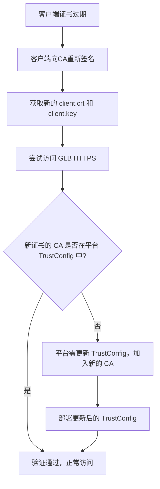

mTLS 平台中涉及证书更新（cert renew）时，平台和用户双方应该关注的关键点，我帮你进一步结构化和补充细节，以便更好地理解：

---

## **✅ 场景背景**

- 平台使用 **GCP HTTPS Global Load Balancer (GLB)** 实现 mTLS。
- 通过 **Google Certificate Manager** 配置 TrustConfig 来管理客户端证书的信任链，包括 **Root CA** 和 **Intermediate CA**。
- 启用了客户端证书的 **验证机制**，并基于证书的 **Common Name（CN）** 做精细化校验。

---

## **🎯 用户“证书更新”（Cert Renew）意味着什么？**

对客户端用户来说，“renew certificate” 通常是指 **客户端证书过期或即将过期**，用户需要：

1. 向自己的 CA（根或中间 CA）请求新的证书。
2. 生成新的客户端证书（包含公钥）并搭配已有或新生成的私钥。
3. 在使用时用 curl -v --cert client.crt --key client.key https://api.domain.com 验证连通性。

### **⚠️ 注意：**

- 根 CA 和中间 CA 证书通常是长周期有效（如 5-10 年），很少更新。
- 客户端证书有效期一般为几个月至一两年，因此经常需要“renew”。

---

## **🧠 平台在 Cert Renew 中的职责是什么？**

通常平台在用户续签证书的过程中 **不需要做任何变更**，只要满足以下条件：

### **✅ 前提条件：**

1. **新客户端证书仍由当前受信任的 Root 或 Intermediate CA 签发**（即 TrustConfig 中已列出的 CA）。
2. **CN 保持不变**（如果你平台用 CN 做精确身份绑定）。

### **✅ 那么平台只需要：**

- **不做任何操作**，只要 TrustConfig 没变，用户新证书就能直接被验证通过。

---

## **🔁 如果 Root 或 Intermediate CA 更新了怎么办？**

这时平台才需要做如下操作：

1. **重新生成 CA 证书的 fingerprint**（SHA256）。
2. **更新 TrustConfig** 文件，加入新的 root 或 intermediate。
3. 使用命令更新 GCP 的 Certificate Manager 配置（例如 gcloud certificate-manager trust-configs update）。
4. 部署后确保新老证书都在 TrustConfig 中，避免中断。

---

## **✅ 一个总结流程图（Mermaid）**

---

## **📝 总结**

| **角色** | **事件**                 | **是否需平台操作** | **说明**                                          |
| -------- | ------------------------ | ------------------ | ------------------------------------------------- |
| 客户端   | 仅更新 client cert       | 否                 | 只要 CN 和签发链未变，平台 TrustConfig 不需要改动 |
| 平台     | Root / Intermediate 变更 | 是                 | 需更新 TrustConfig、fingerprint，并重新部署       |
| 平台     | 校验 CN                  | 否（配置好即可）   | 平台会自动校验 CN，匹配策略即可生效               |

---

如果你对 fingerprint 的生成、TrustConfig 的更新、或如何自动化管理这部分有兴趣，我可以继续帮你整理相关脚本或策略。
