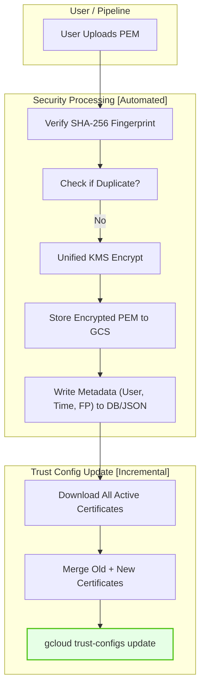

# Trust Config 证书更新与存储策略探索 (Explorer Update Cert)

## 1. 问题分析

在管理 GCP mTLS Trust Config 时，核心挑战在于平衡 **自动化能力**、**安全性** 与 **运维复杂度**。您当前面临的问题本质上是如何在不引起“KMS 爆炸”的前提下，实现安全可审计的证书增量更新流程。

---

## 2. 核心疑问解答

### Q1: 用户是否有必要更新 Trust Config？
**结论：绝对有必要且必须支持。**

*   **业务连续性**：证书轮换（Rotation）是 PKI 的常态。如果不支持自助/自动化更新，平台将成为业务上线的瓶颈。
*   **安全应急**：当某个 CA 或客户端证书泄露时，需要立即通过更新 Trust Config 来移除受损 CA 或添加白名单进行过滤。
*   **合规要求**：很多行业标准（如 PCI-DSS）对证书有效期有严格限制，频繁的轮换需要标准化的更新流程支持。

### Q2: 是否有必要存储用户上传的证书？需要加密吗？
**结论：必须存储（为了自动化），且必须加密（为了合规）。**

*   **为什么要存？**
    *   **增量更新逻辑需求**：GCP `trust-configs import/update` 命令是**覆盖式**的。为了实现“增量”，您必须在运行命令前，将“历史已有的证书”与“新上传的证书”进行合并。如果不存原始证书，由于 Trust Config 资源不易直接通过 API “读回”完整的 PEM（安全考虑），您将失去合并的基础。
    *   **审计与回放**：当出现连接问题时，存储的证书及其指纹（Fingerprint）是排查“用户到底传了什么”的唯一证据。
*   **存储哪里？**
    *   **推荐：GCS Bucket**。利用 IAM 权限隔离，结合 Lifecycle Policy（自动清理过期备份）。
    *   **禁止：GitHub**。即便加密，将原始证书存放在版本控制库中也会增加泄露面积，且不符合大规模自动化流水线的最佳实践。

### Q3: 如何优化加密实现逻辑（KMS 简化）？
**结论：采用“统一 Key + IAM 隔离”代替“每环境一 Key”。**

您过去的痛苦源于 **Key 过度细分**。在 GCP 中，环境隔离应该是由 **Project** 或 **IAM 权限**实现的，而不是 Key 的数量。

#### 推荐方案：统一 KMS + Envelope Encryption (信封加密)

1.  **统一 KMS Key**：在项目级管理一个跨环境或分环境的 `mtls-cert-key`。
2.  **身份即防线**：
    *   Dev Pipeline 只能调用该 Key 加密 Dev 环境的 Bucket。
    *   Prod Pipeline 只有权限解密 Prod 环境的证书。
3.  **Envelope Encryption 流程**：
    *   生成一个随机的 **DEK (Data Encryption Key)**。
    *   用 DEK 加密证书。
    *   用 **KMS KEK (Key Encryption Key)** 加密 DEK。
    *   将 `[加密后的证书] + [加密后的 DEK]` 存入 GCS。
    *   **优势**：解耦了加密行为与物理 Key 的数量，运维简单。

---

## 3. 推荐实现流程



---

## 4. 总结与建议

| 维度 | 建议方案 | 理由 |
| :--- | :--- | :--- |
| **存储策略** | **GCS Bucket** (加密) | 支持大规模自动化，支持 IAM 精细控制。 |
| **元数据记录** | **必选** (Fingerprint, Time, Principal) | 解决“谁在什么时候更新了什么”的审计问题。 |
| **加密实现** | **统一 KMS Key + Envelope Encryption** | 大幅降低运维复杂度，避免 Key 爆炸。 |
| **更新逻辑** | **脚本合并 + Update** | 绕过 GCP API 的覆盖限制，确保更新不中断旧业务。 |

> [!IMPORTANT]
> **记录“更新时间”和“证书指纹”的意义在于：**
> 1. **排他性校验**：防止同一证书被重复导入。
> 2. **合规审计**：记录证书生命周期的完整轨迹。
> 3. **版本回滚**：如果新证书导致服务中断，可以根据元数据记录迅速定位并回滚到上一个稳定版本的证书集。

---

---

## 5. 极简加密方案 (Simplified Encryption)

如果您希望进一步简化流程，避免在 Pipeline 脚本中显式调用 `gcloud kms encrypt`，可以采用以下两种更轻量级的方式。

### 方案 A：GCS CMEK 静态加密 (最推荐)
这是最简单的方案，因为它对 Pipeline 脚本完全透明。

*   **实现原理**：在 GCS Bucket 级别配置 **CMEK (Customer-Managed Encryption Keys)**。
*   **操作方式**：
    1.  创建一个统一的 KMS Key (例如 `key-mtls-storage`)。
    2.  将该 Key 设置为 GCS Bucket 的默认加密密钥。
    3.  **Pipeline 脚本无需改动**：只需像平常一样 `gsutil cp` 原始 PEM 文件。GCS 会在接收到文件时自动使用该 Key 进行加密后再存盘；读取时自动解密。
*   **优点**：
    *   **零脚本改动**：Pipeline 逻辑保持不变。
    *   **环境解耦**：解密权限通过 IAM 授予 Pipeline 的 Service Account，而不是在脚本里硬编码 Key 路径。

### 方案 B：IAM 保护下的明文存储 (可接受)
考虑到存储的是 `CA` 和 `Client Cert` (仅包含公钥)，而不是 `Private Key`，在非高敏感场景下可以进一步降低复杂度。

*   **实现原理**：依靠 GCP 默认的基础设施加密 (Encryption at REST) + 严苛的 IAM 权限。
*   **操作方式**：
    1.  不对 PEM 文件进行额外的手动加密。
    2.  通过 **IAM 策略** 严格限制谁能读取该 Bucket (例如：仅 Pipeline SA 可读)。
    3.  开启 **GCS Data Access Logs**，审计任何对证书文件的访问行为。
*   **优点**：极致简单，性能最高。

### 方案对比

| 维度 | 方案 A (GCS CMEK) | 方案 B (IAM Only) | 原方案 (Envelope Encryption) |
| :--- | :--- | :--- | :--- |
| **Pipeline 复杂度** | 无需改动 (透明) | 无需改动 | 较高 (需调用加密指令) |
| **运维成本** | 极低 (一劳永逸) | 零成本 | 较高 (需维护 Key 生命周期) |
| **安全级别** | 高 (符合大部分合规要求) | 中 (依靠权限控制) | 极高 (多层防护) |
| **适用场景** | **您的首选方案** | 内部非敏感项目 | 金融级/核心密钥库 |

## 6. 最终建议：如何选择？

对于您目前“用户上传 CA 和 Cert”的场景，**方案 A (GCS CMEK)** 是最优解：

1.  它利用了 GCP 平台原生能力，把“加密”这个动作从您的**逻辑代码**中剥离，变成了**基础设施配置**。
2.  您不再需要关心不同环境用什么 Key，只需要在不同环境的 Bucket 上各挂载一个对应的 KMS Key 即可（一次性配置，无需维护脚本逻辑）。
3.  它保留了加密的实质（数据在盘上是加密的），同时消除了运维“爆炸”的痛苦。

---

## 7. 针对您现有 KMS Key 的具体操作步骤

您提供的 KMS Key：
`projects/project0d/locations/europe-west2/keyRings/cloudStorage/cryptoKeys/cloudStorage`

完全可以胜任此任务。以下是配置 GCS Bucket 自动使用此 Key 进行加密的具体步骤：

### 第一步：获取 GCS 服务账号 (Service Agent)
GCS 需要权限才能使用您的 KMS Key。首先获取该项目的 GCS 服务账号。

```bash
# 获取 GCS 服务账号推送到变量
SERVICE_ACCOUNT=$(gsutil kms serviceaccount -p project0d)
echo $SERVICE_ACCOUNT
```
输出通常类似于：`service-12345678@gs-project-accounts.iam.gserviceaccount.com`

### 第二步：授予 KMS 权限
授予 GCS 服务账号对该 Key 的“加密/解密”权限。

```bash
gcloud kms keys add-iam-policy-binding cloudStorage \
    --location=europe-west2 \
    --keyring=cloudStorage \
    --project=project0d \
    --member="serviceAccount:${SERVICE_ACCOUNT}" \
    --role="roles/cloudkms.cryptoKeyEncrypterDecrypter"
```

### 第三步：设置 Bucket 默认加密密钥
将此 Key 绑定到存放证书的 Bucket 上（例如 `gs://your-ca-bucket`）。

```bash
# 设置默认 KMS Key
gsutil kms encryption -k \
    projects/project0d/locations/europe-west2/keyRings/cloudStorage/cryptoKeys/cloudStorage \
    gs://your-ca-bucket
```

### 第四步：验证配置
上传一个测试证书，检查其加密状态。

```bash
# 1. 上传文件
gsutil cp test-cert.pem gs://your-ca-bucket/

# 2. 检查元数据
gsutil ls -L gs://your-ca-bucket/test-cert.pem | grep "KMS key"
```
**预期输出**：应显示您指定的 KMS Key 路径，这证明文件在进入 Bucket 时已被自动加密。

### ⚠️ 重要澄清：针对“文件”还是“Bucket”？

这是一个非常关键的设计细节，请务必关注：

1.  **加密是针对每一个文件的**：
    虽然我们在 Bucket 上配置了“默认 KMS Key”，但实际上 **GCS 是对存储在 Bucket 里的每一个对象（Object / 文件）独立进行加密的**。这意味着您的每一个 CA 证书文件在物理磁盘上都是用该 KMS Key 产生的子密钥加密存储的。

2.  **默认 Key 的生效逻辑**：
    *   **新上传的文件**：会自动继承 Bucket 的默认 Key 进行加密。
    *   **历史存量文件**：如果您在配置之前已经上传过一些证书，**它们不会自动被重新加密**。

3.  **如何处理历史文件？**
    如果您需要把 Bucket 里现有的文件也改为使用该 KMS Key 加密，需要执行一次“同步”操作：
    ```bash
    # 强制将现有文件重新写入并应用新的加密配置
    gsutil rewrite -k \
        projects/project0d/locations/europe-west2/keyRings/cloudStorage/cryptoKeys/cloudStorage \
        gs://your-ca-bucket/**
    ```

### 验证“文件级”加密
您可以针对特定文件执行以下命令，确认该文件（对象）是否已被加密：
```bash
# 查看特定证书文件的详细加密信息
gsutil stat gs://your-ca-bucket/your-cert.pem
```
在输出中，您会看到 `kms_key: ...` 字段，这直接证明了该**文件本身**正处于您的 KMS Key 保护之下。

---

## 8. “正规化”客户端加密方案 (Client-Side Encryption)

如果您担心 GCS 的透明加密（CMEK）对具备 Bucket 权限的用户来说“过于无感”或者“不够正规”，希望实现**即使文件被下载也无法被肉眼读取**的效果，可以采用以下**客户端手动加密（Pre-upload Encryption）**方案。

### 1. 核心思想：先加密，后上传
在证书进入 GCS 之前，在您的 Pipeline 运行环境中通过 KMS 将 PEM 明文转化为加密的二进制 Blob（Ciphertext）。

### 2. 操作流程示例

**A. 在 Pipeline 脚本里加密并上传：**
```bash
# 1. 将 PEM 文本文档加密成二进制文件 (.enc)
gcloud kms encrypt \
    --project=project0d \
    --location=europe-west2 \
    --keyring=cloudStorage \
    --key=cloudStorage \
    --plaintext-file=client-cert.pem \
    --ciphertext-file=client-cert.pem.enc

# 2. 上传加密后的二进制文件 (此时 Bucket 里的文件是完全不可读乱码)
gsutil cp client-cert.pem.enc gs://your-ca-bucket/certs/
```

**B. 在更新 Trust Config 时解密并合并：**
您在执行增量更新脚本时，需要增加一步解密动作：
```bash
# 从 Bucket 下载二进制文件并即时解密回 PEM
gsutil cp gs://your-ca-bucket/certs/client-cert.pem.enc - | \
gcloud kms decrypt \
    --project=project0d \
    --location=europe-west2 \
    --keyring=cloudStorage \
    --key=cloudStorage \
    --ciphertext-file=- \
    --plaintext-file=- > temp-decrypted.pem
```

### 3. 为什么这个方案显得更“正规”？

*   **真正的“零信任”覆盖**：即便某个内部人员拥有 Bucket 的 `Storage Object Viewer` 权限，他下载下来的也只是一个被您的 KMS Key 锁定保护的二进制数据包（Encrypted Blob），没有 KMS 的解密权限（`cloudkms.cryptoKeyDecrypter`）就无法窥视证书内容。
*   **审计链更完整**：每一次查看证书内容的操作，都会在 KMS 的审计日志中留下明确的“解密（Decrypt）”记录，而不是简单的“下载（Read）”记录。
*   **分离加密资产与存储资产**：数据存放在 Bucket，而开启数据的钥匙（Key）存放在 KMS，实现了物理层面的职责分离。

### 4. 另一种“正规”选择：Secret Manager
如果您觉得操作文件（.enc）还是太繁琐，想要最正规、最现代化的体验，可以将 PEM 内容直接存入 **GCP Secret Manager**：
*   **体验**：就像访问环境变量或数据库密码一样管理证书。
*   **优势**：自带版本管理、自带强加密、自带极简的 IAM 控制，完全摆脱了“Bucket 权限管理混乱”的刻板印象。

### 结论
*   如果您希望**零代码改动**，且信任 IAM 对 Bucket 权限的控制 -> **选方案 7 (GCS CMEK)**。
*   如果您希望**极致安全**，实现落盘文件肉眼不可读取（即便下载也不行） -> **选方案 8 (KMS Encrypt)**。
---

## 9. KMS 权限验证与加密逻辑澄清

### 1. 为什么“仅有加密权限”不足以满足需求？

这是一个常见的误区。虽然您的初衷是“只管上传（写入）”，但在实际的 Trust Config 运维流程中，**解密权限是必不可少的**：

*   **增量更新（Merge）逻辑**：由于 GCP 的 Trust Config 更新是“全量覆盖”的，您的脚本必须能够从 GCS 下载旧证书并解密，然后才能将它们与新证书合并。如果没有解密权限，脚本将无法读取旧证书内容，导致增量更新失败。
*   **运维排查**：如果连接出现故障，SRE 需要能够从 Bucket 提取并查看当前生效的证书。
*   **GCS 平台管理**：如果您开启了 CMEK (方案 7)，GCS 服务账号为了维护对象（如元数据更新、重写、删除确认），也必须同时拥有加密和解密权限。

### 2. 权限验证脚本 (Test Script)

您可以使用以下脚本快速验证执行环境（例如您的本地机器或 Pipeline SA）是否具备对指定 Key 的读写权限。

```bash
#!/bin/bash
# KMS 权限自动化验证脚本

KMS_KEY="projects/project0d/locations/europe-west2/keyRings/cloudStorage/cryptoKeys/cloudStorage"
TEST_DATA="KMS_Permission_Test_$(date +%s)"
PLAIN_FILE="test_plain.txt"
ENC_FILE="test_enc.bin"
DEC_FILE="test_dec.txt"

echo "1. 检查 IAM Policy 绑定情况..."
gcloud kms keys get-iam-policy cloudStorage \
    --location=europe-west2 \
    --keyring=cloudStorage \
    --project=project0d | grep -E "(roles/cloudkms.cryptoKeyEncrypterDecrypter|roles/cloudkms.cryptoKeyEncrypter|roles/cloudkms.cryptoKeyDecrypter)"

echo "2. 尝试执行【加密】测试..."
echo "$TEST_DATA" > "$PLAIN_FILE"
if gcloud kms encrypt --key="$KMS_KEY" --plaintext-file="$PLAIN_FILE" --ciphertext-file="$ENC_FILE" >/dev/null 2>&1; then
    echo "✅ 加密权限: 正常"
else
    echo "❌ 加密权限: 失败 (权限缺失)"
fi

echo "3. 尝试执行【解密】测试..."
if gcloud kms decrypt --key="$KMS_KEY" --ciphertext-file="$ENC_FILE" --plaintext-file="$DEC_FILE" >/dev/null 2>&1; then
    RESULT=$(cat "$DEC_FILE")
    if [ "$RESULT" == "$TEST_DATA" ]; then
        echo "✅ 解密权限: 正常 (数据校验一致)"
    else
        echo "❌ 解密权限: 异常 (解密数据损坏)"
    fi
else
    echo "❌ 解密权限: 失败 (权限缺失)"
fi

# 清理临时文件
rm -f "$PLAIN_FILE" "$ENC_FILE" "$DEC_FILE"
```

### 3. 操作流程总结（终极版）

*   **配置层**：确保 GCS 服务账号和 Pipeline SA 都拥有 `roles/cloudkms.cryptoKeyEncrypterDecrypter`。
*   **Pipeline 层**：执行上述验证脚本，确保一切就绪后再开始自动化证书管理。
