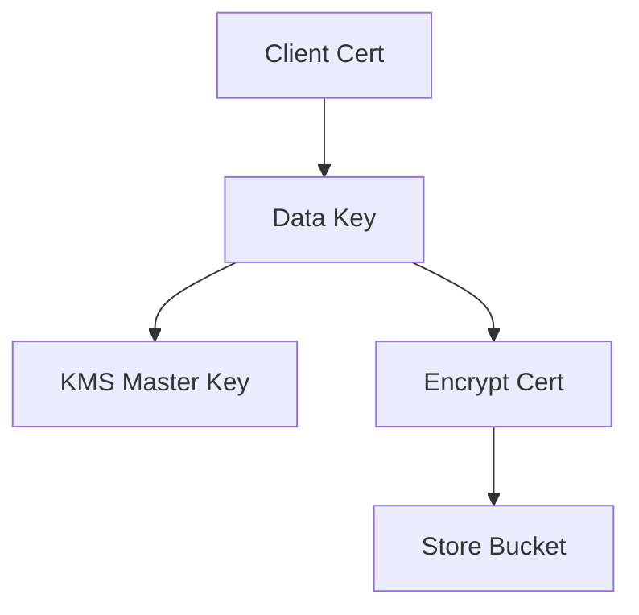

问题分析

你现在本质在思考 3 个层面的问题：
	1.	Trust Config 是否需要用户自行更新
	2.	是否需要保存用户证书（以及是否要加密）
	3.	如果需要加密，KMS / 多环境 Key 的设计是否有更优解

这三个问题其实对应三种职责划分：

层级	本质问题	决策关键点
平台职责	是否允许用户更新 Trust Config	安全边界 / 合规
数据职责	是否保存证书	审计 / 回溯 / 自动化
加密职责	如何加密	运维复杂度 / Key 管理成本

⸻

1. 用户是否有必要更新 Trust Config

结论：有必要，但要有边界

Trust Config 更新的核心原因：
	•	证书轮换（Rotation）
	•	证书吊销（Revocation）
	•	新增客户端
	•	合规要求（有效期缩短）

如果平台不允许用户更新：
	•	你必须承担所有更新责任
	•	会形成运维瓶颈
	•	不可扩展

推荐模型

模式 A：平台托管（强控制）
	•	用户提交证书
	•	平台审核
	•	平台更新 Trust Config
	•	适合金融 / 高安全行业

模式 B：用户自助 + 平台校验（推荐）
	•	用户上传证书
	•	平台自动校验
	•	自动更新 Trust Config
	•	有审计日志

⸻

2. 是否需要存储用户证书

必须区分两种“存储”

类型	是否必须	说明
原始证书	❌ 不必须	可不存
指纹 / 元数据	✅ 必须	审计 / 回溯

推荐最小存储集

fingerprint
serial number
issuer
valid from / to
user id
更新时间
操作人

存原始证书的风险
	•	合规风险
	•	泄露风险
	•	运维复杂
	•	GitHub 特别不推荐

⸻

3. 是否需要加密存储证书

如果你 存原始证书 → 必须加密

如果只存 fingerprint → 不需要

⸻

4. KMS 设计问题（核心）

你现在的问题本质：

每个环境一个 KMS Key → 运维爆炸

这是典型的 Key 过度细分问题

⸻

推荐加密架构

单项目多环境统一 Key（推荐）

Project KMS
 ├── key-mtls-client
 ├── key-mtls-server

通过 IAM 权限控制环境，而不是 Key 数量。

⸻

进阶模型：Envelope Encryption

优点：
	•	KMS 调用少
	•	成本低
	•	统一 Key
	•	可审计

⸻

存储位置建议

存储位置	是否推荐	原因
GCS Bucket	✅ 推荐	IAM + Lifecycle
Secret Manager	⚠ 可选	成本高
GitHub	❌ 不推荐	泄露风险

⸻

推荐整体流程

graph TD
    A["User Upload Cert"] --> B["平台校验"]
    B --> C["生成 Fingerprint"]
    C --> D["写入 Metadata DB"]
    B --> E["可选加密"]
    E --> F["GCS Bucket"]
    B --> G["Update Trust Config"]

⸻

你真正需要记录的“意义”

你提到的点是对的，但可以更精确：

必须记录的不是证书本身，而是：
	•	谁更新
	•	什么时候更新
	•	更新了什么
	•	是否生效
	•	有无回滚

这叫 证书生命周期审计（Certificate Lifecycle Audit）

⸻

最优实践总结

必做
	•	Fingerprint 存储
	•	更新时间记录
	•	操作人记录
	•	Trust Config 自动化更新
	•	IAM 控制

可选
	•	原始证书加密存储
	•	Envelope Encryption
	•	GCS Lifecycle

不推荐
	•	GitHub 存证书
	•	每环境一个 KMS Key
	•	手动更新 Trust Config

⸻

简化后的最佳模型（一句话）

只存 Fingerprint + Metadata，原始证书可选加密存 GCS，统一 KMS Key，通过 IAM 控制环境权限，而不是 Key 数量。

这样你同时解决：
	•	合规
	•	运维复杂度
	•	可审计
	•	可扩展
	•	自动化能力

而且不会让 Key 管理变成灾难。